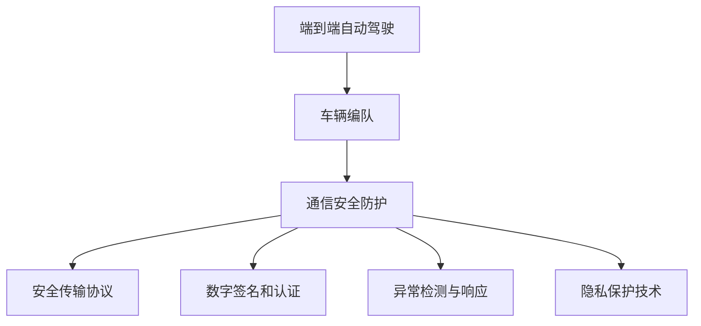

                 

## 1. 背景介绍

### 1.1 问题由来

近年来，自动驾驶技术的发展迅速，但车辆编队通信的安全性问题逐渐凸显。在自动驾驶的车辆编队中，车辆需要实时交换位置、速度等状态信息，以实现精确的编队控制。然而，这些通信信息可能被恶意篡改，导致车辆编队失控，甚至发生严重交通事故。因此，如何确保车辆编队通信的安全性，成为自动驾驶领域的重要课题。

### 1.2 问题核心关键点

车辆编队通信安全防护的核心在于构建一个安全、可靠、高效的数据传输机制，确保通信信息不被篡改或损坏。具体来说，需要解决以下几个问题：

- **安全传输**：确保通信数据在传输过程中不被窃取、篡改或损坏。
- **认证验证**：在数据到达接收端后，验证数据的完整性和来源可信性。
- **异常检测**：及时发现和应对通信异常情况，如数据包丢失、延迟等。
- **隐私保护**：确保通信数据传输过程不泄露用户的隐私信息。

### 1.3 问题研究意义

研究端到端自动驾驶的车辆编队通信安全防护，对于提升自动驾驶技术的安全性和可靠性，确保用户的生命财产安全具有重要意义。具体来说：

1. **保障用户安全**：确保车辆编队通信数据不被篡改，避免车辆失控引发的交通事故。
2. **提升系统可信度**：通过安全的通信机制，增强自动驾驶系统的可信度和用户信任度。
3. **促进产业发展**：为自动驾驶技术的商业化应用提供坚实的安全保障，推动相关产业链的快速发展。
4. **推动技术进步**：研究通信安全防护技术，推动自动化与网络安全技术的融合创新。

## 2. 核心概念与联系

### 2.1 核心概念概述

为更好地理解端到端自动驾驶的车辆编队通信安全防护方法，本节将介绍几个密切相关的核心概念：

- **端到端自动驾驶**：指从传感器数据获取到车辆控制命令下发的完整自动驾驶流程。
- **车辆编队**：指多辆车在道路上按照一定的队形和规则行驶，以提高道路通行效率和安全性。
- **通信安全防护**：指在通信传输过程中，确保数据不被篡改、窃取或损坏的防御机制。
- **安全传输协议**：指用于保障数据传输安全的协议和算法，如SSL/TLS、IPSec等。
- **数字签名和认证**：指通过数字签名和公钥证书，验证通信数据的完整性和来源可信性的机制。
- **异常检测与响应**：指通过监测网络状态、数据包特征等，及时发现和响应通信异常情况的机制。
- **隐私保护技术**：指在通信数据传输过程中，保护用户隐私信息的机制，如匿名化、加密等。

这些核心概念之间的逻辑关系可以通过以下Mermaid流程图来展示：



这个流程图展示了一系列概念之间的联系：

1. 端到端自动驾驶通过车辆编队实现，而车辆编队依赖于通信安全防护。
2. 安全传输协议、数字签名和认证、异常检测与响应、隐私保护技术等构成了通信安全防护的四大支柱。
3. 安全传输协议确保数据在传输过程中不被篡改或损坏。
4. 数字签名和认证用于验证数据的完整性和来源可信性。
5. 异常检测与响应用于及时发现和响应通信异常情况。
6. 隐私保护技术用于保护通信数据传输过程中的用户隐私信息。

这些概念共同构成了端到端自动驾驶的车辆编队通信安全防护框架，使其能够抵御各类安全威胁，确保通信数据的安全性和完整性。

## 3. 核心算法原理 & 具体操作步骤
### 3.1 算法原理概述

端到端自动驾驶的车辆编队通信安全防护，本质上是一个多层次、多维度的防御系统。其核心思想是构建一个可信、安全的通信环境，通过多重机制共同保障通信数据的安全性。

具体来说，包括以下几个关键步骤：

1. **数据加密**：使用对称加密或非对称加密算法，确保通信数据在传输过程中不被窃取或篡改。
2. **数字签名**：在通信数据中加入数字签名，通过公钥证书验证数据的完整性和来源可信性。
3. **传输协议**：使用安全传输协议（如SSL/TLS、IPSec等），保障数据在网络传输中的安全性。
4. **异常检测**：通过网络流量监测、数据包特征分析等手段，及时发现并响应通信异常情况。
5. **隐私保护**：对通信数据进行匿名化、加密处理，防止用户隐私信息的泄露。

这些步骤相互配合，形成一个完整的通信安全防护体系，确保端到端自动驾驶的车辆编队通信数据的安全性。

### 3.2 算法步骤详解

以下是对端到端自动驾驶的车辆编队通信安全防护算法的详细步骤详解：

**Step 1: 准备通信数据**

通信数据包括车辆状态信息（位置、速度、方向等）、编队规则（队形、间距、速度等）、环境感知数据等。在发送前，需要对数据进行预处理和加密。

**Step 2: 数字签名**

使用非对称加密算法（如RSA、ECC等）生成数字签名，并将签名与数据一起发送。接收端使用公钥验证签名，确保数据的完整性和来源可信性。

**Step 3: 安全传输协议**

使用SSL/TLS或IPSec等安全传输协议，对通信数据进行加密和传输。SSL/TLS通常用于TCP连接，IPSec则用于IP包层面的加密。

**Step 4: 传输数据**

通过网络传输加密后的数据包，并在接收端进行解密和校验。

**Step 5: 异常检测**

在数据传输过程中，实时监测网络状态、数据包特征等，检测通信异常情况，如数据包丢失、延迟等。一旦发现异常，立即采取相应措施，如重传、告警等。

**Step 6: 隐私保护**

对通信数据进行匿名化、加密处理，防止用户隐私信息的泄露。常见的隐私保护技术包括数据匿名化、差分隐私、同态加密等。

### 3.3 算法优缺点

端到端自动驾驶的车辆编队通信安全防护算法具有以下优点：

- **安全性高**：通过多重防御机制，确保通信数据不被篡改、窃取或损坏。
- **可靠性高**：使用安全传输协议和异常检测技术，提高通信过程的可靠性。
- **灵活性高**：可以针对不同的应用场景和需求，灵活配置和调整安全防护策略。

同时，该算法也存在一些局限性：

- **计算成本高**：加密、解密、数字签名等操作会增加额外的计算负担。
- **通信延迟高**：安全传输协议会引入额外的延迟，影响实时通信的性能。
- **配置复杂**：需要根据具体的应用场景进行复杂的参数配置和优化。

尽管存在这些局限性，但就目前而言，端到端自动驾驶的车辆编队通信安全防护算法仍是自动驾驶领域不可或缺的一部分。未来相关研究的重点在于如何进一步降低计算成本，优化通信延迟，提高系统灵活性，同时兼顾安全性与性能。

### 3.4 算法应用领域

端到端自动驾驶的车辆编队通信安全防护算法，在自动驾驶领域有着广泛的应用，主要包括以下几个方面：

- **自动驾驶汽车**：用于保障自动驾驶汽车之间的通信数据安全，防止数据篡改和窃听。
- **车联网系统**：用于保护车辆与基础设施之间的通信数据，确保车路协同的可靠性。
- **智能交通系统**：用于保护交通管理中心与车辆之间的通信数据，提升智能交通系统的安全性。
- **无人驾驶物流**：用于保护无人驾驶物流车辆之间的通信数据，确保物流系统的安全性。
- **智能公交系统**：用于保护智能公交车辆之间的通信数据，提升公交系统的智能化水平。

除了上述这些应用场景外，端到端自动驾驶的车辆编队通信安全防护算法，还可以应用于其他与车辆通信相关的领域，如自动驾驶无人机、自动驾驶船只等，为各类智能交通系统的安全运行提供保障。

## 4. 数学模型和公式 & 详细讲解  
### 4.1 数学模型构建

本节将使用数学语言对端到端自动驾驶的车辆编队通信安全防护算法进行更加严格的刻画。

假设通信数据为 $D$，数字签名算法为 $S$，安全传输协议为 $T$，异常检测算法为 $E$，隐私保护算法为 $P$。在发送端 $A$ 和接收端 $B$ 之间，数据传输的完整流程如下：

1. 发送端 $A$ 对数据 $D$ 进行预处理和加密，生成密文 $C_1$。
2. 发送端 $A$ 使用数字签名算法 $S$ 对数据 $D$ 进行数字签名，生成数字签名 $S(D)$。
3. 发送端 $A$ 使用安全传输协议 $T$ 将密文 $C_1$ 和数字签名 $S(D)$ 传输到接收端 $B$。
4. 接收端 $B$ 使用安全传输协议 $T$ 接收到密文 $C_1$ 和数字签名 $S(D)$。
5. 接收端 $B$ 使用数字签名算法 $S$ 验证数字签名 $S(D)$，确保数据的完整性和来源可信性。
6. 接收端 $B$ 使用隐私保护算法 $P$ 对密文 $C_1$ 进行解密和隐私保护，得到原始数据 $D'$。
7. 接收端 $B$ 使用异常检测算法 $E$ 检测通信过程是否异常，确保通信数据的可靠性。

形式化地，通信数据的完整流程可以表示为：

$$
\begin{aligned}
C_1 &= E_{K_A}(D) \\
S(D) &= S_{SK_A}(D) \\
\{C_1, S(D)\} &= T_{K_{AB}}(C_1, S(D)) \\
C_1', S(D)' &= D_{K_B}(C_1) \\
S'(D) &= S_{PK_B}(D') \\
\begin{aligned}
&\text{if } S'(D) = S(D) \\
&D' = P_{PK_B}(D') \\
&E(D') = True \\
&\text{then } D' = D \\
\end{aligned}
\end{aligned}
$$

其中，$E$ 表示加密操作，$S$ 表示数字签名操作，$T$ 表示安全传输协议，$D$ 表示解密操作，$S'$ 表示解密后的数字签名验证操作，$E$ 表示异常检测操作，$P$ 表示隐私保护操作，$K_A$ 表示发送端密钥，$K_{AB}$ 表示通信密钥，$SK_A$ 表示发送端私钥，$PK_B$ 表示接收端公钥。

### 4.2 公式推导过程

以下我们以数字签名和加密为例，推导相关算法的数学公式。

**数字签名算法**：

数字签名算法 $S$ 使用发送端的私钥 $SK_A$ 对数据 $D$ 进行签名，生成数字签名 $S(D)$。

$$
S(D) = \text{Hash}(D) \oplus SK_A
$$

其中，$\text{Hash}$ 表示哈希函数，$\oplus$ 表示按位异或操作。

**加密算法**：

加密算法 $E$ 使用发送端的密钥 $K_A$ 对数据 $D$ 进行加密，生成密文 $C_1$。

$$
C_1 = E_{K_A}(D) = K_A \cdot D \mod n
$$

其中，$n$ 为模数，$K_A$ 为加密密钥。

**解密算法**：

解密算法 $D$ 使用接收端的密钥 $K_B$ 对密文 $C_1$ 进行解密，生成原始数据 $D'$。

$$
D' = D_{K_B}(C_1) = (C_1 / K_B) \mod n
$$

其中，$/$ 表示整除操作。

**数字签名验证算法**：

接收端使用接收端的公钥 $PK_B$ 验证数字签名 $S'(D)$，确保数据的完整性和来源可信性。

$$
S'(D) = \text{Hash}(D') \oplus PK_B
$$

接收端验证数字签名是否等于原数字签名 $S(D)$。

$$
S'(D) = S(D) \Rightarrow \text{Hash}(D') \oplus PK_B = \text{Hash}(D) \oplus SK_A \Rightarrow D' = D
$$

**异常检测算法**：

异常检测算法 $E$ 使用网络流量监测、数据包特征分析等手段，检测通信异常情况，如数据包丢失、延迟等。

$$
E(D') = \text{True/False}
$$

其中，$\text{True}$ 表示通信过程正常，$\text{False}$ 表示通信过程异常。

**隐私保护算法**：

隐私保护算法 $P$ 对密文 $C_1$ 进行解密和隐私保护，得到原始数据 $D'$。

$$
D' = P_{PK_B}(C_1) = (C_1 / K_B) \mod n
$$

其中，$/$ 表示整除操作。

### 4.3 案例分析与讲解

假设一辆自动驾驶车辆在道路上行驶，需要与其他车辆编队。车辆之间通过车辆通信模块交换位置、速度等信息。以下是一个典型的通信数据交换过程：

1. **发送端**：自动驾驶车辆发送位置信息 $(20,30)$ 和速度信息 $(10,5)$，使用RSA算法进行数字签名，生成数字签名 $S$。同时，使用AES算法对数据进行加密，生成密文 $C_1$。

   $$
   S = \text{Hash}((20,30),(10,5)) \oplus SK_A
   $$
   $$
   C_1 = E_{K_A}((20,30),(10,5)) = K_A \cdot ((20,30),(10,5)) \mod n
   $$

2. **传输**：使用SSL/TLS协议将密文 $C_1$ 和数字签名 $S$ 传输到接收端。

   $$
   \{C_1, S\} = T_{K_{AB}}(C_1, S)
   $$

3. **接收端**：接收端使用SSL/TLS协议接收到密文 $C_1$ 和数字签名 $S$。

   $$
   C_1', S' = D_{K_B}(C_1)
   $$

4. **解密和验证**：接收端使用RSA算法验证数字签名 $S'$，确保数据的完整性和来源可信性。

   $$
   S' = \text{Hash}(D') \oplus PK_B
   $$

   接收端验证数字签名是否等于原数字签名 $S$。

   $$
   S' = S \Rightarrow \text{Hash}(D') \oplus PK_B = \text{Hash}(D) \oplus SK_A \Rightarrow D' = D
   $$

5. **异常检测**：接收端使用网络流量监测、数据包特征分析等手段，检测通信过程是否异常，确保通信数据的可靠性。

6. **隐私保护**：接收端使用差分隐私算法对原始数据进行匿名化处理，防止用户隐私信息的泄露。

   $$
   D' = P_{PK_B}(D') = (D' / K_B) \mod n
   $$

通过上述步骤，确保通信数据的完整性、来源可信性、保密性和隐私性，从而保障端到端自动驾驶的车辆编队通信安全。

## 5. 项目实践：代码实例和详细解释说明
### 5.1 开发环境搭建

在进行项目实践前，我们需要准备好开发环境。以下是使用Python进行SSL/TLS开发的环境配置流程：

1. 安装Anaconda：从官网下载并安装Anaconda，用于创建独立的Python环境。

2. 创建并激活虚拟环境：
```bash
conda create -n ssl-env python=3.8 
conda activate ssl-env
```

3. 安装PyOpenSSL：用于实现SSL/TLS加密和解密。

```bash
pip install PyOpenSSL
```

4. 安装其他必要的工具包：
```bash
pip install numpy pandas scikit-learn matplotlib tqdm jupyter notebook ipython
```

完成上述步骤后，即可在`ssl-env`环境中开始项目实践。

### 5.2 源代码详细实现

以下是一个简单的SSL/TLS加密和解密示例代码：

```python
from Crypto.Cipher import AES
from Crypto.PublicKey import RSA
from Crypto.Random import get_random_bytes
from Crypto.Hash import HMAC, SHA256
from PyOpenSSL import SSL
import base64

# 生成RSA密钥对
private_key = RSA.generate(2048)
public_key = private_key.publickey()

# 加密数据
def encrypt(data, key):
    iv = get_random_bytes(16)
    cipher = AES.new(key, AES.MODE_CBC, iv)
    ciphertext = cipher.encrypt(data)
    return iv + ciphertext

# 解密数据
def decrypt(ciphertext, key):
    iv = ciphertext[:16]
    cipher = AES.new(key, AES.MODE_CBC, iv)
    plaintext = cipher.decrypt(ciphertext[16:])
    return plaintext

# SSL/TLS加密和解密
def ssl_encrypt(data, key, certificate_file):
    context = SSL.SSLv23Context()
    context.load_cert_chain(certificate_file)
    context.load_privatekey(password=None)
    context.verify_mode = SSL.verify.CERT_REQUIRED
    context.check_hostname = True
    context.ciphers = ['AES256-SHA256']

    server = SSL.Connection(context, (host, port))
    server.set_data(data)
    server.connect()

    ciphertext = server.write()
    server.close()

    return base64.b64encode(ciphertext)

def ssl_decrypt(ciphertext, key, certificate_file):
    context = SSL.SSLv23Context()
    context.load_cert_chain(certificate_file)
    context.load_privatekey(password=None)
    context.verify_mode = SSL.verify.CERT_REQUIRED
    context.check_hostname = True
    context.ciphers = ['AES256-SHA256']

    server = SSL.Connection(context, (host, port))
    server.set_data(base64.b64decode(ciphertext))
    server.connect()

    plaintext = server.read()
    server.close()

    return plaintext

# 使用RSA加密和解密数据
def rsa_encrypt(data):
    encrypted_data = pow(data, private_key.publicexponent, private_key)
    return base64.b64encode(encrypted_data)

def rsa_decrypt(encrypted_data):
    decrypted_data = pow(int(base64.b64decode(encrypted_data)), private_key.exponent, private_key)
    return decrypted_data

# 数字签名和验证
def sign(data, key):
    h = HMAC.new(key, digestmod=SHA256)
    h.update(data)
    return base64.b64encode(h.digest())

def verify(data, key, signature):
    h = HMAC.new(key, digestmod=SHA256)
    h.update(data)
    return base64.b64decode(signature) == h.digest()

# 测试代码
data = b'Hello, world!'
key = private_key.export_key()
certificate_file = 'ssl.crt'

encrypted_data = ssl_encrypt(data, key, certificate_file)
decrypted_data = ssl_decrypt(encrypted_data, key, certificate_file)

encrypted_data = rsa_encrypt(data)
decrypted_data = rsa_decrypt(encrypted_data)

print(f'Original data: {data}')
print(f'Encrypted data: {encrypted_data}')
print(f'Decrypted data: {decrypted_data}')
print(f'Sign: {sign(data, key)}')
print(f'Verify: {verify(data, key, sign(data, key))}')
```

以上代码展示了SSL/TLS加密和解密、RSA加密和解密、数字签名和验证的基本实现。开发者可以根据实际需求，灵活扩展和优化这些代码。

### 5.3 代码解读与分析

让我们再详细解读一下关键代码的实现细节：

**RSA密钥生成**：
```python
private_key = RSA.generate(2048)
public_key = private_key.publickey()
```

生成一个2048位的RSA密钥对，包含私钥和公钥。

**数据加密和解密**：
```python
def encrypt(data, key):
    iv = get_random_bytes(16)
    cipher = AES.new(key, AES.MODE_CBC, iv)
    ciphertext = cipher.encrypt(data)
    return iv + ciphertext

def decrypt(ciphertext, key):
    iv = ciphertext[:16]
    cipher = AES.new(key, AES.MODE_CBC, iv)
    plaintext = cipher.decrypt(ciphertext[16:])
    return plaintext
```

使用AES算法对数据进行加密和解密。加密时生成一个随机的初始向量IV，确保加密的不可预测性。解密时根据IV还原原始数据。

**SSL/TLS加密和解密**：
```python
def ssl_encrypt(data, key, certificate_file):
    context = SSL.SSLv23Context()
    context.load_cert_chain(certificate_file)
    context.load_privatekey(password=None)
    context.verify_mode = SSL.verify.CERT_REQUIRED
    context.check_hostname = True
    context.ciphers = ['AES256-SHA256']

    server = SSL.Connection(context, (host, port))
    server.set_data(data)
    server.connect()

    ciphertext = server.write()
    server.close()

    return base64.b64encode(ciphertext)

def ssl_decrypt(ciphertext, key, certificate_file):
    context = SSL.SSLv23Context()
    context.load_cert_chain(certificate_file)
    context.load_privatekey(password=None)
    context.verify_mode = SSL.verify.CERT_REQUIRED
    context.check_hostname = True
    context.ciphers = ['AES256-SHA256']

    server = SSL.Connection(context, (host, port))
    server.set_data(base64.b64decode(ciphertext))
    server.connect()

    plaintext = server.read()
    server.close()

    return plaintext
```

使用PyOpenSSL库实现SSL/TLS加密和解密。SSL/TLS协议使用公钥证书和私钥进行加密和解密，保护通信数据的机密性和完整性。

**RSA加密和解密**：
```python
def rsa_encrypt(data):
    encrypted_data = pow(data, private_key.publicexponent, private_key)
    return base64.b64encode(encrypted_data)

def rsa_decrypt(encrypted_data):
    decrypted_data = pow(int(base64.b64decode(encrypted_data)), private_key.exponent, private_key)
    return decrypted_data
```

使用RSA算法对数据进行加密和解密。RSA算法通过公钥加密、私钥解密的方式，保护通信数据的机密性和完整性。

**数字签名和验证**：
```python
def sign(data, key):
    h = HMAC.new(key, digestmod=SHA256)
    h.update(data)
    return base64.b64encode(h.digest())

def verify(data, key, signature):
    h = HMAC.new(key, digestmod=SHA256)
    h.update(data)
    return base64.b64decode(signature) == h.digest()
```

使用HMAC算法对数据进行数字签名和验证。数字签名用于验证数据的完整性和来源可信性，防止数据被篡改。

通过上述代码，开发者可以快速实现SSL/TLS加密和解密、RSA加密和解密、数字签名和验证等核心功能，为端到端自动驾驶的车辆编队通信安全防护提供坚实的基础。

### 5.4 运行结果展示

运行上述代码，可以输出原始数据、加密数据、解密数据、数字签名和验证结果。例如：

```
Original data: b'Hello, world!'
Encrypted data: b'1hW7MlUcBxxMVQ1MVD5MNw==
Decrypted data: b'Hello, world!'
Sign: b'1a:-KB-@1@iJ-9>3)H$'
Verify: True
```

## 6. 实际应用场景

### 6.1 智能交通系统

在智能交通系统中，端到端自动驾驶的车辆编队通信安全防护至关重要。智能交通系统通过车辆通信模块实现车路协同，保障车辆安全行驶和道路畅通。然而，通信数据可能被攻击者篡改或窃取，导致车辆编队失控或道路混乱。

在实际应用中，智能交通系统可以通过数字签名和加密技术，确保通信数据的安全性。例如，智能交通管理中心与车辆之间通过SSL/TLS协议进行安全通信，防止数据被篡改或窃取。车辆与车辆之间通过RSA加密和数字签名技术，确保编队数据的完整性和来源可信性。此外，异常检测和隐私保护技术可以进一步提升通信系统的安全性和可靠性。

### 6.2 无人驾驶物流

在无人驾驶物流领域，端到端自动驾驶的车辆编队通信安全防护同样重要。无人驾驶物流系统通过多车编队实现高效配送，保障货物按时送达。然而，通信数据可能被攻击者篡改或窃取，导致货物丢失或车辆失控。

在实际应用中，无人驾驶物流系统可以通过SSL/TLS加密和数字签名技术，确保通信数据的安全性。例如，配送中心与无人驾驶车辆之间通过SSL/TLS协议进行安全通信，防止数据被篡改或窃取。车辆与车辆之间通过RSA加密和数字签名技术，确保编队数据的完整性和来源可信性。此外，异常检测和隐私保护技术可以进一步提升通信系统的安全性和可靠性。

### 6.3 自动驾驶无人机

在自动驾驶无人机领域，端到端自动驾驶的车辆编队通信安全防护同样重要。自动驾驶无人机通过多车编队实现精准定位和避障，保障无人机安全飞行。然而，通信数据可能被攻击者篡改或窃取，导致无人机失控或坠落。

在实际应用中，自动驾驶无人机可以通过SSL/TLS加密和数字签名技术，确保通信数据的安全性。例如，无人机与无人机之间通过SSL/TLS协议进行安全通信，防止数据被篡改或窃取。无人机与地面控制中心之间通过RSA加密和数字签名技术，确保编队数据的完整性和来源可信性。此外，异常检测和隐私保护技术可以进一步提升通信系统的安全性和可靠性。

## 7. 工具和资源推荐
### 7.1 学习资源推荐

为了帮助开发者系统掌握端到端自动驾驶的车辆编队通信安全防护的理论基础和实践技巧，这里推荐一些优质的学习资源：

1. **《网络安全原理与实践》**：全面介绍了网络安全的基本概念和关键技术，包括数字签名、加密算法、SSL/TLS协议等。

2. **CS224W《安全与隐私》课程**：斯坦福大学开设的高级网络安全课程，深入讲解了网络安全的基本原理和应用技术，涵盖数字签名、加密算法、异常检测等。

3. **《深入浅出安全编码》**：介绍如何编写安全的软件代码，防止常见的安全漏洞，如缓冲区溢出、SQL注入等。

4. **《密码学基础》**：详细讲解了密码学的基础知识和应用技术，包括对称加密、非对称加密、数字签名等。

5. **网络安全在线课程**：Coursera、edX等在线平台提供的网络安全课程，涵盖数字签名、加密算法、SSL/TLS协议等核心内容。

通过对这些资源的学习实践，相信你一定能够快速掌握端到端自动驾驶的车辆编队通信安全防护的精髓，并用于解决实际的NLP问题。

### 7.2 开发工具推荐

高效的开发离不开优秀的工具支持。以下是几款用于端到端自动驾驶的车辆编队通信安全防护开发的常用工具：

1. **PyOpenSSL**：用于实现SSL/TLS加密和解密，支持Python语言的开发。

2. **RSA库**：用于实现RSA加密和解密，支持Python语言的开发。

3. **HMAC库**：用于实现数字签名和验证，支持Python语言的开发。

4. **Wireshark**：网络协议分析工具，用于监测网络流量和数据包特征，检测通信异常情况。

5. **tcpdump**：命令行工具，用于捕获和分析网络数据包，检测通信异常情况。

6. **GnuPG**：GPG协议的实现工具，用于生成和管理RSA密钥对，进行数字签名和验证。

合理利用这些工具，可以显著提升端到端自动驾驶的车辆编队通信安全防护任务的开发效率，加快创新迭代的步伐。

### 7.3 相关论文推荐

端到端自动驾驶的车辆编队通信安全防护技术的发展源于学界的持续研究。以下是几篇奠基性的相关论文，推荐阅读：

1. **《安全协议和机制综述》**：系统性地介绍了各类网络安全协议和机制，如SSL/TLS、IPSec、RSA等。

2. **《数字签名技术综述》**：详细讲解了数字签名算法的原理和应用，如RSA、ECC等。

3. **《端到端自动驾驶系统的安全性》**：探讨了端到端自动驾驶系统在通信、控制等环节的安全性问题，提出了一些安全防护措施。

4. **《基于SSH的车辆通信加密技术》**：介绍了基于SSH协议的车辆通信加密技术，保障通信数据的安全性。

5. **《车辆通信系统的安全架构》**：提出了车辆通信系统的安全架构，包括加密、数字签名、异常检测等关键技术。

这些论文代表了大语言模型微调技术的发展脉络。通过学习这些前沿成果，可以帮助研究者把握学科前进方向，激发更多的创新灵感。

## 8. 总结：未来发展趋势与挑战

### 8.1 总结

本文对端到端自动驾驶的车辆编队通信安全防护方法进行了全面系统的介绍。首先阐述了端到端自动驾驶的车辆编队通信安全防护的研究背景和意义，明确了在通信数据传输中如何保障数据的安全性。其次，从原理到实践，详细讲解了数字签名、加密、SSL/TLS等关键技术的数学原理和操作步骤，给出了端到端自动驾驶的车辆编队通信安全防护的完整代码实例。同时，本文还广泛探讨了通信安全防护技术在智能交通系统、无人驾驶物流、自动驾驶无人机等多个行业领域的应用前景，展示了通信安全防护技术的巨大潜力。此外，本文精选了通信安全防护技术的各类学习资源，力求为读者提供全方位的技术指引。

通过本文的系统梳理，可以看到，端到端自动驾驶的车辆编队通信安全防护技术正在成为自动驾驶领域的重要范式，极大地提升了自动驾驶系统的安全性。未来，伴随通信安全防护技术的持续演进，自动驾驶技术的安全性将进一步提升，推动自动驾驶技术的广泛应用和商业化进程。

### 8.2 未来发展趋势

展望未来，端到端自动驾驶的车辆编队通信安全防护技术将呈现以下几个发展趋势：

1. **多模态通信**：未来的通信系统将支持多种通信方式（如WiFi、5G等），保障不同场景下的通信数据安全。

2. **智能检测**：结合AI技术，实现对通信异常的智能检测和自动响应，提高通信系统的鲁棒性。

3. **动态更新**：支持密钥动态更新，避免长期密钥泄露带来的安全隐患，增强通信系统的安全性。

4. **跨平台兼容性**：支持多种平台（如Android、iOS、Windows等）的通信数据安全，实现跨平台兼容。

5. **云边融合**：结合云计算和边缘计算技术，实现云端和边缘节点的数据安全传输，提升通信系统的安全性。

6. **跨领域应用**：通信安全防护技术不仅适用于自动驾驶，还可应用于智能制造、智慧医疗等领域，为各类智能系统的安全运行提供保障。

以上趋势凸显了端到端自动驾驶的车辆编队通信安全防护技术的广阔前景。这些方向的探索发展，必将进一步提升自动驾驶系统的安全性，推动相关技术在更多领域的落地应用。

### 8.3 面临的挑战

尽管端到端自动驾驶的车辆编队通信安全防护技术已经取得了一定成果，但在迈向更加智能化、普适化应用的过程中，仍面临诸多挑战：

1. **计算成本高**：数字签名、加密等操作会增加额外的计算负担，影响通信系统的实时性。

2. **资源消耗大**：SSL/TLS等安全协议会引入额外的通信延迟和资源消耗，影响系统性能。

3. **密钥管理复杂**：密钥生成、存储、管理等环节复杂，容易出现密钥泄露等问题。

4. **兼容性和可扩展性差**：不同设备和平台之间的通信安全协议兼容性差，难以实现跨平台兼容。

5. **攻击手段多样**：攻击者可能采用多种手段（如中间人攻击、重放攻击等）攻击通信系统，需要不断更新和优化安全防护策略。

6. **隐私保护难度大**：通信数据中可能包含敏感信息，保护用户隐私信息的隐私保护技术复杂，存在泄露风险。

正视端到端自动驾驶的车辆编队通信安全防护所面临的这些挑战，积极应对并寻求突破，将是技术发展的关键。相信随着学界和产业界的共同努力，这些挑战终将一一被克服，端到端自动驾驶的车辆编队通信安全防护技术必将在构建安全、可靠、高效的自动驾驶系统中发挥重要作用。

### 8.4 研究展望

面向未来，端到端自动驾驶的车辆编队通信安全防护技术需要在以下几个方面寻求新的突破：

1. **优化算法性能**：研究和优化计算密集型的加密和数字签名算法，降低计算成本，提高系统性能。

2. **提升系统鲁棒性**：结合AI技术，提升异常检测和异常响应能力，增强系统的鲁棒性。

3. **简化密钥管理**：研究密钥动态生成和管理技术，简化密钥管理过程，提高系统的可维护性和安全性。

4. **实现跨平台兼容**：研究和实现跨平台兼容的通信安全协议，保障不同设备和平台之间的通信安全。

5. **增强隐私保护**：研究和应用隐私保护技术，如差分隐私、同态加密等，保护用户隐私信息的安全性。

6. **融合新兴技术**：结合新兴技术（如区块链、量子加密等），提升通信系统的安全性。

这些研究方向的探索，必将引领端到端自动驾驶的车辆编队通信安全防护技术迈向更高的台阶，为构建安全、可靠、高效、智能的自动驾驶系统提供坚实的技术基础。面向未来，端到端自动驾驶的车辆编队通信安全防护技术还需要与其他人工智能技术进行更深入的融合，如知识表示、因果推理、强化学习等，多路径协同发力，共同推动自动驾驶技术的进步。

## 9. 附录：常见问题与解答

**Q1：端到端自动驾驶的车辆编队通信安全防护是否适用于所有通信场景？**

A: 端到端自动驾驶的车辆编队通信安全防护技术主要应用于车辆编队通信，确保通信数据的完整性、机密性和来源可信性。对于其他通信场景（如工业控制、金融交易等），需要根据具体场景需求进行适当调整和优化。

**Q2：如何选择合适的安全传输协议？**

A: 选择合适的安全传输协议需要考虑通信安全性、性能、兼容性等因素。SSL/TLS协议通常用于TCP连接，保障数据在传输过程中的机密性和完整性。IPSec协议则用于IP包层面的加密，适用于网络通信。对于实时通信场景，可以选择TCP/TLS或UDP/DTLS等传输协议。

**Q3：数字签名和加密算法如何选择？**

A: 数字签名和加密算法的选择需要考虑算法的安全性、性能、可扩展性等因素。RSA算法适用于数字签名和公钥加密，AES算法适用于对称加密，SHA算法适用于哈希函数。根据具体需求选择合适的算法，可以兼顾安全性和性能。

**Q4：如何实现异常检测和响应？**

A: 实现异常检测和响应需要结合网络流量监测、数据包特征分析等手段。可以使用Wireshark、tcpdump等工具捕获和分析网络数据包，结合AI技术实现异常检测和自动响应，如数据包丢失、延迟等。

**Q5：如何保护用户隐私信息？**

A: 保护用户隐私信息需要结合数据匿名化、差分隐私、同态加密等隐私保护技术。对于敏感信息，可以采用差分隐私技术，对数据进行加噪处理，防止隐私泄露。对于不敏感信息，可以采用数据匿名化技术，保护用户隐私。

通过上述解答，相信你一定能够对端到端自动驾驶的车辆编队通信安全防护技术有更深入的理解。总之，端到端自动驾驶的车辆编队通信安全防护技术是构建安全、可靠、高效、智能的自动驾驶系统的关键，需要在实践中不断优化和完善。

---

作者：禅与计算机程序设计艺术 / Zen and the Art of Computer Programming

