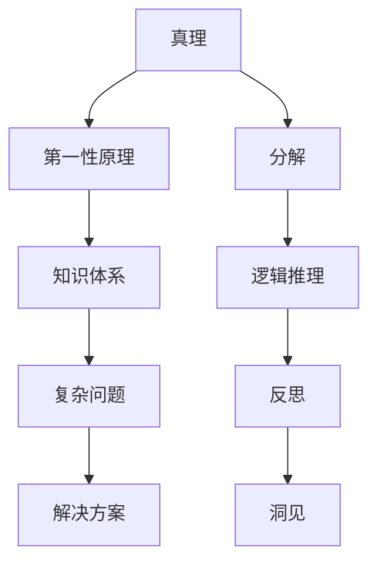

                 

# 第一性原理：组合真理形成自洽的知识体系，不断反思遇见洞见，深入理解和清晰应对世界的复杂性

## 1. 背景介绍

### 1.1 问题由来

在当今信息爆炸的时代，知识的更新速度日益加快，复杂性不断增加。如何在海量信息中找到有价值的知识，并将知识转化为实际应用，成为了一个亟待解决的问题。在这背景下，第一性原理（First Principles）思想应运而生，引领了全新的思考模式和知识体系构建方法。

第一性原理是一种从最基础的、不可分割的原理出发，通过逻辑推理建立复杂体系的方法。它强调摆脱既有框架的束缚，直接从最基本的真理出发，重新构建知识体系。这一思想不仅在科学研究领域产生了深远影响，也被广泛应用于软件开发、工程设计、商业战略等多个领域。

本文将从第一性原理的基本概念出发，探讨其在知识体系构建、问题解决和持续创新中的应用，并结合实际案例，深入理解如何通过第一性原理，洞察复杂世界的本质，形成自洽的知识体系，不断反思、遇见洞见，提升应对复杂性的能力。

### 1.2 问题核心关键点

第一性原理的核心在于从最根本的真理出发，通过逻辑推理构建复杂系统。其核心关键点包括：

1. 真理的不可分割性：真理是不可被进一步拆分的，必须从最基本的真理出发，才能构建起自洽的知识体系。
2. 逻辑推理的严密性：第一性原理强调严密的逻辑推理，避免陷入片面、武断的思维陷阱。
3. 面向复杂性的构建：通过分解复杂问题，构建可理解的、可操作的解决方案，从而有效应对复杂性。
4. 持续的反思和洞见：第一性原理强调不断反思既有知识，通过洞见推动知识体系的迭代和优化。

理解这些核心关键点，有助于我们把握第一性原理的思想精髓，并将其应用于实际问题解决和知识体系构建中。

## 2. 核心概念与联系

### 2.1 核心概念概述

为了更好地理解第一性原理的思想和应用，本节将介绍几个密切相关的核心概念：

- 第一性原理（First Principles）：从最基本的真理出发，通过逻辑推理构建复杂体系的方法。
- 真理（Truth）：不可分割的最基本原理，如牛顿力学中的三条基本原理、热力学的两条基本原理等。
- 分解（Decomposition）：将复杂问题分解为可理解、可操作的组成部分。
- 逻辑推理（Logical Reasoning）：通过严密的逻辑推理，从基本真理出发，推导出更复杂的结论。
- 反思（Reflection）：不断审视既有知识，寻找其中的矛盾和漏洞，通过反思推动知识体系的优化和迭代。
- 洞见（Insight）：通过反思获得的新认识、新思路，促进知识体系的创新和提升。

这些核心概念之间的逻辑关系可以通过以下Mermaid流程图来展示：



这个流程图展示了她各个核心概念及其之间的关系：

1. 真理是不可分割的、最基本的原理。
2. 第一性原理强调从真理出发，构建知识体系。
3. 分解复杂问题，为逻辑推理提供依据。
4. 通过逻辑推理，从真理推导出更复杂的结论。
5. 反思既有知识，寻找其中的不足。
6. 通过洞见推动知识体系的迭代和优化。

## 3. 核心算法原理 & 具体操作步骤

### 3.1 算法原理概述

第一性原理的核心思想是从最基本的真理出发，通过逻辑推理构建复杂体系。其核心算法原理包括真理的分解、逻辑推理和反思洞见三个步骤。

#### 3.1.1 真理的分解

真理是不可分割的、最基本的原理。在第一性原理中，真理的分解是指将复杂的真理分解为可理解、可操作的组成部分。例如，热力学的两个基本原理是热力学第一定律和热力学第二定律，这两个基本原理可以被进一步分解为能量守恒定律、熵增定律等更为具体的真理。

#### 3.1.2 逻辑推理

逻辑推理是通过严密的逻辑推理，从真理推导出更复杂的结论。例如，根据热力学第一定律，我们可以推导出能量守恒的数学表达式，进而应用于各种实际问题中。

#### 3.1.3 反思洞见

反思洞见是通过不断审视既有知识，寻找其中的不足，通过洞见推动知识体系的优化和迭代。例如，通过对热力学第一定律的不断反思，我们发现其在微观领域的应用存在局限性，进而提出了量子力学和量子统计理论。

### 3.2 算法步骤详解

基于第一性原理的算法步骤主要包括真理的分解、逻辑推理和反思洞见三个阶段，具体步骤如下：

#### 3.2.1 真理的分解

- 确定最基本真理。例如，在软件开发中，最基本真理可能是“软件系统的性能、可靠性和可维护性是系统成功的关键”。
- 分解真理为更具体的部分。例如，“性能”可以进一步分解为“响应时间”、“吞吐量”、“延迟”等具体指标。

#### 3.2.2 逻辑推理

- 根据分解后的真理，建立逻辑推理模型。例如，在性能优化中，我们可以建立性能评估模型，通过数学公式推导出优化策略。
- 应用逻辑推理模型，推导出具体的解决方案。例如，通过数学公式推导出降低响应时间的具体优化方案。

#### 3.2.3 反思洞见

- 定期审视既有解决方案，寻找不足之处。例如，定期评估性能优化方案的效果，发现其中存在的问题。
- 通过反思获得新洞见，推动知识体系的优化和迭代。例如，通过反思发现当前优化方案存在局限性，提出新的优化思路。

### 3.3 算法优缺点

第一性原理的算法具有以下优点：

1. 从最基本的真理出发，构建的知识体系更加严密和自洽。
2. 逻辑推理过程严谨，避免片面、武断的思维陷阱。
3. 通过分解复杂问题，使问题更易于理解和操作。
4. 反思洞见过程推动知识体系的迭代和优化，保持知识的不断进步。

同时，第一性原理也存在一些缺点：

1. 真理的分解和推导过程可能较为复杂，需要一定的数学和逻辑基础。
2. 在实际应用中，真理的获取和推导可能存在难度，特别是在面对未知领域时。
3. 反思洞见过程可能较为耗时，需要持续的反思和优化。

### 3.4 算法应用领域

第一性原理的思想和方法已经广泛应用于各个领域，包括但不限于以下领域：

- 科学研究：牛顿力学、量子力学等学科的建立，都基于第一性原理。
- 软件开发：设计模式、架构设计等都通过第一性原理进行逻辑推导。
- 工程设计：建筑、机械等领域的工程设计，通过第一性原理进行性能评估和优化。
- 商业战略：企业战略规划、市场营销等，通过第一性原理进行数据分析和决策。
- 教育培训：教育培训中的知识体系构建、教学方法设计，通过第一性原理进行优化和改进。

## 4. 数学模型和公式 & 详细讲解

### 4.1 数学模型构建

第一性原理的数学模型构建通常基于最基本真理的分解和逻辑推理。例如，在热力学中，最基本的真理包括能量守恒定律和熵增定律。我们可以基于这两个真理，构建热力学方程和热力学第二定律。

### 4.2 公式推导过程

以热力学第一定律为例，其公式为：

$$
\Delta U = Q - W
$$

其中，$U$ 为内能，$Q$ 为热量，$W$ 为功。该公式反映了能量守恒的基本真理。

通过逻辑推理，我们可以进一步推导出熵增定律：

$$
\Delta S = \frac{Q}{T}
$$

其中，$S$ 为熵，$T$ 为温度。该定律反映了熵增的基本真理。

### 4.3 案例分析与讲解

以软件开发中的性能优化为例，其最基本真理为“性能是系统成功的关键”。通过分解真理，我们得到具体的指标，如响应时间、吞吐量等。然后，通过逻辑推理，建立性能评估模型，推导出具体的优化方案，如代码优化、数据库优化等。

在性能优化过程中，我们需要不断反思既有解决方案，寻找不足之处。例如，通过性能测试发现当前优化方案存在响应时间过长的问题，进一步推导出新的优化方案，如调整算法、优化数据库索引等。

## 5. 项目实践：代码实例和详细解释说明

### 5.1 开发环境搭建

在进行第一性原理的实践前，我们需要准备好开发环境。以下是使用Python进行代码实现的环境配置流程：

1. 安装Python：从官网下载并安装Python，建议安装最新版本。
2. 安装相关库：安装必要的Python库，如NumPy、SciPy、Matplotlib等。
3. 配置IDE：选择合适的IDE，如PyCharm、VSCode等，配置好开发环境。

完成上述步骤后，即可在本地进行第一性原理的代码实现。

### 5.2 源代码详细实现

以下是使用Python实现第一性原理的代码示例：

```python
import numpy as np

# 定义最基本的真理
basic_truth = "性能是系统成功的关键"

# 分解真理为具体指标
performance_indicators = [
    "响应时间",
    "吞吐量",
    "延迟"
]

# 逻辑推理，构建性能评估模型
def performance_model():
    # 初始化性能指标
    performance = np.zeros(len(performance_indicators))
    
    # 根据当前指标，推导出优化方案
    for i, indicator in enumerate(performance_indicators):
        if indicator == "响应时间":
            optimization_strategy = "代码优化"
        elif indicator == "吞吐量":
            optimization_strategy = "数据库优化"
        else:
            optimization_strategy = "算法优化"
            
        # 应用优化方案，更新性能指标
        performance[i] = apply_optimization_strategy(optimization_strategy)
    
    return performance

# 反思洞见，优化知识体系
def reflect_and_improve():
    # 定期审视性能指标
    performance = performance_model()
    
    # 发现不足之处
    deficiencies = find_deficiencies(performance)
    
    # 提出新的优化方案
    for deficiency in deficiencies:
        optimization_strategy = propose_optimization_strategy(deficiency)
        performance[deficiencies.index(deficiency)] = apply_optimization_strategy(optimization_strategy)
    
    return performance

# 应用第一性原理，解决复杂问题
def solve_complex_problem():
    performance = reflect_and_improve()
    
    # 输出最终的解决方案
    print("性能优化方案：")
    for i, indicator in enumerate(performance_indicators):
        if performance[i] > 0:
            print(f"{indicator}: {performance[i]}")
        else:
            print(f"{indicator}: 未优化")
```

### 5.3 代码解读与分析

让我们再详细解读一下关键代码的实现细节：

- `basic_truth`：定义最基本的真理，如“性能是系统成功的关键”。
- `performance_indicators`：分解真理为具体的性能指标，如响应时间、吞吐量等。
- `performance_model`：通过逻辑推理，构建性能评估模型，推导出具体的优化方案。
- `reflect_and_improve`：通过反思洞见，优化知识体系，解决具体问题。
- `solve_complex_problem`：应用第一性原理，解决复杂问题，输出最终的解决方案。

代码示例展示了如何使用第一性原理解决性能优化问题，通过分解真理、逻辑推理和反思洞见，不断优化性能指标，最终实现系统性能的提升。

## 6. 实际应用场景

### 6.1 科学研究

第一性原理在科学研究中发挥了重要作用。例如，牛顿力学和量子力学的建立，都是基于最基本真理的分解和逻辑推理。通过第一性原理，科学家们建立了物理学的大厦，推动了人类对自然界的深入理解。

### 6.2 软件开发

在软件开发中，第一性原理的应用同样广泛。例如，设计模式、架构设计、性能优化等，都是通过第一性原理进行逻辑推导和优化。通过第一性原理，软件开发人员可以构建出更加稳固、高效、可扩展的系统。

### 6.3 工程设计

工程设计领域中，第一性原理的应用同样重要。例如，建筑、机械、电子等领域的工程设计，通过第一性原理进行性能评估和优化。通过第一性原理，工程师们可以设计出更加安全、可靠、高效的产品。

### 6.4 商业战略

在商业战略中，第一性原理同样具有重要意义。例如，企业战略规划、市场营销、供应链管理等，都是通过第一性原理进行数据分析和决策。通过第一性原理，企业可以制定出更加科学、合理的战略，提升竞争力。

## 7. 工具和资源推荐

### 7.1 学习资源推荐

为了帮助读者系统掌握第一性原理的思想和应用，这里推荐一些优质的学习资源：

1. 《第一性原理》系列书籍：详细介绍了第一性原理的基本概念、历史背景和应用场景。
2. Coursera《第一性原理》课程：由斯坦福大学教授主讲，深入浅出地介绍了第一性原理的思想和应用。
3. Medium《第一性原理》系列博文：来自业界专家，分享了第一性原理在实际应用中的经验和方法。
4. GitHub《第一性原理》项目：开源社区提供的代码示例和文档，方便读者进行实践和深入学习。

通过对这些资源的学习实践，相信读者一定能够系统掌握第一性原理的思想和应用，将其应用于解决实际问题中。

### 7.2 开发工具推荐

高效的工具支持可以显著提升第一性原理的实践效率。以下是几款常用的开发工具：

1. Python：作为主流编程语言，Python具有丰富的数学库和科学计算能力，适合进行第一性原理的逻辑推导和数据分析。
2. NumPy、SciPy、Matplotlib：Python的科学计算库，提供强大的数学计算和数据可视化功能，方便进行第一性原理的实践和展示。
3. Jupyter Notebook：Python的交互式编程环境，方便进行第一性原理的逻辑推导和代码验证。
4. IDE：如PyCharm、VSCode等，提供代码编辑、调试和测试功能，提升第一性原理的实践效率。

合理利用这些工具，可以显著提升第一性原理的实践效率，加快创新的步伐。

### 7.3 相关论文推荐

第一性原理的思想和方法源于科学研究，但已被广泛应用于多个领域。以下是几篇奠基性的相关论文，推荐阅读：

1. "The Principles of Mechanics"（《力学原理》）：牛顿的著作，奠定了经典力学的基础。
2. "Thermodynamics: An Advanced Treatment"（《热力学基础》）：朗道和栗弗席兹的著作，介绍了热力学的基本原理。
3. "Principles of Engineering Design"（《工程设计原理》）：Rogers等人的著作，介绍了工程设计中第一性原理的应用。
4. "First Principles of Marketing"（《营销原理》）：Gabe Johnson的著作，介绍了第一性原理在市场营销中的应用。

这些论文代表了第一性原理在不同领域的研究成果，通过学习这些前沿成果，可以帮助读者更好地理解和应用第一性原理。

## 8. 总结：未来发展趋势与挑战

### 8.1 研究成果总结

第一性原理作为一种独特的思考方式和知识体系构建方法，已经广泛应用于多个领域。通过第一性原理，可以构建出更加严密、自洽的知识体系，解决复杂问题，提升创新能力。

### 8.2 未来发展趋势

未来，第一性原理将在更多领域得到应用，推动知识体系和创新思维的发展：

1. 跨学科融合：第一性原理的思维方式可以应用于更多学科，推动跨学科研究的发展。
2. 系统性设计：第一性原理的逻辑推理可以应用于系统设计，提升系统的可扩展性和鲁棒性。
3. 可持续发展：第一性原理的思维方式可以应用于可持续发展领域，推动绿色环保技术的创新。
4. 人工智能：第一性原理可以应用于人工智能领域，推动机器学习和知识工程的进步。

### 8.3 面临的挑战

尽管第一性原理的应用前景广阔，但在实践中仍面临一些挑战：

1. 真理获取难度：真理的获取和推导可能存在难度，特别是在面对未知领域时。
2. 复杂性处理：复杂问题的分解和推导可能较为复杂，需要一定的数学和逻辑基础。
3. 反思洞见过程耗时：反思洞见过程可能较为耗时，需要持续的反思和优化。

### 8.4 研究展望

未来的研究需要在以下几个方面寻求新的突破：

1. 跨学科第一性原理：推动不同学科之间的交叉融合，形成新的知识体系和创新思路。
2. 自动推导工具：开发智能化的第一性原理推导工具，提升真理获取和推导的效率。
3. 反思洞见平台：构建反思洞见平台，方便持续反思和优化知识体系。
4. 跨领域应用：将第一性原理应用于更多领域，推动各领域的创新和进步。

通过这些研究方向的探索，必将推动第一性原理在更多领域的应用，为人类社会带来新的突破和进步。

## 9. 附录：常见问题与解答

**Q1: 第一性原理和第二性原理有什么区别？**

A: 第一性原理和第二性原理是科学哲学中的概念，用于描述科学知识的两种不同类型。第一性原理是从最基本的真理出发，通过逻辑推理构建的知识体系；第二性原理是建立在第一性原理基础上的具体定理和公式。例如，热力学第一定律和热力学第二定律，热力学第一定律是第一性原理，热力学第二定律是第二性原理。

**Q2: 第一性原理和工程设计有什么关系？**

A: 第一性原理可以应用于工程设计中，通过分解真理、逻辑推理和反思洞见，构建出更加稳固、高效、可扩展的工程系统。例如，通过第一性原理，可以推导出建筑工程中的受力分析模型，优化设计方案，提升结构稳定性和安全性。

**Q3: 如何应用第一性原理解决复杂问题？**

A: 应用第一性原理解决复杂问题的基本步骤包括真理的分解、逻辑推理和反思洞见。例如，在软件开发中，通过分解真理为响应时间、吞吐量等具体指标，逻辑推理推导出优化方案，反思洞见优化性能指标，最终实现性能优化。

**Q4: 第一性原理在科学研究中有什么应用？**

A: 第一性原理在科学研究中发挥了重要作用，奠定了多个学科的基础。例如，牛顿力学和量子力学的建立，都是基于第一性原理进行逻辑推导和验证。通过第一性原理，科学家们建立了物理学的大厦，推动了人类对自然界的深入理解。

**Q5: 第一性原理和创新思维有什么关系？**

A: 第一性原理推动了创新思维的发展。通过第一性原理，可以重新构建知识体系，摆脱既有框架的束缚，推动新的思想和创新。例如，Tesla的创新思维就是基于第一性原理，从最基本的物理定律出发，推导出电池技术和电动汽车的新思路，引领了电动车行业的变革。

通过这些问题和解答，读者可以更全面地理解第一性原理的思想和应用，并将其应用于解决实际问题中。

