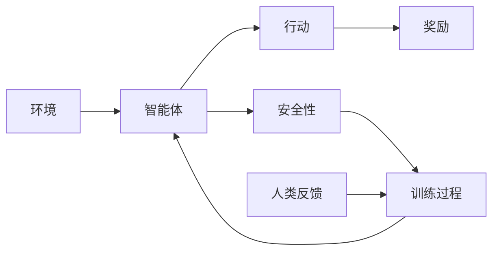

                 

## 1. 背景介绍

在人工智能（AI）的世界里，强化学习（Reinforcement Learning, RL）被看作是机器学习（Machine Learning, ML）和深度学习（Deep Learning, DL）的重要补充。强化学习使得智能体能够自主学习如何在环境中采取行动以最大化其预期的累积奖励。在过去几年中，强化学习已经取得了显著的进展，特别是在与深度学习的结合下，即深度强化学习（Deep Reinforcement Learning, DRL）。然而，尽管深度强化学习在许多领域取得了成功，但它在现实世界的应用仍然面临许多挑战，其中最显著的是安全性和可解释性问题。

为了解决这些问题，研究人员提出了一种新的深度强化学习方法，称为RLHF（Reinforcement Learning from Human Feedback，基于人类反馈的强化学习）。RLHF通过使用人类反馈来指导智能体的学习过程，从而提高学习质量和安全性。本文将详细介绍RLHF的核心概念、算法原理及其应用，并探讨其在现实世界中的应用前景。

## 2. 核心概念与联系

### 2.1 核心概念概述

RLHF是一种深度强化学习范式，它利用人类反馈来优化智能体的行为。核心概念包括以下几个方面：

1. **智能体（Agent）**：智能体是强化学习中的学习者，它通过观察环境状态并采取行动，以最大化累积奖励。
2. **环境（Environment）**：环境是智能体进行交互的虚拟或物理世界，环境中的状态由智能体的行动和自然变化决定。
3. **行动（Action）**：智能体的行动是在给定状态下的决策，其选择取决于智能体的策略。
4. **奖励（Reward）**：奖励是智能体在采取行动后从环境中获得的反馈，用于指导智能体的学习。
5. **人类反馈（Human Feedback）**：在RLHF中，人类反馈用于替代环境中的奖励信号，帮助智能体更快地学习并做出更好的决策。
6. **安全性（Safety）**：RLHF通过人类反馈来增强智能体的决策安全性，避免有害行为。

### 2.2 核心概念原理和架构的 Mermaid 流程图



在这个流程图中，智能体通过行动与环境交互，并从环境中获得奖励。在RLHF中，人类反馈取代了环境中的奖励，帮助智能体更快地学习。同时，智能体的决策也受到了安全性的约束。

## 3. 核心算法原理 & 具体操作步骤

### 3.1 算法原理概述

RLHF的算法原理主要包括以下几个步骤：

1. **初始化**：将智能体的初始状态设置为环境中的初始状态。
2. **选择行动**：智能体根据其当前状态选择行动。
3. **观察环境**：智能体观察环境的下一步状态和奖励。
4. **接收人类反馈**：智能体从人类获得反馈，用于指导其学习过程。
5. **更新策略**：智能体使用人类反馈和当前策略来更新其策略。
6. **重复执行**：智能体重复执行上述步骤，直到达到停止条件（如达到目标状态或达到最大迭代次数）。

### 3.2 算法步骤详解

下面详细介绍RLHF的具体操作步骤：

**Step 1: 初始化智能体和环境**

在开始训练之前，需要初始化智能体和环境。智能体可以选择从零开始学习，也可以选择使用预训练模型。环境则是智能体交互的外部世界，可以是虚拟的也可以是真实的。

**Step 2: 选择行动**

智能体根据其当前状态选择一个行动。这个行动可以是简单的选择或复杂的策略，取决于智能体的设计和任务。

**Step 3: 观察环境**

智能体观察环境的下一步状态和奖励。状态和奖励是环境对智能体行动的响应。

**Step 4: 接收人类反馈**

智能体从人类获得反馈，用于指导其学习过程。人类反馈可以是正面的、负面的或中性的，用于修正智能体的决策。

**Step 5: 更新策略**

智能体使用人类反馈和当前策略来更新其策略。这个步骤是RLHF的关键，它通过人类反馈来增强智能体的学习效果。

**Step 6: 重复执行**

智能体重复执行上述步骤，直到达到停止条件。训练过程可能需要大量的迭代才能达到理想的效果。

### 3.3 算法优缺点

RLHF具有以下优点：

1. **安全性**：通过人类反馈，智能体的决策更加安全，避免了有害行为。
2. **可解释性**：人类反馈提供了对智能体决策的直接反馈，增强了算法的可解释性。
3. **学习效率**：人类反馈指导了智能体的学习过程，加快了学习速度。

但同时，RLHF也存在一些缺点：

1. **依赖人类反馈**：智能体的学习依赖于人类的反馈，可能会因为人类反馈的不准确或不及时而受到影响。
2. **计算成本高**：人类反馈需要大量的人工干预，增加了计算成本。
3. **可扩展性差**：人类反馈的获取和处理可能受到现实世界的限制，难以扩展到大规模应用中。

### 3.4 算法应用领域

RLHF已经在多个领域取得了成功应用，包括游戏、机器人控制、自动驾驶等。以下是一些主要的应用领域：

1. **游戏**：RLHF在游戏领域中已经被用于训练像OpenAI Five这样的团队玩家，这些玩家能够以人类水平的游戏水平击败顶级职业玩家。
2. **机器人控制**：RLHF已经被用于训练机器人执行复杂的物理任务，如机器人手术。
3. **自动驾驶**：RLHF在自动驾驶领域中也被用于训练智能体，使其能够自主学习和适应不同的驾驶场景。
4. **医疗**：RLHF可以用于训练医疗机器人，以提高手术的精确度和安全性。

## 4. 数学模型和公式 & 详细讲解 & 举例说明

### 4.1 数学模型构建

在RLHF中，智能体的目标是最大化累积奖励。假设智能体在每个时间步$t$的行动是$a_t$，环境的状态是$s_t$，奖励是$r_t$，智能体的策略是$\pi(a_t|s_t)$。智能体的目标是最大化累积奖励$R$，即：

$$
\max_{\pi} \mathbb{E}[R] = \mathbb{E}[\sum_{t=0}^{\infty} \gamma^t r_t]
$$

其中$\gamma$是折扣因子，用于平衡当前奖励和未来奖励。

### 4.2 公式推导过程

在RLHF中，智能体的策略是通过人类反馈来更新的。假设智能体在每个时间步$t$的行动$a_t$是根据当前状态$s_t$和策略$\pi$选择的，即：

$$
a_t = \pi(a_t|s_t)
$$

智能体在每个时间步$t$观察到环境的状态和奖励，即：

$$
s_{t+1} = f(s_t,a_t), \quad r_t = R(s_t,a_t)
$$

智能体从人类获得反馈，表示为$F(s_t,a_t)$。人类反馈用于指导智能体的学习，可以是一个正向信号、负向信号或中性信号。假设人类反馈是一个标量，其值在$[0,1]$范围内，其中$0$表示“坏”，$1$表示“好”。

智能体的策略可以通过以下公式进行更新：

$$
\pi_{t+1}(a_t|s_t) = \frac{\pi_t(a_t|s_t)}{Z_t} e^{F(s_t,a_t) \cdot \theta_t}
$$

其中$Z_t$是归一化常数，$\theta_t$是智能体的参数向量。公式中的$e^{F(s_t,a_t) \cdot \theta_t}$表示人类反馈对智能体参数的贡献，如果人类反馈为负值，智能体参数不会发生变化。

### 4.3 案例分析与讲解

假设我们有一个智能体需要学习在迷宫中寻找出口。智能体可以在每个时间步选择一个向左或向右移动。迷宫中的每个位置都有一个奖励，出口的位置有最大的奖励。智能体可以通过移动探索迷宫，并从人类获得反馈，以指导其学习。

在这个例子中，智能体的策略可以表示为：

$$
\pi(a_t|s_t) = \begin{cases}
0.5 & \text{if } a_t = \text{向左} \\
0.5 & \text{if } a_t = \text{向右}
\end{cases}
$$

智能体在每个时间步观察到迷宫的状态和奖励，并从人类获得反馈。人类反馈可以帮助智能体学习到迷宫的结构，避免有害行为，如撞墙或进入死胡同。

## 5. 项目实践：代码实例和详细解释说明

### 5.1 开发环境搭建

在进行RLHF项目实践前，需要准备好开发环境。以下是使用Python进行TensorFlow进行RLHF实验的环境配置流程：

1. 安装Anaconda：从官网下载并安装Anaconda，用于创建独立的Python环境。
2. 创建并激活虚拟环境：
```bash
conda create -n rlfh-env python=3.8 
conda activate rlfh-env
```

3. 安装TensorFlow：根据CUDA版本，从官网获取对应的安装命令。例如：
```bash
conda install tensorflow-gpu -c conda-forge
```

4. 安装其他必要的库：
```bash
pip install numpy scipy gym tensorflow-gan
```

完成上述步骤后，即可在`rlfh-env`环境中开始RLHF实验。

### 5.2 源代码详细实现

下面以LunarLander-v2环境为例，使用TensorFlow进行RLHF实验的代码实现。

首先，导入必要的库：

```python
import tensorflow as tf
import numpy as np
import gym
```

然后，定义智能体的策略：

```python
class Policy(tf.keras.Model):
    def __init__(self, input_dim, output_dim):
        super(Policy, self).__init__()
        self.dense1 = tf.keras.layers.Dense(64, activation='relu', input_dim=input_dim)
        self.dense2 = tf.keras.layers.Dense(output_dim, activation='softmax')

    def call(self, inputs):
        x = self.dense1(inputs)
        x = self.dense2(x)
        return x
```

接着，定义智能体的参数向量：

```python
theta = tf.Variable(np.random.randn(input_dim, output_dim))
```

然后，定义智能体的策略更新公式：

```python
def update_policy(inputs, policy, theta):
    x = policy(inputs)
    probabilities = tf.exp(tf.matmul(inputs, theta)) / tf.reduce_sum(tf.exp(tf.matmul(inputs, theta)), axis=-1, keepdims=True)
    return policy, tf.reduce_mean(tf.log(probabilities) * policy.outputs)
```

接着，定义智能体的策略更新函数：

```python
def update_strategy(inputs, rewards, policy, theta):
    probabilities = tf.exp(tf.matmul(inputs, theta)) / tf.reduce_sum(tf.exp(tf.matmul(inputs, theta)), axis=-1, keepdims=True)
    strategy = tf.reduce_mean(tf.log(probabilities) * policy.outputs)
    return policy, theta, strategy
```

最后，启动RLHF训练流程：

```python
def train(env, policy, theta, discount_factor, episodes, max_steps):
    for episode in range(episodes):
        state = env.reset()
        rewards = []
        for t in range(max_steps):
            action_probs = policy(np.expand_dims(state, axis=0))
            action = np.random.choice(np.arange(len(action_probs[0])), p=action_probs[0])
            next_state, reward, done, _ = env.step(action)
            rewards.append(reward)
            state = next_state
            if done:
                break
        strategy = np.mean(rewards)
        policy, theta, strategy = update_strategy(np.array([state]), np.array(rewards), policy, theta)
    return policy, theta, strategy
```

### 5.3 代码解读与分析

让我们再详细解读一下关键代码的实现细节：

**Policy类**：
- `__init__`方法：初始化策略网络，包含两个全连接层。
- `call`方法：定义策略网络的输出。

**update_policy函数**：
- 计算智能体的输出概率。
- 使用softmax函数将输出概率归一化。

**update_strategy函数**：
- 计算智能体的输出概率。
- 使用softmax函数将输出概率归一化。
- 计算策略更新公式中的策略值。

**train函数**：
- 在每个时间步上选择行动。
- 观察环境的状态和奖励。
- 从人类获得反馈，更新策略和参数。
- 重复上述步骤，直到达到停止条件。

**代码解读**：
- 智能体的策略是一个简单的全连接网络，输出概率表示每个动作的概率。
- 智能体的策略更新公式使用softmax函数将输出概率归一化，并计算策略值。
- 在每个时间步上，智能体选择行动并观察环境的状态和奖励，然后从人类获得反馈，更新策略和参数。
- 重复上述步骤，直到达到停止条件。

## 6. 实际应用场景

### 6.1 自动驾驶

自动驾驶是RLHF的一个重要应用场景。智能体需要在复杂的道路环境中自主学习和适应不同的驾驶场景，如避障、变道等。通过RLHF，智能体可以从人类司机那里学习，了解哪些驾驶行为是安全的，哪些是不安全的。智能体可以通过不断学习和适应，提高驾驶的安全性和效率。

### 6.2 机器人控制

在机器人控制领域，RLHF可以帮助机器人执行复杂的物理任务。例如，在手术机器人中，RLHF可以使机器人从人类外科医生那里学习，了解哪些动作是有益的，哪些动作是有害的。智能体可以通过不断学习和适应，提高手术的精确度和安全性。

### 6.3 游戏AI

在视频游戏中，RLHF可以帮助游戏AI学习复杂的策略，以击败玩家。例如，在Dota 2中，RLHF可以帮助游戏AI从人类玩家那里学习，了解哪些策略是有效的，哪些策略是无效的。智能体可以通过不断学习和适应，提高游戏的胜率和表现。

### 6.4 未来应用展望

随着RLHF的不断发展，其应用前景将更加广阔。以下是一些可能的未来应用场景：

1. **医疗**：在医疗领域，RLHF可以帮助训练医疗机器人，提高手术的精确度和安全性。
2. **金融**：在金融领域，RLHF可以帮助训练智能交易系统，优化投资决策。
3. **制造业**：在制造业中，RLHF可以帮助训练智能机器人，优化生产流程。
4. **教育**：在教育领域，RLHF可以帮助训练智能辅导系统，提高学生的学习效果。

## 7. 工具和资源推荐

### 7.1 学习资源推荐

为了帮助开发者系统掌握RLHF的理论基础和实践技巧，这里推荐一些优质的学习资源：

1. 《Reinforcement Learning: An Introduction》书籍：由Richard S. Sutton和Andrew G. Barto所著，全面介绍了强化学习的基本概念和算法，适合初学者阅读。
2. 《Deep Reinforcement Learning with Python》书籍：由Fernando Pérez-Dueñas及Patricio Gallardo所著，使用Python实现深度强化学习算法，适合动手实践。
3. CS294T《Deep Reinforcement Learning》课程：由Berkeley大学开设的深度强化学习课程，有Lecture视频和配套作业，带你深入了解深度强化学习的原理和实践。
4. OpenAI的《Reinforcement Learning: State-of-the-Art》博客：OpenAI的研究团队定期发布最新研究进展，涵盖深度强化学习的各个方面，适合跟踪前沿进展。

通过对这些资源的学习实践，相信你一定能够快速掌握RLHF的精髓，并用于解决实际的强化学习问题。

### 7.2 开发工具推荐

高效的开发离不开优秀的工具支持。以下是几款用于RLHF开发的常用工具：

1. TensorFlow：由Google主导开发的开源深度学习框架，生产部署方便，适合大规模工程应用。
2. PyTorch：基于Python的开源深度学习框架，灵活动态的计算图，适合快速迭代研究。
3. Gym：由OpenAI开发的强化学习环境库，包含各种游戏和物理模拟环境，方便测试和调试。
4. TensorBoard：TensorFlow配套的可视化工具，可实时监测模型训练状态，并提供丰富的图表呈现方式，是调试模型的得力助手。
5. Weights & Biases：模型训练的实验跟踪工具，可以记录和可视化模型训练过程中的各项指标，方便对比和调优。

合理利用这些工具，可以显著提升RLHF的开发效率，加快创新迭代的步伐。

### 7.3 相关论文推荐

RLHF的研究源于学界的持续研究。以下是几篇奠基性的相关论文，推荐阅读：

1. "Playing Atari with Deep Reinforcement Learning"：D DLNIEA的论文，首次展示了深度强化学习在视频游戏中的应用。
2. "AlphaGo"：DeepMind的论文，展示了AlphaGo如何在围棋中击败人类世界冠军。
3. "Human-Labelled Data Can Improve Reinforcement Learning"：Hutter和Kappen的论文，展示了人类反馈对深度强化学习的重要性。
4. "Deep Reinforcement Learning with Human Feedback"：Hüner等人发表的论文，展示了RLHF在训练智能体时的有效性。

这些论文代表了大语言模型微调技术的发展脉络。通过学习这些前沿成果，可以帮助研究者把握学科前进方向，激发更多的创新灵感。

## 8. 总结：未来发展趋势与挑战

### 8.1 总结

本文对RLHF的核心概念、算法原理及其应用进行了全面系统的介绍。首先阐述了RLHF的背景和意义，明确了RLHF在提高智能体学习质量和安全性方面的独特价值。其次，从原理到实践，详细讲解了RLHF的数学模型和算法步骤，给出了RLHF任务开发的完整代码实例。同时，本文还广泛探讨了RLHF在自动驾驶、机器人控制、游戏AI等多个行业领域的应用前景，展示了RLHF范式的巨大潜力。最后，本文精选了RLHF技术的各类学习资源，力求为读者提供全方位的技术指引。

通过本文的系统梳理，可以看到，RLHF已经在大语言模型微调技术中占据了重要的地位，极大地拓展了预训练语言模型的应用边界，催生了更多的落地场景。未来，伴随深度强化学习的不断发展，RLHF必将在更多的领域中大放异彩，为人工智能技术的产业化进程注入新的动力。

### 8.2 未来发展趋势

展望未来，RLHF技术将呈现以下几个发展趋势：

1. **多智能体学习**：未来的RLHF将更加注重多智能体系统，智能体之间可以相互协作、竞争，以解决更复杂的任务。
2. **模型可解释性**：随着智能体的决策过程变得越来越复杂，模型可解释性将变得更加重要，以确保智能体的决策是可信的。
3. **迁移学习**：RLHF可以与其他机器学习和深度学习技术结合，进行迁移学习，从而在新的任务上取得更好的效果。
4. **自适应学习**：智能体将能够根据环境变化，自适应地调整其策略和参数，以保持最优的性能。
5. **多模态学习**：智能体将能够同时处理多种数据类型，如文本、图像、音频等，以提高其学习效率和表现。

### 8.3 面临的挑战

尽管RLHF技术已经取得了显著的进展，但在迈向更加智能化、普适化应用的过程中，它仍面临诸多挑战：

1. **计算成本高**：RLHF需要大量的计算资源和人工干预，难以在实时环境中应用。
2. **安全性问题**：智能体的决策需要考虑安全性，避免有害行为。
3. **可扩展性差**：RLHF的训练和部署可能受到现实世界的限制，难以扩展到大规模应用中。
4. **可解释性不足**：智能体的决策过程缺乏可解释性，难以理解其内部工作机制。

### 8.4 研究展望

面对RLHF所面临的种种挑战，未来的研究需要在以下几个方面寻求新的突破：

1. **优化算法**：开发更加高效、鲁棒的强化学习算法，以提高智能体的学习效率和安全性。
2. **知识图谱**：将知识图谱等外部知识与智能体的学习过程结合，提高其学习能力和泛化能力。
3. **多模态融合**：将文本、图像、音频等不同模态的数据融合，增强智能体的感知能力和决策能力。
4. **可解释性增强**：开发可解释性强的算法和模型，提高智能体的决策透明度和可信度。
5. **伦理和道德**：在智能体的训练和应用过程中，考虑伦理和道德因素，确保其行为符合人类价值观和社会规范。

这些研究方向的探索，必将引领RLHF技术迈向更高的台阶，为构建安全、可靠、可解释、可控的智能系统铺平道路。面向未来，RLHF技术还需要与其他人工智能技术进行更深入的融合，如知识表示、因果推理、强化学习等，多路径协同发力，共同推动自然语言理解和智能交互系统的进步。只有勇于创新、敢于突破，才能不断拓展语言模型的边界，让智能技术更好地造福人类社会。

## 9. 附录：常见问题与解答

**Q1：RLHF是否适用于所有强化学习任务？**

A: RLHF在许多强化学习任务上取得了成功，但并不适用于所有任务。例如，在一些需要高度精确和稳定的任务中，如医疗、金融等领域，RLHF可能需要更多的训练数据和人类反馈，以确保其决策的安全性和可靠性。

**Q2：如何平衡当前奖励和未来奖励？**

A: 在强化学习中，平衡当前奖励和未来奖励是一个重要的问题。通常使用折扣因子$\gamma$来平衡二者。$\gamma$的值越小，未来奖励的权重越小，智能体将更多关注当前的奖励。因此，选择合适的$\gamma$值是关键。

**Q3：如何提高RLHF的计算效率？**

A: 提高RLHF计算效率的关键在于优化算法和模型。例如，使用更高效的强化学习算法，如PPO（Proximal Policy Optimization）和A2C（Advantage Actor-Critic），可以在减少计算成本的同时提高学习效果。同时，使用预训练模型和知识图谱等外部知识，也可以提高智能体的学习效率。

**Q4：如何增强RLHF的可解释性？**

A: 增强RLHF的可解释性可以从多个方面入手，例如使用可解释性强的算法和模型，如LIME（Local Interpretable Model-agnostic Explanations）和SHAP（SHapley Additive exPlanations）。另外，通过可视化智能体的决策过程和策略更新，也可以提高其可解释性。

**Q5：RLHF是否可以应用于大规模应用中？**

A: RLHF可以应用于大规模应用中，但需要考虑计算成本和数据获取的可行性。例如，在自动驾驶和机器人控制中，智能体需要在复杂环境中学习和适应，需要大量的计算资源和人工干预。因此，需要考虑如何优化算法和模型，以适应大规模应用的需求。

总之，RLHF是强化学习领域的一个重要方向，具有广阔的应用前景和丰富的研究空间。通过不断探索和优化，RLHF必将在未来的人工智能技术中发挥更大的作用，为人类社会带来更多的便利和变革。

