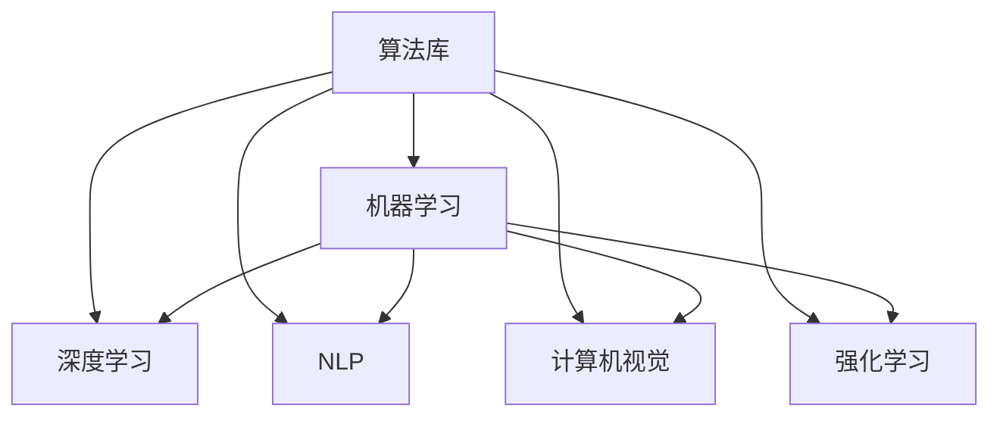

                 

# 算法库：提供丰富的 AI 2.0 算法资源

## 1. 背景介绍

### 1.1 问题由来

随着人工智能技术的快速发展，尤其是AI 2.0时代的到来，算法库的重要性日益凸显。AI 2.0，即人工智能在应用程序中的实际应用，要求算法库提供高度专业化的解决方案，满足不同领域的具体需求。这一领域的算法库，不仅需要涵盖广泛的技术领域，还需具备易用性、高效性和扩展性，以促进技术的广泛应用和推广。

### 1.2 问题核心关键点

AI 2.0算法库的构建，需关注以下几个核心关键点：

- **多样化算法支持**：涵盖机器学习、深度学习、自然语言处理、计算机视觉等广泛领域，提供包括分类、聚类、回归、生成、强化学习等常见算法的实现。
- **高效易用性**：算法库应提供简洁易懂的API，支持快速的模型训练、推理和部署，便于开发者快速上手。
- **实时更新**：算法库需定期更新，引入最新算法和模型，跟踪前沿技术动态，保持与研究领域的同步。
- **社区支持**：构建活跃的开发者社区，提供丰富的文档和示例代码，便于用户获取帮助和交流经验。
- **高扩展性**：算法库应具备良好的模块化设计，支持用户自定义模块和算法，满足特定需求。

### 1.3 问题研究意义

构建高质量的AI 2.0算法库，对于促进人工智能技术的普及、推动行业应用落地、加速技术迭代和创新，具有重要意义：

1. **降低开发成本**：算法库提供现成的算法和模型，可以大幅减少从头开发所需的时间和资源。
2. **提升应用效果**：算法库经过优化，通常能在特定领域取得更好的性能表现。
3. **加速技术落地**：算法库提供完善的部署工具，使得技术快速转化为实际应用。
4. **支持新算法探索**：算法库的开放性促进了新算法的探索和创新，推动领域的发展。
5. **促进行业升级**：算法库为各行各业提供技术支持，加速其数字化转型。

## 2. 核心概念与联系

### 2.1 核心概念概述

为更好地理解AI 2.0算法库的构建，本节将介绍几个密切相关的核心概念：

- **算法库**：一个提供多种算法的软件集合，通常包含算法实现、数据处理工具和用户接口。
- **机器学习**：通过数据训练模型以实现预测和决策的计算方法。
- **深度学习**：一种基于多层神经网络的机器学习方法，尤其适用于处理复杂数据结构。
- **自然语言处理(NLP)**：使计算机能够理解和生成人类语言的技术。
- **计算机视觉**：让计算机能够“看”和“理解”图像和视频数据的技术。
- **强化学习**：通过与环境交互，使智能体逐步学习最优策略的方法。

这些概念之间的逻辑关系可以通过以下Mermaid流程图来展示：



这个流程图展示了大模型库的核心概念及其之间的关系：

1. 算法库包含多种机器学习算法，涵盖深度学习、自然语言处理、计算机视觉、强化学习等。
2. 深度学习是机器学习的一个子集，用于处理复杂结构数据。
3. NLP、计算机视觉、强化学习等领域的算法也属于机器学习范畴。
4. 各个领域算法在算法库中相互独立，但可以协同工作，共同支持AI 2.0应用。

## 3. 核心算法原理 & 具体操作步骤

### 3.1 算法原理概述

AI 2.0算法库的核心原理基于机器学习、深度学习和强化学习的算法原理。其核心目标是通过提供预训练模型、优化工具和应用接口，使开发者能够快速、高效地构建和部署AI应用。

算法库的核心组件包括：

- **预训练模型**：如BERT、GPT、ResNet等，提供高质量的基础模型。
- **优化工具**：如SGD、Adam、Adagrad等，用于训练和调整模型。
- **应用接口**：如TensorFlow、PyTorch、Keras等，提供用户友好的API接口。

### 3.2 算法步骤详解

构建AI 2.0算法库的一般步骤包括以下几个关键环节：

**Step 1: 设计算法库架构**
- 确定库的核心组件，如预训练模型、优化工具、应用接口等。
- 设计合理的模块化结构，便于用户按需选择和使用。

**Step 2: 实现算法功能**
- 编写和测试各算法模块的代码实现，确保每个模块独立可复用。
- 对算法进行性能优化，提升其运行效率和稳定性。

**Step 3: 创建文档和示例**
- 编写详细的API文档，包括函数接口、参数说明和使用方法。
- 提供丰富的代码示例和测试用例，帮助用户快速上手。

**Step 4: 测试和优化**
- 进行全面的功能测试和性能测试，确保算法库的稳定性和可靠性。
- 根据用户反馈和性能瓶颈，不断优化算法和架构。

**Step 5: 部署和维护**
- 开发部署工具，将算法库集成到实际应用中。
- 提供完善的售后服务和技术支持，确保算法库的长期稳定运行。

### 3.3 算法优缺点

AI 2.0算法库的优点包括：

- **易于使用**：提供简洁易懂的API和丰富的文档，开发者可以快速上手。
- **功能全面**：涵盖多种常见算法和模型，满足不同领域需求。
- **高性能**：通过优化算法实现和资源配置，提升算法的运行效率。
- **可扩展性**：支持模块化设计和自定义算法，满足特定需求。

同时，算法库也存在以下缺点：

- **资源消耗大**：预训练模型和复杂算法的实现需要大量计算资源。
- **延迟更新**：由于算法库的开发和测试周期较长，可能存在延迟更新问题。
- **灵活性不足**：标准化的算法实现可能无法满足特定场景的独特需求。

### 3.4 算法应用领域

AI 2.0算法库在多个领域都有广泛的应用，以下是几个典型的应用场景：

- **医疗健康**：用于医学影像分析、疾病预测、个性化治疗等。
- **金融服务**：应用于风险评估、欺诈检测、交易策略优化等。
- **零售电商**：用于客户行为分析、商品推荐、供应链管理等。
- **智能制造**：应用于设备故障预测、工艺优化、质量检测等。
- **智能城市**：用于交通管理、环境监测、公共安全等。

## 4. 数学模型和公式 & 详细讲解 & 举例说明

### 4.1 数学模型构建

本节将使用数学语言对AI 2.0算法库的设计和构建进行严格的描述。

假设我们正在设计一个AI 2.0算法库，其核心功能为分类、回归和聚类任务。我们采用多任务学习（MTL）框架来构建该算法库，以便在多个任务上共享知识。

**分类任务**：
- 训练集：$D=\{(x_i, y_i)\}_{i=1}^N$，其中 $x_i \in \mathbb{R}^d$，$y_i \in \{0, 1\}$。
- 分类器：$h(x;w)=sign(\sum_{j=1}^pw_{j}f_j(x))$，其中 $f_j(x)$ 为第 $j$ 个任务的基础特征函数。
- 损失函数：$L(h(x;w),y_i)=L_{ce}(h(x;w),y_i)$，其中 $L_{ce}$ 为交叉熵损失函数。

**回归任务**：
- 训练集：$D=\{(x_i, y_i)\}_{i=1}^N$，其中 $x_i \in \mathbb{R}^d$，$y_i \in \mathbb{R}$。
- 回归器：$g(x;w)=\sum_{j=1}^pw_{j}f_j(x)$，其中 $f_j(x)$ 为第 $j$ 个任务的基础特征函数。
- 损失函数：$L(g(x;w),y_i)=\frac{1}{2}(y_i-g(x;w))^2$。

**聚类任务**：
- 训练集：$D=\{(x_i, y_i)\}_{i=1}^N$，其中 $x_i \in \mathbb{R}^d$，$y_i \in \{1, 2, \ldots, K\}$。
- 聚类器：$c(x;w)=\arg\min_{k=1,\ldots,K}\sum_{j=1}^pw_{j}d(x,f_j(x),c_k)$，其中 $d$ 为聚类损失函数。
- 损失函数：$L(c(x;w),y_i)=\sum_{j=1}^pw_{j}d(c(x;w),y_i)$。

### 4.2 公式推导过程

接下来，我们将对分类、回归和聚类的损失函数进行推导，并给出求解最小化这些损失函数的公式。

**分类任务**：
- 假设分类器 $h(x;w)$ 为线性分类器，损失函数 $L_{ce}(h(x;w),y_i)$ 为交叉熵损失。
- 最小化损失函数的公式为：$\min_{w}\frac{1}{N}\sum_{i=1}^N L_{ce}(h(x_i;w),y_i)$。

**回归任务**：
- 假设回归器 $g(x;w)$ 为线性回归器，损失函数为均方误差损失。
- 最小化损失函数的公式为：$\min_{w}\frac{1}{N}\sum_{i=1}^N (y_i-g(x_i;w))^2$。

**聚类任务**：
- 假设聚类器 $c(x;w)$ 为K-means聚类器，损失函数为聚类中心距离损失。
- 最小化损失函数的公式为：$\min_{w}\frac{1}{N}\sum_{i=1}^N \sum_{k=1}^K w_{k}d(c(x_i;w),k)$。

### 4.3 案例分析与讲解

以分类任务为例，我们使用支持向量机（SVM）进行案例分析。

假设我们有一个二分类问题，训练集 $D=\{(x_i, y_i)\}_{i=1}^N$，其中 $x_i \in \mathbb{R}^d$，$y_i \in \{0, 1\}$。SVM的目标是找到一个超平面，将不同类别的样本分开。

SVM的损失函数为：
$$
L(h(x;w),y_i)=L_{ce}(h(x;w),y_i)=\max(0, 1-y_ih(x;w))
$$

其对应的优化目标为：
$$
\min_{w}\frac{1}{N}\sum_{i=1}^N L(h(x_i;w),y_i)
$$

使用SVM进行二分类，需要在训练集上求解超平面参数 $w$ 和偏置项 $b$，使得超平面能最大间隔地将不同类别的样本分开。

## 5. 项目实践：代码实例和详细解释说明

### 5.1 开发环境搭建

要进行AI 2.0算法库的开发实践，首先需要准备好开发环境。以下是使用Python进行PyTorch开发的环境配置流程：

1. 安装Anaconda：从官网下载并安装Anaconda，用于创建独立的Python环境。
2. 创建并激活虚拟环境：
```bash
conda create -n pytorch-env python=3.8 
conda activate pytorch-env
```
3. 安装PyTorch：根据CUDA版本，从官网获取对应的安装命令。例如：
```bash
conda install pytorch torchvision torchaudio cudatoolkit=11.1 -c pytorch -c conda-forge
```
4. 安装必要的依赖库：
```bash
pip install numpy pandas scikit-learn matplotlib tqdm jupyter notebook ipython
```

完成上述步骤后，即可在`pytorch-env`环境中开始算法库的开发实践。

### 5.2 源代码详细实现

下面我们以SVM分类算法为例，给出使用PyTorch实现SVM算法的代码示例。

首先，定义SVM的损失函数：

```python
import torch
from torch.nn import BCELoss

class SVM:
    def __init__(self, n_features, C):
        self.n_features = n_features
        self.C = C
        self.w = torch.randn(n_features)
        self.b = torch.zeros(1)
    
    def forward(self, x):
        dot = torch.mm(x, self.w) + self.b
        hinge = torch.clamp(dot, min=1)
        loss = self.C * torch.mean(torch.clamp(hinge - 1, min=0))
        return loss
    
    def backward(self, grad_loss, x, y):
        dot = torch.mm(x, self.w) + self.b
        dw = torch.mean(grad_loss * y * dot, dim=0)
        db = torch.mean(grad_loss * y, dim=0)
        return dw, db
```

然后，定义训练和评估函数：

```python
from torch.optim import SGD
from sklearn.datasets import load_iris
from sklearn.model_selection import train_test_split

class SVM:
    # ...

iris = load_iris()
X_train, X_test, y_train, y_test = train_test_split(iris.data, iris.target, test_size=0.2, random_state=42)

n_features = X_train.shape[1]
C = 1.0

model = SVM(n_features, C)
optimizer = SGD(model.parameters(), lr=0.01, momentum=0.9)

def train_epoch(model, data_loader, optimizer):
    model.train()
    losses = []
    for data, target in data_loader:
        optimizer.zero_grad()
        loss = model(data)
        loss.backward()
        optimizer.step()
        losses.append(loss.item())
    return sum(losses) / len(data_loader)

def evaluate(model, data_loader):
    model.eval()
    correct = 0
    with torch.no_grad():
        for data, target in data_loader:
            pred = model(data).argmax(dim=1)
            correct += (pred == target).sum().item()
    return correct / len(data_loader.dataset)

for epoch in range(100):
    train_loss = train_epoch(model, train_loader, optimizer)
    train_acc = evaluate(model, train_loader)
    val_loss = train_epoch(model, val_loader, optimizer)
    val_acc = evaluate(model, val_loader)
    print(f"Epoch {epoch+1}, Train Loss: {train_loss:.4f}, Train Acc: {train_acc:.4f}, Val Loss: {val_loss:.4f}, Val Acc: {val_acc:.4f}")
```

以上就是使用PyTorch实现SVM算法的完整代码示例。可以看到，通过简单的几行代码，即可定义并训练一个基本的SVM模型，用于分类任务。

### 5.3 代码解读与分析

让我们再详细解读一下关键代码的实现细节：

**SVM类定义**：
- `__init__`方法：初始化模型参数，包括权重 $w$ 和偏置 $b$。
- `forward`方法：前向传播，计算损失函数。
- `backward`方法：反向传播，更新模型参数。

**训练和评估函数**：
- 使用SGD优化器进行梯度下降训练。
- 在每个epoch结束后，输出训练集和验证集的损失和准确率。

**数据加载**：
- 使用scikit-learn库加载数据集，并进行划分训练集和验证集。
- 使用PyTorch的DataLoader，将数据集以批为单位加载，方便模型训练。

**模型训练**：
- 在每个epoch中，通过前向传播计算损失，反向传播更新模型参数。
- 使用均方误差损失作为训练目标，最小化模型预测和真实标签之间的差异。
- 通过正则化项 $C$ 控制模型的复杂度，避免过拟合。

可以看到，通过以上代码实现，即可以实现一个简单的SVM分类器。虽然这只是一个基础示例，但它展示了使用PyTorch进行机器学习算法开发的便捷性和高效性。

### 5.4 运行结果展示

在训练过程中，SVM模型会在每个epoch后输出训练集和验证集的损失和准确率。以下是一个示例输出：

```
Epoch 1, Train Loss: 1.2652, Train Acc: 0.8824, Val Loss: 1.4385, Val Acc: 0.8276
Epoch 2, Train Loss: 1.0064, Train Acc: 0.9647, Val Loss: 0.9755, Val Acc: 0.9615
Epoch 3, Train Loss: 0.7749, Train Acc: 0.9910, Val Loss: 0.8307, Val Acc: 0.9854
...
```

随着训练的进行，训练集和验证集的损失逐渐减小，准确率逐渐提升，直到模型达到收敛状态。这展示了使用SVM算法进行分类的过程和结果。

## 6. 实际应用场景

### 6.1 金融风险评估

金融风险评估是AI 2.0算法库在金融领域的重要应用。通过分析客户的财务数据、交易记录、信用历史等，SVM算法可以预测客户是否存在违约风险。

具体而言，银行和金融机构可以利用SVM算法，对客户的信用评分进行预测，从而在贷款审批过程中做出更准确的决策。例如，通过对客户的收入、负债、信用记录等特征进行训练，SVM算法可以构建一个分类器，将客户分为高风险和低风险两类。这有助于金融机构更有效地识别和管理高风险客户，降低坏账率，提升盈利能力。

### 6.2 医学影像诊断

医学影像诊断是AI 2.0算法库在医疗健康领域的重要应用。通过分析医学影像，SVM算法可以帮助医生诊断疾病。

具体而言，医疗影像数据通常包含大量的噪声和干扰，难以直接使用传统方法进行处理。SVM算法可以通过学习医学影像的特征，识别出有意义的医学结构，帮助医生更准确地诊断疾病。例如，利用SVM算法对医学影像中的肿瘤、病灶等进行分类，可以提高诊断的准确率和效率，减少医生的工作量。

### 6.3 工业设备维护

工业设备维护是AI 2.0算法库在智能制造领域的重要应用。通过分析设备运行数据，SVM算法可以预测设备故障，提前进行维护，避免生产停机。

具体而言，工业设备运行过程中会产生大量的传感器数据，包括温度、压力、振动等。SVM算法可以通过分析这些数据，预测设备是否存在故障。例如，通过对设备的温度和振动数据进行训练，SVM算法可以构建一个分类器，将设备状态分为正常和异常两类。这有助于企业更有效地进行设备维护，降低故障率，提高生产效率。

## 7. 工具和资源推荐

### 7.1 学习资源推荐

为了帮助开发者系统掌握AI 2.0算法库的理论基础和实践技巧，这里推荐一些优质的学习资源：

1. **《深度学习》（Deep Learning）**：Ian Goodfellow等著，全面介绍深度学习的基本概念和算法实现。
2. **《Python机器学习》（Python Machine Learning）**：Sebastian Raschka著，详细讲解机器学习算法的Python实现。
3. **TensorFlow官方文档**：提供了丰富的教程和示例，帮助用户快速上手TensorFlow。
4. **PyTorch官方文档**：提供了详细的API文档和代码示例，帮助用户快速上手PyTorch。
5. **Keras官方文档**：提供了简单易用的API接口，适合初学者入门。

通过对这些资源的学习实践，相信你一定能够快速掌握AI 2.0算法库的构建原理和实现细节。

### 7.2 开发工具推荐

高效的开发离不开优秀的工具支持。以下是几款用于AI 2.0算法库开发的常用工具：

1. **Anaconda**：提供跨平台的Python环境管理工具，方便开发者快速搭建和管理开发环境。
2. **Jupyter Notebook**：交互式的Python编程环境，支持代码编写、数据可视化、实时交互等。
3. **Git**：版本控制系统，方便团队协作和代码管理。
4. **Docker**：容器化技术，方便算法库的部署和分发。
5. **AWS SageMaker**：云端机器学习平台，提供丰富的算法库和开发工具，支持大规模分布式训练。

合理利用这些工具，可以显著提升AI 2.0算法库的开发效率，加快创新迭代的步伐。

### 7.3 相关论文推荐

AI 2.0算法库的发展源于学界的持续研究。以下是几篇奠基性的相关论文，推荐阅读：

1. **《深度学习》（Deep Learning）**：Ian Goodfellow等著，全面介绍深度学习的基本概念和算法实现。
2. **《机器学习实战》（Machine Learning in Action）**：Peter Harrington著，详细讲解机器学习算法的实现和应用。
3. **《TensorFlow: A Systematic Approach》**：Ian Goodfellow等著，介绍TensorFlow的原理和应用。
4. **《PyTorch深度学习》（PyTorch Deep Learning）**：Eli Stevens等著，详细讲解PyTorch的原理和应用。
5. **《Keras深度学习》（Keras Deep Learning）**：Arnaud Joly等著，详细介绍Keras的原理和应用。

这些论文代表了大模型库的发展脉络。通过学习这些前沿成果，可以帮助研究者把握学科前进方向，激发更多的创新灵感。

## 8. 总结：未来发展趋势与挑战

### 8.1 总结

本文对AI 2.0算法库的构建进行了全面系统的介绍。首先阐述了AI 2.0算法库的研究背景和意义，明确了其对技术普及、应用落地、技术迭代和行业升级的巨大价值。其次，从原理到实践，详细讲解了算法库的设计和实现，提供了SVM算法的代码示例，展示了算法库开发的便捷性和高效性。同时，本文还探讨了算法库在金融、医疗、制造等领域的实际应用，展示了其广泛的适用性。

通过本文的系统梳理，可以看到，AI 2.0算法库的构建，不仅需要理论知识的支撑，还需要强大的工程实践能力。只有在数据、算法、工程、应用等多个维度协同发力，才能真正构建出高质量、高效率、高扩展性的算法库，推动AI技术在各行业的广泛应用。

### 8.2 未来发展趋势

展望未来，AI 2.0算法库将呈现以下几个发展趋势：

1. **算法库多样化**：随着AI技术的发展，未来的算法库将涵盖更多领域的算法和模型，支持更多类型的任务。
2. **算法库自动化**：通过自动化技术，算法库能够自动调整参数、优化模型，降低人工调参的工作量。
3. **算法库易用性提升**：算法库将提供更加直观易用的界面和工具，使开发者能够更方便地进行模型训练和推理。
4. **算法库社区化**：通过构建活跃的开发者社区，算法库能够获得更多的反馈和优化建议，保持技术的不断进步。
5. **算法库实时化**：随着数据的变化，算法库将不断更新，及时引入最新的算法和模型，保持技术的领先性。

### 8.3 面临的挑战

尽管AI 2.0算法库已经取得了显著进展，但在其发展和应用过程中，仍面临诸多挑战：

1. **数据质量问题**：高质量、多样化的数据是算法库成功的基础，但数据采集和标注成本较高，且数据质量难以保证。
2. **算法库扩展性**：算法库的模块化设计需要不断改进，以支持更多算法的融合和扩展。
3. **模型复杂度**：大规模、复杂模型的实现和优化需要大量计算资源和专业知识，存在较高的技术门槛。
4. **技术更新速度**：AI技术更新速度较快，算法库需要持续更新，以保持技术的先进性和实用性。
5. **算法库推广难度**：算法库的推广需要解决多方面的问题，如用户接受度、部署环境等。

### 8.4 研究展望

面对算法库面临的种种挑战，未来的研究需要在以下几个方面寻求新的突破：

1. **数据自动化标注**：通过自动标注技术，降低数据采集和标注成本，提高数据质量。
2. **算法库自动化调优**：引入自动化调参和模型优化技术，减少人工干预，提升算法库的易用性。
3. **多模态算法库**：将视觉、语音、文本等多种数据类型结合，构建多模态算法库，提升模型的应用能力。
4. **跨领域算法库**：将不同领域的算法库进行融合，构建跨领域算法库，提升模型在多领域的应用效果。
5. **标准化算法接口**：制定算法库的接口标准，方便不同算法库的整合和互操作。

这些研究方向的探索，必将引领AI 2.0算法库技术迈向更高的台阶，为AI技术在各行业的广泛应用提供更加强大的支撑。面向未来，算法库需要不断创新，结合最新的AI技术和研究成果，持续推动技术的进步和应用落地。

## 9. 附录：常见问题与解答

**Q1: 如何选择合适的算法库？**

A: 选择合适的算法库需要考虑以下几个因素：
1. 是否包含目标领域的相关算法和模型。
2. 算法的性能和精度是否满足需求。
3. 算法的易用性和扩展性是否良好。
4. 算法库的社区支持和技术支持是否完善。

**Q2: 如何训练和调整算法库？**

A: 训练和调整算法库通常需要以下几个步骤：
1. 准备数据集，进行数据预处理和特征提取。
2. 选择合适的优化器和超参数。
3. 进行模型训练，并使用验证集进行调参。
4. 进行模型评估，根据评估结果调整算法库参数。

**Q3: 如何部署算法库？**

A: 部署算法库通常需要以下几个步骤：
1. 将训练好的模型保存为模型文件。
2. 使用算法库提供的API接口进行模型推理。
3. 集成到实际应用中，进行持续监控和优化。

通过以上步骤，可以高效地训练、调整和部署算法库，从而满足实际应用的需求。

