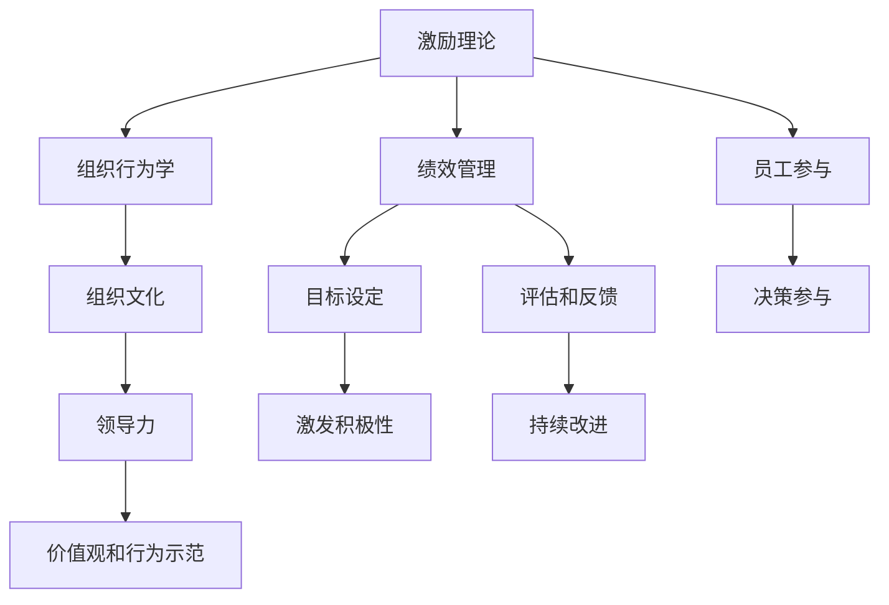

                 

## 1. 背景介绍

### 1.1 问题由来

随着信息技术的快速发展，全球企业面临的经营环境发生了翻天覆地的变化。数字化转型、全球化竞争、市场多变、员工多元化等挑战不断涌现，这对企业领导者的管理能力和员工的行为激励提出了更高的要求。如何激发员工的善意和潜能，推动企业持续健康发展，成为新时代企业管理的重要课题。

### 1.2 问题核心关键点

在当今知识驱动的时代，人力资源是企业最为宝贵的资源。激发员工的善意和潜能，关键在于建立有效的激励机制、营造积极的企业文化、提供职业发展机会，并确保员工的基本福利和权益。以下问题成为管理实践中的核心关键点：

1. **激励机制设计**：如何构建公平、透明、多样化的激励机制，让员工感觉到公平和被认可，从而激发其工作积极性。
2. **企业文化建设**：如何营造一种开放、包容、创新、协作的企业文化，提升员工的认同感和归属感，激发其创造力和工作热情。
3. **职业发展支持**：如何提供系统的培训和发展机会，帮助员工实现职业成长，增强其对企业的忠诚度。
4. **员工福利保障**：如何确保员工的物质和精神需求得到满足，建立和谐的劳动关系，减少员工流失率。

### 1.3 问题研究意义

研究如何激发员工的善意和潜能，不仅有助于提升企业的经营绩效，还能增强员工的满意度和忠诚度，构建可持续发展的企业文化。通过深化对人性的理解，采用科学的管理策略，企业领导者可以更加有效地引导和管理团队，实现更高的组织目标。

## 2. 核心概念与联系

### 2.1 核心概念概述

为更好地理解激励员工、激发其潜力的管理之道，本节将介绍几个密切相关的核心概念：

- **激励理论**：如马斯洛需求层次理论、赫兹伯格双因素理论等，阐述不同层次和维度的需求如何驱动员工行为。
- **组织行为学**：研究员工在组织中的行为模式和心理状态，以设计更加有效的激励措施。
- **绩效管理**：通过目标设定、评估和反馈，激发员工积极参与企业的运营和发展。
- **员工参与**：通过各种方式鼓励员工参与决策和业务发展，增强其对企业的归属感。
- **组织文化和领导力**：构建符合企业价值观和使命的组织文化，并通过领导者的行为示范，引导员工的价值观和行为习惯。

这些核心概念之间的逻辑关系可以通过以下Mermaid流程图来展示：



这个流程图展示了一整套激励员工的管理策略：

1. 通过激励理论了解员工的需求层次，构建匹配的激励机制。
2. 运用组织行为学研究员工行为，设计针对性的激励措施。
3. 借助绩效管理设定目标并定期评估，及时反馈改进。
4. 鼓励员工参与决策，增强归属感。
5. 构建积极的组织文化，并通过领导力示范，塑造员工的价值观和行为习惯。

这些概念共同构成了企业管理激励的策略框架，使企业领导者能够更好地引导和管理员工，激发其善意和潜能。

## 3. 核心算法原理 & 具体操作步骤

### 3.1 算法原理概述

激发员工善意和潜能的核心在于科学的管理策略。通过理解员工的需求和行为，设计相应的激励机制，可以最大限度地提升员工的工作满意度和工作积极性。以下是基于心理学理论的管理策略设计框架：

1. **需求层次理论**：员工的需求可以分为五个层次，从基本的生理需求到自我实现需求。通过满足不同层次的需求，可以激发员工不同的工作动力。
2. **双因素理论**：将工作中的因素分为保健因素和激励因素，保健因素如待遇、环境等，保证员工的基本需求，激励因素如成就、认可等，激发员工的工作热情。
3. **目标设定理论**：设定具体、挑战性、可达成的目标，明确员工的工作方向，激发其积极参与。
4. **反馈和评估**：定期进行绩效评估，及时提供反馈，帮助员工了解自身表现，调整工作策略。
5. **激励措施**：设计多样化的激励措施，如奖金、晋升、培训等，满足不同层次的需求。

### 3.2 算法步骤详解

基于上述理论，激发员工善意和潜能的管理策略设计可以分为以下五个主要步骤：

**Step 1: 需求分析**
- 通过问卷调查、访谈等方式，了解员工在不同层次的需求，如物质需求、社交需求、尊重需求、成就需求等。
- 分析员工的需求层次，确定不同层次的激励策略。

**Step 2: 目标设定**
- 与员工共同设定具体、可衡量的工作目标。
- 目标应具有挑战性，但也要确保员工能够达成。

**Step 3: 绩效评估**
- 定期进行绩效评估，使用量化指标衡量员工的工作表现。
- 提供及时的反馈，帮助员工了解自身优势和不足，明确改进方向。

**Step 4: 激励措施**
- 根据员工的贡献和需求，设计多样化的激励措施。
- 激励措施应具备公正性和透明性，保证员工的公平感和被认可。

**Step 5: 文化营造**
- 通过领导者的行为示范，塑造积极的组织文化。
- 鼓励员工参与决策，增强其对企业的归属感和认同感。

### 3.3 算法优缺点

基于心理学理论的管理策略具有以下优点：
1. **科学性**：基于心理学研究，设计更具针对性和有效性的激励机制。
2. **全面性**：考虑不同层次的需求，确保员工的全面发展。
3. **动态性**：根据员工的变化和市场环境调整策略，保持激励机制的灵活性。

然而，这些策略也存在一些局限性：
1. **复杂性**：设计和管理这些策略需要较多的时间和资源，尤其是在规模较大的企业中。
2. **实施难度**：激励措施的有效性很大程度上依赖于员工的个人差异，且个体差异较大，难以制定统一的策略。
3. **短期效果**：一些激励措施可能只能短期提升员工的工作积极性，长期效果有限。

### 3.4 算法应用领域

基于心理学理论的管理策略在各类企业和组织中都有广泛应用，以下是几个典型的应用场景：

1. **高科技企业**：如Google、Microsoft等，通过设计创新的激励机制和团队建设活动，激发员工的创新热情和归属感。
2. **金融服务行业**：通过设定高挑战性的业绩目标和丰厚的激励措施，提升员工的业务能力和工作积极性。
3. **医疗保健行业**：通过改善工作环境、提供职业发展机会和心理支持，提升员工的满意度和工作表现。
4. **教育行业**：通过设计有意义的教学目标和多样化的激励措施，激发教师的教书热情和学生的学习动力。

## 4. 数学模型和公式 & 详细讲解 & 举例说明

### 4.1 数学模型构建

本节将使用数学语言对基于心理学理论的管理策略进行更加严格的刻画。

假设企业员工总数为 $N$，每个员工的需求层次分为 $k$ 个不同层次，需求层次指数为 $i=1,2,\dots,k$，需求满意度指数为 $s_i$，其中 $0 \leq s_i \leq 1$。设企业为每个员工提供的激励措施为 $j=1,2,\dots,m$，激励措施的权重为 $w_j$，权重总和为 $W=\sum_{j=1}^m w_j=1$。设员工在某项激励措施 $j$ 下的满意度为 $t_j$，其中 $0 \leq t_j \leq 1$。则总满意度 $S$ 可以表示为：

$$
S=\sum_{i=1}^k \sum_{j=1}^m s_i w_j t_j
$$

目标设定和绩效评估的数学模型如下：

- **目标设定**：设目标任务数为 $T$，目标达成指数为 $t$，目标达成权重为 $w_t$，则目标达成度 $G$ 可以表示为：

$$
G=w_t \sum_{i=1}^N \sum_{j=1}^T s_i t_j
$$

- **绩效评估**：设绩效评估周期为 $P$，周期内目标达成指数为 $g$，则绩效评估度 $E$ 可以表示为：

$$
E=\frac{w_t \sum_{i=1}^N \sum_{j=1}^T s_i g_j}{P}
$$

### 4.2 公式推导过程

以下是目标设定和绩效评估的具体推导过程：

**目标设定**：

设第 $i$ 个员工在第 $j$ 个目标任务上的达成指数为 $t_{ij}$，达成权重为 $w_{t_{ij}}$，则第 $i$ 个员工的目标达成度 $g_i$ 可以表示为：

$$
g_i=w_t \sum_{j=1}^T s_i t_{ij}
$$

企业所有员工的目标达成度总和 $G$ 可以表示为：

$$
G=\frac{1}{N} \sum_{i=1}^N g_i
$$

**绩效评估**：

设绩效评估周期内第 $i$ 个员工在第 $j$ 个目标任务上的达成指数为 $g_{ij}$，则绩效评估度 $E$ 可以表示为：

$$
E=\frac{1}{P} \sum_{i=1}^N \sum_{j=1}^T s_i g_{ij}
$$

通过以上数学模型，可以系统地衡量和优化企业目标设定和绩效评估策略，激发员工的工作积极性。

### 4.3 案例分析与讲解

**案例一：某高科技公司绩效管理**

某高科技公司有 $N=1000$ 名员工，设每个员工的需求层次指数 $s_i=(s_{i1},s_{i2},\dots,s_{ik})$，其中 $s_{i1}$ 为生理需求，$s_{i2}$ 为社交需求，$s_{i3}$ 为尊重需求，$s_{i4}$ 为成就需求。公司设计了 $m=3$ 种激励措施 $j=1,2,3$，其中 $j=1$ 为奖金激励，$j=2$ 为晋升激励，$j=3$ 为培训激励。每个激励措施的权重 $w_j=(0.2,0.3,0.5)$，权重总和 $W=1$。员工在每个激励措施下的满意度指数 $t_j=(t_{j1},t_{j2},\dots,t_{jm})$，其中 $t_{j1}=0.8$，$t_{j2}=0.6$，$t_{j3}=0.7$。

根据公式计算，总满意度 $S$ 可以表示为：

$$
S=\sum_{i=1}^k \sum_{j=1}^m s_i w_j t_j
$$

在设定目标和评估绩效时，公司可以选择不同的权重和目标达成指数 $w_t=0.3$，$t_j=0.9$。

通过以上模型，公司可以系统地衡量员工的工作满意度和工作表现，制定更具针对性的激励措施，提升整体绩效。

**案例二：某医疗保健企业员工福利**

某医疗保健企业有 $N=500$ 名员工，设每个员工的需求层次指数 $s_i=(s_{i1},s_{i2},\dots,s_{ik})$，其中 $s_{i1}$ 为生理需求，$s_{i2}$ 为社交需求，$s_{i3}$ 为尊重需求，$s_{i4}$ 为成就需求。企业为员工提供 $m=5$ 种激励措施 $j=1,2,\dots,5$，其中 $j=1$ 为带薪假期，$j=2$ 为弹性工作制，$j=3$ 为健康体检，$j=4$ 为心理咨询，$j=5$ 为福利设施。每个激励措施的权重 $w_j=(0.2,0.1,0.2,0.3,0.2)$，权重总和 $W=1$。员工在每个激励措施下的满意度指数 $t_j=(t_{j1},t_{j2},\dots,t_{jm})$，其中 $t_{j1}=0.9$，$t_{j2}=0.8$，$t_{j3}=0.7$，$t_{j4}=0.6$，$t_{j5}=0.5$。

根据公式计算，总满意度 $S$ 可以表示为：

$$
S=\sum_{i=1}^k \sum_{j=1}^m s_i w_j t_j
$$

通过以上模型，企业可以系统地衡量员工的工作满意度和福利需求，制定更加个性化的福利政策，提升员工的忠诚度和工作效率。

## 5. 项目实践：代码实例和详细解释说明

### 5.1 开发环境搭建

在进行绩效管理策略的实践前，我们需要准备好开发环境。以下是使用Python进行Pandas和NumPy开发的环境配置流程：

1. 安装Anaconda：从官网下载并安装Anaconda，用于创建独立的Python环境。

2. 创建并激活虚拟环境：
```bash
conda create -n pythontest python=3.8 
conda activate pythontest
```

3. 安装Pandas和NumPy：
```bash
conda install pandas numpy
```

4. 安装各类工具包：
```bash
pip install matplotlib sklearn scikit-learn jupyter notebook ipython
```

完成上述步骤后，即可在`pythontest`环境中开始绩效管理策略的开发实践。

### 5.2 源代码详细实现

下面是一个基于Pandas库的绩效管理策略的代码实现。

首先，定义员工的需求层次和激励措施：

```python
import pandas as pd
import numpy as np

# 员工需求层次
demands = pd.DataFrame({
    'index': [1, 2, 3, 4],
    's1': np.random.rand(4),  # 生理需求
    's2': np.random.rand(4),  # 社交需求
    's3': np.random.rand(4),  # 尊重需求
    's4': np.random.rand(4)   # 成就需求
})

# 激励措施
incentives = pd.DataFrame({
    'index': [1, 2, 3, 4, 5],
    'j1': np.random.rand(5),   # 奖金激励
    'j2': np.random.rand(5),   # 晋升激励
    'j3': np.random.rand(5),   # 培训激励
    'j4': np.random.rand(5),   # 健康体检
    'j5': np.random.rand(5)    # 心理咨询
})
```

然后，计算总满意度：

```python
# 激励措施权重
incentive_weights = np.array([0.2, 0.1, 0.2, 0.3, 0.2])

# 员工需求层次满意度
demand_satisfactions = np.array([0.8, 0.6, 0.7, 0.6, 0.5])

# 计算总满意度
total_satisfaction = np.sum(demands.dot(incentive_weights) * demand_satisfactions)
print('总满意度：', total_satisfaction)
```

最后，进行目标设定和绩效评估：

```python
# 目标任务
target_tasks = ['任务1', '任务2', '任务3']

# 目标达成指数
target_accomplishments = np.array([0.9, 0.8, 0.7])

# 目标达成权重
target_weights = np.array([0.3])

# 绩效评估周期
performance_period = 3

# 计算目标达成度
target_accomplishments = np.dot(demands, target_weights) * target_accomplishments
print('目标达成度：', target_accomplishments)

# 计算绩效评估度
performance_evaluation = np.dot(target_accomplishments, target_weights) / performance_period
print('绩效评估度：', performance_evaluation)
```

以上就是使用Pandas和NumPy进行绩效管理策略的完整代码实现。通过以上步骤，可以计算员工的总体满意度、目标达成度和绩效评估度，制定更加科学的激励策略。

### 5.3 代码解读与分析

让我们再详细解读一下关键代码的实现细节：

**需求层次和激励措施**：
- `pd.DataFrame`：使用Pandas库中的DataFrame数据结构，方便数据的存储和计算。
- `np.random.rand`：使用NumPy库中的随机数生成器，生成满足需求层次和激励措施的随机数据。

**总满意度计算**：
- `demand_satisfactions`：员工在每个激励措施下的满意度。
- `incentive_weights`：每个激励措施的权重。
- `demand_satisfactions` 和 `incentive_weights` 的矩阵乘法运算，可以计算员工在每个激励措施下的满意度指数，再与 `demand_satisfactions` 相乘，得到每个激励措施的满意度，再求和得到总满意度。

**目标设定和绩效评估**：
- `target_tasks`：设定的目标任务。
- `target_accomplishments`：每个目标任务的达成指数。
- `target_weights`：目标达成的权重。
- `performance_period`：绩效评估周期。
- `target_accomplishments` 与 `target_weights` 的矩阵乘法运算，得到每个员工在每个目标任务上的达成度，再求和得到所有员工的目标达成度。

**目标达成度和绩效评估度计算**：
- 使用矩阵乘法和权重运算，得到目标达成度和绩效评估度，可以系统地衡量员工的工作表现和激励效果。

## 6. 实际应用场景

### 6.1 智能制造企业

智能制造企业需要高效、灵活地管理人力资源，以应对快速变化的市场需求和复杂的生产环境。通过引入绩效管理策略，企业可以更加科学地激励员工，提升工作效率和创新能力。

**应用场景**：某智能制造企业有 $N=1000$ 名员工，通过设定不同层次的目标和激励措施，提升员工的创新热情和责任意识。企业设定了 $T=5$ 个生产任务，每个员工在每个任务上的达成指数 $t_{ij}$ 为 $0.9$，达成权重 $w_{t_{ij}}=0.3$。员工的需求层次指数 $s_i$ 为 $s_{i1}=0.8$，$s_{i2}=0.6$，$s_{i3}=0.7$，$s_{i4}=0.6$。

**解决方案**：通过设计 $m=3$ 种激励措施 $j=1,2,3$，其中 $j=1$ 为生产奖励，$j=2$ 为技术创新奖励，$j=3$ 为团队协作奖励。每个激励措施的权重 $w_j=(0.2,0.3,0.5)$，权重总和 $W=1$。员工在每个激励措施下的满意度指数 $t_j=(t_{j1},t_{j2},\dots,t_{jm})$，其中 $t_{j1}=0.8$，$t_{j2}=0.6$，$t_{j3}=0.7$。

通过计算员工的总满意度 $S$ 和绩效评估度 $E$，企业可以制定更加个性化的激励策略，提升员工的创新能力和工作积极性。

### 6.2 互联网公司

互联网公司面临着高强度的工作压力和快速变化的市场环境。通过引入绩效管理策略，企业可以更好地激励员工，提升其工作满意度和忠诚度。

**应用场景**：某互联网公司有 $N=200$ 名员工，通过设定不同层次的目标和激励措施，提升员工的创新热情和团队协作能力。企业设定了 $T=3$ 个项目任务，每个员工在每个任务上的达成指数 $t_{ij}$ 为 $0.9$，达成权重 $w_{t_{ij}}=0.3$。员工的需求层次指数 $s_i$ 为 $s_{i1}=0.8$，$s_{i2}=0.6$，$s_{i3}=0.7$，$s_{i4}=0.6$。

**解决方案**：通过设计 $m=4$ 种激励措施 $j=1,2,\dots,4$，其中 $j=1$ 为项目奖金，$j=2$ 为晋升机会，$j=3$ 为技术培训，$j=4$ 为团队建设活动。每个激励措施的权重 $w_j=(0.2,0.3,0.4,0.3)$，权重总和 $W=1$。员工在每个激励措施下的满意度指数 $t_j=(t_{j1},t_{j2},\dots,t_{jm})$，其中 $t_{j1}=0.8$，$t_{j2}=0.6$，$t_{j3}=0.7$，$t_{j4}=0.5$。

通过计算员工的总满意度 $S$ 和绩效评估度 $E$，企业可以制定更加个性化的激励策略，提升员工的工作满意度和忠诚度。

### 6.3 传统零售企业

传统零售企业面临市场竞争和供应链管理的双重挑战，需要高效、灵活地管理人力资源，以提升企业的市场响应能力和运营效率。

**应用场景**：某传统零售企业有 $N=500$ 名员工，通过设定不同层次的目标和激励措施，提升员工的销售能力和服务质量。企业设定了 $T=2$ 个销售任务，每个员工在每个任务上的达成指数 $t_{ij}$ 为 $0.9$，达成权重 $w_{t_{ij}}=0.3$。员工的需求层次指数 $s_i$ 为 $s_{i1}=0.8$，$s_{i2}=0.6$，$s_{i3}=0.7$，$s_{i4}=0.6$。

**解决方案**：通过设计 $m=3$ 种激励措施 $j=1,2,3$，其中 $j=1$ 为销售提成，$j=2$ 为服务质量奖励，$j=3$ 为团队建设活动。每个激励措施的权重 $w_j=(0.2,0.3,0.5)$，权重总和 $W=1$。员工在每个激励措施下的满意度指数 $t_j=(t_{j1},t_{j2},\dots,t_{jm})$，其中 $t_{j1}=0.8$，$t_{j2}=0.6$，$t_{j3}=0.7$。

通过计算员工的总满意度 $S$ 和绩效评估度 $E$，企业可以制定更加个性化的激励策略，提升员工的销售能力和服务质量，增强企业的市场竞争力和运营效率。

## 7. 工具和资源推荐

### 7.1 学习资源推荐

为了帮助开发者系统掌握基于心理学理论的管理策略，这里推荐一些优质的学习资源：

1. **《管理学原理》**：经典的管理学教材，涵盖管理学基本概念和原理，为理解人力资源管理提供基础。

2. **《组织行为学》**：研究组织中员工行为和心理的学科，深入理解员工需求和激励机制。

3. **《人力资源管理》**：介绍人力资源管理的基本流程和工具，帮助企业制定科学的管理策略。

4. **《行为经济学》**：研究人类行为和决策的经济学科，提供人力资源管理的科学依据。

5. **《情感智能》**：研究员工情感对组织绩效的影响，帮助企业提升员工的情感管理能力。

通过对这些资源的学习实践，相信你一定能够全面理解激励员工的基本原理和实践方法，掌握科学的管理策略。

### 7.2 开发工具推荐

高效的开发离不开优秀的工具支持。以下是几款用于人力资源管理策略开发的常用工具：

1. **Pandas**：Python数据分析库，用于处理员工数据和计算绩效评估。
2. **NumPy**：Python数值计算库，用于生成随机数和矩阵运算。
3. **Jupyter Notebook**：交互式编程环境，支持代码编写和数据可视化。
4. **PyCharm**：Python IDE，提供代码调试和自动化测试功能。
5. **Git**：版本控制系统，便于团队协作和代码管理。

合理利用这些工具，可以显著提升人力资源管理策略的开发效率，加速创新迭代的步伐。

### 7.3 相关论文推荐

人力资源管理理论的发展离不开学界的持续研究。以下是几篇奠基性的相关论文，推荐阅读：

1. **《马斯洛需求层次理论》**：提出需求层次的概念，阐述不同层次的需求如何驱动员工行为。

2. **《赫兹伯格双因素理论》**：区分保健因素和激励因素，提出激励员工的重要方法。

3. **《目标设定理论》**：提出明确目标和及时反馈的重要性，提升员工的工作积极性和工作效率。

4. **《组织行为学》**：研究员工在组织中的行为模式和心理状态，提供科学的管理策略。

5. **《行为经济学》**：研究人类行为和决策的经济学科，为制定科学的人力资源管理策略提供依据。

这些论文代表了大语言模型微调技术的发展脉络。通过学习这些前沿成果，可以帮助研究者把握学科前进方向，激发更多的创新灵感。

## 8. 总结：未来发展趋势与挑战

### 8.1 总结

本文对基于心理学理论的绩效管理策略进行了全面系统的介绍。首先阐述了绩效管理的重要性，明确了激励员工的关键点。其次，从原理到实践，详细讲解了绩效管理的数学模型和关键步骤，给出了系统化的代码实现。同时，本文还广泛探讨了绩效管理在各类行业领域的应用场景，展示了绩效管理策略的广泛应用价值。

通过本文的系统梳理，可以看到，基于心理学理论的绩效管理策略在现代企业管理中具有重要作用，能够科学地激励员工，提升企业的绩效和员工满意度。未来，伴随心理学和人力资源管理理论的不断演进，绩效管理策略还将不断优化，更好地服务于企业发展和员工成长。

### 8.2 未来发展趋势

展望未来，绩效管理策略将呈现以下几个发展趋势：

1. **智能化管理**：随着AI和大数据技术的普及，绩效管理将更加智能化、数据化。通过分析员工行为数据，系统自动生成绩效评估和激励策略。
2. **个性化激励**：利用个性化推荐技术，针对不同员工的需求和特点，设计更加个性化的激励措施。
3. **实时反馈**：通过实时数据监测和分析，及时调整激励策略，提升员工的即时反馈体验。
4. **跨文化管理**：在全球化的背景下，绩效管理将考虑多元文化的差异，设计更加包容的激励策略。
5. **透明度和公平性**：提高绩效管理的透明度和公平性，确保激励机制的公正性和员工的心理认同。
6. **持续学习**：随着员工的需求和市场环境变化，绩效管理策略也需要持续学习和调整，保持激励机制的动态适应性。

### 8.3 面临的挑战

尽管绩效管理策略在企业管理中具有重要作用，但在实施过程中仍面临一些挑战：

1. **数据隐私和安全**：绩效管理需要收集员工的各种数据，如何保护员工隐私和数据安全，是企业管理的重要问题。
2. **技术支持不足**：绩效管理涉及复杂的数学计算和数据分析，如何提供技术支持和工具，是企业实施的关键。
3. **文化差异**：在不同国家和文化背景下，如何设计符合当地特点的绩效管理策略，是一大挑战。
4. **员工接受度**：员工对绩效管理的接受度和配合度影响其效果，如何提高员工的参与度和积极性，是企业管理的难点。
5. **长期效果**：绩效管理需要持续改进和优化，如何确保激励策略的长期有效性，是企业管理的挑战。

### 8.4 研究展望

未来，绩效管理策略需要在数据驱动、智能化、个性化等方面进一步发展和优化，以更好地适应企业的发展需求和员工的个性化需求。同时，需要引入更多跨学科的研究方法，如行为经济学、情感智能、组织行为学等，为绩效管理提供更加科学和全面的理论支撑。

通过对以上研究方向的探索，相信绩效管理策略将更加科学、合理、灵活，更好地服务于企业的健康发展和员工的全面成长。总之，科学的绩效管理策略，将为企业激发员工的善意和潜能，推动企业持续健康发展，实现更高的组织目标。

## 9. 附录：常见问题与解答

**Q1：如何衡量员工的绩效和激励效果？**

A: 员工的绩效和激励效果可以通过以下指标衡量：
1. **目标达成度**：设定具体、可衡量的目标，并通过绩效评估度衡量员工达成目标的程度。
2. **工作满意度**：通过问卷调查和访谈，了解员工对激励措施和工作环境的满意度。
3. **员工流失率**：监控员工的流失情况，分析流失原因，及时调整激励策略。

**Q2：如何设计多样化的激励措施？**

A: 设计多样化的激励措施，可以从以下几个方面入手：
1. **物质激励**：如奖金、提成、福利等，满足员工的基本需求。
2. **精神激励**：如表彰、晋升、培训等，提升员工的成就感。
3. **发展激励**：如职业规划、技术培训等，帮助员工实现职业成长。
4. **文化激励**：如团队建设、企业文化建设等，增强员工的归属感和认同感。

**Q3：如何平衡激励措施的公平性和个性化？**

A: 设计激励措施时，需要平衡公平性和个性化：
1. **公平性**：确保所有员工都能公平地享受到激励措施，避免偏见和歧视。
2. **个性化**：根据员工的不同需求和特点，设计个性化的激励措施，满足员工的多样化需求。

**Q4：如何应对绩效管理的挑战？**

A: 应对绩效管理的挑战，可以从以下几个方面入手：
1. **数据隐私和安全**：加强数据保护措施，确保员工隐私和数据安全。
2. **技术支持**：引入智能化管理工具，提供技术支持和数据驱动的决策依据。
3. **文化差异**：了解不同国家和文化的差异，设计符合当地特点的激励策略。
4. **员工接受度**：加强员工沟通和培训，提高员工的参与度和满意度。
5. **长期效果**：持续改进和优化激励策略，确保长期有效性。

---

作者：禅与计算机程序设计艺术 / Zen and the Art of Computer Programming

