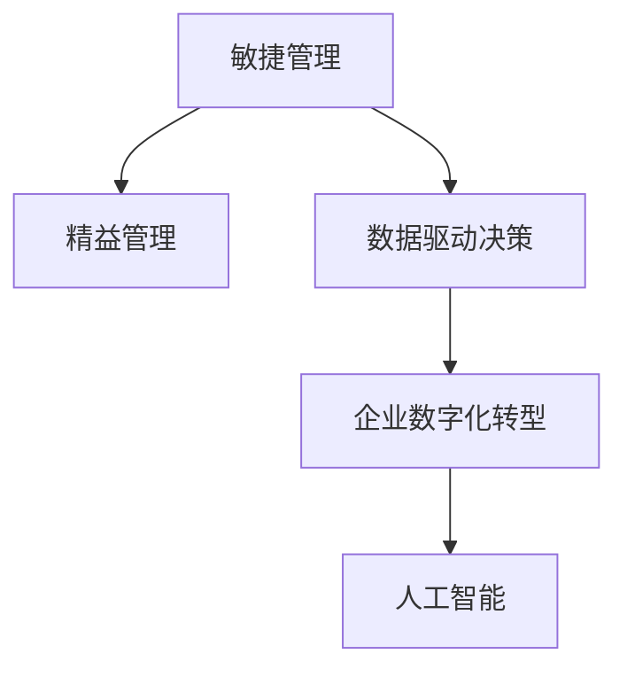

                 

# 管理者如何应对快速变化的商业环境

在当今瞬息万变的商业环境中，管理者面临着前所未有的挑战。随着科技进步、市场需求变化、全球化竞争等因素的影响，传统企业运营模式和思维模式已经无法适应新的商业环境。如何应对快速变化的商业环境，成为每一个管理者必须解决的问题。本文将从核心概念、算法原理、操作步骤、实际应用场景、未来展望、资源推荐等多个方面，探讨管理者如何在快速变化的商业环境中保持竞争优势。

## 1. 背景介绍

### 1.1 问题由来
近年来，随着互联网技术的普及、全球化市场的加速、消费者需求的多样化，商业环境变得愈发复杂和动态。企业的运营环境不再稳定，竞争对手和市场条件的变化时刻影响着企业的生存和发展。传统的静态管理模式已无法应对快速变化的商业环境，管理者需要寻找新的策略和方法来应对。

### 1.2 问题核心关键点
管理者应对快速变化的环境，需要从多个层面进行思考和行动：
- **数据驱动决策**：利用数据和分析工具，快速了解市场动态和消费者需求。
- **敏捷管理**：采用敏捷开发和持续交付的方法，快速适应市场变化。
- **技术创新**：投资于新技术和新产品，提升企业的竞争力和市场反应速度。
- **文化建设**：营造开放、包容的企业文化，增强团队的创新能力和灵活性。

### 1.3 问题研究意义
研究管理者如何应对快速变化的商业环境，对于企业战略规划、组织转型、创新管理等方面具有重要意义：
- **提高决策质量**：通过数据驱动的决策方法，提升决策的科学性和准确性。
- **加速市场响应**：采用敏捷管理方法，加快产品和服务迭代速度，缩短市场周期。
- **增强竞争力**：通过技术创新和文化建设，提升企业的市场竞争力和创新能力。
- **优化管理流程**：构建高效的管理体系和工具，提升管理效率和效果。

## 2. 核心概念与联系

### 2.1 核心概念概述

为更好地理解管理者如何应对快速变化的商业环境，本节将介绍几个密切相关的核心概念：

- **敏捷管理（Agile Management）**：采用迭代、增量开发的方式，快速响应市场变化，提升产品和服务质量。
- **精益管理（Lean Management）**：消除浪费，持续改进，提升运营效率和产品价值。
- **数据驱动决策（Data-Driven Decision Making）**：利用数据分析工具和算法，支持决策过程，优化资源配置。
- **企业数字化转型（Digital Transformation）**：通过信息技术手段，实现业务流程优化和管理模式创新。
- **人工智能（Artificial Intelligence）**：利用机器学习、深度学习等技术，提升自动化水平和决策精准度。

这些核心概念之间的逻辑关系可以通过以下Mermaid流程图来展示：



这个流程图展示了几大核心概念之间的联系：

1. 敏捷管理通过迭代和增量开发，快速响应市场变化，消除浪费，持续改进，提升运营效率。
2. 数据驱动决策利用数据分析工具和算法，支持决策过程，优化资源配置。
3. 企业数字化转型通过信息技术手段，实现业务流程优化和管理模式创新。
4. 人工智能利用机器学习、深度学习等技术，提升自动化水平和决策精准度。

这些概念共同构成了管理者应对快速变化商业环境的策略框架，使得企业能够灵活适应市场变化，提升竞争力和创新能力。

## 3. 核心算法原理 & 具体操作步骤

### 3.1 算法原理概述

管理者应对快速变化商业环境的策略，本质上是一个数据驱动、敏捷、技术驱动的过程。其核心思想是通过收集和分析市场数据，快速识别市场趋势和消费者需求，采用敏捷和精益的方法，及时调整和优化产品和服务，同时投资于新技术和人工智能，提升企业的自动化水平和决策能力。

形式化地，假设企业初始状态为 $S_0$，市场环境为 $E$，决策过程为 $D$，则管理者应对变化的商业环境的策略可以表示为：

$$
S_{t+1} = D(S_t, E_t)
$$

其中 $S_{t+1}$ 表示下一时刻企业的状态，$E_t$ 表示当前市场环境，$D$ 表示企业的决策过程。

### 3.2 算法步骤详解

管理者应对快速变化商业环境的策略包括以下几个关键步骤：

**Step 1: 数据收集与分析**
- 收集市场数据，包括消费者行为、竞争对手动态、市场趋势等。
- 利用数据分析工具，如大数据分析、机器学习算法等，提取有价值的信息和洞见。

**Step 2: 敏捷开发与迭代**
- 采用敏捷开发方法，如Scrum、Kanban等，进行快速迭代和持续交付。
- 设置短周期的迭代周期，定期评估产品和服务的效果，进行优化和改进。

**Step 3: 精益管理与持续改进**
- 利用精益管理工具，如价值流图、五五原则等，消除浪费，提升效率。
- 定期进行流程优化和质量改进，提升产品和服务价值。

**Step 4: 技术投资与创新**
- 投资于新技术和人工智能，提升企业的自动化水平和决策能力。
- 开发和应用数据分析、机器学习、自然语言处理等技术，提升产品和服务质量。

**Step 5: 数据驱动决策**
- 利用数据分析工具，进行市场预测、需求分析、竞争对手分析等。
- 根据分析结果，制定和调整企业战略和运营策略，确保决策的科学性和准确性。

### 3.3 算法优缺点

管理者应对快速变化商业环境的策略具有以下优点：
1. 数据驱动：通过数据分析支持决策过程，提升决策的科学性和准确性。
2. 敏捷性：采用敏捷开发方法，快速响应市场变化，提升产品和服务质量。
3. 技术创新：投资于新技术和人工智能，提升企业的自动化水平和决策能力。
4. 持续改进：通过精益管理，消除浪费，提升运营效率和产品价值。
5. 灵活适应：灵活应对市场变化，提升企业的竞争力和市场反应速度。

同时，该策略也存在一定的局限性：
1. 数据质量：数据收集和分析的质量直接影响决策效果，需要保证数据准确性和完整性。
2. 技术门槛：新技术和人工智能的应用需要一定的技术储备和专业知识。
3. 团队协同：敏捷开发和精益管理需要团队高度协同和沟通，可能需要调整企业组织结构。
4. 变革阻力：企业文化和流程的变革可能会遇到阻力，需要有效管理和引导。

尽管存在这些局限性，但就目前而言，数据驱动、敏捷、技术驱动的策略仍是应对快速变化商业环境的最主流方法。未来相关研究的重点在于如何进一步优化数据收集和分析方法，提升团队协作效率，降低技术门槛，以实现更高的效果和效率。

### 3.4 算法应用领域

管理者应对快速变化商业环境的策略，已经在各个行业得到了广泛的应用，例如：

- **零售行业**：通过数据分析和敏捷开发，快速调整产品线和市场策略，提升销售效率和客户满意度。
- **金融行业**：利用机器学习和大数据分析，进行市场预测和风险控制，提升金融服务的质量和效率。
- **制造业**：采用精益生产和敏捷制造，提升生产效率和产品一致性，快速响应市场需求变化。
- **医疗行业**：通过数据分析和人工智能，优化医疗流程和诊断决策，提升医疗服务的质量和可及性。
- **教育行业**：采用数据驱动和敏捷方法，提升教育质量和学生体验，满足个性化教育需求。

除了上述这些经典行业外，管理策略的灵活应用也在更多领域得到了验证，如智慧城市、智能交通、能源管理等，为各行各业带来了新的变革和机遇。

## 4. 数学模型和公式 & 详细讲解 & 举例说明

### 4.1 数学模型构建

本节将使用数学语言对管理者应对快速变化商业环境的策略进行更加严格的刻画。

假设企业初始状态为 $S_0$，市场环境为 $E_t$，决策过程为 $D$，则管理者应对变化的商业环境的策略可以表示为：

$$
S_{t+1} = D(S_t, E_t)
$$

其中 $S_{t+1}$ 表示下一时刻企业的状态，$E_t$ 表示当前市场环境，$D$ 表示企业的决策过程。

### 4.2 公式推导过程

以下我们以零售行业为例，推导数据驱动决策的数学模型。

假设零售企业初始状态为 $S_0$，市场环境为 $E_t$，决策过程为 $D$。设市场环境 $E_t$ 由消费者需求 $D_t$ 和竞争对手动态 $C_t$ 组成。则市场环境的表示为：

$$
E_t = (D_t, C_t)
$$

其中 $D_t$ 表示消费者需求，$C_t$ 表示竞争对手动态。

消费者需求 $D_t$ 可以通过数据分析工具得到，表示为：

$$
D_t = (d_{1,t}, d_{2,t}, \ldots, d_{n,t})
$$

其中 $d_{i,t}$ 表示第 $i$ 个消费者的需求量。

竞争对手动态 $C_t$ 可以通过市场调研和数据分析得到，表示为：

$$
C_t = (c_{1,t}, c_{2,t}, \ldots, c_{m,t})
$$

其中 $c_{j,t}$ 表示第 $j$ 个竞争对手的市场动态。

企业的决策过程 $D$ 由多个决策参数 $p_i$ 组成，表示为：

$$
D = (p_1, p_2, \ldots, p_k)
$$

其中 $p_i$ 表示第 $i$ 个决策参数。

根据以上定义，企业的下一时刻状态 $S_{t+1}$ 可以表示为：

$$
S_{t+1} = D(S_t, E_t) = (p_1(S_t, D_t, C_t), p_2(S_t, D_t, C_t), \ldots, p_k(S_t, D_t, C_t))
$$

其中 $p_i(S_t, D_t, C_t)$ 表示第 $i$ 个决策参数的计算公式。

### 4.3 案例分析与讲解

假设某零售企业在某个时间点 $t$ 的状态为 $S_t = (S_{1,t}, S_{2,t}, \ldots, S_{m,t})$，其中 $S_{i,t}$ 表示第 $i$ 个库存水平。市场环境 $E_t = (D_t, C_t)$，其中 $D_t = (d_{1,t}, d_{2,t}, \ldots, d_{n,t})$ 表示消费者需求，$C_t = (c_{1,t}, c_{2,t}, \ldots, c_{m,t})$ 表示竞争对手动态。

企业的决策过程 $D$ 由多个决策参数 $p_i$ 组成，其中 $p_1(S_t, D_t, C_t)$ 表示补货策略，$p_2(S_t, D_t, C_t)$ 表示定价策略。

在某个时间点 $t$，企业根据当前状态和市场环境，计算决策参数：

- 补货策略 $p_1(S_t, D_t, C_t)$：根据当前库存水平 $S_t$ 和消费者需求 $D_t$，计算补货数量。
- 定价策略 $p_2(S_t, D_t, C_t)$：根据消费者需求 $D_t$ 和竞争对手动态 $C_t$，计算最优价格。

根据以上计算结果，企业的下一时刻状态 $S_{t+1}$ 可以表示为：

$$
S_{t+1} = D(S_t, E_t) = (p_1(S_t, D_t, C_t), p_2(S_t, D_t, C_t))
$$

例如，假设企业根据当前库存水平和消费者需求，计算出最优补货数量为 1000 个，最优价格为 30 元。则企业的下一时刻状态为：

$$
S_{t+1} = (1000, 30)
$$

通过以上案例分析，可以看到，管理者通过数据驱动决策，结合市场环境和内部资源，快速调整产品和服务策略，提升了运营效率和市场竞争力。

## 5. 项目实践：代码实例和详细解释说明

### 5.1 开发环境搭建

在进行项目实践前，我们需要准备好开发环境。以下是使用Python进行Pandas和Scikit-learn开发的开发环境配置流程：

1. 安装Anaconda：从官网下载并安装Anaconda，用于创建独立的Python环境。

2. 创建并激活虚拟环境：
```bash
conda create -n py-env python=3.8 
conda activate py-env
```

3. 安装Pandas和Scikit-learn：
```bash
conda install pandas scikit-learn
```

4. 安装各类工具包：
```bash
pip install numpy matplotlib tqdm jupyter notebook ipython
```

完成上述步骤后，即可在`py-env`环境中开始项目实践。

### 5.2 源代码详细实现

下面我们以零售行业为例，给出使用Pandas和Scikit-learn进行数据驱动决策的Python代码实现。

首先，定义数据处理函数：

```python
import pandas as pd

def load_data(file_path):
    data = pd.read_csv(file_path)
    return data
```

然后，定义模型和优化器：

```python
from sklearn.linear_model import LinearRegression
from sklearn.preprocessing import MinMaxScaler

def create_model(X, y):
    model = LinearRegression()
    model.fit(X, y)
    return model

def scale_data(X):
    scaler = MinMaxScaler()
    X_scaled = scaler.fit_transform(X)
    return X_scaled
```

接着，定义训练和评估函数：

```python
from sklearn.metrics import mean_squared_error

def train_model(model, X_train, y_train, X_test, y_test):
    model.fit(X_train, y_train)
    y_pred = model.predict(X_test)
    mse = mean_squared_error(y_test, y_pred)
    return mse

def evaluate_model(model, X_test, y_test):
    y_pred = model.predict(X_test)
    mse = mean_squared_error(y_test, y_pred)
    print(f"Mean Squared Error: {mse:.2f}")
```

最后，启动训练流程并在测试集上评估：

```python
X_train = load_data('train.csv')
y_train = load_data('train-target.csv')
X_test = load_data('test.csv')
y_test = load_data('test-target.csv')

X_train = scale_data(X_train)
X_test = scale_data(X_test)

model = create_model(X_train, y_train)
train_mse = train_model(model, X_train, y_train, X_test, y_test)
evaluate_model(model, X_test, y_test)
```

以上就是使用Pandas和Scikit-learn进行数据驱动决策的完整代码实现。可以看到，Pandas和Scikit-learn等Python库使得数据处理和模型训练变得简单高效。

### 5.3 代码解读与分析

让我们再详细解读一下关键代码的实现细节：

**load_data函数**：
- 用于加载数据，返回Pandas DataFrame对象。

**create_model函数**：
- 创建线性回归模型，并训练模型，返回训练好的模型。

**scale_data函数**：
- 对输入数据进行归一化处理，避免模型训练时出现数值过大或过小的问题。

**train_model函数**：
- 对模型进行训练，计算模型在测试集上的均方误差。

**evaluate_model函数**：
- 评估模型在测试集上的均方误差，并输出结果。

**训练流程**：
- 加载训练集和测试集数据，并进行归一化处理。
- 创建线性回归模型，并训练模型。
- 在测试集上评估模型，并输出均方误差。

可以看到，Pandas和Scikit-learn库的强大封装使得数据驱动决策的代码实现变得简洁高效。开发者可以将更多精力放在数据处理、模型改进等高层逻辑上，而不必过多关注底层的实现细节。

当然，工业级的系统实现还需考虑更多因素，如模型的保存和部署、超参数的自动搜索、更灵活的模型结构等。但核心的数据驱动决策逻辑基本与此类似。

## 6. 实际应用场景

### 6.1 智能零售

智能零售是数据驱动决策在零售行业中的应用。通过收集消费者行为数据、竞争对手动态、市场趋势等，实时分析消费者需求和市场变化，企业可以迅速调整产品和服务策略，优化库存管理和定价策略，提升销售效率和客户满意度。

例如，某电商企业通过分析历史销售数据和消费者行为数据，实时调整库存和促销策略，提升销售额和用户体验。同时，利用机器学习算法，预测消费者需求变化，优化供应链管理，降低库存成本。

### 6.2 金融风险管理

金融风险管理是数据驱动决策在金融行业中的应用。通过收集金融市场数据、宏观经济数据、公司财务数据等，实时分析市场风险和投资机会，企业可以迅速调整投资组合，降低风险，提升投资回报率。

例如，某金融机构通过分析历史交易数据和市场趋势，实时预测市场波动和风险，优化资产配置，降低投资风险。同时，利用机器学习算法，识别不良贷款和高风险客户，提升风险管理能力。

### 6.3 智能制造

智能制造是数据驱动决策在制造业中的应用。通过收集生产数据、设备数据、供应链数据等，实时分析生产过程和供应链状况，企业可以迅速调整生产计划和供应链策略，提升生产效率和产品质量。

例如，某制造业企业通过分析生产设备运行数据和生产订单数据，实时调整生产计划，优化生产流程，提高生产效率。同时，利用机器学习算法，预测设备故障和供应链风险，提升供应链管理能力。

### 6.4 未来应用展望

随着数据驱动决策方法的发展，未来将在更多领域得到应用，为传统行业带来变革性影响。

在智慧医疗领域，通过数据分析和机器学习，优化医疗流程和诊断决策，提升医疗服务的质量和可及性。

在智能教育领域，通过数据分析和人工智能，提升教育质量和学生体验，满足个性化教育需求。

在智慧城市治理中，通过数据分析和机器学习，优化城市管理，提高城市服务的效率和质量。

此外，在企业生产、社会治理、文娱传媒等众多领域，数据驱动决策方法也将不断涌现，为各行各业带来新的机遇和挑战。相信随着技术的日益成熟，数据驱动决策方法必将在构建智能社会中扮演越来越重要的角色。

## 7. 工具和资源推荐

### 7.1 学习资源推荐

为了帮助管理者掌握数据驱动决策的理论基础和实践技巧，这里推荐一些优质的学习资源：

1. 《数据科学导论》系列书籍：由知名学者撰写，深入浅出地介绍了数据科学的基本概念和前沿技术。

2. Coursera《数据科学导论》课程：由斯坦福大学和约翰霍普金斯大学联合开设，涵盖数据科学和机器学习的基础和进阶内容。

3. 《Python数据科学手册》书籍：全面介绍了Python在数据科学中的应用，包括Pandas、NumPy、Scikit-learn等库的使用。

4. Kaggle平台：提供大量公开的数据集和竞赛项目，通过实践提升数据分析和机器学习技能。

5. PyTorch官方文档：提供详细的PyTorch库使用教程，适合进行深度学习项目开发。

通过学习这些资源，管理者可以系统掌握数据驱动决策的理论基础和实践技巧，提升企业的决策能力和市场竞争力。

### 7.2 开发工具推荐

高效的数据驱动决策开发离不开优秀的工具支持。以下是几款用于数据分析和机器学习开发的常用工具：

1. Jupyter Notebook：免费的交互式开发环境，支持Python、R等多种语言，适合进行数据探索和模型开发。

2. JupyterLab：基于Web的Jupyter Notebook的升级版本，支持分布式计算和资源管理，适合大规模数据分析和机器学习项目。

3. Apache Spark：分布式计算框架，支持大规模数据处理和机器学习算法，适合进行大数据分析项目。

4. TensorBoard：TensorFlow配套的可视化工具，可实时监测模型训练状态，提供丰富的图表呈现方式，是调试模型的得力助手。

5. Weights & Biases：模型训练的实验跟踪工具，可以记录和可视化模型训练过程中的各项指标，方便对比和调优。

6. Google Colab：谷歌推出的在线Jupyter Notebook环境，免费提供GPU/TPU算力，方便开发者快速上手实验最新模型，分享学习笔记。

合理利用这些工具，可以显著提升数据驱动决策的开发效率，加快创新迭代的步伐。

### 7.3 相关论文推荐

数据驱动决策的发展源于学界的持续研究。以下是几篇奠基性的相关论文，推荐阅读：

1. Data Mining and Statistical Learning（《数据挖掘与统计学习》）：由著名机器学习专家撰写，全面介绍了数据挖掘和统计学习的理论和方法。

2. Deep Learning（《深度学习》）：由深度学习领域的开创者之一撰写，系统介绍了深度学习的原理和应用。

3. Pattern Recognition and Machine Learning（《模式识别与机器学习》）：由机器学习领域的权威专家撰写，深入探讨了模式识别和机器学习的基本概念和算法。

4. Reinforcement Learning: An Introduction（《强化学习：简介》）：由强化学习领域的权威专家撰写，全面介绍了强化学习的理论和方法。

这些论文代表了大数据和机器学习领域的发展脉络。通过学习这些前沿成果，管理者可以更好地理解和应用数据驱动决策方法，提升企业的决策能力和市场竞争力。

## 8. 总结：未来发展趋势与挑战

### 8.1 总结

本文对管理者如何应对快速变化的商业环境进行了全面系统的介绍。首先阐述了管理者在当前快速变化商业环境中面临的挑战和核心关键点，明确了数据驱动、敏捷、技术驱动的策略框架。其次，从原理到实践，详细讲解了数据驱动决策的数学模型和关键步骤，给出了数据驱动决策任务开发的完整代码实例。同时，本文还广泛探讨了数据驱动决策方法在智能零售、金融风险管理、智能制造等多个行业领域的应用前景，展示了数据驱动决策方法的光明前景。此外，本文精选了数据驱动决策技术的各类学习资源，力求为管理者提供全方位的技术指引。

通过本文的系统梳理，可以看到，数据驱动决策方法正在成为应对快速变化商业环境的重要手段，极大地提升了企业的决策能力和市场竞争力。未来，伴随数据驱动决策方法的不断演进，管理者将能够更加灵活高效地应对市场变化，推动企业的持续发展和创新。

### 8.2 未来发展趋势

展望未来，数据驱动决策方法将呈现以下几个发展趋势：

1. 数据获取能力提升。随着数据技术的进步，数据采集和处理能力将不断提升，数据的实时性和全面性将进一步增强，支持更加精准和及时的决策。

2. 算法模型优化。未来的数据驱动决策方法将更加注重算法模型的优化和训练，提升模型的准确性和泛化能力。

3. 跨领域应用拓展。数据驱动决策方法将在更多领域得到应用，如医疗、教育、城市治理等，为企业提供更全面的市场洞察和决策支持。

4. 智能辅助决策。人工智能和机器学习技术将进一步应用于决策支持系统，提供智能化的决策建议和分析。

5. 自动化决策体系。未来的数据驱动决策方法将更加自动化和智能化，通过自动化流程和智能算法，提升决策的效率和质量。

6. 数据隐私和安全。随着数据驱动决策方法的普及，数据隐私和安全问题也将成为重要关注点，需要在技术和管理层面进行全面保障。

以上趋势凸显了数据驱动决策方法的发展方向，这些方向的探索发展，必将进一步提升企业的决策能力和市场竞争力。

### 8.3 面临的挑战

尽管数据驱动决策方法已经取得了显著成效，但在迈向更加智能化、普适化应用的过程中，仍面临诸多挑战：

1. 数据质量。数据的准确性和完整性直接影响决策效果，需要保证数据采集和处理的准确性。

2. 技术门槛。算法模型和工具的复杂度较高，需要一定的技术储备和专业知识。

3. 数据隐私。大规模数据收集和分析涉及隐私保护问题，需要在技术和管理层面进行全面保障。

4. 技术迭代。技术快速变化，需要持续学习和跟进最新的技术进展。

5. 模型复杂度。大规模模型训练和优化需要强大的计算资源，需要有效的资源管理和优化。

6. 数据孤岛。不同数据源和系统之间存在数据孤岛问题，需要统一数据标准和接口，实现数据互联互通。

正视数据驱动决策面临的这些挑战，积极应对并寻求突破，将是大数据和机器学习技术持续发展和应用的关键。相信随着技术的日益成熟，数据驱动决策方法必将在构建智能社会中扮演越来越重要的角色。

### 8.4 研究展望

面对数据驱动决策方法所面临的种种挑战，未来的研究需要在以下几个方面寻求新的突破：

1. 数据融合与集成。通过数据融合和集成技术，消除不同数据源之间的孤岛问题，实现数据共享和互通。

2. 自动化和智能化。通过自动化和智能化技术，提升决策的效率和质量，降低人工干预和错误。

3. 跨领域应用。将数据驱动决策方法应用于更多领域，如医疗、教育、城市治理等，为企业提供更全面的市场洞察和决策支持。

4. 数据隐私和安全。通过技术和管理手段，保障数据隐私和安全，提升数据驱动决策的可靠性和可信度。

5. 模型优化和解释。通过优化模型结构和算法，提升模型的准确性和可解释性，增强决策的可信度和透明度。

6. 数据可视化与互动。通过数据可视化和互动技术，提升决策支持和分析的可视性和互动性，增强决策的直观性和易于理解性。

这些研究方向的探索，必将引领数据驱动决策方法迈向更高的台阶，为构建智能社会和提升企业管理能力提供更强大的技术支持。面向未来，数据驱动决策方法还需要与其他人工智能技术进行更深入的融合，如自然语言处理、知识图谱、强化学习等，多路径协同发力，共同推动企业决策能力的提升和智能社会的发展。只有勇于创新、敢于突破，才能不断拓展数据驱动决策方法的应用边界，让智能技术更好地造福人类社会。

## 9. 附录：常见问题与解答

**Q1：数据驱动决策如何提升企业的决策能力？**

A: 数据驱动决策通过收集和分析市场数据、消费者行为数据、竞争对手动态等，实时获取市场洞察和消费者需求，支持决策过程，提升决策的科学性和准确性。数据驱动决策还能帮助企业识别市场机会和风险，优化资源配置，提升运营效率和市场竞争力。

**Q2：数据驱动决策的关键是什么？**

A: 数据驱动决策的关键在于数据的质量、数据的获取和处理能力、算法的模型和优化、跨领域应用拓展等方面。数据驱动决策需要高质量、实时、全面、准确的数据支持，需要先进的算法模型和优化技术，需要跨领域的广泛应用，才能真正提升企业的决策能力和市场竞争力。

**Q3：数据驱动决策在具体应用中需要注意哪些问题？**

A: 数据驱动决策在具体应用中需要注意数据隐私和安全问题，避免数据泄露和滥用。需要建立健全的数据管理和隐私保护机制，确保数据的合法合规使用。此外，数据驱动决策还需要考虑数据质量、技术门槛、模型复杂度、数据孤岛等问题，需要在技术和管理层面进行全面保障。

**Q4：数据驱动决策的未来发展方向是什么？**

A: 数据驱动决策的未来发展方向在于数据获取能力的提升、算法模型的优化、跨领域应用拓展、智能辅助决策、自动化决策体系、数据隐私和安全等方面。未来数据驱动决策将更加自动化和智能化，通过智能算法和大数据支持，提升决策的效率和质量。同时，数据驱动决策将在更多领域得到应用，为企业的市场洞察和决策支持提供更全面的支持。

**Q5：数据驱动决策和传统决策方式有何不同？**

A: 数据驱动决策和传统决策方式的主要区别在于决策支持方式的不同。传统决策方式主要依赖经验和直觉，而数据驱动决策主要依赖数据和算法。数据驱动决策能够提供更加科学、客观、及时的决策支持，帮助企业优化资源配置，提升运营效率和市场竞争力。

通过本文的系统梳理，可以看到，数据驱动决策方法正在成为应对快速变化商业环境的重要手段，极大地提升了企业的决策能力和市场竞争力。未来，伴随数据驱动决策方法的不断演进，管理者将能够更加灵活高效地应对市场变化，推动企业的持续发展和创新。

