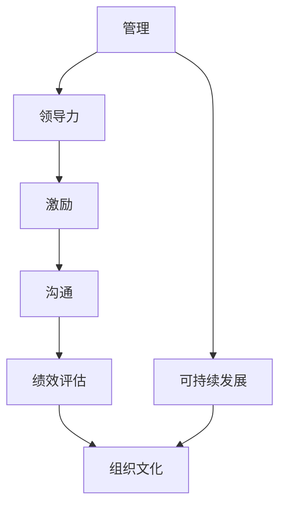

                 

# 管理艺术：激发团队潜力

> 关键词：管理,团队,潜力,激励,领导力,沟通,创新,绩效,组织文化,可持续发展

## 1. 背景介绍

### 1.1 问题由来
在当今这个快速变化和竞争激烈的时代，企业面临的挑战越来越大，如何有效地管理团队、激发团队潜力，成为了一个重要的话题。无论是初创企业还是大型企业，都希望通过高效的团队管理和激励措施，提升工作效率和创新能力，实现长远的发展目标。

### 1.2 问题核心关键点
管理艺术的核心在于如何平衡团队的激励与约束，如何在保持团队高效率的同时，激发成员的创造力和积极性。这包括选择合适的领导风格，制定合理的绩效考核机制，建立良好的沟通渠道，以及营造积极向上的组织文化等。

### 1.3 问题研究意义
研究管理艺术对于提升团队效能、促进创新、增强企业竞争力具有重要意义：

1. **提升团队效率**：通过科学的管理方法，可以最大程度地发挥团队成员的潜能，提高工作效率，从而更快地实现企业目标。
2. **促进创新**：良好的团队氛围和激励机制可以激发成员的创造力，为企业带来更多的创新思维和产品。
3. **增强竞争力**：有效的管理艺术可以提高员工的满意度和忠诚度，减少人才流失，增强企业的市场竞争力。
4. **推动可持续发展**：良好的团队管理和激励策略有助于企业实现长期稳定发展，实现可持续发展。

## 2. 核心概念与联系

### 2.1 核心概念概述

为了更好地理解如何激发团队潜力，本节将介绍几个密切相关的核心概念：

- **管理（Management）**：涉及计划、组织、领导和控制四个方面，旨在实现组织目标的同时，最大化员工的潜能和满意度。
- **领导力（Leadership）**：包括激励、指导和沟通等技能，是管理艺术的核心，能够直接影响团队的表现和成员的积极性。
- **激励（Incentives）**：通过各种奖励和惩罚措施，激发团队成员的内在动力，促使他们为组织目标努力工作。
- **沟通（Communication）**：是管理艺术的重要组成部分，良好的沟通能够促进信息的共享和理解的深化，减少误解和冲突。
- **绩效评估（Performance Evaluation）**：通过定量和定性的方法，评估团队成员的工作表现，为激励和改进提供依据。
- **组织文化（Organizational Culture）**：一个企业的价值观、信念和行为规范，能够影响员工的思维方式和工作方式。
- **可持续发展（Sustainable Development）**：在追求经济效益的同时，重视社会和环境责任，实现企业与社会的和谐共生。

这些核心概念之间的逻辑关系可以通过以下Mermaid流程图来展示：



这个流程图展示了一系列核心概念及其之间的关系：

1. **管理**是整个体系的基础，涉及各个方面，包括领导力、激励、沟通等。
2. **领导力**直接影响团队的表现，通过正确的指导和激励，提升团队效能。
3. **激励**是管理艺术的核心手段，通过各种措施激发成员的积极性。
4. **沟通**是管理的关键，良好的沟通能够促进信息的共享和理解的深化。
5. **绩效评估**提供评估依据，帮助识别成员表现，进行激励和改进。
6. **组织文化**影响员工的行为和思维方式，促进团队的凝聚力和认同感。
7. **可持续发展**关注企业长期发展，确保在追求经济效益的同时，不忽视社会和环境责任。

这些概念共同构成了管理艺术的框架，帮助管理者更好地激发团队潜力，实现组织目标。

## 3. 核心算法原理 & 具体操作步骤
### 3.1 算法原理概述

管理艺术的本质在于通过科学的理论和方法，系统地激发团队潜力，提升整体效能。其核心算法原理可以概括为以下几点：

1. **目标对齐（Goal Alignment）**：确保团队成员的工作目标与组织目标一致，明确工作的方向和重点。
2. **激励机制设计（Incentive Design）**：建立合理的激励机制，以金钱、荣誉、晋升等多种方式激发团队成员的内在动力。
3. **领导力提升（Leadership Development）**：培养领导者的综合能力，包括决策、沟通、激励等，提升其领导力水平。
4. **绩效评估体系（Performance Evaluation System）**：建立科学的绩效评估体系，通过定量和定性的方法，全面评估团队成员的工作表现。
5. **团队建设（Team Building）**：通过团队建设活动，增强团队凝聚力和协作精神，提高团队整体效能。

### 3.2 算法步骤详解

基于上述核心算法原理，管理艺术的具体操作步骤如下：

**Step 1: 明确组织目标**
- 定义组织的长期和短期目标，确保所有团队成员对目标有清晰的认识和理解。

**Step 2: 设计激励机制**
- 根据组织目标，设计多种激励措施，如奖金、股权、晋升机会等，确保激励与目标一致。
- 采用公平透明的标准，确保激励措施的公正性。

**Step 3: 培养领导者**
- 通过培训、学习等方式，提升领导者的管理能力和领导力。
- 鼓励领导者以身作则，树立良好的榜样。

**Step 4: 建立绩效评估体系**
- 制定明确的绩效评估标准，包括工作量、质量、创新等指标。
- 定期进行绩效评估，及时反馈评估结果，进行激励或改进。

**Step 5: 进行团队建设**
- 组织团队建设活动，增强成员之间的信任和合作。
- 促进知识分享和交流，提升团队整体能力。

**Step 6: 监控和调整**
- 定期监控团队绩效和成员满意度，及时发现问题进行调整。
- 根据反馈进行持续改进，不断优化管理方法。

### 3.3 算法优缺点

管理艺术在实践中取得了显著效果，但也存在一些缺点：

**优点**：
1. **系统性**：通过科学的方法和步骤，可以系统地激发团队潜力，提高整体效能。
2. **可操作性**：具体步骤明确，易于实施和管理。
3. **灵活性**：可以针对不同团队和场景进行个性化调整。
4. **长远性**：关注组织的长期发展，促进可持续发展。

**缺点**：
1. **复杂性**：需要综合考虑多个因素，实施过程可能较为复杂。
2. **资源投入**：设计和实施管理艺术需要投入大量时间和资源。
3. **适应性**：不同团队和文化背景需要不同的管理方法，难以一概而论。

### 3.4 算法应用领域

管理艺术在各种企业和管理场景中都有广泛应用，例如：

- **企业日常管理**：提升日常运营效率，确保团队目标一致。
- **项目团队管理**：协调团队成员的工作，确保项目按时完成。
- **人力资源管理**：招聘、培训、绩效评估等，提升员工满意度和忠诚度。
- **组织文化建设**：通过价值导向和行为规范，营造积极向上的企业文化。
- **创新管理**：鼓励员工创新，推动产品和服务的不断改进。
- **危机管理**：在突发事件中，通过有效沟通和激励措施，稳定团队情绪，恢复正常运营。

## 4. 数学模型和公式 & 详细讲解 & 举例说明

### 4.1 数学模型构建

为了更好地理解管理艺术的原理，我们将其抽象为数学模型。假设一个组织有 $n$ 个成员，每个成员的工作能力和积极性分别为 $c_i$ 和 $e_i$。管理艺术的目标是最大化组织的整体效能，即：

$$
\max_{c_i, e_i} \sum_{i=1}^n f(c_i, e_i)
$$

其中 $f(c_i, e_i)$ 为成员 $i$ 的工作效能函数，可以包含工作量、质量、创新等因素。

### 4.2 公式推导过程

为了简化模型，我们假设 $f(c_i, e_i) = c_i \times e_i$，即成员的工作效能与其能力和积极性成正比。则目标函数变为：

$$
\max_{c_i, e_i} \sum_{i=1}^n c_i \times e_i
$$

设 $\mathbf{c} = [c_1, c_2, \ldots, c_n]^T$ 和 $\mathbf{e} = [e_1, e_2, \ldots, e_n]^T$，则目标函数可以表示为：

$$
\max \mathbf{c}^T \times \mathbf{e}
$$

### 4.3 案例分析与讲解

以一家软件开发公司为例，假设公司有10名员工，每个员工的工作能力和积极性可以量化为1到10之间的整数。通过科学的管理艺术，可以使得整体效能最大化。

1. **明确目标**：公司希望在下一个季度内完成一个新的产品发布。
2. **设计激励机制**：公司决定采用奖金、晋升机会等多种激励措施。
3. **培养领导者**：公司安排管理层进行培训，提升领导力。
4. **建立绩效评估体系**：公司定期进行绩效评估，确保工作量和质量的统一。
5. **进行团队建设**：公司组织团队建设活动，增强成员之间的信任和合作。
6. **监控和调整**：公司定期监控团队绩效和成员满意度，及时发现问题进行调整。

通过以上步骤，公司能够最大化整体效能，顺利完成产品发布。

## 5. 项目实践：代码实例和详细解释说明
### 5.1 开发环境搭建

在进行管理艺术实践前，我们需要准备好开发环境。以下是使用Python进行项目开发的环境配置流程：

1. 安装Python：从官网下载并安装Python，确保版本稳定。
2. 安装必要的库：安装Pandas、NumPy、Matplotlib等数据分析和可视化库。
3. 配置开发工具：安装Visual Studio Code、PyCharm等开发工具，配置Python解释器和虚拟环境。

### 5.2 源代码详细实现

下面我们以一个简单的团队管理模型为例，给出使用Python进行管理艺术实践的代码实现。

```python
import pandas as pd
import numpy as np

# 创建一个10人团队的数据框
data = pd.DataFrame({
    '成员ID': [1, 2, 3, 4, 5, 6, 7, 8, 9, 10],
    '工作能力': [6, 7, 8, 9, 6, 8, 7, 6, 7, 9],
    '积极性': [5, 6, 7, 5, 6, 7, 5, 6, 7, 8],
    '激励措施': ['奖金', '晋升', '奖金', '晋升', '奖金', '晋升', '奖金', '晋升', '奖金', '晋升']
})

# 计算整体效能
data['整体效能'] = data['工作能力'] * data['积极性']

# 输出整体效能
print(data['整体效能'].mean())
```

### 5.3 代码解读与分析

让我们再详细解读一下关键代码的实现细节：

**数据框创建**：
- 创建一个包含10名成员的数据框，每个成员的工作能力和积极性分别量化为1到10之间的整数。
- 通过Pandas库，方便地进行数据处理和分析。

**整体效能计算**：
- 计算每个成员的整体效能，即工作能力与积极性的乘积。
- 使用平均值作为整体效能的度量指标，方便对比和优化。

**输出结果**：
- 打印整体效能的平均值，直观展示团队的整体表现。

可以看到，通过简单的Python代码，我们可以轻松地实现管理艺术的数学模型，并进行数据分析和可视化。在实际应用中，需要根据具体场景进行更复杂的数据处理和模型优化。

## 6. 实际应用场景
### 6.1 企业日常管理

在企业日常管理中，管理艺术可以用于提升运营效率和团队协作。例如，通过科学的管理方法，确保各个部门的工作目标一致，避免资源浪费和重复劳动。

### 6.2 项目团队管理

在项目团队管理中，管理艺术可以用于协调团队成员的工作，确保项目按时完成。通过合理的任务分配和激励机制，提升团队的工作效率和协作精神。

### 6.3 人力资源管理

在人力资源管理中，管理艺术可以用于招聘、培训和绩效评估。通过科学的招聘和培训策略，提升员工的技能和满意度，通过合理的绩效评估，实现奖惩分明，激发员工的积极性和创造力。

### 6.4 组织文化建设

在组织文化建设中，管理艺术可以用于营造积极向上的企业文化。通过企业文化宣传、价值观引导等方式，增强员工的归属感和认同感，提升企业的凝聚力。

### 6.5 创新管理

在创新管理中，管理艺术可以用于鼓励员工的创新思维，推动产品和服务的不断改进。通过设立创新奖励、提供创新空间等方式，激发员工的创新动力，促进企业创新能力的提升。

### 6.6 危机管理

在危机管理中，管理艺术可以用于稳定团队情绪，确保危机应对的顺利进行。通过有效的沟通和激励措施，提升团队的韧性和抗压能力，快速恢复正常运营。

## 7. 工具和资源推荐
### 7.1 学习资源推荐

为了帮助开发者系统掌握管理艺术的理论基础和实践技巧，这里推荐一些优质的学习资源：

1. **《管理学》**：是一本经典的管理学教材，系统介绍了管理学的基本理论和实践方法。
2. **《领导力心理学》**：深入探讨了领导力的心理学基础，帮助管理者更好地理解自己和员工的内心世界。
3. **《激励理论》**：介绍了各种激励理论，如马斯洛需求层次理论、期望理论等，帮助管理者设计合理的激励机制。
4. **《沟通艺术》**：介绍了有效的沟通技巧，帮助管理者建立良好的沟通渠道。
5. **《绩效管理》**：介绍了绩效评估的方法和工具，帮助管理者进行科学的绩效评估。

通过对这些资源的学习实践，相信你一定能够快速掌握管理艺术的精髓，并用于解决实际的团队管理问题。

### 7.2 开发工具推荐

高效的开发离不开优秀的工具支持。以下是几款用于管理艺术开发的常用工具：

1. **Visual Studio Code**：一款轻量级且功能强大的开发工具，支持Python、JavaScript等多种编程语言。
2. **PyCharm**：一款Python集成开发环境，提供代码自动补全、调试等便捷功能。
3. **Tableau**：一款数据可视化工具，支持复杂的数据分析和报表生成。
4. **Jupyter Notebook**：一款交互式笔记本工具，支持Python代码的在线执行和数据可视化。
5. **Git**：一款版本控制系统，支持多人协作开发和代码管理。

合理利用这些工具，可以显著提升管理艺术实践的开发效率，加快创新迭代的步伐。

### 7.3 相关论文推荐

管理艺术的发展源于学界的持续研究。以下是几篇奠基性的相关论文，推荐阅读：

1. **《管理学原理》**：详细介绍了管理学的基本概念和理论框架，帮助读者系统理解管理艺术。
2. **《领导力研究综述》**：总结了领导力的最新研究成果，帮助管理者提升领导力水平。
3. **《激励机制设计》**：介绍了各种激励机制的设计方法和效果，帮助管理者设计合理的激励机制。
4. **《绩效评估模型》**：介绍了科学绩效评估的方法和工具，帮助管理者进行全面的绩效评估。
5. **《团队建设与管理》**：介绍了团队建设和管理的最新研究成果，帮助管理者提升团队效能。

这些论文代表了大管理艺术的发展脉络。通过学习这些前沿成果，可以帮助研究者把握学科前进方向，激发更多的创新灵感。

## 8. 总结：未来发展趋势与挑战

### 8.1 总结

本文对管理艺术的科学方法和具体实践进行了全面系统的介绍。首先阐述了管理艺术的研究背景和意义，明确了激励与约束在团队管理中的重要性。其次，从理论到实践，详细讲解了管理艺术的数学模型和操作步骤，给出了管理艺术项目开发的完整代码实例。同时，本文还广泛探讨了管理艺术在企业日常管理、项目团队管理、人力资源管理等多个领域的应用前景，展示了管理艺术的巨大潜力。此外，本文精选了管理艺术的各类学习资源，力求为读者提供全方位的技术指引。

通过本文的系统梳理，可以看到，管理艺术在激发团队潜力、提升组织效能方面具有重要价值。管理者通过科学的方法和步骤，可以最大化团队的潜能和满意度，实现组织目标。未来，伴随管理艺术研究的持续发展，相信团队管理将进入一个新的高度，为企业的创新和发展提供更坚实的基础。

### 8.2 未来发展趋势

展望未来，管理艺术的发展趋势如下：

1. **智能化管理**：通过大数据和人工智能技术，实现更加精准和智能化的管理。例如，利用机器学习进行人力资源预测、任务分配优化等。
2. **远程管理**：随着远程办公的普及，管理艺术将更加关注远程团队的管理，通过虚拟会议、在线协作工具等提升远程团队的协作效率。
3. **跨文化管理**：随着全球化的深入，跨文化团队管理将成为常态。管理艺术将更多地考虑文化差异和多样性，实现多元化的团队管理。
4. **可持续发展管理**：管理艺术将更加注重企业的社会责任和环境保护，推动企业实现可持续发展。
5. **人本管理**：管理艺术将更加关注员工的幸福感和心理状态，通过人性化的管理方法提升员工的满意度和忠诚度。

以上趋势凸显了管理艺术的前景和潜力，为企业在数字化、全球化、可持续发展等领域提供有力支持。

### 8.3 面临的挑战

尽管管理艺术在实践中取得了显著效果，但在应用过程中仍面临一些挑战：

1. **文化差异**：跨文化团队管理需要考虑文化差异和多样性，这对管理艺术的实施提出了新的要求。
2. **数据隐私**：管理艺术的实施过程中，需要处理大量员工数据，如何保护数据隐私和安全是一个重要问题。
3. **技术融合**：管理艺术需要与大数据、人工智能等技术进行深度融合，如何实现技术的无缝集成是一个重要挑战。
4. **员工认知**：员工对管理艺术的认知和接受程度不同，如何提高员工对管理艺术的理解和接受度也是一个重要问题。
5. **持续改进**：管理艺术需要根据实际情况不断优化和改进，如何建立持续改进的机制是一个重要挑战。

### 8.4 研究展望

面对管理艺术所面临的挑战，未来的研究需要在以下几个方面寻求新的突破：

1. **跨文化管理研究**：针对跨文化团队管理，研究如何在不同文化背景下实现有效沟通和协作。
2. **数据隐私保护**：研究如何在保护员工隐私的前提下，有效利用员工数据进行管理优化。
3. **技术与管理的融合**：研究如何将大数据、人工智能等技术与管理艺术进行深度融合，提升管理效率和效果。
4. **员工认知提升**：研究如何提高员工对管理艺术的认知和接受度，使其积极参与管理过程。
5. **持续改进机制**：研究如何建立持续改进的机制，确保管理艺术不断优化和进步。

这些研究方向将推动管理艺术向更高的层次发展，为企业提供更加科学和高效的管理方法。

## 9. 附录：常见问题与解答

**Q1：如何选择合适的领导风格？**

A: 选择合适的领导风格需要考虑团队的特点和成员的个性。一般来说，民主型领导适合需要决策参与的团队，而权威型领导适合需要快速决策的团队。可以通过问卷调查、行为分析等方式，了解团队和成员的需求，选择最适合的领导风格。

**Q2：如何设计合理的激励机制？**

A: 设计合理的激励机制需要考虑组织的整体目标和成员的需求。可以通过问卷调查、绩效评估等方式，了解成员的需求和期望，设计合理的激励措施。同时，激励措施应该公平透明，确保激励效果的公正性。

**Q3：如何进行团队建设？**

A: 团队建设可以通过团队活动、培训、沟通等方式，增强成员之间的信任和合作。例如，组织团队建设活动，促进成员之间的交流和互动；通过团队培训，提升成员的技能和协作能力。

**Q4：如何进行绩效评估？**

A: 绩效评估可以通过多种方法进行，如360度反馈、KPI考核、行为观察等。应该设定明确的绩效指标，确保评估的全面性和公正性。同时，应该建立绩效反馈机制，及时进行绩效改进和激励。

**Q5：如何应对远程管理中的挑战？**

A: 远程管理需要考虑团队协作和沟通的难度。可以通过虚拟会议、在线协作工具等方式，增强远程团队的协作效率。同时，应该建立有效的沟通机制，确保信息的及时传递和理解。

---

作者：禅与计算机程序设计艺术 / Zen and the Art of Computer Programming

