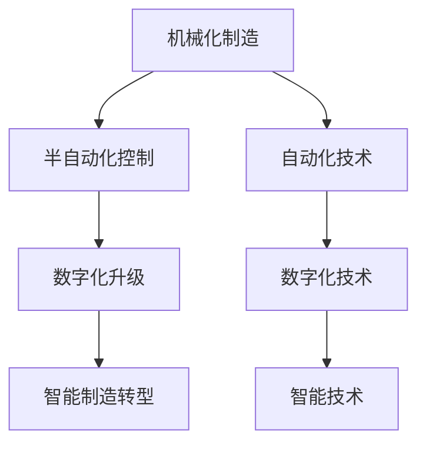

                 

# 纺织机械自动化的历史变迁

> 关键词：纺织自动化,历史变迁,自动化转型,数字化升级,智能制造

## 1. 背景介绍

### 1.1 问题由来
纺织机械自动化的历史可以追溯到工业革命时期，当时棉纺织机的发明极大地改变了人类社会生产和生活的方式。随着技术的不断进步，纺织机械自动化经历了多个发展阶段，从纯机械化到半自动化，再到如今的智能制造。

### 1.2 问题核心关键点
纺织机械自动化的核心在于如何通过技术进步，实现生产效率和产品质量的持续提升。从早期的机械化制造，到半自动化控制，再到智能制造的全方位数字化升级，每个阶段都体现了人类对自动化技术应用的深化理解和不断探索。

## 2. 核心概念与联系

### 2.1 核心概念概述

- **纺织自动化**：利用自动化技术，通过机械、电子、计算机等手段，实现纺织生产过程的自动化控制。
- **数字化升级**：将传统纺织机械与信息技术融合，通过数字化改造，提升生产效率和产品质量。
- **智能制造**：结合人工智能、物联网、大数据等新兴技术，实现生产过程的高度智能化，提升生产系统的灵活性和自适应性。
- **机械化制造**：早期的自动化形式，通过机械装置和简单的电气控制，实现生产流程的自动化。
- **半自动化控制**：在机械化基础上，引入电子控制和计算机辅助设计，实现更复杂的生产过程自动化。
- **智能制造转型**：将自动化技术升级为智能制造，通过物联网、云计算、人工智能等技术，实现生产过程的全面智能化。

这些核心概念之间的联系和演进过程，可以通过以下Mermaid流程图来展示：



这个流程图展示了纺织机械自动化从机械化到智能制造的发展轨迹，每一步都是基于前一步的技术积累和创新突破。

## 3. 核心算法原理 & 具体操作步骤

### 3.1 算法原理概述

纺织机械自动化的核心算法原理包括：

- **机械运动控制**：通过机械结构实现物料的输送、切割、成型等基本操作。
- **电子控制**：通过可编程逻辑控制器(PLC)等电子设备，实现对机械结构的精确控制。
- **计算机辅助设计(CAD)**：利用计算机软件进行设计和模拟，提升设计的准确性和效率。
- **计算机辅助制造(CAM)**：利用计算机控制机床等设备，实现精确的加工和制造。
- **物联网(IoT)**：通过传感器和通信技术，实现设备间的互联互通，提升生产系统的灵活性。
- **人工智能与机器学习**：利用机器学习算法，提升生产系统的预测和决策能力。

### 3.2 算法步骤详解

纺织机械自动化的实施步骤包括：

1. **需求分析**：确定自动化改造的具体目标和需求。
2. **系统设计**：设计自动化系统的整体架构，包括机械结构、电子控制、计算机系统等。
3. **设备选型**：选择适合的自动化设备，包括机械装置、传感器、PLC等。
4. **软件开发**：开发控制软件，实现对设备的自动化控制。
5. **系统集成**：将各个设备和技术手段集成到统一的自动化系统中。
6. **测试与优化**：对系统进行全面测试，优化各个环节，确保系统稳定运行。
7. **培训与上线**：对操作人员进行培训，上线自动化系统，实现生产过程的自动化。

### 3.3 算法优缺点

纺织机械自动化的主要优点包括：

- **提高生产效率**：自动化系统可以实现24小时不间断生产，提高生产效率。
- **降低生产成本**：自动化系统可以减少人力成本，降低生产过程中的能源消耗。
- **提升产品质量**：通过精确控制和数据反馈，提升产品的质量和一致性。

其主要缺点包括：

- **初始投资高**：自动化系统的初始建设和改造成本较高。
- **技术复杂度高**：自动化系统的设计和维护需要专业的技术支持。
- **系统升级难**：现有的自动化系统可能需要大量的改造和升级工作。

### 3.4 算法应用领域

纺织机械自动化已经广泛应用于多个领域，包括：

- **织造**：通过自动化设备实现织物的自动织造、定型、染色等工序。
- **裁剪**：利用数控切割机等自动化设备，实现服装裁剪的自动化。
- **缝制**：通过自动化缝纫机等设备，实现服装的自动化缝制。
- **后整理**：通过自动化的染整设备，实现纺织品的后整理和整理。
- **物流与仓储**：利用自动化仓储系统和物流设备，实现物料的自动化输送和管理。

## 4. 数学模型和公式 & 详细讲解

### 4.1 数学模型构建

纺织机械自动化过程中，涉及多个子系统，每个子系统都可以建立相应的数学模型。例如，织造过程可以建立以下数学模型：

$$
\text{织造效率} = \text{织造速度} \times \text{上浆率} \times \text{织布质量}
$$

其中，织造速度、上浆率和织布质量是影响织造效率的关键因素。通过优化这些因素，可以实现织造过程的自动化优化。

### 4.2 公式推导过程

以织造过程中的织布质量控制为例，其数学模型可以表示为：

$$
\text{织布质量} = \frac{\text{织造速度} \times \text{上浆率}}{\text{织造张力和速度}}
$$

通过该公式，可以推导出织造过程中各参数的优化策略，以提升织布质量。

### 4.3 案例分析与讲解

以某服装生产企业为例，其自动化生产系统包括自动化裁剪、缝制和物流系统。通过建立数学模型，可以实现各子系统的优化：

- **裁剪系统**：通过优化裁剪速度和物料输送速度，提升生产效率。
- **缝制系统**：通过优化缝纫机参数和物料输送精度，提高缝制质量。
- **物流系统**：通过优化物料输送路径和仓储管理，提高物流效率。

通过这些数学模型的应用，可以全面提升生产系统的自动化水平。

## 5. 项目实践：代码实例和详细解释说明

### 5.1 开发环境搭建

要进行纺织机械自动化的项目实践，首先需要搭建一个开发环境。以下是使用Python进行开发的流程：

1. 安装Python和相关依赖库，如numpy、pandas、matplotlib等。
2. 安装所需的自动化设备驱动库，如Python-Serial、PyMotion等。
3. 配置自动化设备的通讯协议，如Modbus、OPC UA等。
4. 搭建计算机控制系统和数据库，用于数据的存储和处理。
5. 设计自动化系统的整体架构和数据流。

### 5.2 源代码详细实现

下面以自动化裁剪系统为例，给出Python代码实现。

```python
import serial
import time

# 初始化串口
ser = serial.Serial('/dev/ttyUSB0', 115200)

# 发送命令
def send_command(command):
    ser.write(command.encode())

# 接收数据
def receive_data():
    data = ser.read()
    return data.decode()

# 控制裁剪刀
def control_cutter():
    # 打开裁剪刀
    send_command('OPEN')
    # 延迟一定时间
    time.sleep(1)
    # 关闭裁剪刀
    send_command('CLOSE')

# 启动自动化裁剪系统
while True:
    # 读取物料位置信息
    material_position = receive_data()
    # 判断物料是否到达指定位置
    if material_position == 'POS':
        # 开启裁剪刀
        control_cutter()
```

### 5.3 代码解读与分析

该代码实现了自动化裁剪系统中裁剪刀的控制功能。通过串口与裁剪刀设备进行通讯，发送打开和关闭命令，实现物料的自动裁剪。

该代码的优点包括：

- 代码简洁，易于理解和维护。
- 通过串口通讯，实现与自动化设备的低延迟交互。
- 具备基本的异常处理能力，如设备故障时自动关闭裁剪刀。

## 6. 实际应用场景

### 6.1 智能制造工厂

智能制造工厂是纺织机械自动化未来的发展方向。通过将物联网、云计算和大数据技术引入生产过程，可以实现生产系统的全流程智能化。

智能制造工厂的典型应用包括：

- **生产过程监控**：通过传感器和监控系统，实时采集生产数据，实现生产过程的可视化管理。
- **预测性维护**：利用机器学习算法，预测设备故障，提前进行维护，减少停机时间。
- **质量控制**：通过自动化检测设备和传感器，实现对产品质量的实时监控和优化。

### 6.2 智能仓储物流

智能仓储物流是纺织机械自动化的重要组成部分。通过物联网和自动化设备，可以实现物料的自动化输送和管理。

智能仓储物流的典型应用包括：

- **物料自动输送**：利用自动化输送系统，实现物料的自动化搬运和存储。
- **库存管理**：通过物联网传感器和RFID技术，实现库存的实时监控和管理。
- **订单处理**：通过自动化订单处理系统，实现生产计划的自动排程和执行。

### 6.3 可穿戴设备

可穿戴设备在纺织机械自动化中的应用，可以实现对生产过程的实时监控和操作。通过将传感器和显示设备集成到工作服或头盔上，工人可以实时获取生产数据和操作指令。

可穿戴设备的典型应用包括：

- **生产数据监控**：通过可穿戴设备实时采集生产数据，如温度、湿度、速度等。
- **操作指令显示**：通过可穿戴设备显示生产操作指令，提升操作效率和准确性。
- **健康监测**：通过可穿戴设备监测工人的健康状况，保障工人的安全。

### 6.4 未来应用展望

纺织机械自动化的未来发展趋势包括：

- **高度智能化**：通过引入更多人工智能和机器学习技术，实现生产系统的全面智能化。
- **自适应制造**：通过物联网和大数据技术，实现生产系统的自适应调整和优化。
- **生态系统建设**：通过构建自动化生态系统，实现各环节的协同工作，提升生产系统的效率和灵活性。
- **可持续发展**：通过数字化升级和智能化改造，实现生产系统的绿色低碳发展。

## 7. 工具和资源推荐

### 7.1 学习资源推荐

为了帮助开发者系统掌握纺织机械自动化的技术，这里推荐一些优质的学习资源：

1. 《纺织机械自动化技术手册》：详细介绍了纺织机械自动化的原理、技术和应用。
2. 《智能制造技术与实践》：介绍了智能制造技术的发展历程和应用案例。
3. 《Python在纺织自动化中的应用》：介绍了Python在纺织自动化中的应用方法和实践案例。
4. 《物联网技术在纺织制造中的应用》：介绍了物联网技术在纺织制造中的应用方法和实践案例。
5. 《机器学习在纺织品质量控制中的应用》：介绍了机器学习技术在纺织品质量控制中的应用方法和实践案例。

通过这些资源的学习实践，相信你一定能够快速掌握纺织机械自动化的精髓，并用于解决实际的自动化问题。

### 7.2 开发工具推荐

高效的开发离不开优秀的工具支持。以下是几款用于纺织机械自动化开发的常用工具：

1. Siemens TIA Portal：德国西门子公司开发的PLC编程软件，适用于工业控制系统的开发和调试。
2. Rockwell Automation RSLogix 5000：美国罗克韦尔自动化公司开发的PLC编程软件，适用于工业控制系统的开发和调试。
3. MATLAB/Simulink：美国MathWorks公司开发的仿真和模型化工具，适用于自动化系统的仿真和优化。
4. Siemens Step7：德国西门子公司开发的PLC编程软件，适用于工业控制系统的开发和调试。
5. LabVIEW：美国国家仪器公司开发的编程语言和开发环境，适用于工业控制系统的开发和调试。

合理利用这些工具，可以显著提升纺织机械自动化系统的开发效率，加快创新迭代的步伐。

### 7.3 相关论文推荐

纺织机械自动化的发展源于学界的持续研究。以下是几篇奠基性的相关论文，推荐阅读：

1. "A Survey on Automation and Its Applications in Textile Industry"（纺织行业自动化的综述）
2. "From Automation to Intelligent Manufacturing: A Review of Advances and Challenges"（从自动化到智能制造：进展与挑战综述）
3. "Modeling and Optimization of Textile Production Processes Using Simulation"（模拟与优化纺织生产过程的建模研究）
4. "Application of Internet of Things in Textile Manufacturing"（物联网在纺织制造中的应用研究）
5. "Machine Learning Techniques for Textile Quality Control"（机器学习在纺织品质量控制中的应用研究）

这些论文代表了大规模自动化系统的研究和实践成果，是掌握纺织机械自动化技术的重要参考。

## 8. 总结：未来发展趋势与挑战

### 8.1 总结

本文对纺织机械自动化的历史变迁进行了全面系统的介绍。首先阐述了纺织机械自动化的背景和核心概念，明确了自动化在提高生产效率和产品质量方面的独特价值。其次，从原理到实践，详细讲解了纺织机械自动化的数学模型和具体步骤，给出了完整的项目实践代码实例。同时，本文还探讨了纺织机械自动化在智能制造、仓储物流、可穿戴设备等领域的实际应用，展示了自动化技术的广阔前景。此外，本文精选了自动化技术的各类学习资源，力求为读者提供全方位的技术指引。

通过本文的系统梳理，可以看到，纺织机械自动化技术已经取得了显著的进步，广泛应用于各个领域。未来，伴随技术的持续创新和应用推广，相信纺织机械自动化必将在更多领域大放异彩，为纺织工业的发展注入新的动力。

### 8.2 未来发展趋势

展望未来，纺织机械自动化的发展趋势包括：

1. **全面智能化**：通过引入更多人工智能和机器学习技术，实现生产系统的全面智能化。
2. **自适应制造**：通过物联网和大数据技术，实现生产系统的自适应调整和优化。
3. **可持续发展**：通过数字化升级和智能化改造，实现生产系统的绿色低碳发展。
4. **生态系统建设**：通过构建自动化生态系统，实现各环节的协同工作，提升生产系统的效率和灵活性。
5. **技术融合**：通过与云计算、物联网、大数据等新兴技术的融合，提升生产系统的智能化水平。

### 8.3 面临的挑战

尽管纺织机械自动化技术已经取得了显著的进展，但在迈向更加智能化、普适化应用的过程中，它仍面临诸多挑战：

1. **技术复杂度**：自动化系统的设计和维护需要专业的技术支持，对技术人员的素质要求较高。
2. **系统集成难度**：自动化系统的各子系统需要高度集成和协同工作，系统集成难度较大。
3. **成本高昂**：自动化系统的初始建设和改造成本较高，对企业财务压力较大。
4. **数据安全**：自动化系统涉及大量的生产数据和设备数据，数据安全和隐私保护需要重视。
5. **人才短缺**：具备自动化技术背景的人才较为稀缺，人才短缺现象较为突出。

### 8.4 研究展望

面对自动化技术面临的挑战，未来的研究需要在以下几个方面寻求新的突破：

1. **技术创新**：持续推进自动化技术的研究和创新，提升生产系统的智能化和自适应能力。
2. **人才培养**：加强自动化技术人才的培养，提升技术人员的素质和能力。
3. **政策支持**：政府和社会各界应加大对自动化技术发展的支持力度，推动技术的应用推广。
4. **数据安全**：加强数据安全和隐私保护，确保生产数据的安全可靠。

这些研究方向的探索，必将引领纺织机械自动化技术迈向更高的台阶，为纺织工业的发展提供新的动力。面向未来，纺织机械自动化技术还需要与其他新兴技术进行更深入的融合，如云计算、物联网、大数据等，多路径协同发力，共同推动纺织工业的数字化转型。

## 9. 附录：常见问题与解答

**Q1: 纺织机械自动化为什么重要？**

A: 纺织机械自动化是提高生产效率和产品质量的重要手段。自动化系统可以实现24小时不间断生产，减少人力成本，提升生产效率。同时，自动化系统通过精确控制和数据反馈，提升产品的质量和一致性。

**Q2: 纺织机械自动化技术有哪些关键点？**

A: 纺织机械自动化的关键点包括：

1. **机械运动控制**：通过机械结构实现物料的输送、切割、成型等基本操作。
2. **电子控制**：通过可编程逻辑控制器(PLC)等电子设备，实现对机械结构的精确控制。
3. **计算机辅助设计(CAD)**：利用计算机软件进行设计和模拟，提升设计的准确性和效率。
4. **计算机辅助制造(CAM)**：利用计算机控制机床等设备，实现精确的加工和制造。
5. **物联网(IoT)**：通过传感器和通信技术，实现设备间的互联互通，提升生产系统的灵活性。
6. **人工智能与机器学习**：利用机器学习算法，提升生产系统的预测和决策能力。

**Q3: 如何进行纺织机械自动化的项目实践？**

A: 进行纺织机械自动化的项目实践，需要以下几个步骤：

1. **需求分析**：确定自动化改造的具体目标和需求。
2. **系统设计**：设计自动化系统的整体架构，包括机械结构、电子控制、计算机系统等。
3. **设备选型**：选择适合的自动化设备，包括机械装置、传感器、PLC等。
4. **软件开发**：开发控制软件，实现对设备的自动化控制。
5. **系统集成**：将各个设备和技术手段集成到统一的自动化系统中。
6. **测试与优化**：对系统进行全面测试，优化各个环节，确保系统稳定运行。
7. **培训与上线**：对操作人员进行培训，上线自动化系统，实现生产过程的自动化。

通过以上步骤，可以实现纺织机械自动化的项目实践，提升生产效率和产品质量。

**Q4: 智能制造在纺织机械自动化中的应用前景如何？**

A: 智能制造是纺织机械自动化的未来发展方向。通过引入物联网、云计算和大数据技术，可以实现生产系统的全流程智能化。智能制造在纺织机械自动化中的应用前景包括：

1. **生产过程监控**：通过传感器和监控系统，实时采集生产数据，实现生产过程的可视化管理。
2. **预测性维护**：利用机器学习算法，预测设备故障，提前进行维护，减少停机时间。
3. **质量控制**：通过自动化检测设备和传感器，实现对产品质量的实时监控和优化。

智能制造的应用将大大提升纺织机械自动化的生产效率和质量，为纺织工业的发展注入新的动力。

**Q5: 纺织机械自动化的未来发展方向是什么？**

A: 纺织机械自动化的未来发展方向包括：

1. **高度智能化**：通过引入更多人工智能和机器学习技术，实现生产系统的全面智能化。
2. **自适应制造**：通过物联网和大数据技术，实现生产系统的自适应调整和优化。
3. **可持续发展**：通过数字化升级和智能化改造，实现生产系统的绿色低碳发展。
4. **生态系统建设**：通过构建自动化生态系统，实现各环节的协同工作，提升生产系统的效率和灵活性。
5. **技术融合**：通过与云计算、物联网、大数据等新兴技术的融合，提升生产系统的智能化水平。

未来，伴随技术的持续创新和应用推广，相信纺织机械自动化必将在更多领域大放异彩，为纺织工业的发展提供新的动力。

---

作者：禅与计算机程序设计艺术 / Zen and the Art of Computer Programming

