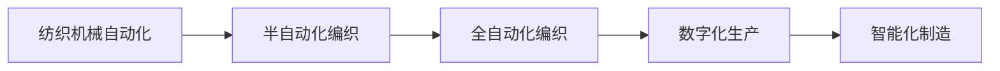

                 

## 1. 背景介绍

纺织机械自动化是工业革命以来最重要的技术进步之一，它极大地改变了纺织产业的生产方式和全球经济结构。自19世纪末工业革命以来，纺织机械自动化经历了从手工编织到半自动编织再到全自动化编织的三个重要阶段，每个阶段都带来了生产效率的显著提升和成本的显著降低。

## 2. 核心概念与联系

### 2.1 核心概念概述

- **纺织机械自动化**：通过自动化设备和技术提高纺织生产效率和质量的过程。其核心在于使用机械化、电气化、信息化和智能化手段，将复杂的纺织生产流程自动化，从而降低生产成本，提高生产效率和质量。

- **自动化编织**：指使用自动化设备，如自动织机、计算机辅助设计系统等，实现从图案设计到最终产品的全过程自动化。

- **数字化生产**：通过传感器、物联网、大数据等技术，实现生产过程的实时监控、数据分析和优化，从而提升生产效率和产品质量。

- **智能化制造**：利用人工智能、机器学习等技术，实现生产过程的自主决策和自适应，进一步提高生产效率和产品质量。

### 2.2 核心概念原理和架构的 Mermaid 流程图



这个流程图展示了纺织机械自动化的技术演进路径，从早期的半自动化编织，到全自动化编织，再到数字化和智能化生产，每个阶段都是基于前一阶段的进步和改进。

## 3. 核心算法原理 & 具体操作步骤

### 3.1 算法原理概述

纺织机械自动化的核心算法原理主要基于以下几个方面：

- **机器学习与控制**：通过机器学习算法对生产数据进行分析，预测生产趋势，优化生产流程。
- **机器人技术**：利用机器人技术实现生产线的自动操作和维护。
- **传感器与物联网**：通过传感器和物联网技术实现生产过程的实时监控和数据采集。
- **计算机视觉**：利用计算机视觉技术实现产品质量的自动检测和分类。

### 3.2 算法步骤详解

1. **数据收集**：使用传感器和物联网技术，收集生产过程中的数据，包括温度、湿度、压力、速度、位置等。

2. **数据分析与预测**：利用机器学习算法对收集到的数据进行分析，预测生产中的异常情况，优化生产参数，提高生产效率。

3. **自动操作与控制**：根据分析结果，使用机器人技术控制生产过程，实现自动化操作，提高生产效率和产品质量。

4. **智能决策与优化**：利用人工智能技术，对生产数据进行实时分析，自动调整生产参数，优化生产过程，实现智能化制造。

### 3.3 算法优缺点

**优点**：

- **提高生产效率**：自动化和智能化技术可以显著提高生产效率，减少人工操作，降低生产成本。
- **提升产品质量**：自动检测和质量控制技术可以保证产品质量的一致性和稳定性。
- **灵活性高**：可以根据不同的生产需求，快速调整生产参数和流程。

**缺点**：

- **初期投资高**：自动化设备的购置和安装需要较高的初期投资。
- **技术复杂**：需要专业的技术人员进行维护和操作。
- **依赖数据质量**：自动化和智能化技术的有效性依赖于数据的质量和准确性。

### 3.4 算法应用领域

纺织机械自动化技术广泛应用于以下几个领域：

- **织造领域**：自动化编织技术可以应用于织布、绣花等织造过程，提高生产效率和产品质量。
- **染色领域**：使用自动化控制技术可以实现染色过程的精准控制，提高染料利用率和环保性能。
- **印花领域**：利用计算机视觉和自动化技术，可以实现印花图案的精准定位和自动检测。
- **后整理领域**：自动化技术可以应用于熨烫、定型、整烫等后整理过程，提高生产效率和产品质量。

## 4. 数学模型和公式 & 详细讲解 & 举例说明

### 4.1 数学模型构建

假设纺织生产过程中，每个生产环节的数据可以用向量 $x$ 表示，生产效率 $y$ 可以用 $y = f(x)$ 表示，其中 $f$ 为生产函数。通过对生产数据进行分析，可以构建数学模型，对生产过程进行预测和优化。

### 4.2 公式推导过程

以纺织生产中的温度控制为例，假设生产过程中需要控制温度 $T$，温度控制的目标是最大化生产效率 $y$，即求解 $y = \max_{T} f(T)$。通过最小二乘法，可以构建温度控制的优化模型：

$$
\min_{T} \sum_{i=1}^{N} (T_i - \hat{T}_i)^2
$$

其中，$T_i$ 为第 $i$ 个时刻的温度测量值，$\hat{T}_i$ 为模型预测的温度值。通过求解上述优化问题，可以得到最优的温度控制策略。

### 4.3 案例分析与讲解

假设有一家纺织企业，使用自动织机进行生产。企业希望通过温度控制来提高生产效率，使用上述优化模型进行温度控制。首先，通过传感器收集生产过程中的温度数据 $T = (T_1, T_2, ..., T_N)$。然后，利用机器学习算法对温度数据进行分析，得到温度控制的最优策略 $\hat{T} = (\hat{T}_1, \hat{T}_2, ..., \hat{T}_N)$。最后，根据最优策略，通过自动化设备对温度进行控制，实现生产过程的自动化。

## 5. 项目实践：代码实例和详细解释说明

### 5.1 开发环境搭建

1. **安装 Python 环境**：安装 Python 3.x，建议使用 Anaconda 或 Miniconda 创建虚拟环境。

2. **安装相关库**：安装必要的 Python 库，如 NumPy、Pandas、SciPy、Matplotlib、TensorFlow 等。

3. **设置开发环境**：配置开发环境，包括 Python 版本、库版本、IDE 等。

### 5.2 源代码详细实现

以下是一个简单的 Python 代码示例，用于模拟纺织生产中的温度控制：

```python
import numpy as np
from scipy.optimize import minimize

# 模拟生产过程中的温度数据
T = np.array([25, 26, 27, 28, 29, 30, 31, 32, 33, 34])

# 定义生产函数，这里假设生产效率与温度呈线性关系
def f(T):
    return 100 - T

# 定义误差函数
def error(T):
    return np.sum((f(T) - T)**2)

# 求解优化问题
result = minimize(error, np.mean(T), method='BFGS')
optimal_T = result.x

print("最优温度控制策略：", optimal_T)
```

### 5.3 代码解读与分析

这段代码首先定义了模拟生产过程中的温度数据 $T$，然后定义了生产函数 $f(T)$，这里假设生产效率与温度呈线性关系。接着，定义了误差函数 $error(T)$，用于计算预测温度与实际温度之间的误差。最后，使用 `minimize` 函数求解优化问题，得到最优的温度控制策略 $\hat{T}$。

## 6. 实际应用场景

### 6.1 纺织生产车间自动化

纺织生产车间的自动化技术可以极大地提高生产效率和产品质量。例如，使用自动化编织技术可以显著提高织布效率，减少人工操作和错误。

### 6.2 智能仓储系统

智能仓储系统通过自动化和智能化技术，实现了仓储过程的数字化和智能化管理，提高了仓储效率和准确性。

### 6.3 电子商务

纺织机械自动化技术在电子商务领域也有广泛应用，例如，使用自动化检测技术对服装进行分类和质量检测，保证商品的准确性和一致性。

### 6.4 未来应用展望

未来，纺织机械自动化技术将向以下几个方向发展：

- **智能化制造**：利用人工智能和机器学习技术，实现生产过程的自主决策和自适应，提高生产效率和产品质量。
- **绿色制造**：推广节能减排技术，实现低碳环保的生产方式。
- **个性化定制**：通过智能化技术，实现个性化定制生产，满足消费者多样化的需求。

## 7. 工具和资源推荐

### 7.1 学习资源推荐

1. **《纺织机械自动化技术》**：系统介绍了纺织机械自动化的基本原理、技术和应用，适合初学者学习。

2. **《机器学习在纺织业中的应用》**：介绍了机器学习在纺织业中的具体应用案例，适合有一定基础的读者学习。

3. **Coursera 课程**：提供了多个与纺织机械自动化相关的在线课程，包括机器学习、自动化控制等。

4. **TensorFlow 官方文档**：提供了丰富的 TensorFlow 应用案例，适合深入学习。

### 7.2 开发工具推荐

1. **Python 编程语言**：Python 是自动化和智能化技术开发的主流语言，功能强大，应用广泛。

2. **Matplotlib 可视化工具**：用于数据可视化，帮助开发者更好地理解数据和优化模型。

3. **TensorFlow 和 PyTorch**：用于机器学习和深度学习的框架，支持自动化和智能化技术开发。

4. **Eclipse Paho**：用于实现物联网技术，实现数据的实时采集和监控。

### 7.3 相关论文推荐

1. **《基于机器学习的纺织生产优化》**：介绍机器学习在纺织生产中的应用，对优化模型和算法进行了详细的讨论。

2. **《纺织机械自动化技术的未来发展》**：探讨纺织机械自动化的未来发展方向，提出了一些新的技术应用和研究方向。

3. **《人工智能在纺织业中的应用》**：讨论了人工智能在纺织业中的应用，包括生产优化、质量检测、自动化控制等。

## 8. 总结：未来发展趋势与挑战

### 8.1 研究成果总结

纺织机械自动化技术在提高生产效率和产品质量方面取得了显著成果，推动了纺织产业的现代化和智能化进程。未来，随着技术的不断进步，纺织机械自动化技术将进一步发展，实现更高的自动化和智能化水平。

### 8.2 未来发展趋势

未来，纺织机械自动化技术将向以下几个方向发展：

- **智能化**：利用人工智能和机器学习技术，实现生产过程的自主决策和自适应。
- **数字化**：通过物联网和互联网技术，实现生产过程的数字化管理和智能化监控。
- **绿色化**：推广节能减排技术，实现低碳环保的生产方式。

### 8.3 面临的挑战

尽管纺织机械自动化技术在许多方面取得了显著进展，但仍面临以下挑战：

- **技术复杂性**：自动化和智能化技术需要专业的技术人员进行维护和操作。
- **成本问题**：自动化设备的初期投资和维护成本较高，增加了企业的负担。
- **数据质量**：自动化和智能化技术的有效性依赖于数据的质量和准确性。

### 8.4 研究展望

未来，纺织机械自动化技术需要在以下几个方面进行深入研究：

- **优化算法**：探索更高效、更准确的优化算法，提高生产过程的自动化水平。
- **智能决策**：利用人工智能技术，实现生产过程的自主决策和自适应。
- **环保技术**：推广节能减排技术，实现低碳环保的生产方式。

## 9. 附录：常见问题与解答

**Q1: 如何选择合适的纺织机械自动化设备？**

A: 选择合适的纺织机械自动化设备需要考虑以下几个因素：

- **生产规模**：根据生产规模选择设备的大小和生产能力。
- **生产类型**：根据生产类型选择设备的功能和性能。
- **成本预算**：根据成本预算选择设备的投资回报率。
- **技术支持**：选择设备时，要考虑技术支持和服务保障。

**Q2: 如何提高纺织机械自动化的生产效率？**

A: 提高纺织机械自动化的生产效率可以从以下几个方面入手：

- **优化生产流程**：通过机器学习和数据分析，优化生产流程，减少浪费和停机时间。
- **使用先进的自动化设备**：使用高性能的自动化设备，提高生产效率和产品质量。
- **引入智能化技术**：利用人工智能和机器学习技术，实现生产过程的自主决策和自适应。

**Q3: 纺织机械自动化技术在应用中需要注意哪些问题？**

A: 在应用纺织机械自动化技术时，需要注意以下几个问题：

- **数据质量**：自动化和智能化技术的有效性依赖于数据的质量和准确性。
- **技术复杂性**：自动化和智能化技术需要专业的技术人员进行维护和操作。
- **成本问题**：自动化设备的初期投资和维护成本较高，增加了企业的负担。
- **安全问题**：在使用自动化设备时，要确保设备的安全性，避免生产事故的发生。

通过以上分析，可以更好地理解纺织机械自动化的历史影响，同时为未来的技术应用提供指导。纺织机械自动化技术的不断发展和应用，将为纺织产业带来更加高效、智能和环保的生产方式。

