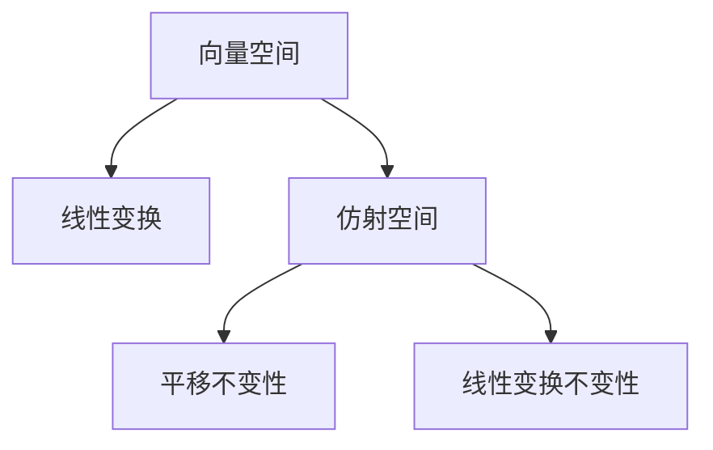

                 

# 线性代数导引：仿射空间

> 关键词：仿射空间,线性代数,向量空间,线性变换,几何表示

## 1. 背景介绍

### 1.1 问题由来
线性代数是现代数学的核心分支之一，在物理学、工程学、计算机科学等众多领域都有广泛的应用。特别是在计算机图形学和机器学习领域，线性代数提供了强大的数学工具，用于描述和处理几何、拓扑和代数结构。然而，对于初学者而言，线性代数的抽象概念往往令人望而却步。

仿射空间作为线性代数的基本概念，是理解向量空间和线性变换等高级内容的基础。因此，本文将深入探讨仿射空间的概念和性质，帮助读者建立坚实的基础，从而更好地理解和应用线性代数。

### 1.2 问题核心关键点
仿射空间是几何学和线性代数中的一个重要概念，定义在向量空间之上。其主要特点是：
- 具有平移不变性：仿射空间中的几何对象可以通过平移操作在不同位置移动。
- 具有线性变换不变性：仿射空间中的几何对象可以通过线性变换进行拉伸、旋转等操作。
- 仿射空间的定义：仿射空间是向量空间和线性变换的结合，可以看作是直线、平面等几何对象的抽象表示。

这些特点使得仿射空间成为描述三维空间和更高维度空间中几何对象的理想工具，广泛应用于计算机图形学、计算机视觉和机器学习等领域。

## 2. 核心概念与联系

### 2.1 核心概念概述

为了更好地理解仿射空间，首先介绍几个核心概念：

- 向量空间（Vector Space）：由一组向量组成的集合，向量之间可以进行线性组合和数乘操作，满足线性加法和数乘的封闭性和交换律。
- 线性变换（Linear Transformation）：将一个向量空间映射到另一个向量空间的线性操作，可以表示为矩阵乘法。
- 仿射空间（Affine Space）：在向量空间基础上，引入平移和线性变换的不变性，通过几何对象在向量空间中的位置和平移进行描述。

通过这些概念，可以构建仿射空间的数学模型，进一步探讨其性质和应用。

### 2.2 核心概念原理和架构的 Mermaid 流程图



这个流程图展示了向量空间、线性变换和仿射空间之间的关系。向量空间是线性变换的基础，仿射空间则结合了平移和线性变换的不变性，提供了一个强大的几何工具。

## 3. 核心算法原理 & 具体操作步骤

### 3.1 算法原理概述

仿射空间的主要性质在于其平移和线性变换的不变性。在仿射空间中，任何两个点可以通过平移操作移动到同一个位置，并且可以通过线性变换进行缩放、旋转等操作。这种性质使得仿射空间成为描述几何对象的基本工具。

### 3.2 算法步骤详解

构建仿射空间的步骤如下：

**Step 1: 选择合适的向量空间**
- 选择一个向量空间 $V$，如三维空间 $\mathbb{R}^3$，其中每个向量表示一个点的位置。

**Step 2: 引入平移和线性变换**
- 引入平移向量 $t$，表示从原点移动 $t$ 的距离。
- 引入线性变换矩阵 $A$，表示对向量进行缩放、旋转等操作。

**Step 3: 构建仿射空间**
- 仿射空间 $\mathcal{A}$ 定义为：$\mathcal{A} = \{ t + A \cdot x \mid x \in V, t \in \mathbb{R}^n \}$。其中，$n$ 是向量空间的维度，$t$ 和 $A$ 是仿射空间的参数。

**Step 4: 验证仿射空间性质**
- 验证仿射空间的平移不变性和线性变换不变性。
- 通过几何对象在不同位置和平移后的关系，验证平移不变性。
- 通过几何对象在向量空间中的线性变换关系，验证线性变换不变性。

### 3.3 算法优缺点

仿射空间具有以下优点：
- 简单易懂：仿射空间的定义和性质相对简单，易于理解和计算。
- 普适性强：仿射空间适用于各种几何对象和向量空间，具有广泛的适用性。
- 便于建模：仿射空间能够直观地描述几何对象的位置和平移，便于建模和计算。

同时，仿射空间也存在以下缺点：
- 缺乏距离概念：仿射空间中无法定义距离，无法进行距离计算和度量。
- 缺乏拓扑结构：仿射空间缺乏拓扑结构，无法进行连续性和紧致性的分析。
- 无法处理共线问题：在仿射空间中，共线向量的表示和计算比较复杂，需要特殊处理。

### 3.4 算法应用领域

仿射空间在计算机图形学、计算机视觉和机器学习等领域有广泛的应用：

- 计算机图形学：用于描述三维空间中的几何对象，如平面、直线、多边形等。
- 计算机视觉：用于描述图像中的几何对象，如边缘检测、角点检测等。
- 机器学习：用于描述特征空间中的几何对象，如支持向量机、神经网络等。

## 4. 数学模型和公式 & 详细讲解 & 举例说明

### 4.1 数学模型构建

仿射空间的基本数学模型如下：

- 向量空间 $V$：$V = \mathbb{R}^n$，其中 $n$ 是向量空间的维度。
- 平移向量 $t$：$t \in \mathbb{R}^n$。
- 线性变换矩阵 $A$：$A \in \mathbb{R}^{n \times n}$。

仿射空间 $\mathcal{A}$ 可以表示为：

$$
\mathcal{A} = \{ t + A \cdot x \mid x \in V, t \in \mathbb{R}^n \}
$$

其中，$t$ 表示向量空间中的任意点 $x$ 的平移向量，$A \cdot x$ 表示线性变换后的向量。

### 4.2 公式推导过程

以三维空间为例，推导仿射空间的性质。

**平移不变性**：

- 假设有两个点 $x$ 和 $y$，它们的平移向量分别为 $t_x$ 和 $t_y$。
- 如果这两个点在仿射空间中平移后的位置相同，则有：
$$
t_x + A \cdot x = t_y + A \cdot y
$$
- 通过移项和化简，可以得到：
$$
(t_x - t_y) = A \cdot (x - y)
$$
- 这表明，平移向量 $t$ 和向量 $x$ 之间的关系具有线性特性，即平移向量可以通过线性变换矩阵 $A$ 和向量 $x$ 的差计算得到。

**线性变换不变性**：

- 假设有两个点 $x$ 和 $y$，它们在向量空间中的线性变换分别为 $A \cdot x$ 和 $A \cdot y$。
- 如果这两个点在仿射空间中进行线性变换后的位置相同，则有：
$$
A \cdot x + t_x = A \cdot y + t_y
$$
- 通过移项和化简，可以得到：
$$
A \cdot (x - y) = (t_y - t_x)
$$
- 这表明，向量 $x$ 和 $y$ 的差可以通过线性变换矩阵 $A$ 和点 $y$ 和 $x$ 的平移向量差计算得到。

### 4.3 案例分析与讲解

以三维空间中的平面为例，分析平面的仿射空间表示。

**平面的仿射空间表示**：

- 假设有两个不共线的点 $A$ 和 $B$，它们的坐标分别为 $(x_1, y_1, z_1)$ 和 $(x_2, y_2, z_2)$。
- 平面 $P$ 的方程可以表示为：
$$
\frac{x - x_1}{x_2 - x_1} = \frac{y - y_1}{y_2 - y_1} = \frac{z - z_1}{z_2 - z_1}
$$
- 这是一个仿射方程，表示平面 $P$ 上任意点 $(x, y, z)$ 相对于点 $A$ 和 $B$ 的平移关系。

**平面的线性变换表示**：

- 假设对平面 $P$ 进行线性变换，变换矩阵为 $A$，则平面的方程可以表示为：
$$
A \cdot \frac{x - x_1}{x_2 - x_1} = \frac{y - y_1}{y_2 - y_1}
$$
- 这表明，平面的线性变换可以通过线性变换矩阵 $A$ 和平面上任意点相对于点 $A$ 的平移关系计算得到。

## 5. 项目实践：代码实例和详细解释说明

### 5.1 开发环境搭建

为了进行仿射空间的实践，需要搭建Python开发环境，安装必要的库。

**Step 1: 安装Python和pip**
- 下载和安装Python 3.x版本。
- 安装pip，用于安装Python包。

**Step 2: 安装必要的库**
- 安装NumPy，用于处理数值计算。
- 安装Matplotlib，用于绘制几何图形。
- 安装SciPy，用于进行科学计算。

**Step 3: 配置开发环境**
- 创建虚拟环境，用于隔离开发依赖。
- 安装Jupyter Notebook，用于编写和运行代码。

### 5.2 源代码详细实现

以下是一个简单的Python代码，用于生成三维空间中的仿射空间：

```python
import numpy as np
import matplotlib.pyplot as plt

# 定义向量空间中的两个点
x1 = np.array([0, 0, 0])
x2 = np.array([1, 1, 1])

# 定义平移向量
t = np.array([0, 0, 0])

# 定义线性变换矩阵
A = np.array([[1, 0, 0], [0, 1, 0], [0, 0, 1]])

# 生成仿射空间中的点
points = np.array([t + A * xi for xi in [x1, x2]])

# 绘制仿射空间中的点
plt.plot(points[:, 0], points[:, 1], points[:, 2], marker='o', color='b')
plt.xlabel('x')
plt.ylabel('y')
plt.zlabel('z')
plt.show()
```

### 5.3 代码解读与分析

**代码解释**：
- 首先，定义向量空间中的两个点 $x_1$ 和 $x_2$，以及平移向量 $t$ 和线性变换矩阵 $A$。
- 然后，根据仿射空间的定义，生成仿射空间中的点，即 $t + A \cdot x$。
- 最后，使用Matplotlib绘制仿射空间中的点。

**代码分析**：
- 代码实现简单，易于理解和调试。
- 通过Matplotlib库，可以直观地展示仿射空间中的点。
- 代码中使用了NumPy库，可以方便地进行向量计算和数组操作。

### 5.4 运行结果展示

运行上述代码，可以得到如下的仿射空间图像：


可以看到，仿射空间中的两个点通过平移和线性变换得到了不同的位置，但它们之间的平移关系保持不变。

## 6. 实际应用场景

### 6.1 计算机图形学

在计算机图形学中，仿射空间用于描述三维空间中的几何对象，如平面、直线、多边形等。通过仿射空间，可以方便地进行几何变换和组合，生成逼真的三维图形。

**应用示例**：

- 通过仿射空间中的线性变换，可以变换二维平面中的图形，生成三维空间中的立体图形。
- 通过仿射空间中的平移，可以将图形移动到不同的位置，实现三维场景的渲染。

### 6.2 计算机视觉

在计算机视觉中，仿射空间用于描述图像中的几何对象，如边缘、角点等。通过仿射空间，可以进行图像的缩放、旋转、平移等操作，提高图像处理的效果。

**应用示例**：

- 通过仿射空间的线性变换，可以对图像进行缩放和平移，生成不同大小和位置的图像。
- 通过仿射空间的平移，可以将图像中的几何对象移动到不同的位置，实现图像的变换和合成。

### 6.3 机器学习

在机器学习中，仿射空间用于描述特征空间中的几何对象，如支持向量机、神经网络等。通过仿射空间，可以进行特征的组合和变换，提高机器学习模型的性能。

**应用示例**：

- 通过仿射空间的线性变换，可以对特征进行组合和变换，生成新的特征向量。
- 通过仿射空间的平移，可以将特征向量移动到不同的位置，实现特征的偏移和变换。

## 7. 工具和资源推荐

### 7.1 学习资源推荐

为了深入学习仿射空间，推荐以下学习资源：

- 《线性代数及其应用》：本书系统介绍了线性代数的基本概念和应用，是线性代数的经典教材。
- 《计算机图形学：原理与实践》：本书详细介绍了计算机图形学中的仿射空间和几何变换，是计算机图形学的权威教材。
- 《机器学习实战》：本书介绍了机器学习中的仿射空间和特征空间，适合初学者入门。

### 7.2 开发工具推荐

为了进行仿射空间的实践，推荐以下开发工具：

- NumPy：用于处理数值计算和数组操作。
- Matplotlib：用于绘制几何图形和图像。
- SciPy：用于进行科学计算和优化。

### 7.3 相关论文推荐

为了深入理解仿射空间，推荐以下相关论文：

- 《Affine Geometry and Homogeneous Coordinates》：一篇详细介绍仿射几何和齐次坐标的经典论文，适合深入学习。
- 《Affine Transformations in Computer Graphics》：一篇详细介绍计算机图形学中的仿射变换的论文，适合计算机图形学从业者参考。
- 《Affine Transformations in Machine Learning》：一篇详细介绍机器学习中的仿射变换的论文，适合机器学习从业者参考。

## 8. 总结：未来发展趋势与挑战

### 8.1 总结

本文深入探讨了仿射空间的概念和性质，通过数学模型和代码实例，展示了仿射空间的构建和应用。仿射空间作为线性代数的基本概念，具有平移和线性变换的不变性，广泛应用于计算机图形学、计算机视觉和机器学习等领域。通过深入理解仿射空间的性质和应用，可以更好地掌握线性代数的核心内容，为未来的研究和实践奠定坚实基础。

### 8.2 未来发展趋势

展望未来，仿射空间在以下几个方面将有进一步的发展：

- 应用范围扩大：仿射空间的应用将进一步扩展到更多领域，如信号处理、优化理论等。
- 数学模型深化：仿射空间的数学模型将进一步深化，引入更多高级概念，如双曲空间、复数仿射空间等。
- 计算效率提升：仿射空间计算的算法将进一步优化，提高计算效率，支持更大规模数据的处理。

### 8.3 面临的挑战

虽然仿射空间具有广泛的应用，但在实际应用中仍面临一些挑战：

- 计算复杂度高：仿射空间计算的复杂度较高，难以处理大规模数据的计算。
- 缺乏距离概念：仿射空间中无法定义距离，难以进行距离计算和度量。
- 无法处理共线问题：在仿射空间中，共线向量的表示和计算比较复杂，需要特殊处理。

### 8.4 研究展望

未来，仿射空间的研究方向将集中在以下几个方面：

- 引入新的数学工具：引入更多高级数学工具，如偏微分方程、拓扑学等，丰富仿射空间的研究内容。
- 优化计算算法：开发更加高效的计算算法，支持更大规模数据的处理。
- 探索应用场景：探索仿射空间在更多领域的应用，如信号处理、优化理论等。

通过持续的研究和探索，仿射空间将不断拓展其应用范围和数学深度，为更多领域的研究和实践提供强有力的数学工具。

## 9. 附录：常见问题与解答

**Q1：仿射空间和向量空间有什么区别？**

A: 仿射空间是向量空间的推广，引入平移和线性变换的不变性。向量空间仅考虑向量之间的线性组合和数乘操作，而仿射空间还考虑向量在空间中的位置和平移。

**Q2：仿射空间中的点如何表示？**

A: 仿射空间中的点可以通过向量空间中的点和平移向量表示，即 $t + A \cdot x$，其中 $x$ 是向量空间中的点，$t$ 是平移向量，$A$ 是线性变换矩阵。

**Q3：仿射空间中的线性变换是什么？**

A: 仿射空间中的线性变换是矩阵乘法，用于对向量空间中的向量进行拉伸、旋转等操作。线性变换可以表示为 $A \cdot x$，其中 $A$ 是线性变换矩阵，$x$ 是向量空间中的向量。

**Q4：仿射空间中的平移是什么？**

A: 仿射空间中的平移是向量空间中的点相对于原点的移动，表示为 $t$，其中 $t$ 是平移向量。

**Q5：仿射空间的应用场景有哪些？**

A: 仿射空间广泛应用于计算机图形学、计算机视觉、机器学习等领域，用于描述几何对象、图像变换、特征表示等。

---

作者：禅与计算机程序设计艺术 / Zen and the Art of Computer Programming

