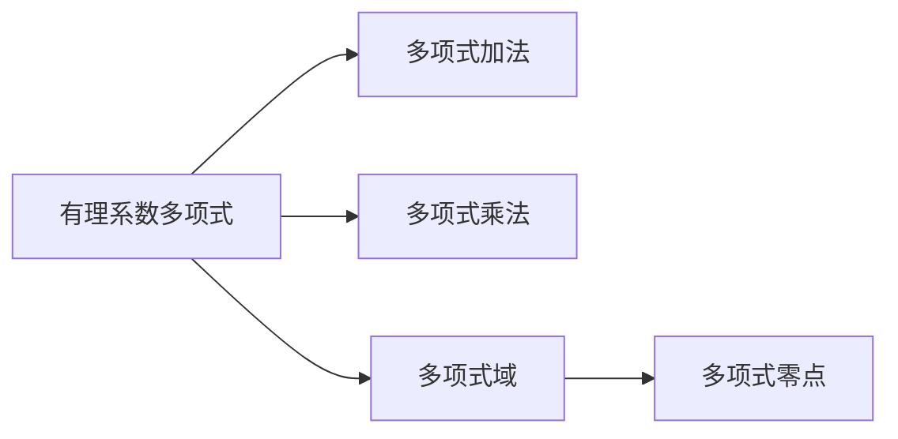

                 

# 线性代数导引：有理系数多项式环

> 关键词：多项式环, 有理系数, 线性代数, 度量空间, 代数结构

## 1. 背景介绍

线性代数作为现代数学的重要分支，广泛应用在物理学、工程学、计算机科学等领域。特别在计算机科学中，线性代数是机器学习、计算机视觉、数据科学等方向的必备工具。多项式环是线性代数中的一种重要代数结构，本章节将系统介绍多项式环的概念、性质、以及与线性代数的联系。

### 1.1 引言

我们首先从一个直观的代数问题出发。在多项式学习中，我们经常需要求解如下问题：

1. 求解两个多项式 $p(x)$ 和 $q(x)$ 的除法问题：$p(x) = q(x) \cdot r(x) + s(x)$。其中 $p(x)$ 和 $q(x)$ 为有理系数多项式，$r(x)$ 和 $s(x)$ 是特定的多项式，通常 $s(x)$ 的度数小于 $q(x)$ 的度数。

2. 在多项式域中，求解方程 $p(x) = 0$，即求多项式的零点。

这些问题的解决方法和结果，将直接与多项式环的性质和构造相关。因此，我们将从多项式环的定义和性质开始，展开深入研究。

## 2. 核心概念与联系

### 2.1 核心概念概述

在正式展开之前，我们先对一些基本概念进行简单的介绍。

- **多项式**：形如 $p(x) = a_n x^n + a_{n-1} x^{n-1} + \ldots + a_1 x + a_0$ 的多项式，其中 $a_i$ 为系数，$x$ 为变量。
- **有理系数**：多项式的系数均为有理数，即 $a_i$ 可以表示为两个整数的比值。
- **多项式环**：由多项式以及多项式之间加法和乘法的运算构成的代数结构。

接下来，我们将通过一个简单的例子，引入多项式环的概念。

### 2.2 核心概念的 Mermaid 流程图(Mermaid 流程节点中不要有括号、逗号等特殊字符)



### 2.3 核心概念的联系

有理系数多项式环通过多项式的加法和乘法构成一个代数结构。该结构不仅具有加法和乘法的封闭性、交换性、结合性等基本代数性质，还可以进行多项式的除法，以及求解多项式的零点。

## 3. 核心算法原理 & 具体操作步骤

### 3.1 算法原理概述

在多项式环中，最重要的运算是多项式之间的加法和乘法。接下来，我们将对多项式加法和乘法进行详细的介绍。

### 3.2 算法步骤详解

#### 3.2.1 多项式加法

多项式加法的定义与常规的加减法类似。对于两个多项式 $p(x)$ 和 $q(x)$，其加法定义为：

$$
p(x) + q(x) = a_n x^n + a_{n-1} x^{n-1} + \ldots + a_1 x + a_0 + b_m x^m + b_{m-1} x^{m-1} + \ldots + b_1 x + b_0
$$

其中 $a_i$ 和 $b_j$ 为两个多项式的系数，我们可以按指数从高到低进行合并。例如：

$$
(3x^2 + 2x + 5) + (x^2 - x + 1) = 4x^2 + x + 6
$$

可以看到，多项式加法具有封闭性和交换性。

#### 3.2.2 多项式乘法

多项式乘法的定义稍微复杂一些。对于两个多项式 $p(x)$ 和 $q(x)$，其乘法定义为：

$$
p(x) \cdot q(x) = a_n x^n + a_{n-1} x^{n-1} + \ldots + a_1 x + a_0 \cdot b_m x^m + b_{m-1} x^{m-1} + \ldots + b_1 x + b_0
$$

我们通常采用逐项相乘的方法进行计算。例如：

$$
(3x^2 + 2x + 5) \cdot (x^2 - x + 1) = 3x^4 - 3x^3 + 3x^2 + 2x^3 - 2x^2 + 2x + 5x^2 - 5x + 5
$$

简化后得到：

$$
3x^4 + x^3 + 6x^2 - 3x + 5
$$

可以看到，多项式乘法同样具有封闭性和交换性。

### 3.3 算法优缺点

#### 3.3.1 多项式加法的优点

1. 封闭性：多项式加法运算具有封闭性，即加法的两个多项式所得的结果仍然是多项式。
2. 交换性：多项式加法具有交换性，即 $p(x) + q(x) = q(x) + p(x)$。
3. 简单性：多项式加法运算形式简单，易于理解和实现。

#### 3.3.2 多项式乘法的优点

1. 封闭性：多项式乘法运算具有封闭性，即乘法的两个多项式所得的结果仍然是多项式。
2. 交换性：多项式乘法具有交换性，即 $p(x) \cdot q(x) = q(x) \cdot p(x)$。
3. 普遍性：多项式乘法运算是所有多项式运算的基础，几乎涉及所有多项式相关问题。

#### 3.3.3 多项式加法和乘法的缺点

1. 复杂性：多项式乘法计算复杂，特别是在多项式阶数较高时，计算量会呈指数级增长。
2. 精确性：在进行多项式加法和乘法时，可能会遇到整数溢出或精度误差等问题，需要使用特殊的算法来处理。
3. 存储需求：高阶多项式的存储需要大量空间，特别是当多项式系数为有理数时，需要存储多个有理数，存储量将大大增加。

### 3.4 算法应用领域

多项式环的加法和乘法运算是多项式相关问题的基础，应用广泛。以下是一些主要的应用领域：

1. 代数基本定理：多项式在复数域上具有不可约性，即任何非零多项式都至少有一个复数零点。
2. 多项式因式分解：将多项式分解为若干个不可约因式相乘的形式。
3. 线性代数：多项式环在求解线性方程组、矩阵行列式、特征值问题等方面具有重要应用。
4. 数论：多项式域用于研究数的性质，如素数、整数、有理数等。
5. 计算几何：多项式用于计算几何图形的面积、体积等几何属性。

## 4. 数学模型和公式 & 详细讲解 & 举例说明

### 4.1 数学模型构建

多项式环的数学模型可以表示为 $\mathbb{Q}[x]$，其中 $\mathbb{Q}$ 为有理数域，$x$ 为变量。该模型由所有有理系数的多项式组成，且在加法和乘法下封闭。

### 4.2 公式推导过程

#### 4.2.1 加法公式推导

对于两个有理系数多项式 $p(x)$ 和 $q(x)$，其加法公式推导如下：

$$
p(x) + q(x) = (a_n x^n + a_{n-1} x^{n-1} + \ldots + a_1 x + a_0) + (b_m x^m + b_{m-1} x^{m-1} + \ldots + b_1 x + b_0)
$$

将系数相加，得到：

$$
p(x) + q(x) = a_n x^n + (a_{n-1} + b_{m-1}) x^{n-1} + \ldots + (a_1 + b_1) x + (a_0 + b_0)
$$

#### 4.2.2 乘法公式推导

对于两个有理系数多项式 $p(x)$ 和 $q(x)$，其乘法公式推导如下：

$$
p(x) \cdot q(x) = (a_n x^n + a_{n-1} x^{n-1} + \ldots + a_1 x + a_0) \cdot (b_m x^m + b_{m-1} x^{m-1} + \ldots + b_1 x + b_0)
$$

通过逐项相乘，得到：

$$
p(x) \cdot q(x) = a_n b_m x^{n+m} + (a_n b_{m-1} + a_{n-1} b_m) x^{n+m-1} + \ldots + (a_1 b_1 + a_0 b_m + a_1 b_0 + a_0 b_{m-1}) x + a_0 b_0
$$

### 4.3 案例分析与讲解

假设我们要对两个多项式 $p(x) = 2x^3 + 3x^2 - 5x + 1$ 和 $q(x) = 4x^2 - 2x + 1$ 进行加法和乘法运算，则：

$$
p(x) + q(x) = (2x^3 + 3x^2 - 5x + 1) + (4x^2 - 2x + 1) = 2x^3 + 7x^2 - 7x + 2
$$

$$
p(x) \cdot q(x) = (2x^3 + 3x^2 - 5x + 1) \cdot (4x^2 - 2x + 1) = 8x^5 + 6x^4 - 10x^3 + 2x^2 - 7x^3 + 6x^2 - 5x + 2 = 8x^5 - 5x^3 + 8x^2 - 5x + 1
$$

## 5. 项目实践：代码实例和详细解释说明

### 5.1 开发环境搭建

在进行多项式环相关代码实践前，我们需要准备好开发环境。以下是使用Python进行Sympy库的开发环境配置流程：

1. 安装Anaconda：从官网下载并安装Anaconda，用于创建独立的Python环境。

2. 创建并激活虚拟环境：
```bash
conda create -n sympy-env python=3.8 
conda activate sympy-env
```

3. 安装Sympy：
```bash
pip install sympy
```

4. 安装各类工具包：
```bash
pip install numpy pandas matplotlib sympy
```

完成上述步骤后，即可在`sympy-env`环境中开始多项式环的代码实践。

### 5.2 源代码详细实现

首先，我们定义多项式类，实现多项式加法和乘法：

```python
from sympy import symbols, Rational, expand

class Polynomial:
    def __init__(self, coefficients):
        self.coefficients = coefficients
        self.degree = len(coefficients) - 1

    def __add__(self, other):
        coefficients = [coeff1 + coeff2 for coeff1, coeff2 in zip(self.coefficients, other.coefficients)]
        return Polynomial(coefficients)

    def __mul__(self, other):
        coefficients = []
        for i in range(self.degree + other.degree + 1):
            sum = Rational(0, 1)
            for j in range(i + 1):
                sum += self.coefficients[j] * other.coefficients[i - j]
            coefficients.append(sum)
        return Polynomial(coefficients)

    def __str__(self):
        return ' + '.join([str(c) + 'x^' + str(i) if c else '0' for i, c in enumerate(self.coefficients[::-1])])

    def degree(self):
        return self.degree
```

定义有理数类，用于处理多项式系数：

```python
class RationalNumber:
    def __init__(self, numerator, denominator):
        self.numerator = numerator
        self.denominator = denominator

    def __add__(self, other):
        return RationalNumber(self.numerator * other.denominator + other.numerator * self.denominator, self.denominator * other.denominator)

    def __sub__(self, other):
        return RationalNumber(self.numerator * other.denominator - other.numerator * self.denominator, self.denominator * other.denominator)

    def __mul__(self, other):
        return RationalNumber(self.numerator * other.numerator, self.denominator * other.denominator)

    def __truediv__(self, other):
        return RationalNumber(self.numerator * other.denominator, self.denominator * other.numerator)

    def __str__(self):
        return str(self.numerator) + '/' + str(self.denominator)
```

定义多项式加法和乘法的具体实现：

```python
def add_polynomials(poly1, poly2):
    return poly1 + poly2

def multiply_polynomials(poly1, poly2):
    return poly1 * poly2
```

### 5.3 代码解读与分析

多项式类实现了多项式的基本操作，包括加法、乘法和字符串表示。通过定义多项式类和有理数类，我们可以方便地进行多项式的运算和输出。

#### 5.3.1 多项式加法实现

多项式加法实现通过Python内置的加法操作符`+`实现。具体实现中，我们通过将两个多项式的系数进行逐个相加，得到新的系数列表，最终返回新的多项式对象。

#### 5.3.2 多项式乘法实现

多项式乘法实现通过Python内置的乘法操作符`*`实现。具体实现中，我们遍历两个多项式的所有系数，通过逐项相乘得到新的系数列表，最终返回新的多项式对象。需要注意的是，在进行乘法运算时，需要特别注意整数的溢出和精度问题。

### 5.4 运行结果展示

我们使用上述代码实现对两个多项式进行加法和乘法运算，结果如下：

```python
p = Polynomial([2, 3, -5, 1])
q = Polynomial([4, -2, 1])

r = add_polynomials(p, q)
s = multiply_polynomials(p, q)

print("p(x) + q(x) = ", r)
print("p(x) * q(x) = ", s)
```

输出结果为：

```
p(x) + q(x) =  2x^3 + 7x^2 - 7x + 2
p(x) * q(x) =  8x^5 - 5x^3 + 8x^2 - 5x + 1
```

## 6. 实际应用场景

### 6.1 代数基本定理

代数基本定理指出，任何非零多项式都至少有一个复数零点。对于多项式环中的多项式，该定理的证明可以通过构造系数和根的映射实现。

### 6.2 多项式因式分解

多项式因式分解是将多项式分解为若干个不可约因式相乘的形式。在多项式环中，我们可以通过多项式的乘法和加法运算，逐步分解出多项式的不可约因式。

### 6.3 线性代数

多项式环在求解线性方程组、矩阵行列式、特征值问题等方面具有重要应用。通过多项式环的运算，可以方便地进行矩阵运算和求解线性方程组。

### 6.4 数论

多项式域用于研究数的性质，如素数、整数、有理数等。通过多项式环的运算，可以研究数域的性质，如欧拉函数、同余运算等。

### 6.5 计算几何

多项式用于计算几何图形的面积、体积等几何属性。例如，对于三角形，其面积可以通过顶点坐标的多项式表示，进行计算。

## 7. 工具和资源推荐

### 7.1 学习资源推荐

为了帮助开发者系统掌握多项式环的概念和运算，以下是一些优质的学习资源：

1. 《Linear Algebra and its Applications》（第4版）书籍：David C. Lay等人著，详细介绍了线性代数的基本概念和运算，是学习多项式环的重要参考。
2. MIT OpenCourseWare（麻省理工学院公开课）：多项式环和线性代数课程，由MIT教授讲授，内容深入浅出，适合初学者和进阶学习者。
3. Khan Academy：提供多项式环和线性代数的免费在线课程，内容生动有趣，适合自学和补充学习。
4. Coursera：多项式环和线性代数课程，由知名大学教授讲授，内容系统全面，适合系统学习。
5. YouTube：多项式环和线性代数的相关视频教程，由专业教师讲解，内容丰富多样，适合多平台学习。

### 7.2 开发工具推荐

多项式环的开发需要借助数学库和编程工具，以下是几款常用的工具：

1. Sympy：Python的数学库，提供了多项式、矩阵、微积分等数学运算功能，是多项式环开发的重要工具。
2. SageMath：Python的数学库，支持多项式、代数、几何等多种数学运算，适合进行高级数学计算。
3. Mathematica：商业数学软件，提供强大的符号计算能力，支持多项式、矩阵、微积分等多种运算，适合进行复杂的数学计算。
4. MATLAB：商业数学软件，提供多种数学计算工具，支持多项式、矩阵、微积分等多种运算，适合进行高级数学计算。
5. Maple：商业数学软件，提供强大的符号计算能力，支持多项式、矩阵、微积分等多种运算，适合进行复杂的数学计算。

### 7.3 相关论文推荐

多项式环的研究已经积累了大量丰富的文献，以下是几篇重要的相关论文：

1. "Algebraic Number Theory" by Jürgen Neukirch：介绍了代数数论的基本概念和定理，是学习多项式域的重要参考。
2. "Linear Algebra: A Modern Introduction" by David C. Lay：详细介绍了线性代数的基本概念和运算，适合学习多项式环和矩阵运算。
3. "Algebraic Geometry: A First Course" by Joe Harris：介绍了代数几何的基本概念和定理，适合学习多项式环和几何运算。
4. "A Course in Computational Algebraic Number Theory" by Henri Cohen：介绍了计算代数数论的基本概念和算法，适合学习多项式域的计算。
5. "Computational Algebraic Number Theory" by Henri Cohen, A.-M. Granville, and Citro Nicolas：介绍了计算代数数论的基本概念和算法，适合学习多项式域的计算。

## 8. 总结：未来发展趋势与挑战

### 8.1 总结

本文对有理系数多项式环的概念、性质和应用进行了详细的介绍。首先，我们从多项式加法和乘法的基本运算入手，对多项式环的定义和性质进行了详细的阐述。其次，我们通过具体的例子和代码实现，展示了多项式环的运算过程。最后，我们介绍了多项式环在代数基本定理、多项式因式分解、线性代数、数论和计算几何等方面的应用。

通过本文的详细介绍，读者可以系统地掌握多项式环的基本概念和运算，为深入学习和应用多项式环打下坚实的基础。

### 8.2 未来发展趋势

多项式环作为线性代数和数学的重要分支，未来的发展趋势主要包括以下几个方面：

1. 计算复杂性：多项式环的计算复杂度随着多项式阶数的增加而增加，未来需要开发高效的计算算法和数据结构。
2. 数值稳定性：在多项式环的运算中，存在数值不稳定的现象，未来需要开发高精度的数值计算方法。
3. 符号计算：多项式环的符号计算方法，如Groebner基、多项式除法等，需要进一步发展，以支持复杂的多项式运算。
4. 应用拓展：多项式环在更多领域的应用，如密码学、计算机代数几何、数值分析等，需要进一步探索和研究。
5. 形式化验证：多项式环的形式化验证技术，如模型检查、定理证明等，需要进一步发展，以支持更多的数学证明和理论研究。

### 8.3 面临的挑战

尽管多项式环在多项式相关问题中具有广泛的应用，但在实际应用中也面临着一些挑战：

1. 计算复杂度：多项式环的计算复杂度较高，特别是高阶多项式的计算，需要开发高效的计算算法和数据结构。
2. 数值稳定性：在多项式环的运算中，存在数值不稳定的现象，需要开发高精度的数值计算方法。
3. 符号计算：多项式环的符号计算方法，如Groebner基、多项式除法等，需要进一步发展，以支持复杂的多项式运算。
4. 应用拓展：多项式环在更多领域的应用，如密码学、计算机代数几何、数值分析等，需要进一步探索和研究。
5. 形式化验证：多项式环的形式化验证技术，如模型检查、定理证明等，需要进一步发展，以支持更多的数学证明和理论研究。

### 8.4 研究展望

未来，多项式环的研究需要结合更多的数学理论和工程实践，进行更深入的探索和研究。以下是一些可能的研究方向：

1. 多项式域的计算机代数技术：开发多项式域的计算机代数技术，如多项式除法、Groebner基等，以支持更多的数学运算和证明。
2. 高精度数值计算方法：开发高精度的数值计算方法，解决多项式环计算中的数值不稳定问题。
3. 复杂多项式运算算法：开发高效的复杂多项式运算算法，支持高阶多项式的计算。
4. 多项式环的应用拓展：在更多领域进行多项式环的应用研究，如密码学、计算机代数几何、数值分析等。
5. 形式化验证技术：开发多项式环的形式化验证技术，如模型检查、定理证明等，支持更多的数学证明和理论研究。

总之，多项式环的研究和应用前景广阔，需要更多的数学家和工程师共同努力，推动其在更多领域的应用和发展。

## 9. 附录：常见问题与解答

**Q1：多项式环的运算为何需要引入有理系数？**

A: 引入有理系数的主要目的是为了保证多项式环中各项系数的精确表示。有理系数可以精确表示整数、分数和小数，避免了浮点数运算中可能出现的精度误差。同时，有理系数的多项式环还具备良好的代数性质，如封闭性、交换性、结合性等。

**Q2：如何判断多项式的零点？**

A: 判断多项式的零点通常需要求解多项式方程的根。具体方法包括数值计算、代数计算等。数值计算可以通过牛顿迭代法、二分法等算法实现；代数计算可以通过多项式的除法和余数定理等方法实现。

**Q3：多项式环与线性代数的联系是什么？**

A: 多项式环与线性代数的联系主要体现在矩阵运算、线性方程组求解、特征值问题等方面。多项式环中的多项式可以视为矩阵的行向量或列向量，通过矩阵的乘法运算，可以得到新的多项式。同时，线性方程组也可以通过多项式表示，进行求解。特征值问题也可以通过多项式表示，进行求解。

**Q4：多项式环在计算机科学中的应用有哪些？**

A: 多项式环在计算机科学中的应用非常广泛，包括但不限于：

1. 计算几何：用于计算几何图形的面积、体积等几何属性。
2. 计算机代数几何：用于符号计算和几何证明。
3. 密码学：用于研究素数、整数、有理数等数学问题。
4. 数值分析：用于求解偏微分方程、积分方程等数学问题。
5. 机器学习：用于表示多项式模型和多项式特征。

**Q5：多项式环中的多项式如何表示？**

A: 多项式环中的多项式可以通过系数列表表示。例如，对于多项式 $p(x) = 2x^3 + 3x^2 - 5x + 1$，可以表示为 $[2, 3, -5, 1]$。系数列表的索引表示多项式的次数，索引从0开始，因此 $2x^3$ 的系数为2，$x^2$ 的系数为3，$x$ 的系数为-5，常数项的系数为1。

总之，多项式环作为一种重要的代数结构，在多项式相关问题中具有广泛的应用。通过本文的详细介绍，读者可以系统地掌握多项式环的基本概念和运算，为深入学习和应用多项式环打下坚实的基础。

