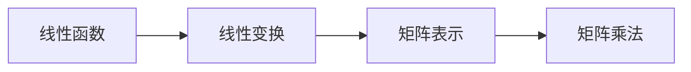

                 

# 线性代数导引：线性函数

> 关键词：线性函数, 线性变换, 矩阵表示, 矩阵乘法, 特征值与特征向量, 奇异值分解

## 1. 背景介绍

### 1.1 问题由来
线性代数是数学的一个重要分支，其核心内容是对线性和向量空间的研究。在线性代数中，线性函数扮演了非常重要的角色。它们不仅仅用于描述数据的线性变换，还广泛应用在各种数学建模和机器学习算法中。深入理解线性函数的原理和应用，对于学习线性代数乃至更广泛的数据科学领域，都至关重要。

### 1.2 问题核心关键点
线性函数的核心在于理解它们如何通过矩阵表示进行计算，以及它们的数学性质和应用场景。掌握线性函数，可以帮助我们更好地理解线性变换，进行特征提取和数据压缩等操作。此外，线性函数的特征值和特征向量也常常用于数据分析和模型诊断。

### 1.3 问题研究意义
研究线性函数，对于理解和应用线性代数，提高数据建模和机器学习算法的效率和效果，具有重要意义：

1. **高效建模**：通过线性函数，可以构建高效的数学模型，用于数据预测、分类、回归等任务。
2. **优化算法**：线性函数的优化问题在工业界和学术界都有广泛应用，如线性规划、最小二乘法等。
3. **特征提取**：通过线性变换，可以提取数据中的关键特征，用于降维、去噪等预处理。
4. **数据压缩**：线性函数可以用于数据压缩，如PCA（主成分分析）等，有效减少数据量，提高计算效率。
5. **诊断分析**：通过特征值和特征向量的分析，可以诊断数据中的异常和错误，提高模型的鲁棒性。

## 2. 核心概念与联系

### 2.1 核心概念概述

在深入讨论线性函数之前，我们先明确几个关键概念：

- **线性函数**：指函数形式 $f(x) = ax + b$，其中 $a, b \in \mathbb{R}$ 是常数。在线性代数中，线性函数通常由矩阵和向量表示。
- **线性变换**：指通过矩阵乘法进行的函数映射。例如，对于向量 $x$，线性变换可以表示为 $Ax$，其中 $A$ 是线性变换矩阵。
- **矩阵表示**：在线性代数中，线性函数和线性变换通常用矩阵和向量的形式表示。矩阵乘法是进行线性变换的基础。
- **矩阵乘法**：对于矩阵 $A$ 和 $B$，它们的乘积 $AB$ 是一个新矩阵，其中每个元素是对应位置元素乘积的和。

### 2.2 核心概念原理和架构的 Mermaid 流程图



这个流程图展示了线性函数、线性变换、矩阵表示和矩阵乘法之间的逻辑关系：线性函数通过线性变换进行映射，而这种映射可以用矩阵乘法表示和计算。

## 3. 核心算法原理 & 具体操作步骤
### 3.1 算法原理概述

线性函数的基本原理是通过矩阵乘法实现向量或矩阵的线性变换。在线性代数中，任何线性函数都可以表示为一个线性变换矩阵乘以一个向量或矩阵。这种表示方式简化了线性函数的计算，使其可以高效地应用于各种数学建模和机器学习算法中。

### 3.2 算法步骤详解

线性函数的具体操作步骤如下：

1. **定义线性变换矩阵**：
   - 选择一个合适的变换矩阵 $A$，表示线性函数的变换。
   - 确保矩阵 $A$ 是方阵（即行数等于列数），这样它才能进行矩阵乘法。

2. **定义输入向量或矩阵**：
   - 定义一个向量 $x$ 或矩阵 $X$，作为线性函数的输入。

3. **计算线性变换**：
   - 通过矩阵乘法计算 $Ax$ 或 $AX$，得到线性函数的输出。

4. **解释输出结果**：
   - 根据矩阵 $A$ 的特征和输入向量 $x$ 的含义，解释输出结果的数学意义。

### 3.3 算法优缺点

线性函数具有以下优点：

- **高效计算**：通过矩阵乘法进行计算，线性函数可以高效地应用于大规模数据集。
- **可解释性强**：线性函数的变换规则直观明了，易于理解和解释。
- **易于扩展**：可以通过增加矩阵维度或进行矩阵分解，灵活地处理复杂问题。

同时，线性函数也有以下缺点：

- **模型限制**：线性函数假设输入和输出之间的关系是线性的，这在某些实际问题中可能并不成立。
- **过拟合风险**：由于线性函数的线性性质，它可能过拟合训练数据，无法泛化到新数据上。
- **处理非线性问题能力有限**：线性函数无法处理输入和输出之间的非线性关系，需要结合其他方法进行处理。

### 3.4 算法应用领域

线性函数在线性代数和数学建模中有着广泛的应用，主要包括以下几个方面：

- **数据预处理**：在线性代数中，线性变换被广泛用于数据标准化、归一化等预处理步骤。
- **特征提取**：通过线性变换，可以从数据中提取出重要的特征，用于降维和分类。
- **线性回归**：线性函数是线性回归模型的核心，用于预测连续型变量的值。
- **线性规划**：线性规划是优化问题的一种形式，广泛用于资源分配、路径规划等领域。
- **矩阵分解**：如奇异值分解（SVD）、QR分解等，用于数据压缩和去噪。

## 4. 数学模型和公式 & 详细讲解 & 举例说明

### 4.1 数学模型构建

在线性代数中，线性函数通常用矩阵和向量表示。假设有一个 $n$ 维的向量 $x = [x_1, x_2, \ldots, x_n]$，和一个 $m \times n$ 的矩阵 $A$，线性函数可以表示为：

$$
f(x) = Ax
$$

其中 $f(x)$ 是输出向量，$Ax$ 是输入向量 $x$ 通过矩阵 $A$ 线性变换得到的结果。

### 4.2 公式推导过程

对于一个 $m$ 维向量 $y$ 和一个 $n$ 维向量 $x$，我们可以定义一个 $m \times n$ 的矩阵 $A$，使得 $y = Ax$。具体来说，矩阵 $A$ 的每个元素 $a_{ij}$ 表示将 $x$ 的第 $i$ 个元素乘以 $a_{ij}$，然后加起来得到 $y$ 的第 $j$ 个元素。这个关系可以表示为：

$$
y = A \begin{bmatrix} x_1 \\ x_2 \\ \vdots \\ x_n \end{bmatrix}
$$

即：

$$
\begin{bmatrix} y_1 \\ y_2 \\ \vdots \\ y_m \end{bmatrix} = \begin{bmatrix} a_{11} & a_{12} & \cdots & a_{1n} \\ a_{21} & a_{22} & \cdots & a_{2n} \\ \vdots & \vdots & \ddots & \vdots \\ a_{m1} & a_{m2} & \cdots & a_{mn} \end{bmatrix} \begin{bmatrix} x_1 \\ x_2 \\ \vdots \\ x_n \end{bmatrix}
$$

### 4.3 案例分析与讲解

假设我们有一个矩阵 $A$ 和向量 $x$，其中：

$$
A = \begin{bmatrix} 1 & 2 \\ 3 & 4 \\ 5 & 6 \end{bmatrix}, \quad x = \begin{bmatrix} 1 \\ 2 \end{bmatrix}
$$

要求计算 $Ax$ 的值。根据矩阵乘法的定义，我们可以进行如下计算：

$$
Ax = \begin{bmatrix} 1 & 2 \\ 3 & 4 \\ 5 & 6 \end{bmatrix} \begin{bmatrix} 1 \\ 2 \end{bmatrix} = \begin{bmatrix} 1 \cdot 1 + 2 \cdot 2 \\ 3 \cdot 1 + 4 \cdot 2 \\ 5 \cdot 1 + 6 \cdot 2 \end{bmatrix} = \begin{bmatrix} 5 \\ 14 \\ 22 \end{bmatrix}
$$

这意味着向量 $x$ 通过矩阵 $A$ 的线性变换后，变成了向量 $y = [5, 14, 22]$。

## 5. 项目实践：代码实例和详细解释说明
### 5.1 开发环境搭建

在进行线性函数的操作之前，我们需要准备好开发环境。以下是使用Python进行NumPy和SciPy库的开发环境配置流程：

1. 安装Anaconda：从官网下载并安装Anaconda，用于创建独立的Python环境。

2. 创建并激活虚拟环境：
```bash
conda create -n linear-algebra-env python=3.8 
conda activate linear-algebra-env
```

3. 安装必要的库：
```bash
conda install numpy scipy matplotlib sympy
```

完成上述步骤后，即可在`linear-algebra-env`环境中开始线性函数的操作。

### 5.2 源代码详细实现

下面我们以矩阵乘法为例，给出使用NumPy库进行矩阵乘法的PyTorch代码实现。

```python
import numpy as np

# 定义矩阵A和向量x
A = np.array([[1, 2], [3, 4], [5, 6]])
x = np.array([1, 2])

# 计算线性变换
y = np.dot(A, x)

print(y)
```

在这个代码中，我们首先导入NumPy库，并定义了矩阵 $A$ 和向量 $x$。然后使用 `np.dot` 函数进行矩阵乘法计算，得到线性变换的结果 $y$。最后，我们打印输出结果。

### 5.3 代码解读与分析

让我们再详细解读一下关键代码的实现细节：

**定义矩阵A和向量x**：
- `np.array` 函数用于创建矩阵和向量。我们可以根据需要指定数组的维度和元素值，创建一个 $3 \times 2$ 的矩阵 $A$ 和一个 $2$ 维向量 $x$。

**计算线性变换**：
- `np.dot` 函数用于进行矩阵乘法。在这个例子中，我们计算了矩阵 $A$ 和向量 $x$ 的乘积，得到了 $y$。

**打印输出结果**：
- 使用 `print` 函数输出计算结果 $y$。

可以看到，通过NumPy库，我们可以非常简单地实现矩阵乘法。NumPy提供了高效的数组操作，大大简化了线性函数的操作。

## 6. 实际应用场景
### 6.1 线性回归

线性回归是线性函数的一种常见应用，用于预测连续型变量的值。假设我们有一个包含 $n$ 个样本的数据集 $(x_1, y_1), (x_2, y_2), \ldots, (x_n, y_n)$，其中 $x_i$ 是一个 $p$ 维向量，$y_i$ 是连续型变量，我们的目标是通过线性回归模型 $f(x) = Ax + b$ 预测新的输入 $x$ 对应的输出 $y$。

线性回归的常见算法包括普通最小二乘法（OLS）和梯度下降法（GD）。在最小二乘法中，我们通过最小化残差平方和来求解最优的系数 $A$ 和截距 $b$。在梯度下降法中，我们通过迭代更新系数来最小化损失函数，直到达到收敛。

### 6.2 主成分分析（PCA）

主成分分析是一种常用的数据降维技术，它通过线性变换将高维数据投影到低维空间中。假设我们有一个 $n$ 维的数据集 $X$，我们的目标是通过线性变换 $X' = AX$ 将其映射到一个 $m$ 维的空间中，其中 $m$ 小于 $n$。为了保持数据的方差，我们需要找到 $m$ 个不相关的向量 $A$，使得它们最大化数据的方差，即最大化矩阵 $A$ 的特征值。

PCA的实现过程包括：
- 计算协方差矩阵 $C = \frac{1}{N} XX^T$，其中 $N$ 是数据集的样本数。
- 计算协方差矩阵 $C$ 的特征值和特征向量。
- 选择 $m$ 个特征向量作为新的矩阵 $A$，其中 $m$ 小于 $n$。
- 计算新的数据集 $X'$，即 $X' = AX$。

### 6.3 奇异值分解（SVD）

奇异值分解是一种矩阵分解技术，用于数据压缩和去噪。假设我们有一个 $m \times n$ 的矩阵 $A$，我们的目标是通过分解 $A$ 成 $U\Sigma V^T$ 的形式，将其压缩到更低维度。$U$ 和 $V$ 是正交矩阵，$\Sigma$ 是对角矩阵，其中对角线上的元素称为奇异值。

SVD的实现过程包括：
- 计算矩阵 $A$ 的奇异值分解 $A = U\Sigma V^T$。
- 选择 $k$ 个最大的奇异值和对应的特征向量，构成新的矩阵 $A_k = U_k\Sigma_k V_k^T$，其中 $k$ 小于 $m$ 或 $n$。
- 计算新的矩阵 $B$，即 $B = A_k^T A_k$，用于去除噪声和冗余信息。

## 7. 工具和资源推荐
### 7.1 学习资源推荐

为了帮助开发者系统掌握线性函数的理论基础和实践技巧，这里推荐一些优质的学习资源：

1. 《线性代数及其应用》书籍：经典的线性代数教材，详细介绍了线性代数的基本概念和应用。

2. MIT OpenCourseWare《Linear Algebra》课程：MIT提供的线性代数公开课，涵盖线性函数、矩阵乘法、特征值与特征向量等核心内容。

3. Coursera《Applied Linear Algebra》课程：由密歇根大学提供的线性代数应用课程，结合实际问题讲解线性函数的应用。

4. Wolfram Mathematica：强大的数学计算工具，可以进行矩阵运算、特征值计算等操作。

5. TensorFlow：谷歌开发的深度学习框架，提供了丰富的矩阵运算和优化算法。

6. NumPy官方文档：NumPy库的官方文档，详细介绍了矩阵运算、线性变换等核心功能。

通过对这些资源的学习实践，相信你一定能够快速掌握线性函数的精髓，并用于解决实际的数学建模和机器学习问题。

### 7.2 开发工具推荐

高效的开发离不开优秀的工具支持。以下是几款用于线性函数开发的常用工具：

1. Python：简单易学的高级编程语言，广泛应用于数据科学和机器学习领域。
2. NumPy：用于数值计算的Python库，提供了高效的矩阵运算和线性变换函数。
3. SciPy：基于NumPy的科学计算库，提供了更多的数学函数和算法。
4. TensorFlow：谷歌开发的深度学习框架，支持矩阵运算和优化算法。
5. Wolfram Mathematica：强大的数学计算工具，支持符号计算和数值计算。

合理利用这些工具，可以显著提升线性函数的操作效率，加快创新迭代的步伐。

### 7.3 相关论文推荐

线性函数的研究历史悠久，涉及众多的经典理论和方法。以下是几篇奠基性的相关论文，推荐阅读：

1. Strang, G. (1980).《线性代数及其应用》。
2. Gilbert Strang, 1999.《Linear Algebra and Its Applications》.
3. Horn, R.A., and C.R. Johnson. 1985.《Matrix Analysis》.
4. Golub, G.H., and C.F. Van Loan. 1983.《Matrix Computations》.
5. Zeeuw, D., and H. Vincke. 1987.《A Simple Homotopy Algorithm for SVD Computation》.

这些论文代表了线性函数的研究方向和理论基础，是深入学习线性代数的重要参考资料。

## 8. 总结：未来发展趋势与挑战
### 8.1 总结

本文对线性函数及其应用进行了全面系统的介绍。首先阐述了线性函数的基本原理和应用场景，明确了线性函数在线性代数和机器学习中的重要地位。其次，从原理到实践，详细讲解了线性函数的操作方法和实现细节，给出了具体的代码实例。同时，本文还探讨了线性函数在多个实际应用场景中的使用，展示了其广泛的适用性和强大能力。此外，本文精选了线性函数的学习资源，力求为读者提供全方位的技术指引。

通过本文的系统梳理，可以看到，线性函数是线性代数和机器学习中的基础工具，其高效计算和可解释性使其在数据建模和算法优化中发挥着重要作用。未来，伴随线性函数理论的不断进步，其在各个领域的应用将更加广泛和深入。

### 8.2 未来发展趋势

展望未来，线性函数的发展趋势包括以下几个方面：

1. **高效计算**：随着计算能力的提升和硬件技术的进步，线性函数的计算速度将不断加快，处理大规模数据集的能力将进一步增强。
2. **多模态融合**：线性函数可以与图像、语音、文本等多模态数据结合，实现更加复杂的数据分析和建模。
3. **智能化应用**：线性函数可以与人工智能技术结合，应用于更广泛的问题求解，如机器人路径规划、智能推荐系统等。
4. **自适应优化**：随着深度学习的发展，线性函数将与自适应优化技术结合，实现更加灵活和高效的数据处理和建模。
5. **隐私保护**：线性函数可以用于数据加密和隐私保护，如差分隐私等技术，保护数据隐私安全。

以上趋势凸显了线性函数的重要地位和广泛应用前景。这些方向的探索发展，必将进一步提升线性函数的性能和应用范围，推动数学和计算机科学的进步。

### 8.3 面临的挑战

尽管线性函数在理论和应用上都有广泛的研究，但在实践中仍然面临一些挑战：

1. **计算复杂度**：线性函数的计算复杂度较高，尤其是在处理大规模矩阵时，计算成本较高。
2. **模型复杂性**：线性函数的模型复杂度较高，尤其是在高维数据和复杂函数的情况下，难以获得理想的效果。
3. **鲁棒性问题**：线性函数对输入数据的噪声和异常敏感，可能影响其计算结果的准确性。
4. **可解释性不足**：线性函数的内部机制难以解释，难以理解其预测结果的来源和过程。
5. **应用局限性**：线性函数适用于线性关系的数据，但对于非线性关系的数据，可能无法获得理想的效果。

这些挑战需要进一步研究和优化，才能使线性函数更好地服务于实际应用。

### 8.4 研究展望

为了应对上述挑战，未来的研究需要在以下几个方面寻求新的突破：

1. **高效算法**：研究更加高效的计算方法和硬件支持，提升线性函数的计算效率。
2. **鲁棒性优化**：研究鲁棒性优化方法，提高线性函数对噪声和异常数据的抗干扰能力。
3. **模型简化**：研究模型简化技术，降低线性函数的计算复杂度和模型复杂度。
4. **可解释性增强**：研究可解释性技术，增强线性函数的内部机制透明度，提升其可解释性。
5. **多模态融合**：研究多模态数据融合技术，使线性函数能够处理更加复杂的数据集。

这些研究方向将推动线性函数的发展，使其在实际应用中发挥更大的作用。

## 9. 附录：常见问题与解答

**Q1：线性函数是否可以用于非线性数据建模？**

A: 线性函数假设输入和输出之间的关系是线性的，因此无法直接用于非线性数据建模。不过，可以通过结合非线性函数（如多项式函数、指数函数等）来构建非线性模型。

**Q2：如何判断一个矩阵是否是正定矩阵？**

A: 一个矩阵是正定矩阵的条件是：
1. 矩阵的所有主子矩阵都是正定的。
2. 矩阵的所有特征值都是正数。
3. 矩阵的所有特征向量都是线性无关的。

**Q3：奇异值分解（SVD）和主成分分析（PCA）的区别是什么？**

A: 奇异值分解和主成分分析都是用于数据降维和去噪的技术，但它们的目标和方法有所不同：
1. 奇异值分解旨在将矩阵分解成三个正交矩阵的乘积，其中对角矩阵包含矩阵的奇异值。
2. 主成分分析旨在通过线性变换将数据投影到低维空间中，保留数据的主要特征。

**Q4：如何求解线性方程组？**

A: 求解线性方程组的常见方法包括：
1. 高斯消元法：将方程组转化为上三角矩阵，然后回代求解。
2. 矩阵分解法：将方程组表示为矩阵形式，进行矩阵分解求解。
3. 迭代法：使用迭代算法，如雅可比迭代法、高斯-赛德尔迭代法等，逐步逼近解。

这些方法都可以用于求解线性方程组，具体选择哪种方法取决于方程组的规模和性质。

---

作者：禅与计算机程序设计艺术 / Zen and the Art of Computer Programming

