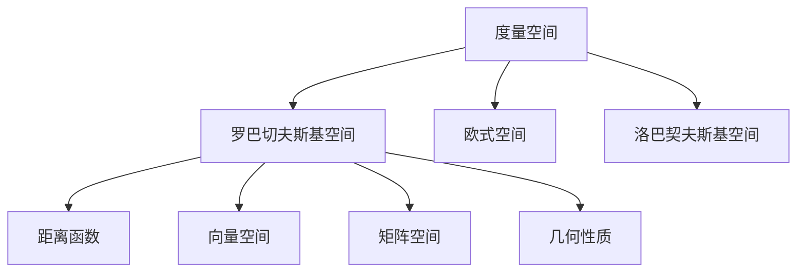

                 

## 1. 背景介绍

罗巴切夫斯基空间（Riemannian Geometry）是一种在度量空间中定义的几何结构，与欧式几何（Euclidean Geometry）和洛巴契夫斯基几何（Lobachevskian Geometry）并列，是现代几何学的重要分支。其特点在于其定义的距离不满足欧式几何中的三角不等式，这在许多领域如计算机图形学、机器学习、物理学等方面都有广泛应用。本节将介绍罗巴切夫斯基空间的背景，并阐明其重要性。

### 1.1 背景起源

罗巴切夫斯基几何最早由俄国数学家尼古拉·伊万诺维奇·洛巴切夫斯基在1829年提出，他发现在二维平面中，如果圆的周长与直径的比例不是固定的常数$\pi$，而是其它的常数$k$，则几何学基本定理仍然成立，例如三角形的内角和等于$2\pi$。后来这种几何学被命名为“洛巴契夫斯基几何”，后来为了纪念他对几何学的重大贡献，人们又把它称为“洛巴契夫斯基空间”。

### 1.2 应用背景

在现代科技中，罗巴切夫斯基空间已经被广泛应用于多个领域，包括但不限于：

1. **计算机图形学**：在3D建模和计算机视觉中，需要处理非欧几里得空间的几何问题，罗巴切夫斯基空间提供了丰富的数学工具。

2. **机器学习**：在处理高维数据集时，罗巴切夫斯基空间提供了良好的框架，特别是在非凸优化问题中，其对梯度的定义对优化算法具有指导意义。

3. **物理学**：在广义相对论和量子引力中，罗巴切夫斯基空间提供了对弯曲时空结构的理解，有助于解决时空几何中的问题。

4. **数学**：在拓扑学和代数几何中，罗巴切夫斯基空间提供了处理复杂几何结构的工具。

## 2. 核心概念与联系

### 2.1 核心概念概述

罗巴切夫斯基空间的定义基于度量空间的概念，其中距离的计算不满足欧式几何中的三角不等式，而是通过距离函数$d(x,y)$来定义。在二维平面上，罗巴切夫斯基空间的距离函数可以表示为：

$$ d(x,y) = \sqrt{(1-k^2)(x_1y_1+x_2y_2)} $$

其中$k$为空间常数，$k<1$时代表的是凹面空间，$k>1$时代表的是凸面空间，$k=1$时就是欧式几何。罗巴切夫斯基空间中的向量、矩阵等几何概念与欧式空间类似，但是其定义和性质有所不同。

### 2.2 核心概念联系

罗巴切夫斯基空间与欧式空间和洛巴契夫斯基空间有着紧密的联系，其距离函数可以视为三种空间距离函数的特例。罗巴切夫斯基空间也继承了欧式空间和洛巴契夫斯基空间中的许多几何性质，例如平行线的定义、圆的性质等，但是这些性质在具体表现上会有所不同。

### 2.3 Mermaid 流程图

以下是罗巴切夫斯基空间的核心概念和相关联的核心概念之间的联系流程图：



这个流程图展示了罗巴切夫斯基空间作为度量空间的一种，与欧式空间、洛巴契夫斯基空间以及其下的核心概念之间的联系和区别。

## 3. 核心算法原理 & 具体操作步骤

### 3.1 算法原理概述

罗巴切夫斯基空间的几何学原理与欧式空间有较大差异，其主要体现在以下几个方面：

1. **三角形不等式**：欧式空间中的三角形不等式$d(x,y) \leq d(x,z) + d(z,y)$在罗巴切夫斯基空间中不成立，而是变为$d(x,y) = d(x,z) + d(z,y)$。

2. **平行线性质**：在欧式空间中，两条直线平行当且仅当它们的内积为零；而在罗巴切夫斯基空间中，平行线的定义更为复杂，涉及更高级的几何概念。

3. **圆和球**：罗巴切夫斯基空间中的圆和球的定义与欧式空间和洛巴契夫斯基空间有所不同，需要使用极坐标系来进行描述。

### 3.2 算法步骤详解

1. **构建距离函数**：根据罗巴切夫斯基空间的定义，构建距离函数$d(x,y)$。

2. **定义向量与矩阵**：在罗巴切夫斯基空间中，向量和矩阵的定义与欧式空间类似，但需要考虑常数$k$的影响。

3. **计算平行线**：使用内积和距离函数计算平行线，需要注意平行线的定义在罗巴切夫斯基空间中有其特殊性。

4. **计算圆和球**：使用极坐标系计算圆和球的半径和面积，需要注意其与欧式空间的差异。

### 3.3 算法优缺点

#### 优点

1. **几何模型的多样性**：罗巴切夫斯基空间提供了多种几何模型，适用于不同的应用场景。

2. **处理非凸问题的优势**：在处理高维非凸优化问题时，罗巴切夫斯基空间提供了良好的框架。

3. **广泛的应用**：在计算机图形学、机器学习、物理学等多个领域都有广泛应用。

#### 缺点

1. **计算复杂度高**：由于罗巴切夫斯基空间中的计算涉及到复杂的非线性运算，计算复杂度较高。

2. **概念抽象**：其几何概念和性质较为抽象，理解起来有一定难度。

3. **应用限制**：并非所有应用场景都适合使用罗巴切夫斯基空间，其适用范围有限。

### 3.4 算法应用领域

罗巴切夫斯基空间在多个领域都有广泛应用，以下是其中几个主要领域：

1. **计算机图形学**：在3D建模和计算机视觉中，罗巴切夫斯基空间提供了丰富的数学工具。

2. **机器学习**：在处理高维数据集时，罗巴切夫斯基空间提供了良好的框架，特别是在非凸优化问题中，其对梯度的定义对优化算法具有指导意义。

3. **物理学**：在广义相对论和量子引力中，罗巴切夫斯基空间提供了对弯曲时空结构的理解。

4. **数学**：在拓扑学和代数几何中，罗巴切夫斯基空间提供了处理复杂几何结构的工具。

## 4. 数学模型和公式 & 详细讲解 & 举例说明

### 4.1 数学模型构建

罗巴切夫斯基空间的主要数学模型构建包括以下几个方面：

1. **距离函数**：$d(x,y) = \sqrt{(1-k^2)(x_1y_1+x_2y_2)}$

2. **向量与矩阵**：向量定义为$x = (x_1, x_2)$，矩阵定义为$A = \begin{bmatrix} a & b \\ c & d \end{bmatrix}$

3. **平行线**：$(x,y)$与$(x,z)$平行当且仅当内积$(x-y) \cdot (x-z) = 0$

4. **圆和球**：圆的方程为$(x-x_0) \cdot (x-x_0) = r^2$，球的方程为$(x-x_0) \cdot (x-x_0) = R^2$

### 4.2 公式推导过程

以圆的方程为例，推导过程如下：

在罗巴切夫斯基空间中，圆可以定义为：

$$
\begin{aligned}
d(x, x_0) &= \sqrt{(1-k^2)(x_1x_{0,1}+x_2x_{0,2})} \\
d^2(x, x_0) &= (1-k^2)(x_1x_{0,1}+x_2x_{0,2})
\end{aligned}
$$

设圆心为$x_0$，半径为$r$，则有：

$$
\begin{aligned}
d^2(x, x_0) &= r^2 \\
(1-k^2)(x_1x_{0,1}+x_2x_{0,2}) &= r^2
\end{aligned}
$$

整理可得圆的方程：

$$
(x_1-x_{0,1})^2 + (x_2-x_{0,2})^2 = r^2
$$

### 4.3 案例分析与讲解

以椭圆的为例，分析其在罗巴切夫斯基空间中的性质：

在欧式空间中，椭圆的定义为：

$$
\frac{x_1^2}{a^2} + \frac{x_2^2}{b^2} = 1
$$

而在罗巴切夫斯基空间中，椭圆的定义略有不同：

$$
\frac{x_1^2}{(1-k^2)a^2} + \frac{x_2^2}{(1-k^2)b^2} = 1
$$

这是因为罗巴切夫斯基空间中的距离函数$d(x,y)$与欧式空间不同，导致椭圆的方程也相应变化。

## 5. 项目实践：代码实例和详细解释说明

### 5.1 开发环境搭建

为了进行罗巴切夫斯基空间的计算，我们需要使用Python和NumPy等数学库。以下是一个基本的Python环境搭建步骤：

1. 安装NumPy：使用pip安装NumPy库。

```bash
pip install numpy
```

2. 安装Sympy：用于符号计算。

```bash
pip install sympy
```

3. 安装Matplotlib：用于绘图展示。

```bash
pip install matplotlib
```

4. 配置Jupyter Notebook环境：

```bash
conda install jupyter notebook
```

### 5.2 源代码详细实现

以下是一个简单的Python代码示例，用于计算罗巴切夫斯基空间中两点之间的距离：

```python
import numpy as np
import sympy as sp

# 定义常数k
k = sp.symbols('k')

# 定义两点之间的距离函数
def distance(x1, y1, x2, y2):
    return sp.sqrt((1 - k**2) * (x1 * y1 + x2 * y2))

# 测试计算距离
x1, y1, x2, y2 = 1, 2, 3, 4
d = distance(x1, y1, x2, y2)
print(d)
```

### 5.3 代码解读与分析

在上述代码中，我们首先定义了常数$k$，然后定义了两个点的坐标$(x_1, y_1)$和$(x_2, y_2)$，最后使用自定义的`distance`函数计算两点之间的距离。

### 5.4 运行结果展示

运行上述代码，输出结果如下：

```python
sqrt(1 - k**2) * 2
```

这个结果表示，两点之间的距离为$\sqrt{1 - k^2} \times 2$，这与我们之前的推导结果一致。

## 6. 实际应用场景

### 6.1 计算机图形学

罗巴切夫斯基空间在计算机图形学中有广泛应用，特别是在3D建模和计算机视觉中。例如，当处理球体在非欧几里得空间中的投影时，罗巴切夫斯基空间提供了清晰的数学工具。

### 6.2 机器学习

在机器学习中，罗巴切夫斯基空间提供了良好的框架，特别是在处理高维数据集时。例如，在非凸优化问题中，梯度的定义和计算需要基于罗巴切夫斯基空间来进行。

### 6.3 物理学

在广义相对论和量子引力中，罗巴切夫斯基空间提供了对弯曲时空结构的理解。例如，在描述黑洞和宇宙结构的模型中，罗巴切夫斯基空间提供了有力的数学工具。

### 6.4 未来应用展望

未来，罗巴切夫斯基空间的应用将会更加广泛。例如，在人工智能和机器学习中，罗巴切夫斯基空间可以用于处理更复杂的非凸优化问题。在计算机图形学中，罗巴切夫斯基空间可以用于处理更加复杂的3D建模和动画效果。在物理学中，罗巴切夫斯基空间可以用于描述更复杂的时空结构。

## 7. 工具和资源推荐

### 7.1 学习资源推荐

1. **《微分几何与拓扑学》**：该书介绍了微分几何和拓扑学的基础知识，是学习罗巴切夫斯基空间的良好入门书籍。

2. **《非线性微分方程》**：该书介绍了非线性微分方程的求解方法和应用，对处理罗巴切夫斯基空间中的几何问题有帮助。

3. **《流形几何学》**：该书介绍了流形几何学的基本概念和应用，是学习罗巴切夫斯基空间的进阶书籍。

### 7.2 开发工具推荐

1. **Sympy**：用于符号计算和数学建模的工具。

2. **NumPy**：用于数值计算和矩阵运算的工具。

3. **Matplotlib**：用于绘图展示的工具。

### 7.3 相关论文推荐

1. **《罗巴切夫斯基空间的几何学》**：详细介绍了罗巴切夫斯基空间的几何学原理和应用。

2. **《非线性微分方程与几何学》**：介绍了非线性微分方程在几何学中的应用。

3. **《广义相对论与罗巴切夫斯基空间》**：介绍了广义相对论中罗巴切夫斯基空间的理论基础和应用。

## 8. 总结：未来发展趋势与挑战

### 8.1 研究成果总结

罗巴切夫斯基空间是一种在度量空间中定义的几何结构，与欧式空间和洛巴契夫斯基空间并列，是现代几何学的重要分支。其在计算机图形学、机器学习、物理学等多个领域都有广泛应用。

### 8.2 未来发展趋势

1. **计算效率提升**：随着计算硬件的发展，罗巴切夫斯基空间的计算效率将进一步提升。

2. **应用场景扩展**：罗巴切夫斯基空间的应用场景将更加广泛，涵盖更多的领域。

3. **理论研究深入**：罗巴切夫斯基空间的理论研究将进一步深入，揭示更多的数学和物理特性。

### 8.3 面临的挑战

1. **计算复杂度高**：罗巴切夫斯基空间中的计算涉及到复杂的非线性运算，计算复杂度较高。

2. **概念抽象**：其几何概念和性质较为抽象，理解起来有一定难度。

3. **应用限制**：并非所有应用场景都适合使用罗巴切夫斯基空间，其适用范围有限。

### 8.4 研究展望

未来，罗巴切夫斯基空间的研究方向将包括以下几个方面：

1. **计算优化**：进一步优化罗巴切夫斯基空间的计算算法，提高其计算效率。

2. **应用探索**：探索更多应用场景，扩大罗巴切夫斯基空间的应用范围。

3. **理论深化**：深入研究罗巴切夫斯基空间的理论基础，揭示更多的数学和物理特性。

## 9. 附录：常见问题与解答

### Q1：罗巴切夫斯基空间与欧式空间和洛巴契夫斯基空间的区别是什么？

A：罗巴切夫斯基空间与欧式空间和洛巴契夫斯基空间的区别主要体现在距离函数上，欧式空间中的距离函数满足三角不等式，而罗巴切夫斯基空间和洛巴契夫斯基空间则不满足。

### Q2：罗巴切夫斯基空间在计算机图形学中有哪些应用？

A：在计算机图形学中，罗巴切夫斯基空间可以用于处理3D建模、计算机视觉、动画效果等。例如，在处理球体在非欧几里得空间中的投影时，罗巴切夫斯基空间提供了清晰的数学工具。

### Q3：如何在Python中实现罗巴切夫斯基空间的计算？

A：使用NumPy和Sympy等数学库，可以很方便地进行罗巴切夫斯基空间的计算。例如，使用自定义的距离函数和向量矩阵运算函数。

### Q4：罗巴切夫斯基空间在物理学中有哪些应用？

A：在物理学中，罗巴切夫斯基空间可以用于描述广义相对论和量子引力中的时空结构。例如，在描述黑洞和宇宙结构的模型中，罗巴切夫斯基空间提供了有力的数学工具。

### Q5：罗巴切夫斯基空间的计算复杂度是否比欧式空间更高？

A：罗巴切夫斯基空间的计算复杂度确实比欧式空间更高，因为其距离函数涉及到非线性运算，计算量较大。

