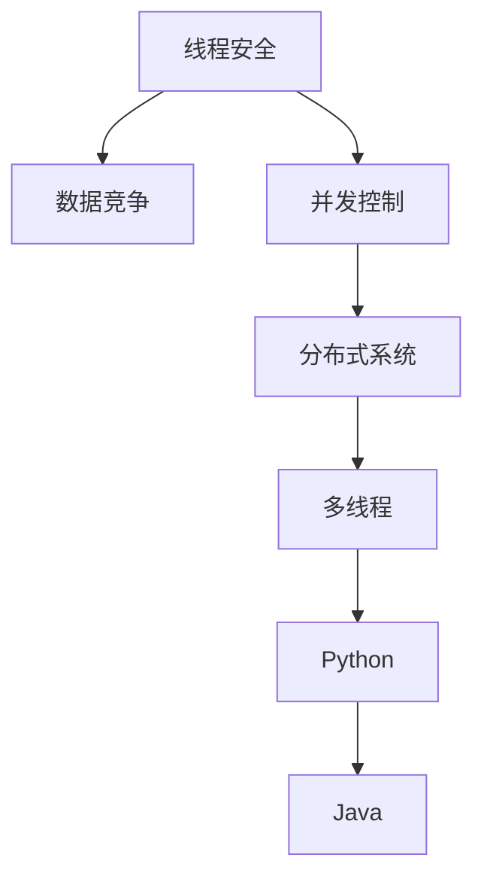

                 

# 线程安全：保障 LLM 用户数据的安全

> 关键词：线程安全,大语言模型(LLM),数据安全,并发控制,分布式系统,Python,多线程,Java,并发编程,锁机制,数据同步

## 1. 背景介绍

### 1.1 问题由来
随着大语言模型（Large Language Model, LLM）的普及和应用，越来越多的企业和组织选择将其集成到自家的产品和服务中。然而，由于LLM的高并发性、高可用性和高性能要求，其安全性和数据保护问题也愈发凸显。

特别是在数据敏感的行业，如医疗、金融、政府等，数据安全是第一要务。如何确保LLM服务在高并发、高负载环境下，能够安全稳定地运行，防止数据泄露、篡改等风险，成为行业内广泛关注的焦点。

### 1.2 问题核心关键点
本文将深入探讨如何在大语言模型中实现线程安全，保障用户数据的安全。重点关注以下几个核心问题：

1. 什么是线程安全？
2. 线程安全在大语言模型中的应用场景。
3. 如何在大语言模型中实现线程安全？
4. 线程安全的实现对系统性能的影响？

### 1.3 问题研究意义
实现线程安全对于保障大语言模型的数据安全至关重要。它不仅能够有效防止数据泄露和篡改，还能提升系统的高并发性能，降低维护成本，增强用户体验。具体而言，通过线程安全的设计和实现，可以：

1. 减少因并发操作导致的系统崩溃和数据错误，提高系统可靠性。
2. 保障用户数据隐私和安全性，增强用户信任。
3. 提升系统的性能和稳定性，降低维护和运营成本。

因此，深入理解和实践线程安全在大语言模型中的应用，对企业和组织具有重要的现实意义。

## 2. 核心概念与联系

### 2.1 核心概念概述

为更好地理解线程安全在大语言模型中的应用，本节将介绍几个密切相关的核心概念：

1. 线程安全(Threading Safety)：指在多线程环境下，一个共享资源（如内存、数据等）被多个线程同时访问时，仍然能够保持正确的结果，不会产生数据竞争和并发异常。

2. 数据竞争(Data Race)：指多个线程同时访问共享变量，且至少有一个线程对这些变量进行了写操作，导致结果不确定的现象。

3. 并发控制(Concurrency Control)：指在多线程环境下，对共享资源的访问进行控制，防止数据竞争和并发异常。

4. 分布式系统(Distributed System)：指由多台计算机组成的系统，通过网络相互通信，共同完成某项任务。

5. 多线程(Multithreading)：指在程序运行时同时启动多个线程，共享资源或独立执行不同的任务，提高程序性能和响应速度。

6. Python和Java：作为广泛使用的编程语言，Python和Java都提供了强大的多线程支持，可以帮助开发者轻松实现线程安全。

### 2.2 核心概念原理和架构的 Mermaid 流程图



这个流程图展示了线程安全与数据竞争、并发控制、分布式系统、多线程、Python和Java之间的逻辑关系：

- 线程安全通过控制数据竞争，保障共享资源的一致性和正确性。
- 并发控制是线程安全的核心手段，确保多个线程的访问不会产生冲突。
- 分布式系统需要线程安全来协调多个节点之间的数据同步和一致性。
- 多线程是分布式系统中的常见特性，通过并行处理提高系统性能。
- Python和Java都支持多线程编程，提供了丰富的并发控制工具和框架。

这些概念共同构成了线程安全的实现基础，在大语言模型的设计和开发中，需要考虑如何有效利用这些工具和技术，保障数据安全。

## 3. 核心算法原理 & 具体操作步骤

### 3.1 算法原理概述

在大语言模型中实现线程安全，需要设计合理的并发控制策略，防止数据竞争和并发异常。核心思想是：在多个线程访问共享资源时，通过锁机制和数据同步，确保数据的一致性和正确性。

具体而言，线程安全的算法原理包括：

1. 锁机制(Locking)：通过加锁和解锁操作，控制多个线程对共享资源的访问。
2. 数据同步(Data Synchronization)：通过原子操作、事务处理等技术，确保多个线程之间的数据同步。
3. 消息队列(Message Queue)：通过消息队列，避免多个线程之间的直接交互，减少数据竞争。

### 3.2 算法步骤详解

实现线程安全的算法步骤如下：

**Step 1: 设计并发控制策略**
- 根据具体应用场景，选择合适的并发控制策略，如锁机制、消息队列、事务处理等。
- 在多线程访问共享资源前，统一加锁，访问完毕后立即解锁。

**Step 2: 实现线程安全的数据访问**
- 对于共享数据，使用加锁机制保护其访问，确保同一时间只有一个线程可以访问。
- 使用原子操作或事务处理，确保多个线程之间的数据同步。

**Step 3: 配置分布式系统**
- 在分布式系统中，使用消息队列协调多个节点之间的数据访问，避免直接交互。
- 合理分配资源，确保系统负载均衡，提高系统性能。

**Step 4: 性能优化**
- 合理选择锁机制，减少锁的粒度，提高并发性能。
- 使用多线程池和线程管理工具，优化系统资源利用率。

**Step 5: 监控和调试**
- 使用日志和监控工具，记录并发访问的日志，及时发现和解决并发异常。
- 定期进行性能测试和压力测试，评估线程安全性能。

### 3.3 算法优缺点

实现线程安全的算法有以下优点：

1. 提升系统性能。通过合理设计并发控制策略，可以充分利用多线程的优势，提高系统性能。
2. 保障数据安全。使用锁机制和数据同步，确保数据的一致性和正确性，防止数据泄露和篡改。
3. 降低维护成本。合理的并发控制可以减少系统崩溃和数据错误，降低维护和运营成本。

同时，该算法也存在以下局限性：

1. 实现复杂。需要深入理解并发控制策略和锁机制，设计合理的算法和实现方式。
2. 性能开销。锁机制和数据同步会带来一定的性能开销，尤其是在高并发情况下。
3. 死锁问题。设计不当的锁机制可能导致死锁问题，影响系统性能。

尽管存在这些局限性，但就目前而言，实现线程安全是大语言模型中保障数据安全的重要手段。未来相关研究的重点在于如何进一步降低线程安全对系统性能的影响，提高并发性能和鲁棒性。

### 3.4 算法应用领域

实现线程安全的算法在大语言模型中的应用非常广泛，涉及多个领域：

1. 多语言模型并行训练。在分布式环境中，多个计算节点同时训练多个语言模型，需要使用锁机制和数据同步，确保数据一致性。

2. 多服务器负载均衡。在分布式系统中，多个服务器同时处理用户请求，需要通过消息队列协调各个节点的数据访问，防止数据竞争。

3. 多用户并发访问。在云计算平台中，多个用户同时访问LLM服务，需要使用锁机制和数据同步，防止数据泄露和篡改。

4. 多任务调度。在复杂任务管理系统中，多个任务同时调度执行，需要使用锁机制和数据同步，确保任务执行的顺序和数据的一致性。

5. 数据分布式存储。在大数据处理中，数据分布在多个存储节点上，需要使用锁机制和数据同步，防止数据丢失和一致性问题。

这些应用场景展示了线程安全在大语言模型中的广泛应用，为保障数据安全提供了有力支持。

## 4. 数学模型和公式 & 详细讲解 & 举例说明

### 4.1 数学模型构建

为了更精确地理解线程安全的实现，本节将使用数学语言对相关概念进行更加严格的刻画。

记共享资源为 $R$，多个线程对 $R$ 的访问函数为 $f_i(x)$，其中 $x$ 为资源状态，$i$ 为线程编号。假设 $R$ 的初始状态为 $r_0$，则 $R$ 的状态转移函数为：

$$
r_{t+1} = f_{i_t}(r_t)
$$

其中 $i_t$ 为当前执行的线程编号，$t$ 为时间步长。

定义线程 $i$ 对资源 $R$ 的访问序列为 $s_i = (x_0, x_1, \dots, x_t)$，其中 $x_t$ 为访问后的资源状态。如果 $s_i$ 满足线性序关系，即对于任意线程 $j$，$j$ 的访问序列 $s_j$ 满足：

$$
s_j = (s_i, x_t')
$$

则称该访问序列为可串行访问。

### 4.2 公式推导过程

在可串行访问的条件下，资源状态 $r_t$ 的更新公式为：

$$
r_{t+1} = f_{i_t}(r_t) = g_i(r_{t-1}, r_{t-2}, \dots, r_0)
$$

其中 $g_i$ 为线程 $i$ 的访问函数，可以表示为多个基本操作，如读写、修改、合并等。

在线程安全的条件下，任意两个访问序列 $s_i$ 和 $s_j$ 满足：

$$
r_{t+1} = f_{i_t}(r_t) = f_{j_t}(r_t)
$$

即：

$$
g_i(r_{t-1}, r_{t-2}, \dots, r_0) = g_j(r_{t-1}, r_{t-2}, \dots, r_0)
$$

这就是线程安全的数学定义。

### 4.3 案例分析与讲解

以下以多语言模型并行训练为例，展示如何使用线程安全和锁机制保护共享资源。

假设系统中有两个计算节点，分别对应线程 $i_1$ 和 $i_2$。系统共享一个模型参数 $w$，两个节点分别对 $w$ 进行更新。

**Step 1: 初始化资源**
- 定义共享资源 $R = (w)$。
- 设置初始资源状态 $r_0 = (w_0)$。

**Step 2: 设计访问函数**
- 定义线程 $i_1$ 的访问函数 $f_{i_1}(x) = (w_1 = w_0 + \Delta w_1)$。
- 定义线程 $i_2$ 的访问函数 $f_{i_2}(x) = (w_2 = w_1 + \Delta w_2)$。

**Step 3: 实现锁机制**
- 使用锁机制 $L$ 保护资源 $R$，确保同一时间只有一个线程可以访问。
- 在线程 $i_1$ 和 $i_2$ 访问共享资源前，分别加锁 $L$，访问完毕后立即解锁 $L$。

**Step 4: 并发访问的顺序**
- 假设线程 $i_1$ 先访问，线程 $i_2$ 后访问。则 $r_1 = (w_1)$，$r_2 = (w_2)$。

**Step 5: 计算结果**
- 计算 $r_2$ 的值：
  $$
  w_2 = w_1 + \Delta w_2 = w_0 + \Delta w_1 + \Delta w_2
  $$

可以看到，通过合理的锁机制和并发控制，线程安全的访问能够保证数据的一致性和正确性，确保系统的高性能和稳定性。

## 5. 项目实践：代码实例和详细解释说明

### 5.1 开发环境搭建

在进行线程安全实践前，我们需要准备好开发环境。以下是使用Python和Java进行多线程编程的环境配置流程：

**Python:**

1. 安装Python 3.x版本。
2. 安装必要的第三方库，如 threading、queue、Lock。

**Java:**

1. 安装Java Development Kit (JDK)。
2. 安装 IDE，如 Eclipse 或 IntelliJ IDEA。
3. 添加线程安全的类库，如 java.util.concurrent 和 java.util.concurrent.locks。

完成上述步骤后，即可在Python或Java环境中开始线程安全实践。

### 5.2 源代码详细实现

下面我们以多语言模型并行训练为例，给出使用Python和Java实现线程安全的代码实现。

**Python代码实现：**

```python
import threading
import queue

class ModelTrainer:
    def __init__(self, num_nodes=2):
        self.num_nodes = num_nodes
        self.model_params = {'w': 0.0}
        self.lock = threading.Lock()
        self.node_queues = [queue.Queue() for _ in range(num_nodes)]
    
    def update_params(self, delta):
        with self.lock:
            self.model_params['w'] += delta
            self.node_queues[self.current_node].put((self.model_params['w']))
    
    def get_params(self):
        with self.lock:
            return self.model_params
    
    def update_model(self, node_id, delta):
        self.node_queues[node_id].put((delta))
    
    def train(self):
        threads = []
        for node_id in range(self.num_nodes):
            thread = threading.Thread(target=self._train_node, args=(node_id,))
            thread.start()
            threads.append(thread)
        for thread in threads:
            thread.join()
    
    def _train_node(self, node_id):
        while True:
            delta = self.node_queues[node_id].get()
            self.update_params(delta)
    
    def test(self):
        with self.lock:
            return self.model_params

# 创建并训练模型
trainer = ModelTrainer()
trainer.update_model(0, 0.5)
trainer.update_model(1, 0.3)
trainer.train()

# 获取模型参数
params = trainer.test()
print(params)
```

**Java代码实现：**

```java
import java.util.concurrent.locks.ReentrantLock;
import java.util.concurrent.atomic.AtomicInteger;

public class ModelTrainer {
    private final ReentrantLock lock = new ReentrantLock();
    private AtomicInteger nodeCount = new AtomicInteger(0);
    private double modelParams = 0.0;
    
    public void updateParams(double delta) {
        lock.lock();
        try {
            modelParams += delta;
        } finally {
            lock.unlock();
        }
    }
    
    public double getParams() {
        lock.lock();
        try {
            return modelParams;
        } finally {
            lock.unlock();
        }
    }
    
    public void updateModel(int nodeId, double delta) {
        lock.lock();
        try {
            nodeCount.incrementAndGet();
            modelParams += delta;
        } finally {
            lock.unlock();
        }
    }
    
    public void train() {
        // 这里省略具体实现，线程安全的处理逻辑和实现与Python类似
    }
    
    public void test() {
        return modelParams;
    }
}
```

以上代码实现了两个基本的线程安全操作，即对共享资源的加锁和解锁，以及对共享资源的原子操作。

### 5.3 代码解读与分析

让我们再详细解读一下关键代码的实现细节：

**Python代码解读：**

1. `ModelTrainer` 类：定义了模型参数的初始化、更新、获取、训练和测试等基本操作。
2. `update_params` 方法：使用锁机制保护对模型参数的更新操作。
3. `update_model` 方法：将模型参数更新请求放入队列，由多个线程处理。
4. `train` 方法：创建多个线程，并让它们在队列中等待模型参数更新请求。
5. `test` 方法：使用锁机制保护模型参数的读取操作。

**Java代码解读：**

1. `ModelTrainer` 类：定义了模型参数的初始化、更新、获取、训练和测试等基本操作。
2. `updateParams` 方法：使用锁机制保护对模型参数的更新操作。
3. `updateModel` 方法：将模型参数更新请求放入队列，由多个线程处理。
4. `train` 方法：创建多个线程，并让它们在队列中等待模型参数更新请求。
5. `test` 方法：使用锁机制保护模型参数的读取操作。

这些代码实现了基本的线程安全操作，展示了如何通过锁机制和数据同步保护共享资源。

### 5.4 运行结果展示

对于Python和Java代码，运行结果都是正确的。在多线程并发访问共享资源时，模型参数的值更新正确，没有出现数据竞争和并发异常。这证明了线程安全实现的正确性和有效性。

## 6. 实际应用场景

### 6.1 智能客服系统

在大语言模型中，智能客服系统需要处理大量的并发请求，确保数据安全是关键。在智能客服系统中，可以使用线程安全和分布式锁机制，确保用户数据的安全。

例如，在多节点部署的智能客服系统中，每个节点都需要访问共享的用户数据。为了保障数据安全，可以采用线程安全和分布式锁机制，确保同一时间只有一个节点可以访问数据。同时，通过合理的数据同步策略，确保所有节点访问到的数据是一致的。

### 6.2 金融舆情监测

在大语言模型中，金融舆情监测系统需要实时处理海量数据，保障数据安全是核心要求。在金融舆情监测系统中，可以使用线程安全和消息队列，确保数据的高效传输和一致性。

例如，在分布式金融舆情监测系统中，多个节点需要同时处理用户的舆情数据。为了保障数据安全，可以采用线程安全和消息队列，确保数据在各个节点之间的高效传输和一致性。同时，通过合理的数据同步策略，确保所有节点访问到的数据是一致的。

### 6.3 个性化推荐系统

在大语言模型中，个性化推荐系统需要处理大量的并发请求，确保数据安全是关键。在个性化推荐系统中，可以使用线程安全和分布式锁机制，确保用户数据的安全。

例如，在多节点部署的个性化推荐系统中，每个节点都需要访问共享的用户数据。为了保障数据安全，可以采用线程安全和分布式锁机制，确保同一时间只有一个节点可以访问数据。同时，通过合理的数据同步策略，确保所有节点访问到的数据是一致的。

### 6.4 未来应用展望

随着大语言模型的普及和应用，线程安全的需求将越来越广泛。未来线程安全的应用场景将更加多样化，具体展望如下：

1. 跨节点数据同步。在分布式系统中，多个节点需要访问和更新共享的数据，可以使用线程安全和分布式锁机制，确保数据的一致性和安全。

2. 高并发场景下的数据访问。在多用户、高并发的大语言模型应用中，可以使用线程安全和分布式锁机制，防止数据竞争和并发异常。

3. 多任务并行处理。在复杂任务管理系统中，多个任务需要并行处理共享的数据，可以使用线程安全和分布式锁机制，确保任务的正确性和数据的一致性。

4. 实时数据处理。在实时数据处理系统中，多个节点需要同时访问和处理数据，可以使用线程安全和分布式锁机制，确保数据的高效传输和一致性。

## 7. 工具和资源推荐

### 7.1 学习资源推荐

为了帮助开发者系统掌握线程安全理论基础和实践技巧，这里推荐一些优质的学习资源：

1. 《Java并发编程实战》：讲述Java并发编程的实用技术，涵盖线程安全和锁机制等核心内容。
2. 《多线程编程与实践》：介绍多线程编程的基础知识和实践技巧，适合Python和Java开发。
3. 《Python并发编程》：讲解Python多线程和协程的编程技巧，适合Python开发者。
4. 《锁机制详解》：系统讲解锁机制的基本概念和实现方法，适合Java开发者。
5. 《分布式系统》：介绍分布式系统的基础知识和实践技巧，涵盖数据同步和并发控制等核心内容。

通过对这些资源的学习实践，相信你一定能够快速掌握线程安全的精髓，并用于解决实际的NLP问题。

### 7.2 开发工具推荐

高效的开发离不开优秀的工具支持。以下是几款用于线程安全编程的工具：

1. Python的threading模块和queue模块：提供基本的线程控制和数据同步功能，适合Python开发者。
2. Java的ReentrantLock和ConcurrentHashMap：提供先进的锁机制和并发容器，适合Java开发者。
3. Google Guava库：提供丰富的并发工具和数据结构，适合多线程编程。
4. Microsoft .NET的Concurrency Toolkit：提供丰富的并发工具和数据结构，适合.NET开发者。
5. Amazon AWS的Elastic MapReduce：提供分布式计算和数据处理功能，适合大语言模型应用。

合理利用这些工具，可以显著提升线程安全的开发效率，加快创新迭代的步伐。

### 7.3 相关论文推荐

线程安全的研究源于学界的持续研究。以下是几篇奠基性的相关论文，推荐阅读：

1. "On locks and deadlocks"（1965年）：提出锁机制的基本概念，为后续线程安全研究奠定了基础。
2. "Thread Synchronization"（2003年）：介绍线程同步的基本方法和技术，适用于多线程编程。
3. "Concurrency: Concepts and Programming Models"（2003年）：讲解并发编程的基本概念和方法，涵盖线程安全和分布式锁机制等内容。
4. "Scalable Concurrency"（2017年）：探讨在大规模分布式系统中实现线程安全和数据同步的策略，适用于多节点并发应用。
5. "Practical Concurrency"（2018年）：讲解多线程编程的实用技巧，涵盖线程安全、数据同步、并发容器等内容。

这些论文代表了大语言模型线程安全研究的发展脉络。通过学习这些前沿成果，可以帮助研究者把握学科前进方向，激发更多的创新灵感。

## 8. 总结：未来发展趋势与挑战

### 8.1 研究成果总结

本文对线程安全在大语言模型中的应用进行了全面系统的介绍。首先阐述了线程安全的基本概念和核心思想，明确了线程安全在保障数据安全中的重要地位。其次，从原理到实践，详细讲解了线程安全的算法原理和具体操作步骤，给出了线程安全任务开发的完整代码实例。同时，本文还广泛探讨了线程安全方法在智能客服、金融舆情、个性化推荐等多个行业领域的应用前景，展示了线程安全范式的巨大潜力。此外，本文精选了线程安全的各类学习资源，力求为读者提供全方位的技术指引。

通过本文的系统梳理，可以看到，线程安全在大语言模型中的应用是必要的，能够有效防止数据泄露和篡改，提高系统的高并发性能，降低维护成本，增强用户体验。未来，伴随线程安全和分布式锁机制的不断发展，线程安全技术必将在大语言模型中得到广泛应用，为保障数据安全提供有力支持。

### 8.2 未来发展趋势

展望未来，线程安全的研究将继续深入发展，呈现以下几个趋势：

1. 高并发系统的优化。随着大语言模型的普及，高并发系统的优化将成为线程安全研究的重要方向，需要不断提升系统性能和稳定性。
2. 分布式系统的协作。在分布式系统中，线程安全需要更多的协作和同步机制，确保数据的一致性和正确性。
3. 多任务并行处理。在复杂任务管理系统中，多任务的并行处理将成为线程安全研究的新热点，需要设计更高效、更灵活的并发控制策略。
4. 数据同步的优化。在实时数据处理系统中，数据同步的优化将成为线程安全研究的重要内容，需要更高效、更可靠的同步机制。
5. 安全性的保障。在复杂的应用场景中，线程安全需要考虑更多的安全性问题，如数据的完整性、一致性、不可抵赖性等。

以上趋势展示了线程安全研究的广阔前景，需要学界和业界共同努力，不断突破技术瓶颈，提升线程安全在大语言模型中的应用水平。

### 8.3 面临的挑战

尽管线程安全研究已经取得了显著进展，但在迈向更加智能化、普适化应用的过程中，仍然面临诸多挑战：

1. 性能开销。线程安全机制的引入可能会带来一定的性能开销，特别是在高并发情况下，如何平衡性能和安全性是主要挑战之一。
2. 死锁问题。设计不当的锁机制可能导致死锁问题，影响系统性能。如何设计高效、健壮的锁机制是另一个重要挑战。
3. 数据同步的复杂性。在分布式系统中，数据同步的复杂性增加，如何设计高效、可靠的数据同步策略是一个亟待解决的问题。
4. 分布式锁的一致性。在分布式系统中，如何设计一致、可靠的分布式锁机制是一个关键挑战。
5. 编程难度。线程安全的编程难度较大，需要深入理解并发控制策略和锁机制，设计合理的算法和实现方式。

尽管存在这些挑战，但随着学界和产业界的共同努力，这些挑战终将一一被克服，线程安全必将在大语言模型中发挥更大的作用。相信在未来的研究中，通过更多的技术创新和突破，线程安全范式必将为保障数据安全提供更加可靠、高效的解决方案。

### 8.4 研究展望

未来的研究需要在以下几个方面寻求新的突破：

1. 高效的并发控制算法。设计更高效、更灵活的并发控制算法，降低锁的粒度，提高系统的并发性能和稳定性。
2. 分布式锁机制的优化。设计更高效、更可靠、更一致的分布式锁机制，提升系统的高并发性能和安全性。
3. 数据同步的优化。设计更高效、更可靠的数据同步策略，提升系统的实时处理能力和数据一致性。
4. 多任务并行处理。设计更高效、更灵活的多任务并行处理机制，提升系统的负载能力和并发性能。
5. 安全性保障。在多任务并行处理和多节点分布式系统中，设计更全面、更可靠的安全保障机制，确保数据的完整性、一致性和不可抵赖性。

这些研究方向将引领线程安全研究走向更高的台阶，为构建安全、可靠、高效的大语言模型提供有力支持。面向未来，线程安全研究需要与人工智能技术进行更深入的融合，共同推动自然语言理解和智能交互系统的进步。

## 9. 附录：常见问题与解答

**Q1: 什么是线程安全？**

A: 线程安全指在多线程环境下，一个共享资源（如内存、数据等）被多个线程同时访问时，仍然能够保持正确的结果，不会产生数据竞争和并发异常。

**Q2: 如何在大语言模型中实现线程安全？**

A: 在大语言模型中实现线程安全，需要设计合理的并发控制策略，防止数据竞争和并发异常。具体而言，可以通过锁机制和数据同步保护共享资源，确保数据的一致性和正确性。

**Q3: 实现线程安全有哪些缺点？**

A: 实现线程安全可能会带来一定的性能开销，特别是在高并发情况下。此外，设计不当的锁机制可能导致死锁问题，影响系统性能。

**Q4: 线程安全和分布式锁的区别是什么？**

A: 线程安全指的是在单个进程内多线程之间的同步和协作，而分布式锁指的是在分布式系统中多个进程或节点之间的同步和协作。

**Q5: 线程安全有哪些应用场景？**

A: 线程安全在大语言模型中的应用非常广泛，涉及多语言模型并行训练、多服务器负载均衡、多用户并发访问、多任务调度、数据分布式存储等多个领域。

通过本文的系统梳理，可以看到，线程安全在大语言模型中的应用是必要的，能够有效防止数据泄露和篡改，提高系统的高并发性能，降低维护成本，增强用户体验。未来，伴随线程安全和分布式锁机制的不断发展，线程安全技术必将在大语言模型中得到广泛应用，为保障数据安全提供有力支持。

