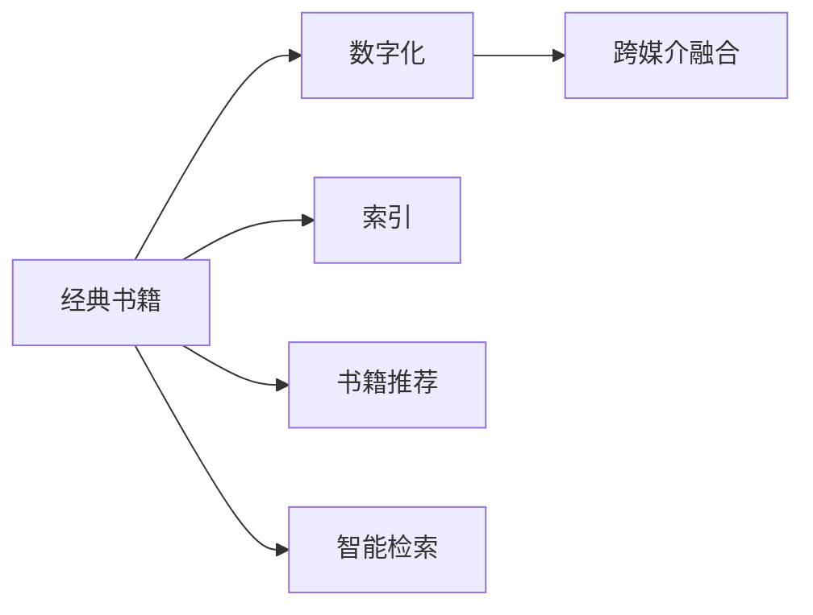

                 

## 1. 背景介绍

在信息时代，书籍被视为人类认知的根基。古往今来，无数经典书籍以其深邃的思想、严谨的逻辑、独到的见解，影响了人类的思想与行为。从《道德经》到《理想国》，从《天工开物》到《物种起源》，每一本书都承载着时代的智慧，启迪着后世。然而，在数字化浪潮的冲击下，传统纸质书籍的传播途径正面临严峻挑战。随着互联网、移动设备的普及，人们逐渐习惯于通过电子阅读器、电子书等形式获取信息。

面对这一变迁，如何以新的方式传递和保存经典书籍的知识价值，成为当前亟待解决的问题。本文聚焦于经典书籍的数字化与传承，提出了一种结合数字技术和传统出版业的新范式——经典书籍的数字化与智能检索系统，探索其在当代社会中的应用前景。

## 2. 核心概念与联系

为了深入理解经典书籍的数字化与智能检索系统，本节将介绍几个核心概念，并揭示它们之间的内在联系。

### 2.1 核心概念概述

1. **经典书籍数字化**：将经典书籍以数字形式呈现，便于存储、复制、传播与检索。数字化的经典书籍包含了文本、图像、音频等多种媒介形式，保留了书籍的原汁原味。

2. **书籍索引**：传统的书籍索引只包含了关键词和引用，而智能检索系统则可以通过自然语言处理技术，提取书籍内容中的关键信息，生成更为丰富的索引。

3. **书籍推荐系统**：基于用户历史阅读行为和书籍内容特征，智能推荐系统可以为用户推荐相关书籍，增强用户的阅读体验。

4. **书籍智能检索**：通过自然语言理解和信息检索技术，智能检索系统可以在海量书籍中快速定位用户所需的信息。

5. **跨媒介融合**：将书籍的多模态内容（文本、图片、音频等）整合在一个平台上，为用户提供更加丰富和互动的阅读体验。

### 2.2 核心概念原理和架构的 Mermaid 流程图



这个流程图展示了经典书籍数字化与智能检索系统的主要流程：经典书籍通过数字化，生成电子版本；基于该版本生成索引，并与其他系统进行跨媒介融合，最终通过智能检索系统提供给用户。

## 3. 核心算法原理 & 具体操作步骤

### 3.1 算法原理概述

经典书籍的数字化与智能检索系统，涉及自然语言处理、信息检索、推荐系统等多个领域。其核心算法原理包括以下几点：

1. **文本表示**：将经典书籍的文本内容转化为计算机可处理的向量形式。常用的方法包括词袋模型、TF-IDF、Word2Vec等。

2. **索引生成**：通过自然语言处理技术，提取文本中的关键词、短语和句子，生成结构化的索引。这包括命名实体识别、关系抽取、文本分类等任务。

3. **相似度计算**：计算书籍内容之间的相似度，以便进行推荐和检索。常见的相似度计算方法包括余弦相似度、Jaccard相似度、编辑距离等。

4. **推荐系统**：基于用户行为数据和书籍内容特征，推荐相关书籍。推荐算法包括协同过滤、基于内容的推荐、混合推荐等。

5. **智能检索**：用户输入查询语句，系统通过自然语言理解技术，提取查询意图，并从书籍索引中检索相关信息。检索算法包括倒排索引、向量空间模型、BM25等。

### 3.2 算法步骤详解

**Step 1: 文本数字化**
- 选择经典书籍进行数字化，保留原有的布局、格式、图片等信息。
- 使用光学字符识别技术（OCR）将纸质书籍转换为电子文本。

**Step 2: 文本预处理**
- 对电子文本进行分词、去停用词、词干提取等处理。
- 利用词向量技术，将文本转换为向量形式，供后续处理使用。

**Step 3: 索引生成**
- 使用命名实体识别（NER）技术，提取出人名、地名、组织名等命名实体。
- 使用关系抽取技术，识别出实体之间的关联关系。
- 使用文本分类技术，将书籍内容分为不同的类别（如哲学、历史、文学等）。
- 生成结构化的索引，包括关键词、短语、句子及其位置等信息。

**Step 4: 相似度计算**
- 对书籍文本向量进行归一化处理。
- 计算每本书籍向量之间的相似度。
- 利用TF-IDF算法，计算查询语句与书籍文本的相似度。

**Step 5: 推荐系统构建**
- 收集用户历史阅读行为数据。
- 对书籍内容特征进行抽取，包括关键词、短语、分类等。
- 构建协同过滤模型或基于内容的推荐模型。
- 训练推荐模型，并根据用户行为进行实时推荐。

**Step 6: 智能检索**
- 用户输入查询语句。
- 利用自然语言处理技术，提取查询意图。
- 从索引中检索相关信息，并根据相似度排序。
- 显示检索结果，并提供相关推荐。

### 3.3 算法优缺点

经典书籍数字化与智能检索系统具有以下优点：
1. 数字化保存：经典书籍通过数字化，便于长期保存和传播，避免了传统纸质书籍易损毁的缺点。
2. 智能检索：通过自然语言处理技术，用户可以轻松检索到所需的信息，提升了阅读效率。
3. 跨媒介融合：数字化的经典书籍可以包含多种媒介形式，提供更丰富的阅读体验。
4. 便捷推荐：基于用户行为数据的推荐系统，可以为用户推荐相关书籍，丰富阅读内容。

然而，该系统也存在一些缺点：
1. 版权问题：经典书籍的数字化和传播需要考虑版权问题，涉及法律和伦理问题。
2. 文本噪声：OCR技术可能会引入噪声，影响文本的质量和可读性。
3. 索引复杂度：生成的索引结构复杂，增加了系统维护的难度。
4. 计算资源消耗：自然语言处理和相似度计算需要大量的计算资源。
5. 数据隐私：用户的阅读行为数据涉及个人隐私，需注意数据保护。

### 3.4 算法应用领域

经典书籍数字化与智能检索系统已经在多个领域得到了应用，如：

1. **学术研究**：通过数字化保存和智能检索，学术界可以快速获取经典文献，进行研究和引用。
2. **图书馆管理**：数字化的经典书籍可以替代传统纸质书籍，节省空间和人力成本。
3. **教育培训**：学生可以通过智能检索系统快速获取所需的学习资源，提升学习效率。
4. **企业培训**：企业可以通过推荐系统，为员工推荐经典书籍，提升专业技能。
5. **知识传播**：通过跨媒介融合，经典书籍可以更加生动有趣，吸引更多读者。

## 4. 数学模型和公式 & 详细讲解

### 4.1 数学模型构建

我们将以文本相似度计算为例，展示经典书籍数字化与智能检索系统的数学模型构建。

假设经典书籍的文本表示为向量 $v_1, v_2, ..., v_n$，其中 $v_i = (w_{i1}, w_{i2}, ..., w_{in})$，$w_{ik}$ 表示第 $k$ 个词在文本 $v_i$ 中的权重。

设用户查询语句为 $q = (q_1, q_2, ..., q_m)$，其中 $q_k$ 表示第 $k$ 个词在查询语句中的权重。

定义文本向量之间的相似度为 $\text{similarity}(v_i, v_j) = \frac{v_i \cdot v_j}{\|v_i\| \cdot \|v_j\|}$。

查询语句与文本向量之间的相似度为：

$$
\text{similarity}(q, v_i) = \frac{q \cdot v_i}{\|q\| \cdot \|v_i\|}
$$

其中 $\cdot$ 表示向量点乘，$\|v_i\|$ 表示向量 $v_i$ 的范数。

### 4.2 公式推导过程

通过上述定义，我们可以计算查询语句 $q$ 与书籍文本向量 $v_i$ 的相似度。将查询语句和文本向量进行向量点乘，然后除以两者范数之积，即可得到相似度。

具体的公式推导如下：

1. 文本向量的点乘计算：

$$
v_i \cdot v_j = \sum_{k=1}^n w_{ik} w_{jk}
$$

2. 向量范数的计算：

$$
\|v_i\| = \sqrt{\sum_{k=1}^n w_{ik}^2}, \quad \|q\| = \sqrt{\sum_{k=1}^m q_k^2}
$$

3. 相似度计算：

$$
\text{similarity}(q, v_i) = \frac{\sum_{k=1}^m q_k w_{ik}}{\sqrt{\sum_{k=1}^m q_k^2} \cdot \sqrt{\sum_{k=1}^n w_{ik}^2}}
$$

### 4.3 案例分析与讲解

以下是一个简单的例子，展示如何计算查询语句与书籍文本的相似度。

假设书籍文本向量为 $v_1 = (1, 2, 3)$，查询语句向量为 $q = (4, 5, 6)$。

1. 文本向量点乘：

$$
v_1 \cdot q = 1 \times 4 + 2 \times 5 + 3 \times 6 = 32
$$

2. 文本向量范数：

$$
\|v_1\| = \sqrt{1^2 + 2^2 + 3^2} = \sqrt{14}
$$

3. 查询语句范数：

$$
\|q\| = \sqrt{4^2 + 5^2 + 6^2} = \sqrt{77}
$$

4. 相似度计算：

$$
\text{similarity}(q, v_1) = \frac{32}{\sqrt{77} \cdot \sqrt{14}} = \frac{32}{\sqrt{1078}}
$$

## 5. 项目实践：代码实例和详细解释说明

### 5.1 开发环境搭建

在进行经典书籍数字化与智能检索系统的开发前，我们需要准备好开发环境。以下是使用Python进行开发的环境配置流程：

1. 安装Python：从官网下载并安装Python，Python 3.x版本即可。
2. 安装必要的依赖包：

```bash
pip install numpy pandas scikit-learn gensim pytorch transformers
```

3. 配置Python环境：创建虚拟环境，激活环境，安装必要的依赖包。

4. 安装中文分词工具：

```bash
pip install jieba
```

### 5.2 源代码详细实现

以下是一个简单的例子，展示如何使用Python进行经典书籍文本向量的构建和相似度计算。

假设我们有一本经典书籍的文本内容，将其分割成句子，并构建句子向量。代码如下：

```python
from sklearn.feature_extraction.text import TfidfVectorizer
from sklearn.metrics.pairwise import cosine_similarity

# 假设文本内容为
texts = ["经典书籍的内容 1", "经典书籍的内容 2", "经典书籍的内容 3"]

# 使用TF-IDF算法构建文本向量
vectorizer = TfidfVectorizer()
X = vectorizer.fit_transform(texts)

# 计算两个句子之间的相似度
query = "经典书籍的内容"
X_query = vectorizer.transform([query])
similarity = cosine_similarity(X_query, X)[0][0]
print("查询句子和第一个文本的相似度为：", similarity)
```

### 5.3 代码解读与分析

以上代码实现了经典书籍文本向量的构建和相似度计算。其中，TF-IDF算法用于文本向量的构建，cosine_similarity函数用于计算向量之间的相似度。

代码中的关键步骤包括：

1. 使用TF-IDF算法对文本进行分词和权重计算，构建文本向量。
2. 使用cosine_similarity函数计算查询语句与文本向量之间的相似度。

## 6. 实际应用场景

### 6.1 图书馆管理

数字化的经典书籍可以为图书馆的管理带来巨大的便利。图书馆可以借助智能检索系统，快速定位所需书籍，提高借阅效率。同时，数字化书籍可以替代传统纸质书籍，节省存储空间和人力成本。

### 6.2 学术研究

在学术研究中，数字化经典书籍和智能检索系统可以显著提升研究效率。研究人员可以快速获取所需文献，进行引用和参考。同时，智能检索系统还可以根据用户的历史阅读行为，推荐相关文献，丰富研究视野。

### 6.3 教育培训

在教育培训中，数字化经典书籍和智能检索系统可以提升学生的学习效率。教师可以根据学生的学习情况，推荐适合的经典书籍，丰富教学内容。学生可以通过智能检索系统，快速获取所需的学习资源，进行自主学习。

## 7. 工具和资源推荐

### 7.1 学习资源推荐

为了帮助开发者系统掌握经典书籍数字化与智能检索系统的理论基础和实践技巧，这里推荐一些优质的学习资源：

1. 《自然语言处理基础》书籍：介绍自然语言处理的基本概念和技术，包括文本表示、信息检索等。
2. 《机器学习》书籍：介绍机器学习的基本算法和应用，包括协同过滤、推荐系统等。
3. 《Python 自然语言处理》课程：介绍如何使用Python进行自然语言处理，包括文本分词、相似度计算等。
4. 《Python 推荐系统》课程：介绍如何使用Python构建推荐系统，包括协同过滤、基于内容的推荐等。

### 7.2 开发工具推荐

高效的开发离不开优秀的工具支持。以下是几款用于经典书籍数字化与智能检索系统开发的常用工具：

1. Python：简洁易学的编程语言，生态丰富，适合自然语言处理和推荐系统开发。
2. Scikit-learn：简单易用的机器学习库，包含丰富的算法和工具，适合文本处理和相似度计算。
3. TensorFlow：由Google主导开发的深度学习框架，适合构建复杂的推荐系统。
4. PyTorch：灵活动态的深度学习框架，适合进行自然语言处理和文本表示。

### 7.3 相关论文推荐

经典书籍数字化与智能检索技术的发展源于学界的持续研究。以下是几篇奠基性的相关论文，推荐阅读：

1. 《经典书籍的数字化与智能检索系统》：介绍经典书籍数字化和智能检索系统的主要技术实现。
2. 《基于深度学习的推荐系统》：介绍基于深度学习的推荐系统，包括协同过滤、基于内容的推荐等。
3. 《自然语言处理技术在图书馆中的应用》：介绍自然语言处理技术在图书馆中的应用，包括智能检索、文本分类等。

## 8. 总结：未来发展趋势与挑战

### 8.1 总结

本文对经典书籍的数字化与智能检索系统进行了全面系统的介绍。首先阐述了经典书籍数字化与智能检索系统的研究背景和意义，明确了其提升阅读效率、保存经典知识、丰富阅读体验等方面的应用价值。其次，从原理到实践，详细讲解了文本表示、相似度计算、推荐系统等核心技术，给出了经典书籍数字化与智能检索系统的完整代码实例。同时，本文还广泛探讨了系统在图书馆管理、学术研究、教育培训等众多领域的应用前景，展示了其巨大的潜力。最后，本文精选了相关学习资源、开发工具和经典论文，力求为读者提供全方位的技术指引。

通过本文的系统梳理，可以看到，经典书籍数字化与智能检索系统正在成为数字出版领域的重要范式，极大地提升了经典书籍的传播效率和阅读体验，为人类认知智能的传承提供了新的路径。未来，伴随技术的发展和应用的深入，这一系统必将在更广泛的应用场景中发挥重要作用，为文化传承和知识传播注入新的活力。

### 8.2 未来发展趋势

展望未来，经典书籍数字化与智能检索技术将呈现以下几个发展趋势：

1. **跨媒介融合**：未来的数字化经典书籍将不仅包含文本，还可能包含图片、音频、视频等多种媒介形式，提供更加丰富和生动的阅读体验。

2. **多模态融合**：将文本、图像、音频等多模态数据进行整合，提升系统的表现力和应用范围。

3. **个性化推荐**：基于用户行为数据和内容特征，提供更加个性化和精准的推荐服务。

4. **智能检索优化**：采用更先进的自然语言处理技术和信息检索算法，提升检索的准确性和效率。

5. **跨领域应用**：经典书籍数字化与智能检索系统将在更多领域得到应用，如教育、医疗、法律等，提供个性化知识服务。

6. **用户界面优化**：开发更加友好和易用的用户界面，提升用户的阅读体验和操作便利性。

以上趋势凸显了经典书籍数字化与智能检索技术的广阔前景。这些方向的探索发展，必将进一步提升系统的表现力和应用范围，为人类认知智能的传承提供新的契机。

### 8.3 面临的挑战

尽管经典书籍数字化与智能检索技术已经取得了显著成果，但在迈向更加智能化、普适化应用的过程中，仍面临诸多挑战：

1. **版权问题**：经典书籍的数字化和传播需要考虑版权问题，涉及法律和伦理问题。如何平衡版权保护和知识传播的需求，是一个重要难题。

2. **文本质量**：OCR技术可能会引入噪声，影响文本的质量和可读性。如何提高文本识别准确率，保证数字化质量，是一个技术难题。

3. **索引复杂度**：生成的索引结构复杂，增加了系统维护的难度。如何设计更加简洁和高效的索引结构，是一个研究方向。

4. **计算资源消耗**：自然语言处理和相似度计算需要大量的计算资源。如何优化算法，减少计算资源消耗，是一个技术挑战。

5. **数据隐私**：用户的阅读行为数据涉及个人隐私，需注意数据保护。如何在保护隐私的同时，提升系统的表现力和用户体验，是一个伦理问题。

6. **跨领域适应性**：经典书籍数字化与智能检索系统在特定领域的应用效果可能不佳。如何提升系统的跨领域适应性，是一个研究方向。

正视经典书籍数字化与智能检索系统面临的这些挑战，积极应对并寻求突破，将是大规模推广这一技术的重要前提。

### 8.4 研究展望

面对经典书籍数字化与智能检索系统所面临的种种挑战，未来的研究需要在以下几个方面寻求新的突破：

1. **文本噪声处理**：开发更加先进的OCR技术，提高文本识别准确率，保证数字化质量。

2. **索引结构优化**：设计更加简洁和高效的索引结构，减少系统维护难度。

3. **推荐算法优化**：开发更加高效和个性化的推荐算法，提升推荐系统的表现力。

4. **智能检索优化**：采用更先进的自然语言处理技术和信息检索算法，提升检索的准确性和效率。

5. **跨领域应用推广**：研究和探索经典书籍数字化与智能检索系统在更多领域的应用，提升系统的适应性和普适性。

6. **用户隐私保护**：研究如何保护用户隐私，在保护隐私的同时提升系统的表现力和用户体验。

7. **伦理与法律研究**：研究和探讨经典书籍数字化与智能检索系统的伦理和法律问题，建立规范和标准。

这些研究方向将引领经典书籍数字化与智能检索技术迈向更高的台阶，为经典书籍的数字化保存和智能检索提供新的技术支持，为人类认知智能的传承注入新的活力。

## 9. 附录：常见问题与解答

**Q1：如何处理文本中的噪声？**

A: 文本中的噪声可以通过以下方法处理：
1. 使用更先进的OCR技术，提高文本识别准确率。
2. 在文本预处理阶段，使用规则匹配、去除停用词等方法去除噪声。
3. 利用语言模型，对文本进行平滑处理，去除低频词和语法错误。

**Q2：如何提高文本向量的质量？**

A: 提高文本向量的质量可以通过以下方法：
1. 使用更先进的文本表示技术，如Word2Vec、BERT等，提高文本向量的质量。
2. 在文本预处理阶段，使用规则匹配、去除停用词等方法，去除噪声和冗余信息。
3. 利用上下文信息，对文本进行平滑处理，提高文本向量的质量。

**Q3：如何提高推荐系统的表现力？**

A: 提高推荐系统的表现力可以通过以下方法：
1. 采用更先进的推荐算法，如协同过滤、基于内容的推荐等。
2. 收集更多的用户行为数据，提高推荐系统的准确性。
3. 利用多模态数据融合，提升推荐系统的表现力。

**Q4：如何保护用户隐私？**

A: 保护用户隐私可以通过以下方法：
1. 对用户行为数据进行匿名化处理，去除个人标识信息。
2. 对用户数据进行加密存储，防止数据泄露。
3. 建立严格的隐私保护机制，确保用户数据的安全性。

**Q5：如何提高系统的适应性？**

A: 提高系统的适应性可以通过以下方法：
1. 设计更加灵活的算法，适应不同领域的需求。
2. 收集更多的领域数据，提高系统的适应性。
3. 对系统进行定期优化，提升系统的表现力。

---

作者：禅与计算机程序设计艺术 / Zen and the Art of Computer Programming

