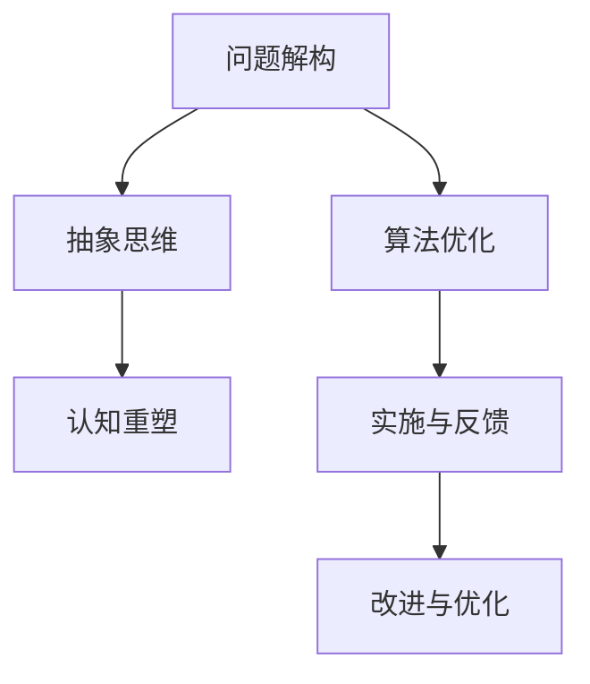
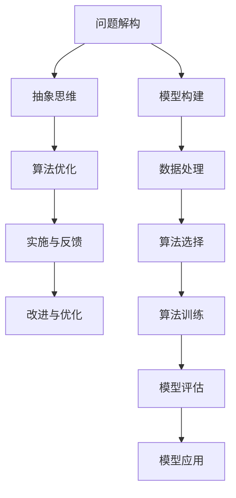

                 

# 结构化思维的力量：从思维到行动

> 关键词：结构化思维,认知重塑,问题解构,抽象思维,算法优化

## 1. 背景介绍

### 1.1 问题由来

在现代社会，随着信息量的爆炸性增长，问题解构和有效处理变得更加困难。现代科技的发展，以及日常生活中不断增加的信息复杂性，促使我们需要更有效的思维方式来应对。结构化思维（Structured Thinking），作为一种系统性、条理化的思考方式，成为解决问题的关键工具。

结构化思维强调明确的目标导向、系统的流程控制、严格的逻辑推理、动态的迭代优化，它能够帮助我们从混乱的思路中理出头绪，系统地分析和解决问题。在计算机科学、人工智能、决策科学等诸多领域，结构化思维都发挥着重要作用。

本文将全面系统地介绍结构化思维的概念、原理、操作方法，并通过丰富的案例和实例，阐述其在IT领域的实际应用。通过深入分析结构化思维的各个环节，探讨其在复杂问题解决中的优势，提出如何提升个人和组织的思维能力，以适应未来不断变化的科技发展和社会需求。

## 2. 核心概念与联系

### 2.1 核心概念概述

结构化思维是一种系统、有条理、有逻辑的思考方式，用于解决复杂问题。其核心概念主要包括：

- **问题解构**：将复杂问题拆解为更小的、可管理的部分，便于分析和解决。
- **抽象思维**：从具体情境中提炼出普遍规律和原则，形成一般性结论。
- **算法优化**：基于已有知识，选择并应用最优的解决方案，以提升问题解决的效率和效果。
- **认知重塑**：通过反复的实践和迭代，改变并优化个人或团队的认知模式，提升决策质量。

通过以下 Mermaid 流程图，我们可以更加直观地理解结构化思维各个环节之间的联系：



在这个流程图中，问题解构是起始环节，通过将问题拆解，使其变为可操作的小模块；抽象思维则帮助我们在这些小模块之间建立联系，找到共性规律；算法优化基于这些规律选择最优解决方案；认知重塑则通过不断的实践反馈，持续优化我们的思维方式。

### 2.2 核心概念原理和架构的 Mermaid 流程图



在上述流程图中，问题解构和抽象思维之后，进入模型构建和数据处理环节，选择和训练算法，然后通过模型评估和应用实施解决方案，并通过反馈持续改进和优化。

## 3. 核心算法原理 & 具体操作步骤

### 3.1 算法原理概述

结构化思维的核心算法原理可以概括为三个步骤：

1. **问题解构**：将问题拆分为小模块，形成独立的部分，便于管理和解决。
2. **算法优化**：在已有知识的基础上，选择和应用最优算法，以提升问题解决的效率和效果。
3. **认知重塑**：通过不断实践和反馈，调整和优化个人的思维方式。

这些步骤相互配合，形成一个循环往复的过程，不断迭代优化，以达成最终的问题解决目标。

### 3.2 算法步骤详解

#### 3.2.1 问题解构

**步骤 1: 明确目标**  
定义问题需要达成的最终目标，确保目标明确、具体、可衡量。

**步骤 2: 分解问题**  
将问题拆分为更小的子问题，每个子问题应独立可控，便于分析和解决。例如，可以采用鱼骨图（Ishikawa Diagram）或树状图（Tree Diagram）来分解问题。

**步骤 3: 识别关键要素**  
分析每个子问题涉及的关键要素，确保问题解构的完整性和准确性。

**步骤 4: 确认依赖关系**  
识别各子问题之间的依赖关系，确保问题解构的逻辑顺序合理。

#### 3.2.2 算法优化

**步骤 1: 收集数据**  
基于问题解构的结果，收集相关数据，为算法优化提供输入。

**步骤 2: 建立模型**  
选择合适的模型，用于描述问题与数据之间的关系。

**步骤 3: 训练模型**  
使用数据训练模型，优化参数，提高模型的准确性和鲁棒性。

**步骤 4: 模型评估**  
通过验证集或测试集评估模型性能，确保模型具有泛化能力。

**步骤 5: 选择算法**  
根据问题特点和模型表现，选择最适合的算法。

#### 3.2.3 认知重塑

**步骤 1: 反思与总结**  
回顾问题解决过程，总结经验教训。

**步骤 2: 反馈与迭代**  
根据反思结果，调整问题解构和算法选择策略，进行迭代优化。

**步骤 3: 知识积累**  
将问题解构和算法优化的过程记录下来，形成知识库，供未来参考。

**步骤 4: 实践与测试**  
将优化后的解决方案应用于实际问题，进行测试和验证。

**步骤 5: 持续改进**  
根据测试结果，不断调整和优化算法，提升解决方案的效率和效果。

### 3.3 算法优缺点

结构化思维算法的主要优点包括：

- **系统性**：将问题分解为小模块，便于管理和解决。
- **逻辑性**：基于逻辑推理和数据驱动，提升解决方案的准确性。
- **可操作性**：每个子问题独立可控，便于实施和调整。

其主要缺点包括：

- **复杂性**：问题解构和算法选择过程较为复杂，需要较高的专业知识和经验。
- **灵活性不足**：对于非结构化问题，可能需要先进行结构化处理。

### 3.4 算法应用领域

结构化思维算法在多个领域都有广泛应用，包括但不限于：

- **软件开发**：用于需求分析、设计、测试和维护，确保软件质量和效率。
- **项目管理**：用于计划、执行、监控和收尾，确保项目按期完成。
- **金融分析**：用于风险评估、投资决策、市场分析等，提升金融决策的准确性。
- **医疗诊断**：用于病情诊断、治疗方案选择、药物研发等，提升医疗服务的精准度。
- **人工智能**：用于问题解构、算法优化、认知重塑，提升AI模型的性能和效率。

## 4. 数学模型和公式 & 详细讲解 & 举例说明

### 4.1 数学模型构建

结构化思维算法的数学模型可以概括为以下步骤：

1. **问题定义**：定义问题的目标函数，用数学表达式表示。
2. **变量定义**：定义问题涉及的变量及其取值范围。
3. **约束条件**：定义问题解决的约束条件，如资源限制、时间限制等。
4. **优化目标**：定义优化的目标，如最小化成本、最大化收益等。

以一个简单的线性回归问题为例，问题定义如下：

$$
\min_{\beta} \sum_{i=1}^{n} (y_i - \beta_0 - \beta_1 x_i)^2
$$

其中，$y_i$ 为观测值，$x_i$ 为自变量，$\beta_0$ 和 $\beta_1$ 为回归系数，$n$ 为样本数量。

### 4.2 公式推导过程

线性回归模型的推导过程如下：

1. **假设模型**  
假设回归模型为线性函数：$y_i = \beta_0 + \beta_1 x_i + \epsilon_i$，其中 $\epsilon_i$ 为误差项。

2. **最小二乘法**  
最小化误差平方和，得到线性回归方程的系数：

$$
\beta = \left(\sum_{i=1}^{n} x_i x_i^T\right)^{-1} \sum_{i=1}^{n} x_i y_i
$$

3. **误差项估计**  
利用训练数据集进行误差项估计，得到残差平方和：

$$
\sum_{i=1}^{n} (y_i - \hat{y}_i)^2 = \sum_{i=1}^{n} (y_i - \beta_0 - \beta_1 x_i)^2
$$

4. **模型验证**  
使用验证集或测试集评估模型性能，得到模型误差：

$$
R^2 = 1 - \frac{\sum_{i=1}^{n} (y_i - \hat{y}_i)^2}{\sum_{i=1}^{n} (y_i - \bar{y})^2}
$$

### 4.3 案例分析与讲解

以线性回归为例，我们通过一个简单的案例，说明结构化思维算法在实际应用中的操作过程：

**案例：房价预测**

- **问题定义**：给定房屋特征数据（如面积、房间数、位置等），预测其销售价格。
- **变量定义**：$x_i$ 表示房屋特征向量，$y_i$ 表示销售价格。
- **约束条件**：数据必须完整、无缺失，模型必须具有泛化能力。
- **优化目标**：最小化预测误差，即最小化 $R^2$ 值。

**步骤 1: 数据预处理**  
使用归一化、标准化等方法处理数据，确保数据具有相同量级。

**步骤 2: 问题解构**  
将房价预测问题分解为特征选择、模型训练、误差评估等子问题。

**步骤 3: 算法选择**  
选择线性回归模型，利用梯度下降算法训练模型。

**步骤 4: 模型评估**  
使用验证集评估模型性能，确保模型具有泛化能力。

**步骤 5: 认知重塑**  
根据评估结果，调整特征选择策略和模型参数，优化模型性能。

## 5. 项目实践：代码实例和详细解释说明

### 5.1 开发环境搭建

为了进行结构化思维算法的实践，我们需要搭建一个开发环境。以下是具体的步骤：

1. **安装 Python**：使用 Python 3.8 及以上版本，确保所有必要的库都能正常运行。

2. **安装机器学习库**：安装 Scikit-learn、Pandas、NumPy 等机器学习库。

3. **安装可视化库**：安装 Matplotlib、Seaborn、Plotly 等可视化库。

4. **安装数据集**：安装常用的数据集，如 Iris、Boston Housing、CIFAR-10 等。

### 5.2 源代码详细实现

以下是使用 Scikit-learn 实现线性回归的代码：

```python
from sklearn.linear_model import LinearRegression
from sklearn.model_selection import train_test_split
from sklearn.metrics import r2_score
import numpy as np
import pandas as pd

# 读取数据集
data = pd.read_csv('housing.csv')

# 数据预处理
X = data[['CRIM', 'ZN', 'INDUS', 'CHAS', 'NOX', 'RM', 'AGE', 'DIS', 'RAD', 'TAX', 'PTRATIO', 'B', 'LSTAT']]
y = data['MEDV']

# 划分训练集和测试集
X_train, X_test, y_train, y_test = train_test_split(X, y, test_size=0.2, random_state=42)

# 训练模型
model = LinearRegression()
model.fit(X_train, y_train)

# 预测测试集
y_pred = model.predict(X_test)

# 评估模型
score = r2_score(y_test, y_pred)
print(f"R^2 Score: {score}")
```

### 5.3 代码解读与分析

上述代码实现了线性回归模型的训练、预测和评估过程，具体如下：

- `train_test_split` 用于将数据集划分为训练集和测试集，便于模型训练和评估。
- `LinearRegression` 用于实现线性回归模型。
- `r2_score` 用于计算 R^2 值，评估模型性能。

## 6. 实际应用场景

### 6.1 软件开发

在软件开发中，结构化思维算法用于需求分析、设计、测试和维护。例如，软件需求说明书（Software Requirements Specification, SRS）中的用例图（Use Case Diagram）即是一种结构化思维的工具，帮助开发者理解系统功能和需求。

**案例：电商平台搜索算法**

- **问题定义**：电商平台需要高效、准确地搜索商品。
- **变量定义**：搜索关键词、商品类别、用户偏好等。
- **约束条件**：搜索速度必须快，搜索结果必须相关。
- **优化目标**：最大化用户体验，即最小化点击率和跳出率。

**步骤 1: 数据收集**  
收集用户搜索记录、商品数据等。

**步骤 2: 问题解构**  
将搜索算法分解为搜索索引、推荐算法、排序策略等子问题。

**步骤 3: 算法选择**  
选择基于TF-IDF（Term Frequency-Inverse Document Frequency）的检索算法。

**步骤 4: 模型训练**  
使用训练数据集训练检索算法，优化模型参数。

**步骤 5: 认知重塑**  
根据用户反馈，调整检索算法和推荐策略，优化搜索效果。

### 6.2 项目管理

在项目管理中，结构化思维算法用于计划、执行、监控和收尾。例如，项目管理软件中的甘特图（Gantt Chart）即是一种结构化思维的工具，帮助项目经理可视化项目进度和资源分配。

**案例：软件开发项目**

- **问题定义**：按时、按质、按预算完成软件开发项目。
- **变量定义**：任务、时间、资源、成本等。
- **约束条件**：时间、成本限制。
- **优化目标**：最小化项目延迟和成本超支。

**步骤 1: 数据收集**  
收集项目进度、资源使用情况等。

**步骤 2: 问题解构**  
将项目管理分解为任务分配、进度跟踪、资源管理等子问题。

**步骤 3: 算法选择**  
选择基于关键路径（Critical Path Method, CPM）或网络规划（Network Planning）的工具。

**步骤 4: 模型训练**  
使用历史数据训练模型，预测项目进度和资源需求。

**步骤 5: 认知重塑**  
根据项目进展，调整任务分配和资源分配策略，优化项目管理效果。

### 6.3 金融分析

在金融分析中，结构化思维算法用于风险评估、投资决策、市场分析等。例如，金融风险管理软件中的VaR模型（Value at Risk）即是一种结构化思维的工具，帮助金融机构评估潜在风险。

**案例：金融风险评估**

- **问题定义**：评估某金融产品的风险水平。
- **变量定义**：价格波动、交易量、市场环境等。
- **约束条件**：风险评估必须准确、及时。
- **优化目标**：最小化风险损失。

**步骤 1: 数据收集**  
收集金融市场数据、交易记录等。

**步骤 2: 问题解构**  
将风险评估分解为风险因子分析、模型选择、风险计算等子问题。

**步骤 3: 算法选择**  
选择基于历史数据的统计模型，如VaR模型。

**步骤 4: 模型训练**  
使用历史数据训练模型，预测风险水平。

**步骤 5: 认知重塑**  
根据市场变化，调整模型参数和风险管理策略，优化风险评估效果。

### 6.4 未来应用展望

未来，结构化思维算法将在更多领域得到应用，为各个行业带来变革性影响。例如：

- **医疗诊断**：用于疾病诊断、治疗方案选择、药物研发等，提升医疗服务的精准度。
- **物流管理**：用于路线规划、库存管理、配送优化等，提升物流效率和成本效益。
- **智能制造**：用于生产计划、质量控制、设备维护等，提升制造企业的生产效率和产品质量。
- **环境保护**：用于环境监测、污染控制、生态恢复等，提升环境保护效果。

## 7. 工具和资源推荐

### 7.1 学习资源推荐

为了帮助开发者系统掌握结构化思维算法，这里推荐一些优质的学习资源：

1. **《结构化思维》书籍**：该书系统介绍了结构化思维的概念、原理、操作步骤，是结构化思维算法的入门经典。

2. **Coursera《问题解决与创造性思维》课程**：由斯坦福大学开设的课程，通过案例讲解和实操训练，帮助学员提升结构化思维能力。

3. **Udacity《数据科学导论》课程**：介绍了数据科学和机器学习的基本概念和算法，并结合实际案例进行讲解。

4. **Kaggle竞赛**：Kaggle平台上丰富的数据集和竞赛，可以帮助开发者实战练习结构化思维算法。

5. **Structured Thinking 博客**：深入探讨结构化思维算法的原理和应用，是结构化思维算法的权威来源之一。

通过这些学习资源，相信你一定能够快速掌握结构化思维算法，并用于解决实际的IT问题。

### 7.2 开发工具推荐

高效的工具支持是实现结构化思维算法的重要保障。以下是几款常用的开发工具：

1. **Jupyter Notebook**：免费的开源笔记本，支持Python、R、Julia等编程语言，提供丰富的代码编写和数据可视化功能。

2. **Visual Studio Code**：功能强大的代码编辑器，支持多种编程语言和开发框架。

3. **PyCharm**：专业的Python开发工具，提供了强大的代码分析和调试功能。

4. **GitLab**：流行的代码托管平台，支持项目管理、版本控制、协作开发等功能。

5. **TensorFlow**：由Google开发的深度学习框架，支持多种算法和模型，提供高效的机器学习开发环境。

合理利用这些工具，可以显著提升结构化思维算法的开发效率，加速创新迭代的步伐。

### 7.3 相关论文推荐

结构化思维算法的理论基础来源于许多经典的研究论文，以下是几篇奠基性的相关论文，推荐阅读：

1. **《Structured Problem Solving in Natural Language Processing》**  
该论文系统介绍了自然语言处理中的结构化问题求解方法，是结构化思维算法的早期研究。

2. **《Structured Thinking: A Survey and Future Directions》**  
该论文总结了结构化思维算法的研究成果，并展望了未来的研究方向。

3. **《A Comparative Study of Algorithmic Approaches for Problem Solving》**  
该论文比较了不同算法在问题求解中的表现，为结构化思维算法提供了理论支持。

4. **《Design Patterns: Elements of Reusable Object-Oriented Software》**  
该书介绍了软件设计中的经典模式，为结构化思维算法的应用提供了指导。

这些论文代表了大规模语言模型微调技术的发展脉络。通过学习这些前沿成果，可以帮助研究者把握学科前进方向，激发更多的创新灵感。

## 8. 总结：未来发展趋势与挑战

### 8.1 总结

本文对结构化思维算法的概念、原理、操作步骤进行了全面系统的介绍。首先阐述了结构化思维算法的研究背景和意义，明确了结构化思维在各个IT领域中的应用价值。其次，从原理到实践，详细讲解了结构化思维算法的数学原理和操作步骤，并通过丰富的案例和实例，阐述了其在IT领域的实际应用。最后，本文通过分析结构化思维算法的优缺点和未来发展趋势，探讨了其在复杂问题解决中的优势，提出如何提升个人和组织的思维能力，以适应未来不断变化的科技发展和社会需求。

通过本文的系统梳理，可以看到，结构化思维算法在各个IT领域中具有广泛的应用前景，能够显著提升问题和决策的解决效率和效果。未来，随着结构化思维算法的不断优化和创新，其应用范围和影响力将进一步扩大，为人工智能技术的发展和落地提供有力支持。

### 8.2 未来发展趋势

展望未来，结构化思维算法将呈现以下几个发展趋势：

1. **自动化与智能化**  
结构化思维算法将与人工智能技术结合，实现自动化的知识提取、推理和决策，提升问题解决的效率和效果。

2. **多模态融合**  
结构化思维算法将与视觉、语音、文本等多模态数据结合，形成更加全面、精确的问题解决方案。

3. **泛化能力增强**  
结构化思维算法将在更大规模、更复杂的问题中得到应用，增强其泛化能力和适应性。

4. **认知支持系统**  
结构化思维算法将与认知支持系统结合，提升决策者的认知能力和问题解决效率。

5. **跨学科应用**  
结构化思维算法将在更多领域得到应用，如医疗、金融、物流等，为各行各业带来变革性影响。

这些趋势展示了结构化思维算法的广阔前景，预示着其在复杂问题解决中的重要作用和潜力。

### 8.3 面临的挑战

尽管结构化思维算法已经取得了显著成果，但在实现大规模应用的过程中，仍然面临诸多挑战：

1. **数据质量和数量**  
结构化思维算法依赖高质量的数据，数据质量和数量不足可能导致算法效果不佳。

2. **算法复杂度**  
结构化思维算法涉及复杂的数学和编程技术，对算法实现要求较高。

3. **人机交互**  
结构化思维算法需要与人类进行交互，如何实现高效、自然的交互，还需进一步优化。

4. **系统集成**  
结构化思维算法需要与其他系统集成，如何实现无缝集成和协同工作，还需要不断探索。

5. **可解释性**  
结构化思维算法作为“黑盒”系统，其决策过程缺乏可解释性，需要开发可解释性高的算法和工具。

这些挑战需要研究者不断探索和解决，才能将结构化思维算法推广到实际应用中，实现其广泛应用。

### 8.4 研究展望

未来，结构化思维算法的研究方向包括：

1. **自动化算法**  
研究自动化的结构化思维算法，提升算法的效率和效果。

2. **多模态融合算法**  
研究多模态数据融合的算法，增强算法的全面性和精确性。

3. **认知支持系统**  
研究认知支持系统的设计，提升决策者的认知能力。

4. **跨学科应用**  
研究结构化思维算法在更多领域的应用，推动技术在各行各业的落地。

5. **可解释性算法**  
研究可解释性高的结构化思维算法，增强算法的透明性和可信度。

这些研究方向将推动结构化思维算法的不断发展和优化，使其更好地服务于各个领域的决策和问题解决。

## 9. 附录：常见问题与解答

**Q1：结构化思维算法是否适用于所有问题？**

A: 结构化思维算法适用于大多数复杂问题，尤其是可以明确目标、分解为子问题、具有逻辑性和可操作性的问题。但对于过于简单或过于复杂的问题，可能需要进行一定的调整或优化。

**Q2：结构化思维算法是否需要编程技能？**

A: 结构化思维算法需要一定的编程技能，但并非要求非常高。通常可以使用Python等易学的编程语言，结合开源工具和库，进行高效的算法实现。

**Q3：如何提升结构化思维能力？**

A: 提升结构化思维能力需要不断实践和反思。可以通过阅读经典书籍、参加培训课程、实战练习等方式，不断积累经验和技能。

**Q4：结构化思维算法能否应用于多模态数据？**

A: 结构化思维算法可以应用于多模态数据，但需要结合不同模态数据的特征，进行适当的算法选择和调整。例如，可以结合视觉、语音、文本等数据，形成更加全面、精确的问题解决方案。

**Q5：结构化思维算法是否需要大量数据？**

A: 结构化思维算法需要一定的数据量支持，但并不需要大规模的数据集。通过合理的模型选择和算法优化，可以在较小规模的数据集上取得不错的效果。

通过本文的系统介绍和实践，相信你一定能够掌握结构化思维算法的精髓，并用于解决实际的IT问题。未来，随着结构化思维算法的不断发展和优化，其应用范围和影响力将进一步扩大，为人工智能技术的发展和落地提供有力支持。

---

作者：禅与计算机程序设计艺术 / Zen and the Art of Computer Programming

