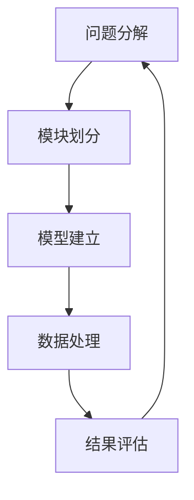

                 

## 1. 背景介绍

### 1.1 问题由来

在现代科技飞速发展的今天，人们接触的信息量和处理问题的复杂度日益增加。无论是IT行业还是日常生活中，面对海量数据和复杂问题，如何有效提取信息，快速做出决策，已成为提高生产力和效率的关键。这一挑战催生了结构化思维的兴起，成为解决问题、提升决策效率的重要工具。结构化思维的本质是将复杂问题分解成更小、更易于管理的子问题，通过系统化的分析和处理，达到从混沌到清晰、从复杂到简单的目标。

### 1.2 问题核心关键点

结构化思维的核心在于分解和重构问题，通过明确目标、划分模块、建立模型等方式，将复杂问题简化为可操作的小任务。在实际应用中，结构化思维可以帮助我们：
- 快速定位问题根源
- 制定可执行的解决方案
- 提升决策的准确性和效率
- 改善团队协作和沟通

本博客将深入探讨结构化思维的原理、操作步骤和实际应用，希望能为读者提供系统性的理解和指导，使更多人掌握这一利器，提升自身在复杂问题处理中的能力。

## 2. 核心概念与联系

### 2.1 核心概念概述

结构化思维是一种系统化、逻辑化的思维方式，旨在通过将复杂问题分解为更小、更可管理的子问题，逐步解决问题。这一过程涉及多个核心概念，包括问题分解、模块划分、模型建立、数据处理、结果评估等。这些概念相互关联，共同构成了结构化思维的完整框架。

- **问题分解(Problem Decomposition)**：将大问题拆解为小问题，便于逐个攻关。
- **模块划分(Module Segmentation)**：将问题进一步细化为若干模块，每个模块专注于特定领域或功能。
- **模型建立(Model Construction)**：使用数学或逻辑模型描述问题本质，形成解决问题的思路。
- **数据处理(Data Processing)**：收集、整理、清洗数据，为模型训练和分析提供支撑。
- **结果评估(Result Evaluation)**：通过测试和反馈，不断优化解决方案，确保问题解决的有效性。

这些核心概念之间的联系可以通过以下Mermaid流程图来展示：



这个流程图展示了结构化思维的流程：首先，将大问题分解为小问题；然后，将问题模块化，形成可管理的子任务；接着，使用模型描述问题本质；数据处理为模型训练和分析提供基础；最后，通过结果评估反馈优化。通过这一流程，可以逐步解决问题，实现从混沌到清晰的目标。

## 3. 核心算法原理 & 具体操作步骤
### 3.1 算法原理概述

结构化思维的算法原理本质上是通过逻辑和数学模型对复杂问题进行建模和分析，从而找到解决方案。这一过程涉及多个步骤，包括问题描述、模块划分、模型选择、数据准备、模型训练和结果验证等。每个步骤都有明确的数学公式和算法支持，确保问题的解析和解决过程具有高度的逻辑性和可操作性。

### 3.2 算法步骤详解

#### 3.2.1 问题描述(Problem Specification)

问题描述是结构化思维的第一步，即明确问题的本质和目标。这一步骤通常包括以下内容：
- 定义问题的范围和边界
- 确定问题的核心指标和约束条件
- 列出问题的主要假设和前提

问题描述可以形式化为一个函数 $f(x, y)$，其中 $x$ 表示问题输入，$y$ 表示问题输出。例如，对于一个电子商务网站的用户流失问题，可以定义如下：

$$ f(\text{网站}, \text{用户}, \text{时间}) = \text{流失率} $$

表示在给定时间和输入的条件下，网站的流失率。

#### 3.2.2 模块划分(Module Segmentation)

模块划分是将大问题拆解为可管理的小模块。这一步骤的目的是为了更好地理解和处理问题。通常，模块划分采用自顶向下的方式，逐步细化问题的各个部分。例如，对于一个电商网站的用户流失问题，可以将其分解为以下模块：

1. **用户行为分析模块**：分析用户在网站上的行为数据，如点击次数、停留时间、购物路径等。
2. **用户特征提取模块**：提取用户的基本特征，如年龄、性别、地理位置等。
3. **流失预测模型模块**：基于历史数据训练模型，预测用户是否会流失。
4. **流失干预策略模块**：根据预测结果，制定针对性的干预措施。

#### 3.2.3 模型选择(Model Selection)

模型选择是指根据问题的特点和需求，选择合适的数学或逻辑模型。常用的模型包括回归模型、分类模型、聚类模型等。例如，对于电商网站的用户流失预测问题，可以选择逻辑回归模型，构建如下函数：

$$ f(\text{用户}, \text{特征}, \text{时间}) = \text{流失概率} $$

表示在给定用户特征和时间的情况下，用户流失的概率。

#### 3.2.4 数据准备(Data Preparation)

数据准备是构建模型的重要步骤，包括数据收集、清洗和预处理。这一步骤确保数据的准确性和完整性，为模型训练提供可靠的输入。例如，对于用户行为分析模块，需要收集和清洗用户的行为数据，如点击记录、购买记录、搜索记录等。

#### 3.2.5 模型训练(Model Training)

模型训练是使用数据训练模型的过程，目标是找到最优的模型参数。常用的算法包括梯度下降、随机梯度下降、Adagrad等。以电商网站用户流失预测为例，使用历史数据训练逻辑回归模型，优化模型参数，使其能够更好地预测用户流失概率。

#### 3.2.6 结果验证(Result Validation)

结果验证是评估模型性能和准确性的过程，包括交叉验证、测试集验证等。例如，使用交叉验证方法评估逻辑回归模型在用户流失预测上的表现，确保模型的泛化能力。

### 3.3 算法优缺点

结构化思维的算法具有以下优点：
- 系统性：通过分解问题，使问题更易于管理和解决。
- 可操作性：每个步骤都有明确的数学和算法支持，操作性强。
- 可扩展性：模块化设计，便于扩展和调整。

同时，结构化思维也存在以下缺点：
- 步骤繁琐：需要经过多个步骤才能完成问题解决，过程较为复杂。
- 灵活性不足：模块划分和模型选择可能受限于问题的复杂度和数据量。
- 计算资源需求高：模型训练和验证需要大量计算资源，尤其是面对大规模数据集时。

### 3.4 算法应用领域

结构化思维在多个领域得到了广泛应用，包括但不限于：
- 工程设计：使用模块化设计解决复杂的产品设计问题。
- 项目管理：通过任务分解和进度跟踪，优化项目执行效率。
- 金融分析：使用回归和分类模型分析市场趋势，制定投资策略。
- 医疗诊断：利用数据分析和模型预测，提高疾病诊断的准确性。
- 环境监测：通过模型建立和数据处理，预测环境变化趋势，制定应对措施。

## 4. 数学模型和公式 & 详细讲解
### 4.1 数学模型构建

结构化思维的数学模型通常包含以下几部分：
- 问题描述：定义问题的输入和输出，形式化表达问题。
- 模型建立：选择合适的数学模型，描述问题的本质。
- 数据处理：收集、清洗和预处理数据，为模型训练提供输入。
- 模型训练：使用数据训练模型，找到最优的参数。
- 结果评估：通过测试和反馈，评估模型的性能。

以电商网站用户流失预测为例，构建如下数学模型：

$$ f(\text{用户}, \text{特征}, \text{时间}) = \text{流失概率} $$

其中，$\text{用户}$ 表示用户数据，$\text{特征}$ 表示用户特征，$\text{时间}$ 表示时间戳。

### 4.2 公式推导过程

以电商网站用户流失预测为例，推导逻辑回归模型的损失函数：

$$ L(\theta) = -\frac{1}{N}\sum_{i=1}^N [y_i \log p_i + (1-y_i) \log(1-p_i)] $$

其中，$\theta$ 表示模型参数，$y_i$ 表示标签（流失或未流失），$p_i$ 表示模型预测的流失概率。

#### 4.2.1 假设
- 假设 $y_i \in \{0, 1\}$，表示用户是否流失。
- 假设 $p_i$ 表示用户流失的概率，可以由逻辑回归模型预测。

#### 4.2.2 目标
- 目标是最小化损失函数 $L(\theta)$，即找到最优的模型参数 $\theta$。

#### 4.2.3 推导
- 使用对数似然损失函数，表达模型的预测与实际标签的差异。
- 最小化目标函数，通过梯度下降等算法更新参数 $\theta$。

### 4.3 案例分析与讲解

以电商网站用户流失预测为例，进行详细讲解：
- **问题描述**：电商网站用户流失预测。
- **数据准备**：收集用户行为数据，如点击次数、购买记录、搜索记录等。
- **模型选择**：选择逻辑回归模型，构建预测流失概率的模型。
- **模型训练**：使用历史数据训练模型，优化模型参数。
- **结果验证**：使用测试集验证模型性能，评估预测准确性。

## 5. 项目实践：代码实例和详细解释说明
### 5.1 开发环境搭建

进行结构化思维项目实践，需要准备以下开发环境：
- Python 3.7及以上版本，推荐使用 Anaconda 进行环境管理。
- 安装常用的 Python 库，如 NumPy、Pandas、Matplotlib、Scikit-learn 等。
- 安装机器学习框架，如 TensorFlow、PyTorch 等，根据项目需求选择。

### 5.2 源代码详细实现

以下是一个电商网站用户流失预测的 Python 代码实现，包括数据处理、模型训练和结果评估：

```python
import numpy as np
from sklearn.linear_model import LogisticRegression
from sklearn.model_selection import train_test_split
from sklearn.metrics import accuracy_score

# 准备数据
X = pd.read_csv('user_behavior.csv')
y = pd.read_csv('user_churn.csv')

# 数据预处理
X_train, X_test, y_train, y_test = train_test_split(X, y, test_size=0.2)

# 模型训练
model = LogisticRegression()
model.fit(X_train, y_train)

# 结果验证
y_pred = model.predict(X_test)
accuracy = accuracy_score(y_test, y_pred)
print(f'Accuracy: {accuracy}')
```

### 5.3 代码解读与分析

**数据准备**：使用 Pandas 库读取用户行为数据和流失标签，进行初步的数据清洗和处理。

**模型训练**：使用 Scikit-learn 库中的 LogisticRegression 模型进行用户流失预测，训练模型参数。

**结果验证**：使用准确率评估模型的预测性能，输出结果。

## 6. 实际应用场景

### 6.1 工程设计

结构化思维在工程设计中的应用主要体现在模块化设计和流程优化上。例如，汽车设计的复杂性要求工程师将大问题分解为多个子问题，如底盘设计、发动机设计、内饰设计等，每个子问题可以独立设计和优化。通过结构化思维，工程师能够更好地理解和处理复杂设计问题，提高设计效率和质量。

### 6.2 项目管理

项目管理是结构化思维的重要应用场景，通过任务分解和进度跟踪，能够更好地管理和控制项目执行。例如，软件开发项目可以使用结构化思维，将项目分解为需求分析、系统设计、编码实现、测试等模块，每个模块有明确的目标和负责人，确保项目按时高质量完成。

### 6.3 金融分析

金融分析需要处理大量复杂的数据和模型，结构化思维能够帮助分析师更好地理解和处理数据。例如，使用回归和分类模型分析市场趋势，制定投资策略。通过结构化思维，分析师能够将复杂问题分解为可管理的小模块，逐步解决问题，提高分析的准确性和效率。

### 6.4 医疗诊断

医疗诊断需要处理大量的医学数据和患者信息，结构化思维能够帮助医生更好地理解和处理这些数据。例如，使用数据分析和模型预测，提高疾病诊断的准确性。通过结构化思维，医生能够将复杂的诊断问题分解为可管理的小模块，逐步解决问题，提高诊断的精确度和效率。

### 6.5 环境监测

环境监测需要处理大量复杂的环境数据，结构化思维能够帮助环保专家更好地理解和处理这些数据。例如，使用模型建立和数据处理，预测环境变化趋势，制定应对措施。通过结构化思维，专家能够将复杂的环境监测问题分解为可管理的小模块，逐步解决问题，提高监测的准确性和效率。

## 7. 工具和资源推荐

### 7.1 学习资源推荐

1. 《结构化思维导论》：一本介绍结构化思维的入门书籍，适合初学者阅读。
2. 《系统思考与结构化思维》：一本深入探讨结构化思维原理的书籍，适合进阶读者。
3. Coursera 和 edX 上的相关课程，如 "Structured Thinking in Problem Solving"。
4. 博客和论坛，如 Medium 和 GitHub，搜索相关的结构化思维实践案例。

### 7.2 开发工具推荐

1. Jupyter Notebook：一个交互式开发环境，支持代码编辑、执行和结果展示。
2. Anaconda：一个数据科学和机器学习环境，支持多种 Python 库和框架的安装和管理。
3. TensorBoard：一个可视化工具，用于监控模型训练过程中的各项指标，方便调试和优化。
4. Weights & Biases：一个实验跟踪工具，记录和可视化模型训练和验证结果，便于比较和优化。

### 7.3 相关论文推荐

1. "Structured Thinking: A Framework for Problem Solving"：一篇介绍结构化思维的学术论文，详细探讨了其理论基础和实践应用。
2. "Decomposing Complex Problems for Efficient Problem-Solving"：一篇探讨问题分解和模块化设计的学术论文，为结构化思维提供了理论支持。
3. "Applying Structured Thinking in Software Development"：一篇介绍结构化思维在软件开发中的应用案例，提供了实用的实践经验。
4. "Structured Thinking in Financial Analysis"：一篇探讨结构化思维在金融分析中的应用案例，提供了详细的分析方法和工具。

## 8. 总结：未来发展趋势与挑战

### 8.1 研究成果总结

结构化思维作为一种系统化、逻辑化的思维方式，在多个领域得到了广泛应用，帮助人们更好地理解和处理复杂问题。其核心在于通过问题分解、模块划分、模型建立、数据处理和结果评估等步骤，逐步解决问题，实现从混沌到清晰、从复杂到简单的目标。

### 8.2 未来发展趋势

未来，结构化思维将在以下方面持续发展：
- 更广泛的应用场景：结构化思维的应用范围将进一步扩大，涵盖更多行业和领域。
- 更高效的算法：新的算法和工具将不断涌现，提高结构化思维的效率和精度。
- 更智能的模型：深度学习和人工智能技术的结合，将使结构化思维更加智能和高效。

### 8.3 面临的挑战

尽管结构化思维具有诸多优点，但在应用过程中仍面临以下挑战：
- 复杂问题处理：面对更复杂和更抽象的问题，结构化思维需要更高的理论水平和实践经验。
- 跨领域应用：将结构化思维应用于不同领域时，需要考虑领域特定的特点和限制。
- 数据和资源限制：数据和计算资源的限制可能影响结构化思维的效果和应用范围。

### 8.4 研究展望

未来的研究应在以下几个方面寻求新的突破：
- 模型和算法创新：探索新的模型和算法，提高结构化思维的效率和效果。
- 多学科融合：将结构化思维与其他学科的知识和方法结合，提升问题的解决能力。
- 跨领域应用：拓展结构化思维的应用范围，提升其在更多领域的效果和价值。

## 9. 附录：常见问题与解答

**Q1: 结构化思维与问题解决的其他方法相比有何优势？**

A: 结构化思维通过系统化、逻辑化的方式，将复杂问题分解为可管理的小模块，逐步解决问题。相比其他问题解决方法，结构化思维具有以下优势：
- 系统性：通过模块划分，使问题更易于管理和解决。
- 可操作性：每个步骤都有明确的数学和算法支持，操作性强。
- 可扩展性：模块化设计，便于扩展和调整。

**Q2: 结构化思维在实际应用中需要哪些资源和工具？**

A: 结构化思维在实际应用中需要以下资源和工具：
- 数据：收集、清洗和预处理数据，为模型训练提供输入。
- 软件工具：如 Python、Jupyter Notebook、Anaconda、TensorFlow 等。
- 计算资源：高性能计算设备，支持大规模数据处理和模型训练。
- 可视化工具：如 TensorBoard、Weights & Biases，监控和评估模型性能。

**Q3: 结构化思维在具体应用中需要注意哪些问题？**

A: 结构化思维在具体应用中需要注意以下问题：
- 问题描述：明确问题的本质和目标，定义问题的输入和输出。
- 数据处理：确保数据的准确性和完整性，为模型训练提供可靠的输入。
- 模型选择：根据问题的特点和需求，选择合适的数学或逻辑模型。
- 模型训练：使用数据训练模型，找到最优的参数。
- 结果验证：通过测试和反馈，评估模型的性能，不断优化解决方案。

**Q4: 结构化思维与敏捷开发有何不同？**

A: 结构化思维和敏捷开发虽然都注重问题解决和项目管理，但侧重点有所不同。
- 结构化思维注重系统化、逻辑化的问题分解和模块划分，逐步解决问题。
- 敏捷开发注重快速迭代和反馈，通过快速构建和测试产品原型，不断优化产品。

总之，结构化思维作为一种系统化、逻辑化的思维方式，在问题解决和项目管理中具有广泛的应用价值。通过合理应用结构化思维，我们可以更好地理解和处理复杂问题，提升问题解决的效率和效果。相信随着结构化思维的不断发展和应用，其价值将得到进一步的释放，推动更多领域的发展和创新。

