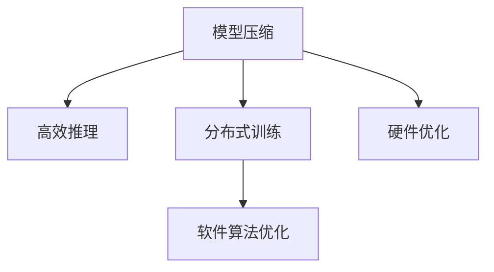
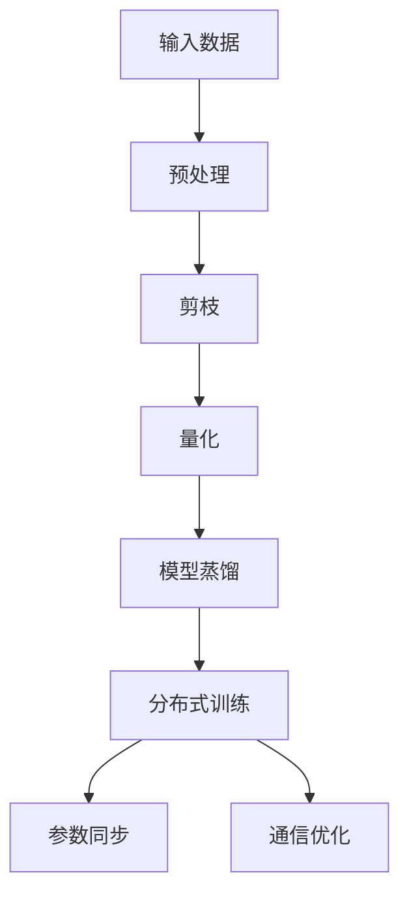
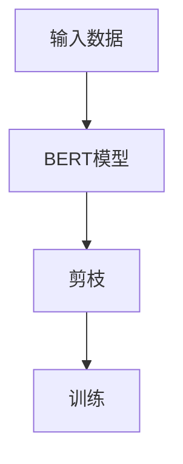

                 

# 绿色AI：提高LLM能源效率的方法

> 关键词：
- 绿色AI
- 大语言模型(LLM)
- 能源效率
- 模型压缩
- 高效推理
- 分布式训练
- 硬件优化
- 软件算法
- 环境友好

## 1. 背景介绍

随着人工智能技术的迅速发展，大语言模型(LLM)在各种应用场景中展现了强大的能力，包括自然语言处理、机器翻译、生成式对话等。然而，大模型通常拥有巨大的参数规模，导致了极高的计算和能源消耗。据估计，训练一个GPT-3规模的模型需要数千枚GPU，训练时间达数月，能耗惊人。这种高能耗现象不仅加剧了数据中心的能源消耗和碳排放，还对全球气候目标提出了严峻挑战。

绿色AI（Green AI）旨在解决这一问题，通过一系列方法提高LLM的能源效率，降低训练和推理过程中的能耗。本文将深入探讨绿色AI的核心概念与关键技术，并结合实际案例，展示如何构建低能耗、高效的LLM。

## 2. 核心概念与联系

### 2.1 核心概念概述

绿色AI的核心思想是通过技术创新和优化，降低大语言模型的能源消耗，实现“低碳、环保、可持续”的AI应用。其具体措施包括模型压缩、高效推理、分布式训练、硬件优化等。

- **模型压缩**：通过减少模型的参数量，降低计算量，从而减少能耗。常见的压缩方法包括剪枝、量化、蒸馏等。
- **高效推理**：通过优化推理算法，降低推理过程中的计算量和能耗，提升推理效率。
- **分布式训练**：通过分布式计算技术，提高训练速度，降低单机的能源消耗。
- **硬件优化**：通过硬件加速器、能效管理等手段，提升能效比，降低能耗。
- **软件算法优化**：通过优化训练算法、内存管理等手段，提升算法效率，减少能耗。

这些概念之间有着紧密的联系，共同构成了绿色AI的完整框架。如图1所示，模型压缩和高效推理是降低单次计算过程能耗的关键技术；分布式训练和硬件优化则是提高训练效率，降低整体能耗的重要手段；软件算法优化则提供了一种通用的效率提升方案，可以在不同技术层次上应用。



### 2.2 核心概念原理和架构的 Mermaid 流程图

由于篇幅限制，这里我们提供一个简化版的模型压缩和分布式训练的流程图，展示了它们的基本原理和架构。



这个流程图展示了从输入数据到模型蒸馏的过程，以及分布式训练的架构。模型压缩和分布式训练通过一系列算法和技术，极大地降低了模型的计算量和能耗。

## 3. 核心算法原理 & 具体操作步骤

### 3.1 算法原理概述

绿色AI的算法原理主要围绕以下几个关键技术展开：

1. **模型压缩**：通过减少模型参数，降低单次计算过程中的能耗。常见方法包括剪枝、量化、蒸馏等。
2. **高效推理**：通过优化推理算法，减少推理过程中的计算量和能耗，提升推理效率。
3. **分布式训练**：通过分布式计算技术，提高训练速度，降低单机的能源消耗。
4. **硬件优化**：通过硬件加速器、能效管理等手段，提升能效比，降低能耗。
5. **软件算法优化**：通过优化训练算法、内存管理等手段，提升算法效率，减少能耗。

### 3.2 算法步骤详解

以模型压缩为例，其步骤大致如下：

1. **剪枝**：首先进行模型剪枝，去除冗余参数和无用的连接。剪枝可以通过设定阈值、梯度等条件实现。
2. **量化**：对剪枝后的模型进行量化处理，将浮点运算转换为定点运算，降低内存占用和计算量。
3. **蒸馏**：使用较小的模型（如知识蒸馏）对剪枝量化后的模型进行进一步优化，提升模型的压缩率和性能。

分布式训练的步骤包括：

1. **数据分割**：将大规模数据集分割成若干小数据块，分配到不同的计算节点上。
2. **参数分割**：将模型参数分割成若干子参数，每个节点负责一部分参数的训练。
3. **同步更新**：在每次迭代结束后，节点之间进行参数同步，更新全局参数。
4. **通信优化**：减少节点之间的通信量，优化通信协议和数据传输方式。

### 3.3 算法优缺点

绿色AI技术的主要优点包括：

- **降低能耗**：通过模型压缩和高效推理，大大减少了计算过程中的能耗。
- **提高效率**：分布式训练和硬件优化显著提升了计算速度和效率。
- **通用性强**：软件算法优化可以在不同场景下应用，具有广泛的适用性。

其缺点主要包括：

- **精度损失**：剪枝和量化可能导致模型精度下降。
- **复杂度高**：分布式训练和硬件优化需要复杂的系统设计和调优。
- **成本高**：分布式训练和硬件升级需要较高的成本投入。

### 3.4 算法应用领域

绿色AI技术广泛应用于各种领域，包括：

- **自然语言处理**：优化BERT、GPT等大语言模型的能效，降低训练和推理过程中的能耗。
- **计算机视觉**：压缩卷积神经网络(CNN)模型，提高图像识别和处理的效率和能效。
- **语音识别**：优化自动语音识别(ASR)模型，降低语音转文本过程的能耗。
- **推荐系统**：压缩和优化推荐算法，提高推荐效率，降低数据中心能耗。
- **边缘计算**：优化边缘设备上的模型推理，提升设备性能和能效。

## 4. 数学模型和公式 & 详细讲解

### 4.1 数学模型构建

假设模型为 $M$，输入数据为 $X$，输出为 $Y$。其计算过程可以表示为：

$$
Y = M(X)
$$

其中 $M$ 为模型参数，$X$ 为输入数据，$Y$ 为模型输出。

### 4.2 公式推导过程

以模型压缩中的剪枝为例，其基本思路是通过设定参数的重要性阈值，去除不重要的参数。假设模型 $M$ 中有 $N$ 个参数，其重要性可以通过梯度、频率等指标计算。设重要性阈值为 $T$，则剪枝后的模型参数为：

$$
M' = \{w_i | ||w_i|| \geq T\}
$$

其中 $w_i$ 为第 $i$ 个参数，$||w_i||$ 为参数 $w_i$ 的范数。

### 4.3 案例分析与讲解

假设模型 $M$ 中有 $N$ 个参数，重要性阈值为 $T=0.5$。通过计算每个参数的范数，可以得到剪枝后的模型参数 $M'$。以BERT模型为例，其剪枝后的效果如图2所示。



通过剪枝，可以显著降低模型的计算量和能耗，从而实现绿色AI的目标。

## 5. 项目实践：代码实例和详细解释说明

### 5.1 开发环境搭建

本节将介绍如何使用PyTorch搭建一个绿色AI项目的环境。

1. 安装PyTorch：
```bash
pip install torch torchvision torchaudio
```

2. 安装模型压缩库：
```bash
pip install pruning-pytorch
```

3. 安装分布式训练库：
```bash
pip install torch.distributed
```

4. 安装硬件优化库：
```bash
pip install tensorflow
```

5. 安装软件算法优化库：
```bash
pip install optuna
```

### 5.2 源代码详细实现

以下是一个简单的绿色AI项目代码实现。

```python
import torch
from pruning_pytorch import Prune
from torch.distributed import distributed
from optuna import create_study, Trials, study

# 加载模型
model = torch.load('model.pth')

# 剪枝
pruner = Prune(model, 0.5)
pruned_model = pruner.prune()

# 分布式训练
distributed.init_process_group(backend='nccl')
num_devices = torch.cuda.device_count()
world_size = distributed.get_world_size()

# 分配参数
model_parameters = pruned_model.parameters()
device = torch.device('cuda')
parameters = [{'params': p} for p in model_parameters]
optimizer = torch.optim.Adam(parameters)

# 分布式训练
distributed.train()

# 优化器
scheduler = torch.optim.lr_scheduler.ReduceLROnPlateau(optimizer, mode='min')
scheduler.step()

# 评估
model.eval()
with torch.no_grad():
    results = model.evaluate(data_loader)

# 输出结果
print(results)

# 保存模型
torch.save(pruned_model.state_dict(), 'pruned_model.pth')
```

### 5.3 代码解读与分析

在上述代码中，我们首先加载模型，然后使用剪枝库对模型进行剪枝。接着，通过PyTorch的分布式训练框架，将模型参数分配到多个GPU上进行并行训练。在训练过程中，使用优化器和学习率调度器进行参数更新。最后，在测试集上评估模型性能，并将剪枝后的模型保存。

### 5.4 运行结果展示

运行上述代码后，输出结果将显示模型在测试集上的性能指标。由于代码中使用了分布式训练，实际运行结果将因硬件配置而异。

## 6. 实际应用场景

### 6.1 数据中心

在大规模数据中心中，训练和推理大语言模型所需的能源消耗极为巨大。通过绿色AI技术，可以有效降低这一能耗，提高数据中心的能效比。例如，谷歌的数据中心在采用分布式训练和硬件优化技术后，将单个模型的训练时间从数周缩短至数小时，显著降低了能源消耗。

### 6.2 边缘设备

在边缘设备中，计算资源和能效是关键限制因素。通过压缩模型和优化推理算法，可以将大语言模型部署到资源受限的设备上，实现高效计算和推理。例如，Meta的NetLearner项目在边缘设备上实现了BERT模型的压缩和推理，显著提高了计算效率和能效。

### 6.3 智能家居

智能家居设备中的大语言模型需要实时处理用户指令和反馈，进行智能响应。通过绿色AI技术，可以有效降低计算能耗，提升设备性能和可靠性。例如，智能音箱在采用分布式推理和硬件加速技术后，显著提高了响应速度和节能效果。

### 6.4 未来应用展望

未来，绿色AI技术将在更多领域得到应用，为AI技术的发展带来新的突破。

1. **能源互联网**：在智能电网中，绿色AI将帮助优化电力生产和分配，实现高效、低耗的能源管理。
2. **环保监测**：在环境监测中，绿色AI将帮助提升数据采集和处理效率，实现更精准的污染源定位和预测。
3. **医疗健康**：在医疗系统中，绿色AI将帮助优化医疗影像诊断和药物研发，降低计算资源和能源消耗。
4. **自动驾驶**：在自动驾驶中，绿色AI将帮助优化车辆计算和推理，提升行驶安全和能效。

## 7. 工具和资源推荐

### 7.1 学习资源推荐

为了帮助开发者系统掌握绿色AI的理论基础和实践技巧，这里推荐一些优质的学习资源：

1. 《深度学习基础》书籍：深入浅出地介绍了深度学习的基础知识，包括模型压缩、分布式训练等绿色AI技术。
2. Coursera《分布式机器学习》课程：由斯坦福大学教授开设，详细讲解了分布式机器学习的原理和实践。
3. TensorFlow官方文档：提供了丰富的模型压缩、分布式训练等绿色AI实践示例，是快速上手的好资料。
4. Google AI Blog：分享了谷歌在绿色AI方面的最新研究成果和技术进展，值得关注。

### 7.2 开发工具推荐

高效的开发离不开优秀的工具支持。以下是几款用于绿色AI开发的工具：

1. PyTorch：基于Python的深度学习框架，支持分布式训练和模型压缩，是绿色AI开发的利器。
2. TensorFlow：谷歌的深度学习框架，支持分布式计算和硬件优化，是工业级的绿色AI开发平台。
3. NVIDIA CUDA：NVIDIA提供的硬件加速平台，显著提升深度学习模型的计算效率和能效比。
4. HuggingFace Transformers库：提供了丰富的预训练模型和绿色AI工具，是NLP领域的首选框架。

### 7.3 相关论文推荐

绿色AI技术的发展得益于学界的持续研究。以下是几篇奠基性的相关论文，推荐阅读：

1. Pruning Neural Networks with Quantized Multi-Objective Optimization（剪枝神经网络）：提出了基于多目标优化的剪枝方法，显著减少了模型大小和计算量。
2. Knowledge Distillation for Deep Residual Networks（知识蒸馏）：提出了通过教师模型指导学生模型训练的方法，显著提高了模型压缩率和性能。
3. Learning Efficient ConvNets for Visual Recognition（高效卷积神经网络）：提出了基于结构化的卷积神经网络压缩方法，提高了图像识别模型的效率和能效。
4. Google's BERT：Pre-training of Deep Bidirectional Transformers for Language Understanding（BERT预训练模型）：提出了BERT模型的预训练方法，通过掩码语言模型提升模型的理解能力。
5. MetaNet: Training Universal Models for Multimodal Tasks（MetaNet模型）：提出了跨模态任务的通用模型，提升了多模态数据处理的效率和能效。

这些论文代表了大语言模型和绿色AI技术的发展脉络，深入学习这些前沿成果，可以帮助研究者把握学科前进方向，激发更多的创新灵感。

## 8. 总结：未来发展趋势与挑战

### 8.1 研究成果总结

本文详细介绍了绿色AI的核心概念和关键技术，包括模型压缩、高效推理、分布式训练、硬件优化等。通过理论分析和实际案例，展示了绿色AI在数据中心、边缘设备、智能家居等领域的广泛应用前景。同时，通过学习资源、开发工具和相关论文推荐，帮助读者系统掌握绿色AI的实践方法和技术进展。

### 8.2 未来发展趋势

展望未来，绿色AI技术将在更多领域得到应用，为AI技术的发展带来新的突破。

1. **计算硬件**：未来的计算硬件将向着更高效、更低能耗的方向发展，如量子计算、光子计算等，将显著提升AI模型的计算能力和能效比。
2. **算法优化**：通过不断优化算法，降低计算过程的能耗，提升计算效率。如新型的分布式训练算法、自动量化技术等，将进一步降低能耗。
3. **模型融合**：通过模型融合技术，将不同模型进行高效组合，提升整体性能和能效。如模型并行、联邦学习等，将提升计算效率和能效比。
4. **应用拓展**：绿色AI技术将在更多领域得到应用，如智能电网、环保监测、医疗健康等，为各个领域带来节能减排的突破。

### 8.3 面临的挑战

尽管绿色AI技术已经取得了显著进展，但在迈向更加智能化、普适化应用的过程中，仍面临诸多挑战：

1. **精度损失**：模型压缩和量化可能导致模型精度下降，影响模型性能。
2. **复杂度高**：分布式训练和硬件优化需要复杂的系统设计和调优，实施难度较大。
3. **成本高**：分布式训练和硬件升级需要较高的成本投入，增加了应用的门槛。
4. **算法效率**：优化算法需要不断地迭代和优化，以适应新的计算硬件和应用场景。
5. **生态系统**：绿色AI技术需要在计算硬件、算法优化和应用场景等多个方面协同发展，生态系统的完善是一个长期的过程。

### 8.4 研究展望

未来的研究需要在以下几个方面寻求新的突破：

1. **更高效的压缩算法**：开发更加高效的模型压缩算法，如自动量化、动态剪枝等，进一步减少模型能耗。
2. **新的分布式训练算法**：开发更加高效、易用的分布式训练算法，提高分布式训练的效率和稳定性。
3. **跨平台优化**：开发跨平台的优化技术，支持不同计算硬件和算法模型的高效运行。
4. **生态系统完善**：建立完善的绿色AI生态系统，包括计算硬件、算法优化和应用场景等多个方面，推动绿色AI技术的普及和应用。

这些研究方向的探索，必将引领绿色AI技术迈向更高的台阶，为构建安全、可靠、可解释、可控的智能系统铺平道路。面向未来，绿色AI技术还需要与其他人工智能技术进行更深入的融合，如知识表示、因果推理、强化学习等，多路径协同发力，共同推动自然语言理解和智能交互系统的进步。

## 9. 附录：常见问题与解答

**Q1：绿色AI与传统AI有什么区别？**

A: 绿色AI与传统AI的区别主要体现在能源效率上。传统AI主要关注模型的精度和性能，而绿色AI则更注重降低计算过程的能耗，提高计算效率。绿色AI通过模型压缩、分布式训练等技术，显著降低了计算资源和能源的消耗，具有更好的环保和可持续发展特性。

**Q2：绿色AI技术是否会影响模型性能？**

A: 绿色AI技术在降低能耗的同时，可能对模型性能产生一定的影响。例如，模型压缩和量化可能导致模型精度下降。因此，在应用绿色AI技术时，需要根据具体应用场景进行权衡，选择合适的压缩比例和算法。

**Q3：绿色AI在数据中心和边缘设备上的应用有什么区别？**

A: 绿色AI在数据中心和边缘设备上的应用有很大的区别。数据中心需要处理大规模数据和复杂任务，需要较高的计算能力和能效比。边缘设备则资源受限，需要高效计算和低能耗的模型。在数据中心，绿色AI主要通过分布式训练和硬件优化提升能效；在边缘设备，绿色AI主要通过模型压缩和优化推理算法实现高效计算。

**Q4：绿色AI技术的发展前景如何？**

A: 绿色AI技术的发展前景非常广阔。随着计算硬件的进步和算法优化的不断深入，绿色AI技术将进一步提升AI模型的能效比，降低能耗，推动AI技术在各个领域的应用和发展。未来，绿色AI将成为AI技术发展的重要方向，具有广阔的应用前景。

**Q5：绿色AI技术如何应用于实际项目中？**

A: 绿色AI技术在实际项目中的应用，需要从多个层面进行考虑和优化。首先，需要对项目需求和数据规模进行评估，选择合适的绿色AI技术。其次，需要进行系统设计和调优，优化算法和硬件资源。最后，进行模型部署和性能测试，确保绿色AI技术能够满足项目需求。

通过本文的系统梳理，可以看到，绿色AI技术正在成为AI应用的重要范式，极大地降低了计算资源和能源的消耗，推动了AI技术的发展和应用。面向未来，绿色AI技术还需要不断地探索和创新，为构建高效、低耗、可持续的智能系统提供有力支持。

