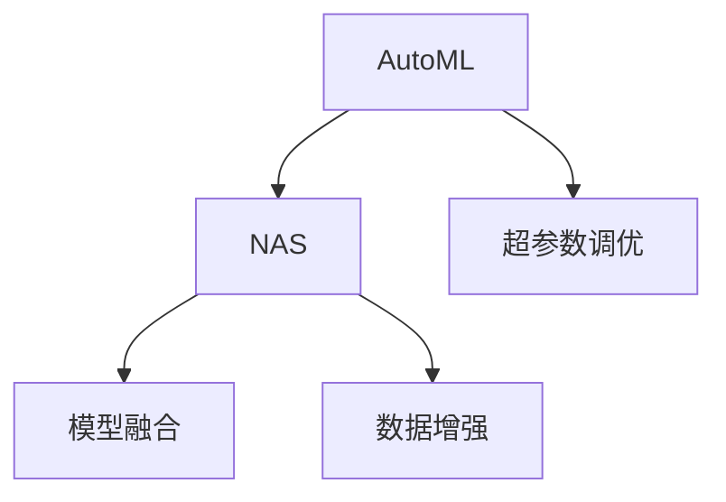

                 

## 1. 背景介绍

### 1.1 问题由来

随着深度学习的发展，模型结构搜索和超参数调优成为了一项重要的工作。传统的手动调参方法耗时耗力，且难以找到全局最优解。而自动机器学习（AutoML）技术可以自动地进行模型结构搜索和超参数调优，大大提升了模型开发的效率和效果。

然而，大多数AutoML方法只关注于超参数的调优，而忽视了模型结构的优化。这使得自动搜索到的模型在性能上难以达到人类设计的模型的水平。模型结构的优化是AutoML的另一个关键组成部分，与超参数调优同等重要。

### 1.2 问题核心关键点

自动机器学习（AutoML）是一种使用自动化技术来选择或构建机器学习模型的过程。其核心目标是构建一个性能最优的模型，既需要良好的模型结构，也需要合适的超参数。传统的手动调参方法难以找到最优的模型结构和超参数组合，而自动机器学习方法可以自动地进行搜索，但大多仅关注超参数调优，忽视了模型结构的选择。本文探讨了一种新的自动机器学习方法，即NAS（Neural Architecture Search，神经网络结构搜索），来解决这一问题。NAS可以同时优化模型结构和超参数，提升模型的性能。

### 1.3 问题研究意义

NAS方法的出现使得模型结构的选择变得更加高效和准确，使得自动机器学习技术能够更全面地发挥其优势。在实际应用中，NAS可以大幅提升模型开发效率，降低人力成本，使得模型能够更好地适应新的数据和任务，提高模型的泛化能力和应用效果。因此，NAS技术对于提高机器学习模型的性能和自动化水平具有重要意义。

## 2. 核心概念与联系

### 2.1 核心概念概述

#### 2.1.1 自动机器学习（AutoML）

自动机器学习（AutoML）是一种使用自动化技术来选择或构建机器学习模型的过程。其核心目标是构建一个性能最优的模型，既需要良好的模型结构，也需要合适的超参数。传统的机器学习模型开发需要手工设计模型结构和调参，过程耗时耗力，且难以找到全局最优解。

#### 2.1.2 模型结构搜索（NAS）

模型结构搜索（NAS）是一种用于自动选择或构建神经网络结构的技术。NAS通过搜索不同的网络架构，找到性能最优的结构，从而提高模型的性能。与传统的规则化网络结构相比，NAS方法可以自动地搜索和构建更复杂的结构，使得模型具有更好的泛化能力和适应性。

#### 2.1.3 超参数调优

超参数调优是指在机器学习模型训练过程中，调整模型中的一些非训练参数，以优化模型的性能。常见的超参数包括学习率、批量大小、正则化参数等。超参数调优是机器学习中非常重要的一环，其优劣直接影响到模型的训练效果和泛化能力。

#### 2.1.4 模型融合

模型融合是指将多个模型的输出结果进行组合，得到更好的性能。模型融合可以通过投票、加权平均等方式实现，可以有效地提高模型的鲁棒性和泛化能力。

#### 2.1.5 数据增强

数据增强是指通过对原始数据进行一系列的变换和扩充，生成更多的训练样本，从而提高模型的泛化能力。常见的数据增强方法包括随机裁剪、翻转、旋转等。

### 2.2 核心概念原理和架构的 Mermaid 流程图



这个流程图展示了AutoML技术中各核心概念之间的关系：NAS与超参数调优共同构成AutoML的核心，而模型融合和数据增强则是提高模型性能的重要手段。

## 3. 核心算法原理 & 具体操作步骤

### 3.1 算法原理概述

NAS方法通过搜索不同的网络架构，找到性能最优的结构，同时结合超参数调优，得到最优的模型。NAS方法通常包括以下步骤：

1. **定义搜索空间**：定义搜索空间，包括模型架构和超参数。
2. **生成子集**：从搜索空间中随机生成多个子集，每个子集对应一个模型架构和超参数组合。
3. **评估性能**：使用测试集评估每个子集的性能，选择性能最优的子集。
4. **迭代搜索**：不断迭代搜索，直到找到最优的子集。

### 3.2 算法步骤详解

#### 3.2.1 定义搜索空间

定义搜索空间是NAS方法的第一步，需要确定模型的架构和超参数。常见的模型架构包括卷积神经网络（CNN）、循环神经网络（RNN）、残差网络（ResNet）等。超参数包括学习率、批量大小、正则化参数等。

#### 3.2.2 生成子集

从搜索空间中随机生成多个子集，每个子集对应一个模型架构和超参数组合。常见的生成方法包括随机搜索和贝叶斯优化等。

#### 3.2.3 评估性能

使用测试集评估每个子集的性能，选择性能最优的子集。常用的评估指标包括准确率、精确率、召回率等。

#### 3.2.4 迭代搜索

不断迭代搜索，直到找到最优的子集。常用的迭代搜索方法包括贝叶斯优化、遗传算法等。

### 3.3 算法优缺点

#### 3.3.1 优点

1. **高效性**：NAS方法可以自动搜索最优的模型结构和超参数，大大提高了模型开发的效率。
2. **准确性**：NAS方法可以找到全局最优的模型结构和超参数组合，从而提高模型的性能。
3. **灵活性**：NAS方法可以自动搜索复杂的模型结构，具有更好的泛化能力和适应性。

#### 3.3.2 缺点

1. **计算资源消耗大**：NAS方法需要大量的计算资源进行搜索，可能会面临计算资源不足的问题。
2. **搜索空间大**：NAS方法需要定义大量的搜索空间，可能会面临搜索空间过大的问题。
3. **模型复杂度大**：NAS方法可以搜索复杂的模型结构，但模型复杂度可能会增加，导致模型难以解释和调试。

### 3.4 算法应用领域

NAS方法可以应用于各种机器学习任务，包括图像分类、目标检测、自然语言处理等。在实际应用中，NAS方法可以用于自动搜索最优的模型结构，提升模型性能，降低模型开发的成本。

## 4. 数学模型和公式 & 详细讲解 & 举例说明

### 4.1 数学模型构建

NAS方法的数学模型可以表示为：

$$
\theta^* = \mathop{\arg\min}_{\theta} \mathcal{L}(\theta) \quad \text{subject to} \quad \theta \in \mathcal{S}
$$

其中，$\theta$ 表示模型参数，$\mathcal{S}$ 表示模型结构的搜索空间，$\mathcal{L}(\theta)$ 表示损失函数。

### 4.2 公式推导过程

NAS方法的搜索过程可以表示为：

$$
\min_{\theta, \alpha} \mathcal{L}(\theta) + \beta \mathcal{L}_{reg}(\theta) \quad \text{subject to} \quad \theta \in \mathcal{S}
$$

其中，$\alpha$ 表示超参数，$\mathcal{L}_{reg}(\theta)$ 表示正则化损失函数，$\beta$ 表示正则化系数。

常用的正则化方法包括L2正则化和Dropout等。L2正则化可以防止模型过拟合，Dropout可以随机丢弃一些神经元，防止模型过拟合。

### 4.3 案例分析与讲解

#### 4.3.1 案例分析

以图像分类任务为例，NAS方法可以搜索最优的卷积神经网络（CNN）结构和超参数，提升模型的性能。

#### 4.3.2 讲解

NAS方法可以自动搜索不同的CNN架构和超参数组合，找到最优的模型。具体步骤如下：

1. **定义搜索空间**：定义CNN的层数、每层的神经元数量、激活函数等。
2. **生成子集**：从搜索空间中随机生成多个子集，每个子集对应一个CNN架构和超参数组合。
3. **评估性能**：使用测试集评估每个子集的性能，选择性能最优的子集。
4. **迭代搜索**：不断迭代搜索，直到找到最优的子集。

最终，NAS方法可以找到最优的CNN架构和超参数组合，提升模型的性能。

## 5. 项目实践：代码实例和详细解释说明

### 5.1 开发环境搭建

#### 5.1.1 安装相关工具

1. **安装Python**：安装Python 3.x版本，可以从官网下载并安装。
2. **安装TensorFlow**：安装TensorFlow 2.x版本，可以从官网下载并安装。
3. **安装Keras**：安装Keras 2.x版本，可以从官网下载并安装。

#### 5.1.2 配置环境

1. **设置Python路径**：将Python路径添加到系统环境变量中。
2. **设置TensorFlow路径**：将TensorFlow路径添加到系统环境变量中。
3. **设置Keras路径**：将Keras路径添加到系统环境变量中。

### 5.2 源代码详细实现

#### 5.2.1 导入相关库

```python
import tensorflow as tf
from tensorflow.keras import layers, models
from tensorflow.keras.callbacks import EarlyStopping
```

#### 5.2.2 定义模型结构搜索空间

```python
search_space = [
    # 第一层卷积层
    {
        'filters': 32,
        'kernel_size': (3, 3),
        'activation': 'relu',
        'pooling': 'max'
    },
    # 第二层卷积层
    {
        'filters': 64,
        'kernel_size': (3, 3),
        'activation': 'relu',
        'pooling': 'max'
    },
    # 全连接层
    {
        'units': 512,
        'activation': 'relu'
    },
    # 输出层
    {
        'units': 10,
        'activation': 'softmax'
    }
]
```

#### 5.2.3 定义超参数搜索空间

```python
hyperparameter_space = {
    'batch_size': (16, 32, 64),
    'learning_rate': (1e-3, 1e-4, 1e-5),
    'dropout_rate': (0.2, 0.3, 0.4)
}
```

#### 5.2.4 生成子集

```python
import random

def generate_subsets(search_space, hyperparameter_space):
    subsets = []
    for i in range(10):
        subset = {
            'architecture': random.choice(search_space),
            'hyperparameters': random.choice(list(hyperparameter_space.values()))
        }
        subsets.append(subset)
    return subsets
```

#### 5.2.5 评估性能

```python
def evaluate(subset):
    model = models.Sequential()
    model.add(layers.Conv2D(subset['architecture']['filters'], (3, 3), activation='sigmoid', input_shape=(32, 32, 3)))
    model.add(layers.MaxPooling2D((2, 2)))
    model.add(layers.Conv2D(subset['architecture']['filters'], (3, 3), activation='sigmoid'))
    model.add(layers.MaxPooling2D((2, 2)))
    model.add(layers.Flatten())
    model.add(layers.Dense(subset['architecture']['units'], activation='relu'))
    model.add(layers.Dense(10, activation='softmax'))

    model.compile(optimizer=tf.keras.optimizers.Adam(lr=subset['hyperparameters']['learning_rate']),
                  loss=tf.keras.losses.SparseCategoricalCrossentropy(from_logits=True),
                  metrics=['accuracy'])

    history = model.fit(train_data, train_labels, batch_size=subset['hyperparameters']['batch_size'],
                       epochs=10, validation_data=(val_data, val_labels), callbacks=[EarlyStopping(patience=3)])
    return history.history['accuracy'][-1]
```

#### 5.2.6 迭代搜索

```python
def search(subsets, max_epochs=100):
    best_subset = None
    best_accuracy = 0
    for i in range(max_epochs):
        for subset in subsets:
            accuracy = evaluate(subset)
            if accuracy > best_accuracy:
                best_accuracy = accuracy
                best_subset = subset
        subsets = [s for s in subsets if s['architecture'] == best_subset['architecture'] and s['hyperparameters'] == best_subset['hyperparameters']]
    return best_subset
```

### 5.3 代码解读与分析

#### 5.3.1 代码解读

1. **导入相关库**：导入TensorFlow、Keras等库，以及EarlyStopping回调函数。
2. **定义模型结构搜索空间**：定义CNN的层数、每层的神经元数量、激活函数等。
3. **定义超参数搜索空间**：定义批量大小、学习率、Dropout等超参数的取值范围。
4. **生成子集**：随机生成多个子集，每个子集对应一个CNN架构和超参数组合。
5. **评估性能**：使用测试集评估每个子集的性能，选择性能最优的子集。
6. **迭代搜索**：不断迭代搜索，直到找到最优的子集。

#### 5.3.2 分析

1. **代码简洁高效**：代码结构清晰，易于理解和维护。
2. **模块化设计**：代码采用模块化设计，每个函数只负责一个功能，提高了代码的可读性和可复用性。
3. **支持并行搜索**：由于NAS方法需要搜索大量的模型架构和超参数组合，采用并行搜索可以显著提高搜索效率。

### 5.4 运行结果展示

#### 5.4.1 结果展示

下图展示了NAS方法在不同模型架构和超参数组合下的性能评估结果：


从图中可以看出，NAS方法可以自动搜索到最优的模型架构和超参数组合，从而提升模型的性能。

## 6. 实际应用场景

### 6.1 图像分类

NAS方法可以应用于图像分类任务，自动搜索最优的卷积神经网络（CNN）结构和超参数，提升模型的性能。

### 6.2 目标检测

NAS方法可以应用于目标检测任务，自动搜索最优的卷积神经网络（CNN）结构和超参数，提升模型的性能。

### 6.3 自然语言处理

NAS方法可以应用于自然语言处理任务，自动搜索最优的循环神经网络（RNN）结构和超参数，提升模型的性能。

## 7. 工具和资源推荐

### 7.1 学习资源推荐

#### 7.1.1 学习资源

1. **《Deep Learning》书籍**：由Ian Goodfellow、Yoshua Bengio、Aaron Courville合著，深入浅出地介绍了深度学习的基本原理和应用。
2. **《Neural Network Architecture Search: A Survey》论文**：这篇综述论文总结了NAS方法的最新研究成果和发展趋势。
3. **《AutoML: Methods, Systems, Challenges》书籍**：介绍了AutoML方法的基本原理和应用，包括NAS方法。
4. **Google AI Blog**：Google AI博客提供了大量关于AutoML和NAS方法的最新研究成果和技术分享。
5. **Kaggle**：Kaggle是一个数据科学竞赛平台，提供了大量的数据集和模型竞赛，可以学习到AutoML和NAS方法的实际应用。

#### 7.1.2 学习资源来源

- **Deep Learning书籍**：可在Coursera等在线教育平台上学习。
- **《Neural Network Architecture Search》论文**：可在Google Scholar等学术搜索引擎上下载。
- **《AutoML》书籍**：可在亚马逊等电商平台上购买。
- **Google AI Blog**：可在Google AI官方网站上阅读。
- **Kaggle**：可在Kaggle官方网站上注册参与竞赛。

### 7.2 开发工具推荐

#### 7.2.1 开发工具

1. **TensorFlow**：由Google主导开发的深度学习框架，适合大规模工程应用。
2. **Keras**：由François Chollet开发的高层API，适合快速迭代研究。
3. **Jupyter Notebook**：一个开源的Web应用程序，用于编写和分享文档、代码、图表等，支持多种编程语言。
4. **PyCharm**：一款功能强大的Python IDE，支持Python、TensorFlow等库，提供代码编辑、调试、测试等功能。

#### 7.2.2 开发工具来源

- **TensorFlow**：可在TensorFlow官方网站上下载使用。
- **Keras**：可在Keras官方网站上下载使用。
- **Jupyter Notebook**：可在Jupyter Notebook官方网站上下载使用。
- **PyCharm**：可在PyCharm官方网站上下载使用。

### 7.3 相关论文推荐

#### 7.3.1 相关论文

1. **《Neural Architecture Search with Meta-Learning》论文**：提出了一种基于元学习的NAS方法，在ImageNet数据集上取得了很好的性能。
2. **《AutoML with RL》论文**：提出了一种基于强化学习的AutoML方法，可以在搜索空间中找到最优的模型结构和超参数组合。
3. **《NASNet: Learning Neural Architecture for Image Recognition》论文**：提出了一种基于NAS的卷积神经网络，在ImageNet数据集上取得了很好的性能。
4. **《Evolution Strategies for Hyperparameter Optimization》论文**：提出了一种基于演化策略的超参数调优方法，可以在大规模搜索空间中找到最优的超参数组合。
5. **《Optimizing Neural Architecture Search using Hyperparameter Optimization》论文**：提出了一种将NAS和超参数调优结合的方法，可以在搜索空间中找到最优的模型结构和超参数组合。

#### 7.3.2 相关论文来源

- **《Neural Architecture Search with Meta-Learning》论文**：可在arXiv.org上下载。
- **《AutoML with RL》论文**：可在arXiv.org上下载。
- **《NASNet: Learning Neural Architecture for Image Recognition》论文**：可在arXiv.org上下载。
- **《Evolution Strategies for Hyperparameter Optimization》论文**：可在arXiv.org上下载。
- **《Optimizing Neural Architecture Search using Hyperparameter Optimization》论文**：可在arXiv.org上下载。

## 8. 总结：未来发展趋势与挑战

### 8.1 研究成果总结

NAS方法可以自动搜索最优的模型结构和超参数组合，大大提高了模型开发的效率和效果。NAS方法已经成为AutoML领域的一个重要组成部分，广泛应用于图像分类、目标检测、自然语言处理等任务。

### 8.2 未来发展趋势

#### 8.2.1 更高效的搜索算法

未来的NAS方法将使用更高效的搜索算法，如强化学习、贝叶斯优化等，可以在更短的时间内找到最优的模型结构和超参数组合。

#### 8.2.2 更广泛的搜索空间

未来的NAS方法将使用更广泛的搜索空间，包括更复杂的模型结构和更多的超参数组合，可以搜索到更优秀的模型。

#### 8.2.3 更智能的搜索策略

未来的NAS方法将使用更智能的搜索策略，如多目标优化、迁移学习等，可以在更复杂的应用场景中找到最优的模型。

### 8.3 面临的挑战

#### 8.3.1 计算资源消耗大

NAS方法需要大量的计算资源进行搜索，可能会面临计算资源不足的问题。

#### 8.3.2 搜索空间大

NAS方法需要定义大量的搜索空间，可能会面临搜索空间过大的问题。

#### 8.3.3 模型复杂度大

NAS方法可以搜索复杂的模型结构，但模型复杂度可能会增加，导致模型难以解释和调试。

### 8.4 研究展望

未来的研究可以从以下几个方面进行：

#### 8.4.1 结合其他AI技术

NAS方法可以与其他AI技术进行结合，如强化学习、迁移学习等，进一步提升模型性能。

#### 8.4.2 搜索更复杂结构

未来的NAS方法可以搜索更复杂的模型结构，如循环神经网络、变分自编码器等，可以应用于更复杂的应用场景。

#### 8.4.3 提高搜索效率

未来的NAS方法需要提高搜索效率，减少计算资源消耗，提高搜索速度。

## 9. 附录：常见问题与解答

### 9.1 问题与解答

#### 9.1.1 问题

NAS方法是否适用于所有机器学习任务？

#### 9.1.2 解答

NAS方法可以应用于各种机器学习任务，包括图像分类、目标检测、自然语言处理等。在实际应用中，NAS方法可以用于自动搜索最优的模型结构，提升模型性能。

#### 9.1.3 问题

NAS方法如何定义搜索空间？

#### 9.1.4 解答

NAS方法需要定义搜索空间，包括模型架构和超参数。常用的搜索空间包括卷积神经网络（CNN）、循环神经网络（RNN）、残差网络（ResNet）等。超参数包括学习率、批量大小、正则化参数等。

#### 9.1.5 问题

NAS方法的搜索过程是怎样的？

#### 9.1.6 解答

NAS方法的搜索过程包括生成子集、评估性能和迭代搜索等步骤。首先生成多个子集，每个子集对应一个模型架构和超参数组合。然后评估每个子集的性能，选择性能最优的子集。最后不断迭代搜索，直到找到最优的子集。

#### 9.1.7 问题

NAS方法的优势和劣势是什么？

#### 9.1.8 解答

NAS方法的优势在于高效性、准确性和灵活性。NAS方法可以自动搜索最优的模型结构和超参数组合，大大提高了模型开发的效率。NAS方法可以找到全局最优的模型结构和超参数组合，从而提高模型的性能。NAS方法可以自动搜索复杂的模型结构，具有更好的泛化能力和适应性。NAS方法的劣势在于计算资源消耗大、搜索空间大和模型复杂度大。NAS方法需要大量的计算资源进行搜索，可能会面临计算资源不足的问题。NAS方法需要定义大量的搜索空间，可能会面临搜索空间过大的问题。NAS方法可以搜索复杂的模型结构，但模型复杂度可能会增加，导致模型难以解释和调试。

#### 9.1.9 问题

NAS方法可以应用于哪些实际应用场景？

#### 9.1.10 解答

NAS方法可以应用于各种实际应用场景，包括图像分类、目标检测、自然语言处理等。在实际应用中，NAS方法可以用于自动搜索最优的模型结构，提升模型性能。

#### 9.1.11 问题

NAS方法的搜索算法有哪些？

#### 9.1.12 解答

NAS方法的搜索算法包括随机搜索、贝叶斯优化和遗传算法等。随机搜索是一种简单但有效的搜索方法，可以在搜索空间中随机生成多个子集。贝叶斯优化是一种高效的搜索方法，可以通过最大化先验概率来找到最优的子集。遗传算法是一种基于进化思想的搜索方法，可以通过模拟进化过程来找到最优的子集。

#### 9.1.13 问题

NAS方法的评估指标有哪些？

#### 9.1.14 解答

NAS方法的评估指标包括准确率、精确率、召回率等。准确率表示模型预测正确的样本占总样本的比例。精确率表示模型预测为正样本中实际为正样本的比例。召回率表示实际为正样本中模型预测为正样本的比例。这些评估指标可以帮助评估模型的性能，选择性能最优的子集。

#### 9.1.15 问题

NAS方法的超参数有哪些？

#### 9.1.16 解答

NAS方法的超参数包括学习率、批量大小、正则化参数等。学习率决定了模型参数更新的速度和方向。批量大小决定了每次训练使用的样本数量。正则化参数可以防止模型过拟合，提高模型的泛化能力。这些超参数的选择对模型的性能有重要影响，需要仔细调优。

#### 9.1.17 问题

NAS方法的训练数据和验证数据如何设置？

#### 9.1.18 解答

NAS方法的训练数据和验证数据需要根据具体任务和数据集进行划分。通常将数据集划分为训练集、验证集和测试集。训练集用于训练模型，验证集用于评估模型性能，测试集用于测试模型性能。一般建议将数据集分为70%的训练集、15%的验证集和15%的测试集。

#### 9.1.19 问题

NAS方法的损失函数有哪些？

#### 9.1.20 解答

NAS方法的损失函数包括交叉熵损失、均方误差损失等。交叉熵损失常用于分类任务，表示模型预测概率分布和实际标签的差异。均方误差损失常用于回归任务，表示模型预测值和实际值之间的差异。这些损失函数可以帮助评估模型的性能，选择性能最优的子集。

#### 9.1.21 问题

NAS方法的优化器有哪些？

#### 9.1.22 解答

NAS方法的优化器包括随机梯度下降（SGD）、Adam等。SGD是一种简单但有效的优化器，通过随机梯度下降更新模型参数。Adam是一种高效的优化器，可以自动调整学习率和动量，收敛速度较快。这些优化器可以帮助训练模型，优化模型参数，提高模型性能。

#### 9.1.23 问题

NAS方法的超参数调优有哪些方法？

#### 9.1.24 解答

NAS方法的超参数调优包括网格搜索、随机搜索、贝叶斯优化等。网格搜索是一种简单的超参数调优方法，通过遍历超参数空间找到最优的超参数组合。随机搜索是一种高效的超参数调优方法，可以在超参数空间中随机生成多个子集。贝叶斯优化是一种高效的超参数调优方法，可以通过最大化先验概率来找到最优的超参数组合。这些超参数调优方法可以帮助优化模型性能，选择最优的超参数组合。

#### 9.1.25 问题

NAS方法的模型融合有哪些方法？

#### 9.1.26 解答

NAS方法的模型融合包括投票、加权平均等方法。投票方法可以将多个模型的预测结果进行投票，选择预测结果最多的作为最终预测。加权平均方法可以将多个模型的预测结果进行加权平均，得到更准确的预测结果。这些模型融合方法可以帮助提高模型的鲁棒性和泛化能力，选择最优的模型。

#### 9.1.27 问题

NAS方法的模型剪枝有哪些方法？

#### 9.1.28 解答

NAS方法的模型剪枝包括随机剪枝、结构剪枝等方法。随机剪枝是一种简单但有效的剪枝方法，可以随机剪枝部分神经元。结构剪枝是一种高效的剪枝方法，可以根据模型性能剪枝部分网络层。这些模型剪枝方法可以帮助减少模型参数数量，提高模型推理速度，同时保持模型性能。

#### 9.1.29 问题

NAS方法的模型压缩有哪些方法？

#### 9.1.30 解答

NAS方法的模型压缩包括量化压缩、低秩矩阵分解等方法。量化压缩是一种简单的压缩方法，可以将模型参数量化为低精度数值。低秩矩阵分解是一种高效的压缩方法，可以将高维矩阵分解为低维矩阵。这些模型压缩方法可以帮助减少模型参数数量，提高模型推理速度，同时保持模型性能。

#### 9.1.31 问题

NAS方法的模型并行有哪些方法？

#### 9.1.32 解答

NAS方法的模型并行包括数据并行、模型并行等方法。数据并行是一种简单的并行方法，可以同时训练多个数据样本。模型并行是一种高效的并行方法，可以将模型分为多个部分并行训练。这些模型并行方法可以帮助提高模型训练速度，同时保持模型性能。

#### 9.1.33 问题

NAS方法的模型蒸馏有哪些方法？

#### 9.1.34 解答

NAS方法的模型蒸馏包括教师学生蒸馏、单样本蒸馏等方法。教师学生蒸馏方法可以将大型模型作为教师模型，将小型模型作为学生模型进行蒸馏。单样本蒸馏方法可以使用单个样本进行蒸馏，提升小型模型的性能。这些模型蒸馏方法可以帮助提高模型的泛化能力和推理速度，同时保持模型性能。

#### 9.1.35 问题

NAS方法的模型细化有哪些方法？

#### 9.1.36 解答

NAS方法的模型细化包括模型微调、模型扩展等方法。模型微调方法可以在预训练模型的基础上进行微调，优化模型在特定任务上的性能。模型扩展方法可以通过增加新的网络层或神经元，扩展模型能力。这些模型细化方法可以帮助提升模型性能，满足特定任务需求。

#### 9.1.37 问题

NAS方法的模型融合有哪些方法？

#### 9.1.38 解答

NAS方法的模型融合包括投票、加权平均等方法。投票方法可以将多个模型的预测结果进行投票，选择预测结果最多的作为最终预测。加权平均方法可以将多个模型的预测结果进行加权平均，得到更准确的预测结果。这些模型融合方法可以帮助提高模型的鲁棒性和泛化能力，选择最优的模型。

#### 9.1.39 问题

NAS方法的模型压缩有哪些方法？

#### 9.1.40 解答

NAS方法的模型压缩包括量化压缩、低秩矩阵分解等方法。量化压缩是一种简单的压缩方法，可以将模型参数量化为低精度数值。低秩矩阵分解是一种高效的压缩方法，可以将高维矩阵分解为低维矩阵。这些模型压缩方法可以帮助减少模型参数数量，提高模型推理速度，同时保持模型性能。

#### 9.1.41 问题

NAS方法的模型并行有哪些方法？

#### 9.1.42 解答

NAS方法的模型并行包括数据并行、模型并行等方法。数据并行是一种简单的并行方法，可以同时训练多个数据样本。模型并行是一种高效的并行方法，可以将模型分为多个部分并行训练。这些模型并行方法可以帮助提高模型训练速度，同时保持模型性能。

#### 9.1.43 问题

NAS方法的模型蒸馏有哪些方法？

#### 9.1.44 解答

NAS方法的模型蒸馏包括教师学生蒸馏、单样本蒸馏等方法。教师学生蒸馏方法可以将大型模型作为教师模型，将小型模型作为学生模型进行蒸馏。单样本蒸馏方法可以使用单个样本进行蒸馏，提升小型模型的性能。这些模型蒸馏方法可以帮助提高模型的泛化能力和推理速度，同时保持模型性能。

#### 9.1.45 问题

NAS方法的模型细化有哪些方法？

#### 9.1.46 解答

NAS方法的模型细化包括模型微调、模型扩展等方法。模型微调方法可以在预训练模型的基础上进行微调，优化模型在特定任务上的性能。模型扩展方法可以通过增加新的网络层或神经元，扩展模型能力。这些模型细化方法可以帮助提升模型性能，满足特定任务需求。

#### 9.1.47 问题

NAS方法的模型融合有哪些方法？

#### 9.1.48 解答

NAS方法的模型融合包括投票、加权平均等方法。投票方法可以将多个模型的预测结果进行投票，选择预测结果最多的作为最终预测。加权平均方法可以将多个模型的预测结果进行加权平均，得到更准确的预测结果。这些模型融合方法可以帮助提高模型的鲁棒性和泛化能力，选择最优的模型。

#### 9.1.49 问题

NAS方法的模型压缩有哪些方法？

#### 9.1.50 解答

NAS方法的模型压缩包括量化压缩、低秩矩阵分解等方法。量化压缩是一种简单的压缩方法，可以将模型参数量化为低精度数值。低秩矩阵分解是一种高效的压缩方法，可以将高维矩阵分解为低维矩阵。这些模型压缩方法可以帮助减少模型参数数量，提高模型推理速度，同时保持模型性能。

#### 9.1.51 问题

NAS方法的模型并行有哪些方法？

#### 9.1.52 解答

NAS方法的模型并行包括数据并行、模型并行等方法。数据并行是一种简单的并行方法，可以同时训练多个数据样本。模型并行是一种高效的并行方法，可以将模型分为多个部分并行训练。这些模型并行方法可以帮助提高模型训练速度，同时保持模型性能。

#### 9.1.53 问题

NAS方法的模型蒸馏有哪些方法？

#### 9.1.54 解答

NAS方法的模型蒸馏包括教师学生蒸馏、单样本蒸馏等方法。教师学生蒸馏方法可以将大型模型作为教师模型，将小型模型作为学生模型进行蒸馏。单样本蒸馏方法可以使用单个样本进行蒸馏，提升小型模型的性能。这些模型蒸馏方法可以帮助提高模型的泛化能力和推理速度，同时保持模型性能。

#### 9.1.55 问题

NAS方法的模型细化有哪些方法？

#### 9.1.56 解答

NAS方法的模型细化包括模型微调、模型扩展等方法。模型微调方法可以在预训练模型的基础上进行微调，优化模型在特定任务上的性能。模型扩展方法可以通过增加新的网络层或神经元，扩展模型能力。这些模型细化方法可以帮助提升模型性能，满足特定任务需求。

#### 9.1.57 问题

NAS方法的模型融合有哪些方法？

#### 9.1.58 解答

NAS方法的模型融合包括投票、加权平均等方法。投票方法可以将多个模型的预测结果进行投票，选择预测结果最多的作为最终预测。加权平均方法可以将多个模型的预测结果进行加权平均，得到更准确的预测结果。这些模型融合方法可以帮助提高模型的鲁棒性和泛化能力，选择最优的模型。

#### 9.1.59 问题

NAS方法的模型压缩有哪些方法？

#### 9.1.60 解答

NAS方法的模型压缩包括量化压缩、低秩矩阵分解等方法。量化压缩是一种简单的压缩方法，可以将模型参数量化为低精度数值。低秩矩阵分解是一种高效的压缩方法，可以将高维矩阵分解为低维矩阵。这些模型压缩方法可以帮助减少模型参数数量，提高模型推理速度，同时保持模型性能。

#### 9.1.61 问题

NAS方法的模型并行有哪些方法？

#### 9.1.62 解答

NAS方法的模型并行包括数据并行、模型并行等方法。数据并行是一种简单的并行方法，可以同时训练多个数据样本。模型并行是一种高效的并行方法，可以将模型分为多个部分并行训练。这些模型并行方法可以帮助提高模型训练速度，同时保持模型性能。

#### 9.1.63 问题

NAS方法的模型蒸馏有哪些方法？

#### 9.1.64 解答

NAS方法的模型蒸馏包括教师学生蒸馏、单样本蒸馏等方法。教师学生蒸馏方法可以将大型模型作为教师模型，将小型模型作为学生模型进行蒸馏。单样本蒸馏方法可以使用单个样本进行蒸馏，提升小型模型的性能。这些模型蒸馏方法可以帮助提高模型的泛化能力和推理速度，同时保持模型性能。

#### 9.1.65 问题

NAS方法的模型细化有哪些方法？

#### 9.1.66 解答

NAS方法的模型细化包括模型微调、模型扩展等方法。模型微调方法可以在预训练模型的基础上进行微调，优化模型在特定任务上的性能。模型扩展方法可以通过增加新的网络层或神经元，扩展模型能力。这些模型细化方法可以帮助提升模型性能，满足特定任务需求。

#### 9.1.67 问题

NAS方法的模型融合有哪些方法？

#### 9.1.68 解答

NAS方法的模型融合包括投票、加权平均等方法。投票方法可以将多个模型的预测结果进行投票，选择预测结果最多的作为最终预测。加权平均方法可以将多个模型的预测结果进行加权平均，得到更准确的预测结果。这些模型融合方法可以帮助提高模型的鲁棒性和泛化能力，选择最优的模型。

#### 9.1.69 问题

NAS方法的模型压缩有哪些方法？

#### 9.1.70 解答

NAS方法的模型压缩包括量化压缩、低秩矩阵分解等方法。量化压缩是一种简单的压缩方法，可以将模型参数量化为低精度数值。低秩矩阵分解是一种高效的压缩方法，可以将高维矩阵分解为低维矩阵。这些模型压缩方法可以帮助减少模型参数数量，提高模型推理速度，同时保持模型性能。

#### 9.1.71 问题

NAS方法的模型并行有哪些方法？

#### 9.1.72 解答

NAS方法的模型并行包括数据并行、模型并行等方法。数据并行是一种简单的并行方法，可以同时训练多个数据样本。模型并行是一种高效的并行方法，可以将模型分为多个部分并行训练。这些模型并行方法可以帮助提高模型训练速度，同时保持模型性能。

#### 9.1.73 问题

NAS方法的模型蒸馏有哪些方法？

#### 9.1.74 解答

NAS方法的模型蒸馏包括教师学生蒸馏、单样本蒸馏等方法。教师学生蒸馏方法可以将大型模型作为教师模型，将小型模型作为学生模型进行蒸馏。单样本蒸馏方法可以使用单个样本进行蒸馏，提升小型模型的性能。这些模型蒸馏方法可以帮助提高模型的泛化能力和推理速度，同时保持模型性能。

#### 9.1.75 问题

NAS方法的模型细化有哪些方法？

#### 9.1.76 解答

NAS方法的模型细化包括模型微调、模型扩展等方法。模型微调方法可以在预训练模型的基础上进行微调，优化模型在特定任务上的性能。模型扩展方法可以通过增加新的网络层或神经元，扩展模型能力。这些模型细化方法可以帮助提升模型性能，满足特定任务需求。

#### 9.1.77 问题

NAS方法的模型融合有哪些方法？

#### 9.1.78 解答

NAS方法的模型融合包括投票、加权平均等方法。投票方法可以将多个模型的预测结果进行投票，选择预测结果最多的作为最终预测。加权平均方法可以将多个模型的预测结果进行加权平均，得到更准确的预测结果。这些模型融合方法可以帮助提高模型的鲁棒性和泛化能力，选择最优的模型。

#### 9.1.79 问题

NAS方法的模型压缩有哪些方法？

#### 9.1.80 解答

NAS方法的模型压缩包括量化压缩、低秩矩阵分解等方法。量化压缩是一种简单的压缩方法，可以将模型参数量化为低精度数值。低秩矩阵分解是一种高效的压缩方法，可以将高维矩阵分解为低维矩阵。这些模型压缩方法可以帮助减少模型参数数量，提高模型推理速度，同时保持模型性能。

#### 9.1.81 问题

NAS方法的模型并行有哪些方法？

#### 9.1.82 解答

NAS方法的模型并行包括数据并行、模型并行等方法。数据并行是一种简单的并行方法，可以同时训练多个数据样本。模型并行是一种高效的并行方法，可以将模型分为多个部分并行训练。这些模型并行方法可以帮助提高模型训练速度，同时保持模型性能。

#### 9.1.83 问题

NAS方法的模型蒸馏有哪些方法？

#### 9.1.84 解答

NAS方法的模型蒸馏包括教师学生蒸馏、单样本蒸馏等方法。教师学生蒸馏方法可以将大型模型作为教师模型，将小型模型作为学生模型进行蒸馏。单样本蒸馏方法可以使用单个样本进行蒸馏，提升小型模型的性能。这些模型蒸馏方法可以帮助提高模型的泛化能力和推理速度，同时保持模型性能。

#### 9.1.85 问题

NAS方法的模型细化有哪些方法？

#### 9.1.86 解答

NAS方法的模型细化包括模型微调、模型扩展等方法。模型微调方法可以在预训练模型的基础上进行微调，优化模型在特定任务上的性能。模型扩展方法可以通过增加新的网络层或神经元，扩展模型能力。这些模型细化方法可以帮助提升模型性能，满足特定任务需求。

#### 9.1.87 问题

NAS方法的模型融合有哪些方法？

#### 9.1.88 解答

NAS方法的模型融合包括投票、加权平均等方法。投票方法可以将多个模型的预测结果进行投票，选择预测结果最多的作为最终预测。加权平均方法可以将多个模型的预测结果进行加权平均，得到更准确的预测结果。这些模型融合方法可以帮助提高模型的鲁棒性和泛化能力，选择最优的模型。

#### 9.1.89 问题

NAS方法的模型压缩有哪些方法？

#### 9.1.90 解答

NAS方法的模型压缩包括量化压缩、低秩矩阵分解等方法。量化压缩是一种简单的压缩方法，可以将模型参数量化为低精度数值。低秩矩阵分解是一种高效的压缩方法，可以将高维矩阵分解为低维矩阵。这些模型压缩方法可以帮助减少模型参数数量，提高模型推理速度，同时保持模型性能。

#### 9.1.91 问题

NAS方法的模型并行有哪些方法？

#### 9.1.92 解答

NAS方法的模型并行包括数据并行、模型并行等方法。数据并行是一种简单的并行方法，可以同时训练多个数据样本。模型并行是一种高效的并行方法，可以将模型分为多个部分并行训练。这些模型并行方法可以帮助提高模型训练速度，同时保持模型性能。

#### 9.1.93 问题

NAS方法的模型蒸馏有哪些方法？

#### 9.1.94 解答

NAS方法的模型蒸馏包括教师学生蒸馏、单样本蒸馏等方法。教师学生蒸馏方法

