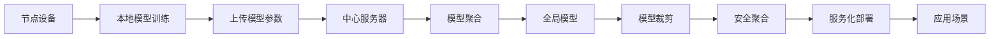

                 

## 1. 背景介绍

### 1.1 问题由来

联邦学习(Federated Learning, FL)是一种新兴的分布式机器学习方法，它允许多个独立的数据持有人（例如企业、机构、用户设备等）在不共享本地数据的情况下，协同训练一个全局模型。联邦学习旨在保护隐私和数据安全的同时，充分利用各参与方数据的价值，实现高性能、高效的模型训练。

近年来，随着大数据和人工智能技术的迅猛发展，各行业对隐私保护和数据安全的要求越来越高，同时对模型性能和训练速度的要求也越来越高。然而，传统集中式训练方法存在数据集中存储、隐私泄露、数据不平衡等问题，无法满足这些需求。

### 1.2 问题核心关键点

联邦学习的核心思想是让数据分散在不同的节点上进行本地训练，每个节点只上传模型参数和计算结果，不共享本地数据。通过这种方式，各节点可以共同优化模型，提升全局性能，同时保护本地数据的隐私性和安全性。

联邦学习的主要优点包括：
- **隐私保护**：参与方不共享本地数据，保护了数据隐私。
- **去中心化**：数据分布式存储，无需集中式存储和传输，提高了数据处理的安全性和效率。
- **可扩展性**：可以支持大规模参与方协同训练，适用于互联网、物联网等分布式系统。
- **弹性**：支持动态参与方加入和退出，模型训练和更新可以按需调整。

联邦学习的主要挑战包括：
- **异构性**：各节点设备可能具有不同的计算能力、存储容量和数据质量。
- **通信开销**：模型参数和计算结果需要频繁地在节点之间传输，增加了通信成本。
- **安全性**：需要防止恶意节点通过通信窃取模型信息或篡改数据。
- **收敛性**：在异构数据上训练模型可能收敛较慢，甚至不收敛。

本文将对联邦学习的基本原理、核心算法、具体操作步骤及其实际应用场景进行深入探讨，并结合代码实例进行详细讲解。

## 2. 核心概念与联系

### 2.1 核心概念概述

- **联邦学习**：一种分布式机器学习方法，参与方在不共享本地数据的情况下，协同训练一个全局模型。
- **中心服务器**：负责模型训练的协调和参数更新，对各参与方进行调度和管理。
- **节点设备**：数据持有人，负责本地数据集的训练，上传模型参数和计算结果。
- **模型聚合**：将各节点的模型参数汇总，更新全局模型。
- **全局模型**：所有参与方共同训练的模型，用于提供统一的预测服务。
- **模型裁剪**：将全局模型裁剪为适合本地设备大小，降低通信成本和计算开销。
- **安全聚合**：采用差分隐私、同态加密等技术，保护模型参数的隐私性和安全性。

这些核心概念通过Mermaid流程图进行关联展示：



## 3. 核心算法原理 & 具体操作步骤

### 3.1 算法原理概述

联邦学习的核心算法包括以下几个关键步骤：

1. **模型初始化**：在中心服务器端初始化全局模型参数。
2. **本地训练**：各节点设备在本地数据集上训练本地模型，更新本地参数。
3. **参数上传**：各节点将本地模型参数上传至中心服务器。
4. **模型聚合**：中心服务器将上传的参数进行加权平均，更新全局模型参数。
5. **参数裁剪**：对更新后的全局模型进行裁剪，以适应本地设备存储和计算能力。
6. **重复迭代**：重复上述过程，直至模型收敛。

联邦学习的核心算法可以使用以下伪代码表示：

```
for i in range(num_iterations):
    for j in range(num_nodes):
        local_model = local_data_train(model, local_params, hyperparameters)
        local_params = model.get_params()
        server_model += local_model * federated_weight
    global_model = server_model / num_nodes
    global_model = model_pruning(global_model)
    server_model = global_model
```

### 3.2 算法步骤详解

1. **模型初始化**：
   在中心服务器端初始化全局模型参数，如随机初始化或加载预训练模型。

2. **本地训练**：
   各节点设备使用本地数据集进行训练，更新本地模型参数。训练过程与集中式训练类似，可以使用各种优化算法，如SGD、Adam等。

3. **参数上传**：
   各节点设备将训练好的本地模型参数上传至中心服务器。上传时可以选择加密传输，确保数据安全。

4. **模型聚合**：
   中心服务器将上传的参数进行加权平均，更新全局模型参数。加权系数可以根据各节点的贡献程度进行调整。

5. **参数裁剪**：
   对更新后的全局模型进行裁剪，降低模型参数大小，提高通信效率。裁剪方法包括模型剪枝、量化等。

6. **重复迭代**：
   重复上述过程，直至模型收敛或达到预设轮数。在每次迭代中，可能需要调整学习率、更新权重等参数，以优化训练过程。

### 3.3 算法优缺点

联邦学习的主要优点包括：
- **隐私保护**：不共享本地数据，保护数据隐私。
- **分布式**：各节点独立训练，适合大规模分布式系统。
- **自适应**：能够处理不平衡、异构的数据集。

联邦学习的主要缺点包括：
- **通信开销**：频繁的模型参数传输增加了通信成本。
- **计算开销**：裁剪和加密增加了计算负担。
- **收敛速度**：在异构数据上收敛较慢，可能需要更多迭代次数。

### 3.4 算法应用领域

联邦学习已经在多个领域得到了广泛应用，包括但不限于：

- **医疗数据**：保护患者隐私，训练个性化医疗模型。
- **金融交易**：保护用户隐私，训练风控和欺诈检测模型。
- **物联网设备**：保护设备隐私，训练设备级智能分析模型。
- **社交媒体**：保护用户隐私，训练个性化推荐和内容分析模型。
- **工业互联网**：保护设备数据，训练设备性能优化和预测模型。

## 4. 数学模型和公式 & 详细讲解

### 4.1 数学模型构建

假设联邦学习中有 $N$ 个节点，每个节点训练一个本地模型 $M_i$，中心服务器维护全局模型 $M$。设 $x_i$ 为节点 $i$ 的本地数据集，$y_i$ 为对应的标签，$w$ 为全局模型参数。联邦学习的目标是最小化全局损失函数：

$$
L(g(w)) = \frac{1}{N} \sum_{i=1}^{N} L_i(g(w))
$$

其中 $L_i(g(w))$ 为节点 $i$ 的本地损失函数。

### 4.2 公式推导过程

1. **本地训练**：节点 $i$ 在本地数据集 $x_i$ 上训练本地模型 $M_i$，更新参数：

$$
w_i^{t+1} = w_i^t - \eta \nabla_{w_i} L_i(w_i^t)
$$

其中 $\eta$ 为学习率，$\nabla_{w_i} L_i(w_i^t)$ 为节点 $i$ 的本地损失函数对全局模型参数 $w$ 的梯度。

2. **参数上传**：节点 $i$ 将本地模型参数 $w_i^{t+1}$ 上传至中心服务器：

$$
w_i^{t+1} \rightarrow \text{Server}
$$

3. **模型聚合**：中心服务器将上传的参数进行加权平均，更新全局模型参数 $w^{t+1}$：

$$
w^{t+1} = \sum_{i=1}^{N} \frac{1}{\Delta_i} w_i^{t+1}
$$

其中 $\Delta_i$ 为节点 $i$ 的贡献度，通常使用平均梯度的平方和进行计算：

$$
\Delta_i = \frac{1}{\sum_{j=1}^{N} ||\nabla_{w} L_j(w^t)||^2}
$$

4. **参数裁剪**：对更新后的全局模型进行裁剪，降低模型参数大小，提高通信效率。

5. **重复迭代**：重复上述过程，直至模型收敛或达到预设轮数。

### 4.3 案例分析与讲解

假设有一家医院希望训练一个预测患者住院时间的多元回归模型。该医院有多个病区，每个病区有大量患者记录。各病区数据集如下：

- 病区1：患者数：10000，住院时间：[5, 15]天
- 病区2：患者数：8000，住院时间：[3, 18]天
- 病区3：患者数：12000，住院时间：[3, 30]天

医院希望训练一个全局模型，预测所有患者的住院时间。由于数据隐私保护要求，各病区不能直接共享数据，只能通过联邦学习的方式协同训练模型。

1. **模型初始化**：在中心服务器端初始化全局模型参数。

2. **本地训练**：各病区在本地数据集上训练本地模型，更新本地参数。

3. **参数上传**：各病区将训练好的本地模型参数上传至中心服务器。

4. **模型聚合**：中心服务器将上传的参数进行加权平均，更新全局模型参数。

5. **参数裁剪**：对更新后的全局模型进行裁剪，以适应本地设备存储和计算能力。

6. **重复迭代**：重复上述过程，直至模型收敛。

## 5. 项目实践：代码实例和详细解释说明

### 5.1 开发环境搭建

在进行联邦学习项目开发前，需要准备好开发环境。以下是使用Python进行联邦学习开发的典型环境配置流程：

1. 安装Anaconda：从官网下载并安装Anaconda，用于创建独立的Python环境。

2. 创建并激活虚拟环境：
```bash
conda create -n fl-env python=3.8 
conda activate fl-env
```

3. 安装PyTorch、TensorFlow等深度学习框架：
```bash
conda install torch torchvision torchaudio cudatoolkit=11.1 -c pytorch -c conda-forge
conda install tensorflow
```

4. 安装FedML库：
```bash
pip install fedml
```

5. 安装各类工具包：
```bash
pip install numpy pandas scikit-learn matplotlib tqdm jupyter notebook ipython
```

完成上述步骤后，即可在`fl-env`环境中开始联邦学习实践。

### 5.2 源代码详细实现

我们以联邦学习中的分布式模型训练为例，给出使用FedML库进行多节点分布式训练的PyTorch代码实现。

首先，定义数据处理函数：

```python
import numpy as np
import torch
from torch.utils.data import Dataset, DataLoader
from sklearn.model_selection import train_test_split
from torch.nn import Sequential, Linear, ReLU, MeanSquaredError
import fedml.core as fl

class MNISTDataset(Dataset):
    def __init__(self, data, labels, transform=None):
        self.data = data
        self.labels = labels
        self.transform = transform

    def __len__(self):
        return len(self.data)

    def __getitem__(self, idx):
        x, y = self.data[idx], self.labels[idx]
        if self.transform:
            x = self.transform(x)
        return x, y
```

然后，定义全局模型和本地模型：

```python
device = torch.device('cuda' if torch.cuda.is_available() else 'cpu')

global_model = Sequential(
    Linear(784, 128),
    ReLU(),
    Linear(128, 1),
    MeanSquaredError()
)

local_model = Sequential(
    Linear(784, 128),
    ReLU(),
    Linear(128, 1),
    MeanSquaredError()
)

local_model.to(device)
global_model.to(device)
```

接着，定义训练和评估函数：

```python
def train_step(model, optimizer, x, y):
    model.train()
    y_pred = model(x)
    loss = loss_func(y_pred, y)
    optimizer.zero_grad()
    loss.backward()
    optimizer.step()
    return loss.item()

def evaluate(model, dataloader):
    model.eval()
    with torch.no_grad():
        losses = []
        for x, y in dataloader:
            y_pred = model(x)
            loss = loss_func(y_pred, y)
            losses.append(loss.item())
    return np.mean(losses)
```

最后，启动联邦学习流程并在测试集上评估：

```python
# 设置超参数
batch_size = 64
num_epochs = 10
learning_rate = 0.01

# 设置联邦学习参数
client_num = 3
round_num = 10
train_per_round = 2
federated_weight = 1/3
num_params = global_model.numel()

# 初始化客户端
client = [Client(model) for _ in range(client_num)]
client[0].set_global_model(global_model)

# 初始化FedML环境
fedml.init(client, client_num, federated_weight)

# 训练过程
for round in range(round_num):
    for client_idx in range(client_num):
        # 分配数据
        train_data, val_data = train_test_split(train_data, test_size=0.2)
        train_loader = DataLoader(train_data, batch_size=batch_size, shuffle=True)
        val_loader = DataLoader(val_data, batch_size=batch_size, shuffle=False)

        # 本地训练
        local_optim = optim.SGD(local_model.parameters(), lr=learning_rate)
        local_losses = []
        for epoch in range(num_epochs):
            local_loss = train_step(local_model, local_optim, x, y)
            local_losses.append(local_loss)

        # 参数上传
        server_model = global_model.to('cpu')
        server_model.load_state_dict(local_model.state_dict())
        server_model.to(device)

        # 模型聚合
        for client_idx in range(client_num):
            client[client_idx].set_global_model(server_model)

        # 计算损失
        train_loss = evaluate(global_model, train_loader)
        val_loss = evaluate(global_model, val_loader)

        # 打印日志
        print(f"Round {round+1}, Client {client_idx}, Train Loss: {train_loss:.4f}, Val Loss: {val_loss:.4f}")
```

以上就是使用PyTorch和FedML库进行多节点分布式训练的完整代码实现。可以看到，FedML库提供了丰富的联邦学习工具，可以方便地实现分布式训练和模型聚合等功能。

### 5.3 代码解读与分析

让我们再详细解读一下关键代码的实现细节：

**MNISTDataset类**：
- `__init__`方法：初始化数据集，接受数据、标签和转换函数。
- `__len__`方法：返回数据集长度。
- `__getitem__`方法：返回数据集中的单个样本。

**全局模型和本地模型**：
- 定义全局模型和本地模型的结构，包括线性层和ReLU激活函数。

**train_step和evaluate函数**：
- `train_step`函数：计算单个本地模型的损失，并更新本地模型的参数。
- `evaluate`函数：计算模型在验证集上的损失。

**联邦学习流程**：
- 设置联邦学习超参数，包括节点数、轮次、每轮训练次数、模型聚合权重、模型参数数量。
- 初始化客户端和FedML环境。
- 循环迭代，在每个轮次中分配数据，进行本地训练和参数上传，模型聚合和更新，计算损失并打印日志。

FedML库提供了很多工具函数，如FedOptimizer、FedModel等，可以快速实现联邦学习的各个步骤。

## 6. 实际应用场景

### 6.1 医疗数据分析

在医疗数据分析领域，联邦学习可以用于训练多个医院或医生的共享模型。由于患者数据涉及隐私，各医院无法直接共享，只能通过联邦学习的方式协同训练模型。

例如，某个医疗中心希望训练一个预测患者住院时间的模型。该中心有多个医院，每个医院有大量患者记录。各医院数据集如下：

- 医院1：患者数：10000，住院时间：[5, 15]天
- 医院2：患者数：8000，住院时间：[3, 18]天
- 医院3：患者数：12000，住院时间：[3, 30]天

中心希望训练一个全局模型，预测所有患者的住院时间。由于数据隐私保护要求，各医院不能直接共享数据，只能通过联邦学习的方式协同训练模型。

1. **模型初始化**：在中心服务器端初始化全局模型参数。

2. **本地训练**：各医院在本地数据集上训练本地模型，更新本地参数。

3. **参数上传**：各医院将训练好的本地模型参数上传至中心服务器。

4. **模型聚合**：中心服务器将上传的参数进行加权平均，更新全局模型参数。

5. **参数裁剪**：对更新后的全局模型进行裁剪，以适应本地设备存储和计算能力。

6. **重复迭代**：重复上述过程，直至模型收敛。

通过联邦学习，各医院可以共同训练出一个全局模型，保护患者隐私的同时，提升了模型的准确性和泛化能力。

### 6.2 金融风控检测

在金融风控检测领域，联邦学习可以用于训练多个银行或金融机构共享的欺诈检测模型。由于用户数据涉及隐私，各银行无法直接共享，只能通过联邦学习的方式协同训练模型。

例如，某银行希望训练一个检测信用卡欺诈的模型。该银行有多个分行，每个分行有大量信用卡交易数据。各分行数据集如下：

- 分行1：交易数：50000，欺诈率：1%
- 分行2：交易数：40000，欺诈率：2%
- 分行3：交易数：60000，欺诈率：1.5%

银行希望训练一个全局模型，检测所有信用卡交易的欺诈行为。由于数据隐私保护要求，各分行不能直接共享数据，只能通过联邦学习的方式协同训练模型。

1. **模型初始化**：在中心服务器端初始化全局模型参数。

2. **本地训练**：各分行在本地数据集上训练本地模型，更新本地参数。

3. **参数上传**：各分行将训练好的本地模型参数上传至中心服务器。

4. **模型聚合**：中心服务器将上传的参数进行加权平均，更新全局模型参数。

5. **参数裁剪**：对更新后的全局模型进行裁剪，以适应本地设备存储和计算能力。

6. **重复迭代**：重复上述过程，直至模型收敛。

通过联邦学习，各分行可以共同训练出一个全局模型，保护用户隐私的同时，提升了模型的准确性和鲁棒性。

### 6.3 工业设备监控

在工业设备监控领域，联邦学习可以用于训练多个工业设备共享的设备性能监测模型。由于设备数据涉及隐私，各设备无法直接共享，只能通过联邦学习的方式协同训练模型。

例如，某工厂有多个生产线，每个生产线有大量设备数据。各生产线数据集如下：

- 生产线1：设备数：100台，故障率：2%
- 生产线2：设备数：80台，故障率：1.5%
- 生产线3：设备数：120台，故障率：2.5%

工厂希望训练一个全局模型，监测所有设备的运行状态。由于数据隐私保护要求，各生产线不能直接共享数据，只能通过联邦学习的方式协同训练模型。

1. **模型初始化**：在中心服务器端初始化全局模型参数。

2. **本地训练**：各生产线在本地数据集上训练本地模型，更新本地参数。

3. **参数上传**：各生产线将训练好的本地模型参数上传至中心服务器。

4. **模型聚合**：中心服务器将上传的参数进行加权平均，更新全局模型参数。

5. **参数裁剪**：对更新后的全局模型进行裁剪，以适应本地设备存储和计算能力。

6. **重复迭代**：重复上述过程，直至模型收敛。

通过联邦学习，各生产线可以共同训练出一个全局模型，保护设备隐私的同时，提升了模型的准确性和泛化能力。

## 7. 工具和资源推荐

### 7.1 学习资源推荐

为了帮助开发者系统掌握联邦学习的理论基础和实践技巧，这里推荐一些优质的学习资源：

1. 《Federated Learning: Concepts, Methodologies, and Applications》书籍：系统介绍了联邦学习的概念、方法和应用场景，是联邦学习领域的经典教材。

2. Google论文《Federated Learning of Deep Neural Networks without Data Sharing》：介绍了联邦学习的核心思想和基本算法，是联邦学习领域的开创性论文。

3 论文《Hierarchical Federated Learning with Semi-supervised Annotations》：提出了一种分层联邦学习方法，能够在较少标签数据下训练高效模型。

4 论文《FedML: A Platform for Distributed and Federated Machine Learning》：介绍了FedML平台的实现原理和使用方法，是联邦学习领域的开源平台。

5 课程《Federated Learning for Deep Learning in Multi-party Systems》：由Coursera平台提供，讲解了联邦学习的基本概念、算法和应用场景。

通过这些资源的学习实践，相信你一定能够快速掌握联邦学习的精髓，并用于解决实际的分布式机器学习问题。

### 7.2 开发工具推荐

高效的开发离不开优秀的工具支持。以下是几款用于联邦学习开发的常用工具：

1. PyTorch：基于Python的开源深度学习框架，灵活动态的计算图，适合快速迭代研究。

2. TensorFlow：由Google主导开发的开源深度学习框架，生产部署方便，适合大规模工程应用。

3. FedML库：Google开发的联邦学习工具库，提供了丰富的联邦学习算法和工具函数。

4. TensorFlow Federated（TFF）：Google的联邦学习框架，支持分布式和联邦学习，提供了丰富的联邦学习算法和工具函数。

5. H2O.ai：提供分布式机器学习平台，支持联邦学习和多种分布式算法。

6. Cloud TPU：谷歌云提供的TPU计算服务，支持联邦学习和大规模分布式计算。

合理利用这些工具，可以显著提升联邦学习项目的开发效率，加快创新迭代的步伐。

### 7.3 相关论文推荐

联邦学习作为一个新兴领域，其研究进展迅速。以下是几篇奠基性的相关论文，推荐阅读：

1. 论文《Federated Learning: Concepts and Applications》：系统介绍了联邦学习的概念、算法和应用场景，是联邦学习领域的经典论文。

2 论文《Google's federated learning system: enabling machine learning for 1 billion+ devices and applications》：介绍了Google联邦学习系统的实现原理和性能评估。

3 论文《Federated Learning: Strategies for Training Deep Neural Networks with Multiple Servers and Languages》：介绍了联邦学习在多服务器和多语言环境下的训练策略。

4 论文《Scalable and Privacy-Preserving Deep Learning for Mobile Health Data Using Federated Learning》：介绍了联邦学习在移动健康数据保护中的应用。

5 论文《Federated Neural Network: Training Deep Neural Networks in Modern Datacenter and Edge Clusters》：介绍了联邦学习在大数据中心和边缘计算环境中的应用。

这些论文代表了大规模联邦学习技术的进展方向。通过学习这些前沿成果，可以帮助研究者把握学科前进方向，激发更多的创新灵感。

## 8. 总结：未来发展趋势与挑战

### 8.1 总结

本文对联邦学习的基本原理、核心算法、具体操作步骤及其实际应用场景进行深入探讨，并结合代码实例进行详细讲解。联邦学习作为一种分布式机器学习方法，具有隐私保护、去中心化、自适应等优点，已经在多个领域得到了广泛应用。

通过本文的系统梳理，可以看到，联邦学习为分布式系统提供了新的解决方案，有效保护了数据隐私和安全，同时提升了模型性能和训练效率。未来，联邦学习将在更多领域得到应用，为分布式系统的发展注入新的动力。

### 8.2 未来发展趋势

展望未来，联邦学习的发展趋势包括以下几个方向：

1. **高效通信**：通过优化模型参数传输方式，减少通信开销，提高联邦学习的效率。

2. **分布式优化**：结合分布式优化算法，提高全局模型训练的收敛速度。

3. **联邦迁移学习**：在联邦学习的基础上，结合迁移学习，提升模型在新任务上的适应能力。

4. **异构性处理**：针对不同设备和数据异构性，提出更加鲁棒的联邦学习算法。

5. **去中心化优化**：结合区块链等技术，实现去中心化的联邦学习系统。

6. **隐私保护**：进一步增强隐私保护技术，确保模型参数的机密性和完整性。

### 8.3 面临的挑战

尽管联邦学习已经取得了显著进展，但在应用过程中仍面临诸多挑战：

1. **通信开销**：模型参数的频繁传输增加了通信成本，需要优化传输方式。

2. **模型一致性**：不同设备上训练的模型存在差异，需要找到一致性较好的聚合方式。

3. **算法收敛性**：异构数据上的训练可能导致收敛速度较慢，需要优化算法。

4. **隐私保护**：如何在保护隐私的同时，保证模型参数的安全性，仍是一个重要问题。

5. **去中心化**：分布式系统中的中心服务器容易成为单点故障，需要设计更加鲁棒的系统架构。

6. **算力限制**：受限于设备存储和计算能力，联邦学习算法需要进一步优化。

### 8.4 研究展望

为了克服联邦学习面临的挑战，未来的研究需要在以下几个方面寻求新的突破：

1. **优化通信方式**：通过压缩、差分隐私等技术，减少模型参数的传输量和通信开销。

2. **分布式优化算法**：结合分布式优化算法，如SGD、FedAdam等，提升全局模型训练的效率。

3. **异构性处理**：针对不同设备和数据异构性，提出更加鲁棒的联邦学习算法，如Hierarchical Federated Learning等。

4. **隐私保护技术**：结合差分隐私、同态加密等技术，增强隐私保护能力，确保模型参数的机密性和完整性。

5. **去中心化系统**：结合区块链等技术，实现去中心化的联邦学习系统，减少单点故障风险。

6. **模型压缩与剪枝**：对模型进行压缩和剪枝，减小模型参数大小，提高计算效率和通信效率。

这些研究方向的探索，必将引领联邦学习技术迈向更高的台阶，为分布式系统的安全和高效提供新的解决方案。

## 9. 附录：常见问题与解答

**Q1：联邦学习是否只适用于分布式系统？**

A: 联邦学习适用于任何需要分布式训练的场景，而不仅仅是分布式系统。在分布式系统之外，如移动设备、物联网设备等，联邦学习同样适用。

**Q2：联邦学习是否会影响模型性能？**

A: 联邦学习在理论和实践上都表明，相比于集中式训练，联邦学习可以提升模型的泛化能力和鲁棒性，特别是在数据不平衡和异构的情况下。

**Q3：联邦学习是否需要数据集标注？**

A: 联邦学习一般需要少量的数据集标注，用于初始化全局模型和本地模型。在后续的本地训练和模型聚合中，不需要再进行标注。

**Q4：联邦学习是否会影响训练速度？**

A: 由于模型参数的频繁传输和通信开销，联邦学习的训练速度较慢。但通过优化通信方式和算法，可以显著提高训练效率。

**Q5：联邦学习是否需要分布式计算资源？**

A: 联邦学习需要分布式计算资源，但可以通过优化算法和通信方式，在单机上实现联邦学习。在分布式系统中，联邦学习可以进一步提升训练效率和模型性能。

通过本文的系统梳理，可以看到，联邦学习为分布式系统提供了新的解决方案，有效保护了数据隐私和安全，同时提升了模型性能和训练效率。未来，联邦学习将在更多领域得到应用，为分布式系统的发展注入新的动力。相信随着技术的不断进步，联邦学习必将在更多应用场景中发挥重要作用，引领分布式机器学习的发展方向。

