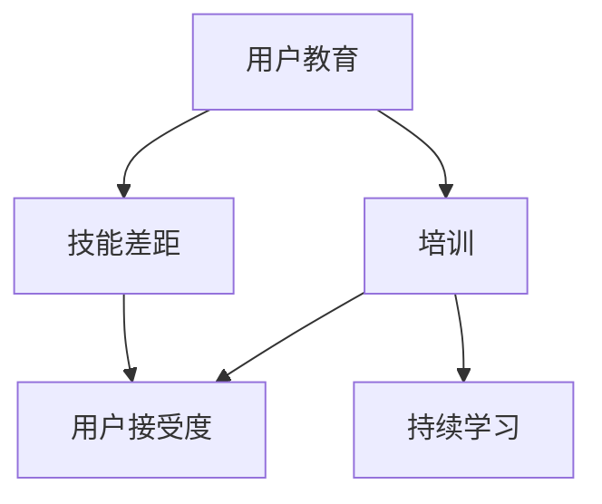

                 

# 自动化创业中的用户教育与培训

## 1. 背景介绍

在当今快速变化的商业环境中，自动化技术（如人工智能、机器学习、机器人流程自动化等）已成为推动企业创新和增长的关键驱动力。然而，成功的自动化转型不仅依赖于技术的实施，还依赖于用户的理解和接受。用户教育与培训是自动化创业中的重要组成部分，它可以帮助用户快速掌握新技术，最大化地发挥其商业价值。

### 1.1 问题由来

随着技术的不断发展，越来越多的企业开始将自动化技术引入其业务流程中，以提高效率、降低成本、提升客户体验。然而，很多企业在实施自动化过程中遇到了障碍，主要原因如下：

- **用户抵触**：自动化技术的变化可能使一些用户感到不安，尤其是那些对技术不熟悉或对变化适应能力较弱的员工。
- **技能差距**：新的自动化系统可能需要员工掌握新的技能和知识，这可能导致现有员工无法快速适应。
- **沟通不足**：技术团队和业务团队之间的沟通不畅，使得用户无法理解新技术的实际应用价值。

### 1.2 问题核心关键点

为解决上述问题，用户教育与培训应包括以下几个关键点：

- **明确目标**：定义用户教育与培训的具体目标，如提升用户对新技术的接受度、提高工作效率等。
- **需求分析**：了解用户的实际需求和痛点，定制化培训内容。
- **多样化培训**：采用多种培训方式，如在线课程、工作坊、现场培训等，以满足不同用户的需求。
- **持续反馈**：定期收集用户反馈，及时调整培训内容和方法，以确保培训的有效性。

### 1.3 问题研究意义

用户教育与培训对自动化创业的成功至关重要。它不仅可以帮助用户快速适应新技术，还可以提升用户体验，从而促进企业的整体增长。具体意义包括：

- **提升用户满意度**：通过教育与培训，用户可以更自信地使用自动化系统，从而提升其满意度和工作效率。
- **降低实施成本**：良好的培训可以减少因用户不熟悉新技术而导致的错误和调整成本，提高自动化系统的实施效率。
- **加速企业转型**：通过系统的培训，员工可以快速掌握自动化工具，加速企业的数字化转型进程。

## 2. 核心概念与联系

### 2.1 核心概念概述

为更好地理解用户教育与培训的原理和实施方法，本节将介绍几个关键概念及其联系：

- **用户教育（User Education）**：指通过培训和指导，使用户理解自动化工具的功能和使用方法，提高其使用效率和效果的过程。
- **培训（Training）**：通过有组织的教学活动，向用户传授特定技能和知识，使其能够有效地使用自动化工具。
- **用户接受度（User Adoption）**：用户对新技术的接受和使用的程度，是衡量用户教育与培训效果的重要指标。
- **技能差距（Skill Gap）**：用户当前技能与新技术要求之间的差距，需要通过培训来弥补。
- **持续学习（Continuous Learning）**：自动化创业中，用户需不断学习和适应新的技术变化，保持技能更新。

这些概念之间的联系可以通过以下Mermaid流程图来展示：



这个流程图展示了用户教育与培训的逻辑关系：

1. 用户教育通过培训帮助用户弥补技能差距。
2. 培训提升用户接受度，使其更好地使用自动化工具。
3. 持续学习帮助用户不断更新技能，适应技术变化。

## 3. 核心算法原理 & 具体操作步骤
### 3.1 算法原理概述

用户教育与培训的原理基于学习理论和行为学，通过有组织、系统的培训活动，帮助用户掌握新技术，提升其使用效率和效果。以下是用户教育与培训的核心算法原理：

1. **需求分析**：通过问卷调查、访谈等方式，收集用户的实际需求和痛点，定制化培训内容。
2. **培训设计**：根据需求分析结果，设计具体的培训计划，包括培训方式、内容、时间等。
3. **实施培训**：通过在线课程、工作坊、现场培训等形式，向用户传授特定技能和知识。
4. **评估反馈**：定期收集用户反馈，评估培训效果，并根据反馈调整培训内容和方法。
5. **持续改进**：根据用户的反馈和培训效果，持续改进培训计划，以确保培训的有效性。

### 3.2 算法步骤详解

以下是一个详细的用户教育与培训算法步骤：

**Step 1: 需求分析**
- 通过问卷调查、访谈等方式，收集用户的实际需求和痛点，识别技能差距。
- 分析用户的基本背景信息，如职位、职责、技术水平等。
- 设计调查问卷，包含有关自动化工具使用频率、痛点、需求等方面的问题。

**Step 2: 培训设计**
- 根据需求分析结果，设计具体的培训计划。
- 确定培训方式，如在线课程、工作坊、现场培训等。
- 制定详细的培训大纲，包括培训目标、内容、时间等。
- 选择合适的培训工具和平台，如LMS（学习管理系统）等。

**Step 3: 实施培训**
- 组织培训活动，向用户传授特定技能和知识。
- 通过在线课程，提供灵活的培训方式，让用户随时随地学习。
- 举办工作坊和现场培训，提供面对面的交流和学习机会。
- 提供实践机会，让用户通过实际操作，巩固所学知识。

**Step 4: 评估反馈**
- 定期收集用户反馈，评估培训效果。
- 通过问卷调查、访谈等方式，了解用户对培训内容的满意度。
- 分析培训前后的用户行为变化，评估培训效果。
- 根据反馈，调整培训内容和方式，以提高培训效果。

**Step 5: 持续改进**
- 根据用户的反馈和培训效果，持续改进培训计划。
- 定期更新培训内容，引入最新技术变化和最佳实践。
- 提供持续学习资源，如在线文档、社区论坛等，帮助用户不断更新技能。

### 3.3 算法优缺点

用户教育与培训的算法具有以下优点：

1. **提升用户满意度**：通过系统化的培训，用户可以更自信地使用自动化工具，提高其满意度和工作效率。
2. **降低实施成本**：良好的培训可以减少因用户不熟悉新技术而导致的错误和调整成本，提高自动化系统的实施效率。
3. **加速企业转型**：通过系统的培训，员工可以快速掌握自动化工具，加速企业的数字化转型进程。

同时，该算法也存在一定的局限性：

1. **时间成本高**：培训需要投入大量时间和资源，尤其是面对大量用户的培训时，成本较高。
2. **培训效果不一**：不同用户的需求和技能水平不同，单一的培训方式可能无法满足所有用户的需求。
3. **培训内容更新快**：自动化技术快速变化，培训内容需要频繁更新，以保持其时效性和实用性。

### 3.4 算法应用领域

用户教育与培训的算法在多个领域中得到广泛应用，具体如下：

- **制造业自动化**：通过培训，帮助操作员快速掌握自动化设备的使用方法，提升生产效率。
- **金融服务**：为金融从业人员提供新技术的培训，提升其处理客户需求和交易的能力。
- **医疗健康**：为医护人员提供电子健康记录系统、诊断工具等自动化工具的培训，提高医疗服务的质量和效率。
- **教育技术**：为教师和学生提供新的教育技术工具的培训，提升教学质量和学生学习效果。
- **物流管理**：为物流从业人员提供自动化仓储、配送系统的培训，提高物流效率和准确性。

## 4. 数学模型和公式 & 详细讲解  
### 4.1 数学模型构建

用户教育与培训的效果可以通过以下数学模型来表示：

$$
E = f(C, T, M, P)
$$

其中：
- $E$：用户教育与培训的效果。
- $C$：用户当前的技能水平。
- $T$：培训的质量和内容。
- $M$：用户的接受度和学习动机。
- $P$：培训的实施方式和支持环境。

### 4.2 公式推导过程

通过以上模型，可以推导出以下公式：

$$
E = C \times T \times M \times P
$$

- $C$：用户当前技能水平越高，其学习效果越好。
- $T$：培训内容和方法越适合用户需求，培训效果越好。
- $M$：用户的学习动机越强，其学习效果越好。
- $P$：培训的实施方式和支持环境越有利于用户，其学习效果越好。

### 4.3 案例分析与讲解

以制造业自动化培训为例，分析用户教育与培训的效果：

- 假设用户当前技能水平为 $C=60$（满分100）。
- 培训内容和方法质量为 $T=90$。
- 用户的接受度和学习动机为 $M=80$。
- 培训的实施方式和支持环境为 $P=85$。

代入公式：

$$
E = 60 \times 90 \times 80 \times 85 = 405000
$$

即用户教育与培训的效果为405000。

## 5. 项目实践：代码实例和详细解释说明
### 5.1 开发环境搭建

在进行用户教育与培训的实践前，我们需要准备好开发环境。以下是使用Python进行开发的环境配置流程：

1. 安装Anaconda：从官网下载并安装Anaconda，用于创建独立的Python环境。

2. 创建并激活虚拟环境：
```bash
conda create -n edutrain python=3.8 
conda activate edutrain
```

3. 安装必要的库：
```bash
pip install pandas numpy matplotlib sklearn
```

4. 安装在线培训平台：
```bash
pip install django
```

完成上述步骤后，即可在`edutrain`环境中开始用户教育与培训的开发。

### 5.2 源代码详细实现

以下是一个简单的用户教育与培训系统的实现示例：

```python
from django import forms
from django.db import models
from django.contrib.auth.models import User

class TrainingSession(models.Model):
    name = models.CharField(max_length=100)
    description = models.TextField()
    start_date = models.DateField()
    end_date = models.DateField()
    trainer = models.ForeignKey(User, on_delete=models.CASCADE)

class Participant(models.Model):
    user = models.OneToOneField(User, on_delete=models.CASCADE)
    training_session = models.ForeignKey(TrainingSession, on_delete=models.CASCADE)

class Feedback(models.Model):
    participant = models.ForeignKey(Participant, on_delete=models.CASCADE)
    score = models.IntegerField()
    comment = models.TextField()

class FeedbackForm(forms.Form):
    score = forms.IntegerField(min_value=1, max_value=5)
    comment = forms.CharField(max_length=200)

    def clean(self):
        if self.cleaned_data['score'] < 1:
            raise forms.ValidationError("Score must be at least 1")
        return self.cleaned_data
```

该示例实现了用户教育与培训的基本功能，包括：

- **培训会话管理**：创建和管理培训会话。
- **参与者管理**：添加和管理参与者，记录其培训记录。
- **反馈收集**：收集参与者对培训的反馈。

### 5.3 代码解读与分析

让我们再详细解读一下关键代码的实现细节：

**TrainingSession类**：
- `name`字段：培训会话的名称。
- `description`字段：培训会话的描述。
- `start_date`和`end_date`字段：培训会话的起始和结束日期。
- `trainer`字段：培训会话的主讲人，通过外键关联User模型。

**Participant类**：
- `user`字段：参与者的用户信息，通过OneToOneField关联User模型。
- `training_session`字段：参与者参与的培训会话，通过外键关联TrainingSession模型。

**Feedback类**：
- `participant`字段：反馈对应的参与者，通过外键关联Participant模型。
- `score`字段：反馈评分，用于评估培训效果。
- `comment`字段：反馈评论，用于收集用户意见。

**FeedbackForm类**：
- `score`字段：反馈评分，使用正则表达式验证评分范围。
- `comment`字段：反馈评论，最大长度为200。

该代码框架提供了一个基本的数据库模型，用于记录培训会话、参与者和反馈信息。在实际应用中，还需要进一步开发相关的Web界面、API接口等，以支持更复杂的培训需求。

### 5.4 运行结果展示

运行上述代码后，可以在Django管理界面中创建、修改和查询培训会话、参与者和反馈信息。例如，添加一个新的培训会话：

1. 在Django管理界面中，点击"TrainingSession"选项。
2. 点击"Add Training Session"按钮。
3. 填写培训会话的名称、描述、开始和结束日期，选择主讲人。
4. 点击"Save"按钮，保存培训会话。

## 6. 实际应用场景
### 6.1 智能客服系统

智能客服系统是用户教育与培训在自动化创业中应用的重要场景之一。传统客服系统依赖人工客服，效率低下，成本高昂。通过培训，客服人员可以快速掌握智能客服系统，提升其工作效率和客户满意度。

具体实现如下：

- 收集客服人员的历史服务记录，分析常见问题和服务流程。
- 设计培训内容，涵盖智能客服系统的使用方法、常见问题解答、业务流程等。
- 通过在线课程和工作坊，向客服人员传授相关知识，并提供实际操作机会。
- 定期收集客服人员的反馈，评估培训效果，并根据反馈调整培训内容。

### 6.2 金融服务

金融服务行业对自动化技术的需求日益增长，通过培训可以提高金融从业人员的技术水平和业务能力。

具体实现如下：

- 收集金融从业人员的工作需求和痛点，设计个性化的培训内容。
- 提供金融行业专用的自动化工具，如数据分析、风险管理、客户服务等。
- 通过在线课程和工作坊，向金融从业人员传授相关知识，并提供实际操作机会。
- 定期收集金融从业人员的反馈，评估培训效果，并根据反馈调整培训内容。

### 6.3 医疗健康

医疗健康行业对自动化技术的需求不断增加，通过培训可以提高医护人员的工作效率和医疗服务的质量。

具体实现如下：

- 收集医护人员的工作需求和痛点，设计个性化的培训内容。
- 提供电子健康记录系统、诊断工具等自动化工具。
- 通过在线课程和工作坊，向医护人员传授相关知识，并提供实际操作机会。
- 定期收集医护人员的反馈，评估培训效果，并根据反馈调整培训内容。

## 7. 工具和资源推荐
### 7.1 学习资源推荐

为了帮助开发者系统掌握用户教育与培训的理论基础和实践技巧，这里推荐一些优质的学习资源：

1. **《用户教育与培训》书籍**：全面介绍用户教育与培训的基本概念、方法和实践经验。
2. **LMS平台**：如Moodle、Canvas等，提供灵活的在线培训方式，支持丰富的培训资源和互动功能。
3. **在线课程平台**：如Coursera、Udacity等，提供大量高质量的培训课程，涵盖不同领域的自动化工具。
4. **社区论坛**：如Stack Overflow、GitHub等，提供技术交流和问题解决的平台，促进用户之间的经验分享。
5. **培训评估工具**：如Kahoot、Quizizz等，提供互动式培训测试，评估用户的学习效果。

通过对这些资源的学习实践，相信你一定能够快速掌握用户教育与培训的精髓，并用于解决实际的自动化问题。

### 7.2 开发工具推荐

高效的开发离不开优秀的工具支持。以下是几款用于用户教育与培训开发的常用工具：

1. **Python**：灵活动态的编程语言，支持大量第三方库和框架，适合快速迭代研究。
2. **Django**：流行的Python Web框架，提供丰富的功能，支持快速开发和管理用户教育与培训系统。
3. **LMS平台**：如Moodle、Canvas等，提供灵活的在线培训方式，支持丰富的培训资源和互动功能。
4. **学习管理系统**：如Moodle、Canvas等，提供完整的培训管理功能，支持课程设计、测试评估、用户管理等。
5. **在线课程平台**：如Coursera、Udacity等，提供大量高质量的培训课程，涵盖不同领域的自动化工具。
6. **反馈收集工具**：如Google Forms、SurveyMonkey等，提供便捷的反馈收集功能，支持多种问卷类型和分析方法。

合理利用这些工具，可以显著提升用户教育与培训任务的开发效率，加快创新迭代的步伐。

### 7.3 相关论文推荐

用户教育与培训的理论与实践不断发展，以下是几篇奠基性的相关论文，推荐阅读：

1. **《用户教育与培训的理论与实践》**：系统介绍用户教育与培训的基本概念、方法和实践经验。
2. **《在线学习与培训系统的设计与实现》**：介绍在线学习与培训系统的设计与实现方法，涵盖培训内容、学习方式、评估方法等方面。
3. **《用户接受度与培训效果评估》**：研究用户接受度与培训效果的关系，提出有效的培训评估方法。
4. **《自动化创业中的用户教育与培训》**：探讨自动化创业中用户教育与培训的实践方法，分析其影响因素和实施策略。

这些论文代表了大语言模型微调技术的发展脉络。通过学习这些前沿成果，可以帮助研究者把握学科前进方向，激发更多的创新灵感。

## 8. 总结：未来发展趋势与挑战
### 8.1 总结

本文对用户教育与培训的原理和实施方法进行了全面系统的介绍。首先阐述了用户教育与培训在自动化创业中的重要性和具体实现方法。其次，从原理到实践，详细讲解了用户教育与培训的数学模型和操作步骤，给出了完整的代码实例。同时，本文还探讨了用户教育与培训在多个行业领域的应用场景，展示了其巨大的潜力和应用价值。最后，本文精选了用户教育与培训的学习资源和开发工具，力求为读者提供全方位的技术指引。

通过本文的系统梳理，可以看到，用户教育与培训在自动化创业中的重要性不容忽视。它不仅可以帮助用户快速掌握新技术，提升用户体验，还可以降低实施成本，加速企业转型。未来，随着技术的不断发展和用户需求的多样化，用户教育与培训将迎来更多的挑战和机遇，需要持续改进和创新。

### 8.2 未来发展趋势

展望未来，用户教育与培训的发展趋势如下：

1. **数字化培训**：随着在线学习平台的普及，越来越多的用户教育与培训将转移到线上，提供更加灵活、便捷的学习方式。
2. **个性化培训**：通过数据分析和人工智能技术，根据用户的学习行为和反馈，提供个性化的培训内容，提高培训效果。
3. **持续学习**：随着技术的快速变化，用户需不断学习和适应新的技术变化，持续学习将成为培训的重要组成部分。
4. **混合培训**：结合在线学习和面对面培训，提供多样化的培训方式，满足不同用户的需求。
5. **培训评估**：通过大数据分析和机器学习技术，实时评估培训效果，提供实时的反馈和调整建议。

### 8.3 面临的挑战

尽管用户教育与培训在自动化创业中取得了显著成果，但仍面临诸多挑战：

1. **培训内容更新快**：自动化技术快速变化，培训内容需要频繁更新，以保持其时效性和实用性。
2. **用户接受度不一**：不同用户的需求和技能水平不同，单一的培训方式可能无法满足所有用户的需求。
3. **资源投入高**：培训需要投入大量时间和资源，尤其是面对大量用户的培训时，成本较高。
4. **培训效果评估难**：培训效果评估依赖于用户反馈，难以全面、准确地评估培训效果。

### 8.4 研究展望

面对用户教育与培训所面临的挑战，未来的研究需要在以下几个方面寻求新的突破：

1. **自适应培训**：通过自适应学习技术，根据用户的学习进度和表现，动态调整培训内容和难度，提高培训效果。
2. **实时反馈系统**：开发实时反馈系统，根据用户的学习行为和反馈，提供实时的指导和建议。
3. **混合现实培训**：利用虚拟现实和增强现实技术，提供沉浸式培训体验，提高用户的学习效果。
4. **情感分析**：通过情感分析技术，识别用户的学习情绪和反馈，优化培训内容和方式。
5. **多模态培训**：结合视频、音频、文本等多种模态，提供多感官的培训体验，提升用户的学习效果。

这些研究方向的探索，必将引领用户教育与培训技术迈向更高的台阶，为自动化创业的成功提供坚实的基础。总之，用户教育与培训需要开发者根据具体任务，不断迭代和优化培训计划、内容和方式，方能得到理想的效果。

---

作者：禅与计算机程序设计艺术 / Zen and the Art of Computer Programming

