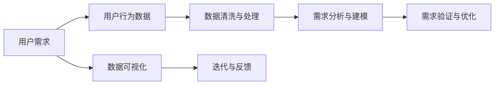

                 

## 1. 背景介绍

在快速发展的数字时代，自动化技术已经成为推动创业成功的关键因素。然而，仅仅依靠技术驱动并不能保证创业的成功。用户需求挖掘（User Requirement Mining）作为自动化创业中的核心环节，其重要性不言而喻。本文将从多个维度深入探讨用户需求挖掘的重要性、方法、工具以及未来发展方向，旨在为正在或计划进行自动化创业的企业和开发者提供切实可行的指导。

### 1.1 问题由来

在传统创业模式中，用户需求的获取往往依赖于市场调研、问卷调查和用户访谈等方法。这些方法耗时长、成本高，且难以实时动态更新。而在自动化创业中，快速迭代和持续优化是核心要求，用户需求的及时获取变得尤为关键。自动化技术虽然可以大幅提升生产效率，但若不能准确把握用户需求，产品仍将面临失败的风险。因此，用户需求挖掘成为了自动化创业中不可或缺的一环。

### 1.2 问题核心关键点

用户需求挖掘的核心在于：通过数据驱动的方法，从用户行为、反馈和市场趋势中提取和分析关键信息，以指导产品的设计、开发和优化。具体而言，以下三个关键点对于用户需求挖掘至关重要：

- **数据采集与处理**：获取用户行为数据，并进行清洗和预处理，为后续分析和挖掘奠定基础。
- **需求分析与建模**：使用机器学习、自然语言处理等技术，从用户数据中提取和构建用户需求模型。
- **需求验证与优化**：通过实验和反馈机制，对用户需求模型进行验证和迭代，以提升模型的准确性和实用性。

## 2. 核心概念与联系

### 2.1 核心概念概述

为更好地理解用户需求挖掘的过程，本节将介绍几个密切相关的核心概念：

- **用户需求**：用户对产品或服务的功能、性能、体验等方面的期望和要求。
- **用户行为数据**：用户在产品或服务中的各种互动行为数据，如点击、浏览、购买等，反映了用户的真实需求和偏好。
- **机器学习**：一种通过数据训练模型、预测未知数据的技术，广泛应用于用户需求挖掘中。
- **自然语言处理（NLP）**：一种处理和分析自然语言文本的技术，用于从用户反馈中提取有价值的信息。
- **数据可视化**：通过图表、图形等直观展示数据结果，帮助分析人员快速理解数据特点和趋势。

这些核心概念之间的逻辑关系可以通过以下Mermaid流程图来展示：



这个流程图展示用户需求挖掘的关键过程：

1. 从用户行为数据中获取用户需求。
2. 清洗和处理数据，去除噪音和异常点。
3. 使用机器学习或NLP技术分析数据，提取和建模用户需求。
4. 验证和优化需求模型，确保其准确性。
5. 利用可视化工具，直观展示结果，便于进一步分析。
6. 结合反馈机制，不断迭代优化需求模型。

## 3. 核心算法原理 & 具体操作步骤

### 3.1 算法原理概述

用户需求挖掘本质上是一个数据驱动的过程，旨在从用户行为数据中提取有价值的信息，以指导产品设计和优化。具体而言，其核心算法原理包括以下几个步骤：

1. **数据采集与处理**：获取用户行为数据，并进行预处理和清洗，为后续分析奠定基础。
2. **特征提取与选择**：从数据中提取有用的特征，使用机器学习算法进行特征选择，去除无关和冗余信息。
3. **需求建模**：使用分类、聚类、关联规则等算法，构建用户需求模型，描述用户需求的分布和特征。
4. **需求验证与优化**：通过实验和反馈机制，评估模型性能，并不断迭代优化，提升模型的准确性和实用性。

### 3.2 算法步骤详解

用户需求挖掘的算法步骤如下：

**Step 1: 数据采集与处理**
- 使用API或Web爬虫等工具，从用户行为数据中获取相关数据。
- 对数据进行清洗和预处理，去除异常值和噪音。

**Step 2: 特征提取与选择**
- 使用TF-IDF、PCA、LDA等技术，从原始数据中提取有用的特征。
- 使用机器学习算法（如Lasso、SVM等）进行特征选择，去除无关和冗余信息。

**Step 3: 需求建模**
- 使用分类算法（如KNN、SVM等）对用户需求进行分类，构建用户需求模型。
- 使用聚类算法（如K-means、DBSCAN等）对用户需求进行分组，发现用户需求之间的相似性。
- 使用关联规则算法（如Apriori、FP-Growth等）分析用户需求之间的关系，发现高频出现的关联规则。

**Step 4: 需求验证与优化**
- 使用交叉验证等方法评估模型性能，确保模型的准确性和鲁棒性。
- 结合用户反馈，不断迭代优化需求模型，提升模型的实用性和普适性。

### 3.3 算法优缺点

用户需求挖掘具有以下优点：
1. **数据驱动**：通过分析用户行为数据，避免主观偏见，使需求分析更加客观和精准。
2. **实时动态**：用户需求挖掘可以快速迭代，实时更新需求模型，保持产品与市场趋势的同步。
3. **多维度分析**：能够从多个维度（如用户行为、情感、时间等）全面分析用户需求，提供更丰富的信息。

同时，该方法也存在一些局限性：
1. **数据质量依赖**：用户需求挖掘的效果很大程度上依赖于数据的质量和完整性，数据噪音和缺失可能影响结果。
2. **算法复杂性**：用户需求挖掘涉及多种算法，需要一定的技术储备和实现难度。
3. **隐私保护**：在处理用户数据时，需要严格遵守隐私保护法律法规，确保用户隐私不被泄露。

尽管存在这些局限性，用户需求挖掘作为一种基于数据驱动的方法，已经成为了自动化创业中不可或缺的一环。

### 3.4 算法应用领域

用户需求挖掘技术在自动化创业中具有广泛的应用，例如：

- **电子商务**：通过分析用户浏览、购买行为，挖掘用户需求，指导商品推荐和个性化营销。
- **金融科技**：从用户交易数据中提取需求，优化金融产品设计，提升用户体验。
- **教育科技**：分析学生学习行为，挖掘学习需求，提供个性化学习方案和智能辅导。
- **医疗健康**：从患者咨询和诊疗数据中提取需求，优化医疗服务，提升诊疗效果。

## 4. 数学模型和公式 & 详细讲解 & 举例说明

### 4.1 数学模型构建

本节将使用数学语言对用户需求挖掘的过程进行更加严格的刻画。

假设用户需求数据集为 $D=\{(x_i,y_i)\}_{i=1}^N$，其中 $x_i$ 为原始数据，$y_i$ 为需求标签。目标是构建一个模型 $M_{\theta}(x)$，使得 $y_i$ 在 $x_i$ 上得到最优预测。

定义模型 $M_{\theta}$ 在输入 $x$ 上的损失函数为 $\ell(M_{\theta}(x),y)$，则在数据集 $D$ 上的经验风险为：

$$
\mathcal{L}(\theta) = \frac{1}{N} \sum_{i=1}^N \ell(M_{\theta}(x_i),y_i)
$$

在实践中，我们通常使用基于梯度的优化算法（如SGD、Adam等）来近似求解上述最优化问题。设 $\eta$ 为学习率，$\lambda$ 为正则化系数，则参数的更新公式为：

$$
\theta \leftarrow \theta - \eta \nabla_{\theta}\mathcal{L}(\theta) - \eta\lambda\theta
$$

其中 $\nabla_{\theta}\mathcal{L}(\theta)$ 为损失函数对参数 $\theta$ 的梯度，可通过反向传播算法高效计算。

### 4.2 公式推导过程

以下我们以用户需求分类任务为例，推导分类算法（如KNN）的损失函数及其梯度的计算公式。

假设模型 $M_{\theta}$ 在输入 $x$ 上的输出为 $\hat{y}=M_{\theta}(x)$，表示对 $x$ 进行 $C$ 类分类的预测。真实标签 $y \in \{1,2,...,C\}$。则交叉熵损失函数定义为：

$$
\ell(M_{\theta}(x),y) = -\sum_{c=1}^C y_c \log \hat{y}_c
$$

将其代入经验风险公式，得：

$$
\mathcal{L}(\theta) = -\frac{1}{N}\sum_{i=1}^N \sum_{c=1}^C y_{ic} \log \hat{y}_{ic}
$$

根据链式法则，损失函数对参数 $\theta_k$ 的梯度为：

$$
\frac{\partial \mathcal{L}(\theta)}{\partial \theta_k} = -\frac{1}{N}\sum_{i=1}^N \sum_{c=1}^C (\frac{y_{ic}}{\hat{y}_{ic}}-\frac{1-y_{ic}}{1-\hat{y}_{ic}}) \frac{\partial \hat{y}(x_i)}{\partial \theta_k}
$$

其中 $\frac{\partial \hat{y}(x_i)}{\partial \theta_k}$ 可进一步递归展开，利用自动微分技术完成计算。

### 4.3 案例分析与讲解

假设有一个电商网站的推荐系统，希望通过用户行为数据挖掘用户的购买需求。我们选取用户浏览记录、购买记录、评价记录等作为原始数据 $x_i$，需求标签 $y_i$ 为用户购买产品的类别。使用KNN算法进行分类，得到用户需求的模型 $M_{\theta}$。具体步骤如下：

1. **数据采集与处理**：从电商网站的API获取用户浏览记录和购买记录，并进行清洗和预处理，去除异常值和噪音。
2. **特征提取与选择**：使用TF-IDF技术提取用户浏览记录和购买记录中的关键词，去除无关和冗余信息。
3. **需求建模**：使用KNN算法对用户需求进行分类，构建用户需求模型。
4. **需求验证与优化**：使用交叉验证方法评估模型性能，结合用户反馈不断迭代优化需求模型。

通过以上步骤，电商网站可以实时获取用户购买需求，动态调整商品推荐策略，提升用户满意度和转化率。

## 5. 项目实践：代码实例和详细解释说明

### 5.1 开发环境搭建

在进行用户需求挖掘实践前，我们需要准备好开发环境。以下是使用Python进行Scikit-Learn和TensorFlow开发的Python环境配置流程：

1. 安装Anaconda：从官网下载并安装Anaconda，用于创建独立的Python环境。

2. 创建并激活虚拟环境：
```bash
conda create -n userdemand-env python=3.8 
conda activate userdemand-env
```

3. 安装Scikit-Learn和TensorFlow：根据CUDA版本，从官网获取对应的安装命令。例如：
```bash
conda install scikit-learn tensorboard
```

4. 安装各类工具包：
```bash
pip install pandas numpy joblib tqdm jupyter notebook
```

完成上述步骤后，即可在`userdemand-env`环境中开始用户需求挖掘实践。

### 5.2 源代码详细实现

这里我们以用户需求分类任务为例，给出使用Scikit-Learn对用户需求进行分类的Python代码实现。

首先，定义用户需求数据集和需求标签：

```python
from sklearn.model_selection import train_test_split
from sklearn.preprocessing import StandardScaler
from sklearn.neighbors import KNeighborsClassifier

# 假设数据集为DataFrame形式，包含用户浏览记录和购买记录
data = pd.read_csv('user_data.csv')

# 需求标签为0-5的数字，代表不同类别的商品
labels = data['category'].map(lambda x: int(x))

# 划分训练集和测试集
train_data, test_data, train_labels, test_labels = train_test_split(data.drop('category', axis=1), labels, test_size=0.2, random_state=42)
```

然后，进行数据清洗和预处理：

```python
# 数据清洗：去除缺失值和异常值
train_data = train_data.dropna()
test_data = test_data.dropna()

# 数据标准化：将所有特征值缩放到0-1之间
scaler = StandardScaler()
train_data = scaler.fit_transform(train_data)
test_data = scaler.transform(test_data)
```

接着，进行特征选择和建模：

```python
# 特征选择：使用TF-IDF提取关键词
from sklearn.feature_extraction.text import TfidfVectorizer

vectorizer = TfidfVectorizer(stop_words='english')
train_features = vectorizer.fit_transform(train_data['description'])
test_features = vectorizer.transform(test_data['description'])

# 使用KNN算法进行分类
model = KNeighborsClassifier(n_neighbors=5)
model.fit(train_features, train_labels)
```

最后，进行模型评估和优化：

```python
# 评估模型性能
from sklearn.metrics import classification_report

y_pred = model.predict(test_features)
print(classification_report(test_labels, y_pred))

# 获取模型参数
params = model.get_params()
print(params)

# 更新模型参数
model.set_params(**params)
model.fit(train_features, train_labels)
```

以上就是使用Scikit-Learn对用户需求进行分类的完整代码实现。可以看到，通过Scikit-Learn，我们能够快速构建和优化用户需求分类模型。

### 5.3 代码解读与分析

让我们再详细解读一下关键代码的实现细节：

**数据处理**：
- `train_test_split`函数：用于划分训练集和测试集。
- `StandardScaler`类：用于对数据进行标准化处理，提升模型性能。

**特征提取与选择**：
- `TfidfVectorizer`类：用于提取关键词，并进行TF-IDF转换。
- `n_neighbors`参数：用于设置KNN算法中的邻居数。

**模型评估与优化**：
- `classification_report`函数：用于评估模型性能，包括精确度、召回率、F1分数等。
- `get_params`和`set_params`方法：用于获取和更新模型参数。

**整体流程**：
- 数据清洗：去除缺失值和异常值，确保数据质量。
- 数据标准化：对特征值进行标准化处理，提升模型效果。
- 特征提取：使用TF-IDF提取关键词，减少特征维度。
- 模型构建：使用KNN算法进行分类。
- 模型评估：评估模型性能，结合用户反馈进行优化。

## 6. 实际应用场景

### 6.1 智能推荐系统

智能推荐系统是用户需求挖掘的重要应用场景。通过对用户行为数据的分析，可以准确把握用户的兴趣和偏好，从而提供个性化的商品推荐。

以电商网站为例，用户在网站上的浏览、点击、购买等行为数据，可以被用来挖掘用户的购买需求。通过构建用户需求模型，电商网站可以实时调整推荐策略，提升用户满意度和转化率。具体而言，可以采用以下步骤：

1. **数据采集**：从电商网站的日志中获取用户浏览、点击、购买记录。
2. **数据预处理**：对数据进行清洗和标准化处理。
3. **需求建模**：使用机器学习算法（如协同过滤、KNN等）对用户需求进行分类，构建用户需求模型。
4. **需求验证与优化**：通过交叉验证等方法评估模型性能，结合用户反馈不断迭代优化需求模型。
5. **推荐策略调整**：根据用户需求模型，调整推荐策略，推荐相关商品。

通过以上步骤，电商网站可以实时获取用户购买需求，动态调整推荐策略，提升用户满意度和转化率。

### 6.2 个性化健康管理

在健康管理领域，通过用户需求挖掘可以提供个性化的健康建议和服务，提升用户健康管理的效果。

以智能健康管理App为例，可以从用户的健康数据（如运动量、睡眠质量、饮食情况等）中挖掘用户的需求。通过构建用户需求模型，App可以实时提供个性化的健康建议，如运动计划、饮食建议、睡眠建议等。具体而言，可以采用以下步骤：

1. **数据采集**：从用户的智能设备（如智能手表、智能床等）中获取健康数据。
2. **数据预处理**：对数据进行清洗和标准化处理。
3. **需求建模**：使用机器学习算法（如聚类、分类等）对用户需求进行建模，发现不同用户的需求特征。
4. **需求验证与优化**：通过交叉验证等方法评估模型性能，结合用户反馈不断迭代优化需求模型。
5. **个性化服务提供**：根据用户需求模型，提供个性化的健康建议和服务。

通过以上步骤，智能健康管理App可以实时获取用户健康需求，动态提供个性化健康建议，提升用户健康管理效果。

### 6.3 教育科技

在教育科技领域，通过用户需求挖掘可以提供个性化的学习方案和智能辅导，提升教育效果。

以在线教育平台为例，可以从学生的学习行为数据中挖掘学习需求。通过构建学生需求模型，平台可以实时提供个性化的学习方案和智能辅导，如推荐适合的课程、调整学习进度、提供学习建议等。具体而言，可以采用以下步骤：

1. **数据采集**：从在线教育平台中获取学生的学习行为数据（如学习时间、答题情况等）。
2. **数据预处理**：对数据进行清洗和标准化处理。
3. **需求建模**：使用机器学习算法（如聚类、分类等）对学生需求进行建模，发现不同学生的需求特征。
4. **需求验证与优化**：通过交叉验证等方法评估模型性能，结合学生反馈不断迭代优化需求模型。
5. **个性化学习方案提供**：根据学生需求模型，提供个性化的学习方案和智能辅导。

通过以上步骤，在线教育平台可以实时获取学生学习需求，动态提供个性化学习方案，提升教育效果。

### 6.4 未来应用展望

随着用户需求挖掘技术的不断发展，其在自动化创业中的应用也将不断扩展和深化。未来，用户需求挖掘将在更多领域得到应用，为自动化创业带来新的突破。

- **智能客服**：通过分析用户的交互记录，挖掘用户需求，提供个性化的服务解决方案。
- **金融科技**：从用户交易数据中提取需求，优化金融产品设计，提升用户体验。
- **医疗健康**：从患者咨询和诊疗数据中提取需求，优化医疗服务，提升诊疗效果。
- **智慧城市**：从市民的出行、娱乐、购物等行为数据中提取需求，优化城市管理和服务。

## 7. 工具和资源推荐

### 7.1 学习资源推荐

为了帮助开发者系统掌握用户需求挖掘的理论基础和实践技巧，这里推荐一些优质的学习资源：

1. 《Python数据科学手册》：一本系统介绍Python数据科学库的书籍，包括Scikit-Learn、TensorFlow等。
2. 《机器学习实战》：一本实践性很强的机器学习入门书籍，包含大量实例代码和项目案例。
3. Coursera的《机器学习》课程：由斯坦福大学Andrew Ng教授主讲，系统讲解机器学习理论和实践。
4 Kaggle上的相关竞赛和项目：Kaggle是一个数据科学社区，包含大量用户需求挖掘相关的竞赛和项目，适合实战练习。
5 TensorFlow和Scikit-Learn官方文档：这两个库的官方文档详细介绍了各种算法的使用方法和参数调优技巧。

通过对这些资源的学习实践，相信你一定能够快速掌握用户需求挖掘的精髓，并用于解决实际的自动化创业问题。

### 7.2 开发工具推荐

高效的开发离不开优秀的工具支持。以下是几款用于用户需求挖掘开发的常用工具：

1. Jupyter Notebook：一个交互式的Python开发环境，支持代码编写、数据可视化等功能。
2. Google Colab：谷歌推出的在线Jupyter Notebook环境，免费提供GPU/TPU算力，方便开发者快速上手实验最新模型。
3. Scikit-Learn：一个基于Python的机器学习库，提供多种算法实现，易于使用和调优。
4. TensorFlow：由谷歌主导开发的开源深度学习框架，适合大规模工程应用。
5. Weights & Biases：模型训练的实验跟踪工具，可以记录和可视化模型训练过程中的各项指标，方便对比和调优。

合理利用这些工具，可以显著提升用户需求挖掘任务的开发效率，加快创新迭代的步伐。

### 7.3 相关论文推荐

用户需求挖掘技术的发展源于学界的持续研究。以下是几篇奠基性的相关论文，推荐阅读：

1. "Mining User Preferences with Textual Data"：介绍从用户评论中提取需求的技术。
2. "Pattern Mining: Techniques and Applications"：涵盖多种数据挖掘方法，包括关联规则、聚类等。
3. "A Survey of Techniques for Personalized Recommendation"：全面回顾推荐系统中的个性化技术。
4 "User Modeling in Recommendation Systems"：介绍用户建模方法和推荐系统。

这些论文代表了大用户需求挖掘技术的发展脉络。通过学习这些前沿成果，可以帮助研究者把握学科前进方向，激发更多的创新灵感。

## 8. 总结：未来发展趋势与挑战

### 8.1 研究成果总结

本文对用户需求挖掘的重要性、方法、工具以及未来发展方向进行了全面系统的介绍。首先阐述了用户需求挖掘在自动化创业中的核心作用，明确了数据驱动的需求挖掘方法的独特价值。其次，从原理到实践，详细讲解了用户需求挖掘的数学模型和算法步骤，给出了用户需求挖掘任务开发的完整代码实例。同时，本文还广泛探讨了用户需求挖掘方法在多个行业领域的应用前景，展示了其广阔的发展空间。此外，本文精选了用户需求挖掘技术的学习资源、开发工具和相关论文，力求为读者提供全方位的技术指引。

通过本文的系统梳理，可以看到，用户需求挖掘作为一种基于数据驱动的方法，已经成为自动化创业中不可或缺的一环。其在电子商务、健康管理、教育科技等领域的应用，显著提升了用户体验和业务效果。未来，伴随数据科学的不断进步，用户需求挖掘技术将进一步发展，为自动化创业带来更多机遇和挑战。

### 8.2 未来发展趋势

展望未来，用户需求挖掘技术将呈现以下几个发展趋势：

1. **多模态数据融合**：除了文本数据，未来将更多地利用图像、语音、视频等多模态数据，进行更加全面和深入的需求挖掘。
2. **实时动态分析**：随着数据采集和处理技术的进步，用户需求挖掘将更加实时动态，能够及时反映用户需求的变化。
3. **深度学习应用**：深度学习技术在用户需求挖掘中的应用将更加广泛，提升模型的准确性和泛化能力。
4. **分布式计算**：分布式计算技术将帮助处理大规模数据，提升用户需求挖掘的效率和可靠性。
5. **增强学习**：结合增强学习技术，通过与用户交互的反馈机制，动态优化需求模型，提升用户满意度。

这些趋势将使用户需求挖掘技术更加全面、高效和智能，为自动化创业带来更多的机遇和可能性。

### 8.3 面临的挑战

尽管用户需求挖掘技术已经取得了显著进展，但在迈向更加智能化、普适化应用的过程中，仍面临诸多挑战：

1. **数据隐私和安全**：用户需求挖掘涉及大量敏感数据，如何保障数据隐私和安全是一个重要问题。
2. **数据质量与完整性**：用户需求挖掘的效果很大程度上依赖于数据的质量和完整性，数据噪音和缺失可能影响结果。
3. **算法复杂性与成本**：用户需求挖掘涉及多种算法，需要一定的技术储备和实现难度，且计算成本较高。
4. **模型可解释性与鲁棒性**：用户需求挖掘模型的可解释性和鲁棒性需要进一步提升，以应对复杂多变的环境和用户需求。

这些挑战需要学术界和工业界共同努力，不断探索和优化用户需求挖掘技术，才能在自动化创业中发挥更大的作用。

### 8.4 研究展望

面对用户需求挖掘所面临的种种挑战，未来的研究需要在以下几个方面寻求新的突破：

1. **隐私保护**：开发隐私保护算法，确保用户数据的安全和匿名性。
2. **数据增强**：利用数据增强技术，提升数据质量和完整性，减少噪音和缺失。
3. **算法优化**：优化算法模型，降低计算复杂性和成本，提升效率和效果。
4. **模型解释性**：增强用户需求挖掘模型的可解释性，帮助用户理解和信任模型结果。
5. **跨模态融合**：将不同模态的数据进行融合，提升用户需求挖掘的全面性和准确性。

这些研究方向将推动用户需求挖掘技术向更加智能、普适和可靠的方向发展，为自动化创业提供更有力的支持。

## 9. 附录：常见问题与解答

**Q1：用户需求挖掘是否适用于所有自动化创业项目？**

A: 用户需求挖掘在大多数自动化创业项目中都能取得较好的效果，特别是对于需要精准把握用户需求的场景，如电子商务、健康管理、教育科技等。但对于一些依赖于特定领域知识的任务，如金融分析、医疗诊断等，可能需要结合领域专家知识和专业知识进行需求挖掘。

**Q2：如何选择合适的用户需求挖掘算法？**

A: 用户需求挖掘算法的选择应根据具体任务和数据特点进行。一般而言，分类算法（如KNN、SVM等）适用于需求预测和分类任务；聚类算法（如K-means、DBSCAN等）适用于需求分组和分类任务；关联规则算法（如Apriori、FP-Growth等）适用于需求关联分析任务。此外，深度学习技术在用户需求挖掘中的应用也将越来越广泛，提升模型的准确性和泛化能力。

**Q3：用户需求挖掘在落地应用中需要注意哪些问题？**

A: 用户需求挖掘在落地应用中，需要注意以下几个问题：
1. 数据隐私和安全：确保用户数据的安全和匿名性，避免数据泄露和滥用。
2. 数据质量与完整性：确保数据的质量和完整性，避免噪音和缺失影响挖掘效果。
3. 模型可解释性：增强用户需求挖掘模型的可解释性，帮助用户理解和信任模型结果。
4. 实时动态分析：结合实时数据采集和处理技术，进行动态分析和实时优化。

通过在应用中注意这些问题，可以更好地发挥用户需求挖掘在自动化创业中的作用，提升用户体验和业务效果。

**Q4：如何利用用户需求挖掘提升自动化创业项目的成功概率？**

A: 利用用户需求挖掘提升自动化创业项目的成功概率，可以采取以下步骤：
1. 数据采集：从用户行为数据中获取相关数据。
2. 数据处理：对数据进行清洗和标准化处理，确保数据质量。
3. 特征提取：从数据中提取有用的特征，减少无关和冗余信息。
4. 需求建模：使用机器学习算法进行需求建模，描述用户需求的分布和特征。
5. 需求验证与优化：通过实验和反馈机制，评估模型性能，不断迭代优化需求模型。
6. 应用改进：根据用户需求模型，指导产品设计、优化和迭代，提升用户体验和业务效果。

通过以上步骤，可以更好地把握用户需求，提升产品的竞争力和市场响应速度，从而提升自动化创业项目的成功概率。

---

作者：禅与计算机程序设计艺术 / Zen and the Art of Computer Programming

