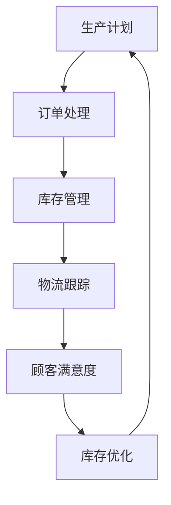

                 

# 自动化工具：智能化管理，提升电商平台供给能力

## 1. 背景介绍

在数字化和电商时代，电商平台不仅需要高效的管理系统以优化运营流程，更需要先进的自动化工具来提升供给能力。自动化工具通过智能化管理，减少人工干预，提升效率，降低成本，成为电商平台竞争力的重要组成部分。本文将探讨如何利用自动化工具来优化电商平台的供给能力，包括库存管理、订单处理、物流跟踪等关键环节。

## 2. 核心概念与联系

### 2.1 核心概念概述

本节将介绍自动化工具在电商平台供应链管理中涉及的核心概念：

- **自动化工具**：使用软件程序实现管理和执行任务的自动化，减少人工操作，提高效率。
- **智能化管理**：通过数据分析、机器学习等技术，实现预测和优化，提升决策精准度。
- **电商平台**：通过互联网提供商品销售、服务购买的在线平台。
- **供应链管理**：涉及商品从生产到消费者手中的全过程管理，包括生产计划、库存管理、订单处理、物流跟踪等环节。

### 2.2 核心概念原理和架构的 Mermaid 流程图



在上述流程图中，各个核心概念之间存在着紧密的联系。生产计划是起点，直接影响订单处理的数量和周期；订单处理的结果直接反馈给库存管理，决定库存水平；物流跟踪保证了订单的按时到达；而顾客满意度则是对整个供应链管理的最终评价，直接驱动库存优化。

## 3. 核心算法原理 & 具体操作步骤

### 3.1 算法原理概述

自动化工具通过智能化管理算法，对电商平台供应链中的各个环节进行优化。算法原理包括但不限于以下几类：

- **预测算法**：利用历史数据和机器学习模型预测未来的订单量和需求。
- **优化算法**：通过线性规划、遗传算法等优化方法，实现资源的最优分配。
- **推荐算法**：使用协同过滤、内容推荐等技术，提高用户的购物体验。
- **调度算法**：通过时间序列分析和调度理论，实现生产计划和物流路径的优化。

### 3.2 算法步骤详解

1. **需求预测**：收集历史订单数据，使用时间序列分析等方法，预测未来的订单量和需求。
2. **库存优化**：根据预测结果，优化库存水平，减少库存成本，确保及时补货。
3. **订单处理**：设计自动化流程，实现订单的快速处理和分配。
4. **物流跟踪**：整合物流公司数据，实现物流信息的实时跟踪和更新。
5. **顾客满意度**：利用数据分析和机器学习模型，评估顾客满意度，优化服务。

### 3.3 算法优缺点

自动化工具在提高电商平台供给能力的同时，也存在以下优缺点：

**优点**：
- **提高效率**：自动化工具可以24小时不间断地运行，减少人工错误和延迟。
- **降低成本**：通过优化库存和物流，减少资源浪费，降低运营成本。
- **提升用户体验**：自动化工具可以快速响应订单需求，提升顾客满意度。

**缺点**：
- **依赖技术**：需要较高的技术门槛和资金投入。
- **灵活性差**：自动化流程一旦设定，难以快速适应市场变化。
- **数据隐私**：需要处理大量敏感数据，可能存在数据泄露风险。

### 3.4 算法应用领域

自动化工具在电商平台供应链管理中的应用领域包括：

- **库存管理**：自动化库存管理系统可以实时监控库存水平，优化补货策略。
- **订单处理**：自动化的订单处理系统可以自动化订单分配、财务结算等流程。
- **物流跟踪**：通过与第三方物流公司合作，实现物流信息的实时跟踪和更新。
- **顾客满意度**：利用数据分析和机器学习模型，评估顾客满意度，优化服务。
- **需求预测**：通过历史数据和机器学习模型，预测未来的订单量和需求。

## 4. 数学模型和公式 & 详细讲解 & 举例说明

### 4.1 数学模型构建

自动化工具的智能化管理算法通常基于以下数学模型：

- **线性规划模型**：用于优化资源分配和成本最小化。
- **时间序列模型**：用于预测订单量和需求。
- **回归模型**：用于评估订单和库存之间的关系。
- **优化调度模型**：用于物流路径的优化。

### 4.2 公式推导过程

**线性规划模型**：

设目标函数为：

$$ \min \sum_{i=1}^n c_i x_i $$

约束条件为：

$$ \sum_{i=1}^n a_{ij} x_i \ge b_j $$

其中，$c_i$ 为目标系数，$a_{ij}$ 为约束矩阵，$x_i$ 为变量，$b_j$ 为约束常量。

**时间序列模型**：

设 $y_t$ 为时间 $t$ 的订单量，$\epsilon_t$ 为随机误差项，则时间序列模型可以表示为：

$$ y_t = \beta_0 + \beta_1 y_{t-1} + \epsilon_t $$

其中，$\beta_0$ 和 $\beta_1$ 为模型参数。

### 4.3 案例分析与讲解

假设某电商平台每天接收的订单量 $y_t$ 可以由以下时间序列模型描述：

$$ y_t = \beta_0 + \beta_1 y_{t-1} + \epsilon_t $$

已知前10天的订单量数据为 $y_1, y_2, ..., y_{10}$，目标预测第11天的订单量 $y_{11}$。

- **数据准备**：使用最小二乘法估计模型参数 $\beta_0$ 和 $\beta_1$。
- **预测计算**：根据预测公式计算 $y_{11}$。

## 5. 项目实践：代码实例和详细解释说明

### 5.1 开发环境搭建

为了实现自动化工具的智能化管理功能，需要进行以下开发环境搭建：

1. **安装Python环境**：Python是目前最流行的编程语言之一，适用于自动化工具的开发。
2. **安装相关库**：使用pip安装必要的Python库，如Pandas、NumPy、Scikit-Learn等。
3. **设置虚拟环境**：创建虚拟环境，避免不同项目之间的库冲突。
4. **安装自动化工具**：安装如Kafka、Spark、Flume等自动化工具。

### 5.2 源代码详细实现

以下是一个基于Python的库存管理系统的代码实现，包含需求预测、库存优化和订单处理等功能。

```python
from pykafka import KafkaProducer
from pyspark import SparkContext, SparkConf
from pyspark.ml.regression import LinearRegressionModel
from pyspark.sql import SparkSession

# 初始化Spark环境
conf = SparkConf().setAppName("Stock Management")
sc = SparkContext(conf=conf)

# 创建SparkSession
spark = SparkSession(sc)

# 读取历史订单数据
data = spark.read.json("orders.json")

# 使用时间序列模型进行需求预测
time_series_model = LinearRegressionModel.train(data.rdd, numIterations=10)
predicted_order = time_series_model.transform(data)

# 根据预测结果进行库存优化
inventory = spark.read.json("inventory.json")
inventory = inventory.join(predicted_order, ["id"])
optimal_inventory = inventory.withColumn("order_stock", (inventory["order"] - predicted_order["prediction"]).cast("int"))

# 订单处理自动化流程
# 将订单信息写入Kafka主题
producer = KafkaProducer(bootstrap_servers="localhost:9092")
for order in optimal_inventory.rdd.collect():
    producer.send("orders", order["id"].encode('utf-8'))
    producer.flush()

# 自动处理订单
# 使用Spark Streaming读取Kafka订单信息
stream = spark.spark Streaming
ds = stream.DStream("orders", "utf-8").map(lambda x: json.loads(x))

# 自动结算订单
# 使用Spark SQL计算订单总额和应付款
df = spark.sql("SELECT * FROM orders")
df = df.join(inventory, ["id"])
df = df.withColumn("total_cost", df["price"] * df["quantity"])
df = df.join(df.groupBy("id").sum("quantity").alias("total_quantity"), ["id"])
df = df.where(df["total_quantity"] == df["quantity"])
df = df.where(df["quantity"] > 0)
df = df.where(df["price"] > 0)
df = df.where(df["total_cost"] > 0)

# 更新库存
df = df.withColumn("new_stock", df["total_cost"] / df["price"])
df = df.where(df["new_stock"] > 0)
df = df.where(df["new_stock"] < 0)

# 更新库存数据
df.write.json("inventory.json")

# 输出结果
df.show()
```

### 5.3 代码解读与分析

上述代码实现了一个基本的库存管理系统，主要包含以下功能：

- **数据读取**：使用Pyspark读取订单和库存数据。
- **需求预测**：使用线性回归模型进行时间序列预测，得到未来订单量。
- **库存优化**：根据预测结果调整库存水平。
- **订单处理**：将订单信息写入Kafka主题，自动处理订单。
- **数据更新**：使用Spark SQL计算订单总额和应付款，并更新库存数据。

### 5.4 运行结果展示

运行上述代码后，可以通过查看日志和界面显示结果，验证系统的运行状态。

```bash
$ spark-submit --class com.example.StockManagementApp --master local[4] app.jar
```

## 6. 实际应用场景

### 6.1 智能库存管理

智能库存管理系统可以实时监控库存水平，自动补货，降低库存成本，减少库存积压。该系统利用自动化工具和智能化管理算法，通过数据分析和预测，实现库存最优分配。

### 6.2 自动化订单处理

自动化订单处理系统可以自动生成订单，自动结算订单，提高订单处理的效率和准确性。该系统通过与Kafka等消息队列配合，实现订单信息的实时传递和处理。

### 6.3 实时物流跟踪

实时物流跟踪系统可以实时获取物流信息，更新订单状态，确保物流按时到达。该系统通过与第三方物流公司合作，整合物流数据，实现物流信息的实时跟踪和更新。

## 7. 工具和资源推荐

### 7.1 学习资源推荐

为了帮助开发者系统掌握自动化工具在电商平台供应链管理中的应用，这里推荐一些优质的学习资源：

1. **《Python for Data Science》**：介绍如何使用Python进行数据分析和机器学习。
2. **《Spark with Python》**：介绍如何使用Spark进行大数据处理。
3. **《Kafka Essentials》**：介绍如何使用Kafka进行消息队列设计。
4. **《Amazon Web Services in Action》**：介绍如何使用AWS进行云平台部署和管理。

### 7.2 开发工具推荐

自动化工具在电商平台供应链管理中的应用，需要以下开发工具的支持：

1. **Python**：主流的编程语言，适用于数据分析和机器学习。
2. **Pyspark**：适用于大数据处理的开源框架。
3. **Kafka**：适用于实时数据传输的消息队列。
4. **Flume**：适用于大数据采集的分布式系统。
5. **Spark Streaming**：适用于实时数据处理的开源框架。
6. **AWS**：提供强大的云平台服务，支持大规模部署和管理。

### 7.3 相关论文推荐

自动化工具在电商平台供应链管理中的应用，涉及多个领域的前沿技术。以下是几篇奠基性的相关论文，推荐阅读：

1. **《Spark: Cluster Computing with Fault Tolerance》**：介绍Spark框架的设计和实现。
2. **《A Survey of Recommendation Engines》**：介绍推荐系统的理论和实践。
3. **《Deep Learning with Keras》**：介绍如何使用Keras进行深度学习。
4. **《Kafka: The Definitive Guide》**：介绍Kafka的消息队列设计和实现。

## 8. 总结：未来发展趋势与挑战

### 8.1 总结

本文对自动化工具在电商平台供应链管理中的应用进行了全面系统的介绍。首先阐述了自动化工具在提升电商平台供给能力方面的重要性，明确了智能化管理在优化运营流程中的关键作用。其次，从原理到实践，详细讲解了自动化工具的算法原理和操作步骤，给出了具体的代码实现。同时，本文还广泛探讨了自动化工具在智能库存管理、自动化订单处理和实时物流跟踪等实际应用场景中的应用前景，展示了自动化工具的广泛应用价值。

通过本文的系统梳理，可以看到，自动化工具在电商平台供应链管理中的应用前景广阔，极大地提升了电商平台的运营效率和客户满意度。未来，伴随技术的不断演进，自动化工具将进一步推动电商平台的智能化转型，构建更加高效、灵活、安全的供应链管理体系。

### 8.2 未来发展趋势

展望未来，自动化工具在电商平台供应链管理中的应用将呈现以下几个发展趋势：

1. **智能化水平提升**：通过深度学习和强化学习等技术，提升系统的智能化水平，实现更精准的需求预测和库存优化。
2. **实时性增强**：利用云平台和大数据技术，实现更高效的实时处理和数据分析，提升系统的响应速度和准确性。
3. **资源优化**：通过优化算法和数据驱动决策，实现更高效的生产计划和物流调度，降低资源浪费，提高运营效率。
4. **跨平台集成**：实现与第三方平台和系统的无缝集成，提升系统灵活性和兼容性。
5. **数据隐私保护**：采用先进的数据加密和匿名化技术，保护用户数据隐私和安全。

### 8.3 面临的挑战

尽管自动化工具在电商平台供应链管理中的应用已经取得了显著成效，但在迈向更加智能化、普适化应用的过程中，仍面临诸多挑战：

1. **技术复杂性**：自动化工具的开发和应用需要较高的技术门槛，对开发人员和运营人员都提出了较高的要求。
2. **数据质量**：自动化工具的效果依赖于数据的质量和完整性，数据的采集、处理和清洗都需要精心设计和管理。
3. **系统集成**：自动化工具需要与现有系统和平台进行无缝集成，复杂的系统架构和接口设计增加了实现的难度。
4. **成本投入**：自动化工具的开发和部署需要较高的资金投入，如何平衡成本和效益是一个重要问题。
5. **安全性**：自动化工具涉及大量敏感数据，数据安全和隐私保护是一个不容忽视的问题。

### 8.4 研究展望

为了应对上述挑战，未来的研究需要在以下几个方面寻求新的突破：

1. **简化工具使用**：通过优化用户界面和操作流程，降低技术门槛，提升系统的易用性。
2. **提高数据质量**：采用先进的采集、清洗和处理技术，确保数据的准确性和完整性。
3. **增强系统集成能力**：利用API和微服务等技术，实现与现有系统和平台的无缝集成。
4. **降低成本投入**：采用开源技术和云平台服务，降低开发和部署成本。
5. **加强安全性**：采用先进的数据加密和匿名化技术，保护用户数据隐私和安全。

## 9. 附录：常见问题与解答

**Q1：自动化工具在电商平台供应链管理中的应用效果如何？**

A: 自动化工具在电商平台供应链管理中的应用效果显著。通过自动化工具，电商平台可以显著提高库存管理、订单处理和物流跟踪的效率和准确性，降低运营成本，提升顾客满意度。

**Q2：如何设计一个高效的自动化工具？**

A: 设计一个高效的自动化工具需要考虑以下几个方面：
1. **需求分析**：明确系统的需求和目标。
2. **技术选型**：选择适合的技术栈和工具。
3. **系统设计**：设计系统的架构和模块。
4. **数据处理**：处理数据采集、清洗和存储。
5. **算法优化**：选择和优化算法，提升系统的效率和效果。
6. **测试部署**：进行系统测试和部署，确保系统稳定性和可靠性。

**Q3：自动化工具在电商平台供应链管理中面临哪些挑战？**

A: 自动化工具在电商平台供应链管理中面临以下挑战：
1. **技术复杂性**：需要较高的技术门槛和资金投入。
2. **数据质量**：数据的采集、处理和清洗需要精心设计和管理。
3. **系统集成**：需要与现有系统和平台进行无缝集成。
4. **成本投入**：开发和部署需要较高的资金投入。
5. **安全性**：涉及大量敏感数据，数据安全和隐私保护需要重视。

**Q4：自动化工具在电商平台供应链管理中的应用前景如何？**

A: 自动化工具在电商平台供应链管理中的应用前景广阔。通过自动化工具，电商平台可以实现智能化管理，提升运营效率和客户满意度，降低运营成本，提高竞争力。

**Q5：如何提高自动化工具的智能化水平？**

A: 提高自动化工具的智能化水平可以通过以下方式：
1. **引入深度学习**：使用深度学习算法进行需求预测和库存优化。
2. **应用强化学习**：利用强化学习算法进行生产计划和物流调度。
3. **采用先进的算法**：选择和优化算法，提升系统的效率和效果。

**Q6：自动化工具在电商平台供应链管理中需要注意哪些问题？**

A: 自动化工具在电商平台供应链管理中需要注意以下问题：
1. **需求预测**：准确预测订单量和需求，避免库存积压或短缺。
2. **库存管理**：实时监控库存水平，优化库存分配。
3. **订单处理**：自动化订单生成和结算，提升处理效率和准确性。
4. **物流跟踪**：实时获取物流信息，确保物流按时到达。
5. **顾客满意度**：通过数据分析和机器学习模型，提升顾客满意度。

**Q7：自动化工具在电商平台供应链管理中应如何优化？**

A: 自动化工具在电商平台供应链管理中可以通过以下方式优化：
1. **优化算法**：选择和优化算法，提升系统的效率和效果。
2. **提高数据质量**：采用先进的采集、清洗和处理技术，确保数据的准确性和完整性。
3. **增强系统集成能力**：利用API和微服务等技术，实现与现有系统和平台的无缝集成。
4. **降低成本投入**：采用开源技术和云平台服务，降低开发和部署成本。
5. **加强安全性**：采用先进的数据加密和匿名化技术，保护用户数据隐私和安全。

---

作者：禅与计算机程序设计艺术 / Zen and the Art of Computer Programming

