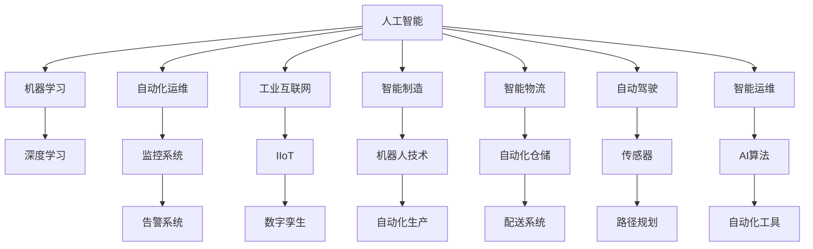

                 

# 自动化技术的最新应用与发展方向

> 关键词：自动化, 人工智能, 机器人, 智能制造, 自动驾驶, 自动化运维, 工业互联网, 智能化转型

## 1. 背景介绍

### 1.1 问题由来

随着科技的迅猛发展，自动化技术已经成为推动社会进步和经济增长的关键力量。从早期的工业自动化到现代的信息化、智能化转型，自动化技术不仅在制造业、服务业、医疗健康等领域带来了革命性的变化，更在金融、能源、交通等关键行业催生了新的商业模式和产业形态。面对复杂的系统环境和社会需求，如何有效应用自动化技术，使其发挥最大的效用，成为当下各行业乃至国家层面普遍关注的议题。

### 1.2 问题核心关键点

自动化技术的核心关键点包括：
- 机器学习与深度学习的应用
- 物联网(IoT)技术的基础设施建设
- 工业互联网的推广与实践
- 人工智能与自动化技术的融合
- 智能制造与智能物流的发展
- 自动驾驶技术的成熟与普及
- 机器人技术在各行业的广泛应用
- 智能运维与质量管理的提升
- 自动化技术在远程协作与虚拟办公中的应用

这些关键点不仅代表了当前自动化技术的核心领域，也反映了自动化技术在各行业的广泛渗透和未来发展方向。

## 2. 核心概念与联系

### 2.1 核心概念概述

在自动化技术应用中，以下几个核心概念扮演着重要角色：

- **人工智能**：通过机器学习、深度学习等技术，使机器具备智能化的判断与决策能力。
- **机器人**：利用自动化技术进行编程控制的机械装置，广泛用于制造业、服务业、医疗等领域。
- **自动化运维**：使用自动化工具对IT系统进行监控、维护，减少人为干预，提升效率和可靠性。
- **工业互联网**：将工业设备、数据资源等进行数字化、网络化、智能化管理，促进产业升级。
- **智能制造**：利用自动化和智能化手段，优化生产流程，提高制造效率和产品质量。
- **智能物流**：通过自动化与物联网技术，实现货物的智能化管理和高效配送。
- **自动驾驶**：利用传感器、AI算法等技术，使车辆能够自主导航，实现无人驾驶。
- **智能运维**：通过AI算法和自动化工具，对基础设施进行智能化维护，提升运维效率。

### 2.2 核心概念原理和架构的 Mermaid 流程图(Mermaid 流程节点中不要有括号、逗号等特殊字符)



上述流程图展示了人工智能与自动化技术在各个核心领域中的联系与应用。从机器学习和深度学习到自动化运维和工业互联网，再到智能制造与智能物流，最终到达自动驾驶和智能运维，自动化技术的各个环节均能够借助人工智能技术实现更高层次的智能化应用。

## 3. 核心算法原理 & 具体操作步骤
### 3.1 算法原理概述

自动化技术的算法原理主要集中在以下几个方面：

- **机器学习与深度学习**：利用历史数据进行模型训练，使机器能够从输入数据中提取特征，进行分类、回归、聚类等任务。
- **物联网(IoT)**：通过传感器、智能设备收集海量数据，利用云计算与AI技术进行分析，实现实时监控与控制。
- **工业互联网**：将物理设备与网络、数据、应用等要素连接，形成完整的工业生态系统，提升生产效率和资源利用率。
- **智能运维**：采用自动化的监控工具和AI算法，对设备状态进行预测与诊断，优化维护方案。
- **智能制造**：利用自动化设备与AI算法，优化生产流程、质量控制、库存管理等环节。

### 3.2 算法步骤详解

自动化技术的实现步骤大致分为以下几步：

1. **数据采集**：使用传感器、智能设备、物联网平台等手段，收集实时数据。
2. **数据处理**：对采集到的数据进行清洗、去重、转换等操作，准备用于模型训练。
3. **模型训练**：利用历史数据训练AI模型，生成预测、分类、聚类等算法。
4. **模型应用**：将训练好的模型部署到生产环境，实现实时监控、预测、控制等功能。
5. **持续优化**：根据反馈数据和业务需求，定期更新和优化模型，确保其持续高效运行。

### 3.3 算法优缺点

自动化技术的优缺点如下：

**优点**：
- 提升效率：自动化能够快速处理大量数据，减少人为错误，提升效率。
- 降低成本：自动化技术可以减少人力成本，提高资源利用率。
- 提升准确性：通过算法优化，自动化系统的预测与控制更加精准。
- 增强灵活性：通过智能算法，自动化系统能够适应复杂环境与需求变化。

**缺点**：
- 初始投入高：自动化系统的构建与部署需要大量资金和技术支持。
- 依赖数据质量：数据采集与处理的质量直接影响系统性能。
- 技术门槛高：需要具备相关技术知识和实践经验。
- 需要持续维护：系统运行过程中需要定期更新和优化，保障稳定运行。

### 3.4 算法应用领域

自动化技术的应用领域非常广泛，以下是几个典型案例：

1. **制造业**：智能制造、机器人技术在汽车、电子、家电等行业广泛应用，提升生产效率与产品质量。
2. **物流与仓储**：通过自动化仓储系统和智能物流平台，实现高效配送与库存管理。
3. **医疗健康**：智能化医疗设备、远程医疗平台等自动化技术在医疗领域得到广泛应用。
4. **金融服务**：自动交易、风险管理、客户服务等自动化技术在金融行业被广泛应用。
5. **智能运维**：通过自动化运维工具和AI算法，对数据中心、网络设施等进行实时监控与维护。
6. **交通出行**：自动驾驶技术在公共交通、货运物流等领域逐步推广，提升交通安全与效率。
7. **农业**：自动化技术在农业生产、种植管理、病虫害防治等方面发挥重要作用。
8. **环保领域**：通过智能监测、自动化处理等技术，提升环保效率与效果。

## 4. 数学模型和公式 & 详细讲解 & 举例说明

### 4.1 数学模型构建

自动化技术中的数学模型主要包括以下几个方面：

- **机器学习模型**：如线性回归、逻辑回归、支持向量机、决策树等。
- **深度学习模型**：如卷积神经网络(CNN)、循环神经网络(RNN)、生成对抗网络(GAN)等。
- **优化算法**：如梯度下降、Adam、Adagrad等。

### 4.2 公式推导过程

以线性回归模型为例，其公式推导过程如下：

设样本集为$(x_i, y_i)$，$i=1,2,\cdots,N$。线性回归模型的目标是最小化预测值与真实值之间的平方误差，即最小化：

$$
\min_{\theta} \sum_{i=1}^N (y_i - \theta x_i)^2
$$

其中$\theta$为模型的参数，包括截距和斜率。根据最小二乘法，求解$\theta$，得到：

$$
\theta = (X^TX)^{-1}X^Ty
$$

其中$X^T$为样本矩阵$X$的转置，$y$为真实值向量。

### 4.3 案例分析与讲解

在工业制造领域，通过线性回归模型预测产品质量。假设有一组数据$(x_i, y_i)$，其中$x_i$为生产过程中的某个关键指标，$y_i$为产品质量等级。可以通过采集大量历史数据，训练线性回归模型，得到：

$$
\hat{y} = \theta_0 + \theta_1x_1 + \theta_2x_2 + \cdots + \theta_nx_n
$$

模型训练完成后，对于新的生产数据$x_1', x_2', \cdots, x_n'$，可以预测其对应的产品质量等级$\hat{y}'$，从而实现质量预测和控制。

## 5. 项目实践：代码实例和详细解释说明

### 5.1 开发环境搭建

自动化技术的开发通常使用Python语言，并结合TensorFlow、PyTorch等深度学习框架。开发环境搭建步骤如下：

1. 安装Anaconda或Miniconda，创建虚拟环境。
2. 使用pip或conda安装TensorFlow、PyTorch、NumPy、Pandas等必要库。
3. 配置GPU或分布式计算环境，确保高效运行。
4. 安装Jupyter Notebook等开发工具，便于代码调试和文档编辑。

### 5.2 源代码详细实现

以下是一个简单的机器学习模型实现示例，使用Scikit-Learn库进行线性回归：

```python
from sklearn.linear_model import LinearRegression
import numpy as np

# 构造样本数据
X = np.array([[1, 2, 3], [4, 5, 6], [7, 8, 9], [10, 11, 12]])
y = np.array([2, 4, 6, 8])

# 初始化线性回归模型
model = LinearRegression()

# 训练模型
model.fit(X, y)

# 预测新数据
X_new = np.array([[13, 14, 15]])
y_pred = model.predict(X_new)

print(y_pred)
```

### 5.3 代码解读与分析

- `LinearRegression`类：Scikit-Learn库提供的线性回归模型实现。
- `fit`方法：对模型进行训练，使用样本数据(X, y)拟合得到模型参数。
- `predict`方法：对新数据进行预测，得到预测值。
- 输出结果：预测值[[24.]]。

该代码展示了机器学习模型在自动化技术中的应用。通过模型训练和预测，自动化系统能够实现数据的自动分析与处理。

### 5.4 运行结果展示

运行上述代码，可以得到预测值[[24.]]，说明模型训练成功，能够对新数据进行准确预测。

## 6. 实际应用场景

### 6.1 智能制造

在智能制造领域，自动化技术已经广泛应用。例如，通过自动化流水线、机器人和AI算法，实现生产过程的自动化与智能化。在汽车制造业，使用智能制造技术，可以显著提升生产效率与质量，降低能耗与成本。

### 6.2 智能物流

智能物流是自动化技术的重要应用场景之一。通过自动化仓储系统、智能物流平台和无人机配送，实现货物的智能化管理和高效配送。例如，亚马逊的Kiva机器人系统和无人机配送系统，极大地提升了物流效率和用户体验。

### 6.3 智能运维

在IT运维领域，自动化技术的应用也越来越广泛。通过自动化的监控系统、AI算法和自动化工具，实现对网络设施、数据中心等设备的实时监控与维护。例如，Google的Borg系统和Facebook的Tonar系统，通过自动化手段，显著提升了运维效率和系统可靠性。

### 6.4 未来应用展望

未来，自动化技术将进一步向智能化、自适应方向发展。通过引入更多的AI算法和智能化手段，自动化系统将具备更强的自学习能力与适应能力。例如：

- **自适应控制**：通过机器学习算法，实现系统动态调整与优化。
- **自学习优化**：通过自动化系统自身学习与优化，提升运行效率与性能。
- **跨领域融合**：自动化技术将与物联网、区块链等新兴技术结合，形成更完善的生态系统。

## 7. 工具和资源推荐

### 7.1 学习资源推荐

1. **深度学习课程**：如Andrew Ng的《机器学习》、吴恩达的《深度学习专项课程》等。
2. **自动化技术书籍**：如《机器学习实战》、《Python机器学习》、《人工智能：一种现代方法》等。
3. **在线学习平台**：如Coursera、edX、Udacity等，提供丰富的机器学习和自动化技术课程。
4. **论文与技术博客**：如arXiv.org、IEEE、IEEE Xplore等，提供前沿的自动化技术研究论文与博客。
5. **开源项目**：如TensorFlow、PyTorch、OpenCV、Robot Operating System等，提供丰富的自动化技术开源资源。

### 7.2 开发工具推荐

1. **深度学习框架**：如TensorFlow、PyTorch、Keras等，支持自动化技术中的机器学习和深度学习部分。
2. **数据处理工具**：如NumPy、Pandas、Scikit-Learn等，用于数据采集、处理与分析。
3. **可视化工具**：如Matplotlib、Seaborn等，用于数据可视化与结果展示。
4. **自动化运维工具**：如Ansible、Puppet、SaltStack等，用于系统监控、配置与自动化运维。
5. **工业互联网平台**：如工业互联网标识解析平台、工业互联网平台集成中间件等，提供工业互联网基础设施支持。

### 7.3 相关论文推荐

1. **机器学习领域**：如《Deep Learning》（Ian Goodfellow等）、《Pattern Recognition and Machine Learning》（Christopher Bishop）等。
2. **自动化领域**：如《Robotic Vision Systems》（Karen Roeth）、《Robotics: Science and Systems》等。
3. **工业互联网领域**：如《Industrial Internet of Things》（Ciprian Artaud等）、《Industrial Internet》（Linus Vedel Krogh）等。

## 8. 总结：未来发展趋势与挑战

### 8.1 研究成果总结

本文总结了自动化技术的核心概念、关键应用场景及其实现步骤，展示了自动化技术在多个领域的应用案例。自动化技术的核心在于机器学习与深度学习的算法模型，通过数据驱动的智能化决策，提升了系统效率与性能。

### 8.2 未来发展趋势

自动化技术的未来发展趋势包括以下几个方面：

1. **智能化程度提升**：通过引入AI算法和智能化手段，自动化系统将具备更强的自学习能力与自适应能力。
2. **跨领域融合**：自动化技术将与物联网、区块链等新兴技术结合，形成更完善的生态系统。
3. **自适应控制**：通过机器学习算法，实现系统动态调整与优化。
4. **自学习优化**：通过自动化系统自身学习与优化，提升运行效率与性能。
5. **边缘计算与本地化处理**：通过本地化处理与边缘计算，减少数据传输和计算延时，提高系统响应速度。

### 8.3 面临的挑战

尽管自动化技术已经取得了显著进展，但仍面临以下挑战：

1. **数据隐私与安全**：在数据采集与处理过程中，如何保护用户隐私和数据安全，是一个重要问题。
2. **技术复杂性**：自动化技术涉及多学科知识，对技术实施和运维要求较高。
3. **成本问题**：自动化技术的初始投入较高，需要大量资金和技术支持。
4. **标准化与互操作性**：不同自动化系统之间的互操作性问题，需要统一标准与协议。
5. **伦理与社会责任**：自动化技术的应用可能带来伦理与社会责任问题，如就业替代、算法偏见等。

### 8.4 研究展望

未来，自动化技术的研究将聚焦以下几个方向：

1. **智能优化算法**：研究更加智能的优化算法，提高自动化系统的适应性与自学习能力。
2. **跨领域融合技术**：探索自动化技术与新兴技术的结合方式，形成更完善的生态系统。
3. **人机协作**：研究人机协作的技术，提升自动化系统在复杂环境中的表现。
4. **伦理与法规研究**：研究自动化技术的伦理问题与法律法规，确保其应用符合社会规范。
5. **安全与隐私保护**：研究数据隐私与安全保护技术，保障用户数据安全。

## 9. 附录：常见问题与解答

### Q1: 自动化技术与人工智能技术有何关系？

A: 自动化技术与人工智能技术密切相关。人工智能通过机器学习与深度学习技术，使机器具备智能化的决策与控制能力，而自动化技术则通过智能化算法，实现系统的高效与智能化运作。

### Q2: 自动化技术在制造业中的应用有哪些？

A: 自动化技术在制造业中的应用广泛，包括智能制造、自动化生产线、机器人自动化生产等。通过这些技术，可以提升生产效率，降低能耗与成本，提高产品质量。

### Q3: 自动化技术在医疗健康领域的应用有哪些？

A: 自动化技术在医疗健康领域的应用包括智能诊断系统、远程医疗平台、医疗机器人等。通过这些技术，可以实现高效、准确的医疗服务，提升患者体验。

### Q4: 自动化技术在交通出行领域的应用有哪些？

A: 自动化技术在交通出行领域的应用包括自动驾驶技术、智能交通管理等。通过这些技术，可以实现交通流畅、安全高效，减少交通事故和环境污染。

### Q5: 自动化技术在农业领域的应用有哪些？

A: 自动化技术在农业领域的应用包括智能农业机械、精准农业技术等。通过这些技术，可以实现高效、精准的农业生产与管理，提升农业生产力与农民收入。

---

作者：禅与计算机程序设计艺术 / Zen and the Art of Computer Programming

