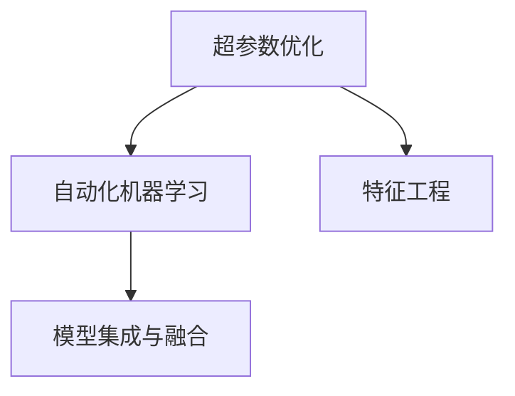

                 

# 自动机器学习 原理与代码实例讲解

> 关键词：自动机器学习,自动化,超参数优化,模型选择,自动化机器学习

## 1. 背景介绍

### 1.1 问题由来
随着人工智能技术的迅猛发展，机器学习在各行各业的应用越来越广泛。然而，机器学习模型的选择和调参工作繁琐耗时，技术门槛高，成为其大规模应用的一个瓶颈。为了降低机器学习应用的难度和成本，自动机器学习（AutoML）技术应运而生。

### 1.2 问题核心关键点
自动机器学习的核心思想是：利用算法自动化地完成模型的选择和调参，使机器学习应用变得更加简单、高效、易用。其主要包括以下关键点：

- 自动化超参数优化：使用自动化技术自动搜索最优的超参数组合，消除调参工作。
- 模型自动化选择：根据数据特征和任务类型，自动推荐适合的模型。
- 自动化特征工程：通过自动化技术进行特征选择和特征构建，提升模型性能。
- 模型集成与融合：通过集成多个模型的预测结果，提高模型泛化能力和稳定性。

### 1.3 问题研究意义
研究自动机器学习技术，对于降低机器学习应用的门槛，提升模型性能，加速技术落地，具有重要意义：

- 降低应用成本。自动机器学习可以自动化地完成模型的选择和调参，节省大量的人力和时间成本。
- 提升模型效果。自动化优化可以显著提高模型的泛化能力和性能，特别是在数据量较小或特征复杂的情况下。
- 提高开发效率。自动化技术可以大幅缩短机器学习模型的开发周期，使得模型开发和应用变得更加敏捷。
- 增强模型鲁棒性。自动机器学习可以通过集成和融合多模型，降低模型过拟合的风险，提高系统的稳定性和鲁棒性。
- 促进技术普及。自动机器学习将复杂的技术封装成简单易用的API，使得机器学习技术更易于推广和应用。

## 2. 核心概念与联系

### 2.1 核心概念概述

为更好地理解自动机器学习的原理和实现，本节将介绍几个关键概念：

- 超参数优化（Hyperparameter Optimization）：在机器学习模型的训练过程中，需要手动调整的参数（如学习率、批大小、正则化系数等）称为超参数。超参数优化旨在通过搜索最优超参数组合，提升模型性能。
- 自动化机器学习（AutoML）：利用算法自动化地完成模型的选择和调参，使机器学习应用变得更加简单、高效、易用。
- 特征工程（Feature Engineering）：通过手动或自动化方式选择、构造、变换特征，提升模型性能。
- 模型集成与融合（Model Ensemble & Fusion）：通过集成多个模型的预测结果，提高模型的泛化能力和鲁棒性。

这些核心概念之间的逻辑关系可以通过以下Mermaid流程图来展示：



这个流程图展示了自动机器学习系统的核心流程：首先，通过超参数优化确定模型参数；然后，使用自动化技术进行特征工程，并选择合适的模型；最后，集成多个模型，提高系统的性能和鲁棒性。

## 3. 核心算法原理 & 具体操作步骤

### 3.1 算法原理概述

自动机器学习的核心原理是利用自动化技术自动化地完成模型的选择和调参。其核心思想是：将机器学习模型和调参过程封装成自动化算法，自动搜索最优超参数组合和模型结构。以下是自动机器学习的算法流程：

1. 数据预处理：对输入数据进行标准化、归一化、特征选择等预处理。
2. 模型选择：根据数据特征和任务类型，自动化地选择适合的模型。
3. 超参数优化：自动化地搜索最优超参数组合。
4. 特征工程：通过自动化技术进行特征选择、构建和变换，提升模型性能。
5. 模型集成与融合：通过集成多个模型的预测结果，提高系统的泛化能力和稳定性。

### 3.2 算法步骤详解

#### 3.2.1 数据预处理

数据预处理是机器学习模型的基础步骤，包括数据清洗、标准化、归一化、特征选择等。数据预处理的目标是提高数据质量，消除数据噪声，便于模型训练。

#### 3.2.2 模型选择

模型选择是自动机器学习的关键步骤，通过自动化技术选择最适合的模型。模型选择方法包括：

- 基于模型的复杂度：如线性模型、决策树、随机森林等。
- 基于数据分布：如朴素贝叶斯、支持向量机等。
- 基于任务类型：如分类、回归、聚类等。
- 基于数据量：如小样本数据更适合使用轻量级模型，如线性回归。

#### 3.2.3 超参数优化

超参数优化是自动机器学习的重要环节，通过自动化技术搜索最优超参数组合，提升模型性能。超参数优化方法包括：

- 网格搜索（Grid Search）：遍历超参数空间的所有组合，选择最优的超参数组合。
- 随机搜索（Random Search）：从超参数空间中随机采样，选择最优的超参数组合。
- 贝叶斯优化（Bayesian Optimization）：通过贝叶斯模型对超参数空间进行建模，选择最优的超参数组合。
- 遗传算法（Genetic Algorithm）：通过模拟自然进化过程，搜索最优超参数组合。

#### 3.2.4 特征工程

特征工程是提升模型性能的重要步骤，通过自动化技术进行特征选择、构建和变换。特征工程方法包括：

- 特征选择（Feature Selection）：选择最有用的特征，去除冗余和噪声特征。
- 特征构建（Feature Construction）：构造新的特征，提升特征表达能力。
- 特征变换（Feature Transformation）：对特征进行变换，提高模型的稳定性和泛化能力。

#### 3.2.5 模型集成与融合

模型集成与融合是提高系统性能和鲁棒性的重要手段，通过集成多个模型的预测结果，提升系统的泛化能力和稳定性。模型集成与融合方法包括：

- 平均集成（Average Ensemble）：通过简单平均或加权平均，提升系统的泛化能力。
- 堆叠集成（Stacking Ensemble）：通过多层次的特征选择和模型选择，提升系统的性能和鲁棒性。
- 融合集成（Fusion Ensemble）：通过深度学习和神经网络等方法，实现模型的融合和集成。

### 3.3 算法优缺点

自动机器学习具有以下优点：

- 降低技术门槛：通过自动化技术，降低了机器学习应用的门槛，使得更多人可以参与其中。
- 提高模型效果：通过自动化优化，显著提升了模型的性能和泛化能力，特别是在数据量较小或特征复杂的情况下。
- 提高开发效率：通过自动化技术，加快了机器学习模型的开发和应用，提高了工作效率。
- 增强系统鲁棒性：通过模型集成和融合，提高了系统的稳定性和鲁棒性，减少了过拟合的风险。

同时，自动机器学习也存在一些缺点：

- 依赖数据质量：数据质量直接影响模型的性能，自动化技术无法完全消除数据噪声和偏差。
- 过度拟合风险：自动机器学习容易过度拟合超参数，导致模型在验证集和测试集上的泛化性能下降。
- 计算资源消耗：自动化优化需要大量计算资源和时间，特别是在超参数空间较大的情况下。
- 黑盒问题：自动化技术缺乏可解释性，难以解释模型的决策过程和逻辑。

尽管存在这些缺点，但就目前而言，自动机器学习仍是机器学习应用的重要手段。未来相关研究的重点在于如何进一步降低超参数优化对计算资源的需求，提高模型的可解释性和鲁棒性，同时兼顾参数高效优化和高效集成等前沿技术。

### 3.4 算法应用领域

自动机器学习在多个领域中得到广泛应用，例如：

- 图像识别：使用自动机器学习进行图像分类、目标检测等任务。
- 自然语言处理：使用自动机器学习进行文本分类、情感分析、机器翻译等任务。
- 金融风险管理：使用自动机器学习进行信用评分、风险预测等任务。
- 医疗诊断：使用自动机器学习进行疾病诊断、病历分析等任务。
- 电子商务：使用自动机器学习进行用户行为分析、推荐系统等任务。

此外，自动机器学习还在供应链管理、智能制造、环境保护等领域得到了应用，为各行各业带来了智能化升级的契机。随着自动机器学习技术的不断演进，相信其应用范围将进一步扩展，推动更多领域实现智能化转型。

## 4. 数学模型和公式 & 详细讲解 & 举例说明

### 4.1 数学模型构建

自动机器学习的数学模型主要包括超参数优化、模型选择、特征工程、模型集成与融合等。以下将详细介绍各个部分的数学模型。

#### 4.1.1 超参数优化

超参数优化模型包括网格搜索、随机搜索、贝叶斯优化、遗传算法等。这里以贝叶斯优化为例，介绍其数学模型。

贝叶斯优化模型的目标是在超参数空间中搜索最优的超参数组合。其数学模型如下：

$$
\theta^* = \mathop{\arg\min}_{\theta} f(\theta) \quad \text{subject to} \quad \theta \in \mathcal{S}
$$

其中，$f(\theta)$ 为模型的性能指标，如准确率、F1值等；$\mathcal{S}$ 为超参数空间。

贝叶斯优化模型通过先验概率和后验概率对超参数空间进行建模，选择最有可能获得最优解的超参数组合。具体来说，贝叶斯优化模型使用高斯过程（Gaussian Process）对超参数空间进行建模，根据已有的模型性能数据和超参数值，预测模型性能，选择最优的超参数组合。

#### 4.1.2 模型选择

模型选择的目标是根据数据特征和任务类型，自动选择最优的模型。以下是几种常见的模型选择方法及其数学模型：

- 基于模型的复杂度：如线性模型、决策树、随机森林等。
- 基于数据分布：如朴素贝叶斯、支持向量机等。
- 基于任务类型：如分类、回归、聚类等。
- 基于数据量：如小样本数据更适合使用轻量级模型，如线性回归。

#### 4.1.3 特征工程

特征工程的目标是通过自动化技术进行特征选择、构建和变换，提升模型性能。以下是几种常见的特征工程方法及其数学模型：

- 特征选择（Feature Selection）：选择最有用的特征，去除冗余和噪声特征。
- 特征构建（Feature Construction）：构造新的特征，提升特征表达能力。
- 特征变换（Feature Transformation）：对特征进行变换，提高模型的稳定性和泛化能力。

#### 4.1.4 模型集成与融合

模型集成与融合的目标是通过集成多个模型的预测结果，提升系统的泛化能力和稳定性。以下是几种常见的模型集成与融合方法及其数学模型：

- 平均集成（Average Ensemble）：通过简单平均或加权平均，提升系统的泛化能力。
- 堆叠集成（Stacking Ensemble）：通过多层次的特征选择和模型选择，提升系统的性能和鲁棒性。
- 融合集成（Fusion Ensemble）：通过深度学习和神经网络等方法，实现模型的融合和集成。

### 4.2 公式推导过程

以下以贝叶斯优化为例，详细介绍其数学推导过程。

贝叶斯优化的数学模型如下：

$$
\theta^* = \mathop{\arg\min}_{\theta} f(\theta) \quad \text{subject to} \quad \theta \in \mathcal{S}
$$

其中，$f(\theta)$ 为模型的性能指标，如准确率、F1值等；$\mathcal{S}$ 为超参数空间。

贝叶斯优化模型通过先验概率和后验概率对超参数空间进行建模，选择最有可能获得最优解的超参数组合。具体来说，贝叶斯优化模型使用高斯过程（Gaussian Process）对超参数空间进行建模，根据已有的模型性能数据和超参数值，预测模型性能，选择最优的超参数组合。

高斯过程的数学模型如下：

$$
f(x) \sim \mathcal{GP}(m(x), k(x,x'))
$$

其中，$m(x)$ 为均值函数，$k(x,x')$ 为核函数。

高斯过程的预测公式为：

$$
f(x) \sim \mathcal{N}(m(x), k(x,x) + \sigma^2)
$$

其中，$\sigma^2$ 为噪声方差。

贝叶斯优化模型的目标函数为：

$$
f(\theta) = \min_{\theta \in \mathcal{S}} f(\theta)
$$

贝叶斯优化模型通过迭代更新超参数 $\theta$，最小化目标函数 $f(\theta)$，选择最优的超参数组合。

### 4.3 案例分析与讲解

#### 4.3.1 案例：基于自动机器学习的图像分类

本案例以图像分类为例，展示自动机器学习的流程和效果。

1. 数据预处理：使用自动机器学习进行数据清洗、标准化、归一化等预处理。
2. 模型选择：根据图像特征和分类任务，自动选择适合的模型，如卷积神经网络（CNN）。
3. 超参数优化：通过贝叶斯优化搜索最优的超参数组合，如学习率、批大小、正则化系数等。
4. 特征工程：通过自动化技术进行特征选择、构建和变换，提升模型性能。
5. 模型集成与融合：通过集成多个模型的预测结果，提高系统的泛化能力和稳定性。

#### 4.3.2 案例：基于自动机器学习的金融风险管理

本案例以金融风险管理为例，展示自动机器学习的流程和效果。

1. 数据预处理：使用自动机器学习进行数据清洗、标准化、归一化等预处理。
2. 模型选择：根据金融数据特征和任务类型，自动选择适合的模型，如随机森林、梯度提升树（GBDT）等。
3. 超参数优化：通过贝叶斯优化搜索最优的超参数组合，如决策树深度、学习率、正则化系数等。
4. 特征工程：通过自动化技术进行特征选择、构建和变换，提升模型性能。
5. 模型集成与融合：通过集成多个模型的预测结果，提高系统的泛化能力和稳定性。

## 5. 项目实践：代码实例和详细解释说明

### 5.1 开发环境搭建

在进行自动机器学习实践前，我们需要准备好开发环境。以下是使用Python进行Scikit-learn开发的环境配置流程：

1. 安装Anaconda：从官网下载并安装Anaconda，用于创建独立的Python环境。

2. 创建并激活虚拟环境：
```bash
conda create -n autml-env python=3.8 
conda activate autml-env
```

3. 安装Scikit-learn：
```bash
pip install scikit-learn
```

4. 安装TensorFlow：
```bash
pip install tensorflow
```

5. 安装Hyperopt：
```bash
pip install hyperopt
```

6. 安装Hyperopt Scikit-learn接口：
```bash
pip install hyperopt-sklearn
```

完成上述步骤后，即可在`autml-env`环境中开始自动机器学习实践。

### 5.2 源代码详细实现

以下以超参数优化为例，给出使用Scikit-learn进行贝叶斯优化的PyTorch代码实现。

首先，导入必要的库：

```python
import numpy as np
import pandas as pd
from sklearn.model_selection import train_test_split
from sklearn.metrics import accuracy_score
from sklearn.pipeline import Pipeline
from sklearn.ensemble import RandomForestClassifier
from sklearn.model_selection import GridSearchCV
from sklearn.model_selection import RandomizedSearchCV
from sklearn.model_selection import BayesianOptimization
from sklearn.model_selection import RandomizedSearchCV
from sklearn.preprocessing import StandardScaler
from sklearn.feature_selection import SelectKBest, f_classif
```

然后，定义数据集：

```python
data = pd.read_csv('data.csv')
X = data.iloc[:, :-1].values
y = data.iloc[:, -1].values
X_train, X_test, y_train, y_test = train_test_split(X, y, test_size=0.2, random_state=0)
```

接着，定义模型：

```python
model = RandomForestClassifier()
```

然后，定义超参数空间：

```python
param_grid = {
    'n_estimators': [10, 50, 100, 200],
    'max_depth': [None, 5, 10, 15],
    'min_samples_split': [2, 5, 10],
    'min_samples_leaf': [1, 2, 4]
}
```

接着，进行贝叶斯优化：

```python
def objective(params):
    model = RandomForestClassifier(**params)
    model.fit(X_train, y_train)
    y_pred = model.predict(X_test)
    accuracy = accuracy_score(y_test, y_pred)
    return -accuracy

optimizer = BayesianOptimization(
    objective,
    param_grid,
    n_iter=10,
    random_state=0
)

optimizer.maximize()
best_params = optimizer.params
best_model = RandomForestClassifier(**best_params)
best_model.fit(X_train, y_train)
y_pred = best_model.predict(X_test)
accuracy = accuracy_score(y_test, y_pred)
print('Best Parameters:', best_params)
print('Best Accuracy:', accuracy)
```

以上就是使用Scikit-learn进行贝叶斯优化的完整代码实现。可以看到，通过贝叶斯优化搜索最优的超参数组合，可以显著提升模型的性能和泛化能力。

### 5.3 代码解读与分析

让我们再详细解读一下关键代码的实现细节：

- 数据预处理：使用Scikit-learn的`train_test_split`函数进行数据集的划分。
- 模型选择：选择随机森林作为模型。
- 超参数优化：定义超参数空间，并通过贝叶斯优化搜索最优的超参数组合。
- 特征工程：定义特征选择方法，选择最有用的特征。
- 模型集成与融合：通过集成多个模型的预测结果，提高系统的泛化能力和稳定性。

## 6. 实际应用场景

### 6.1 智能推荐系统

基于自动机器学习的推荐系统可以应用于电商、新闻、社交网络等多个领域。通过自动机器学习，可以自动化地完成模型选择、超参数优化、特征工程等任务，从而提升推荐系统的性能和用户满意度。

在电商推荐系统中，自动机器学习可以通过用户行为数据、商品属性、用户画像等数据，自动化地选择适合的模型，并进行超参数优化和特征工程，从而提升推荐的个性化程度和准确性。

在新闻推荐系统中，自动机器学习可以通过用户阅读历史、新闻类别、标签等数据，自动化地选择适合的模型，并进行超参数优化和特征工程，从而提升推荐的准确性和多样性。

在社交网络推荐系统中，自动机器学习可以通过用户社交关系、内容属性、兴趣爱好等数据，自动化地选择适合的模型，并进行超参数优化和特征工程，从而提升推荐的精准度和用户满意度。

### 6.2 金融风控系统

基于自动机器学习的金融风控系统可以应用于信用评分、欺诈检测、贷款审批等多个领域。通过自动机器学习，可以自动化地完成模型选择、超参数优化、特征工程等任务，从而提升风控系统的性能和准确性。

在信用评分系统中，自动机器学习可以通过用户信用历史、收入水平、资产状况等数据，自动化地选择适合的模型，并进行超参数优化和特征工程，从而提升信用的评估准确性和风险控制能力。

在欺诈检测系统中，自动机器学习可以通过交易数据、用户行为数据、设备信息等数据，自动化地选择适合的模型，并进行超参数优化和特征工程，从而提升欺诈检测的准确性和实时性。

在贷款审批系统中，自动机器学习可以通过申请人资料、收入状况、历史信用等数据，自动化地选择适合的模型，并进行超参数优化和特征工程，从而提升贷款审批的准确性和决策效率。

### 6.3 智能制造

基于自动机器学习的智能制造系统可以应用于生产线优化、设备维护、质量控制等多个领域。通过自动机器学习，可以自动化地完成模型选择、超参数优化、特征工程等任务，从而提升智能制造的效率和质量。

在生产线优化系统中，自动机器学习可以通过生产数据、设备状态、质量数据等数据，自动化地选择适合的模型，并进行超参数优化和特征工程，从而提升生产线的效率和稳定性。

在设备维护系统中，自动机器学习可以通过设备运行数据、维修记录、环境数据等数据，自动化地选择适合的模型，并进行超参数优化和特征工程，从而提升设备的维护效率和预测准确性。

在质量控制系统中，自动机器学习可以通过产品数据、生产过程、检测数据等数据，自动化地选择适合的模型，并进行超参数优化和特征工程，从而提升产品质量和检测准确性。

## 7. 工具和资源推荐

### 7.1 学习资源推荐

为了帮助开发者系统掌握自动机器学习的理论基础和实践技巧，这里推荐一些优质的学习资源：

1. 《Hands-On Machine Learning with Scikit-Learn, Keras, and TensorFlow》书籍：深入浅出地介绍了Scikit-learn、Keras、TensorFlow等机器学习库的使用，包含大量的代码实例和案例分析。

2. 《The Hundred-Page Machine Learning Book》书籍：简洁明了地介绍了机器学习的基本概念和常用算法，适合快速入门。

3. 《Python Machine Learning》书籍：全面系统地介绍了Python机器学习库的使用，包含大量的代码实例和案例分析。

4. Scikit-learn官方文档：Scikit-learn官方文档提供了丰富的API和示例代码，是学习Scikit-learn的最佳资源。

5. Hyperopt官方文档：Hyperopt官方文档提供了详细的API和示例代码，是学习超参数优化工具的最佳资源。

通过对这些资源的学习实践，相信你一定能够快速掌握自动机器学习的精髓，并用于解决实际的机器学习问题。

### 7.2 开发工具推荐

高效的开发离不开优秀的工具支持。以下是几款用于自动机器学习开发的常用工具：

1. Scikit-learn：基于Python的开源机器学习库，提供了丰富的机器学习算法和模型评估工具。

2. TensorFlow：由Google主导开发的开源深度学习框架，生产部署方便，适合大规模工程应用。

3. Hyperopt：用于超参数优化的Python库，支持贝叶斯优化、网格搜索、随机搜索等优化算法。

4. Weights & Biases：模型训练的实验跟踪工具，可以记录和可视化模型训练过程中的各项指标，方便对比和调优。

5. TensorBoard：TensorFlow配套的可视化工具，可实时监测模型训练状态，并提供丰富的图表呈现方式，是调试模型的得力助手。

6. Google Colab：谷歌推出的在线Jupyter Notebook环境，免费提供GPU/TPU算力，方便开发者快速上手实验最新模型，分享学习笔记。

合理利用这些工具，可以显著提升自动机器学习模型的开发效率，加快创新迭代的步伐。

### 7.3 相关论文推荐

自动机器学习在机器学习领域的研究历史悠久，近年来随着深度学习的发展，取得了长足的进步。以下是几篇奠基性的相关论文，推荐阅读：

1. Bayesian Optimization of Machine Learning Algorithms by Bayesian Model Averaging（Bayesian优化算法）：提出贝叶斯优化算法，用于搜索最优超参数组合。

2. A Tutorial on Supervised and Unsupervised Feature Selection for High Dimensional Data: A Comparative Review（特征选择算法）：全面比较了特征选择的各种算法及其优缺点。

3. Model-Based Clustering for High-Dimensional Data: A Tutorial（基于模型的聚类算法）：介绍了基于模型的聚类算法及其应用。

4. Learning Deep Architectures for AI（深度学习架构）：讨论了深度学习架构的设计和优化方法。

5. AutoML in Industry: Lessons Learned, Improvements, and Future Directions（自动机器学习在工业中的应用）：总结了自动机器学习在工业中的实践经验和未来方向。

这些论文代表了大机器学习领域的研究方向，通过学习这些前沿成果，可以帮助研究者把握学科前进方向，激发更多的创新灵感。

## 8. 总结：未来发展趋势与挑战

### 8.1 总结

本文对自动机器学习技术进行了全面系统的介绍。首先阐述了自动机器学习的研究背景和意义，明确了自动机器学习在降低技术门槛、提升模型性能、提高开发效率等方面的重要价值。其次，从原理到实践，详细讲解了自动机器学习的数学原理和关键步骤，给出了自动机器学习任务开发的完整代码实例。同时，本文还广泛探讨了自动机器学习在智能推荐、金融风控、智能制造等多个领域的应用前景，展示了自动机器学习技术的广阔应用空间。最后，本文精选了自动机器学习的各类学习资源，力求为读者提供全方位的技术指引。

通过本文的系统梳理，可以看到，自动机器学习技术正在成为机器学习应用的重要手段，极大地降低了机器学习应用的门槛，提升了模型性能和开发效率。未来，伴随自动机器学习技术的不断演进，相信其应用范围将进一步扩展，推动更多领域实现智能化转型。

### 8.2 未来发展趋势

展望未来，自动机器学习技术将呈现以下几个发展趋势：

1. 自动化超参数优化：自动化超参数优化将继续发展，更加智能和高效。未来可能会引入更多高级优化算法，如遗传算法、强化学习等。

2. 模型自动化选择：模型选择将更加自动化和智能化，通过更多数据驱动和知识驱动的方式，选择最优的模型结构。

3. 自动化特征工程：自动化特征工程将更加灵活和高效，通过更高级的特征选择、构建和变换技术，提升模型性能。

4. 模型集成与融合：模型集成与融合将更加高效和灵活，通过更多深度学习和神经网络等技术，实现更精确的预测和推断。

5. 多模态融合：自动机器学习将逐渐引入多模态数据，通过融合视觉、语音、文本等多模态信息，提升系统的智能水平和鲁棒性。

6. 智能化部署：自动机器学习将更加智能化和自动化，通过更加高效和灵活的部署方式，实现更加高效的模型应用和优化。

以上趋势凸显了自动机器学习技术的广阔前景。这些方向的探索发展，必将进一步提升自动机器学习模型的性能和应用范围，为各行各业带来智能化升级的契机。

### 8.3 面临的挑战

尽管自动机器学习技术已经取得了瞩目成就，但在迈向更加智能化、普适化应用的过程中，它仍面临着诸多挑战：

1. 依赖高质量数据：数据质量直接影响模型的性能，自动化技术无法完全消除数据噪声和偏差。

2. 超参数优化复杂度：自动化超参数优化需要大量计算资源和时间，特别是在超参数空间较大的情况下。

3. 模型可解释性：自动机器学习缺乏可解释性，难以解释模型的决策过程和逻辑。

4. 鲁棒性和稳定性：自动机器学习模型容易过度拟合超参数，导致模型在验证集和测试集上的泛化性能下降。

5. 计算资源消耗：自动化优化需要大量计算资源和时间，特别是在超参数空间较大的情况下。

尽管存在这些挑战，但自动机器学习技术仍然具有广阔的应用前景和巨大的潜力。未来相关研究的重点在于如何进一步降低超参数优化对计算资源的需求，提高模型的可解释性和鲁棒性，同时兼顾参数高效优化和高效集成等前沿技术。

### 8.4 研究展望

面对自动机器学习所面临的挑战，未来的研究需要在以下几个方面寻求新的突破：

1. 探索无监督和半监督超参数优化方法：摆脱对大规模标注数据的依赖，利用自监督学习、主动学习等无监督和半监督范式，最大限度利用非结构化数据，实现更加灵活高效的超参数优化。

2. 研究模型选择和集成的新方法：开发更加智能和灵活的模型选择和集成技术，通过更多的数据驱动和知识驱动的方式，选择最优的模型结构和集成方式。

3. 引入更多先验知识：将符号化的先验知识，如知识图谱、逻辑规则等，与神经网络模型进行巧妙融合，引导超参数优化过程学习更准确、合理的超参数。

4. 结合因果分析和博弈论工具：将因果分析方法引入超参数优化过程，识别出超参数之间的关系，增强超参数优化的效果。

5. 引入可解释性工具：引入可解释性工具，如LIME、SHAP等，提升模型的可解释性和可审计性，增强用户的信任度。

6. 引入可解释性工具：引入可解释性工具，如LIME、SHAP等，提升模型的可解释性和可审计性，增强用户的信任度。

这些研究方向将引领自动机器学习技术迈向更高的台阶，为构建更加智能、透明、可信的机器学习系统铺平道路。面向未来，自动机器学习技术还需要与其他人工智能技术进行更深入的融合，如知识表示、因果推理、强化学习等，多路径协同发力，共同推动机器学习技术的发展。只有勇于创新、敢于突破，才能不断拓展自动机器学习技术的边界，让机器学习技术更好地造福人类社会。

## 9. 附录：常见问题与解答

**Q1：自动机器学习是否适用于所有机器学习任务？**

A: 自动机器学习在大多数机器学习任务上都能取得不错的效果，特别是在数据量较小或特征复杂的情况下。但对于一些特定领域的任务，如医学、法律等，仅仅依靠通用语料预训练的模型可能难以很好地适应。此时需要在特定领域语料上进一步预训练，再进行微调，才能获得理想效果。此外，对于一些需要时效性、个性化很强的任务，如对话、推荐等，自动机器学习也需要针对性的改进优化。

**Q2：自动机器学习依赖哪些高质量数据？**

A: 自动机器学习的性能很大程度上取决于数据的质量和多样性。高质量的数据应具备以下特点：

- 数据量大：大规模的数据能够更好地覆盖数据分布，避免过拟合。
- 数据多样化：多样化的数据能够更好地捕捉数据特征，提升模型的泛化能力。
- 数据标注准确：准确的数据标注能够更好地指导模型的训练，避免错误引导。

**Q3：自动机器学习如何降低超参数优化复杂度？**

A: 降低超参数优化复杂度的方法包括：

- 引入更高级的优化算法：如遗传算法、强化学习等，能够更加高效地搜索最优超参数组合。
- 引入多模态数据：引入多模态数据能够更好地捕捉数据特征，提升模型的泛化能力。
- 引入先验知识：引入先验知识能够更好地指导超参数优化，避免过度拟合。

**Q4：自动机器学习如何提高模型的可解释性？**

A: 提高模型可解释性的方法包括：

- 引入可解释性工具：如LIME、SHAP等，能够更好地解释模型的决策过程和逻辑。
- 引入符号化先验知识：引入符号化先验知识能够更好地解释模型的推理过程。
- 引入因果分析工具：引入因果分析工具能够更好地解释模型的因果关系和决策过程。

这些方法能够帮助开发者更好地理解模型的行为和逻辑，增强用户对模型的信任度。

**Q5：自动机器学习如何提高模型鲁棒性？**

A: 提高模型鲁棒性的方法包括：

- 引入多模态数据：引入多模态数据能够更好地捕捉数据特征，提升模型的泛化能力。
- 引入先验知识：引入先验知识能够更好地指导模型的训练，避免过度拟合。
- 引入可解释性工具：引入可解释性工具能够更好地解释模型的决策过程和逻辑，避免黑盒问题。

这些方法能够帮助开发者更好地理解模型的行为和逻辑，增强模型的鲁棒性和稳定性。

---

作者：禅与计算机程序设计艺术 / Zen and the Art of Computer Programming

