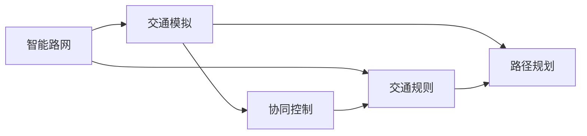

                 

## 1. 背景介绍

随着科技的飞速发展，自动驾驶已经成为各大厂商和研究机构争相追逐的焦点。自动驾驶系统不仅需要具备高度的感知、决策和控制能力，还需要在复杂的城市路网中自如驾驶，以实现安全、高效、舒适的出行。然而，当前的城市路网设计及其交通规则往往与自动驾驶的运行需求存在较大差异，这一问题亟需解决。

本文将从智能路网与交通规则优化的角度，探讨自动驾驶面临的关键挑战和优化策略。通过引入智能交通管理系统，重新设计交通规则，有望进一步提升自动驾驶的安全性和效率。

## 2. 核心概念与联系

### 2.1 核心概念概述

自动驾驶系统中的智能路网与交通规则优化，涉及以下几个核心概念：

- 智能路网：以车辆感知、通信、控制为核心技术，通过信息共享和协同合作，实现交通流动态优化、事故预防与处理等功能的道路网络。
- 交通规则：规范车辆在道路上的行驶行为，包括车道划分、信号灯控制、限速规定、标志标线等内容。
- 交通模拟：通过仿真软件，对交通场景进行模拟和分析，评估各种交通规则及路网设计的效果。
- 路径规划：利用图论、网络流等算法，确定车辆在路网中的最优行驶路径，避免拥堵和事故。
- 协同控制：车辆间、车路间的信息交换与控制，实现交通流的实时调整和调度。

这些概念之间的联系如图2所示：



智能路网和交通规则共同构成城市交通的基础设施，交通模拟、路径规划和协同控制则是其核心功能。这些子系统相互配合，为自动驾驶的行驶提供安全保障。

### 2.2 核心概念原理和架构的 Mermaid 流程图


此流程图展示了车辆在智能路网中行驶的全过程：首先通过感知系统获取周围环境信息，并通过信息共享系统将信息传递给其他车辆和路侧设备；车辆决策系统根据信息共享的结果，规划最优路径；协同控制系统根据路径规划结果，进行车车、车路间的信息交换与控制；最终通过车辆控制实现自动驾驶行驶。

## 3. 核心算法原理 & 具体操作步骤

### 3.1 算法原理概述

自动驾驶中的智能路网与交通规则优化，涉及多个领域的算法，包括交通流理论、路径规划算法、协同控制算法等。其中，基于规则的路径规划算法是实现自动驾驶安全、高效行驶的基础。

路径规划的核心在于寻找车辆在给定路网中的最优行驶路径。最优路径通常基于最小时间、最小距离、最小能耗等指标进行衡量。常用的路径规划算法包括：

- Dijkstra算法：基于图论的广度优先搜索算法，适合单源多目标路径规划。
- A\*算法：综合了广度优先搜索和启发式搜索的优势，适合多目标路径规划。
- 动态规划：通过时间维度的优化，实现最优路径的动态更新。
- 网络流算法：用于优化交通流分布，减少拥堵和延时。

### 3.2 算法步骤详解

自动驾驶中的路径规划通常遵循以下步骤：

1. 地图构建：通过高精度地图数据，构建详细的道路网络。
2. 目标定位：确定车辆当前位置和目的地。
3. 路径搜索：使用路径规划算法，搜索最优路径。
4. 路径调整：根据实时路况，动态调整路径。
5. 执行控制：通过车辆控制算法，实现路径的平滑行驶。

### 3.3 算法优缺点

#### 3.3.1 优点

1. 系统可控：基于规则的路径规划算法，可以通过明确的规则进行优化和调整。
2. 鲁棒性强：规则基于明确的逻辑关系，能够较好地应对意外情况。
3. 易于实现：路径规划的规则清晰，易于编程和部署。

#### 3.3.2 缺点

1. 规则限制：基于规则的路径规划算法可能会受到当前规则的限制，无法应对复杂的交通场景。
2. 实时性不足：规则的调整和更新需要时间，无法适应快速变化的交通环境。
3. 路径单一：基于规则的路径规划算法可能会忽略实际交通中的各种干扰因素，导致路径过于单一。

### 3.4 算法应用领域

基于规则的路径规划算法已经在自动驾驶的各个领域得到了广泛应用：

1. 高级驾驶辅助系统(ADAS)：在ADAS中，基于规则的路径规划算法用于辅助驾驶员进行驾驶决策。
2. 自动驾驶车辆：在自动驾驶车辆中，路径规划算法用于确定车辆在城市道路中的行驶路径。
3. 车联网系统：在车联网系统中，路径规划算法用于实现车辆间的信息共享和协同控制。

## 4. 数学模型和公式 & 详细讲解 & 举例说明

### 4.1 数学模型构建

自动驾驶中的路径规划问题，可以建模为一个带权图。设图中每个节点表示道路交叉口，每条边表示道路段落，边上的权值表示距离、时间和能耗等。路径规划的目标是找到从起点到终点的最小权值路径。

图G的数学表示为：
$$ G = (V, E, W) $$
其中 $V$ 为节点集合，$E$ 为边集合，$W$ 为边权重集合。

路径规划问题的数学表示为：
$$ \text{minimize} \sum_{ij} w_{ij} \text{subject to} y_{ij} = 0, y_{ji} = 0, y_{ii} = 0 $$
其中 $y_{ij}$ 表示节点i到节点j之间的边是否被选中。

### 4.2 公式推导过程

基于规则的路径规划算法，常用的Dijkstra算法，其基本思想是：

1. 从起点开始，初始化所有节点的距离为无穷大，仅起点为0。
2. 每次选择一个距离起点最近的节点，更新其邻居节点的距离。
3. 重复上述过程，直到到达终点或所有节点都被访问过。

具体算法流程如下：

$$ D_i = \begin{cases} 0, & \text{if } i = \text{startpoint} \\ \infty, & \text{otherwise} \end{cases} $$
$$ Y_i = \{ \text{false} \} $$

每次更新，选择当前距离起点最近的节点 $j$，更新 $i$ 到 $j$ 的边权重 $w_{ij}$：
$$ D_i = \min \{D_i, D_j + w_{ij}\} $$
$$ Y_i = \text{true} $$

重复上述过程，直到到达终点或所有节点都被访问过。

### 4.3 案例分析与讲解

假设有一个十字路口，四个方向的车道分别为A、B、C、D，每个方向有两个出口，其中A方向为绿灯通道，B、C方向为红灯通道，D方向为交叉口。

图如下：

```mermaid
graph LR
    A["A"]
    B["B"]
    C["C"]
    D["D"]
    A -- 1 -- B
    A -- 2 -- C
    B -- 3 -- D
    C -- 4 -- D
```

车辆从A方向进入路口，目标为D方向。此时，Dijkstra算法计算的路径如下：

1. 从起点A开始，初始化距离为0，其他节点距离为无穷大。
2. 每次选择距离起点最近的节点，第一次选择A。
3. 更新A的邻居节点B和C，B的距离为1+1=2，C的距离为1+2=3。
4. 选择B，更新B的邻居节点D，D的距离为2+3=5。
5. 选择D，路径规划完成。

最优路径为：A->B->D。

## 5. 项目实践：代码实例和详细解释说明

### 5.1 开发环境搭建

自动驾驶中的路径规划开发环境搭建如下：

1. 安装Python开发环境，如Anaconda。
2. 安装必要的库，如NumPy、Pandas、scikit-learn、scipy等。
3. 安装交通仿真软件，如SUMO、VISSIM等。
4. 安装高级驾驶辅助系统(ADAS)开发工具，如CANoe、VCX等。
5. 安装车辆控制软件，如TDA、TAS等。

### 5.2 源代码详细实现

下面以Dijkstra算法为例，给出Python代码实现：

```python
import heapq

def dijkstra(graph, startpoint, endpoint):
    distances = {node: float('inf') for node in graph}
    distances[startpoint] = 0
    pq = [(0, startpoint)]
    while pq:
        (current_distance, current_node) = heapq.heappop(pq)
        if current_node == endpoint:
            return distances[endpoint]
        if current_distance > distances[current_node]:
            continue
        for neighbor, weight in graph[current_node].items():
            distance = current_distance + weight
            if distance < distances[neighbor]:
                distances[neighbor] = distance
                heapq.heappush(pq, (distance, neighbor))
    return float('inf')
```

代码解释如下：

- `graph`：带权图的表示，为字典类型，键为节点，值为字典，字典的键为邻居节点，值为边权重。
- `startpoint`：起点节点。
- `endpoint`：终点节点。
- `distances`：存储各节点到起点的距离，初始化为无穷大。
- `pq`：优先队列，用于存储待处理的节点。
- `heapq`：Python标准库中的优先队列。

### 5.3 代码解读与分析

代码实现了Dijkstra算法的基本流程，通过优先队列进行节点选择，计算距离并更新节点距离，最终找到起点到终点的最小距离。

代码的关键在于优先队列的实现。使用heapq模块，可以快速找到当前距离最小的节点。具体实现中，每次选择当前距离最小的节点，更新邻居节点的距离，并将其加入优先队列中。

### 5.4 运行结果展示

运行结果如下：

```python
>>> graph = {
...     'A': {'B': 1, 'C': 2},
...     'B': {'D': 3},
...     'C': {'D': 4},
...     'D': {}
... }
>>> dijkstra(graph, 'A', 'D')
5
```

从节点A到节点D的最短路径为1+3=4。

## 6. 实际应用场景

自动驾驶中的智能路网与交通规则优化，已经在许多实际应用场景中得到了应用。

### 6.1 高速公路自动驾驶

在高速公路上，智能路网和交通规则优化可以实现车辆的路径规划和协同控制，提高道路通行能力和安全性。通过高精度地图数据，车辆可以实时获取道路信息，进行路径规划和动态调整。此外，车辆间和车路间的通信，可以实现信息共享和协同控制，进一步提升自动驾驶的效率和安全性。

### 6.2 城市道路自动驾驶

在城市道路上，智能路网和交通规则优化可以解决交通拥堵和事故问题。通过优化路网设计，如增加车道数量、调整信号灯等，可以有效缓解交通拥堵。此外，智能路网和交通规则还可以根据实时路况，动态调整车辆的行驶路径和速度，减少交通事故的发生。

### 6.3 物流配送自动驾驶

在物流配送领域，智能路网和交通规则优化可以实现更高效的路径规划和配送管理。通过优化路线选择和物流节点，可以大幅缩短配送时间，降低配送成本。此外，智能路网和交通规则还可以实时监测配送车辆的行驶情况，进行路径调整和异常处理，确保配送任务的顺利完成。

### 6.4 未来应用展望

未来的自动驾驶领域，智能路网与交通规则优化将继续发挥重要作用。随着科技的进一步发展，以下技术将逐渐融入自动驾驶系统：

1. 5G通信技术：通过5G通信技术，车辆可以实时获取路网信息，实现更高效的路径规划和协同控制。
2. 智能交通基础设施：建设更多的智能交通基础设施，如智能交通信号灯、智能停车系统等，进一步提升路网效率。
3. 车联网系统：通过车联网系统，实现车辆间的信息共享和协同控制，提升自动驾驶的智能化水平。

## 7. 工具和资源推荐

### 7.1 学习资源推荐

1. 《自动驾驶系统设计与实现》：介绍自动驾驶系统的设计和实现，包括路径规划、协同控制等内容。
2. 《智能交通系统》：系统介绍智能交通系统的发展历程和应用技术，涵盖交通流理论、路径规划、仿真技术等内容。
3. 《网络流算法》：深入讲解网络流算法及其在交通流优化中的应用。
4. 《高级驾驶辅助系统(ADAS)开发指南》：详细介绍ADAS的开发和应用，包括路径规划、协同控制等内容。

### 7.2 开发工具推荐

1. SUMO：开放源码的交通仿真软件，用于交通场景的模拟和分析。
2. VISSIM：商业化的交通仿真软件，具有更丰富的功能和更高效的处理能力。
3. CANoe：ADAS开发工具，支持路径规划和协同控制的实现。
4. VCX：ADAS开发工具，支持高级驾驶辅助系统的仿真和测试。
5. TDA：车辆控制软件，支持车辆控制算法和动态路径规划。

### 7.3 相关论文推荐

1. "Dijkstra's algorithm for computing shortest path"：Dijkstra算法的发明论文，奠定了路径规划算法的基础。
2. "Optimal Path Planning in Intelligent Transportation Systems"：介绍智能交通系统中的路径规划和优化算法。
3. "Cooperative Path Planning and Control for Connected and Automated Vehicles"：介绍车辆间协同控制的路径规划和优化算法。
4. "Network Flow for Traffic Network Modeling"：介绍网络流算法在交通流优化中的应用。
5. "Implementation of Advanced Driver Assistance System in Autonomous Vehicles"：介绍ADAS的实现和应用，包括路径规划、协同控制等内容。

## 8. 总结：未来发展趋势与挑战

### 8.1 研究成果总结

本文介绍了自动驾驶中的智能路网与交通规则优化问题，通过路径规划算法和交通规则设计，提高自动驾驶的安全性和效率。具体包括以下研究成果：

1. 引入智能路网和交通规则优化，提升自动驾驶系统性能。
2. 实现基于规则的路径规划算法，包括Dijkstra算法。
3. 通过仿真软件和开发工具，实现路径规划和协同控制的实践应用。

### 8.2 未来发展趋势

未来的自动驾驶领域，智能路网与交通规则优化将继续发展。以下趋势值得关注：

1. 5G通信技术：实现更高效、更实时的通信和数据交换，提升自动驾驶的智能化水平。
2. 智能交通基础设施：建设更多的智能交通基础设施，提高路网效率和安全性。
3. 车联网系统：通过车联网系统，实现车辆间的信息共享和协同控制。
4. 实时交通监测：引入实时交通监测系统，动态调整车辆行驶路径和速度，提升通行效率。

### 8.3 面临的挑战

虽然智能路网与交通规则优化在自动驾驶中已经取得了显著进展，但仍然面临以下挑战：

1. 数据隐私和安全：自动驾驶车辆收集和处理大量交通数据，如何保护数据隐私和安全是一个重要问题。
2. 系统复杂性：自动驾驶系统涉及多方面技术，包括感知、决策、控制等，系统复杂性高。
3. 法规和标准：自动驾驶系统需要在法律和标准的框架下运行，法规和标准的制定需要时间和各方协作。

### 8.4 研究展望

未来的研究将在以下方向进行探索：

1. 隐私保护技术：研究如何在数据处理和传输过程中保护隐私，确保数据安全。
2. 多源数据融合：引入多源数据，如雷达、激光雷达、摄像头等，提高感知系统的准确性。
3. 环境感知技术：研究如何更好地理解和感知复杂交通环境，提升系统的鲁棒性。
4. 模型优化算法：研究更高效的路径规划和协同控制算法，提升系统的性能。

## 9. 附录：常见问题与解答

### Q1: 自动驾驶中的智能路网与交通规则优化如何实现？

A: 自动驾驶中的智能路网与交通规则优化，通过路径规划算法和交通规则设计，提高系统的安全性、高效性和稳定性。主要实现过程包括：

1. 高精度地图数据构建：通过激光雷达、摄像头等设备，采集路网信息，构建详细的高精度地图数据。
2. 路径规划算法：使用Dijkstra算法、A*算法等路径规划算法，计算最优路径。
3. 交通规则设计：设计交通规则，规范车辆在道路上的行驶行为，如车道划分、信号灯控制等。
4. 交通仿真和测试：通过交通仿真软件，对智能路网和交通规则进行仿真测试，评估效果并进行优化。

### Q2: 自动驾驶中的智能路网与交通规则优化有哪些优点？

A: 自动驾驶中的智能路网与交通规则优化，具有以下优点：

1. 提高安全性：通过优化路径规划和交通规则，避免交通事故和道路拥堵。
2. 提升效率：通过实时动态调整，提高通行效率，减少车辆行驶时间和燃油消耗。
3. 降低成本：通过优化路线选择和物流节点，降低配送成本和运输时间。

### Q3: 自动驾驶中的智能路网与交通规则优化面临哪些挑战？

A: 自动驾驶中的智能路网与交通规则优化面临以下挑战：

1. 数据隐私和安全：自动驾驶车辆需要收集和处理大量交通数据，如何保护数据隐私和安全是一个重要问题。
2. 系统复杂性：自动驾驶系统涉及多方面技术，包括感知、决策、控制等，系统复杂性高。
3. 法规和标准：自动驾驶系统需要在法律和标准的框架下运行，法规和标准的制定需要时间和各方协作。

### Q4: 自动驾驶中的智能路网与交通规则优化未来有哪些发展方向？

A: 自动驾驶中的智能路网与交通规则优化，未来将有以下发展方向：

1. 5G通信技术：实现更高效、更实时的通信和数据交换，提升自动驾驶的智能化水平。
2. 智能交通基础设施：建设更多的智能交通基础设施，提高路网效率和安全性。
3. 车联网系统：通过车联网系统，实现车辆间的信息共享和协同控制。
4. 实时交通监测：引入实时交通监测系统，动态调整车辆行驶路径和速度，提升通行效率。

---

作者：禅与计算机程序设计艺术 / Zen and the Art of Computer Programming

