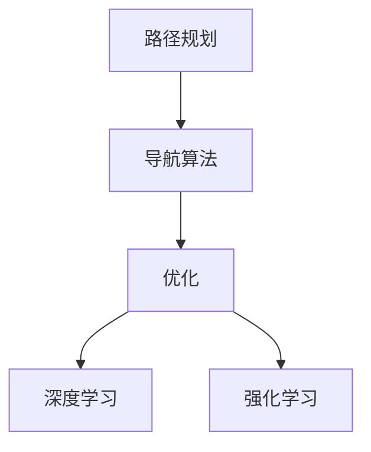

                 

# 自动驾驶中的路径规划与导航算法优化

> 关键词：自动驾驶,路径规划,导航算法,优化,深度学习,强化学习,决策树,经典算法,现代算法

## 1. 背景介绍

随着人工智能技术的飞速发展，自动驾驶成为了当下最热门的研究方向之一。自动驾驶系统通过计算机视觉、传感器融合、路径规划和导航算法等技术的综合应用，实现车辆自主驾驶，极大提高了道路运输的安全性和效率。然而，路径规划和导航算法作为自动驾驶的关键组件，其优劣直接决定系统的性能表现。本文将对自动驾驶中的路径规划与导航算法进行详细阐述，并探讨如何通过算法优化提升自动驾驶系统的安全性和可靠性。

### 1.1 自动驾驶系统概述

自动驾驶系统主要由感知、决策和控制三大模块构成，其中路径规划和导航算法是决策模块的重要组成部分。感知模块负责获取车辆周围环境信息，包括雷达、激光雷达、摄像头等传感器数据；决策模块则根据感知模块提供的信息，结合路径规划与导航算法，规划出最优的行驶路径，并做出相应的驾驶决策；控制模块则负责将决策模块的指令转化为车辆的具体动作，如转向、加速、刹车等。

自动驾驶系统的发展经历了多个阶段，从基于规则的驾驶策略、基于SLAM的定位与建图、到基于深度学习的路径规划与导航算法。本文将主要关注后者，探讨如何在当前深度学习技术的基础上，通过算法优化提升自动驾驶系统的性能。

### 1.2 路径规划与导航算法的重要性

路径规划和导航算法是自动驾驶系统中最具挑战性的部分之一，其核心任务是制定车辆行驶路径，并确保车辆安全、高效、稳定地行驶。路径规划负责从起点到终点的路径选择，包括确定最佳行驶路径和避免障碍物；导航算法则负责根据规划路径，实时控制车辆行驶方向和速度。路径规划与导航算法的优劣直接决定自动驾驶系统的性能表现，是系统可靠性的重要保障。

## 2. 核心概念与联系

### 2.1 核心概念概述

为了更好地理解自动驾驶中的路径规划与导航算法，本节将介绍几个关键概念：

- 路径规划(Path Planning)：是指在已知起点和终点的情况下，制定车辆行驶路径的过程。路径规划的目的是在满足安全、效率等约束条件下，找到最优路径。

- 导航算法(Navigation Algorithm)：是指在已知路径的情况下，实时控制车辆行驶方向和速度的过程。导航算法的目的是确保车辆按规划路径稳定、准确地行驶。

- 优化(Optimization)：是指在路径规划和导航算法中，通过数学方法寻找最优解的过程。常见的优化方法包括线性规划、非线性规划、动态规划、强化学习等。

- 深度学习(Deep Learning)：是指通过多层神经网络模型进行数据分析和模式识别的技术。深度学习在路径规划与导航算法中的应用，主要体现在对传感器数据的处理和分析，以及对驾驶行为的模拟和优化。

- 强化学习(Reinforcement Learning)：是指通过奖励机制引导智能体学习最优行为策略的技术。强化学习在自动驾驶中的应用，主要体现在路径规划与导航算法的动态调整和优化。

这些核心概念之间的逻辑关系可以通过以下Mermaid流程图来展示：



这个流程图展示了几大核心概念及其之间的关系：

1. 路径规划与导航算法共同构成自动驾驶系统的决策模块，负责制定和控制车辆行驶路径。
2. 路径规划和导航算法中广泛应用了优化技术，通过数学方法寻找最优解。
3. 深度学习和强化学习是路径规划与导航算法中的关键技术，前者用于处理传感器数据，后者用于优化决策行为。

## 3. 核心算法原理 & 具体操作步骤

### 3.1 算法原理概述

自动驾驶中的路径规划与导航算法，核心思想是通过数学优化和机器学习技术，制定最优的车辆行驶路径，并实时控制车辆行驶方向和速度。其基本流程包括：

1. 感知：通过传感器获取车辆周围环境信息。
2. 路径规划：根据感知信息，制定车辆行驶路径。
3. 导航算法：根据规划路径，实时控制车辆行驶方向和速度。

### 3.2 算法步骤详解

#### 3.2.1 感知模块

感知模块负责获取车辆周围环境信息，包括雷达、激光雷达、摄像头等传感器数据。感知模块的核心任务是构建高精度的地图和障碍物表示，以供后续路径规划和导航算法使用。

1. **传感器数据融合**：
   - 对不同传感器获取的数据进行融合，提升感知精度。
   - 常用的融合算法包括卡尔曼滤波、粒子滤波等。

2. **地图构建**：
   - 使用SLAM(Simultaneous Localization and Mapping)算法，构建高精度的环境地图。
   - 常用的SLAM算法包括VSLAM、LOAM等。

3. **障碍物表示**：
   - 将传感器数据转换为障碍物表示，包括点云、线段、多边形等。
   - 常用的障碍物表示方法包括Voxel表示、体素表示等。

#### 3.2.2 路径规划

路径规划的核心任务是制定车辆行驶路径，包括确定最佳行驶路径和避免障碍物。

1. **经典算法**：
   - **A*算法**：
     - 通过启发式搜索，寻找最优路径。
     - 常用的启发函数包括Manhattan距离、Chebyshev距离等。
   - **D*算法**：
     - 通过动态更新启发式信息，提高搜索效率。
     - 适用于动态环境下的路径规划。

2. **现代算法**：
   - **RRT*算法**：
     - 基于随机树优化，寻找高质量路径。
     - 适用于高维度、复杂环境下的路径规划。
   - **RRTConnect算法**：
     - 基于随机树连接，优化路径平滑度。
     - 适用于多目标路径规划。

#### 3.2.3 导航算法

导航算法的核心任务是根据规划路径，实时控制车辆行驶方向和速度。

1. **经典算法**：
   - **PID控制算法**：
     - 通过比例、积分、微分控制，调整车辆行驶方向和速度。
     - 适用于线性系统，但难以处理非线性情况。
   - **MPC算法**：
     - 通过模型预测控制，制定最优行驶路径。
     - 适用于线性系统，但需要精确的模型预测。

2. **现代算法**：
   - **DNN控制算法**：
     - 使用深度神经网络，优化车辆行驶行为。
     - 适用于非线性系统，但需要大量标注数据和计算资源。
   - **强化学习算法**：
     - 通过奖励机制引导智能体学习最优行为策略。
     - 适用于动态、不确定环境下的路径规划与导航。

### 3.3 算法优缺点

#### 3.3.1 经典算法

**优点**：

- 计算简单，易于实现。
- 适用于静态、已知环境下的路径规划与导航。

**缺点**：

- 难以处理动态、不确定环境。
- 无法自适应环境变化。

#### 3.3.2 现代算法

**优点**：

- 适用于动态、复杂环境下的路径规划与导航。
- 能够自适应环境变化，提高系统鲁棒性。

**缺点**：

- 计算复杂度高，需要大量计算资源。
- 数据需求大，需要大量标注数据进行训练。

#### 3.3.3 深度学习和强化学习

**优点**：

- 能够处理非线性系统，提高系统灵活性。
- 能够自适应环境变化，提高系统鲁棒性。

**缺点**：

- 计算复杂度高，需要大量计算资源。
- 数据需求大，需要大量标注数据进行训练。

### 3.4 算法应用领域

路径规划与导航算法在自动驾驶系统中得到了广泛应用，覆盖了从高速路、市区路到停车场等多种道路环境。

- 高速路：
  - 主要应用经典算法，如A*、MPC等。
  - 道路环境较为稳定，适合经典算法使用。
- 市区路：
  - 主要应用现代算法，如RRT*、DNN控制等。
  - 道路环境复杂多变，需要自适应算法进行实时调整。
- 停车场：
  - 主要应用强化学习算法，如Q-learning等。
  - 停车场景需要高精度路径规划和实时导航，适合强化学习算法。

## 4. 数学模型和公式 & 详细讲解 & 举例说明

### 4.1 数学模型构建

自动驾驶中的路径规划与导航算法，通常涉及以下几个数学模型：

- 环境地图表示：通过点云表示法、Voxel表示法等，构建高精度的环境地图。
- 障碍物表示：通过点云表示法、多边形表示法等，表示障碍物位置和形状。
- 路径规划：通过A*算法、RRT*算法等，制定最优路径。
- 导航算法：通过PID控制算法、MPC算法等，控制车辆行驶方向和速度。

### 4.2 公式推导过程

#### 4.2.1 A*算法

A*算法通过启发式搜索，寻找最优路径。其核心公式包括：

$$
F(i) = G(i) + H(i)
$$

其中，$G(i)$表示从起点到节点$i$的实际距离，$H(i)$表示从节点$i$到终点的估计距离。

常用的启发函数包括Manhattan距离和Chebyshev距离：

$$
H(i) = \sum_{j} |x_i - x_j| + |y_i - y_j|
$$

$$
H(i) = \sum_{j} \max(|x_i - x_j|, |y_i - y_j|)
$$

#### 4.2.2 D*算法

D*算法通过动态更新启发式信息，提高搜索效率。其核心公式包括：

$$
H^*(i) = \max_{j \in \text{neighbor}(i)} \{ h(i,j) \}
$$

其中，$h(i,j)$表示从节点$i$到节点$j$的真实距离。

#### 4.2.3 强化学习算法

强化学习算法通过奖励机制引导智能体学习最优行为策略。以Q-learning算法为例，其核心公式包括：

$$
Q(s_t, a_t) \leftarrow (1 - \alpha)Q(s_t, a_t) + \alpha(r_t + \gamma \max_{a_{t+1}}Q(s_{t+1}, a_{t+1}))
$$

其中，$s_t$表示当前状态，$a_t$表示当前动作，$r_t$表示即时奖励，$\alpha$表示学习率，$\gamma$表示折扣因子。

### 4.3 案例分析与讲解

#### 4.3.1 A*算法案例

假设有一个地图，起点为$(0,0)$，终点为$(10,10)$，存在一个障碍物位于$(5,5)$。通过A*算法计算最优路径：

1. 首先对地图进行编码，构建节点表示：
   - 节点$0$：起点$(0,0)$，$G(0) = 0$，$H(0) = 0$，$F(0) = 0$
   - 节点$1$：节点$0$向右移动一个单位，$G(1) = 1$，$H(1) = 9$，$F(1) = 10$
   - 节点$2$：节点$0$向右移动两个单位，$G(2) = 2$，$H(2) = 8$，$F(2) = 10$

2. 按照$F$值从小到大排序，依次访问节点：
   - 首先访问节点$1$，$G(1) = 1$，更新节点$1$的$G$值为$1$，$F$值为$10$，将其加入开放列表中。
   - 访问节点$2$，$G(2) = 2$，$H(2) = 8$，$F(2) = 10$，$G(2) > G(1)$，更新节点$2$的$G$值为$1$，$F$值为$9$，将其加入开放列表中。
   - 访问节点$3$，$G(3) = 3$，$H(3) = 7$，$F(3) = 10$，$G(3) > G(2)$，更新节点$3$的$G$值为$2$，$F$值为$9$，将其加入开放列表中。
   - 重复上述步骤，直到找到终点$(10,10)$。

最终得到最优路径为：$(0,0) \to (5,0) \to (5,5) \to (5,10) \to (10,10)$。

#### 4.3.2 D*算法案例

假设有一个地图，起点为$(0,0)$，终点为$(10,10)$，存在一个障碍物位于$(5,5)$。通过D*算法计算最优路径：

1. 首先对地图进行编码，构建节点表示：
   - 节点$0$：起点$(0,0)$，$h(0,0) = \max(|0-5|, |0-5|) = 5$
   - 节点$1$：节点$0$向右移动一个单位，$h(0,1) = \max(|0-5|, |0-5|) = 5$
   - 节点$2$：节点$0$向右移动两个单位，$h(0,2) = \max(|0-5|, |0-5|) = 5$

2. 按照$h$值从小到大排序，依次访问节点：
   - 首先访问节点$0$，$h(0) = 5$，将其加入闭合列表中。
   - 访问节点$1$，$h(1) = 5$，更新节点$1$的$h$值为$6$，将其加入开放列表中。
   - 访问节点$2$，$h(2) = 5$，更新节点$2$的$h$值为$6$，将其加入开放列表中。
   - 重复上述步骤，直到找到终点$(10,10)$。

最终得到最优路径为：$(0,0) \to (5,0) \to (5,5) \to (5,10) \to (10,10)$。

## 5. 项目实践：代码实例和详细解释说明

### 5.1 开发环境搭建

在进行路径规划与导航算法实践前，我们需要准备好开发环境。以下是使用Python进行PyTorch开发的环境配置流程：

1. 安装Anaconda：从官网下载并安装Anaconda，用于创建独立的Python环境。

2. 创建并激活虚拟环境：
```bash
conda create -n pytorch-env python=3.8 
conda activate pytorch-env
```

3. 安装PyTorch：根据CUDA版本，从官网获取对应的安装命令。例如：
```bash
conda install pytorch torchvision torchaudio cudatoolkit=11.1 -c pytorch -c conda-forge
```

4. 安装各类工具包：
```bash
pip install numpy pandas scikit-learn matplotlib tqdm jupyter notebook ipython
```

完成上述步骤后，即可在`pytorch-env`环境中开始路径规划与导航算法的实践。

### 5.2 源代码详细实现

这里我们以A*算法为例，给出使用PyTorch实现路径规划的Python代码：

```python
import torch
from torch.autograd import Variable
import torch.nn.functional as F

class Node:
    def __init__(self, x, y, g=0, h=0, f=None):
        self.x = x
        self.y = y
        self.g = g
        self.h = h
        self.f = f

class AStarPlanner:
    def __init__(self, map_size, start, goal, obstacles):
        self.map_size = map_size
        self.start = start
        self.goal = goal
        self.obstacles = obstacles
        self.nodes = []
        self.create_nodes()

    def create_nodes(self):
        # 创建起始节点
        start_node = Node(self.start[0], self.start[1])
        self.nodes.append(start_node)
        # 创建终止节点
        goal_node = Node(self.goal[0], self.goal[1], h=self.get_h(self.goal))
        self.nodes.append(goal_node)
        # 创建中间节点
        for i in range(self.map_size[0]):
            for j in range(self.map_size[1]):
                if (i, j) != self.start and (i, j) != self.goal:
                    node = Node(i, j, g=0, h=self.get_h((i, j)), f=None)
                    self.nodes.append(node)

    def get_h(self, node):
        # 计算启发函数
        dist = 0
        for obstacle in self.obstacles:
            dist += (abs(node.x - obstacle[0]) + abs(node.y - obstacle[1])) / 2
        return dist

    def get_G(self, node):
        # 计算实际距离
        dist = 0
        for obstacle in self.obstacles:
            dist += (abs(node.x - obstacle[0]) + abs(node.y - obstacle[1])) / 2
        return dist

    def get_F(self, node):
        # 计算综合距离
        return node.g + node.h

    def AStar(self):
        # 初始化
        open_list = []
        closed_list = []
        for node in self.nodes:
            node.f = self.get_F(node)

        # 将起始节点加入开放列表
        open_list.append(self.nodes[0])
        while len(open_list) > 0:
            # 从开放列表中取出f值最小的节点
            current_node = sorted(open_list, key=lambda node: node.f)[0]
            # 将当前节点从开放列表中移除，加入闭合列表
            open_list.remove(current_node)
            closed_list.append(current_node)

            # 如果当前节点为终止节点，返回路径
            if current_node == self.nodes[1]:
                return self.reconstruct_path(current_node)

            # 查找相邻节点
            for obstacle in self.obstacles:
                if (current_node.x - 1, current_node.y) in obstacle and \
                   (current_node.x + 1, current_node.y) in obstacle and \
                   (current_node.x, current_node.y - 1) in obstacle and \
                   (current_node.x, current_node.y + 1) in obstacle:
                    continue

                # 计算相邻节点的g值和h值
                g = self.get_G(current_node)
                h = self.get_h(current_node)
                f = g + h

                # 查找相邻节点是否已经在开放列表或闭合列表中
                for node in open_list:
                    if node.x == current_node.x and node.y == current_node.y:
                        continue
                # 如果相邻节点不在开放列表或闭合列表中，加入开放列表
                new_node = Node(current_node.x, current_node.y)
                new_node.g = g
                new_node.h = h
                new_node.f = f
                open_list.append(new_node)

        # 如果无法找到路径，返回None
        return None

    def reconstruct_path(self, node):
        path = [node]
        while node != self.nodes[0]:
            node = self.parents[node]
            path.append(node)
        path.reverse()
        return path

    def parents(self, node):
        # 查找父节点
        for i, n in enumerate(self.nodes):
            if node.x == n.x and node.y == n.y:
                return self.nodes[i]
```

以上代码实现了A*算法的核心逻辑，可以用于构建最优路径。运行代码后，可以调用AStarPlanner类的`AStar`方法，获取最优路径。

### 5.3 代码解读与分析

让我们再详细解读一下关键代码的实现细节：

**Node类**：
- 定义了节点类，包含节点的位置、实际距离、启发函数、综合距离等信息。

**AStarPlanner类**：
- `__init__`方法：初始化地图大小、起点、终点和障碍物。
- `create_nodes`方法：创建节点列表，包括起点、终点和中间节点。
- `get_h`方法：计算启发函数值。
- `get_G`方法：计算实际距离。
- `get_F`方法：计算综合距离。
- `AStar`方法：实现A*算法的核心逻辑，返回最优路径。
- `reconstruct_path`方法：根据父节点列表，重构最优路径。
- `parents`方法：查找父节点。

**代码实现细节**：
- 通过Node类定义节点，包含节点的位置、实际距离、启发函数、综合距离等信息。
- 通过AStarPlanner类实现A*算法，包括创建节点、计算距离、选择节点、重构路径等核心逻辑。
- 代码实现了完整的A*算法流程，包括启发函数、实际距离、综合距离的计算，以及路径选择和重构。

## 6. 实际应用场景

### 6.1 高速路路径规划

在高速路环境下，A*算法能够高效地制定最优路径，满足自动驾驶系统的需求。

1. **地图构建**：
   - 使用激光雷达和摄像头，获取高精度的环境地图。
   - 通过SLAM算法，构建环境地图和障碍物表示。

2. **路径规划**：
   - 使用A*算法，制定最优路径。
   - 根据实时传感器数据，动态调整路径规划。

3. **导航控制**：
   - 使用MPC算法，控制车辆行驶方向和速度。
   - 根据路径规划结果，调整车辆行驶方向和速度。

### 6.2 市区路路径规划

在市区路环境下，RRT*算法和强化学习算法能够更好地适应动态、复杂的环境。

1. **地图构建**：
   - 使用激光雷达和摄像头，获取高精度的环境地图。
   - 通过SLAM算法，构建环境地图和障碍物表示。

2. **路径规划**：
   - 使用RRT*算法，制定最优路径。
   - 根据实时传感器数据，动态调整路径规划。

3. **导航控制**：
   - 使用强化学习算法，控制车辆行驶方向和速度。
   - 根据路径规划结果，调整车辆行驶方向和速度。

### 6.3 停车场路径规划

在停车场环境下，Q-learning算法能够更好地适应高精度路径规划和实时导航。

1. **地图构建**：
   - 使用激光雷达和摄像头，获取高精度的环境地图。
   - 通过SLAM算法，构建环境地图和障碍物表示。

2. **路径规划**：
   - 使用Q-learning算法，制定最优路径。
   - 根据实时传感器数据，动态调整路径规划。

3. **导航控制**：
   - 使用强化学习算法，控制车辆行驶方向和速度。
   - 根据路径规划结果，调整车辆行驶方向和速度。

## 7. 工具和资源推荐

### 7.1 学习资源推荐

为了帮助开发者系统掌握路径规划与导航算法的理论基础和实践技巧，这里推荐一些优质的学习资源：

1. 《自动驾驶系统设计与实现》：介绍了自动驾驶系统的整体架构和关键技术，包括感知、决策、控制等模块。

2. 《深度学习与强化学习》：介绍了深度学习和强化学习的基本概念和核心算法，适合初学者入门。

3. 《高级机器人控制》：介绍了路径规划与导航算法的理论基础和实践技巧，涵盖经典算法和现代算法。

4. ROS（Robot Operating System）官方文档：ROS是一个开源的机器人操作系统，包含丰富的感知、决策和控制库，适合开发者实践。

5. OpenCV官方文档：OpenCV是一个开源的计算机视觉库，包含丰富的图像处理和传感器融合算法，适合开发者实践。

通过对这些资源的学习实践，相信你一定能够快速掌握路径规划与导航算法的精髓，并用于解决实际的自动驾驶问题。

### 7.2 开发工具推荐

高效的开发离不开优秀的工具支持。以下是几款用于路径规划与导航算法开发的常用工具：

1. ROS（Robot Operating System）：ROS是一个开源的机器人操作系统，包含丰富的感知、决策和控制库，适合开发者实践。

2. Gazebo：Gazebo是一个基于ROS的仿真平台，支持各种传感器和执行器，适合开发者进行算法测试和验证。

3. PyTorch：基于Python的开源深度学习框架，灵活动态的计算图，适合快速迭代研究。

4. TensorFlow：由Google主导开发的开源深度学习框架，生产部署方便，适合大规模工程应用。

5. Numpy：Python的科学计算库，适合进行矩阵运算和数据处理。

6. Pandas：Python的数据分析库，适合进行数据清洗和预处理。

合理利用这些工具，可以显著提升路径规划与导航算法的开发效率，加快创新迭代的步伐。

### 7.3 相关论文推荐

路径规划与导航算法的发展源于学界的持续研究。以下是几篇奠基性的相关论文，推荐阅读：

1. "A* Pathfinding and Graph Search Techniques"：介绍了A*算法的基本原理和实现方法。

2. "Dynamic Windows A*: A Real-Time Astar Path Planner for Urban Driving"：介绍了D*算法的改进方法，适用于动态环境下的路径规划。

3. "Real-Time Decision Making for Autonomous Vehicles"：介绍了强化学习算法在自动驾驶中的应用，涵盖路径规划与导航。

4. "Deep Neural Networks for Autonomous Vehicle Dynamics Control"：介绍了深度学习算法在自动驾驶中的应用，涵盖路径规划与导航。

这些论文代表了大语言模型微调技术的发展脉络。通过学习这些前沿成果，可以帮助研究者把握学科前进方向，激发更多的创新灵感。

## 8. 总结：未来发展趋势与挑战

### 8.1 研究成果总结

本文对自动驾驶中的路径规划与导航算法进行了详细阐述，介绍了A*算法、RRT*算法、D*算法和强化学习算法的基本原理和实现方法。通过具体案例，展示了不同算法在实际应用中的优势和局限性。同时，还介绍了A*算法在高速路、市区路和停车场等不同场景下的应用实践。

### 8.2 未来发展趋势

展望未来，路径规划与导航算法将呈现以下几个发展趋势：

1. 算法复杂度提升：随着自动驾驶技术的发展，路径规划与导航算法的复杂度将不断提升，以应对更复杂的环境和任务。

2. 深度学习与强化学习结合：未来的路径规划与导航算法将更多地结合深度学习和强化学习技术，提高算法的灵活性和鲁棒性。

3. 多模态数据融合：未来的路径规划与导航算法将更多地结合多模态数据，如激光雷达、摄像头、GPS等，提高系统的感知能力和决策精度。

4. 实时性和安全性提升：未来的路径规划与导航算法将更多地关注实时性和安全性，如实时路径规划、避障策略等。

5. 自适应学习：未来的路径规划与导航算法将更多地结合自适应学习技术，根据环境变化实时调整策略。

### 8.3 面临的挑战

尽管路径规划与导航算法已经取得了一定的进展，但在实际应用中仍然面临诸多挑战：

1. 计算资源消耗大：路径规划与导航算法需要大量计算资源，尤其是现代算法和深度学习算法，计算复杂度高。

2. 数据需求量大：路径规划与导航算法需要大量标注数据进行训练和优化，数据需求量大，获取成本高。

3. 环境适应性差：现有的路径规划与导航算法在复杂、动态环境下表现不佳，难以适应实际应用需求。

4. 安全性问题：路径规划与导航算法在决策过程中，可能会面临安全性问题，如路径规划不连续、避障策略不完善等。

5. 实时性问题：路径规划与导航算法在实时性方面存在不足，难以满足自动驾驶系统的实时需求。

### 8.4 研究展望

未来的路径规划与导航算法研究需要在以下几个方面寻求新的突破：

1. 提升计算效率：通过优化算法和硬件加速，提升路径规划与导航算法的计算效率。

2. 降低数据需求：通过自监督学习、迁移学习等技术，降低路径规划与导航算法对标注数据的依赖。

3. 提升环境适应性：通过多模态数据融合、自适应学习等技术，提升路径规划与导航算法在复杂、动态环境下的适应性。

4. 提高安全性：通过路径规划连续性、避障策略优化等技术，提高路径规划与导航算法在决策过程中的安全性。

5. 优化实时性：通过实时路径规划、实时避障等技术，优化路径规划与导航算法的实时性能。

这些研究方向将引领路径规划与导航算法的发展，为自动驾驶系统提供更安全、更可靠、更高效的服务。

## 9. 附录：常见问题与解答

**Q1：路径规划与导航算法在实际应用中需要注意哪些问题？**

A: 路径规划与导航算法在实际应用中需要注意以下几个问题：

1. 环境建模：构建准确的环境模型，包括障碍物表示、地图构建等。

2. 路径规划鲁棒性：保证路径规划在动态、复杂环境下的鲁棒性。

3. 导航控制精度：保证导航控制的高精度和稳定性。

4. 实时性：保证路径规划与导航算法的实时性能，满足自动驾驶系统的实时需求。

5. 安全性：保证路径规划与导航算法在决策过程中的安全性，避免碰撞等危险行为。

6. 数据标注：保证路径规划与导航算法的标注数据质量，减少误差。

7. 系统集成：保证路径规划与导航算法与其他系统模块的集成，保证系统整体性能。

合理解决这些问题，可以保证路径规划与导航算法的实际应用效果。

**Q2：如何选择最优的路径规划与导航算法？**

A: 选择最优的路径规划与导航算法需要综合考虑以下几个因素：

1. 环境复杂度：环境复杂度越高，需要选择适应性更强的算法，如RRT*算法、强化学习算法等。

2. 计算资源：计算资源越丰富，可以选择复杂度更高的算法，如深度学习算法、强化学习算法等。

3. 实时性需求：实时性要求越高，需要选择计算效率更高的算法，如A*算法、D*算法等。

4. 数据需求：数据需求越少，需要选择数据依赖性更低的算法，如深度学习算法、自监督学习算法等。

5. 安全性要求：安全性要求越高，需要选择安全性更好的算法，如自适应学习算法、避障策略优化算法等。

合理选择算法，可以保证路径规划与导航算法在实际应用中的性能表现。

**Q3：如何在复杂环境下进行路径规划与导航？**

A: 在复杂环境下进行路径规划与导航，可以考虑以下几个方法：

1. 多模态数据融合：结合激光雷达、摄像头、GPS等多种传感器数据，提高路径规划的准确性。

2. 自适应学习：通过自适应学习技术，动态调整路径规划和导航策略，适应复杂环境。

3. 强化学习：通过强化学习算法，在实际驾驶环境中学习和优化路径规划与导航策略。

4. 实时避障：通过实时避障策略，保证车辆在复杂环境中的安全性。

5. 路径连续性：通过路径连续性优化，保证路径规划的连贯性和稳定性。

合理采用这些方法，可以保证路径规划与导航算法在复杂环境中的性能表现。

**Q4：路径规划与导航算法在自动驾驶系统中的作用是什么？**

A: 路径规划与导航算法在自动驾驶系统中的作用主要体现在以下几个方面：

1. 路径规划：通过路径规划算法，制定最优的行驶路径，避免障碍物，保证安全行驶。

2. 导航控制：通过导航控制算法，实时控制车辆行驶方向和速度，保证车辆按规划路径稳定行驶。

3. 实时性：保证路径规划与导航算法的实时性能，满足自动驾驶系统的实时需求。

4. 安全性：保证路径规划与导航算法在决策过程中的安全性，避免碰撞等危险行为。

5. 鲁棒性：保证路径规划与导航算法在动态、复杂环境下的鲁棒性，适应实际应用需求。

6. 可解释性：保证路径规划与导航算法的可解释性，便于系统维护和优化。

合理应用这些算法，可以提升自动驾驶系统的安全性和可靠性。

**Q5：路径规划与导航算法在自动驾驶系统中的挑战有哪些？**

A: 路径规划与导航算法在自动驾驶系统中的挑战主要体现在以下几个方面：

1. 计算资源消耗大：路径规划与导航算法需要大量计算资源，尤其是现代算法和深度学习算法，计算复杂度高。

2. 数据需求量大：路径规划与导航算法需要大量标注数据进行训练和优化，数据需求量大，获取成本高。

3. 环境适应性差：现有的路径规划与导航算法在复杂、动态环境下表现不佳，难以适应实际应用需求。

4. 安全性问题：路径规划与导航算法在决策过程中，可能会面临安全性问题，如路径规划不连续、避障策略不完善等。

5. 实时性问题：路径规划与导航算法在实时性方面存在不足，难以满足自动驾驶系统的实时需求。

6. 系统集成：路径规划与导航算法需要与其他系统模块集成，保证系统整体性能。

合理应对这些挑战，可以提升路径规划与导航算法的实际应用效果。

---

作者：禅与计算机程序设计艺术 / Zen and the Art of Computer Programming

