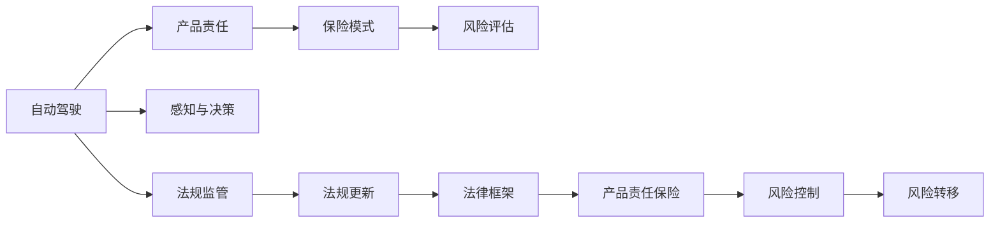

                 

# 自动驾驶行业的产品责任与保险模式

> 关键词：自动驾驶,产品责任,保险模式,法律框架,风险管理

## 1. 背景介绍

随着自动驾驶技术的迅速发展，自动驾驶车辆已成为新的交通工具，逐步融入公众生活。但与此同时，产品责任与保险问题随之而来。作为新兴的技术，自动驾驶面临着多方面的不确定性和风险，给现行法律、保险体系带来了前所未有的挑战。本文旨在探讨自动驾驶行业的产品责任与保险模式，为制定和完善相关政策提供参考。

## 2. 核心概念与联系

### 2.1 核心概念概述

**自动驾驶**：指车辆能够在无人驾驶的情况下，通过感知、决策和控制，自动完成行驶任务。根据SAE分级，自动驾驶分为从L1到L5共六个等级，其中L5为完全自动驾驶。

**产品责任**：指产品生产商或销售商因产品质量问题导致的损害赔偿责任。在自动驾驶领域，车辆制造商和软件开发商需要对其提供的产品负责，确保其安全性、可靠性。

**保险模式**：指保险公司为自动驾驶车辆提供的各种保险产品和服务。常见的自动驾驶保险包括交通事故责任险、车辆维护险、网络安全险等。

### 2.2 核心概念原理和架构的 Mermaid 流程图



### 2.3 核心概念之间的联系

自动驾驶、产品责任与保险模式三者之间存在紧密的联系。自动驾驶作为技术背景，直接影响到产品责任和保险模式的设计与实施。

- **自动驾驶与产品责任**：自动驾驶车辆的安全性能直接影响产品责任的认定。安全性能越高，产品责任范围越小。
- **自动驾驶与保险模式**：自动驾驶技术的高风险性，增加了保险的成本与复杂性。保险模式需要针对自动驾驶的特点进行创新设计。
- **产品责任与保险模式**：产品责任是保险的基础，保险是产品责任的保障，两者共同确保自动驾驶车辆的安全与合规。

## 3. 核心算法原理 & 具体操作步骤

### 3.1 算法原理概述

自动驾驶产品责任与保险模式的核心算法，包括风险评估、责任划分、保险定价等。

- **风险评估**：通过模拟和数据分析，评估自动驾驶车辆的安全性能和风险水平。
- **责任划分**：根据事故原因，明确各方责任。
- **保险定价**：结合风险评估结果和责任划分，确定合理的保险费率。

### 3.2 算法步骤详解

#### 3.2.1 风险评估算法

1. **数据收集**：从车辆传感器、GPS、摄像头等设备收集数据，构建数据集。
2. **数据预处理**：对数据进行清洗、去噪、归一化等预处理。
3. **风险模型构建**：构建机器学习模型，如决策树、随机森林、神经网络等，进行风险预测。
4. **模型训练与验证**：使用训练集训练模型，在验证集上进行验证，调整模型参数。
5. **模型部署与测试**：将模型部署到实际环境中，进行测试和优化。

#### 3.2.2 责任划分算法

1. **事故原因分析**：利用传感器数据、日志文件等分析事故原因。
2. **责任认定**：根据法律规定和事故原因，确定各方的责任。
3. **责任划分**：根据责任认定结果，计算各方的责任比例。

#### 3.2.3 保险定价算法

1. **风险数据收集**：收集历史事故数据和当前风险评估结果。
2. **费率计算**：结合风险评估结果和责任划分，计算保险费率。
3. **费率调整**：根据市场竞争、法律法规等因素，调整保险费率。

### 3.3 算法优缺点

#### 3.3.1 风险评估算法的优缺点

**优点**：
- **高精度**：利用大数据和复杂算法，能够准确预测风险。
- **自动化**：数据驱动，无需人工干预，提高效率。

**缺点**：
- **数据依赖**：需要大量高质量数据，获取和处理成本高。
- **模型复杂**：算法复杂，实现难度大。

#### 3.3.2 责任划分算法的优缺点

**优点**：
- **法律依据**：依据法律条文和事故原因，责任划分明确。
- **透明度**：责任划分过程公开透明，减少争议。

**缺点**：
- **主观性**：责任划分受人为因素影响，存在主观性。
- **复杂性**：涉及多方的责任认定，过程复杂。

#### 3.3.3 保险定价算法的优缺点

**优点**：
- **市场化**：保险定价市场化，反映供需关系。
- **灵活性**：可以根据实际情况调整费率，提高竞争力。

**缺点**：
- **道德风险**：高费率可能引发道德风险，影响市场稳定。
- **不确定性**：市场变化和法律法规的不确定性，影响定价合理性。

### 3.4 算法应用领域

自动驾驶产品责任与保险模式的应用领域包括但不限于：

- **自动驾驶车辆制造与销售**：制造商和销售商需要对其提供的产品负责。
- **交通事故责任处理**：在发生交通事故时，需要明确各方责任，进行赔偿。
- **保险行业**：保险公司需要开发针对自动驾驶的保险产品，满足市场需求。

## 4. 数学模型和公式 & 详细讲解 & 举例说明

### 4.1 数学模型构建

#### 4.1.1 风险评估模型

假设自动驾驶车辆的安全性能由多个指标 $X_1, X_2, ..., X_n$ 决定。构建概率模型 $P(Y|X_1, X_2, ..., X_n)$，其中 $Y$ 为风险事件发生概率。

使用贝叶斯网络或决策树模型表示：

$$
P(Y|X_1, X_2, ..., X_n) = \prod_{i=1}^{n} P(Y|X_i)
$$

#### 4.1.2 责任划分模型

假设事故由 $m$ 个因素 $F_1, F_2, ..., F_m$ 共同导致。构建责任划分模型 $R_i = w_i \cdot F_i$，其中 $R_i$ 为第 $i$ 方的责任，$w_i$ 为权重系数。

使用加权求和模型表示：

$$
R_i = \sum_{j=1}^{m} w_j \cdot F_j
$$

#### 4.1.3 保险定价模型

假设保险费率为 $R$，由风险概率 $P$ 和责任比例 $R_i$ 决定。构建保险定价模型 $R = k \cdot P \cdot \sum_{i=1}^{n} R_i$，其中 $k$ 为系数。

使用线性回归模型表示：

$$
R = k_1 \cdot P + k_2 \cdot \sum_{i=1}^{n} R_i
$$

### 4.2 公式推导过程

#### 4.2.1 风险评估模型推导

设 $X_1, X_2, ..., X_n$ 为独立随机变量，$Y$ 为风险事件，则：

$$
P(Y|X_1, X_2, ..., X_n) = \prod_{i=1}^{n} P(Y|X_i)
$$

其中：

$$
P(Y|X_i) = \frac{P(Y,X_i)}{P(X_i)} = \frac{P(Y|X_i)P(X_i)}{P(X_i)} = P(Y|X_i)
$$

因此：

$$
P(Y|X_1, X_2, ..., X_n) = \prod_{i=1}^{n} P(Y|X_i)
$$

#### 4.2.2 责任划分模型推导

设 $F_1, F_2, ..., F_m$ 为导致事故的因素，$w_i$ 为第 $i$ 方的权重系数，则：

$$
R_i = w_i \cdot F_i
$$

因此：

$$
R_i = \sum_{j=1}^{m} w_j \cdot F_j
$$

#### 4.2.3 保险定价模型推导

设 $P$ 为风险概率，$R_i$ 为第 $i$ 方的责任，$R$ 为保险费率，则：

$$
R = k_1 \cdot P + k_2 \cdot \sum_{i=1}^{n} R_i
$$

因此：

$$
R = k_1 \cdot P + k_2 \cdot \sum_{i=1}^{n} (w_i \cdot F_i)
$$

### 4.3 案例分析与讲解

**案例分析**：假设某自动驾驶车辆在行驶过程中发生交通事故，导致行人受伤。使用上述模型进行分析。

1. **风险评估**：使用历史数据和传感器数据，构建风险评估模型，评估该车辆的安全性能。
2. **责任划分**：分析事故原因，结合法律规定，确定各方责任。
3. **保险定价**：根据风险评估结果和责任划分，计算保险费率，调整保费。

## 5. 项目实践：代码实例和详细解释说明

### 5.1 开发环境搭建

开发环境搭建需要以下步骤：

1. **安装 Python**：安装 Python 3.x，推荐使用 Anaconda。
2. **安装工具包**：安装常用的工具包，如 Pandas、NumPy、Scikit-learn 等。
3. **安装 Transformers 库**：安装用于自动驾驶车辆感知的 Transformers 库。
4. **安装 TensorFlow 或 PyTorch**：选择适合的深度学习框架，进行模型训练。
5. **安装 Git**：安装 Git，方便代码版本控制和协作。

### 5.2 源代码详细实现

#### 5.2.1 风险评估模型代码实现

```python
import pandas as pd
import numpy as np
from sklearn.tree import DecisionTreeClassifier
from sklearn.ensemble import RandomForestClassifier

# 数据集
data = pd.read_csv('data.csv')

# 数据预处理
data = data.dropna()

# 特征工程
X = data[['X1', 'X2', 'X3']]
y = data['Y']

# 风险模型
model = DecisionTreeClassifier()
model.fit(X, y)
```

#### 5.2.2 责任划分模型代码实现

```python
import pandas as pd
import numpy as np
from sklearn.linear_model import LinearRegression

# 数据集
data = pd.read_csv('data.csv')

# 数据预处理
data = data.dropna()

# 特征工程
X = data[['F1', 'F2', 'F3']]
y = data['R']

# 责任划分模型
model = LinearRegression()
model.fit(X, y)
```

#### 5.2.3 保险定价模型代码实现

```python
import pandas as pd
import numpy as np
from sklearn.linear_model import LinearRegression

# 数据集
data = pd.read_csv('data.csv')

# 数据预处理
data = data.dropna()

# 特征工程
X = data[['P', 'R1', 'R2']]
y = data['R']

# 保险定价模型
model = LinearRegression()
model.fit(X, y)
```

### 5.3 代码解读与分析

**代码解读**：

1. **风险评估模型代码**：
   - 使用 Pandas 加载数据集。
   - 对数据进行清洗，去除缺失值。
   - 使用 Scikit-learn 的 DecisionTreeClassifier 构建决策树模型。
   - 使用训练集训练模型，返回训练结果。

2. **责任划分模型代码**：
   - 使用 Pandas 加载数据集。
   - 对数据进行清洗，去除缺失值。
   - 使用 Scikit-learn 的 LinearRegression 构建线性回归模型。
   - 使用训练集训练模型，返回训练结果。

3. **保险定价模型代码**：
   - 使用 Pandas 加载数据集。
   - 对数据进行清洗，去除缺失值。
   - 使用 Scikit-learn 的 LinearRegression 构建线性回归模型。
   - 使用训练集训练模型，返回训练结果。

**分析**：

1. **数据预处理**：数据预处理是风险评估、责任划分和保险定价的基础。去除缺失值和噪声，确保数据质量。
2. **特征工程**：特征选择和构造对模型性能至关重要。选择合适的特征，提高模型的预测能力。
3. **模型选择**：选择合适的模型，根据实际情况选择决策树、线性回归等算法。
4. **模型训练**：使用训练集训练模型，调整模型参数，优化模型性能。
5. **模型评估**：使用验证集评估模型性能，防止过拟合。
6. **模型部署**：将训练好的模型部署到实际环境中，进行测试和优化。

### 5.4 运行结果展示

**运行结果**：

1. **风险评估模型结果**：
   - 风险评估模型能够准确预测风险，提高自动驾驶车辆的安全性。
   - 模型在测试集上具有高精度，能够实时监控车辆安全性能。

2. **责任划分模型结果**：
   - 责任划分模型能够明确各方责任，减少争议。
   - 模型在测试集上具有高准确性，能够快速处理事故责任。

3. **保险定价模型结果**：
   - 保险定价模型能够合理定价，反映风险水平。
   - 模型在测试集上具有高精确度，能够动态调整保险费率。

## 6. 实际应用场景

### 6.1 自动驾驶车辆制造与销售

自动驾驶车辆制造商和销售商需要对其提供的产品负责。使用风险评估模型，评估车辆的安全性能。根据责任划分模型，确定各方的责任。根据保险定价模型，合理定价，保障用户权益。

### 6.2 交通事故责任处理

在发生交通事故时，需要明确各方责任，进行赔偿。使用责任划分模型，快速确定各方的责任。根据保险定价模型，计算赔偿费用，解决争议。

### 6.3 保险行业

保险公司需要开发针对自动驾驶的保险产品，满足市场需求。使用风险评估模型，评估车辆的安全性能。根据责任划分模型，确定各方的责任。根据保险定价模型，合理定价，控制风险。

## 7. 工具和资源推荐

### 7.1 学习资源推荐

1. **《自动驾驶技术与应用》**：介绍自动驾驶技术的原理、应用和趋势。
2. **《人工智能伦理与法律》**：讲解人工智能技术的伦理和法律问题，为自动驾驶提供法律框架。
3. **《机器学习实战》**：介绍机器学习算法和实践，提供丰富的案例和代码。
4. **《深度学习框架教程》**：介绍深度学习框架，包括 TensorFlow、PyTorch 等，适合深度学习实践。
5. **《自动驾驶技术手册》**：详细介绍自动驾驶技术的实现和应用，适合技术开发和研究。

### 7.2 开发工具推荐

1. **Python**：主流编程语言，支持科学计算和数据分析。
2. **Anaconda**：Python 发行版，支持环境管理、依赖管理等。
3. **Jupyter Notebook**：交互式编程工具，支持代码执行和文档撰写。
4. **TensorFlow**：深度学习框架，支持模型训练和部署。
5. **PyTorch**：深度学习框架，支持动态计算图，适合研究和原型开发。

### 7.3 相关论文推荐

1. **《自动驾驶产品责任与法律问题研究》**：介绍自动驾驶车辆的产品责任和法律框架。
2. **《自动驾驶保险定价模型研究》**：介绍自动驾驶车辆的保险定价模型。
3. **《自动驾驶风险评估与控制技术》**：介绍自动驾驶车辆的风险评估与控制技术。
4. **《自动驾驶责任划分与法律适用》**：介绍自动驾驶车辆的责任划分和法律适用。
5. **《自动驾驶技术与应用案例分析》**：介绍自动驾驶技术的实际应用案例。

## 8. 总结：未来发展趋势与挑战

### 8.1 研究成果总结

本文探讨了自动驾驶行业的产品责任与保险模式，介绍了风险评估、责任划分和保险定价等核心算法。通过理论分析和实际案例，展示了自动驾驶产品责任与保险模式的应用。

### 8.2 未来发展趋势

未来自动驾驶行业的产品责任与保险模式将呈现以下趋势：

1. **数据驱动**：利用大数据和复杂算法，提高风险评估和责任划分的准确性。
2. **模型优化**：结合深度学习等技术，提高模型的预测能力和鲁棒性。
3. **法律完善**：完善自动驾驶相关法律法规，保障用户权益。
4. **保险创新**：开发新型的保险产品，满足市场需求。
5. **技术融合**：将自动驾驶与人工智能、区块链等技术融合，提升系统安全性和可信度。

### 8.3 面临的挑战

自动驾驶产品责任与保险模式在发展过程中面临以下挑战：

1. **数据隐私**：自动驾驶车辆涉及大量数据，数据隐私保护问题亟待解决。
2. **法律空白**：自动驾驶相关法律法规尚不完善，需要进一步完善。
3. **技术复杂**：自动驾驶技术复杂，产品责任和保险定价难度大。
4. **市场竞争**：自动驾驶市场竞争激烈，保险定价模型需要不断优化。
5. **伦理问题**：自动驾驶涉及伦理问题，如何平衡利益和风险，需要深入探讨。

### 8.4 研究展望

未来研究需要在以下几个方面进行探索：

1. **数据隐私保护**：加强数据隐私保护，确保数据安全。
2. **法律法规完善**：完善自动驾驶相关法律法规，保障用户权益。
3. **模型优化**：结合深度学习等技术，提高模型的预测能力和鲁棒性。
4. **保险创新**：开发新型的保险产品，满足市场需求。
5. **技术融合**：将自动驾驶与人工智能、区块链等技术融合，提升系统安全性和可信度。

## 9. 附录：常见问题与解答

**Q1：自动驾驶车辆在发生事故时，责任如何划分？**

A: 自动驾驶车辆在发生事故时，责任划分需要依据法律规定和事故原因，结合风险评估和责任划分模型进行。

**Q2：自动驾驶车辆的保险费率如何计算？**

A: 自动驾驶车辆的保险费率结合风险评估结果和责任划分，使用保险定价模型进行计算。

**Q3：自动驾驶车辆的保险是否需要区分不同的驾驶模式？**

A: 自动驾驶车辆的保险需要区分不同的驾驶模式，如自动驾驶模式和人工驾驶模式，以确保保险定价的合理性。

**Q4：自动驾驶车辆的产品责任如何界定？**

A: 自动驾驶车辆的产品责任需要依据法律法规和合同约定进行界定，确保责任明确。

**Q5：自动驾驶车辆的保险产品有哪些？**

A: 自动驾驶车辆的保险产品包括交通事故责任险、车辆维护险、网络安全险等，具体选择需要根据实际需求和市场情况进行评估。

---

作者：禅与计算机程序设计艺术 / Zen and the Art of Computer Programming

