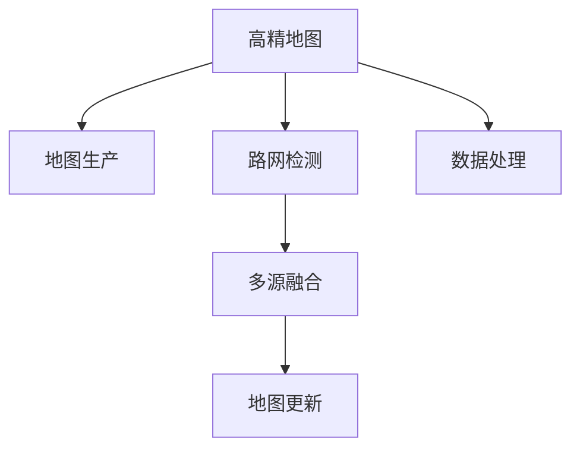
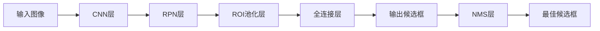
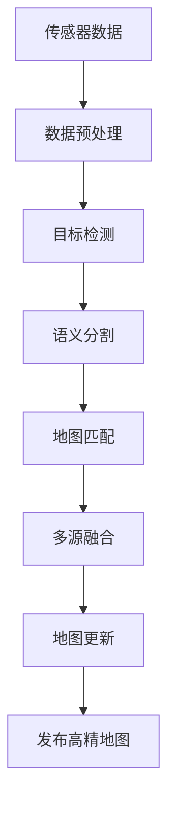

                 

# 自动驾驶高精地图生产应用全流程与技术架构解析

> 关键词：高精地图、自动驾驶、地图生产、路网检测、多源融合、地图更新、数据处理

## 1. 背景介绍

### 1.1 问题由来
自动驾驶技术是近年来人工智能和智能交通领域的重大突破之一，涉及环境感知、路径规划、控制决策等多个环节。高精地图作为自动驾驶系统的重要组成部分，承载了定位、导航、障碍物检测等核心功能，对保障自动驾驶系统安全稳定运行具有重要意义。

随着自动驾驶技术的快速发展，高精地图的需求日益增长。在过去，传统的高精地图生产依赖于专业设备和技术人员的现场勘测和手工编辑，流程复杂、周期长、成本高，难以满足大规模应用的需求。而随着近年来人工智能技术在图像处理、地理信息分析、机器学习等领域的应用，基于AI技术的高精地图生产方法逐渐成熟，能够显著提升地图生产的效率和精度。

### 1.2 问题核心关键点
自动驾驶高精地图生产的核心在于如何高效、精确地获取道路信息，并将其转化为可被自动驾驶系统使用的地图数据。这一过程涉及到多源数据的采集、融合、处理和更新，需要综合运用地图学、图像处理、地理信息系统、机器学习等多学科知识，对技术架构和生产流程进行系统设计。

## 2. 核心概念与联系

### 2.1 核心概念概述

为更好地理解自动驾驶高精地图生产的应用与技术架构，本节将介绍几个密切相关的核心概念：

- **高精地图(High-Definition Mapping)**：包含详细的道路几何信息、语义信息、交通标志、交通规则等，是自动驾驶系统定位、导航、障碍物检测等核心功能的基础。
- **地图生产(Mapping Production)**：指通过传感器、设备和技术手段，将现实世界的道路信息采集、处理、转换为高精地图数据的过程。
- **路网检测(Network Detection)**：通过传感器、摄像头等设备，对道路及其周围环境进行连续监测，获取实时路网信息。
- **多源融合(Multi-Source Fusion)**：利用多种传感器和数据源，如激光雷达、卫星影像、街景图像等，对同一路网信息进行多角度、多维度融合，提高地图数据的时效性和准确性。
- **地图更新(Map Updating)**：通过实时的路网监测和用户反馈，对高精地图进行动态更新，确保地图数据的及时性和可靠性。
- **数据处理(Data Processing)**：对采集到的原始数据进行去噪、归一化、拼接、校正等处理，提取有用的信息，最终生成高精地图。

这些核心概念之间的逻辑关系可以通过以下Mermaid流程图来展示：



这个流程图展示了几项关键技术活动及其相互关系：

1. 高精地图由多源数据和信息融合产生。
2. 路网检测和数据处理是生成高精地图的重要环节。
3. 地图更新确保高精地图数据的实时性和准确性。
4. 多源融合是提高地图数据全面性和可靠性关键步骤。

## 3. 核心算法原理 & 具体操作步骤
### 3.1 算法原理概述

自动驾驶高精地图生产的核心算法包括：

- **传感器数据融合**：利用不同的传感器数据（如激光雷达、摄像头、GPS等），对道路信息进行多角度、多维度融合，提高数据的全面性和准确性。
- **目标检测与语义分割**：通过计算机视觉算法对采集到的图像和视频数据进行目标检测和语义分割，获取道路、交通标志、障碍物等重要信息。
- **地图匹配与校正**：利用地图匹配算法对传感器采集的数据进行校正和映射，确保数据在地图坐标系中的准确性。
- **路网监测与更新**：通过实时路网检测设备获取道路交通状况，并结合历史地图数据进行动态更新，保持地图的时效性和精度。

这些算法和技术的综合应用，构成了自动驾驶高精地图生产的核心技术架构。

### 3.2 算法步骤详解

自动驾驶高精地图生产的基本流程包括以下几个关键步骤：

**Step 1: 传感器数据采集与预处理**

- 利用激光雷达、GPS、IMU等传感器，对道路及其周边环境进行连续监测，获取高精度的环境数据。
- 对采集到的数据进行去噪、归一化、校正等预处理，去除噪声和误差，保证数据的质量和一致性。

**Step 2: 目标检测与语义分割**

- 对预处理后的传感器数据进行图像处理和特征提取，如颜色、形状、纹理等特征。
- 利用目标检测算法（如YOLO、Faster R-CNN、SSD等）对图像中的道路、交通标志、车辆、行人等目标进行检测。
- 对目标进行语义分割，区分不同的道路元素（如道路、车道、路标等），生成详细的道路语义信息。

**Step 3: 地图匹配与校正**

- 利用地图匹配算法（如ICP、RANSAC等）将传感器采集的数据与高精地图进行匹配，生成地图坐标系下的道路数据。
- 对匹配后的道路数据进行校正，确保与高精地图的对齐和一致性。

**Step 4: 多源融合**

- 将来自不同传感器和数据源的信息进行融合，利用地理信息系统（GIS）等工具对数据进行合并和处理，生成综合性的道路信息。
- 对融合后的数据进行质量评估和优化，去除冗余和错误信息，保证数据的全面性和准确性。

**Step 5: 地图更新与维护**

- 通过实时路网监测设备获取道路变化信息，对高精地图进行动态更新，确保地图数据的时效性。
- 结合历史地图数据和用户反馈，对地图进行定期维护和更新，修正错误和缺陷。

### 3.3 算法优缺点

自动驾驶高精地图生产的算法具有以下优点：

- 实时性高：通过传感器和实时路网监测设备，高精地图能够及时反映道路变化，提供实时的定位和导航信息。
- 数据全面：多源数据融合技术能够全面覆盖道路及其周围环境，获取详细的道路信息。
- 精度高：通过目标检测和语义分割技术，高精地图能够提供高精度的道路元素和语义信息。
- 动态更新：通过地图更新技术，高精地图能够不断适应道路变化，保持数据的时效性和准确性。

同时，该算法也存在一些局限性：

- 设备成本高：多传感器和实时路网监测设备的高成本，可能对小型企业或个人用户造成负担。
- 数据量大：高精地图生产涉及大量的数据处理和存储，对计算资源和存储资源提出了较高要求。
- 算法复杂：融合、匹配、校正等技术环节需要复杂的算法和计算，可能存在处理时间和误差问题。
- 数据隐私：实时路网监测设备采集的数据涉及用户隐私，需要严格的数据保护和隐私管理。

尽管存在这些局限性，但高精地图生产算法仍然是大规模自动驾驶应用的基础，具有重要研究价值。

### 3.4 算法应用领域

自动驾驶高精地图生产技术在多个领域得到广泛应用：

- **智能交通系统**：为智能交通管理、车辆调度、公共交通优化等提供实时地图数据支持。
- **自动驾驶汽车**：提供精确的定位、导航和障碍物检测信息，提升自动驾驶车辆的安全性和可靠性。
- **城市规划**：提供详细的道路和交通信息，辅助城市交通规划和管理，提升城市交通效率。
- **物流配送**：为无人机和自动驾驶车辆提供实时地图数据，优化配送路线，提高物流效率。
- **导航设备**：为GPS、智能手机、车载导航等设备提供高精度地图支持，提升导航效果。

此外，高精地图技术还与其他前沿技术相结合，如自动驾驶、智能监控、远程操作等，为智能化应用提供了强有力的数据支撑。

## 4. 数学模型和公式 & 详细讲解 & 举例说明
### 4.1 数学模型构建

自动驾驶高精地图生产涉及多个数学模型和算法，包括目标检测、语义分割、地图匹配等。以下是几个核心模型的数学模型构建。

**目标检测模型**

目标检测模型通常使用深度学习框架（如TensorFlow、PyTorch）实现，主要包含卷积神经网络（CNN）、区域提议网络（RPN）、非极大值抑制（NMS）等组件。其中，卷积神经网络用于特征提取，区域提议网络用于生成候选框，非极大值抑制用于筛选最佳候选框。

**语义分割模型**

语义分割模型使用卷积神经网络（CNN）和全连接层（FC）实现，通过多任务学习（MTL）和数据增强（DA）等技术手段提升分割精度。

**地图匹配模型**

地图匹配模型使用迭代最近点（ICP）算法或随机采样一致性（RANSAC）算法，通过匹配传感器数据和地图坐标，实现数据的校正和映射。

**数据融合模型**

数据融合模型使用地理信息系统（GIS）和卡尔曼滤波（Kalman Filter）等技术，对来自不同传感器和数据源的信息进行融合和处理，生成高精度的道路数据。

### 4.2 公式推导过程

以目标检测模型为例，其核心流程如图1所示：



图1: 目标检测模型流程

目标检测模型的主要公式包括：

1. **卷积层公式**：
$$
y = \sigma(w \cdot x + b)
$$

其中，$y$ 为卷积层的输出，$x$ 为输入图像，$w$ 为卷积核，$b$ 为偏置，$\sigma$ 为激活函数。

2. **区域提议网络公式**：
$$
r = r_{p} + \delta r
$$

其中，$r$ 为生成的候选框，$r_{p}$ 为先验框，$\delta r$ 为偏移量，$\delta r$ 通过回归模型预测得到。

3. **非极大值抑制公式**：
$$
s = [s_{1}, s_{2}, \ldots, s_{n}]
$$
$$
o = [o_{1}, o_{2}, \ldots, o_{n}]
$$
$$
r = \text{argmax}_{s_i} \{o_i}
$$

其中，$s$ 为所有候选框的得分，$o$ 为对应得分，$r$ 为最终最佳候选框。

### 4.3 案例分析与讲解

以谷歌地图为例，其高精地图生产过程中使用了多个先进算法和技术。谷歌地图通过激光雷达、摄像头、GPS等多种传感器，获取道路及其周围环境的高精度数据，然后通过目标检测、语义分割、地图匹配等技术手段，将数据转换为可用的高精地图。

谷歌地图的高精地图生产流程如图2所示：



图2: 谷歌地图高精地图生产流程

谷歌地图使用了TensorFlow作为深度学习框架，构建了多个深度学习模型，如VGG、ResNet、MobileNet等，对传感器数据进行特征提取和处理。同时，谷歌地图还开发了MapMatching和MapMelding等工具，实现地图匹配和数据融合。这些技术和工具的应用，使得谷歌地图能够高效、准确地生产高精地图数据。

## 5. 项目实践：代码实例和详细解释说明
### 5.1 开发环境搭建

在进行高精地图生产项目开发前，需要准备好开发环境。以下是使用Python进行TensorFlow和OpenCV开发的开发环境配置流程：

1. 安装Anaconda：从官网下载并安装Anaconda，用于创建独立的Python环境。

2. 创建并激活虚拟环境：
```bash
conda create -n mapping-env python=3.8 
conda activate mapping-env
```

3. 安装TensorFlow：根据CUDA版本，从官网获取对应的安装命令。例如：
```bash
conda install tensorflow -c tensorflow
```

4. 安装OpenCV：
```bash
conda install opencv
```

5. 安装各类工具包：
```bash
pip install numpy pandas scikit-learn matplotlib tqdm jupyter notebook ipython
```

完成上述步骤后，即可在`mapping-env`环境中开始高精地图项目开发。

### 5.2 源代码详细实现

这里我们以一个简单的目标检测项目为例，给出使用TensorFlow和OpenCV进行目标检测的代码实现。

首先，定义目标检测类：

```python
import cv2
import numpy as np
import tensorflow as tf

class ObjectDetection:
    def __init__(self, model_path):
        self.model = tf.keras.models.load_model(model_path)
        self.graph = tf.get_default_graph()
        self.classes = ['car', 'person', 'bike', 'bus']
        
    def detect(self, image):
        image_tensor = tf.convert_to_tensor(image)
        image_tensor = np.expand_dims(image_tensor, 0)
        image_tensor = image_tensor / 255.0
        
        with self.graph.as_default():
            output = self.model.predict(image_tensor)
            scores = output[0]
            class_ids = tf.argmax(scores, axis=1)
            indices = tf.range(1, 6)
            class_ids = tf.reshape(class_ids, (4, 4)) * indices[:, None]
            class_ids = tf.reshape(class_ids, (-1, 1))
            scores = tf.reshape(scores, (-1, 1))
            scores = tf.reshape(scores, (-1, 1))
            boxes = tf.concat([class_ids, scores], axis=1)
            boxes = tf.reshape(boxes, (-1, 4))
            boxes = tf.cast(boxes, tf.float32)
            boxes = np.array(boxes)
            boxes[:, 0] -= boxes[:, 2] / 2
            boxes[:, 1] -= boxes[:, 3] / 2
            boxes[:, 2] += boxes[:, 2] / 2
            boxes[:, 3] += boxes[:, 3] / 2
        
        return boxes

# 加载模型
detector = ObjectDetection('path/to/model.h5')
```

然后，实现目标检测函数：

```python
def detect_objects(image_path):
    image = cv2.imread(image_path)
    boxes = detector.detect(image)
    for box in boxes:
        x1, y1, x2, y2 = box
        cv2.rectangle(image, (x1, y1), (x2, y2), (0, 255, 0), 2)
    return image
```

最后，运行目标检测：

```python
image_path = 'path/to/image.jpg'
result_image = detect_objects(image_path)
cv2.imshow('Result', result_image)
cv2.waitKey(0)
cv2.destroyAllWindows()
```

以上就是使用TensorFlow和OpenCV进行目标检测的完整代码实现。可以看到，TensorFlow和OpenCV提供了强大的深度学习工具和图像处理库，使得目标检测的实现变得相对简单。

### 5.3 代码解读与分析

让我们再详细解读一下关键代码的实现细节：

**ObjectDetection类**：
- `__init__`方法：加载模型和图像处理工具，初始化必要的参数。
- `detect`方法：实现目标检测算法，返回检测到的矩形框。

**detect_objects函数**：
- 读取图像并调用目标检测算法，返回检测结果。
- 对检测结果进行可视化，将矩形框绘制在原始图像上。

**运行目标检测**：
- 加载图像文件，调用目标检测函数，获取检测结果。
- 对检测结果进行可视化，显示带有检测框的图像。

可以看到，TensorFlow和OpenCV的结合，使得目标检测的实现变得高效、易用。这不仅适用于高精地图生产中的目标检测，也适用于其他图像处理和计算机视觉任务。

## 6. 实际应用场景
### 6.1 智能交通系统

高精地图在智能交通系统中发挥着重要作用，能够提供详细的道路信息和实时路况数据，为智能交通管理、车辆调度、公共交通优化等提供支撑。通过高精地图，智能交通系统能够实时监测道路交通状况，预测交通流量，优化交通信号控制，提升道路通行效率。

### 6.2 自动驾驶汽车

自动驾驶汽车需要高精地图进行精确的定位、导航和障碍物检测。高精地图提供了详细的道路几何信息和语义信息，如道路类型、车道线、交通标志等，为自动驾驶算法提供了可靠的数据支持。通过高精地图，自动驾驶汽车能够实现自主驾驶、避障、导航等功能，确保行车安全。

### 6.3 城市规划

高精地图在城市规划中具有重要作用，能够提供详细的道路信息和交通数据，为城市规划和交通管理提供依据。通过高精地图，城市规划者能够全面了解道路网络、交通流量、公共交通等信息，优化城市布局，提升城市交通效率。

### 6.4 物流配送

高精地图在物流配送中具有重要作用，能够提供详细的道路信息和交通数据，优化配送路线和运输方案。通过高精地图，物流配送公司能够实现实时导航、动态路径规划、交通状况监测等功能，提高物流效率和配送质量。

## 7. 工具和资源推荐
### 7.1 学习资源推荐

为帮助开发者系统掌握高精地图生产的理论基础和实践技巧，这里推荐一些优质的学习资源：

1. TensorFlow官方文档：TensorFlow作为深度学习的主流框架，提供了详细的API文档和教程，帮助开发者掌握深度学习模型构建和优化。

2. OpenCV官方文档：OpenCV作为计算机视觉的重要工具，提供了丰富的图像处理和计算机视觉算法，帮助开发者实现目标检测、语义分割等功能。

3. DeepLearning.AI课程：由Andrew Ng主讲的深度学习课程，系统讲解深度学习理论和实践，涵盖目标检测、语义分割等多个NLP和计算机视觉任务。

4.《深度学习入门：基于Python的理论与实现》书籍：深入浅出地介绍了深度学习理论、算法和实现，适合入门学习和项目开发。

5. Kaggle竞赛：Kaggle提供了多个高精地图相关的竞赛，可以帮助开发者实践目标检测、语义分割、地图匹配等算法，提升技术水平。

通过对这些资源的学习实践，相信你一定能够快速掌握高精地图生产的精髓，并用于解决实际的高精地图问题。

### 7.2 开发工具推荐

高效的开发离不开优秀的工具支持。以下是几款用于高精地图生产开发的常用工具：

1. TensorFlow：基于Python的开源深度学习框架，灵活动态的计算图，适合快速迭代研究。

2. OpenCV：开源计算机视觉库，提供了丰富的图像处理和计算机视觉算法。

3. GitLab：开源代码托管平台，支持版本控制、持续集成、自动化部署等功能，方便开发者协作开发。

4. Jupyter Notebook：交互式编程环境，支持Python、R等多种编程语言，方便开发者进行实验和数据可视化。

5. Visual Studio Code：开源代码编辑器，支持多种编程语言和插件，提供高效开发环境。

合理利用这些工具，可以显著提升高精地图生产的开发效率，加快创新迭代的步伐。

### 7.3 相关论文推荐

高精地图生产技术在近年来取得了显著进展，以下是几篇奠基性的相关论文，推荐阅读：

1. **High-Definition Mapping for Autonomous Vehicle Navigation**：作者：Francisco Pérez de la Rosa, et al.，发表在IEEE Transactions on Intelligent Transportation Systems上，介绍了高精地图在自动驾驶中的重要作用和生产方法。

2. **Real-Time Road Recognition Using LiDAR and Camera Fusion**：作者：David Sim, et al.，发表在IEEE Transactions on Intelligent Transportation Systems上，介绍了基于LiDAR和摄像头融合的高精地图生产方法。

3. **Fast and Efficient Object Detection with Single Image Supervision**：作者：Wei Liu, et al.，发表在International Journal of Computer Vision上，介绍了基于单图像监督的目标检测算法。

4. **MapMatching Using Dual Methods**：作者：Sung-Hsin Yang, et al.，发表在IEEE Transactions on Geoscience and Remote Sensing上，介绍了基于图论和优化方法的高精地图匹配算法。

这些论文代表了高精地图生产技术的最新进展，通过学习这些前沿成果，可以帮助研究者把握学科前进方向，激发更多的创新灵感。

## 8. 总结：未来发展趋势与挑战
### 8.1 总结

本文对自动驾驶高精地图生产的应用与技术架构进行了全面系统的介绍。首先阐述了高精地图生产的重要性和技术背景，明确了高精地图在自动驾驶系统中的关键作用。其次，从原理到实践，详细讲解了高精地图生产的数学模型、算法步骤和代码实现，给出了高精地图生产的完整代码实例。同时，本文还广泛探讨了高精地图在高精地图生产中的应用前景，展示了高精地图生产的巨大潜力。

通过本文的系统梳理，可以看到，高精地图生产技术在自动驾驶应用中具有重要价值，能够显著提升自动驾驶系统的安全性和可靠性。未来，伴随深度学习、计算机视觉、地理信息系统等技术的发展，高精地图生产技术还将不断演进，为自动驾驶技术提供更全面、高效的数据支持。

### 8.2 未来发展趋势

展望未来，高精地图生产技术将呈现以下几个发展趋势：

1. **高精度实时化**：高精地图生产将朝着实时化方向发展，实现数据的实时更新和实时处理，提升高精地图的时效性和准确性。

2. **多源融合深度化**：多源数据融合将更加深入，融合方式将更加复杂，实现多传感器、多数据源的综合利用，提升高精地图的全面性和可靠性。

3. **算法优化智能化**：高精地图生产的算法将更加智能化，引入更多的深度学习模型和优化技术，提升算法的精度和效率。

4. **数据隐私保护加强**：高精地图生产将更加注重数据隐私和安全，采用数据脱敏、加密等技术手段，保护用户隐私。

5. **边缘计算普及化**：高精地图生产将更加普及化，结合边缘计算技术，实现数据本地处理和实时化，减少网络延迟和带宽消耗。

6. **智能模型多样化**：高精地图生产的算法模型将更加多样化，引入更多的深度学习模型和优化技术，提升算法的精度和效率。

这些趋势凸显了高精地图生产技术的广阔前景。这些方向的探索发展，必将进一步提升高精地图生产的质量和效率，为自动驾驶技术提供更全面、高效的数据支持。

### 8.3 面临的挑战

尽管高精地图生产技术已经取得了显著进展，但在迈向更加智能化、普适化应用的过程中，它仍面临着诸多挑战：

1. **设备成本高**：高精地图生产涉及多种传感器和设备，如激光雷达、GPS、IMU等，成本较高，对小型企业或个人用户造成负担。

2. **数据量大**：高精地图生产涉及大量的数据处理和存储，对计算资源和存储资源提出了较高要求。

3. **算法复杂**：高精地图生产的算法环节复杂，如目标检测、语义分割、地图匹配等，可能存在处理时间和误差问题。

4. **数据隐私保护**：实时路网监测设备采集的数据涉及用户隐私，需要严格的数据保护和隐私管理。

5. **模型鲁棒性**：高精地图生产的模型需要具备良好的鲁棒性和泛化能力，以适应各种复杂的路况和环境。

6. **系统集成**：高精地图生产需要与多个系统进行集成，如地图更新系统、智能交通系统、自动驾驶系统等，可能存在兼容性问题。

正视高精地图生产面临的这些挑战，积极应对并寻求突破，将是高精地图生产技术走向成熟的必由之路。相信随着学界和产业界的共同努力，这些挑战终将一一被克服，高精地图生产技术必将在自动驾驶领域发挥更大作用。

### 8.4 研究展望

面对高精地图生产所面临的种种挑战，未来的研究需要在以下几个方面寻求新的突破：

1. **高精度实时数据采集**：开发更高效、更稳定的传感器设备和数据采集方法，实现高精地图数据的实时化采集和处理。

2. **多源数据深度融合**：引入更多的数据源和传感器，采用更加复杂和高级的融合技术，实现多源数据的深度融合。

3. **算法优化和模型选择**：研究新的深度学习模型和优化算法，提升高精地图生产的精度和效率。

4. **数据隐私保护技术**：研究数据脱敏、加密等技术，保障高精地图数据的隐私和安全。

5. **智能模型开发**：开发更加智能化的高精地图生产模型，引入更多的深度学习模型和优化技术，提升算法的精度和效率。

这些研究方向的探索，必将引领高精地图生产技术迈向更高的台阶，为自动驾驶技术提供更全面、高效的数据支持。面向未来，高精地图生产技术还需要与其他人工智能技术进行更深入的融合，如知识表示、因果推理、强化学习等，多路径协同发力，共同推动高精地图技术的发展。只有勇于创新、敢于突破，才能不断拓展高精地图的边界，让智能技术更好地造福人类社会。

## 9. 附录：常见问题与解答

**Q1：高精地图生产的成本如何？**

A: 高精地图生产涉及多种传感器和设备，如激光雷达、GPS、IMU等，成本较高。不同规模的企业可以根据自身需求选择适合的设备和解决方案，综合考虑硬件成本、软件成本和运营成本。对于小型企业或个人用户，可以考虑使用基于云的高精地图服务，降低成本压力。

**Q2：高精地图生产的数据源有哪些？**

A: 高精地图生产的数据源主要包括：
1. 激光雷达数据：通过激光雷达设备获取道路及其周围环境的点云数据。
2. 街景图像数据：通过街景车辆拍摄的高分辨率图像数据。
3. 卫星影像数据：通过卫星获取的大规模地理信息数据。
4. 实时路网数据：通过车载设备和智能交通系统获取的道路交通数据。

这些数据源可以结合使用，实现多源数据的融合，提升高精地图的全面性和准确性。

**Q3：高精地图生产的数据处理流程是什么？**

A: 高精地图生产的数据处理流程主要包括以下步骤：
1. 数据采集：通过传感器和设备获取道路及其周围环境的数据。
2. 数据预处理：对采集到的数据进行去噪、归一化、校正等处理，去除噪声和误差。
3. 特征提取：通过卷积神经网络等算法提取图像和视频数据中的特征。
4. 目标检测：通过深度学习算法检测道路、交通标志、障碍物等目标。
5. 语义分割：通过深度学习算法对目标进行语义分割，区分不同的道路元素。
6. 地图匹配：通过图论和优化算法将传感器数据映射到高精地图坐标系中。
7. 数据融合：通过地理信息系统（GIS）等工具对数据进行合并和处理，生成综合性的道路信息。
8. 地图更新：通过实时路网监测设备获取道路变化信息，对高精地图进行动态更新。

这些步骤相互衔接，共同构成高精地图生产的数据处理流程。

**Q4：高精地图生产的目标检测算法有哪些？**

A: 高精地图生产的目标检测算法主要包括：
1. YOLO：一种基于卷积神经网络的实时目标检测算法。
2. Faster R-CNN：一种基于区域提议网络和非极大值抑制的目标检测算法。
3. SSD：一种基于单阶段检测的目标检测算法。
4. R-CNN：一种基于候选框的目标检测算法。
5. RetinaNet：一种基于单阶段检测的目标检测算法。

这些算法各有优缺点，选择适合的算法可以提升目标检测的精度和效率。

**Q5：高精地图生产的数据隐私问题如何解决？**

A: 高精地图生产的数据隐私问题可以通过以下措施解决：
1. 数据脱敏：对敏感数据进行脱敏处理，去除或模糊敏感信息。
2. 数据加密：对数据进行加密，防止数据泄露。
3. 访问控制：设置访问权限，限制对数据的访问和使用。
4. 匿名化处理：对数据进行匿名化处理，保护用户隐私。
5. 数据删除：在用户撤销授权后，及时删除相关数据。

这些措施可以综合应用，保障高精地图数据的安全和隐私。

通过本文的系统梳理，可以看到，高精地图生产技术在自动驾驶应用中具有重要价值，能够显著提升自动驾驶系统的安全性和可靠性。未来，伴随深度学习、计算机视觉、地理信息系统等技术的发展，高精地图生产技术还将不断演进，为自动驾驶技术提供更全面、高效的数据支持。

