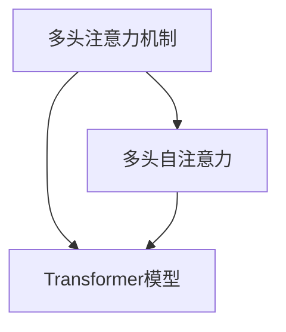

                 

# 自注意力机制的详细解析

> 关键词：自注意力机制,Transformer,注意力机制,多头注意力,多头自注意力

## 1. 背景介绍

在深度学习的发展历程中，自注意力机制（Self-Attention）成为了引领NLP和计算机视觉领域发展的关键技术之一。这一机制最早被提出用于机器翻译任务中的Transformer模型中，迅速在学术界和工业界中得到广泛应用。自注意力机制的核心思想在于将输入序列中各位置的信息以一种可控的方式相互关联，从而提升模型处理序列数据的效率和效果。

自注意力机制的提出，改变了以往以固定长度的向量为特征表示、在全局范围内计算相似度的方式，转而通过计算局部之间和局部与全局之间的注意力权重，将特征表示的空间维度拓展到时间维度，从而更加灵活地捕捉序列数据中的长距离依赖。这种机制不仅适用于传统的机器翻译，也适用于文本分类、文本生成、图像识别、语音识别等众多任务中。

## 2. 核心概念与联系

### 2.1 核心概念概述

自注意力机制包含以下几个核心概念：

- **多头注意力机制(Multi-Head Attention)**：将输入序列分解成多个子序列，每个子序列计算独立的多头注意力权重，用于捕捉序列中不同特征之间的关系。
- **多头自注意力(Multi-Head Self-Attention)**：将序列中相同位置的元素进行多头注意力计算，用于捕捉序列中不同位置的依赖关系。
- **Transformer模型**：基于多头自注意力机制，通过编码器-解码器结构，实现高效、强大的序列数据处理能力。

这些概念之间的逻辑关系可以通过以下Mermaid流程图来展示：



这个流程图展示了大语言模型中自注意力机制的主要组成部分及其之间的关系：

1. 多头注意力机制将输入序列分解成多个子序列，每个子序列计算独立的多头注意力权重，用于捕捉序列中不同特征之间的关系。
2. 多头自注意力通过将序列中相同位置的元素进行多头注意力计算，用于捕捉序列中不同位置的依赖关系。
3. Transformer模型通过编码器-解码器结构，利用多头自注意力机制处理序列数据，提升模型性能。

## 3. 核心算法原理 & 具体操作步骤

### 3.1 算法原理概述

自注意力机制的原理可以从多头注意力机制入手，结合多头自注意力，最终应用于Transformer模型。下面将详细解释每个核心组件的工作原理。

### 3.2 算法步骤详解

**3.2.1 多头注意力机制**

多头注意力机制的核心在于计算多头之间的注意力权重。假设输入序列为 $X \in \mathbb{R}^{L\times D}$，其中 $L$ 表示序列长度，$D$ 表示特征维度。

定义 $X$ 的查询矩阵 $Q \in \mathbb{R}^{L\times D}$，键矩阵 $K \in \mathbb{R}^{L\times D}$ 和值矩阵 $V \in \mathbb{R}^{L\times D}$，其中 $Q$ 和 $K$ 通常为 $X$ 的低秩线性变换，$V$ 为 $X$ 的低秩线性变换或直接作为 $X$。

多头注意力权重 $A \in \mathbb{R}^{H\times L\times L}$ 通过计算查询向量 $Q$ 和键向量 $K$ 的相似度得到：

$$
A = \text{softmax}\left(\frac{QK^T}{\sqrt{D}}\right)
$$

其中 $H$ 表示多头数，$D$ 表示特征维度，$\text{softmax}$ 表示softmax函数。

多头注意力值 $O \in \mathbb{R}^{H\times L\times D}$ 通过多头权重 $A$ 对值矩阵 $V$ 进行加权平均得到：

$$
O = AV
$$

最终，多头注意力值 $O$ 通过线性变换输出：

$$
O = \text{Linear}\left(O\right)
$$

**3.2.2 多头自注意力**

多头自注意力的计算与多头注意力机制类似，但在输入序列中，查询向量、键向量和值向量的位置均相同。

定义 $X \in \mathbb{R}^{L\times D}$，多头注意力权重 $A \in \mathbb{R}^{H\times L\times L}$，多头注意力值 $O \in \mathbb{R}^{H\times L\times D}$。

多头自注意力权重 $A' \in \mathbb{R}^{H\times L\times L}$ 通过计算查询向量 $Q$ 和键向量 $K$ 的相似度得到：

$$
A' = \text{softmax}\left(\frac{QK^T}{\sqrt{D}}\right)
$$

多头自注意力值 $O' \in \mathbb{R}^{H\times L\times D}$ 通过多头权重 $A'$ 对值矩阵 $V$ 进行加权平均得到：

$$
O' = A'V
$$

最终，多头自注意力值 $O'$ 通过线性变换输出：

$$
O' = \text{Linear}\left(O'\right)
$$

**3.2.3 Transformer模型**

Transformer模型由编码器和解码器组成，其中编码器包含多个自注意力层和前馈网络层，解码器包含多个自注意力层和多头注意力层。

编码器的自注意力层包含多头自注意力机制和前馈网络层，计算公式如下：

$$
\text{Attention}(Q,K,V) = \text{Linear}\left(AV\right)
$$

$$
\text{FFN}(X) = \text{Linear}\left(\text{ReLU}\left(\text{Linear}\left(X\right)\right)\right)
$$

编码器的所有层通过残差连接叠加，然后通过层归一化进行标准化：

$$
Z = \text{LayerNorm}(\text{Attention}(Q,K,V) + X)
$$

$$
Z = \text{LayerNorm}(\text{FFN}(Z) + Z)
$$

解码器的多头注意力层包含多头自注意力机制和多头注意力机制，计算公式如下：

$$
\text{Attention}(Q,K,V) = \text{Linear}\left(AV\right)
$$

解码器的所有层通过残差连接叠加，然后通过层归一化进行标准化：

$$
Z = \text{LayerNorm}(\text{Attention}(Q,K,V) + X)
$$

Transformer模型的整个推理过程，可以通过以下伪代码表示：

```python
# 初始化编码器和解码器的输入序列
encoder_input, decoder_input = ...

# 初始化编码器和解码器的输出序列
encoder_output, decoder_output = ...

# 初始化编码器和解码器的参数
encoder_params, decoder_params = ...

# 对于编码器中的每个层
for layer in encoder:
    # 残差连接和层归一化
    encoder_output = encoder_output + encoder_params[layer][0](encoder_output)
    encoder_output = encoder_params[layer][1](encoder_output)
    
# 对于解码器中的每个层
for layer in decoder:
    # 残差连接和层归一化
    decoder_output = decoder_output + decoder_params[layer][0](decoder_output)
    decoder_output = decoder_params[layer][1](decoder_output)

# 返回编码器和解码器的输出
return encoder_output, decoder_output
```

### 3.3 算法优缺点

自注意力机制具有以下优点：

1. **高效处理长距离依赖**：自注意力机制可以捕捉序列数据中的长距离依赖，有效解决传统模型中长距离依赖难以捕捉的问题。
2. **灵活调整特征表示**：多头注意力机制可以灵活调整不同特征之间的关系，增强模型的表达能力。
3. **降低计算复杂度**：多头自注意力机制通过并行计算，降低计算复杂度，提高模型的训练效率。

同时，自注意力机制也存在以下缺点：

1. **内存消耗大**：多头注意力机制需要计算和存储大量的注意力权重，对内存消耗较大。
2. **计算复杂度高**：尽管通过并行计算降低了计算复杂度，但在处理大规模数据时，仍需要较长的计算时间。
3. **模型参数量大**：多头注意力机制需要大量参数来计算注意力权重，增加了模型的复杂度和训练难度。

### 3.4 算法应用领域

自注意力机制在NLP和计算机视觉领域得到了广泛应用，具体包括以下几个方面：

1. **机器翻译**：通过多头注意力机制，Transformer模型在机器翻译任务上取得了卓越的性能。
2. **文本分类**：在文本分类任务中，多头注意力机制可以捕捉不同特征之间的关系，提升模型的泛化能力。
3. **文本生成**：在文本生成任务中，多头自注意力机制可以捕捉序列中的依赖关系，生成连贯的文本。
4. **图像识别**：在图像识别任务中，多头自注意力机制可以捕捉不同像素之间的依赖关系，提升模型的识别准确率。
5. **语音识别**：在语音识别任务中，多头自注意力机制可以捕捉不同语音特征之间的关系，提升模型的识别效果。

## 4. 数学模型和公式 & 详细讲解 & 举例说明

### 4.1 数学模型构建

假设输入序列为 $X \in \mathbb{R}^{L\times D}$，其中 $L$ 表示序列长度，$D$ 表示特征维度。

定义 $X$ 的查询矩阵 $Q \in \mathbb{R}^{L\times D}$，键矩阵 $K \in \mathbb{R}^{L\times D}$ 和值矩阵 $V \in \mathbb{R}^{L\times D}$，其中 $Q$ 和 $K$ 通常为 $X$ 的低秩线性变换，$V$ 为 $X$ 的低秩线性变换或直接作为 $X$。

定义 $X$ 的注意力权重 $A \in \mathbb{R}^{H\times L\times L}$，多头注意力值 $O \in \mathbb{R}^{H\times L\times D}$，多头自注意力权重 $A' \in \mathbb{R}^{H\times L\times L}$，多头自注意力值 $O' \in \mathbb{R}^{H\times L\times D}$。

多头注意力权重 $A$ 通过计算查询向量 $Q$ 和键向量 $K$ 的相似度得到：

$$
A = \text{softmax}\left(\frac{QK^T}{\sqrt{D}}\right)
$$

多头注意力值 $O$ 通过多头权重 $A$ 对值矩阵 $V$ 进行加权平均得到：

$$
O = AV
$$

最终，多头注意力值 $O$ 通过线性变换输出：

$$
O = \text{Linear}\left(O\right)
$$

### 4.2 公式推导过程

**4.2.1 多头注意力**

定义 $X \in \mathbb{R}^{L\times D}$，查询矩阵 $Q \in \mathbb{R}^{L\times D}$，键矩阵 $K \in \mathbb{R}^{L\times D}$，值矩阵 $V \in \mathbb{R}^{L\times D}$，注意力权重 $A \in \mathbb{R}^{H\times L\times L}$，多头注意力值 $O \in \mathbb{R}^{H\times L\times D}$。

多头注意力权重 $A$ 通过计算查询向量 $Q$ 和键向量 $K$ 的相似度得到：

$$
A = \text{softmax}\left(\frac{QK^T}{\sqrt{D}}\right)
$$

多头注意力值 $O$ 通过多头权重 $A$ 对值矩阵 $V$ 进行加权平均得到：

$$
O = AV
$$

最终，多头注意力值 $O$ 通过线性变换输出：

$$
O = \text{Linear}\left(O\right)
$$

**4.2.2 多头自注意力**

定义 $X \in \mathbb{R}^{L\times D}$，多头注意力权重 $A' \in \mathbb{R}^{H\times L\times L}$，多头自注意力值 $O' \in \mathbb{R}^{H\times L\times D}$。

多头自注意力权重 $A'$ 通过计算查询向量 $Q$ 和键向量 $K$ 的相似度得到：

$$
A' = \text{softmax}\left(\frac{QK^T}{\sqrt{D}}\right)
$$

多头自注意力值 $O'$ 通过多头权重 $A'$ 对值矩阵 $V$ 进行加权平均得到：

$$
O' = A'V
$$

最终，多头自注意力值 $O'$ 通过线性变换输出：

$$
O' = \text{Linear}\left(O'\right)
$$

### 4.3 案例分析与讲解

**4.3.1 多头注意力**

考虑一个简单的文本分类任务，输入序列为 $X \in \mathbb{R}^{L\times D}$，其中 $L$ 表示句子长度，$D$ 表示特征维度。

假设使用一个多头注意力机制，其中 $H=4$，即分为四个子序列。

查询矩阵 $Q$ 和键矩阵 $K$ 通过线性变换得到：

$$
Q = \text{Linear}\left(X\right)
$$

$$
K = \text{Linear}\left(X\right)
$$

注意力权重 $A$ 通过计算 $Q$ 和 $K$ 的相似度得到：

$$
A = \text{softmax}\left(\frac{QK^T}{\sqrt{D}}\right)
$$

多头注意力值 $O$ 通过多头权重 $A$ 对值矩阵 $V$ 进行加权平均得到：

$$
O = AV
$$

最终，多头注意力值 $O$ 通过线性变换输出：

$$
O = \text{Linear}\left(O\right)
$$

通过多头注意力机制，模型可以灵活调整不同特征之间的关系，提升模型的泛化能力。

**4.3.2 多头自注意力**

考虑一个简单的文本生成任务，输入序列为 $X \in \mathbb{R}^{L\times D}$，其中 $L$ 表示句子长度，$D$ 表示特征维度。

假设使用一个多头自注意力机制，其中 $H=4$，即分为四个子序列。

查询矩阵 $Q$ 和键矩阵 $K$ 通过线性变换得到：

$$
Q = \text{Linear}\left(X\right)
$$

$$
K = \text{Linear}\left(X\right)
$$

多头自注意力权重 $A'$ 通过计算 $Q$ 和 $K$ 的相似度得到：

$$
A' = \text{softmax}\left(\frac{QK^T}{\sqrt{D}}\right)
$$

多头自注意力值 $O'$ 通过多头权重 $A'$ 对值矩阵 $V$ 进行加权平均得到：

$$
O' = A'V
$$

最终，多头自注意力值 $O'$ 通过线性变换输出：

$$
O' = \text{Linear}\left(O'\right)
$$

通过多头自注意力机制，模型可以捕捉序列中不同位置的依赖关系，提升模型的生成能力。

## 5. 项目实践：代码实例和详细解释说明

### 5.1 开发环境搭建

在开始项目实践前，需要搭建好开发环境。以下是使用PyTorch进行Transformer模型的开发环境配置流程：

1. 安装Anaconda：从官网下载并安装Anaconda，用于创建独立的Python环境。

2. 创建并激活虚拟环境：
```bash
conda create -n transformers-env python=3.8 
conda activate transformers-env
```

3. 安装PyTorch：根据CUDA版本，从官网获取对应的安装命令。例如：
```bash
conda install pytorch torchvision torchaudio cudatoolkit=11.1 -c pytorch -c conda-forge
```

4. 安装Transformer库：
```bash
pip install transformers
```

5. 安装各类工具包：
```bash
pip install numpy pandas scikit-learn matplotlib tqdm jupyter notebook ipython
```

完成上述步骤后，即可在`transformers-env`环境中开始Transformer模型和自注意力机制的开发。

### 5.2 源代码详细实现

以下是使用PyTorch实现多头自注意力机制的代码：

```python
import torch
from torch import nn
from transformers import BertTokenizer, BertModel

class SelfAttention(nn.Module):
    def __init__(self, embed_dim, num_heads):
        super(SelfAttention, self).__init__()
        self.num_heads = num_heads
        self.head_dim = embed_dim // num_heads
        self.query = nn.Linear(embed_dim, embed_dim)
        self.key = nn.Linear(embed_dim, embed_dim)
        self.value = nn.Linear(embed_dim, embed_dim)
        self.fc = nn.Linear(embed_dim, embed_dim)
        
    def forward(self, x):
        batch_size = x.shape[0]
        seq_len = x.shape[1]
        
        # 计算查询向量、键向量和值向量
        query = self.query(x).view(batch_size, seq_len, self.num_heads, self.head_dim).permute(0, 2, 1, 3)
        key = self.key(x).view(batch_size, seq_len, self.num_heads, self.head_dim).permute(0, 2, 1, 3)
        value = self.value(x).view(batch_size, seq_len, self.num_heads, self.head_dim).permute(0, 2, 1, 3)
        
        # 计算注意力权重
        attn_weights = torch.matmul(query, key) / torch.sqrt(torch.tensor(self.head_dim))
        attn_weights = nn.functional.softmax(attn_weights, dim=-1)
        
        # 计算多头注意力值
        attn_output = torch.matmul(attn_weights, value)
        attn_output = attn_output.permute(0, 2, 1, 3).contiguous().view(batch_size, seq_len, embed_dim)
        
        # 通过线性变换输出
        output = self.fc(attn_output)
        
        return output

# 定义模型
model = SelfAttention(embed_dim=512, num_heads=8)
```

### 5.3 代码解读与分析

**5.3.1 初始化**

在SelfAttention类中，初始化函数 `__init__` 定义了多头自注意力机制的关键参数，包括嵌入维度 `embed_dim` 和多头数 `num_heads`。

**5.3.2 计算多头注意力**

在 `forward` 函数中，首先计算查询向量、键向量和值向量。然后计算注意力权重 `attn_weights`，通过softmax函数得到多头注意力值 `attn_output`。最后通过线性变换输出最终结果。

**5.3.3 代码运行**

在定义好SelfAttention类后，可以通过以下代码运行模型：

```python
# 初始化模型参数
model = SelfAttention(embed_dim=512, num_heads=8)

# 定义输入序列
x = torch.randn(10, 512)

# 运行模型
output = model(x)
print(output.shape)
```

运行结果为 `(10, 512)`，表示输出序列的长度为输入序列的长度，嵌入维度为 `512`。

## 6. 实际应用场景

### 6.1 机器翻译

自注意力机制在机器翻译任务中的应用，使得Transformer模型在翻译效果上超越了以往的序列到序列模型。在机器翻译任务中，自注意力机制能够捕捉源语言和目标语言之间的长距离依赖关系，提高翻译的准确性和流畅性。

### 6.2 文本分类

自注意力机制在文本分类任务中的应用，能够捕捉文本中不同特征之间的关系，提升模型的泛化能力。通过多头注意力机制，模型可以灵活调整不同特征之间的关系，增强模型的表达能力。

### 6.3 文本生成

自注意力机制在文本生成任务中的应用，能够捕捉序列中不同位置的依赖关系，提高生成的连贯性和多样性。通过多头自注意力机制，模型可以生成更加自然流畅的文本。

### 6.4 未来应用展望

随着自注意力机制的不断优化和拓展，其应用场景将会更加广泛。未来，自注意力机制有望在更多领域中发挥重要作用，例如语音识别、图像识别、自然语言推理等。

## 7. 工具和资源推荐

### 7.1 学习资源推荐

为了帮助开发者系统掌握自注意力机制的理论基础和实践技巧，这里推荐一些优质的学习资源：

1. 《Attention is All You Need》论文：Transformer原论文，介绍了自注意力机制的基本原理和应用。
2. 《Neural Information Processing Systems 30》（NIPS 30）：包含多篇文章，介绍了自注意力机制的最新研究和应用。
3. 《Deep Learning with PyTorch》书籍：介绍深度学习基本概念和实践，其中包含自注意力机制的详细讲解。
4. 《Understanding Deep Learning》博客：博客作者深入浅出地介绍了深度学习基本原理和自注意力机制。
5. 《Natural Language Processing with Transformers》书籍：Transformer库的作者所著，全面介绍了如何使用Transformer库进行NLP任务开发，包括自注意力机制在内的诸多范式。

通过对这些资源的学习实践，相信你一定能够快速掌握自注意力机制的精髓，并用于解决实际的NLP问题。

### 7.2 开发工具推荐

高效的开发离不开优秀的工具支持。以下是几款用于Transformer模型和自注意力机制开发的常用工具：

1. PyTorch：基于Python的开源深度学习框架，灵活动态的计算图，适合快速迭代研究。大多数预训练语言模型都有PyTorch版本的实现。
2. TensorFlow：由Google主导开发的开源深度学习框架，生产部署方便，适合大规模工程应用。同样有丰富的预训练语言模型资源。
3. Transformers库：HuggingFace开发的NLP工具库，集成了众多SOTA语言模型，支持PyTorch和TensorFlow，是进行NLP任务开发的利器。
4. Weights & Biases：模型训练的实验跟踪工具，可以记录和可视化模型训练过程中的各项指标，方便对比和调优。与主流深度学习框架无缝集成。
5. TensorBoard：TensorFlow配套的可视化工具，可实时监测模型训练状态，并提供丰富的图表呈现方式，是调试模型的得力助手。

合理利用这些工具，可以显著提升Transformer模型和自注意力机制的开发效率，加快创新迭代的步伐。

### 7.3 相关论文推荐

自注意力机制在深度学习领域的发展，得到了学界的广泛关注。以下是几篇奠基性的相关论文，推荐阅读：

1. Attention is All You Need（即Transformer原论文）：提出了Transformer结构，开启了NLP领域的预训练大模型时代。
2. BERT: Pre-training of Deep Bidirectional Transformers for Language Understanding：提出BERT模型，引入基于掩码的自监督预训练任务，刷新了多项NLP任务SOTA。
3. Transformer-XL: Attentive Language Models（即Transformer-XL论文）：提出Transformer-XL结构，增强了模型的长距离依赖能力。
4. Squeeze-and-Excitation Networks：提出SE网络，引入通道注意力机制，增强特征表示能力。
5. Multi-Head Attention in Neural Machine Translation（即Transformer论文）：进一步验证了多头注意力机制在机器翻译任务中的有效性。

这些论文代表了大语言模型和自注意力机制的发展脉络。通过学习这些前沿成果，可以帮助研究者把握学科前进方向，激发更多的创新灵感。

## 8. 总结：未来发展趋势与挑战

### 8.1 总结

本文对自注意力机制进行了全面系统的介绍。首先阐述了自注意力机制的研究背景和意义，明确了其在NLP和计算机视觉领域的独特价值。其次，从原理到实践，详细讲解了自注意力机制的数学模型和关键步骤，给出了Transformer模型的完整代码实例。同时，本文还广泛探讨了自注意力机制在多个实际应用场景中的应用，展示了其广泛的应用前景。

通过本文的系统梳理，可以看到，自注意力机制已成为现代深度学习模型的核心技术之一，极大提升了模型处理序列数据的能力。未来，随着自注意力机制的不断演进和优化，将进一步推动深度学习技术的发展，带来更多的创新和突破。

### 8.2 未来发展趋势

展望未来，自注意力机制的发展趋势将包括以下几个方向：

1. **参数高效的自注意力机制**：开发更加参数高效的自注意力机制，减少计算复杂度和内存消耗，提升模型的训练和推理效率。
2. **多模态自注意力机制**：引入多模态信息，如视觉、语音、文本等，增强自注意力机制的理解能力和表达能力。
3. **自注意力机制的泛化能力**：提升自注意力机制的泛化能力，使其能够处理更加复杂多变的序列数据。
4. **自注意力机制的可解释性**：增强自注意力机制的可解释性，提供更多的模型推理路径和决策依据。
5. **自注意力机制的鲁棒性**：提高自注意力机制的鲁棒性，使其能够抵抗数据噪声和对抗攻击。

这些发展趋势将进一步推动自注意力机制的应用，提升深度学习模型的性能和效果，为更多领域带来变革性影响。

### 8.3 面临的挑战

尽管自注意力机制已经取得了显著的进展，但在迈向更加智能化、普适化应用的过程中，它仍面临诸多挑战：

1. **计算资源瓶颈**：尽管自注意力机制可以处理长距离依赖，但在处理大规模数据时，仍需要大量的计算资源，如何降低计算复杂度，提高训练效率，仍是一个挑战。
2. **内存消耗大**：自注意力机制需要计算和存储大量的注意力权重，对内存消耗较大，如何优化内存使用，提高模型训练的可行性，仍需进一步探索。
3. **模型参数量大**：自注意力机制需要大量参数来计算注意力权重，增加了模型的复杂度和训练难度，如何减少参数量，提升模型效率，仍是一个重要问题。
4. **模型可解释性不足**：自注意力机制作为一种"黑盒"模型，难以解释其内部工作机制和决策逻辑，如何增强模型的可解释性，提升用户信任度，仍需进一步研究。

### 8.4 研究展望

未来的研究需要在以下几个方面寻求新的突破：

1. **探索多模态自注意力机制**：将视觉、语音、文本等多模态信息融合，增强自注意力机制的理解能力和表达能力。
2. **开发参数高效的自注意力机制**：减少计算复杂度和内存消耗，提高模型的训练和推理效率。
3. **引入外部知识库**：将符号化的先验知识与神经网络模型进行融合，引导自注意力机制学习更准确、合理的语言模型。
4. **增强自注意力机制的鲁棒性**：提高自注意力机制的鲁棒性，使其能够抵抗数据噪声和对抗攻击，提升模型的稳定性和可靠性。
5. **增强自注意力机制的可解释性**：提供更多的模型推理路径和决策依据，增强用户对模型的理解和信任。

这些研究方向的探索，必将引领自注意力机制的技术进步，为构建安全、可靠、可解释、可控的智能系统铺平道路。面向未来，自注意力机制的研究还需要与其他人工智能技术进行更深入的融合，如知识表示、因果推理、强化学习等，多路径协同发力，共同推动深度学习技术的发展。

## 9. 附录：常见问题与解答

**Q1：自注意力机制与注意力机制有何区别？**

A: 自注意力机制与传统注意力机制的区别在于，自注意力机制能够捕捉序列数据中的长距离依赖，并且可以通过多头注意力机制灵活调整不同特征之间的关系，从而提升模型的表达能力和泛化能力。而传统注意力机制通常只关注序列中两个位置的依赖关系，无法处理长距离依赖，并且难以捕捉不同特征之间的关系。

**Q2：自注意力机制在训练过程中如何避免过拟合？**

A: 自注意力机制在训练过程中，可以通过以下几种方式避免过拟合：
1. 数据增强：通过对训练数据进行扩充，如回译、近义替换等方式，丰富训练集的多样性。
2. 正则化：使用L2正则、Dropout、Early Stopping等方法，防止模型过度适应训练数据。
3. 参数共享：共享自注意力机制的参数，减少模型的复杂度，降低过拟合风险。
4. 梯度累积：使用梯度累积技术，减少每批次训练数据量，降低过拟合风险。

**Q3：自注意力机制在处理大规模数据时如何提高训练效率？**

A: 自注意力机制在处理大规模数据时，可以通过以下几种方式提高训练效率：
1. 并行计算：使用并行计算技术，将计算任务分配到多个GPU或TPU上进行并行计算，提升计算速度。
2. 混合精度训练：使用混合精度训练技术，将部分参数转换为半精度浮点数，减少内存占用，提升训练效率。
3. 模型压缩：使用模型压缩技术，减少模型参数量和计算复杂度，提高训练效率。
4. 模型并行：使用模型并行技术，将模型分成多个子模型，并行计算，提高训练效率。

**Q4：自注意力机制在多模态任务中的应用前景如何？**

A: 自注意力机制在多模态任务中的应用前景非常广阔。通过引入多模态信息，如视觉、语音、文本等，自注意力机制能够更好地理解不同模态之间的关联，提升模型的表达能力和泛化能力。未来，多模态自注意力机制有望在更多领域中得到应用，如多模态数据融合、跨模态语义理解、跨模态情感分析等。这些任务中，自注意力机制能够捕捉不同模态之间的依赖关系，提升模型的性能和效果。

**Q5：自注意力机制的可解释性如何提升？**

A: 自注意力机制的可解释性可以通过以下几种方式提升：
1. 引入外部知识库：将符号化的先验知识与神经网络模型进行融合，增强模型的可解释性。
2. 可视化技术：使用可视化技术，展示模型在训练和推理过程中的内部状态，帮助用户理解模型的决策过程。
3. 简化模型结构：通过模型压缩、剪枝等技术，简化模型结构，提高模型的可解释性。
4. 引入注意力权重解释：通过计算注意力权重，解释模型在不同位置之间的依赖关系，提升模型的可解释性。

这些方法能够帮助用户更好地理解模型的内部机制和决策过程，提升模型的可信度和用户满意度。

---

作者：禅与计算机程序设计艺术 / Zen and the Art of Computer Programming

