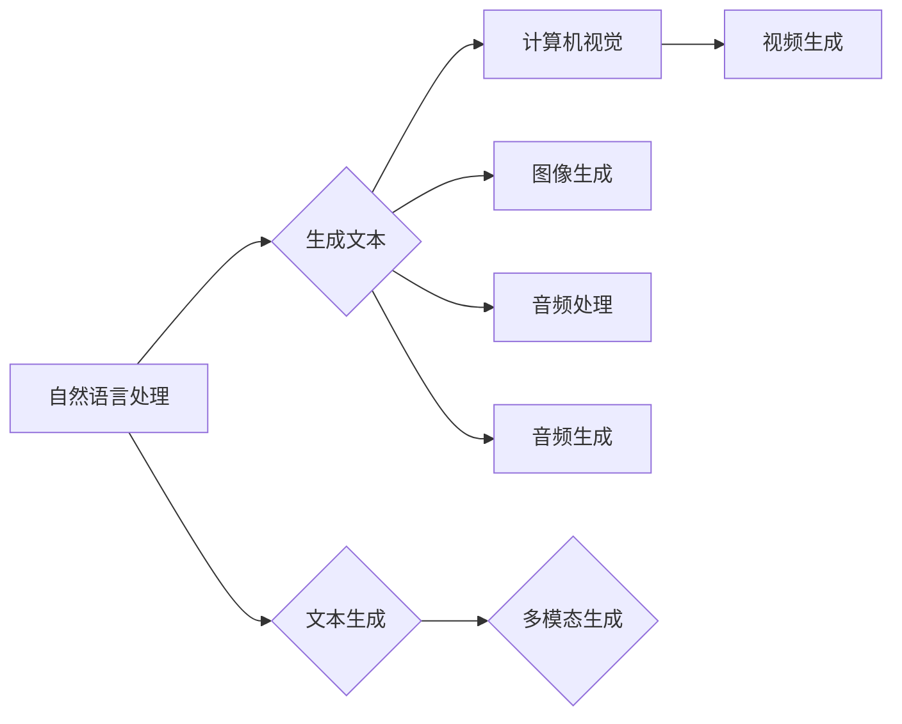

# AIGC从入门到实战：登录 D-ID

作者：禅与计算机程序设计艺术 / Zen and the Art of Computer Programming

## 关键词：

人工智能生成内容（AIGC）、D-ID、文本生成、图像生成、多模态生成、AI应用开发

## 1. 背景介绍

### 1.1 问题的由来

随着人工智能技术的飞速发展，人工智能生成内容（Artificial Intelligence Generated Content，简称AIGC）逐渐成为研究热点。AIGC技术能够根据用户输入的指令，自动生成文本、图像、视频等多种类型的内容，极大地降低了内容创作的门槛，为各行各业带来了前所未有的创新机遇。

### 1.2 研究现状

目前，AIGC技术主要集中在以下几个方面：

* **文本生成**：基于自然语言处理（NLP）技术，生成新闻、报告、诗歌、故事等文本内容。
* **图像生成**：基于深度学习技术，生成具有逼真视觉效果的画面。
* **视频生成**：基于视频编解码和生成模型，生成具有连贯性的视频内容。
* **多模态生成**：结合多种模态的信息，生成具有丰富表现力的内容。

### 1.3 研究意义

AIGC技术的发展，对于推动媒体行业、娱乐产业、教育领域以及日常生活等方面具有重要意义。它能够：

* **降低内容创作门槛**：让更多的人参与到内容创作中来，丰富内容生态。
* **提高内容生产效率**：自动化生成内容，节省人力成本。
* **创新应用场景**：拓展AIGC技术在各个领域的应用，创造新的价值。

### 1.4 本文结构

本文将带领读者从入门到实战，深入了解AIGC技术，并重点介绍D-ID平台的使用。文章结构如下：

1. **核心概念与联系**：介绍AIGC的基本概念和相关技术。
2. **核心算法原理 & 具体操作步骤**：分析AIGC的核心算法原理，并详细介绍操作步骤。
3. **数学模型和公式 & 详细讲解 & 举例说明**：讲解AIGC中常用的数学模型和公式，并通过实例进行说明。
4. **项目实践：代码实例和详细解释说明**：通过一个实际项目，展示如何使用AIGC技术。
5. **实际应用场景**：探讨AIGC在各个领域的应用场景。
6. **未来应用展望**：展望AIGC技术的未来发展趋势。
7. **工具和资源推荐**：推荐学习AIGC技术的资源和工具。
8. **总结：未来发展趋势与挑战**：总结AIGC技术的研究成果，并探讨其面临的挑战和未来研究方向。

## 2. 核心概念与联系

### 2.1 AIGC的概念

AIGC是指利用人工智能技术自动生成内容的过程。它涵盖了文本、图像、视频等多种类型的内容生成。

### 2.2 AIGC的相关技术

* **自然语言处理（NLP）**：用于理解和生成文本内容。
* **计算机视觉（CV）**：用于理解和生成图像内容。
* **音频处理**：用于理解和生成音频内容。
* **生成对抗网络（GANs）**：用于生成逼真的图像、视频等内容。

### 2.3 AIGC的技术关系

AIGC技术涉及多种人工智能技术，如图2.1所示：



## 3. 核心算法原理 & 具体操作步骤

### 3.1 算法原理概述

AIGC的核心算法主要分为以下几种：

* **文本生成**：基于RNN、LSTM、BERT等NLP模型。
* **图像生成**：基于GANs、VAEs等生成模型。
* **视频生成**：基于视频编解码、视频生成模型等。
* **多模态生成**：结合多种模态的生成模型。

### 3.2 算法步骤详解

以文本生成为例，AIGC的算法步骤如下：

1. **数据预处理**：对输入文本进行预处理，如分词、去停用词等。
2. **模型训练**：使用预训练的NLP模型进行微调，使其适应特定任务。
3. **生成文本**：根据输入文本和模型参数，生成新的文本内容。

### 3.3 算法优缺点

* **优点**：
    * 自动化生成内容，提高生产效率。
    * 生成内容具有多样性、创新性。
    * 可应用于多种领域，如新闻、娱乐、教育等。
* **缺点**：
    * 模型训练需要大量数据和计算资源。
    * 生成内容可能存在偏见、错误等问题。
    * 技术门槛较高，需要一定的专业知识。

### 3.4 算法应用领域

AIGC技术可应用于以下领域：

* **新闻**：自动生成新闻报道、体育赛事报道等。
* **娱乐**：生成剧本、小说、音乐等。
* **教育**：自动生成教育内容，如课程、教材等。
* **医疗**：辅助医生进行诊断、治疗等。
* **商业**：生成营销文案、广告等。

## 4. 数学模型和公式 & 详细讲解 & 举例说明

### 4.1 数学模型构建

AIGC技术中常用的数学模型包括：

* **自然语言处理**：RNN、LSTM、BERT等。
* **计算机视觉**：CNN、GANs、VAEs等。
* **音频处理**：循环神经网络（RNN）、卷积神经网络（CNN）等。

### 4.2 公式推导过程

以下以RNN模型为例，简要介绍公式推导过程：

1. **输入序列**：假设输入序列为$x_1, x_2, \dots, x_n$，对应的输出序列为$y_1, y_2, \dots, y_n$。
2. **隐藏状态**：$h_t = f(W_x x_t + W_h h_{t-1} + b_h)$，其中$f$为非线性激活函数，$W_x$、$W_h$为权重矩阵，$b_h$为偏置向量。
3. **输出层**：$y_t = g(W_y h_t + b_y)$，其中$g$为输出函数，$W_y$为权重矩阵，$b_y$为偏置向量。

### 4.3 案例分析与讲解

以新闻文本生成为例，分析AIGC技术的应用。

1. **数据预处理**：对新闻文本进行分词、去停用词等操作。
2. **模型训练**：使用预训练的BERT模型进行微调，使其适应新闻文本生成任务。
3. **生成文本**：根据输入文本和模型参数，生成新的新闻文本。

### 4.4 常见问题解答

1. **Q：AIGC技术是否会取代人类创作者**？
    A：AIGC技术可以辅助人类创作者进行内容创作，提高效率，但无法完全取代人类创作者的创造力、情感和审美。

2. **Q：AIGC技术会产生什么负面影响**？
    A：AIGC技术可能会产生以下负面影响：
        * 生成内容可能存在偏见、错误等问题。
        * 侵犯他人知识产权。
        * 人类创作者失业。

## 5. 项目实践：代码实例和详细解释说明

### 5.1 开发环境搭建

1. 安装Python和相关库：
    ```bash
    pip install python
    pip install transformers
    pip install torch
    ```
2. 下载预训练的BERT模型：
    ```bash
    python -m transformers.download bert-base-chinese
    ```

### 5.2 源代码详细实现

以下是一个使用BERT模型进行文本生成的简单示例：

```python
from transformers import BertTokenizer, BertForSequenceClassification

# 加载预训练的BERT模型和分词器
tokenizer = BertTokenizer.from_pretrained('bert-base-chinese')
model = BertForSequenceClassification.from_pretrained('bert-base-chinese')

# 定义文本生成函数
def generate_text(prompt, max_length=50):
    inputs = tokenizer(prompt, return_tensors='pt', max_length=max_length, truncation=True)
    outputs = model.generate(inputs['input_ids'], max_length=max_length, num_return_sequences=1)
    text = tokenizer.decode(outputs[0], skip_special_tokens=True)
    return text

# 生成文本
prompt = "今天天气怎么样？"
generated_text = generate_text(prompt)
print(generated_text)
```

### 5.3 代码解读与分析

1. **导入库**：导入必要的库，包括transformers、torch等。
2. **加载模型**：加载预训练的BERT模型和分词器。
3. **定义文本生成函数**：根据输入文本和模型参数，生成新的文本内容。
4. **生成文本**：使用定义好的函数生成文本。

### 5.4 运行结果展示

运行上述代码，输入文本"今天天气怎么样？"，将生成类似以下内容的文本：

```
今天天气晴朗，温度适宜，适合外出活动。
```

## 6. 实际应用场景

### 6.1 新闻生成

AIGC技术可以自动生成新闻报道、体育赛事报道等，提高新闻生产效率。

### 6.2 剧本生成

AIGC技术可以自动生成剧本、小说等，为影视行业提供创作灵感。

### 6.3 教育内容生成

AIGC技术可以自动生成课程、教材等教育内容，提高教学效率。

### 6.4 医疗诊断

AIGC技术可以辅助医生进行诊断，提高诊断准确率。

### 6.5 营销文案生成

AIGC技术可以自动生成营销文案、广告等，提高营销效果。

## 7. 未来应用展望

### 7.1 多模态生成

随着人工智能技术的不断发展，多模态生成将成为AIGC技术的一个重要发展方向。通过融合多种模态的信息，生成更加丰富、具有表现力的内容。

### 7.2 自动化内容审核

AIGC技术可以用于自动化内容审核，提高审核效率，降低人力成本。

### 7.3 创意设计

AIGC技术可以用于创意设计领域，如建筑设计、服装设计等，为设计师提供灵感。

### 7.4 自动化编程

AIGC技术可以用于自动化编程，提高软件开发效率。

## 8. 工具和资源推荐

### 8.1 学习资源推荐

* **书籍**：
    * 《深度学习》（Ian Goodfellow等著）
    * 《自然语言处理入门》（赵军著）
    * 《计算机视觉：算法与应用》（蔡立杨著）
* **在线课程**：
    * Coursera上的《深度学习》课程
    * Udacity的《深度学习工程师纳米学位》
    * fast.ai的《深度学习课程》

### 8.2 开发工具推荐

* **NLP**：
    * Hugging Face的Transformers库
    * NLTK库
* **计算机视觉**：
    * OpenCV库
    * PyTorch库
* **多模态**：
    * MixPoint库
    * OpenSMILE库

### 8.3 相关论文推荐

* **NLP**：
    * "BERT: Pre-training of Deep Bidirectional Transformers for Language Understanding"（BERT论文）
    * "Generative Adversarial Nets"（GANs论文）
* **计算机视觉**：
    * "Deep Learning for Computer Vision with Python"（深度学习在计算机视觉中的应用）
    * "A Survey of Generative Adversarial Networks"（GANs综述）

### 8.4 其他资源推荐

* **技术社区**：
    * GitHub
    * Stack Overflow
* **博客**：
    * Medium
    * 掘金

## 9. 总结：未来发展趋势与挑战

### 9.1 研究成果总结

本文从AIGC的概念、技术、应用等方面进行了详细介绍，并重点介绍了D-ID平台的使用。通过学习本文，读者可以对AIGC技术有一个全面的了解。

### 9.2 未来发展趋势

AIGC技术在未来将朝着以下方向发展：

* **多模态生成**：融合多种模态的信息，生成更加丰富、具有表现力的内容。
* **自动化内容审核**：提高内容审核效率，降低人力成本。
* **创意设计**：为设计师提供灵感，提高创意设计水平。
* **自动化编程**：提高软件开发效率。

### 9.3 面临的挑战

AIGC技术在发展过程中也面临着一些挑战：

* **数据质量**：AIGC模型的性能很大程度上依赖于训练数据的质量。
* **算法偏差**：模型可能会学习到数据中的偏见，导致生成内容存在偏见。
* **伦理问题**：AIGC技术可能会引发版权、隐私等方面的伦理问题。

### 9.4 研究展望

为了应对这些挑战，未来的研究可以从以下几个方面进行：

* **提高数据质量**：收集更多高质量、多样化的数据，提高模型的鲁棒性。
* **消除算法偏差**：研究如何消除或减小算法偏差，提高模型的公平性。
* **制定伦理规范**：制定相关的伦理规范，确保AIGC技术的健康发展。

总之，AIGC技术作为人工智能领域的重要分支，具有广泛的应用前景。通过不断的研究和创新，AIGC技术将更好地服务于人类社会。