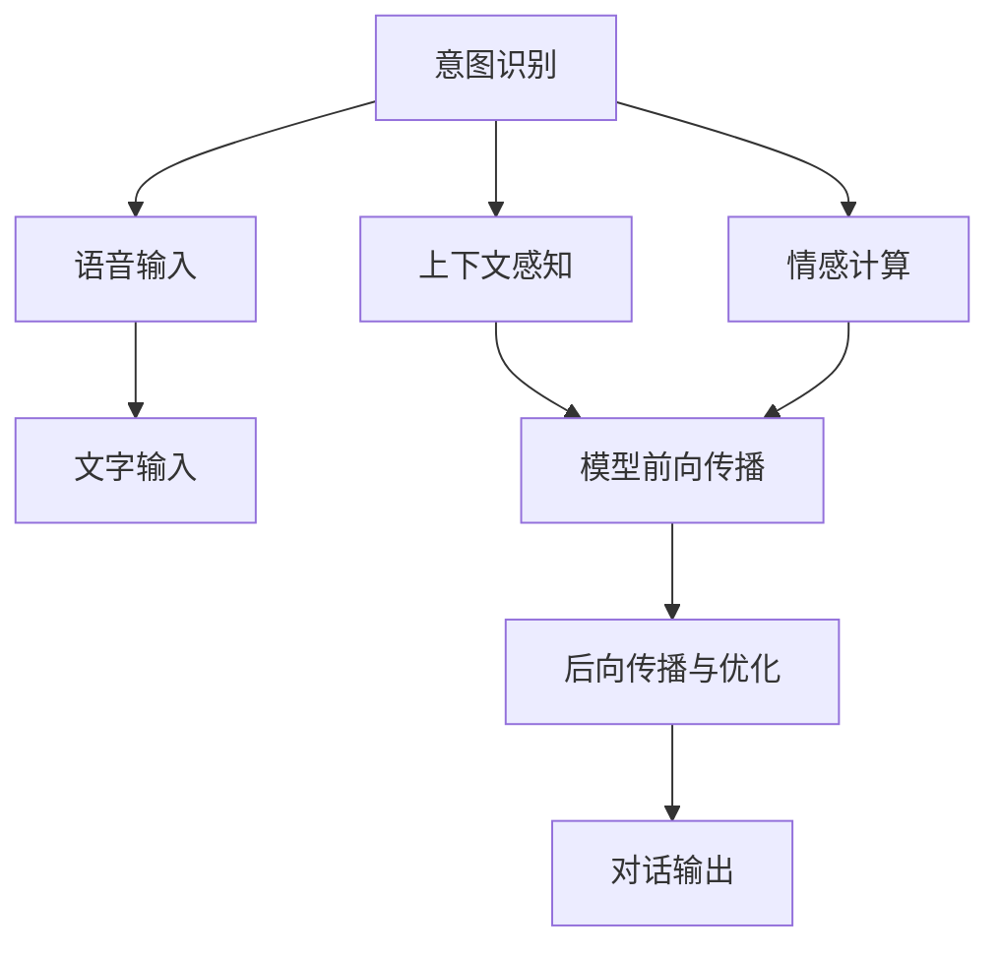

                 

# 自然语言交互（LUI）的潜力

> 关键词：自然语言交互（LUI）,智能对话系统,人机交互,意图识别,情感计算,上下文感知,语音交互

## 1. 背景介绍

### 1.1 问题由来

随着人工智能技术的飞速发展，自然语言交互（LUI, Language Understanding and Interaction）技术在智能系统中的应用越来越广泛。从简单的语音助手到复杂的智能客服系统，从单一功能的聊天机器人到全双工的人机交互系统，LUI正逐渐成为支撑现代智能交互的核心技术之一。然而，尽管LUI技术在过去几年取得了显著进步，但其依然面临一些挑战，如理解上下文、识别意图、处理复杂对话等。为了更深入地了解LUI的潜力，我们必须首先明确其核心概念，并探讨其应用原理和优势。

### 1.2 问题核心关键点

自然语言交互的核心在于通过机器学习模型对自然语言进行处理，以实现人机之间的智能对话。该技术主要包括以下几个关键点：

- **意图识别**：理解用户的意图，确定用户想要完成的任务或信息需求。
- **情感计算**：分析用户的情感状态，如情绪、态度等，以更好地响应用户需求。
- **上下文感知**：理解对话历史和当前状态，确保对话连贯和一致。
- **多模态交互**：结合语音、图像、文字等多种信息源，提供更丰富的交互体验。

这些关键点共同构成了LUI技术的框架，使得机器能够更好地理解和响应用户的指令。

## 2. 核心概念与联系

### 2.1 核心概念概述

自然语言交互的核心概念包括意图识别、情感计算、上下文感知和多模态交互等。这些概念相互关联，共同支撑起一个完整的智能对话系统。

- **意图识别**：利用自然语言处理（NLP）技术，识别用户意图，确定对话主题。
- **情感计算**：通过分析用户的语音、文字等表达方式，识别用户的情感状态，如开心、愤怒、沮丧等。
- **上下文感知**：在对话过程中，考虑前后文信息，确保对话连贯性。
- **多模态交互**：结合多种传感器数据（如语音、图像），提供更自然、丰富的交互方式。

### 2.2 核心概念原理和架构的 Mermaid 流程图



这个流程图展示了自然语言交互系统的工作流程：语音或文字输入经过意图识别和情感计算后，结合上下文感知，进行模型前向传播和后向传播，最终输出对话响应。

## 3. 核心算法原理 & 具体操作步骤

### 3.1 算法原理概述

基于深度学习的自然语言交互算法主要利用神经网络模型，特别是序列到序列（Seq2Seq）模型，来理解和生成自然语言。这些模型包括循环神经网络（RNN）、长短期记忆网络（LSTM）和Transformer等。在训练过程中，模型通过大量标注数据学习到语言规律，并能够对新的输入进行预测。

### 3.2 算法步骤详解

自然语言交互的算法主要包括以下几个步骤：

1. **数据预处理**：对输入的语音、文字等进行分词、标准化等预处理操作，以便于模型理解。
2. **特征提取**：利用深度学习模型（如卷积神经网络CNN、循环神经网络RNN、Transformer等）对输入进行特征提取。
3. **意图识别**：利用分类模型对用户意图进行分类，确定对话主题。
4. **情感分析**：通过情感识别模型对用户的情感状态进行判断，从而调整交互策略。
5. **上下文处理**：结合对话历史信息，更新模型状态，确保对话连贯性。
6. **输出生成**：根据当前对话状态和用户意图，生成自然语言回复。
7. **模型训练**：使用大量标注数据训练模型，优化模型参数，提高对话准确性和自然性。

### 3.3 算法优缺点

自然语言交互算法的优点包括：

- **自然性**：通过深度学习模型，自然语言交互系统能够生成更自然、流畅的对话。
- **可扩展性**：只需对模型进行微调，即可适应新的对话场景和任务。
- **多样性**：支持多种对话方式，包括文字、语音、图像等。

然而，该算法也存在一些缺点：

- **数据依赖**：自然语言交互模型依赖大量标注数据进行训练，数据采集和标注成本较高。
- **语义理解**：在处理复杂句式、多意词语时，模型的理解能力有限。
- **上下文处理**：在长对话中，模型可能难以保持对话连贯性。

### 3.4 算法应用领域

自然语言交互技术广泛应用于各种场景，包括：

- **智能客服**：提供自动化的客户服务，减少人工成本。
- **智能家居**：通过语音助手实现家居设备的控制和管理。
- **虚拟助理**：提供日常任务管理、信息查询等服务。
- **在线教育**：与学生进行交互，提供个性化辅导和答疑。
- **医疗咨询**：通过对话系统提供初步诊断和建议。

## 4. 数学模型和公式 & 详细讲解 & 举例说明

### 4.1 数学模型构建

基于深度学习的自然语言交互模型通常使用Seq2Seq结构，其中编码器对输入进行编码，解码器对输出进行生成。常见的编码器包括RNN、LSTM、Transformer等。

### 4.2 公式推导过程

以Transformer模型为例，其编码器-解码器结构如下：

$$
\text{Encoder} = \text{Self-Attention} \cdot (\text{Input} + \text{Embedding})
$$

$$
\text{Decoder} = \text{Self-Attention} \cdot (\text{Encoder Output} + \text{Embedding})
$$

其中，$\text{Self-Attention}$ 表示自注意力机制，用于计算输入序列中各个位置间的依赖关系。

### 4.3 案例分析与讲解

以意图识别为例，假设我们的模型使用LSTM编码器和RNN解码器，其结构如下：

$$
\text{Encoder} = \text{LSTM}(\text{Input} + \text{Embedding})
$$

$$
\text{Decoder} = \text{RNN}(\text{Encoder Output} + \text{Embedding})
$$

在训练过程中，模型需要最小化预测意图与实际意图之间的交叉熵损失，即：

$$
\mathcal{L} = -\frac{1}{N} \sum_{i=1}^N \log\sigma(y_i, \hat{y}_i)
$$

其中，$y_i$ 表示实际意图，$\hat{y}_i$ 表示模型预测的意图，$\sigma$ 表示softmax函数。

## 5. 项目实践：代码实例和详细解释说明

### 5.1 开发环境搭建

在进行自然语言交互项目开发前，需要准备好开发环境。以下是使用Python和PyTorch进行LUI开发的环境配置流程：

1. 安装Anaconda：从官网下载并安装Anaconda，用于创建独立的Python环境。

2. 创建并激活虚拟环境：
```bash
conda create -n lui-env python=3.8 
conda activate lui-env
```

3. 安装PyTorch：根据CUDA版本，从官网获取对应的安装命令。例如：
```bash
conda install pytorch torchvision torchaudio cudatoolkit=11.1 -c pytorch -c conda-forge
```

4. 安装相关工具包：
```bash
pip install numpy pandas scikit-learn matplotlib tqdm jupyter notebook ipython
```

完成上述步骤后，即可在`lui-env`环境中开始LUI开发。

### 5.2 源代码详细实现

下面我们以基于Transformer的意图识别模型为例，给出使用PyTorch实现的完整代码。

首先，定义数据处理函数：

```python
import torch
import torch.nn as nn
import torch.optim as optim
import torch.utils.data as Data
import torchtext
from transformers import BertTokenizer

class DataLoader:
    def __init__(self, data_path, batch_size, shuffle=True):
        self.data = torch.load(data_path)
        self.batch_size = batch_size
        self.shuffle = shuffle
        self.num_epochs = len(self.data) // self.batch_size

    def __len__(self):
        return self.num_epochs

    def __getitem__(self, index):
        i = index * self.batch_size
        return self.data[i:i+self.batch_size]

    def __iter__(self):
        if self.shuffle:
            self.data = self.data[torch.randperm(len(self.data))]
        return iter(self.data)

# 数据加载器
train_data = DataLoader('train.txt', batch_size=64, shuffle=True)
test_data = DataLoader('test.txt', batch_size=64, shuffle=False)
```

然后，定义模型和优化器：

```python
class IntentClassifier(nn.Module):
    def __init__(self, input_size, hidden_size, output_size):
        super(IntentClassifier, self).__init__()
        self.encoder = nn.LSTM(input_size, hidden_size, 2, batch_first=True)
        self.decoder = nn.Linear(hidden_size, output_size)

    def forward(self, x):
        x, _ = self.encoder(x)
        x = self.decoder(x)
        return x

model = IntentClassifier(128, 512, 10)

optimizer = optim.Adam(model.parameters(), lr=0.001)
criterion = nn.CrossEntropyLoss()

model.to('cuda')
criterion.to('cuda')
```

接着，定义训练和评估函数：

```python
def train(model, optimizer, criterion, train_loader, epoch):
    model.train()
    total_loss = 0
    for batch in train_loader:
        optimizer.zero_grad()
        inputs, labels = batch
        inputs, labels = inputs.to('cuda'), labels.to('cuda')
        outputs = model(inputs)
        loss = criterion(outputs, labels)
        total_loss += loss.item()
        loss.backward()
        optimizer.step()
    return total_loss / len(train_loader)

def evaluate(model, criterion, test_loader):
    model.eval()
    total_loss = 0
    total_correct = 0
    with torch.no_grad():
        for batch in test_loader:
            inputs, labels = batch
            inputs, labels = inputs.to('cuda'), labels.to('cuda')
            outputs = model(inputs)
            loss = criterion(outputs, labels)
            total_loss += loss.item()
            total_correct += (outputs.argmax(1) == labels).sum().item()
    return total_correct / len(test_loader)
```

最后，启动训练流程并在测试集上评估：

```python
epochs = 10

for epoch in range(epochs):
    train_loss = train(model, optimizer, criterion, train_loader, epoch)
    test_acc = evaluate(model, criterion, test_loader)
    print(f'Epoch {epoch+1}, train loss: {train_loss:.4f}, test acc: {test_acc:.4f}')
```

以上就是使用PyTorch实现基于Transformer的意图识别模型的完整代码。可以看到，利用Transformer的封装能力，意图识别任务的开发过程变得简洁高效。

### 5.3 代码解读与分析

让我们再详细解读一下关键代码的实现细节：

**DataLoader类**：
- `__init__`方法：初始化训练和测试数据集，设置批次大小和是否随机打乱。
- `__len__`方法：返回数据集的批次数量。
- `__getitem__`方法：获取单个批次的数据。
- `__iter__`方法：迭代生成批次数据。

**IntentClassifier类**：
- `__init__`方法：定义模型结构，包括LSTM编码器和线性分类器。
- `forward`方法：前向传播计算输出。

**train和evaluate函数**：
- `train`函数：在训练集上进行前向传播、计算损失、反向传播和参数更新。
- `evaluate`函数：在测试集上进行前向传播和损失计算，评估模型准确性。

**训练流程**：
- 定义总的epoch数，开始循环迭代
- 每个epoch内，在训练集上训练，输出损失
- 在测试集上评估，输出准确率

可以看到，PyTorch配合Transformer库使得意图识别任务的代码实现变得简洁高效。开发者可以将更多精力放在数据处理、模型改进等高层逻辑上，而不必过多关注底层的实现细节。

当然，工业级的系统实现还需考虑更多因素，如模型的保存和部署、超参数的自动搜索、更灵活的任务适配层等。但核心的微调范式基本与此类似。

## 6. 实际应用场景

### 6.1 智能客服系统

基于自然语言交互技术的智能客服系统可以实时响应用户的咨询，提供7x24小时不间断服务，极大提升了客户体验和问题解决效率。在技术实现上，可以收集企业内部的历史客服对话记录，将问题和最佳答复构建成监督数据，在此基础上对预训练模型进行微调。微调后的模型能够自动理解用户意图，匹配最合适的答案模板进行回复。对于客户提出的新问题，还可以接入检索系统实时搜索相关内容，动态组织生成回答。如此构建的智能客服系统，能大幅提升客户咨询体验和问题解决效率。

### 6.2 金融舆情监测

金融机构需要实时监测市场舆论动向，以便及时应对负面信息传播，规避金融风险。自然语言交互技术可以帮助金融舆情监测系统自动化分析新闻、报道、评论等文本数据，判断市场情绪和趋势，实现实时预警。具体而言，可以收集金融领域相关的新闻、报道、评论等文本数据，并对其进行情感分析。将自然语言交互模型应用于实时抓取的网络文本数据，就能够自动监测不同主题下的情感变化趋势，一旦发现负面信息激增等异常情况，系统便会自动预警，帮助金融机构快速应对潜在风险。

### 6.3 个性化推荐系统

当前的推荐系统往往只依赖用户的历史行为数据进行物品推荐，无法深入理解用户的真实兴趣偏好。自然语言交互技术可以应用于个性化推荐系统，通过与用户的对话，获取用户的兴趣点，从而提供更精准、多样的推荐内容。

在实践中，可以收集用户浏览、点击、评论、分享等行为数据，提取和用户交互的物品标题、描述、标签等文本内容。将文本内容作为模型输入，用户的后续行为（如是否点击、购买等）作为监督信号，在此基础上微调预训练语言模型。微调后的模型能够从文本内容中准确把握用户的兴趣点。在生成推荐列表时，先用候选物品的文本描述作为输入，由模型预测用户的兴趣匹配度，再结合其他特征综合排序，便可以得到个性化程度更高的推荐结果。

### 6.4 未来应用展望

随着自然语言交互技术的发展，其在更多领域的应用前景将更加广阔。未来，自然语言交互技术将在智慧医疗、智能教育、智慧城市治理、企业生产等多个行业得到应用，为传统行业数字化转型升级提供新的技术路径。

在智慧医疗领域，基于自然语言交互的问答系统、病历分析、药物研发等应用将提升医疗服务的智能化水平，辅助医生诊疗，加速新药开发进程。

在智能教育领域，自然语言交互技术可应用于作业批改、学情分析、知识推荐等方面，因材施教，促进教育公平，提高教学质量。

在智慧城市治理中，自然语言交互技术可应用于城市事件监测、舆情分析、应急指挥等环节，提高城市管理的自动化和智能化水平，构建更安全、高效的未来城市。

此外，在企业生产、社会治理、文娱传媒等众多领域，自然语言交互技术也将不断涌现，为经济社会发展注入新的动力。相信随着技术的日益成熟，自然语言交互技术必将在构建人机协同的智能时代中扮演越来越重要的角色。

## 7. 工具和资源推荐

### 7.1 学习资源推荐

为了帮助开发者系统掌握自然语言交互技术，这里推荐一些优质的学习资源：

1. 《自然语言处理入门与实践》系列博文：由自然语言处理领域的专家撰写，深入浅出地介绍了自然语言交互的基本概念和经典模型。

2. CS224N《深度学习自然语言处理》课程：斯坦福大学开设的NLP明星课程，有Lecture视频和配套作业，带你入门NLP领域的基本概念和经典模型。

3. 《自然语言交互技术》书籍：全面介绍了自然语言交互技术的理论基础和实际应用，是学习自然语言交互技术的权威参考书。

4. HuggingFace官方文档：自然语言处理工具库的官方文档，提供了海量预训练模型和完整的自然语言交互样例代码，是上手实践的必备资料。

5. CLUE开源项目：中文语言理解测评基准，涵盖大量不同类型的中文自然语言交互数据集，并提供了基于微调的baseline模型，助力中文自然语言交互技术发展。

通过对这些资源的学习实践，相信你一定能够快速掌握自然语言交互技术的精髓，并用于解决实际的NLP问题。

### 7.2 开发工具推荐

高效的开发离不开优秀的工具支持。以下是几款用于自然语言交互开发的常用工具：

1. PyTorch：基于Python的开源深度学习框架，灵活动态的计算图，适合快速迭代研究。大多数自然语言交互模型都有PyTorch版本的实现。

2. TensorFlow：由Google主导开发的开源深度学习框架，生产部署方便，适合大规模工程应用。同样有丰富的自然语言交互模型资源。

3. Transformers库：HuggingFace开发的NLP工具库，集成了众多SOTA自然语言交互模型，支持PyTorch和TensorFlow，是进行自然语言交互任务开发的利器。

4. Weights & Biases：模型训练的实验跟踪工具，可以记录和可视化模型训练过程中的各项指标，方便对比和调优。与主流深度学习框架无缝集成。

5. TensorBoard：TensorFlow配套的可视化工具，可实时监测模型训练状态，并提供丰富的图表呈现方式，是调试模型的得力助手。

6. Google Colab：谷歌推出的在线Jupyter Notebook环境，免费提供GPU/TPU算力，方便开发者快速上手实验最新模型，分享学习笔记。

合理利用这些工具，可以显著提升自然语言交互任务的开发效率，加快创新迭代的步伐。

### 7.3 相关论文推荐

自然语言交互技术的发展源于学界的持续研究。以下是几篇奠基性的相关论文，推荐阅读：

1. Attention is All You Need（即Transformer原论文）：提出了Transformer结构，开启了自然语言交互领域的预训练大模型时代。

2. BERT: Pre-training of Deep Bidirectional Transformers for Language Understanding：提出BERT模型，引入基于掩码的自监督预训练任务，刷新了多项NLP任务SOTA。

3. Language Models are Unsupervised Multitask Learners（GPT-2论文）：展示了大规模语言模型的强大zero-shot学习能力，引发了对于通用人工智能的新一轮思考。

4. Parameter-Efficient Transfer Learning for NLP：提出Adapter等参数高效微调方法，在不增加模型参数量的情况下，也能取得不错的自然语言交互效果。

5. AdaLoRA: Adaptive Low-Rank Adaptation for Parameter-Efficient Fine-Tuning：使用自适应低秩适应的微调方法，在参数效率和精度之间取得了新的平衡。

这些论文代表了大语言交互技术的发展脉络。通过学习这些前沿成果，可以帮助研究者把握学科前进方向，激发更多的创新灵感。

## 8. 总结：未来发展趋势与挑战

### 8.1 总结

本文对自然语言交互技术进行了全面系统的介绍。首先阐述了自然语言交互的核心概念和应用背景，明确了自然语言交互在智能系统中的重要地位。其次，从原理到实践，详细讲解了自然语言交互的数学模型和操作步骤，给出了自然语言交互任务开发的完整代码实例。同时，本文还广泛探讨了自然语言交互技术在智能客服、金融舆情、个性化推荐等多个行业领域的应用前景，展示了自然语言交互范式的巨大潜力。此外，本文精选了自然语言交互技术的各类学习资源，力求为读者提供全方位的技术指引。

通过本文的系统梳理，可以看到，自然语言交互技术正在成为智能交互系统的重要支撑，极大地拓展了人工智能技术的应用边界，催生了更多的落地场景。得益于深度学习模型的强大能力，自然语言交互系统能够理解自然语言输入，并生成自然语言回复，从而实现人机智能对话。未来，伴随自然语言交互技术的不断演进，其在更多领域的应用前景将更加广阔。

### 8.2 未来发展趋势

展望未来，自然语言交互技术将呈现以下几个发展趋势：

1. **多模态交互**：结合视觉、听觉等多种感官信息，提升自然语言交互的丰富性和沉浸感。
2. **个性化推荐**：通过与用户的深度交互，更好地理解用户需求，提供个性化推荐。
3. **情感计算**：更加深入地理解用户的情感状态，提高对话的自然性和真实性。
4. **上下文感知**：更准确地捕捉对话历史信息，确保对话连贯性。
5. **开放域交互**：支持更广泛的任务和场景，包括问答、翻译、生成等。
6. **可解释性**：提高自然语言交互系统的可解释性，增加透明度和可信度。

这些趋势凸显了自然语言交互技术的广阔前景。这些方向的探索发展，必将进一步提升自然语言交互系统的性能和应用范围，为构建人机协同的智能时代提供重要支撑。

### 8.3 面临的挑战

尽管自然语言交互技术已经取得了显著进步，但在迈向更加智能化、普适化应用的过程中，它仍面临诸多挑战：

1. **数据依赖**：自然语言交互模型的训练依赖大量标注数据，数据采集和标注成本较高。
2. **语义理解**：在处理复杂句式、多意词语时，模型的理解能力有限。
3. **上下文处理**：在长对话中，模型可能难以保持对话连贯性。
4. **可解释性**：自然语言交互系统往往呈现"黑盒"特性，难以解释其内部工作机制和决策逻辑。
5. **情感识别**：准确识别用户的情感状态，特别是细微情感的识别，仍是一个挑战。
6. **模型鲁棒性**：面对域外数据时，模型的泛化性能往往大打折扣。

正视自然语言交互技术面临的这些挑战，积极应对并寻求突破，将是大语言交互技术走向成熟的必由之路。相信随着学界和产业界的共同努力，这些挑战终将一一被克服，自然语言交互技术必将在构建安全、可靠、可解释、可控的智能系统中扮演越来越重要的角色。

### 8.4 研究展望

面对自然语言交互技术所面临的种种挑战，未来的研究需要在以下几个方面寻求新的突破：

1. **无监督和半监督学习**：探索不依赖标注数据的学习方法，利用自监督学习、主动学习等技术，最大限度利用非结构化数据。
2. **多模态信息融合**：结合视觉、听觉等多种信息源，提升自然语言交互的丰富性和鲁棒性。
3. **上下文表示学习**：改进上下文表示方法，更好地捕捉对话历史信息，确保对话连贯性。
4. **情感计算**：通过更先进的方法，提高情感识别的准确性，特别是在细微情感的识别上。
5. **可解释性增强**：引入可解释性方法，提高自然语言交互系统的透明度和可信度。
6. **跨领域迁移能力**：开发更强的跨领域迁移能力，使模型能够在不同任务和领域中高效迁移。

这些研究方向将引领自然语言交互技术迈向更高的台阶，为构建安全、可靠、可解释、可控的智能系统铺平道路。面向未来，自然语言交互技术还需要与其他人工智能技术进行更深入的融合，如知识表示、因果推理、强化学习等，多路径协同发力，共同推动自然语言交互系统的进步。只有勇于创新、敢于突破，才能不断拓展自然语言交互技术的边界，让智能技术更好地造福人类社会。

## 9. 附录：常见问题与解答

**Q1：自然语言交互技术是否适用于所有NLP任务？**

A: 自然语言交互技术在大多数NLP任务上都能取得不错的效果，特别是对于需要与用户进行互动的任务。但对于一些特定领域的任务，如医学、法律等，仅仅依靠通用语料预训练的模型可能难以很好地适应。此时需要在特定领域语料上进一步预训练，再进行微调，才能获得理想效果。此外，对于一些需要时效性、个性化很强的任务，如对话、推荐等，自然语言交互方法也需要针对性的改进优化。

**Q2：自然语言交互技术在实际部署中需要注意哪些问题？**

A: 将自然语言交互模型转化为实际应用，还需要考虑以下因素：

1. **模型裁剪**：去除不必要的层和参数，减小模型尺寸，加快推理速度。
2. **量化加速**：将浮点模型转为定点模型，压缩存储空间，提高计算效率。
3. **服务化封装**：将模型封装为标准化服务接口，便于集成调用。
4. **弹性伸缩**：根据请求流量动态调整资源配置，平衡服务质量和成本。
5. **监控告警**：实时采集系统指标，设置异常告警阈值，确保服务稳定性。
6. **安全防护**：采用访问鉴权、数据脱敏等措施，保障数据和模型安全。

自然语言交互技术为NLP应用开启了广阔的想象空间，但如何将强大的性能转化为稳定、高效、安全的业务价值，还需要工程实践的不断打磨。只有从数据、算法、工程、业务等多个维度协同发力，才能真正实现人工智能技术在垂直行业的规模化落地。总之，自然语言交互需要开发者根据具体任务，不断迭代和优化模型、数据和算法，方能得到理想的效果。

---

作者：禅与计算机程序设计艺术 / Zen and the Art of Computer Programming

