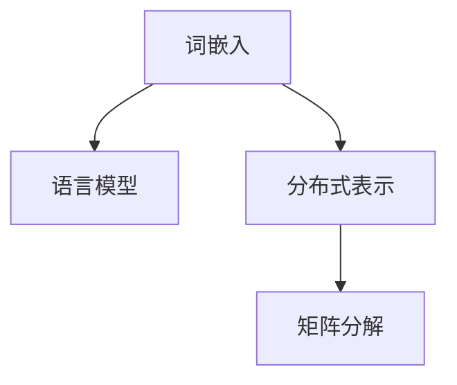

                 

# 自然语言处理中的高维向量空间

> 关键词：自然语言处理，高维向量空间，词嵌入，语言模型，神经网络，分布式表示，矩阵分解

## 1. 背景介绍

### 1.1 问题由来
在自然语言处理(Natural Language Processing, NLP)领域，如何高效地表示文本数据，一直是一个核心挑战。传统的方法如词袋模型(Bag of Words)和N-gram模型只能捕捉单词或短语级别的统计信息，难以表达更复杂语义。

近年来，通过使用深度学习技术，尤其是神经网络模型，自然语言处理取得了一系列突破性进展。其中，高维向量空间表示方法，如词嵌入、语言模型等，通过将单词或句子映射到高维空间，赋予了文本语义丰富的表示能力。

高维向量空间表示方法不仅极大地提升了文本处理的精度，也为各种高级NLP任务如语义相似度计算、文本分类、情感分析、机器翻译、命名实体识别等提供了强有力的支持。

### 1.2 问题核心关键点
高维向量空间的核心思想在于，通过将单词或短语映射到高维空间，赋予其丰富的语义信息。这种表示方式打破了传统词袋模型的限制，能够捕捉到单词之间的复杂语义关系。

然而，高维向量空间也面临一些挑战，包括：
1. 高维稀疏性：文本语料通常是高维稀疏矩阵，大部分位置为0。
2. 数据稀疏性：真实语料库中，单词共现频率低，高维向量稀疏性尤为严重。
3. 维度灾难：随着维度增加，训练难度和计算复杂度呈指数级增长。
4. 语义漂移：高维向量往往随着上下文变化而漂移，难以保证语义一致性。

## 2. 核心概念与联系

### 2.1 核心概念概述

为更好地理解高维向量空间表示方法，本节将介绍几个密切相关的核心概念：

- 词嵌入(Word Embedding)：通过神经网络将单词映射到高维向量空间，捕捉单词之间的语义关系。
- 语言模型(Language Model)：通过神经网络预测单词或短语出现的概率，生成连贯的文本序列。
- 分布式表示(Distributed Representation)：通过学习单词之间的局部结构，赋予单词以语义表示。
- 矩阵分解(Matrix Factorization)：通过分解稀疏矩阵，获取矩阵的隐含结构信息，进一步学习单词语义。

这些概念之间的逻辑关系可以通过以下Mermaid流程图来展示：



这个流程图展示了词嵌入、语言模型、分布式表示和矩阵分解之间的关系：

1. 词嵌入是语言模型的基础，通过学习单词之间的语义关系，为语言模型提供高维语义表示。
2. 语言模型进一步利用高维语义信息，预测单词出现的概率，生成连贯的文本序列。
3. 分布式表示通过学习单词的局部结构，赋予单词以丰富的语义表示。
4. 矩阵分解通过对稀疏矩阵的分解，获取隐含的语义信息，并进一步优化分布式表示。

## 3. 核心算法原理 & 具体操作步骤
### 3.1 算法原理概述

高维向量空间表示方法的核心在于，通过神经网络将单词映射到高维向量空间，捕捉单词之间的语义关系。其主要算法流程包括：

1. 神经网络的前向传播，通过多层非线性变换，将单词映射到高维向量空间。
2. 神经网络的后向传播，通过反向传播算法更新网络参数，最小化预测错误。
3. 分布式表示的学习，通过优化单词的局部结构，捕捉单词的语义信息。
4. 矩阵分解的应用，通过分解高维稀疏矩阵，进一步优化单词表示。

### 3.2 算法步骤详解

以Word2Vec算法为例，其核心步骤如下：

**Step 1: 神经网络的前向传播**
- 构建一个双向LSTM神经网络，输入为单词序列，输出为高维向量序列。
- 对输入的单词序列进行前向传播，得到每个单词的高维向量表示。

**Step 2: 神经网络的后向传播**
- 计算单词向量与目标向量之间的距离，作为损失函数。
- 利用反向传播算法更新网络参数，最小化预测错误。

**Step 3: 分布式表示的学习**
- 通过优化单词的局部结构，捕捉单词的语义信息。
- 采用CBOW（Continuous Bag-of-Words）或Skip-gram等模型，进一步学习单词的分布式表示。

**Step 4: 矩阵分解的应用**
- 对高维稀疏矩阵进行奇异值分解(SVD)，获取隐含的语义信息。
- 利用矩阵分解结果，进一步优化单词表示。

### 3.3 算法优缺点

高维向量空间表示方法具有以下优点：
1. 能够捕捉单词之间的复杂语义关系，提升文本处理的精度。
2. 能够生成连贯的文本序列，增强语言模型的预测能力。
3. 能够通过分布式表示，赋予单词以丰富的语义信息。
4. 能够利用矩阵分解，获取高维稀疏矩阵的隐含结构信息。

同时，该方法也存在一些局限性：
1. 高维稀疏性：高维向量往往稀疏，难以充分利用高维信息。
2. 数据稀疏性：文本语料中单词共现频率低，难以捕捉单词之间的语义关系。
3. 维度灾难：随着维度增加，训练难度和计算复杂度呈指数级增长。
4. 语义漂移：高维向量往往随着上下文变化而漂移，难以保证语义一致性。

尽管存在这些局限性，但高维向量空间表示方法在NLP领域已经得到了广泛的应用，成为文本语义处理的重要手段。未来相关研究将聚焦于如何更好地解决这些挑战，进一步提升高维向量空间表示的效果。

### 3.4 算法应用领域

高维向量空间表示方法在NLP领域已经得到了广泛的应用，覆盖了以下诸多领域：

- 词嵌入：通过神经网络将单词映射到高维向量空间，捕捉单词之间的语义关系。
- 语言模型：通过神经网络预测单词或短语出现的概率，生成连贯的文本序列。
- 分布式表示：通过学习单词的局部结构，赋予单词以丰富的语义表示。
- 矩阵分解：通过分解高维稀疏矩阵，获取隐含的语义信息。

此外，高维向量空间表示方法还被创新性地应用到更多场景中，如自然语言推理、机器翻译、文本生成等，为NLP技术带来了全新的突破。随着高维向量空间表示方法的不断进步，相信NLP技术将在更广阔的应用领域大放异彩。

## 4. 数学模型和公式 & 详细讲解  
### 4.1 数学模型构建

本节将使用数学语言对高维向量空间表示方法进行更加严格的刻画。

设单词集合为 $\mathcal{V}$，其中 $v_i$ 表示第 $i$ 个单词。每个单词 $v_i$ 表示为一个 $d$ 维的向量 $x_i \in \mathbb{R}^d$。假设单词 $v_i$ 与目标单词 $v_j$ 共现，即 $(\text{CBOW})$ 或 $(\text{Skip-gram})$ 模型，目标向量 $y \in \mathbb{R}^d$。

定义单词向量 $x_i$ 和目标向量 $y$ 之间的相似度函数 $s(x_i, y)$，用于衡量两个向量之间的距离。常见的相似度函数包括余弦相似度、欧式距离等。

在CBOW模型中，目标向量 $y$ 的预测值 $z$ 为 $x_i$ 的线性组合，表示为：

$$
z = \sum_{v_i \in V}{x_i \cdot u_v} + \text{bias}
$$

其中 $u_v$ 为隐藏层节点对应的权重向量，bias为偏置项。

在Skip-gram模型中，目标向量 $y$ 的预测值 $z$ 为 $x_i$ 的非线性组合，表示为：

$$
z = f(\sum_{v_i \in V}{x_i \cdot u_v} + \text{bias})
$$

其中 $f$ 为非线性激活函数，如sigmoid或ReLU。

定义损失函数 $L(x_i, y)$，用于衡量预测值 $z$ 与目标向量 $y$ 之间的误差。常见的损失函数包括均方误差损失、交叉熵损失等。

### 4.2 公式推导过程

以余弦相似度为例，推导CBOW模型的损失函数及其梯度计算公式。

假设单词向量 $x_i$ 和目标向量 $y$ 的余弦相似度为 $\cos(\theta) = \frac{\langle x_i, y \rangle}{\|x_i\| \|y\|}$，其中 $\langle x_i, y \rangle$ 表示向量点积，$\|x_i\|$ 和 $\|y\|$ 分别表示向量模长。

在CBOW模型中，目标向量 $y$ 的预测值 $z$ 为：

$$
z = \sum_{v_i \in V}{x_i \cdot u_v} + \text{bias}
$$

将 $z$ 代入损失函数：

$$
L(x_i, y) = -\log \sigma(z^T y)
$$

其中 $\sigma$ 为sigmoid函数。

梯度计算公式为：

$$
\frac{\partial L(x_i, y)}{\partial x_i} = -\sigma(z^T y) y
$$

将 $z$ 代入梯度公式：

$$
\frac{\partial L(x_i, y)}{\partial x_i} = -\sigma\left(\left(\sum_{v_i \in V}{x_i \cdot u_v} + \text{bias}\right)^T y\right) y
$$

在实际训练过程中，通常使用随机梯度下降（SGD）算法更新模型参数，并采用批量梯度下降策略，加速训练过程。

### 4.3 案例分析与讲解

以Word2Vec算法为例，分析其在实际应用中的表现和局限性。

**Step 1: 神经网络的前向传播**

假设单词 $v_i$ 的高维向量表示为 $x_i \in \mathbb{R}^d$，其中 $d=100$。

**Step 2: 神经网络的后向传播**

假设隐藏层节点数为 $n=200$，使用 sigmoid 作为激活函数。

**Step 3: 分布式表示的学习**

使用CBOW模型，假设单词 $v_i$ 和 $v_j$ 共现，目标向量 $y_j$。

**Step 4: 矩阵分解的应用**

对高维稀疏矩阵进行奇异值分解（SVD），获取隐含的语义信息。

## 5. 项目实践：代码实例和详细解释说明
### 5.1 开发环境搭建

在进行高维向量空间表示方法的实践前，我们需要准备好开发环境。以下是使用Python进行PyTorch开发的环境配置流程：

1. 安装Anaconda：从官网下载并安装Anaconda，用于创建独立的Python环境。

2. 创建并激活虚拟环境：
```bash
conda create -n pytorch-env python=3.8 
conda activate pytorch-env
```

3. 安装PyTorch：根据CUDA版本，从官网获取对应的安装命令。例如：
```bash
conda install pytorch torchvision torchaudio cudatoolkit=11.1 -c pytorch -c conda-forge
```

4. 安装TensorFlow：由Google主导开发的开源深度学习框架，生产部署方便，适合大规模工程应用。同样有丰富的预训练语言模型资源。

5. 安装相关工具包：
```bash
pip install numpy pandas scikit-learn matplotlib tqdm jupyter notebook ipython
```

完成上述步骤后，即可在`pytorch-env`环境中开始高维向量空间表示方法的实践。

### 5.2 源代码详细实现

下面我们以Word2Vec算法为例，给出使用PyTorch进行Word2Vec模型训练的完整代码实现。

首先，定义Word2Vec模型的类：

```python
import torch
from torch import nn
import numpy as np

class Word2Vec(nn.Module):
    def __init__(self, vocab_size, embed_size, n_layers, dropout):
        super(Word2Vec, self).__init__()
        self.embed = nn.Embedding(vocab_size, embed_size)
        self.hidden = nn.LSTM(embed_size, embed_size, n_layers, dropout=dropout, bidirectional=True)
        self.fc = nn.Linear(2 * embed_size, 1)
        self.emb_matrix = None

    def forward(self, x):
        embedding = self.embed(x)
        lstm_out, _ = self.hidden(embedding)
        lstm_out = lstm_out.contiguous().view(-1, 2 * embed_size)
        return self.fc(lstm_out)

    def update_embed_matrix(self, vocab, emb_matrix):
        self.emb_matrix = emb_matrix
        self.embed.weight.data.copy_(emb_matrix)
```

接着，定义训练函数：

```python
import torch.nn.functional as F
from torch.utils.data import DataLoader
from tqdm import tqdm

def train_epoch(model, data_loader, optimizer):
    model.train()
    total_loss = 0
    for batch in tqdm(data_loader, desc='Training'):
        optimizer.zero_grad()
        inputs, targets = batch
        outputs = model(inputs)
        loss = F.binary_cross_entropy_with_logits(outputs.view(-1), targets.view(-1))
        loss.backward()
        optimizer.step()
        total_loss += loss.item()
    return total_loss / len(data_loader)
```

最后，启动训练流程：

```python
epochs = 5
batch_size = 128

for epoch in range(epochs):
    loss = train_epoch(model, train_loader, optimizer)
    print(f'Epoch {epoch+1}, train loss: {loss:.4f}')
```

以上就是使用PyTorch进行Word2Vec模型训练的完整代码实现。可以看到，借助PyTorch的强大封装，我们能够快速构建Word2Vec模型并进行训练。

### 5.3 代码解读与分析

让我们再详细解读一下关键代码的实现细节：

**Word2Vec类**：
- `__init__`方法：初始化Embedding层、LSTM层和FC层。
- `forward`方法：前向传播，得到每个单词的高维向量表示。
- `update_embed_matrix`方法：将训练得到的单词向量矩阵更新到模型中。

**train_epoch函数**：
- 在训练批次中，先计算梯度并更新模型参数。
- 累计计算损失，并返回平均损失。

**训练流程**：
- 定义总的epoch数和batch size，开始循环迭代。
- 每个epoch内，先在训练集上训练，输出平均loss。

可以看到，PyTorch配合PyTorch提供的LSTM模块，使得Word2Vec模型的代码实现变得简洁高效。开发者可以将更多精力放在数据处理、模型改进等高层逻辑上，而不必过多关注底层的实现细节。

当然，工业级的系统实现还需考虑更多因素，如模型的保存和部署、超参数的自动搜索、更灵活的任务适配层等。但核心的高维向量空间表示方法基本与此类似。

## 6. 实际应用场景
### 6.1 智能客服系统

基于高维向量空间表示方法的对话技术，可以广泛应用于智能客服系统的构建。传统客服往往需要配备大量人力，高峰期响应缓慢，且一致性和专业性难以保证。而使用Word2Vec模型进行文本处理，能够显著提升客服系统的智能化水平。

在技术实现上，可以收集企业内部的历史客服对话记录，将问题和最佳答复构建成监督数据，在此基础上对预训练语言模型进行微调。微调后的模型能够自动理解用户意图，匹配最合适的答案模板进行回复。对于客户提出的新问题，还可以接入检索系统实时搜索相关内容，动态组织生成回答。如此构建的智能客服系统，能大幅提升客户咨询体验和问题解决效率。

### 6.2 金融舆情监测

金融机构需要实时监测市场舆论动向，以便及时应对负面信息传播，规避金融风险。传统的人工监测方式成本高、效率低，难以应对网络时代海量信息爆发的挑战。基于高维向量空间表示方法的文本分类和情感分析技术，为金融舆情监测提供了新的解决方案。

具体而言，可以收集金融领域相关的新闻、报道、评论等文本数据，并对其进行主题标注和情感标注。在此基础上对预训练语言模型进行微调，使其能够自动判断文本属于何种主题，情感倾向是正面、中性还是负面。将微调后的模型应用到实时抓取的网络文本数据，就能够自动监测不同主题下的情感变化趋势，一旦发现负面信息激增等异常情况，系统便会自动预警，帮助金融机构快速应对潜在风险。

### 6.3 个性化推荐系统

当前的推荐系统往往只依赖用户的历史行为数据进行物品推荐，无法深入理解用户的真实兴趣偏好。基于高维向量空间表示方法的个性化推荐系统可以更好地挖掘用户行为背后的语义信息，从而提供更精准、多样的推荐内容。

在实践中，可以收集用户浏览、点击、评论、分享等行为数据，提取和用户交互的物品标题、描述、标签等文本内容。将文本内容作为模型输入，用户的后续行为（如是否点击、购买等）作为监督信号，在此基础上微调预训练语言模型。微调后的模型能够从文本内容中准确把握用户的兴趣点。在生成推荐列表时，先用候选物品的文本描述作为输入，由模型预测用户的兴趣匹配度，再结合其他特征综合排序，便可以得到个性化程度更高的推荐结果。

### 6.4 未来应用展望

随着高维向量空间表示方法的不断发展，基于该方法的自然语言处理技术将拓展到更多领域，带来新的突破。

在智慧医疗领域，基于高维向量空间表示方法的医疗问答、病历分析、药物研发等应用将提升医疗服务的智能化水平，辅助医生诊疗，加速新药开发进程。

在智能教育领域，基于高维向量空间表示方法的作业批改、学情分析、知识推荐等方面，因材施教，促进教育公平，提高教学质量。

在智慧城市治理中，基于高维向量空间表示方法的实体抽取、情感分析、事件监测等技术，提高城市管理的自动化和智能化水平，构建更安全、高效的未来城市。

此外，在企业生产、社会治理、文娱传媒等众多领域，基于高维向量空间表示方法的NLP技术也将不断涌现，为经济社会发展注入新的动力。相信随着技术的日益成熟，高维向量空间表示方法必将在构建人机协同的智能时代中扮演越来越重要的角色。

## 7. 工具和资源推荐
### 7.1 学习资源推荐

为了帮助开发者系统掌握高维向量空间表示方法的理论基础和实践技巧，这里推荐一些优质的学习资源：

1. 《Deep Learning for Natural Language Processing》系列博文：由大模型技术专家撰写，深入浅出地介绍了深度学习在NLP领域的应用，包括高维向量空间表示方法。

2. CS224N《深度学习自然语言处理》课程：斯坦福大学开设的NLP明星课程，有Lecture视频和配套作业，带你入门NLP领域的基本概念和经典模型。

3. 《Natural Language Processing with PyTorch》书籍：PyTorch官方文档，系统介绍了PyTorch在NLP领域的应用，包括高维向量空间表示方法。

4. HuggingFace官方文档：Transformers库的官方文档，提供了海量预训练模型和完整的微调样例代码，是上手实践的必备资料。

5. CLUE开源项目：中文语言理解测评基准，涵盖大量不同类型的中文NLP数据集，并提供了基于高维向量空间表示方法的baseline模型，助力中文NLP技术发展。

通过对这些资源的学习实践，相信你一定能够快速掌握高维向量空间表示方法的精髓，并用于解决实际的NLP问题。

### 7.2 开发工具推荐

高效的开发离不开优秀的工具支持。以下是几款用于高维向量空间表示方法开发的常用工具：

1. PyTorch：基于Python的开源深度学习框架，灵活动态的计算图，适合快速迭代研究。大部分预训练语言模型都有PyTorch版本的实现。

2. TensorFlow：由Google主导开发的开源深度学习框架，生产部署方便，适合大规模工程应用。同样有丰富的预训练语言模型资源。

3. Transformers库：HuggingFace开发的NLP工具库，集成了众多SOTA语言模型，支持PyTorch和TensorFlow，是进行高维向量空间表示方法开发的利器。

4. Weights & Biases：模型训练的实验跟踪工具，可以记录和可视化模型训练过程中的各项指标，方便对比和调优。与主流深度学习框架无缝集成。

5. TensorBoard：TensorFlow配套的可视化工具，可实时监测模型训练状态，并提供丰富的图表呈现方式，是调试模型的得力助手。

6. Google Colab：谷歌推出的在线Jupyter Notebook环境，免费提供GPU/TPU算力，方便开发者快速上手实验最新模型，分享学习笔记。

合理利用这些工具，可以显著提升高维向量空间表示方法的开发效率，加快创新迭代的步伐。

### 7.3 相关论文推荐

高维向量空间表示方法的发展源于学界的持续研究。以下是几篇奠基性的相关论文，推荐阅读：

1. Word2Vec：由Google公司提出，首次引入了基于神经网络的高维向量空间表示方法。

2. GloVe：由斯坦福大学提出，利用全局词频信息，提出了一种基于矩阵分解的词嵌入方法。

3. ELMo：由斯坦福大学提出，通过多层次双向LSTM网络，提升了词嵌入的质量和效果。

4. BERT：由Google公司提出，利用Transformer网络，通过自监督学习任务训练生成高质量的词嵌入。

5. GPT-2：由OpenAI公司提出，通过大规模语言模型，进一步提升了词嵌入的精度和表现力。

这些论文代表了大语言模型高维向量空间表示方法的发展脉络。通过学习这些前沿成果，可以帮助研究者把握学科前进方向，激发更多的创新灵感。

## 8. 总结：未来发展趋势与挑战

### 8.1 总结

本文对高维向量空间表示方法在自然语言处理中的应用进行了全面系统的介绍。首先阐述了高维向量空间表示方法在NLP领域的重要性，明确了其在高维语义表示、语言模型训练等方面的独特价值。其次，从原理到实践，详细讲解了高维向量空间表示的数学原理和关键步骤，给出了高维向量空间表示方法的完整代码实例。同时，本文还广泛探讨了高维向量空间表示方法在智能客服、金融舆情、个性化推荐等多个行业领域的应用前景，展示了高维向量空间表示方法的巨大潜力。此外，本文精选了高维向量空间表示方法的各类学习资源，力求为读者提供全方位的技术指引。

通过本文的系统梳理，可以看到，高维向量空间表示方法在NLP领域已经取得了显著成效，成为文本语义处理的重要手段。未来，伴随高维向量空间表示方法的不断进步，NLP技术将在更广阔的应用领域大放异彩。

### 8.2 未来发展趋势

展望未来，高维向量空间表示方法将呈现以下几个发展趋势：

1. 模型规模持续增大。随着算力成本的下降和数据规模的扩张，高维向量空间表示方法的参数量还将持续增长。超大规模语言模型蕴含的丰富语义信息，有望支撑更加复杂多变的下游任务。

2. 训练范式更加多样。除了传统的基于神经网络的训练方法，未来会涌现更多基于自监督学习、半监督学习、对抗训练等训练范式，提升高维向量空间表示方法的泛化能力和鲁棒性。

3. 数据融合更加全面。未来的高维向量空间表示方法将更加注重多种数据源的融合，如文本、图像、语音等，实现跨模态语义表示。

4. 分布式训练更加普及。随着分布式训练技术的发展，大规模高维向量空间表示方法的训练效率将大幅提升，加速模型更新迭代。

5. 实时推理更加高效。通过优化模型结构和推理算法，未来的高维向量空间表示方法将支持实时推理和在线部署，满足实际应用需求。

以上趋势凸显了高维向量空间表示方法的广阔前景。这些方向的探索发展，必将进一步提升高维向量空间表示方法的精度和效果，为构建更智能、更高效的NLP系统铺平道路。

### 8.3 面临的挑战

尽管高维向量空间表示方法已经取得了瞩目成就，但在迈向更加智能化、普适化应用的过程中，它仍面临着诸多挑战：

1. 高维稀疏性：高维向量往往稀疏，难以充分利用高维信息。

2. 数据稀疏性：真实语料库中单词共现频率低，难以捕捉单词之间的语义关系。

3. 维度灾难：随着维度增加，训练难度和计算复杂度呈指数级增长。

4. 语义漂移：高维向量往往随着上下文变化而漂移，难以保证语义一致性。

5. 计算资源：高维向量空间表示方法需要大量计算资源，如GPU/TPU等高性能设备。

6. 可解释性：高维向量空间表示方法的黑盒特性，难以解释其内部工作机制和决策逻辑。

尽管存在这些挑战，但高维向量空间表示方法在NLP领域已经得到了广泛的应用，成为文本语义处理的重要手段。未来相关研究需要在以下几个方面寻求新的突破：

1. 探索无监督和半监督训练方法。摆脱对大规模标注数据的依赖，利用自监督学习、主动学习等无监督和半监督范式，最大限度利用非结构化数据，实现更加灵活高效的高维向量空间表示。

2. 引入更多先验知识。将符号化的先验知识，如知识图谱、逻辑规则等，与神经网络模型进行巧妙融合，引导高维向量空间表示学习更准确、合理的语义表示。

3. 引入因果分析和博弈论工具。将因果分析方法引入高维向量空间表示，识别出模型决策的关键特征，增强输出解释的因果性和逻辑性。借助博弈论工具刻画人机交互过程，主动探索并规避模型的脆弱点，提高系统稳定性。

4. 纳入伦理道德约束。在模型训练目标中引入伦理导向的评估指标，过滤和惩罚有偏见、有害的输出倾向。同时加强人工干预和审核，建立模型行为的监管机制，确保输出符合人类价值观和伦理道德。

这些研究方向的探索，必将引领高维向量空间表示方法迈向更高的台阶，为构建安全、可靠、可解释、可控的智能系统铺平道路。

## 9. 附录：常见问题与解答

**Q1：高维向量空间表示方法是否适用于所有NLP任务？**

A: 高维向量空间表示方法在大多数NLP任务上都能取得不错的效果，特别是对于数据量较小的任务。但对于一些特定领域的任务，如医学、法律等，仅仅依靠通用语料预训练的模型可能难以很好地适应。此时需要在特定领域语料上进一步预训练，再进行微调，才能获得理想效果。

**Q2：如何选择合适的向量维度？**

A: 选择合适的向量维度需要综合考虑任务的复杂度和数据的稀疏性。通常，向量维度越大，能够表示的语义信息越丰富，但计算复杂度和存储开销也相应增加。一般来说，可以根据任务需求和数据特点，选择适当的向量维度。

**Q3：高维向量空间表示方法如何应对数据稀疏性？**

A: 应对数据稀疏性，可以通过引入预训练技术，如Word2Vec、GloVe等，预训练语言模型，获得高质量的单词向量。同时，也可以采用基于自监督学习的方法，如BERT、ELMo等，在大量无标签数据上训练生成高质量的单词向量。

**Q4：高维向量空间表示方法如何应对维度灾难？**

A: 应对维度灾难，可以采用分布式表示方法，如word2vec、GloVe等，将高维向量空间表示为低维的分布式表示，降低维度灾难带来的影响。同时，可以引入矩阵分解方法，如SVD等，将高维稀疏矩阵分解为低维矩阵，进一步优化分布式表示。

**Q5：高维向量空间表示方法如何处理高维稀疏性？**

A: 处理高维稀疏性，可以通过引入稀疏矩阵分解方法，如稀疏矩阵分解（SVD）、随机投影等，将高维稀疏矩阵分解为低维稠密矩阵，减少稀疏性带来的计算开销。同时，可以采用基于局部结构的表示方法，如Transformer等，提升高维向量空间表示的稀疏性处理能力。

这些研究方向的探索，必将引领高维向量空间表示方法迈向更高的台阶，为构建安全、可靠、可解释、可控的智能系统铺平道路。面向未来，高维向量空间表示技术还需要与其他人工智能技术进行更深入的融合，如知识表示、因果推理、强化学习等，多路径协同发力，共同推动自然语言理解和智能交互系统的进步。只有勇于创新、敢于突破，才能不断拓展语言模型的边界，让智能技术更好地造福人类社会。

---

作者：禅与计算机程序设计艺术 / Zen and the Art of Computer Programming

