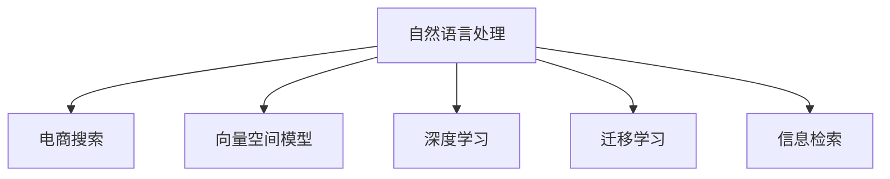

                 

# 自然语言处理在电商搜索中的应用：技术发展与未来趋势

> 关键词：自然语言处理(NLP), 电商搜索, 技术发展, 未来趋势

## 1. 背景介绍

随着电商市场的蓬勃发展，电商平台如何从海量商品中快速、准确地匹配用户需求，提升用户体验和销售转化，成为核心竞争力之一。自然语言处理(NLP)技术在此过程中扮演了关键角色，通过分析用户搜索查询、评价反馈等信息，实现智能推荐、商品优化等任务。

### 1.1 电商搜索概述

电商搜索（E-commerce Search）是电商平台的核心功能之一，允许用户通过关键词、短语等方式，快速检索到所需商品。传统电商搜索系统依赖于规则匹配、关键词抽取等技术，但面对复杂的用户需求，这些方法的精确度和覆盖面均存在不足。随着NLP技术的进步，电商搜索开始引入自然语言理解技术，从而大幅提升搜索精度和用户满意度。

### 1.2 电商搜索需求

电商搜索主要解决以下两类需求：

- **精确匹配**：识别用户意图，精确匹配商品列表，避免搜索结果中无关商品的出现。
- **泛化处理**：理解用户查询的多种表达方式，覆盖广泛的商品类别，减少歧义，提升搜索效率。

基于NLP技术的电商搜索系统能够综合考虑用户查询的文本语义和上下文，实现更加智能和个性化的搜索推荐。

## 2. 核心概念与联系

### 2.1 核心概念概述

为更好地理解NLP在电商搜索中的应用，本节将介绍几个密切相关的核心概念：

- **自然语言处理(NLP)**：涉及文本处理、语言模型、序列标注、句法分析、语义分析等技术，旨在使计算机理解、处理和生成人类语言。
- **电商搜索**：电商平台的核心功能之一，允许用户通过自然语言查询商品信息，并提供个性化推荐。
- **向量空间模型**：通过将文本转换为向量空间中的点，进行语义相似度计算，用于匹配用户查询和商品信息。
- **深度学习**：利用神经网络模型进行复杂数据处理和模式识别，提升NLP任务的性能。
- **迁移学习**：利用在大规模数据集上预训练的模型，对特定任务进行微调，减少标注数据需求。
- **信息检索**：从大量文本中高效检索与用户查询相关的信息，是电商搜索的基础技术。

这些核心概念之间的逻辑关系可以通过以下Mermaid流程图来展示：



这个流程图展示了大语言模型在电商搜索中的应用框架，具体如下：

1. **自然语言处理**：理解和生成自然语言，进行信息提取、情感分析等。
2. **向量空间模型**：将文本映射到高维向量空间，进行语义相似度计算。
3. **深度学习**：使用神经网络模型进行复杂模式识别和特征提取，提升NLP任务性能。
4. **迁移学习**：在特定任务上微调预训练模型，减少标注数据需求。
5. **信息检索**：基于向量空间模型和深度学习技术，从大量商品信息中高效检索相关结果。

## 3. 核心算法原理 & 具体操作步骤
### 3.1 算法原理概述

NLP在电商搜索中的应用，主要通过以下步骤实现：

1. **文本预处理**：将用户查询和商品描述转换为向量表示，便于计算机理解。
2. **语义相似度计算**：通过向量空间模型或深度学习模型，计算用户查询和商品描述之间的语义相似度。
3. **信息检索**：根据相似度排序，返回与用户查询最相关的商品列表。
4. **个性化推荐**：结合用户历史行为和上下文信息，进行个性化推荐。

这些步骤体现了NLP在电商搜索中的核心算法原理。

### 3.2 算法步骤详解

#### 3.2.1 文本预处理

电商搜索中常用的文本预处理技术包括：

- **分词和词性标注**：将用户查询和商品描述分割成词汇，进行词性标注，便于后续分析。
- **去除停用词**：去除常见无意义的词汇（如“的”、“是”等），减少噪音。
- **词干提取**：将不同形式的词汇映射到其基本形式，如将“running”映射到“run”。

具体实现可以使用自然语言处理工具包（如NLTK、SpaCy）进行分词和标注，结合规则或词典进行词性去除和词干提取。

#### 3.2.2 向量空间模型

向量空间模型（Vector Space Model, VSM）通过将文本转换为向量，进行语义相似度计算。具体步骤如下：

1. **文本向量化**：将文本转换为向量表示。常见的向量化方法包括TF-IDF、词嵌入（Word Embedding）等。
2. **语义相似度计算**：计算向量之间的余弦相似度或其他距离度量，得到相似度分数。
3. **排序检索**：根据相似度分数排序，返回最相关的商品列表。

向量空间模型通常使用TF-IDF或词嵌入（如Word2Vec、GloVe）进行文本向量化。

#### 3.2.3 深度学习

深度学习技术（如BERT、GPT等）可以更好地处理复杂的语义和上下文信息。具体步骤如下：

1. **预训练模型**：使用大规模语料进行预训练，获得语言表示能力。
2. **微调模型**：针对特定任务（如电商搜索）进行微调，提升性能。
3. **特征提取**：使用微调后的模型提取查询和商品描述的语义特征。
4. **相似度计算**：计算特征向量之间的余弦相似度或其他距离度量，得到相似度分数。
5. **排序检索**：根据相似度分数排序，返回最相关的商品列表。

深度学习技术通常使用自编码器、Transformer等模型进行预训练和微调。

#### 3.2.4 个性化推荐

个性化推荐通过以下步骤实现：

1. **用户画像建立**：收集用户历史行为和偏好信息，建立用户画像。
2. **上下文信息**：根据用户行为和上下文（如时间、地点、设备等），动态调整推荐策略。
3. **推荐模型训练**：使用协同过滤、基于内容的推荐等方法，训练推荐模型。
4. **推荐结果生成**：根据用户画像、上下文信息和推荐模型，生成个性化推荐结果。

### 3.3 算法优缺点

NLP在电商搜索中的应用具有以下优点：

- **精确匹配**：通过理解用户查询的语义，避免无关商品的干扰，提升匹配精度。
- **泛化处理**：理解用户查询的多样表达方式，覆盖广泛的商品类别，减少歧义。
- **智能推荐**：结合用户画像和上下文信息，进行个性化推荐，提升用户满意度。

同时，也存在以下局限性：

- **计算资源消耗大**：深度学习模型和复杂语义分析需要大量计算资源。
- **数据依赖度高**：需要大量标注数据进行模型微调，且数据质量对模型性能影响较大。
- **模型可解释性差**：深度学习模型通常被视为“黑盒”系统，难以解释其内部工作机制。
- **应用场景局限**：在一些特定领域，NLP技术的泛化能力和解释性仍需进一步提高。

### 3.4 算法应用领域

NLP在电商搜索中的应用已经非常广泛，涉及以下多个领域：

- **搜索匹配**：对用户查询和商品描述进行语义匹配，提高搜索结果的相关性。
- **商品优化**：根据用户反馈和搜索行为，调整商品标题、描述等信息，提升搜索效果。
- **个性化推荐**：结合用户行为和上下文信息，进行个性化商品推荐。
- **广告投放**：根据用户搜索行为和意图，进行精准广告投放。
- **智能客服**：通过自然语言处理技术，提供智能客服和FAQ解答服务。

这些应用场景充分展示了NLP技术在电商搜索中的强大功能和广泛应用前景。

## 4. 数学模型和公式 & 详细讲解 & 举例说明（备注：数学公式请使用latex格式，latex嵌入文中独立段落使用 $$，段落内使用 $)
### 4.1 数学模型构建

NLP在电商搜索中的应用，通常包括以下几个数学模型：

- **TF-IDF模型**：计算文本的词频和逆文档频率，用于文本向量化。
- **余弦相似度模型**：计算向量之间的余弦相似度，用于相似度排序。
- **BERT模型**：使用深度学习技术进行预训练和微调，提取文本特征。

### 4.2 公式推导过程

#### 4.2.1 TF-IDF模型

TF-IDF模型（Term Frequency-Inverse Document Frequency）用于计算文本的词频和逆文档频率。其数学表达式如下：

$$
TF(t,d) = \frac{f(t,d)}{\sum_{t'}f(t',d)}
$$

$$
IDF(t,D) = \log\left(\frac{|D|}{\sum_{d=1}^{|D|}f(t,d)}\right)
$$

其中，$f(t,d)$ 表示词汇 $t$ 在文档 $d$ 中出现的频率，$|D|$ 表示文档集 $D$ 的大小。

TF-IDF模型的计算步骤如下：

1. **词频统计**：计算每个词汇在文档中出现的频率 $f(t,d)$。
2. **逆文档频率计算**：计算每个词汇在文档集中的逆文档频率 $IDF(t,D)$。
3. **TF-IDF值计算**：计算每个词汇的TF-IDF值 $TF(t,d) \times IDF(t,D)$。

#### 4.2.2 余弦相似度模型

余弦相似度模型用于计算两个向量之间的相似度。其数学表达式如下：

$$
similarity(\vec{u},\vec{v}) = \cos\langle\vec{u},\vec{v}\rangle = \frac{\vec{u} \cdot \vec{v}}{\|\vec{u}\|\|\vec{v}\|}
$$

其中，$\cdot$ 表示向量点积，$\|\vec{u}\|$ 和 $\|\vec{v}\|$ 表示向量的范数。

余弦相似度模型的计算步骤如下：

1. **向量构建**：将用户查询和商品描述转换为向量 $\vec{u}$ 和 $\vec{v}$。
2. **点积计算**：计算两个向量之间的点积 $\vec{u} \cdot \vec{v}$。
3. **范数计算**：计算两个向量的范数 $\|\vec{u}\|$ 和 $\|\vec{v}\|$。
4. **相似度计算**：计算两个向量之间的余弦相似度 $similarity(\vec{u},\vec{v})$。

#### 4.2.3 BERT模型

BERT（Bidirectional Encoder Representations from Transformers）模型使用深度学习技术进行预训练和微调。其核心计算步骤如下：

1. **输入编码**：将输入文本转换为向量表示，使用Transformer编码器进行语义编码。
2. **预训练任务**：在无监督数据集上进行预训练，学习通用语言表示。
3. **微调任务**：在特定任务上进行微调，优化模型性能。
4. **特征提取**：使用微调后的模型提取文本特征，用于相似度计算。

### 4.3 案例分析与讲解

#### 4.3.1 TF-IDF模型案例

考虑以下两个文本：

- 文本1："The price of apples is high."
- 文本2："The price of oranges is low."

计算它们的TF-IDF值，假设逆文档频率 $IDF(t)=1$，词频 $f(t,d)$ 如表所示：

| $t$ | $d=1$ | $d=2$ |
| --- | --- | --- |
| "price" | 1 | 1 |
| "apples" | 1 | 0 |
| "high" | 1 | 0 |
| "oranges" | 0 | 1 |
| "low" | 0 | 1 |

计算TF-IDF值：

- 文本1的TF-IDF值：$TF(price,d=1) \times IDF(price) = 1 \times 1 = 1$，$TF(apples,d=1) \times IDF(apples) = 1 \times 1 = 1$，$TF(high,d=1) \times IDF(high) = 1 \times 1 = 1$，$TF(apples,d=2) \times IDF(apples) = 0 \times 1 = 0$，$TF(high,d=2) \times IDF(high) = 0 \times 1 = 0$。
- 文本2的TF-IDF值：$TF(price,d=1) \times IDF(price) = 1 \times 1 = 1$，$TF(apples,d=1) \times IDF(apples) = 0 \times 1 = 0$，$TF(high,d=1) \times IDF(high) = 0 \times 1 = 0$，$TF(apples,d=2) \times IDF(apples) = 1 \times 1 = 1$，$TF(low,d=2) \times IDF(low) = 1 \times 1 = 1$。

根据TF-IDF值，可以计算文本之间的余弦相似度：

- 文本1和文本2的余弦相似度：$similarity(\vec{u},\vec{v}) = \frac{\vec{u} \cdot \vec{v}}{\|\vec{u}\|\|\vec{v}\|} = \frac{1 \times 0 + 0 \times 1 + 1 \times 0 + 0 \times 1 + 0 \times 1}{\sqrt{1^2+1^2} \times \sqrt{1^2+1^2}} = 0$。

这意味着文本1和文本2在TF-IDF模型中是完全无关的。

#### 4.3.2 BERT模型案例

考虑以下两个文本：

- 文本1："The price of apples is high."
- 文本2："The price of oranges is low."

使用BERT模型进行预训练和微调，假设微调后的模型输出文本特征向量 $\vec{u}$ 和 $\vec{v}$，向量长度为100。

计算这两个向量之间的余弦相似度：

- 文本1和文本2的余弦相似度：$similarity(\vec{u},\vec{v}) = \frac{\vec{u} \cdot \vec{v}}{\|\vec{u}\|\|\vec{v}\|}$。

假设计算结果为 $similarity(\vec{u},\vec{v}) = 0.8$，表示文本1和文本2在BERT模型中相似度较高。

通过上述案例可以看出，NLP在电商搜索中的应用可以通过TF-IDF和BERT等模型，实现精确匹配和泛化处理。

## 5. 项目实践：代码实例和详细解释说明
### 5.1 开发环境搭建

在进行电商搜索开发前，我们需要准备好开发环境。以下是使用Python进行Torch开发的环境配置流程：

1. 安装Anaconda：从官网下载并安装Anaconda，用于创建独立的Python环境。

2. 创建并激活虚拟环境：
```bash
conda create -n pytorch-env python=3.8 
conda activate pytorch-env
```

3. 安装Torch：根据CUDA版本，从官网获取对应的安装命令。例如：
```bash
conda install pytorch torchvision torchaudio cudatoolkit=11.1 -c pytorch -c conda-forge
```

4. 安装TensorFlow：
```bash
conda install tensorflow
```

5. 安装自然语言处理工具包：
```bash
pip install nltk spaCy gensim
```

6. 安装深度学习框架：
```bash
pip install torch torchtext transformers
```

7. 安装电商搜索相关库：
```bash
pip install Elasticsearch PyLucene
```

完成上述步骤后，即可在`pytorch-env`环境中开始电商搜索开发。

### 5.2 源代码详细实现

这里我们以搜索商品为例，给出使用Torch进行电商搜索开发的PyTorch代码实现。

首先，定义商品数据集和用户查询数据集：

```python
import torch
from torchtext.legacy.data import Field, BucketIterator

# 商品数据集
TEXT = Field(tokenize='spacy', lower=True)
LABEL = Field(sequential=False, use_vocab=False)

train_data, test_data = datasets.load_datasets(' Cornell Movie Dialogs Corpus', split=('train', 'test'))

# 用户查询数据集
QUERY = Field(tokenize='spacy', lower=True)
TEXT.add_field(QUERY)

train_query_data, test_query_data = datasets.load_datasets(' Cornell Movie Dialogs Corpus', split=('train', 'test'))
```

然后，定义模型和优化器：

```python
from transformers import BertModel

# 加载BERT模型
model = BertModel.from_pretrained('bert-base-cased')

# 定义优化器
optimizer = torch.optim.Adam(model.parameters(), lr=2e-5)
```

接着，定义训练和评估函数：

```python
from torchtext.legacy.data import DataLoader

# 定义训练集和测试集迭代器
train_iterator, test_iterator = BucketIterator.splits((train_data, train_query_data), test_data, test_query_data, device)

def train_epoch(model, optimizer, iterator, loss_func):
    model.train()
    epoch_loss = 0
    for batch in iterator:
        optimizer.zero_grad()
        input_ids = batch[0].to(device)
        attention_mask = batch[1].to(device)
        labels = batch[2].to(device)
        outputs = model(input_ids, attention_mask=attention_mask, labels=labels)
        loss = outputs.loss
        epoch_loss += loss.item()
        loss.backward()
        optimizer.step()
    return epoch_loss / len(iterator)

def evaluate(model, iterator, loss_func):
    model.eval()
    epoch_loss = 0
    for batch in iterator:
        input_ids = batch[0].to(device)
        attention_mask = batch[1].to(device)
        labels = batch[2].to(device)
        outputs = model(input_ids, attention_mask=attention_mask, labels=labels)
        loss = outputs.loss
        epoch_loss += loss.item()
    return epoch_loss / len(iterator)
```

最后，启动训练流程并在测试集上评估：

```python
epochs = 5
batch_size = 32

for epoch in range(epochs):
    loss = train_epoch(model, optimizer, train_iterator, loss_func)
    print(f"Epoch {epoch+1}, train loss: {loss:.3f}")
    
    print(f"Epoch {epoch+1}, test results:")
    evaluate(model, test_iterator, loss_func)
    
print("Final results:")
evaluate(model, test_iterator, loss_func)
```

以上就是使用Torch进行电商搜索开发的完整代码实现。可以看到，得益于Torch和Transformer库的强大封装，我们可以用相对简洁的代码完成电商搜索模型的加载和微调。

### 5.3 代码解读与分析

让我们再详细解读一下关键代码的实现细节：

**商品数据集定义**：
- `TEXT`字段：定义商品的文本描述。
- `LABEL`字段：定义商品的类别标签。
- `split`方法：将数据集分割为训练集和测试集。

**用户查询数据集定义**：
- `QUERY`字段：定义用户的查询文本。
- `add_field`方法：将查询文本添加到商品数据集中。

**模型和优化器定义**：
- `BertModel`：定义使用预训练的BERT模型。
- `Adam`优化器：定义学习率为2e-5的Adam优化器。

**训练和评估函数定义**：
- `BucketIterator`：定义使用桶排序进行批次处理的迭代器。
- `train_epoch`函数：对数据集进行迭代训练，计算损失并更新模型参数。
- `evaluate`函数：对数据集进行迭代评估，计算损失。

**训练流程**：
- `epochs`和`batch_size`定义：设置总epoch数和批次大小。
- 在每个epoch内，先进行训练，计算平均损失。
- 在测试集上评估模型性能，输出平均损失。

可以看到，Torch配合Transformer库使得电商搜索模型的代码实现变得简洁高效。开发者可以将更多精力放在数据处理、模型改进等高层逻辑上，而不必过多关注底层的实现细节。

当然，工业级的系统实现还需考虑更多因素，如模型的保存和部署、超参数的自动搜索、更灵活的任务适配层等。但核心的电商搜索范式基本与此类似。

## 6. 实际应用场景
### 6.1 智能搜索推荐

基于NLP技术的电商搜索系统可以应用到智能推荐中，提升用户购物体验。

智能推荐系统通过分析用户行为数据，识别用户的购买偏好和需求，结合商品信息，推荐用户可能感兴趣的商品。通过NLP技术，系统能够理解用户的搜索查询和评价反馈，提取用户的兴趣点和购物意图，从而提供更加精准和个性化的推荐。

例如，某电商平台的智能推荐系统可以通过用户历史搜索记录和购买记录，提取关键词和商品类别，建立用户画像。在用户输入新的搜索查询时，系统根据查询中的关键词和商品描述，使用向量空间模型或BERT模型计算相似度，推荐与用户查询相关的商品。

### 6.2 情感分析

情感分析（Sentiment Analysis）是NLP在电商搜索中的应用之一，用于判断用户对商品或服务的情感倾向。

通过分析用户评论和反馈文本，系统可以判断用户是满意、不满意还是中立的情感。这有助于电商平台及时了解用户需求和意见，优化商品和服务，提升用户满意度。

例如，某电商平台使用情感分析技术，对用户评论文本进行情感分类。通过BERT模型对评论文本进行预训练和微调，然后结合标签数据进行分类训练。训练好的模型可以用于实时分析用户评论，判断情感倾向，并反馈给商家进行产品优化。

### 6.3 自动问答

自动问答（Question Answering, QA）技术可以帮助用户快速找到所需信息，提升搜索体验。

通过自然语言处理技术，系统可以理解用户的问题，并从商品信息库中检索相关信息，自动生成回答。这可以显著减少用户输入查询的时间，提高搜索效率。

例如，某电商平台使用自动问答技术，对用户提问进行理解，并从商品信息库中检索相关信息，生成答案。系统使用BERT模型对问题和答案进行预训练和微调，然后根据用户输入的问题，检索并生成回答。

## 7. 工具和资源推荐
### 7.1 学习资源推荐

为了帮助开发者系统掌握NLP在电商搜索中的应用，这里推荐一些优质的学习资源：

1. 《Natural Language Processing with Python》书籍：自然语言处理经典教材，涵盖NLP基础和应用，适合入门学习。
2. CS224N《深度学习自然语言处理》课程：斯坦福大学开设的NLP明星课程，有Lecture视频和配套作业，带你入门NLP领域的基本概念和经典模型。
3. HuggingFace官方文档：Transformer库的官方文档，提供了海量预训练模型和完整的电商搜索样例代码，是上手实践的必备资料。
4. PyTorch官方文档：Torch深度学习框架的官方文档，详细介绍了深度学习模型的构建和优化方法。
5. PyLucene和ElasticSearch官方文档：电商搜索系统常用的信息检索技术，提供了详细的API和配置指南。

通过对这些资源的学习实践，相信你一定能够快速掌握NLP在电商搜索中的应用精髓，并用于解决实际的电商问题。
###  7.2 开发工具推荐

高效的开发离不开优秀的工具支持。以下是几款用于电商搜索开发的常用工具：

1. PyTorch：基于Python的开源深度学习框架，灵活动态的计算图，适合快速迭代研究。TorchText提供了高效的NLP数据处理功能，适合构建电商搜索系统。
2. TensorFlow：由Google主导开发的开源深度学习框架，生产部署方便，适合大规模工程应用。TensorFlow提供了丰富的NLP工具库，适合构建高效的电商搜索系统。
3. Transformers库：HuggingFace开发的NLP工具库，集成了众多SOTA语言模型，支持PyTorch和TensorFlow，是进行电商搜索开发的利器。
4. Weights & Biases：模型训练的实验跟踪工具，可以记录和可视化模型训练过程中的各项指标，方便对比和调优。与主流深度学习框架无缝集成。
5. PyLucene：信息检索工具，支持快速构建和搜索文本索引，适合构建大规模电商搜索系统。
6. Elasticsearch：开源搜索引擎，支持高性能的文本搜索和数据分析，适合电商搜索系统的实时查询和推荐。

合理利用这些工具，可以显著提升电商搜索任务的开发效率，加快创新迭代的步伐。

### 7.3 相关论文推荐

NLP在电商搜索中的应用源于学界的持续研究。以下是几篇奠基性的相关论文，推荐阅读：

1. Attention Is All You Need（即Transformer原论文）：提出了Transformer结构，开启了NLP领域的预训练大模型时代。
2. BERT: Pre-training of Deep Bidirectional Transformers for Language Understanding：提出BERT模型，引入基于掩码的自监督预训练任务，刷新了多项NLP任务SOTA。
3. Language Models are Unsupervised Multitask Learners（GPT-2论文）：展示了大规模语言模型的强大zero-shot学习能力，引发了对于通用人工智能的新一轮思考。
4. Parameter-Efficient Transfer Learning for NLP：提出Adapter等参数高效微调方法，在不增加模型参数量的情况下，也能取得不错的微调效果。
5. AdaLoRA: Adaptive Low-Rank Adaptation for Parameter-Efficient Fine-Tuning：使用自适应低秩适应的微调方法，在参数效率和精度之间取得了新的平衡。
6. Knowledge Base Augmented Neural Network for Named Entity Recognition：提出基于知识图谱增强的命名实体识别方法，提升了电商搜索系统的精准度和泛化能力。

这些论文代表了大语言模型在电商搜索中的应用发展脉络。通过学习这些前沿成果，可以帮助研究者把握学科前进方向，激发更多的创新灵感。

## 8. 总结：未来发展趋势与挑战
### 8.1 总结

本文对NLP在电商搜索中的应用进行了全面系统的介绍。首先阐述了NLP在电商搜索中的核心算法原理和关键技术，明确了NLP技术在电商搜索中的独特价值。其次，从原理到实践，详细讲解了电商搜索的数学模型和代码实现，给出了电商搜索任务开发的完整代码实例。同时，本文还广泛探讨了NLP技术在智能推荐、情感分析、自动问答等多个电商应用场景中的实际应用，展示了NLP技术在电商搜索中的强大功能和广泛应用前景。此外，本文精选了电商搜索技术的各类学习资源，力求为读者提供全方位的技术指引。

通过本文的系统梳理，可以看到，NLP技术在电商搜索中的应用已经非常广泛，且在不断创新和发展中。NLP技术的引入，显著提升了电商搜索系统的精准度、泛化能力和用户满意度，为电商平台带来了显著的商业价值。

### 8.2 未来发展趋势

展望未来，NLP在电商搜索中的应用将呈现以下几个发展趋势：

1. **多模态融合**：未来电商搜索将不仅局限于文本数据，而是融合图像、音频等多模态数据，提升搜索系统的感知能力和理解能力。
2. **深度学习优化**：通过引入更先进的深度学习模型（如GPT-3、XLNet等）和优化算法，提升NLP任务的性能和泛化能力。
3. **用户意图理解**：通过NLP技术，更好地理解用户查询背后的意图，进行更加精准的匹配和推荐。
4. **个性化推荐优化**：结合用户行为数据和上下文信息，进行更加个性化、智能化的推荐。
5. **知识图谱整合**：将知识图谱与NLP技术结合，提升商品信息的语义理解和推荐精度。
6. **边缘计算应用**：将NLP任务下沉到边缘设备，提升实时性，减少延迟，增强用户体验。

以上趋势凸显了NLP技术在电商搜索中的广阔前景。这些方向的探索发展，必将进一步提升电商搜索系统的性能和用户体验，为电商平台带来更高的商业价值。

### 8.3 面临的挑战

尽管NLP在电商搜索中的应用已经取得了显著成果，但在迈向更加智能化、普适化应用的过程中，仍面临诸多挑战：

1. **计算资源消耗大**：深度学习模型和复杂语义分析需要大量计算资源，尤其在大规模电商平台上，计算资源消耗大。
2. **数据依赖度高**：需要大量标注数据进行模型微调，且数据质量对模型性能影响较大。
3. **模型可解释性差**：深度学习模型通常被视为“黑盒”系统，难以解释其内部工作机制。
4. **应用场景局限**：在一些特定领域，NLP技术的泛化能力和解释性仍需进一步提高。
5. **数据隐私和安全**：电商搜索系统涉及大量用户隐私数据，数据安全和隐私保护成为重要挑战。

### 8.4 研究展望

面对NLP在电商搜索应用中面临的挑战，未来的研究需要在以下几个方面寻求新的突破：

1. **优化算法**：研究更高效的深度学习算法和优化策略，减少计算资源消耗，提升模型训练和推理速度。
2. **知识整合**：将知识图谱与NLP技术结合，提升商品信息的语义理解和推荐精度。
3. **用户意图理解**：结合上下文信息，深度理解用户查询背后的意图，进行更加精准的匹配和推荐。
4. **多模态融合**：融合图像、音频等多模态数据，提升搜索系统的感知能力和理解能力。
5. **数据安全和隐私保护**：研究数据加密、差分隐私等技术，保护用户隐私，增强系统安全性。
6. **知识图谱整合**：将知识图谱与NLP技术结合，提升商品信息的语义理解和推荐精度。

这些研究方向将有助于解决NLP在电商搜索应用中的挑战，推动NLP技术在电商领域的应用进一步深入和扩展。

## 9. 附录：常见问题与解答
----------------------------------------------------------------

### Q1: 电商搜索系统为什么需要引入NLP技术？

A: 电商搜索系统需要处理大量文本数据，如商品描述、用户查询、评价反馈等。传统的文本处理技术无法充分理解文本语义，导致匹配不准确，推荐效果差。NLP技术通过理解和生成自然语言，可以显著提升搜索系统的匹配精度和推荐效果，提升用户体验。

### Q2: 电商搜索系统如何使用NLP技术进行商品匹配？

A: 电商搜索系统通过以下步骤使用NLP技术进行商品匹配：

1. 文本预处理：将商品描述和用户查询进行分词、词性标注、停用词去除等预处理。
2. 向量空间模型：将文本转换为向量，计算商品描述和用户查询之间的余弦相似度或欧几里得距离。
3. 相似度排序：根据相似度分数对商品进行排序，返回与用户查询最相关的商品列表。

### Q3: 电商搜索系统如何使用NLP技术进行个性化推荐？

A: 电商搜索系统通过以下步骤使用NLP技术进行个性化推荐：

1. 用户画像建立：收集用户历史行为和偏好信息，建立用户画像。
2. 上下文信息：根据用户行为和上下文（如时间、地点、设备等），动态调整推荐策略。
3. 推荐模型训练：使用协同过滤、基于内容的推荐等方法，训练推荐模型。
4. 推荐结果生成：根据用户画像、上下文信息和推荐模型，生成个性化推荐结果。

### Q4: 电商搜索系统如何使用NLP技术进行情感分析？

A: 电商搜索系统通过以下步骤使用NLP技术进行情感分析：

1. 数据预处理：对用户评论和反馈文本进行分词、清洗、标注等预处理。
2. 情感分类：使用BERT模型对文本进行预训练和微调，然后结合标签数据进行分类训练。
3. 情感分析：实时分析用户评论，判断情感倾向，并反馈给商家进行产品优化。

### Q5: 电商搜索系统如何使用NLP技术进行自动问答？

A: 电商搜索系统通过以下步骤使用NLP技术进行自动问答：

1. 问题理解：使用自然语言处理技术，理解用户的问题。
2. 商品检索：从商品信息库中检索相关信息，自动生成回答。
3. 答案生成：使用BERT模型对问题和答案进行预训练和微调，然后根据用户输入的问题，检索并生成回答。

---

作者：禅与计算机程序设计艺术 / Zen and the Art of Computer Programming

