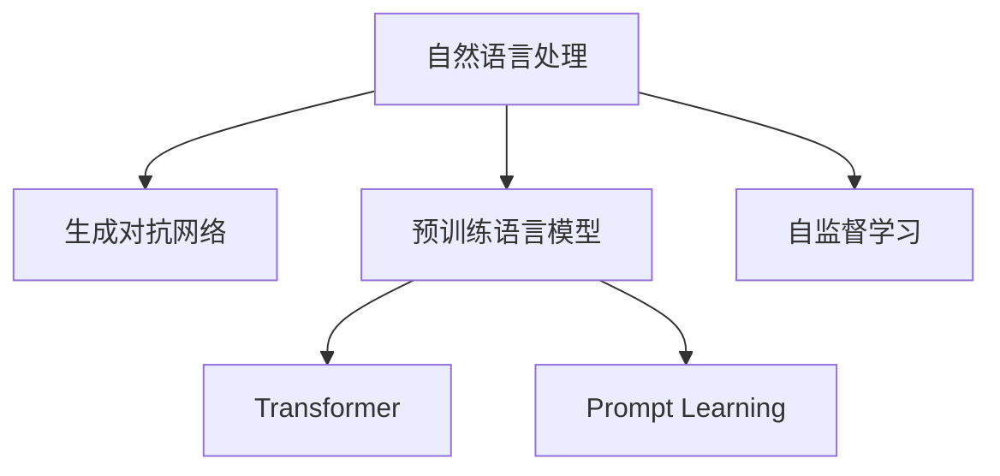

                 

# 自然语言处理的应用：AI内容创作之核心

## 1. 背景介绍

在信息爆炸的今天，内容创作已成为各行各业竞争的关键。传统的基于规则或模板的内容生成方法已难以满足市场的多样化和个性化需求。AI技术，尤其是自然语言处理(NLP)技术，为内容创作带来了新的突破。本文将聚焦于AI内容创作的最新进展，探讨NLP技术在内容生成、文本摘要、问答系统等中的应用，提供全面的技术指导和实际案例分析。

## 2. 核心概念与联系

### 2.1 核心概念概述

为深入理解AI内容创作的核心技术，本节将介绍几个关键概念：

- **自然语言处理(NLP)**：指利用计算机技术处理、理解、生成自然语言的技术，涵盖了分词、词性标注、句法分析、语义理解、语言生成等多个方面。NLP技术在AI内容创作中扮演了重要角色。
- **生成对抗网络(GANs)**：一种生成模型，通过对抗训练生成高质量的文本、图像等。GANs在内容生成领域有广泛应用。
- **预训练语言模型(PLMs)**：指在大规模无标签文本数据上预训练的语言模型，如BERT、GPT等，可以高效地学习通用的语言表示。
- **Transformer**：一种基于自注意力机制的神经网络结构，广泛应用于各种NLP任务，尤其是在内容生成和问答系统中。
- **Prompt Learning**：通过在输入文本中添加提示模板，引导模型进行特定任务的推理和生成。
- **自监督学习(SSL)**：利用未标记数据进行自我监督学习，提取语言表示，广泛应用于预训练模型的训练中。

这些核心概念构成了AI内容创作的技术基础，它们之间的逻辑关系可以通过以下Mermaid流程图进行展示：



## 3. 核心算法原理 & 具体操作步骤

### 3.1 算法原理概述

AI内容创作的本质是通过计算机技术生成符合人类语言习惯、具有一定情感和逻辑性的文本。主要算法包括：

- **基于规则的生成**：利用语言学规则和模板生成文本，适用于结构化文本生成。
- **基于模板的生成**：利用模板和填充词生成文本，适用于特定格式和内容的生成。
- **基于统计的生成**：利用大量文本数据统计模型生成文本，适用于自然语言生成。
- **基于深度学习的生成**：利用神经网络学习语言表示，生成具有较高质量的文本。

### 3.2 算法步骤详解

#### 3.2.1 基于深度学习的生成

1. **数据准备**：收集大量文本数据，并对其进行预处理，如分词、去噪、标注等。
2. **模型训练**：选择合适的深度学习模型（如RNN、LSTM、Transformer等），利用预处理后的文本数据进行训练。
3. **模型评估**：使用BLEU、ROUGE等指标对生成文本进行评估，选择性能最优的模型。
4. **模型应用**：将训练好的模型应用于内容创作，生成符合需求的文本。

#### 3.2.2 基于自监督学习的预训练

1. **数据准备**：收集大规模无标签文本数据。
2. **模型训练**：选择合适的预训练模型（如BERT、GPT等），利用自监督学习任务（如掩码语言模型、下一句预测等）进行训练。
3. **微调**：在特定任务上对预训练模型进行微调，优化生成效果。
4. **模型评估**：使用BLEU、ROUGE等指标对生成文本进行评估，选择性能最优的模型。
5. **模型应用**：将训练好的模型应用于内容创作，生成符合需求的文本。

### 3.3 算法优缺点

基于深度学习的生成具有以下优点：
- **生成质量高**：通过大量数据训练，生成文本的质量较高。
- **应用广泛**：适用于各种类型的文本生成任务，如新闻、小说、对话等。
- **可扩展性强**：可以通过增加数据量和模型复杂度提升生成效果。

同时，也存在一些缺点：
- **数据依赖性强**：需要大量高质量的训练数据，获取和标注成本较高。
- **模型复杂度高**：需要较高的计算资源和存储空间，训练和推理成本较高。
- **生成结果不稳定**：模型容易受到训练数据分布的影响，生成结果存在一定的随机性。

基于自监督学习的预训练则具有以下优点：
- **数据依赖性低**：可以利用大规模无标签数据进行预训练，无需标注数据。
- **训练效率高**：自监督学习可以并行训练，训练速度较快。
- **通用性强**：预训练模型可以迁移到多个任务中，提升生成效果。

同时，也存在一些缺点：
- **模型泛化性有限**：预训练模型的泛化能力可能受数据分布的影响，微调效果不理想时可能出现泛化不足的问题。
- **生成结果单一**：预训练模型生成的文本风格较为固定，难以适应多样化的创作需求。

### 3.4 算法应用领域

AI内容创作技术在以下领域有广泛应用：

1. **内容生成**：如新闻报道、博客文章、广告文案等。
2. **文本摘要**：如新闻摘要、文档摘要等。
3. **问答系统**：如智能客服、智能助手等。
4. **翻译系统**：如机器翻译、语音翻译等。
5. **情感分析**：如情感评论、舆情分析等。
6. **文本补全**：如补全短句、补全对话等。

## 4. 数学模型和公式 & 详细讲解 & 举例说明

### 4.1 数学模型构建

基于深度学习的生成模型通常采用Transformer结构。Transformer由多头自注意力机制和前馈神经网络构成，可以高效地并行计算，适用于大规模文本生成任务。

### 4.2 公式推导过程

以Transformer为例，其数学模型可以表示为：

$$
H = M_{\text{Attention}}(X, K, V) + M_{\text{Feedforward}}(H)
$$

其中，$X$为输入序列，$K$和$V$为查询和值向量，$M_{\text{Attention}}$为多头自注意力机制，$M_{\text{Feedforward}}$为前馈神经网络。

### 4.3 案例分析与讲解

以BERT模型为例，其自监督学习任务包括掩码语言模型和下一句预测。掩码语言模型通过随机掩码部分输入序列，训练模型根据上下文预测被掩码的词汇，提升模型对语义的理解能力。下一句预测任务通过判断两个句子是否连续出现，训练模型学习句子间的关系。

## 5. 项目实践：代码实例和详细解释说明

### 5.1 开发环境搭建

开发环境搭建主要涉及以下步骤：

1. **安装Python**：下载并安装Python 3.7或更高版本，配置环境变量。
2. **安装PyTorch**：使用pip安装PyTorch，配置GPU加速。
3. **安装TensorFlow**：使用pip安装TensorFlow，配置GPU加速。
4. **安装transformers**：使用pip安装transformers，安装预训练模型和工具库。
5. **配置数据集**：收集和预处理数据集，确保数据格式一致。

### 5.2 源代码详细实现

以下是一个简单的基于Transformer生成新闻标题的代码实现：

```python
import torch
import torch.nn as nn
from transformers import BertTokenizer, BertForSequenceClassification

tokenizer = BertTokenizer.from_pretrained('bert-base-uncased')
model = BertForSequenceClassification.from_pretrained('bert-base-uncased', num_labels=1)

def generate_title(text):
    inputs = tokenizer(text, return_tensors='pt')
    outputs = model(**inputs)
    logits = outputs.logits
    title = tokenizer.decode(logits.argmax(dim=1).cpu().numpy()[0])
    return title
```

### 5.3 代码解读与分析

代码中，首先导入必要的库和模块。接着，使用BertTokenizer对输入文本进行分词和编码，将编码后的数据输入到BertForSequenceClassification模型中进行预测。最后，将预测结果解码为文本，即为生成的新闻标题。

## 6. 实际应用场景

### 6.1 智能新闻平台

智能新闻平台可以利用AI内容创作技术自动生成新闻标题和摘要，提升新闻获取效率。通过分析用户浏览历史和兴趣标签，生成个性化推荐的新闻内容，提升用户粘性。

### 6.2 电商平台

电商平台可以利用AI内容创作技术自动生成商品描述和广告文案，提升商品展示效果和销售转化率。通过分析用户评论和反馈，生成更有吸引力的产品介绍和促销信息。

### 6.3 社交媒体

社交媒体可以利用AI内容创作技术自动生成微博、微信公众号文章等，提升内容创作效率和互动性。通过分析用户行为和情感，生成更加贴近用户兴趣的推荐内容。

### 6.4 未来应用展望

未来，AI内容创作技术将在更多领域得到应用，为各行各业带来变革性影响。

1. **智能广告**：利用AI生成更具创意和吸引力的广告文案，提升广告效果。
2. **创意写作**：利用AI生成故事、小说等创意作品，推动文学创作和传播。
3. **个性化推荐**：利用AI生成个性化的推荐内容，提升用户体验和满意度。
4. **新闻编辑**：利用AI生成新闻报道和评论，提升新闻编辑效率和质量。

## 7. 工具和资源推荐

### 7.1 学习资源推荐

为了帮助开发者系统掌握AI内容创作的技术基础和实践技巧，这里推荐一些优质的学习资源：

1. **《深度学习与自然语言处理》**：吴恩达教授的Coursera课程，深入浅出地介绍了深度学习和自然语言处理的基本概念和前沿技术。
2. **《Natural Language Processing with PyTorch》**：伊萨克·古德费洛（Ian Goodfellow）的书籍，详细介绍了如何使用PyTorch进行自然语言处理任务的开发。
3. **《Transformer简明教程》**：transformers库的官方文档，提供了详尽的模型和工具使用指南。
4. **《生成式对抗网络入门》**：Gérard Benoist的博客文章，介绍了生成对抗网络的基本原理和应用案例。
5. **《自监督学习：从理论到实践》**：Zarebinu Guo等人的书籍，详细介绍了自监督学习的基本理论和实践方法。

通过这些资源的学习实践，相信你一定能够快速掌握AI内容创作的核心技术，并用于解决实际的NLP问题。

### 7.2 开发工具推荐

高效的开发离不开优秀的工具支持。以下是几款用于AI内容创作开发的常用工具：

1. **PyTorch**：基于Python的开源深度学习框架，灵活动态的计算图，适合快速迭代研究。
2. **TensorFlow**：由Google主导开发的开源深度学习框架，生产部署方便，适合大规模工程应用。
3. **transformers**：HuggingFace开发的NLP工具库，集成了众多SOTA语言模型，支持PyTorch和TensorFlow，是进行自然语言处理任务开发的利器。
4. **WandB**：模型训练的实验跟踪工具，可以记录和可视化模型训练过程中的各项指标，方便对比和调优。
5. **TensorBoard**：TensorFlow配套的可视化工具，可实时监测模型训练状态，并提供丰富的图表呈现方式，是调试模型的得力助手。

合理利用这些工具，可以显著提升AI内容创作的开发效率，加快创新迭代的步伐。

### 7.3 相关论文推荐

AI内容创作技术的发展源于学界的持续研究。以下是几篇奠基性的相关论文，推荐阅读：

1. **Attention is All You Need**：提出Transformer结构，开启了NLP领域的预训练大模型时代。
2. **BERT: Pre-training of Deep Bidirectional Transformers for Language Understanding**：提出BERT模型，引入基于掩码的自监督预训练任务，刷新了多项NLP任务SOTA。
3. **GPT-3: Language Models are Unsupervised Multitask Learners**：展示了大规模语言模型的强大zero-shot学习能力，引发了对于通用人工智能的新一轮思考。
4. **Generative Pre-trained Transformer**：提出GPT模型，通过自回归方式生成高质量的文本，刷新了多项NLP任务SOTA。
5. **BERT Fine-Tuning for Domain-Specific Tasks**：介绍BERT模型在不同领域上的微调方法，提供了丰富的实际应用案例。

这些论文代表了大语言模型和内容创作技术的发展脉络。通过学习这些前沿成果，可以帮助研究者把握学科前进方向，激发更多的创新灵感。

## 8. 总结：未来发展趋势与挑战

### 8.1 总结

本文对AI内容创作的最新进展进行了全面系统的介绍。首先阐述了AI内容创作在信息时代的重要意义，明确了NLP技术在内容生成、文本摘要、问答系统等中的应用。其次，从原理到实践，详细讲解了基于深度学习和自监督学习的生成模型，提供了完整的代码实例和详细解释说明。同时，本文还广泛探讨了AI内容创作在智能新闻平台、电商平台、社交媒体等多个领域的应用前景，展示了该技术广阔的应用空间。此外，本文精选了学习资源和开发工具，力求为读者提供全方位的技术指引。

通过本文的系统梳理，可以看到，AI内容创作技术正在成为NLP领域的重要范式，极大地拓展了语言模型的应用边界，催生了更多的落地场景。受益于大规模语料的预训练和深度学习技术的进步，AI内容创作有望在未来进一步提升生成效果，带来更广泛的应用价值。

### 8.2 未来发展趋势

展望未来，AI内容创作技术将呈现以下几个发展趋势：

1. **模型规模持续增大**：随着算力成本的下降和数据规模的扩张，预训练语言模型的参数量还将持续增长。超大规模语言模型蕴含的丰富语言知识，有望支撑更加复杂多变的文本生成任务。
2. **生成质量不断提升**：通过更多数据和更复杂的网络结构，生成模型的生成效果将不断提升，生成文本将更贴近真实语言习惯。
3. **多模态融合**：利用视觉、听觉等多模态信息，提升文本生成的表现力和丰富性。
4. **动态生成**：基于实时数据，动态生成更具时效性和个性化的内容，提升用户体验。
5. **融合更多知识**：将符号化的先验知识，如知识图谱、逻辑规则等，与神经网络模型进行巧妙融合，引导生成过程学习更准确、合理的语言模型。
6. **模型可解释性增强**：通过因果分析方法，增强生成模型的解释性，提高用户对生成内容的信任度。

以上趋势凸显了AI内容创作技术的广阔前景。这些方向的探索发展，必将进一步提升文本生成的质量、多样性和智能化程度，为内容创作带来新的突破。

### 8.3 面临的挑战

尽管AI内容创作技术已经取得了瞩目成就，但在迈向更加智能化、普适化应用的过程中，它仍面临诸多挑战：

1. **数据依赖性强**：需要大量高质量的训练数据，获取和标注成本较高。
2. **生成结果不稳定**：模型容易受到训练数据分布的影响，生成结果存在一定的随机性。
3. **泛化能力有限**：在特定领域或特定任务上，模型的泛化能力可能不足，生成效果不理想。
4. **伦理和安全性问题**：生成的内容可能包含有害信息、偏见等，需要加强内容监管和安全防护。
5. **计算资源消耗大**：训练和推理模型需要大量的计算资源和存储空间，成本较高。

尽管存在这些挑战，但随着技术的不断进步和应用的广泛推广，相信AI内容创作技术将逐步克服这些难题，迈向更加智能和可控的未来。

### 8.4 研究展望

未来，在AI内容创作领域的研究方向包括：

1. **无监督和半监督生成**：探索无需标注数据的生成方法，降低生成成本，提升生成效果。
2. **自适应生成**：开发能够动态调整生成策略的模型，提升生成效果的多样性和适应性。
3. **混合生成**：结合多模型生成，提升生成效果的稳定性和鲁棒性。
4. **跨语言生成**：利用多语言预训练模型，提升跨语言内容的生成效果。
5. **内容质量评估**：探索更加科学的生成内容评估指标，提升生成效果的质量和可信度。
6. **人机协作**：结合人工干预和智能生成，提升生成内容的创造性和多样性。

这些研究方向的探索，必将引领AI内容创作技术迈向更高的台阶，为内容创作带来新的突破。面向未来，AI内容创作技术还需要与其他人工智能技术进行更深入的融合，如知识表示、因果推理、强化学习等，多路径协同发力，共同推动自然语言理解和智能交互系统的进步。只有勇于创新、敢于突破，才能不断拓展语言模型的边界，让智能技术更好地造福人类社会。

## 9. 附录：常见问题与解答

**Q1：AI内容创作适用于所有内容生成任务吗？**

A: AI内容创作技术适用于大多数内容生成任务，特别是文本生成任务。但对于一些需要高度专业知识和逻辑推理的任务，如法律文书、科学报告等，仍需结合人工干预和专业知识进行创作。

**Q2：AI内容创作的生成效果是否依赖于训练数据的质量？**

A: 是的，AI内容创作的生成效果高度依赖于训练数据的质量和数量。高质量、多样化的数据能够提升生成效果，而低质量、单一化的数据则会降低生成效果。因此，在数据准备阶段，需要投入大量时间和精力进行数据清洗和标注。

**Q3：如何提升AI内容创作的生成质量？**

A: 提升生成质量的方法包括：
1. 增加训练数据量，扩大模型规模，提升生成效果。
2. 使用自监督学习、对抗训练等技术提升模型泛化能力。
3. 引入更多先验知识，如知识图谱、逻辑规则等，引导生成过程。
4. 结合人工干预，调整生成策略，提升生成效果的多样性和适应性。
5. 使用模型集成和动态生成技术，提升生成效果的稳定性和鲁棒性。

**Q4：AI内容创作在落地应用时需要注意哪些问题？**

A: 将AI内容创作技术应用于实际场景，还需要考虑以下问题：
1. 模型裁剪和量化加速，提升推理速度。
2. 模型部署和服务化封装，方便集成调用。
3. 模型监控和告警，保障系统稳定性。
4. 数据隐私和安全防护，确保用户数据安全。

合理利用这些技术，可以显著提升AI内容创作的实际应用效果，为各行各业带来更多创新和价值。

---

作者：禅与计算机程序设计艺术 / Zen and the Art of Computer Programming

