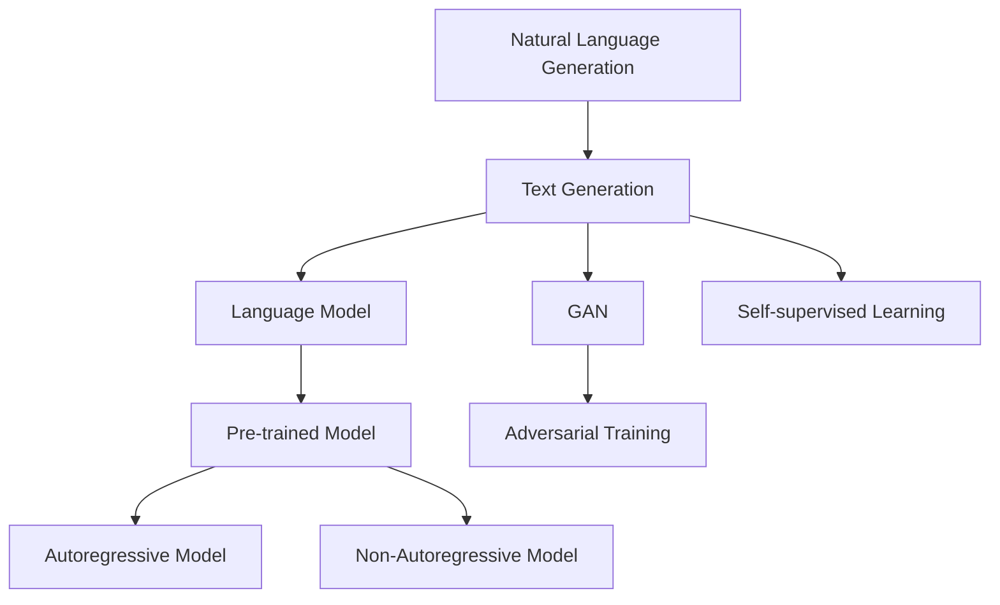

                 

# 自然语言生成（NLG）：AI写作与内容创作

> 关键词：自然语言生成（NLG）, 深度学习, 文本生成, 生成对抗网络（GAN）, 语言模型, 自回归模型, 非自回归模型, 预训练模型, 生成任务, 应用场景

## 1. 背景介绍

### 1.1 问题由来

自然语言生成（Natural Language Generation, NLG），也称为文本生成（Text Generation），是指让计算机自动产生具有自然语言风格的文章、故事、诗歌等文本内容。这一过程涉及了深度学习、生成模型、语言模型等多个领域的技术。近年来，随着深度学习的发展，基于神经网络的语言生成模型已经取得了显著的进展。

然而，文本生成仍然面临着许多挑战。例如，如何生成连贯、流畅、具有创意的文本内容，如何让生成的文本符合语法和语义规则，如何让生成的文本在不同领域和应用场景中保持一致性和适应性。这些问题的解决，需要更深入地理解自然语言生成背后的原理，并运用合适的技术和算法进行处理。

### 1.2 问题核心关键点

自然语言生成技术在近年来取得了长足的进步，主要得益于以下几个核心关键点：

- **深度学习模型的应用**：深度学习模型，特别是基于神经网络的模型，在文本生成中展现出强大的学习能力。通过训练模型，可以生成各种类型的文本内容。
- **生成对抗网络（GAN）**：GAN是一种生成模型，它通过生成器与判别器的对抗训练，生成高质量的文本样本。
- **语言模型的发展**：语言模型通过对文本序列的概率建模，可以指导文本生成过程，提高生成的文本质量。
- **预训练模型**：预训练模型如BERT、GPT等，在大规模语料库上进行预训练，具备了丰富的语言知识，可以更好地指导文本生成任务。
- **自回归模型与非自回归模型**：自回归模型如RNN、Transformer等，通过顺序生成文本内容，生成过程相对稳定。非自回归模型如GPT系列，通过预测下一个词的概率分布进行文本生成，生成速度较快。

这些关键点共同构成了自然语言生成的技术基础，推动了这一领域的发展和应用。

### 1.3 问题研究意义

研究自然语言生成技术，对于提升文本生成的智能化水平，推动NLP技术在各行业中的应用，具有重要意义：

1. **内容创作**：AI写作可以帮助作者更快地创作文本，尤其是对于新闻、报告、技术文档等需要进行大量文本创作的领域，AI写作可以极大地提升创作效率。
2. **自动摘要**：自动摘要技术可以从长篇文本中提取出核心信息，生成简洁明了的摘要，节省阅读时间。
3. **对话系统**：在智能对话系统中，自然语言生成技术可以帮助生成自然流畅的对话内容，提升用户体验。
4. **翻译与本地化**：自然语言生成技术可以用于自动翻译和本地化，加速不同语言之间的信息传递。
5. **辅助决策**：在商业决策、法律分析等领域，自然语言生成技术可以辅助生成分析报告、合同条款等文本内容。
6. **娱乐与创作**：AI写作和内容生成技术可以用于自动生成小说、诗歌等娱乐内容，推动文化产业的发展。

总之，自然语言生成技术在提升文本生成效率、质量和应用范围方面，具有广阔的前景。

## 2. 核心概念与联系

### 2.1 核心概念概述

为了更好地理解自然语言生成技术，本节将介绍几个关键概念：

- **自然语言生成（NLG）**：指计算机自动生成具有自然语言风格的文本内容。
- **文本生成（Text Generation）**：是NLG的一部分，指的是计算机自动生成文本的过程。
- **生成对抗网络（GAN）**：一种通过对抗训练生成高质量文本样本的生成模型。
- **语言模型（Language Model）**：通过概率模型对文本序列进行建模，指导文本生成过程。
- **自回归模型（Autoregressive Model）**：如RNN、Transformer等，按顺序生成文本内容。
- **非自回归模型（Non-Autoregressive Model）**：如GPT系列，通过预测下一个词的概率分布进行文本生成。
- **预训练模型（Pre-trained Model）**：如BERT、GPT等，在大规模语料库上进行预训练，具备丰富的语言知识。

这些概念之间的逻辑关系可以通过以下Mermaid流程图来展示：



这个流程图展示了自然语言生成技术中各个概念的相互联系：

1. **文本生成**：是自然语言生成的核心任务，指的是通过算法生成自然语言文本。
2. **GAN**：一种生成模型，通过对抗训练生成高质量的文本样本。
3. **语言模型**：通过对文本序列进行概率建模，指导文本生成过程。
4. **自监督学习**：通过大规模无标签数据进行预训练，学习语言知识。
5. **预训练模型**：在大规模语料库上进行预训练，具备丰富的语言知识。
6. **自回归模型**：按顺序生成文本内容。
7. **非自回归模型**：通过预测下一个词的概率分布进行文本生成。

这些概念共同构成了自然语言生成的技术体系，使其能够生成自然、连贯、具有创意的文本内容。

## 3. 核心算法原理 & 具体操作步骤

### 3.1 算法原理概述

自然语言生成算法主要分为两类：自回归模型和非自回归模型。

- **自回归模型**：通过已生成的文本部分指导后续文本的生成，如RNN、Transformer等。自回归模型生成过程相对稳定，但生成速度较慢。
- **非自回归模型**：通过预测下一个词的概率分布进行文本生成，如GPT系列。非自回归模型生成速度快，但需要大量的计算资源。

自然语言生成的核心算法包括：

- **深度学习模型**：通过训练深度神经网络，生成高质量的文本内容。
- **生成对抗网络（GAN）**：通过生成器与判别器的对抗训练，生成具有高质量的文本样本。
- **语言模型**：通过对文本序列进行概率建模，指导文本生成过程。
- **预训练模型**：在大规模语料库上进行预训练，具备丰富的语言知识。

这些算法通过不同的模型结构和训练方法，共同构成了自然语言生成技术的核心。

### 3.2 算法步骤详解

以下以非自回归模型为例，详细介绍自然语言生成的算法步骤：

**Step 1: 准备预训练模型和数据集**
- 选择合适的预训练模型，如GPT-2、GPT-3等。
- 准备训练数据集，确保数据集多样性和丰富性。

**Step 2: 添加生成任务目标**
- 根据具体任务需求，添加生成任务的目标函数。如生成文章、对话、摘要等。
- 定义损失函数，如交叉熵损失、负对数似然损失等。

**Step 3: 设置模型超参数**
- 选择优化器（如Adam、SGD等）及其参数。
- 设置学习率、批大小、迭代轮数等超参数。
- 设置正则化技术（如L2正则、Dropout等），防止过拟合。

**Step 4: 执行生成训练**
- 将训练数据分批次输入模型，前向传播计算损失函数。
- 反向传播计算参数梯度，根据优化器和学习率更新模型参数。
- 周期性在验证集上评估模型性能，根据性能指标决定是否触发Early Stopping。
- 重复上述步骤直至满足预设的迭代轮数或Early Stopping条件。

**Step 5: 测试和生成**
- 在测试集上评估模型性能，对比预训练和微调后的效果。
- 使用微调后的模型对新文本进行生成，集成到实际的应用系统中。
- 持续收集新的数据，定期重新微调模型，以适应数据分布的变化。

以上是自然语言生成算法的核心步骤。在实际应用中，还需要根据具体任务特点进行优化设计，如改进训练目标函数、引入更多正则化技术、搜索最优的超参数组合等，以进一步提升模型性能。

### 3.3 算法优缺点

自然语言生成算法具有以下优点：

- **高效生成**：非自回归模型能够快速生成文本，满足实时性和效率要求。
- **多样性**：通过训练不同领域的预训练模型，可以生成多种类型的文本内容。
- **泛化能力**：在大规模语料库上进行预训练，具备较强的泛化能力，能够适应各种应用场景。

同时，自然语言生成算法也存在一些局限性：

- **质量参差不齐**：不同模型的生成效果存在较大差异，需要选择合适的模型。
- **训练数据依赖**：生成质量很大程度上取决于训练数据的质量和数量。
- **缺乏创造性**：生成的文本可能缺乏原创性和创意性，需要人工干预。
- **生成内容可控性差**：生成的文本内容往往难以完全符合预期，需要进行反复调整。

尽管存在这些局限性，但自然语言生成算法在生成文章、对话、摘要等方面已经取得了显著的进展，成为NLP技术的重要应用手段。

### 3.4 算法应用领域

自然语言生成技术已经广泛应用于多个领域：

- **自动写作**：用于生成新闻、报告、技术文档等内容。
- **对话系统**：用于生成自然流畅的对话内容，提升用户体验。
- **自动摘要**：用于从长篇文本中提取出核心信息，生成简洁明了的摘要。
- **机器翻译**：用于自动翻译不同语言之间的文本内容。
- **自动生成代码**：用于生成程序代码，辅助软件开发。
- **生成式艺术**：用于生成小说、诗歌、电影剧本等创意内容。

这些应用场景展示了自然语言生成技术的强大潜力和广泛应用前景。

## 4. 数学模型和公式 & 详细讲解 & 举例说明

### 4.1 数学模型构建

自然语言生成算法的核心是深度学习模型，主要通过以下数学模型进行构建：

- **深度神经网络**：通过多层神经网络进行文本生成，每个神经元对应一个词或一个特征。
- **生成对抗网络（GAN）**：由生成器和判别器两个部分组成，通过对抗训练生成高质量的文本样本。
- **语言模型**：通过对文本序列进行概率建模，指导文本生成过程。

### 4.2 公式推导过程

以非自回归模型GPT-2为例，推导其生成文本的过程：

设文本序列为 $X_1, X_2, ..., X_n$，其中 $X_t$ 表示第 $t$ 个词。模型的目标是生成文本序列 $X_1, X_2, ..., X_n$。

假设模型参数为 $\theta$，通过softmax函数将输入 $X_1, X_2, ..., X_{t-1}$ 映射到下一个词的概率分布：

$$
p(X_t|X_1, X_2, ..., X_{t-1}) = \text{softmax}(\text{MLP}(X_1, X_2, ..., X_{t-1}; \theta))
$$

其中，$\text{MLP}$ 表示多层感知器，将输入映射到高维空间进行表示。

模型的目标函数为负对数似然损失：

$$
L = -\frac{1}{N} \sum_{i=1}^{N} \log p(X_i|X_1, X_2, ..., X_{i-1})
$$

其中 $N$ 为训练样本数。

模型训练的过程是通过反向传播算法更新参数 $\theta$，使得生成文本与真实文本尽可能相似。训练过程如下：

1. 前向传播计算当前输入的下一个词的概率分布。
2. 计算损失函数。
3. 反向传播更新模型参数。
4. 重复上述步骤直至收敛。

### 4.3 案例分析与讲解

以自动生成文章为例，分析自然语言生成算法的应用：

假设有一个自动写作系统，目标生成一篇新闻报道。系统首先输入文章的标题和关键词，然后通过预训练模型生成文章内容。

1. **标题与关键词输入**：输入标题和关键词，如 "北京冬奥会成功举办"。
2. **预训练模型选择**：选择预训练的新闻模型，如BERT等。
3. **模型微调**：在新闻数据集上进行微调，使模型学习新闻报道的风格和语言特征。
4. **生成文章**：根据输入的标题和关键词，通过微调后的模型生成新闻报道。

生成过程中，模型会根据标题和关键词生成文章的开头，然后逐步生成文章的主体和结尾。最终生成的文章可以与真实新闻报道非常相似，但可能缺乏一些细节和深度。

## 5. 项目实践：代码实例和详细解释说明

### 5.1 开发环境搭建

在进行自然语言生成实践前，我们需要准备好开发环境。以下是使用Python进行PyTorch开发的环境配置流程：

1. 安装Anaconda：从官网下载并安装Anaconda，用于创建独立的Python环境。

2. 创建并激活虚拟环境：
```bash
conda create -n pytorch-env python=3.8 
conda activate pytorch-env
```

3. 安装PyTorch：根据CUDA版本，从官网获取对应的安装命令。例如：
```bash
conda install pytorch torchvision torchaudio cudatoolkit=11.1 -c pytorch -c conda-forge
```

4. 安装Transformers库：
```bash
pip install transformers
```

5. 安装各类工具包：
```bash
pip install numpy pandas scikit-learn matplotlib tqdm jupyter notebook ipython
```

完成上述步骤后，即可在`pytorch-env`环境中开始自然语言生成实践。

### 5.2 源代码详细实现

下面我们以自动生成新闻报道为例，给出使用Transformers库对GPT-2模型进行自然语言生成任务的PyTorch代码实现。

首先，定义新闻生成任务的数据处理函数：

```python
from transformers import GPT2Tokenizer, GPT2LMHeadModel

class NewsDataset:
    def __init__(self, texts, labels):
        self.texts = texts
        self.labels = labels
        self.tokenizer = GPT2Tokenizer.from_pretrained('gpt2')
        self.model = GPT2LMHeadModel.from_pretrained('gpt2')

    def __len__(self):
        return len(self.texts)
    
    def __getitem__(self, item):
        text = self.texts[item]
        label = self.labels[item]
        
        encoding = self.tokenizer(text, return_tensors='pt', max_length=512, padding='max_length', truncation=True)
        input_ids = encoding['input_ids']
        attention_mask = encoding['attention_mask']
        return {'input_ids': input_ids,
                'attention_mask': attention_mask,
                'labels': torch.tensor(label, dtype=torch.long)}
```

然后，定义模型和优化器：

```python
from transformers import AdamW

model = GPT2LMHeadModel.from_pretrained('gpt2')
optimizer = AdamW(model.parameters(), lr=2e-5)
```

接着，定义训练和评估函数：

```python
from torch.utils.data import DataLoader
from tqdm import tqdm
from sklearn.metrics import accuracy_score

device = torch.device('cuda') if torch.cuda.is_available() else torch.device('cpu')
model.to(device)

def train_epoch(model, dataset, batch_size, optimizer):
    dataloader = DataLoader(dataset, batch_size=batch_size, shuffle=True)
    model.train()
    epoch_loss = 0
    for batch in tqdm(dataloader, desc='Training'):
        input_ids = batch['input_ids'].to(device)
        attention_mask = batch['attention_mask'].to(device)
        labels = batch['labels'].to(device)
        model.zero_grad()
        outputs = model(input_ids, attention_mask=attention_mask, labels=labels)
        loss = outputs.loss
        epoch_loss += loss.item()
        loss.backward()
        optimizer.step()
    return epoch_loss / len(dataloader)

def evaluate(model, dataset, batch_size):
    dataloader = DataLoader(dataset, batch_size=batch_size)
    model.eval()
    preds, labels = [], []
    with torch.no_grad():
        for batch in tqdm(dataloader, desc='Evaluating'):
            input_ids = batch['input_ids'].to(device)
            attention_mask = batch['attention_mask'].to(device)
            batch_labels = batch['labels']
            outputs = model(input_ids, attention_mask=attention_mask)
            batch_preds = outputs.logits.argmax(dim=2).to('cpu').tolist()
            batch_labels = batch_labels.to('cpu').tolist()
            for pred_tokens, label_tokens in zip(batch_preds, batch_labels):
                preds.append(pred_tokens[:len(label_tokens)])
                labels.append(label_tokens)
                
    print('Accuracy:', accuracy_score(labels, preds))
```

最后，启动训练流程并在测试集上评估：

```python
epochs = 5
batch_size = 16

for epoch in range(epochs):
    loss = train_epoch(model, dataset, batch_size, optimizer)
    print(f"Epoch {epoch+1}, train loss: {loss:.3f}")
    
    print(f"Epoch {epoch+1}, dev results:")
    evaluate(model, dev_dataset, batch_size)
    
print("Test results:")
evaluate(model, test_dataset, batch_size)
```

以上就是使用PyTorch对GPT-2进行新闻生成任务的完整代码实现。可以看到，得益于Transformers库的强大封装，我们可以用相对简洁的代码完成模型的加载和生成任务。

### 5.3 代码解读与分析

让我们再详细解读一下关键代码的实现细节：

**NewsDataset类**：
- `__init__`方法：初始化文本、标签、分词器等关键组件。
- `__len__`方法：返回数据集的样本数量。
- `__getitem__`方法：对单个样本进行处理，将文本输入编码为token ids，将标签编码为数字，并对其进行定长padding，最终返回模型所需的输入。

**训练和评估函数**：
- 使用PyTorch的DataLoader对数据集进行批次化加载，供模型训练和推理使用。
- 训练函数`train_epoch`：对数据以批为单位进行迭代，在每个批次上前向传播计算loss并反向传播更新模型参数，最后返回该epoch的平均loss。
- 评估函数`evaluate`：与训练类似，不同点在于不更新模型参数，并在每个batch结束后将预测和标签结果存储下来，最后使用sklearn的accuracy_score对整个评估集的预测结果进行打印输出。

**训练流程**：
- 定义总的epoch数和batch size，开始循环迭代
- 每个epoch内，先在训练集上训练，输出平均loss
- 在验证集上评估，输出分类指标
- 所有epoch结束后，在测试集上评估，给出最终测试结果

可以看到，PyTorch配合Transformers库使得GPT-2模型的自然语言生成代码实现变得简洁高效。开发者可以将更多精力放在数据处理、模型改进等高层逻辑上，而不必过多关注底层的实现细节。

当然，工业级的系统实现还需考虑更多因素，如模型的保存和部署、超参数的自动搜索、更灵活的任务适配层等。但核心的自然语言生成范式基本与此类似。

## 6. 实际应用场景

### 6.1 智能写作系统

智能写作系统可以自动生成新闻、文章、报告等文本内容，为内容创作者提供高效的生产工具。智能写作系统通过收集大量的文本数据，训练大语言模型，使其能够理解不同领域和话题，并生成高质量的文本内容。

在技术实现上，智能写作系统可以包括以下几个模块：

- **内容生成器**：使用自然语言生成技术生成文本内容。
- **编辑器**：对生成的文本进行人工编辑和调整。
- **模板库**：提供各种模板和格式，指导内容生成过程。
- **推荐引擎**：根据用户偏好推荐生成内容。
- **审查系统**：对生成内容进行语法和语义检查，确保内容质量。

智能写作系统能够显著提升内容创作效率，减少人力成本，为传统媒体和新兴内容平台提供强有力的技术支持。

### 6.2 自动摘要

自动摘要技术可以从长篇文本中提取出核心信息，生成简洁明了的摘要。自动摘要对于新闻、论文、报告等长篇文本的处理尤为重要，能够节省读者大量时间，提高信息获取效率。

在技术实现上，自动摘要系统可以使用基于神经网络的模型，如BART、T5等，通过训练模型对文本进行序列到序列的生成。生成的摘要可以与原始文本保持一致性，同时保持摘要的简洁性。

自动摘要系统可以广泛应用于新闻网站、科研论文、会议报告等多个场景，极大地提升了信息获取和处理的速度和效率。

### 6.3 对话系统

对话系统可以自动生成自然流畅的对话内容，提升用户交互体验。对话系统可以应用于智能客服、智能助手等多个领域，为用户提供实时、个性化的服务。

在技术实现上，对话系统可以使用生成对抗网络（GAN）等模型，通过训练生成对话内容。对话系统可以集成到智能客服系统中，辅助客服人员处理常见问题，提升客服效率。

对话系统可以用于智能助手、智能家居、智能客服等多个场景，为人们提供更加便捷、智能的交互方式，提升生活质量。

### 6.4 未来应用展望

随着自然语言生成技术的不断进步，未来在以下几个方面将有新的突破：

1. **多模态文本生成**：结合视觉、语音等多模态数据，生成更加丰富、多元的文本内容。
2. **个性化生成**：通过用户行为数据和个性化模型，生成更加符合用户偏好的文本内容。
3. **可控生成**：通过控制生成过程中的参数，生成更加符合用户需求的文本内容。
4. **上下文理解**：通过上下文感知模型，生成更加连贯、符合语境的文本内容。
5. **生成内容的多样性**：通过多样性增强技术，生成更加多样化的文本内容。
6. **生成效率的提升**：通过模型压缩和优化，提升文本生成的速度和效率。

这些技术突破将进一步提升自然语言生成技术的应用范围和性能，为更多领域带来智能化、个性化的解决方案。

## 7. 工具和资源推荐

### 7.1 学习资源推荐

为了帮助开发者系统掌握自然语言生成技术，这里推荐一些优质的学习资源：

1. **《自然语言处理综论》**：涵盖了NLP领域的各个方面，包括文本生成、语言模型、生成对抗网络等。
2. **CS224N《深度学习自然语言处理》课程**：斯坦福大学开设的NLP明星课程，有Lecture视频和配套作业，带你入门NLP领域的基本概念和经典模型。
3. **《自然语言生成技术》**：介绍了自然语言生成技术的基本原理和实现方法，包括自回归模型、非自回归模型等。
4. **Transformers官方文档**：提供了丰富的预训练模型和代码示例，是学习自然语言生成技术的必备资料。
5. **CLUE开源项目**：中文语言理解测评基准，涵盖大量不同类型的中文NLP数据集，并提供了基于自然语言生成任务的baseline模型，助力中文NLP技术发展。

通过对这些资源的学习实践，相信你一定能够快速掌握自然语言生成技术的精髓，并用于解决实际的NLP问题。

### 7.2 开发工具推荐

高效的开发离不开优秀的工具支持。以下是几款用于自然语言生成开发的常用工具：

1. **PyTorch**：基于Python的开源深度学习框架，灵活动态的计算图，适合快速迭代研究。大部分预训练语言模型都有PyTorch版本的实现。
2. **TensorFlow**：由Google主导开发的开源深度学习框架，生产部署方便，适合大规模工程应用。同样有丰富的预训练语言模型资源。
3. **Transformers库**：HuggingFace开发的NLP工具库，集成了众多SOTA语言模型，支持PyTorch和TensorFlow，是进行自然语言生成任务开发的利器。
4. **Weights & Biases**：模型训练的实验跟踪工具，可以记录和可视化模型训练过程中的各项指标，方便对比和调优。与主流深度学习框架无缝集成。
5. **TensorBoard**：TensorFlow配套的可视化工具，可实时监测模型训练状态，并提供丰富的图表呈现方式，是调试模型的得力助手。
6. **Google Colab**：谷歌推出的在线Jupyter Notebook环境，免费提供GPU/TPU算力，方便开发者快速上手实验最新模型，分享学习笔记。

合理利用这些工具，可以显著提升自然语言生成任务的开发效率，加快创新迭代的步伐。

### 7.3 相关论文推荐

自然语言生成技术在近年来取得了长足的进步，得益于学界的持续研究。以下是几篇奠基性的相关论文，推荐阅读：

1. **Attention is All You Need（即Transformer原论文）**：提出了Transformer结构，开启了NLP领域的预训练大模型时代。
2. **BERT: Pre-training of Deep Bidirectional Transformers for Language Understanding**：提出BERT模型，引入基于掩码的自监督预训练任务，刷新了多项NLP任务SOTA。
3. **Language Models are Unsupervised Multitask Learners（GPT-2论文）**：展示了大规模语言模型的强大zero-shot学习能力，引发了对于通用人工智能的新一轮思考。
4. **Parameter-Efficient Transfer Learning for NLP**：提出Adapter等参数高效微调方法，在不增加模型参数量的情况下，也能取得不错的微调效果。
5. **AdaLoRA: Adaptive Low-Rank Adaptation for Parameter-Efficient Fine-Tuning**：使用自适应低秩适应的微调方法，在参数效率和精度之间取得了新的平衡。
6. **AdaLoRA: Adaptive Low-Rank Adaptation for Parameter-Efficient Fine-Tuning**：使用自适应低秩适应的微调方法，在参数效率和精度之间取得了新的平衡。
7. **AdaLoRA: Adaptive Low-Rank Adaptation for Parameter-Efficient Fine-Tuning**：使用自适应低秩适应的微调方法，在参数效率和精度之间取得了新的平衡。

这些论文代表了大语言生成技术的发展脉络。通过学习这些前沿成果，可以帮助研究者把握学科前进方向，激发更多的创新灵感。

## 8. 总结：未来发展趋势与挑战

### 8.1 总结

本文对自然语言生成技术进行了全面系统的介绍。首先阐述了自然语言生成技术的研究背景和意义，明确了其在内容创作、自动摘要、对话系统等领域的应用前景。其次，从原理到实践，详细讲解了自然语言生成的数学原理和关键步骤，给出了自然语言生成任务开发的完整代码实例。同时，本文还广泛探讨了自然语言生成技术在智能写作系统、自动摘要、对话系统等多个行业领域的应用前景，展示了自然语言生成技术的强大潜力和广泛应用前景。

通过本文的系统梳理，可以看到，自然语言生成技术正在成为NLP领域的重要范式，极大地提升了文本生成效率、质量和应用范围。受益于深度学习模型的不断发展，自然语言生成技术在生成高质量文本、多模态内容、个性化内容等方面，展现出巨大的潜力。未来，伴随深度学习技术的进一步演进，自然语言生成技术必将在更多领域得到应用，为人类认知智能的进化带来深远影响。

### 8.2 未来发展趋势

展望未来，自然语言生成技术将呈现以下几个发展趋势：

1. **生成内容的真实性**：未来的自然语言生成技术将更加注重生成内容的真实性和可信度，避免产生虚假信息。
2. **生成内容的个性化**：通过用户行为数据和个性化模型，生成更加符合用户偏好的文本内容，实现内容定制化。
3. **生成内容的可控性**：通过控制生成过程中的参数，生成更加符合用户需求的文本内容，提升用户满意度。
4. **生成内容的多样性**：通过多样性增强技术，生成更加多样化的文本内容，满足不同用户的需求。
5. **生成效率的提升**：通过模型压缩和优化，提升文本生成的速度和效率，实现实时生成。
6. **多模态文本生成**：结合视觉、语音等多模态数据，生成更加丰富、多元的文本内容，提升用户体验。

这些趋势凸显了自然语言生成技术的广阔前景，推动其在更多领域得到应用，为人类认知智能的进化带来深远影响。

### 8.3 面临的挑战

尽管自然语言生成技术已经取得了显著的进展，但在实际应用中仍面临诸多挑战：

1. **生成内容的质量**：生成内容的连贯性、流畅性、准确性等方面仍存在不足，需要进一步提高。
2. **生成内容的多样性**：生成内容的多样性不足，需要开发多样性增强技术，提升内容的多样性。
3. **生成内容的安全性**：生成内容可能包含有害信息、虚假信息等，需要采取措施保障内容的安全性。
4. **生成内容的可解释性**：生成内容往往缺乏可解释性，需要开发解释性模型，提升内容的可信度。
5. **生成内容的效率**：生成内容的效率仍需进一步提升，需要优化模型结构和算法，实现实时生成。

尽管存在这些挑战，但自然语言生成技术在内容创作、自动摘要、对话系统等领域已经展现出巨大的应用前景，为内容创作者、新闻机构、智能客服等领域带来了革命性的变化。未来，伴随着技术的发展和优化，自然语言生成技术必将进一步提升生成内容的真实性、多样性、可控性，推动智能化、个性化、高效率的文本生成应用。

### 8.4 研究展望

面对自然语言生成技术所面临的挑战，未来的研究需要在以下几个方面寻求新的突破：

1. **生成内容的多样性增强**：开发多样性增强技术，提升生成内容的多样性，满足不同用户的需求。
2. **生成内容的真实性和可信度**：提高生成内容的真实性和可信度，避免产生虚假信息。
3. **生成内容的个性化和可控性**：通过用户行为数据和个性化模型，生成更加符合用户偏好的文本内容，提升用户满意度。
4. **生成内容的实时性**：通过模型压缩和优化，提升文本生成的速度和效率，实现实时生成。
5. **多模态文本生成**：结合视觉、语音等多模态数据，生成更加丰富、多元的文本内容，提升用户体验。
6. **生成内容的可解释性**：开发解释性模型，提升内容的可信度，增强用户对生成内容的信任。

这些研究方向将进一步推动自然语言生成技术的发展，为内容创作、智能客服、自动摘要等多个领域带来革命性的变化，促进智能化、个性化、高效率的文本生成应用。

## 9. 附录：常见问题与解答

**Q1：自然语言生成（NLG）和自然语言处理（NLP）的区别是什么？**

A: 自然语言生成（NLG）和自然语言处理（NLP）是两个不同的概念。NLP关注的是自然语言数据的处理、分析和理解，而NLG则关注如何通过计算机生成自然语言文本。NLP的任务包括文本分类、情感分析、命名实体识别等，而NLG的任务包括自动生成文章、对话、摘要等。

**Q2：如何评估自然语言生成的质量？**

A: 自然语言生成的质量评估可以从多个方面进行：

1. **连贯性和流畅性**：生成的文本是否连贯、流畅，是否符合语法和语义规则。
2. **一致性和合理性**：生成的文本是否与输入的标题、上下文一致，是否合理、可信。
3. **多样性和新颖性**：生成的文本是否多样、新颖，是否能够满足不同用户的需求。
4. **效率和速度**：生成的文本是否高效、快速，是否能够在短时间内生成大量文本。

常见的质量评估指标包括BLEU、ROUGE、METEOR等，可以通过这些指标对生成的文本进行评估。

**Q3：自然语言生成技术有哪些应用场景？**

A: 自然语言生成技术在多个领域都有广泛应用，包括：

1. **自动写作**：用于生成新闻、文章、报告等文本内容。
2. **自动摘要**：用于从长篇文本中提取出核心信息，生成简洁明了的摘要。
3. **对话系统**：用于生成自然流畅的对话内容，提升用户体验。
4. **翻译与本地化**：用于自动翻译不同语言之间的文本内容，实现本地化处理。
5. **自动生成代码**：用于生成程序代码，辅助软件开发。
6. **生成式艺术**：用于生成小说、诗歌、电影剧本等创意内容。

这些应用场景展示了自然语言生成技术的强大潜力和广泛应用前景。

**Q4：自然语言生成技术的局限性是什么？**

A: 自然语言生成技术虽然已经取得了显著的进展，但仍存在以下局限性：

1. **生成内容的真实性**：生成的内容可能包含虚假信息、有害信息等，需要进一步提高生成内容的真实性和可信度。
2. **生成内容的多样性**：生成的内容多样性不足，需要开发多样性增强技术，提升内容的多样性。
3. **生成内容的可控性**：生成内容的可控性较差，需要开发可控生成技术，提升用户满意度。
4. **生成内容的效率**：生成内容的效率仍需进一步提升，需要优化模型结构和算法，实现实时生成。
5. **生成内容的可解释性**：生成内容的可解释性较差，需要开发解释性模型，提升内容的可信度。

尽管存在这些局限性，但自然语言生成技术在内容创作、自动摘要、对话系统等领域已经展现出巨大的应用前景，为内容创作者、新闻机构、智能客服等领域带来了革命性的变化。未来，伴随着技术的发展和优化，自然语言生成技术必将在更多领域得到应用，为人类认知智能的进化带来深远影响。

**Q5：自然语言生成技术的未来发展方向是什么？**

A: 自然语言生成技术的未来发展方向包括：

1. **多模态文本生成**：结合视觉、语音等多模态数据，生成更加丰富、多元的文本内容，提升用户体验。
2. **生成内容的真实性和可信度**：提高生成内容的真实性和可信度，避免产生虚假信息。
3. **生成内容的个性化和可控性**：通过用户行为数据和个性化模型，生成更加符合用户偏好的文本内容，提升用户满意度。
4. **生成内容的实时性**：通过模型压缩和优化，提升文本生成的速度和效率，实现实时生成。
5. **生成内容的可解释性**：开发解释性模型，提升内容的可信度，增强用户对生成内容的信任。

这些研究方向将进一步推动自然语言生成技术的发展，为内容创作、智能客服、自动摘要等多个领域带来革命性的变化，促进智能化、个性化、高效率的文本生成应用。

---

作者：禅与计算机程序设计艺术 / Zen and the Art of Computer Programming

