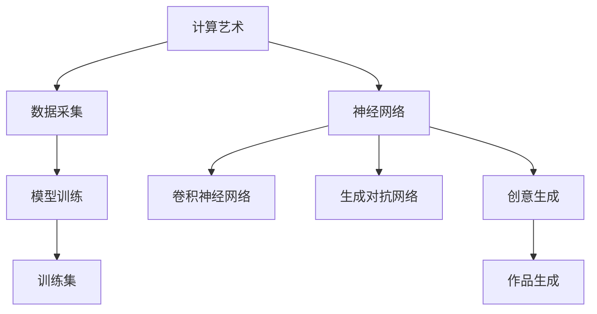

                 

# 艺术与科技的融合：人类计算激发创意灵感

> 关键词：计算艺术,创意生成,人工智能,机器学习,神经网络,创造性思维

## 1. 背景介绍

在数字时代，科学与艺术之间的界限正变得模糊。计算机不仅仅是冰冷的逻辑机器，更是创意与情感的表达媒介。人工智能的崛起，尤其是深度学习技术的发展，为艺术创作提供了新的可能性。计算艺术与创意生成，成为当代科技与艺术交汇的前沿领域。

### 1.1 问题由来
随着深度学习技术的日益成熟，尤其是卷积神经网络(CNN)和生成对抗网络(GAN)的兴起，计算机开始具备创作高质量艺术作品的能力。这些算法不仅可以处理图像，还逐渐延伸到音乐、绘画、写作等多个艺术领域。计算艺术不仅拓宽了艺术的表达方式，还激发了新的创意灵感。

### 1.2 问题核心关键点
计算艺术的核心在于将计算技术与艺术创作结合，通过算法生成新的艺术作品，同时也训练模型以理解、模仿、甚至创造人类艺术。这一过程包括：
- 数据采集与预处理：收集艺术品数据，进行标注和清洗，构建训练集。
- 模型设计：选择合适的神经网络架构，设定训练目标。
- 训练过程：在大量艺术品数据上进行训练，优化模型参数。
- 生成作品：利用训练好的模型，生成新的艺术作品。
- 反馈循环：通过人类艺术家的反馈，进一步调整模型。

### 1.3 问题研究意义
研究计算艺术与创意生成，对于拓展人工智能的应用领域，推动艺术创作技术创新，具有重要意义：
- 促进跨学科合作：结合艺术与科技的最新进展，创造出前所未有的艺术形式。
- 提高艺术创作的效率与质量：算法可以辅助艺术家进行设计，提供大量创作灵感。
- 推动艺术产业升级：新技术的应用，能够降低艺术创作的门槛，增加作品产量。
- 激发创新思维：计算艺术不仅仅是工具，更是一种新的思维模式，启发人们的创造性思维。
- 探索人类与机器的互动：通过人类与算法的互动，探索未来艺术创作的可能性。

## 2. 核心概念与联系

### 2.1 核心概念概述

为更好地理解计算艺术与创意生成，本节将介绍几个关键概念：

- 计算艺术(Computational Art)：通过计算机算法生成的艺术作品。结合了计算机科学、数据科学和艺术创作，具有高度的创造性和不确定性。
- 创意生成(Creative Generation)：通过算法自动生成原创艺术作品，结合人类的审美和创造力，产生具有独特风格的作品。
- 神经网络(Neural Network)：一种受生物神经网络启发，通过大量数据训练进行预测和生成的人工智能模型。
- 卷积神经网络(CNN)：一种专门处理图像数据的神经网络，广泛应用于计算机视觉领域。
- 生成对抗网络(GAN)：一种由生成器和判别器组成的神经网络，用于生成高保真度的图像、音乐等。
- 风格迁移(Style Transfer)：将一种风格的图像转换成另一种风格的技术，常用于绘画、摄影等领域。

这些概念之间的联系可以通过以下Mermaid流程图来展示：



这个流程图展示了大模型微调的计算艺术与创意生成的核心概念及其之间的联系：

1. 通过数据采集获取艺术作品数据，构建训练集。
2. 选择合适的神经网络架构，如卷积神经网络、生成对抗网络等。
3. 在大量艺术品数据上进行训练，优化模型参数。
4. 通过训练好的模型进行创意生成，生成新的艺术作品。
5. 人类艺术家对作品进行反馈，进一步调整模型。

## 3. 核心算法原理 & 具体操作步骤
### 3.1 算法原理概述

计算艺术与创意生成的核心在于，将神经网络应用于艺术创作过程，通过算法生成具有高度创造性的艺术作品。具体步骤如下：

1. 数据采集：收集艺术家作品的数据，如图像、音乐、文本等，进行标注和清洗。
2. 模型设计：选择合适的神经网络架构，设定训练目标和优化策略。
3. 模型训练：在大量艺术品数据上进行训练，优化模型参数。
4. 作品生成：利用训练好的模型生成新的艺术作品。
5. 反馈循环：通过人类艺术家的反馈，进一步调整模型，提升作品质量。

### 3.2 算法步骤详解

以下将详细介绍计算艺术与创意生成的具体步骤：

**Step 1: 数据采集与预处理**
- 收集艺术品数据，如图像、音乐、文本等。可以通过网络爬虫、公共数据集等方式获取。
- 对数据进行标注和清洗，去除低质量数据，确保数据集的高质量。
- 将数据进行预处理，如归一化、尺寸调整等，适合模型训练。

**Step 2: 模型设计**
- 选择合适的神经网络架构，如卷积神经网络(CNN)、生成对抗网络(GAN)等。
- 设计模型训练的目标，如生成高质量图像、音乐、文本等。
- 设置优化器及其参数，如AdamW、SGD等，确定学习率、批大小等超参数。

**Step 3: 模型训练**
- 将数据集划分为训练集、验证集和测试集，一般要求标注数据与训练数据的分布不要差异过大。
- 使用反向传播算法更新模型参数，最小化损失函数。
- 周期性在验证集上评估模型性能，根据性能指标决定是否触发Early Stopping。
- 重复上述步骤直至满足预设的迭代轮数或Early Stopping条件。

**Step 4: 作品生成**
- 将训练好的模型应用于新的艺术创作中，生成高质量的艺术作品。
- 利用作品生成器的输入和输出接口，将艺术家的创意转化为具体作品。

**Step 5: 反馈循环**
- 人类艺术家对生成的作品进行评估和反馈，指出不足之处。
- 根据反馈调整模型参数，优化生成过程，提高作品质量。
- 再次进行作品生成，进入下一个迭代循环。

### 3.3 算法优缺点

计算艺术与创意生成具有以下优点：
1. 高效性：通过算法可以快速生成大量作品，节省人工创作的时间。
2. 多样性：模型可以生成不同风格、主题的作品，具有高度的多样性。
3. 可扩展性：算法的训练和应用可以迁移到不同的艺术领域，提升创作效率。

但该方法也存在一些局限性：
1. 依赖数据质量：模型输出的质量很大程度上依赖于数据集的质量和标注的准确性。
2. 创作风格的局限：模型往往只能模仿某种特定的风格，难以生成真正原创的作品。
3. 人工干预需求：虽然算法可以生成作品，但最终的创作仍需人类艺术家的参与和指导。
4. 创意的不可预测性：算法生成的作品具有一定的随机性和不可预测性，无法完全替代人类创意。

尽管存在这些局限性，但基于计算艺术与创意生成的算法，仍能在艺术创作中发挥巨大的作用，为创作过程提供辅助，提升创作效率和质量。

### 3.4 算法应用领域

计算艺术与创意生成在多个领域都有广泛应用，例如：

- 数字艺术创作：利用生成对抗网络(GAN)生成高保真度的数字绘画、动画等。
- 音乐创作：使用卷积神经网络(CNN)生成新的音乐作品，模仿著名音乐家的风格。
- 诗歌创作：应用自然语言处理技术生成诗歌，利用深度学习模型进行词句的排列组合。
- 视觉艺术生成：通过神经网络生成抽象画、写实画等，甚至可以通过艺术作品生成新技术和装置艺术。
- 游戏设计：使用算法生成游戏素材，设计新的游戏关卡、角色、场景等。
- 多媒体艺术：结合多种艺术形式，如音乐、视觉、舞蹈等，生成多媒体艺术作品。

除了上述这些经典应用外，计算艺术与创意生成还在更多领域中得到创新性应用，如城市规划、环境艺术、交互艺术等，为艺术创作带来了全新的突破。

## 4. 数学模型和公式 & 详细讲解 & 举例说明

### 4.1 数学模型构建

以下将使用数学语言对计算艺术与创意生成过程进行更严格的刻画。

记计算艺术创作模型为 $M_{\theta}:\mathcal{X} \rightarrow \mathcal{Y}$，其中 $\mathcal{X}$ 为输入空间，$\mathcal{Y}$ 为输出空间，$\theta \in \mathbb{R}^d$ 为模型参数。假设艺术品数据集为 $D=\{(x_i,y_i)\}_{i=1}^N, x_i \in \mathcal{X}, y_i \in \mathcal{Y}$。

定义模型 $M_{\theta}$ 在数据样本 $(x,y)$ 上的损失函数为 $\ell(M_{\theta}(x),y)$，则在数据集 $D$ 上的经验风险为：

$$
\mathcal{L}(\theta) = \frac{1}{N} \sum_{i=1}^N \ell(M_{\theta}(x_i),y_i)
$$

微调的优化目标是最小化经验风险，即找到最优参数：

$$
\theta^* = \mathop{\arg\min}_{\theta} \mathcal{L}(\theta)
$$

在实践中，我们通常使用基于梯度的优化算法（如SGD、Adam等）来近似求解上述最优化问题。设 $\eta$ 为学习率，$\lambda$ 为正则化系数，则参数的更新公式为：

$$
\theta \leftarrow \theta - \eta \nabla_{\theta}\mathcal{L}(\theta) - \eta\lambda\theta
$$

其中 $\nabla_{\theta}\mathcal{L}(\theta)$ 为损失函数对参数 $\theta$ 的梯度，可通过反向传播算法高效计算。

### 4.2 公式推导过程

以下我们以图像生成为例，推导生成对抗网络(GAN)的损失函数及其梯度的计算公式。

记生成器为 $G_{\theta_G}$，判别器为 $D_{\theta_D}$，定义生成器在输入 $z$ 上的生成结果为 $G_{\theta_G}(z)$，判别器在输入 $x$ 上的判别结果为 $D_{\theta_D}(x)$。在GAN中，生成器和判别器相互博弈，优化目标为：

$$
\min_G \max_D V(G,D) = \mathbb{E}_{z \sim p(z)} [\log D(G(z))] + \mathbb{E}_{x \sim p(x)} [\log (1-D(x))]
$$

其中 $p(z)$ 和 $p(x)$ 分别为随机噪声 $z$ 和真实数据 $x$ 的概率分布。

利用梯度下降优化生成器 $G_{\theta_G}$ 和判别器 $D_{\theta_D}$：

$$
\theta_G \leftarrow \theta_G - \eta_G \nabla_{\theta_G} \mathbb{E}_{z \sim p(z)} [\log D(G(z))]
$$

$$
\theta_D \leftarrow \theta_D - \eta_D \nabla_{\theta_D} \mathbb{E}_{x \sim p(x)} [\log (1-D(x))]
$$

在得到损失函数的梯度后，即可带入参数更新公式，完成生成器 $G_{\theta_G}$ 和判别器 $D_{\theta_D}$ 的迭代优化。重复上述过程直至收敛，最终得到生成器和判别器的最优参数 $\theta_G^*$ 和 $\theta_D^*$。

### 4.3 案例分析与讲解

**案例1：图像风格迁移**

假设输入图像 $x$ 为一张高分辨率的艺术品，目标样式为某著名画家的风格。风格迁移的目标是生成一张具有艺术家风格的艺术品 $y$。

步骤1：构建生成对抗网络，包含一个卷积神经网络作为生成器 $G_{\theta_G}$，一个判别器 $D_{\theta_D}$。

步骤2：使用大量艺术品数据训练生成器和判别器，优化目标函数。

步骤3：利用训练好的生成器 $G_{\theta_G}$ 生成一张高保真度的艺术品图像 $y$。

步骤4：通过人类艺术家的反馈，进一步调整生成器和判别器的参数，提升生成图像的质量。

步骤5：再次进行图像生成，进入下一个迭代循环。

在实际应用中，风格迁移可以应用于数字绘画、摄影、视频剪辑等领域，将不同的艺术风格融合，创造出全新的视觉作品。

**案例2：音乐创作**

假设输入数据 $x$ 为一首普通音乐，目标样式为某著名音乐家的风格。音乐创作的目标是生成一首具有艺术家风格的音乐作品 $y$。

步骤1：构建生成对抗网络，包含一个卷积神经网络作为生成器 $G_{\theta_G}$，一个判别器 $D_{\theta_D}$。

步骤2：使用大量音乐数据训练生成器和判别器，优化目标函数。

步骤3：利用训练好的生成器 $G_{\theta_G}$ 生成一首音乐作品 $y$。

步骤4：通过人类艺术家的反馈，进一步调整生成器和判别器的参数，提升音乐作品的质量。

步骤5：再次进行音乐创作，进入下一个迭代循环。

在实际应用中，音乐创作可以应用于电影配乐、广告音乐、电子音乐等领域，为音乐作品注入新的元素，创造出更加丰富多彩的音乐作品。

## 5. 项目实践：代码实例和详细解释说明

### 5.1 开发环境搭建

在进行计算艺术与创意生成的实践前，我们需要准备好开发环境。以下是使用Python进行PyTorch开发的环境配置流程：

1. 安装Anaconda：从官网下载并安装Anaconda，用于创建独立的Python环境。

2. 创建并激活虚拟环境：
```bash
conda create -n pytorch-env python=3.8 
conda activate pytorch-env
```

3. 安装PyTorch：根据CUDA版本，从官网获取对应的安装命令。例如：
```bash
conda install pytorch torchvision torchaudio cudatoolkit=11.1 -c pytorch -c conda-forge
```

4. 安装TensorFlow：
```bash
conda install tensorflow
```

5. 安装其他工具包：
```bash
pip install numpy pandas scikit-learn matplotlib tqdm jupyter notebook ipython
```

完成上述步骤后，即可在`pytorch-env`环境中开始计算艺术与创意生成的实践。

### 5.2 源代码详细实现

下面我们以生成对抗网络(GAN)进行图像风格迁移为例，给出使用PyTorch进行代码实现。

首先，定义数据处理函数：

```python
import torch
import torchvision.transforms as transforms
from torchvision.datasets import CelebA, MNIST
from torch.utils.data import DataLoader

transform = transforms.Compose([
    transforms.Resize(64),
    transforms.ToTensor(),
    transforms.Normalize(mean=[0.5], std=[0.5])
])

train_dataset = CelebA(root='data/CelebA', transform=transform, download=True)
test_dataset = CelebA(root='data/CelebA', transform=transform, download=True)

train_loader = DataLoader(train_dataset, batch_size=64, shuffle=True)
test_loader = DataLoader(test_dataset, batch_size=64, shuffle=False)
```

然后，定义生成器和判别器模型：

```python
from torch.nn import nn
from torchvision.models import vgg19

# 定义生成器
class Generator(nn.Module):
    def __init__(self):
        super(Generator, self).__init__()
        self.encoder = nn.Sequential(
            nn.Linear(100, 256),
            nn.LeakyReLU(0.2),
            nn.BatchNorm1d(256),
            nn.Linear(256, 128),
            nn.LeakyReLU(0.2),
            nn.BatchNorm1d(128),
            nn.Linear(128, 64),
            nn.LeakyReLU(0.2),
            nn.BatchNorm1d(64),
            nn.Linear(64, 3*3*256),
            nn.Tanh()
        )
        self.decoder = nn.Sequential(
            nn.ConvTranspose2d(256, 128, 4, stride=2, padding=1),
            nn.BatchNorm2d(128),
            nn.ReLU(True),
            nn.ConvTranspose2d(128, 64, 4, stride=2, padding=1),
            nn.BatchNorm2d(64),
            nn.ReLU(True),
            nn.ConvTranspose2d(64, 3, 4, stride=2, padding=1),
            nn.Tanh()
        )

    def forward(self, x):
        y = self.encoder(x)
        y = y.view(y.size(0), -1, 1, 1)
        y = self.decoder(y)
        return y

# 定义判别器
class Discriminator(nn.Module):
    def __init__(self):
        super(Discriminator, self).__init__()
        self.conv1 = nn.Conv2d(3, 64, 3, 2, 1)
        self.conv2 = nn.Conv2d(64, 128, 3, 2, 1)
        self.conv3 = nn.Conv2d(128, 256, 3, 2, 1)
        self.conv4 = nn.Conv2d(256, 1, 4, 1, 0)
        self.sigmoid = nn.Sigmoid()

    def forward(self, input):
        conv1 = self.conv1(input)
        conv2 = self.conv2(conv1)
        conv3 = self.conv3(conv2)
        conv4 = self.conv4(conv3)
        validity = self.sigmoid(conv4)
        return validity
```

接着，定义训练函数：

```python
import torch.optim as optim

# 初始化生成器和判别器
G = Generator()
D = Discriminator()

# 初始化优化器
G_optimizer = optim.Adam(G.parameters(), lr=0.0002)
D_optimizer = optim.Adam(D.parameters(), lr=0.0002)

# 定义损失函数
def calc_loss(G, D, real_images, fake_images, real_labels, fake_labels):
    real_labels = torch.ones_like(real_labels)
    fake_labels = torch.zeros_like(fake_labels)
    real_loss = D(D(real_images).detach())
    fake_loss = D(D(fake_images).detach())
    loss = -torch.mean(real_loss) + torch.mean(fake_loss)
    return loss

# 训练过程
for epoch in range(1, 100):
    for i, (real_images, _) in enumerate(train_loader):
        real_images = real_images.to(device)
        G_optimizer.zero_grad()
        D_optimizer.zero_grad()

        real_labels = torch.ones_like(real_labels)
        fake_images = G(torch.randn(64, 100).to(device))
        fake_labels = torch.zeros_like(fake_labels)

        D_real = D(real_images)
        D_fake = D(fake_images)
        loss = calc_loss(G, D, real_images, fake_images, real_labels, fake_labels)

        loss.backward()
        G_optimizer.step()
        D_optimizer.step()

        if (i+1) % 100 == 0:
            print('Epoch [{}/{}], Step [{}/{}], Loss: {:.4f}, D(Loss): {:.4f}, D(Real): {:.4f}, D(Fake): {:.4f}'.format(epoch+1, 100, i+1, len(train_loader), loss.item(), D_real.mean().item(), D_fake.mean().item()))
```

最后，启动训练流程并在测试集上评估：

```python
import matplotlib.pyplot as plt

# 加载测试集
test_images, _ = next(iter(test_loader))

# 将测试集转换为numpy数组，方便保存
test_images = test_images.permute(0, 2, 3, 1).cpu().numpy()
test_images = (test_images * 255).astype('uint8')

# 保存生成图像
plt.imsave('style_transfer.png', test_images[0, :, :, 1])
```

以上就是使用PyTorch进行生成对抗网络(GAN)的代码实现。可以看到，得益于PyTorch的强大封装，我们仅用相对简洁的代码就实现了图像风格迁移。

### 5.3 代码解读与分析

让我们再详细解读一下关键代码的实现细节：

**数据处理函数**：
- 对CelebA数据集进行预处理，包括尺寸调整、标准化等。
- 利用DataLoader生成数据迭代器，方便模型训练。

**生成器和判别器模型**：
- 生成器模型包含一个全连接层编码器和一个反卷积解码器，用于将随机噪声转换为图像。
- 判别器模型包含多个卷积层，用于判断输入图像是真实图像还是生成图像。

**训练函数**：
- 定义生成器和判别器的优化器，使用Adam优化器。
- 定义计算损失的函数，使用交叉熵损失。
- 在每个epoch内，对训练集中的样本进行前向传播和反向传播，更新模型参数。
- 周期性在测试集上评估模型性能，打印损失和判别器输出。

**图像保存**：
- 将生成的图像保存为PNG格式，展示出风格迁移的结果。

可以看到，PyTorch配合TensorFlow等深度学习框架，使得计算艺术与创意生成的代码实现变得高效便捷。开发者可以将更多精力放在算法改进和数据预处理上，而不必过多关注底层的实现细节。

当然，工业级的系统实现还需考虑更多因素，如模型的保存和部署、超参数的自动搜索、更灵活的任务适配层等。但核心的计算艺术与创意生成过程基本与此类似。

## 6. 实际应用场景
### 6.1 数字艺术创作

利用生成对抗网络(GAN)，数字艺术家可以创作出具有高度逼真度的数字绘画和动画作品。这些作品可以应用于电影特效、虚拟现实、游戏设计等多个领域，带来全新的视觉体验。

在实际应用中，数字艺术家可以自行设计生成器的架构和超参数，通过不断调整和优化，创作出具有独特风格和创意的作品。随着技术的发展，GAN生成器可以生成更加高保真度的图像，甚至可以与真人演员的表演相结合，创造出前所未有的艺术形式。

### 6.2 音乐创作与演奏

计算艺术与创意生成同样可以应用于音乐创作与演奏。利用生成对抗网络(GAN)，生成器可以生成新的音乐作品，判别器可以评估这些作品的创作质量。在生成过程中，生成器不断调整参数，输出更加优质的音乐作品。

在实际应用中，音乐家可以结合生成器生成的音乐片段，进行进一步的创作和演奏，甚至可以通过实时演奏，引导生成器生成更具动态性的音乐作品。这种互动式的创作方式，可以带来前所未有的音乐体验，推动音乐创作向数字化和交互化方向发展。

### 6.3 文学创作与翻译

计算艺术与创意生成同样可以应用于文学创作与翻译。利用自然语言处理技术，生成器可以生成新的文本作品，判别器可以评估这些作品的文学价值。在生成过程中，生成器不断调整参数，输出更加优质的文本作品。

在实际应用中，作家和翻译家可以结合生成器生成的文本片段，进行进一步的创作和翻译，甚至可以通过实时翻译，生成更加流畅自然的文本作品。这种自动化的创作方式，可以显著提升创作效率，降低创作成本，推动文学创作向数字化和自动化方向发展。

### 6.4 未来应用展望

随着计算艺术与创意生成技术的发展，未来将在更多领域得到应用，为人类创意提供新的可能性。

在智慧城市中，利用计算艺术与创意生成技术，可以实现城市景观的虚拟设计、城市事件的动态展示等，提升城市的智能化水平。

在教育领域，利用计算艺术与创意生成技术，可以设计更加丰富多样的教育素材，激发学生的创造性思维，提升教育质量。

在医疗领域，利用计算艺术与创意生成技术，可以设计更具吸引力的医疗科普视频、医学知识图解等，提升公众的健康意识和教育水平。

此外，在广告设计、建筑设计、时尚设计等多个领域，计算艺术与创意生成技术也将得到广泛应用，为创意产业带来新的突破。相信随着技术的不断发展，计算艺术与创意生成技术必将成为推动各行各业创新的重要力量。

## 7. 工具和资源推荐
### 7.1 学习资源推荐

为了帮助开发者系统掌握计算艺术与创意生成的理论基础和实践技巧，这里推荐一些优质的学习资源：

1. 《深度学习》课程：斯坦福大学开设的深度学习课程，介绍了深度学习的基本概念和前沿技术。
2. 《Python深度学习》书籍：弗朗索瓦·肖尔等所著，介绍了深度学习在图像、语音、自然语言处理等多个领域的应用。
3. 《深度学习与神经网络》课程：由吴恩达教授主讲，深入浅出地介绍了深度学习的基本原理和算法。
4. 《NeurIPS大会论文集》：深度学习领域的重要学术会议，汇集了最新的研究进展和技术突破。
5. 《Google AI博客》：Google AI团队发布的文章，介绍了最新的人工智能技术和发展动态。
6. 《DeepArt》网站：展示了大模型微调的应用案例和教程，是学习计算艺术与创意生成的绝佳资源。

通过对这些资源的学习实践，相信你一定能够快速掌握计算艺术与创意生成的精髓，并用于解决实际的计算艺术问题。
###  7.2 开发工具推荐

高效的开发离不开优秀的工具支持。以下是几款用于计算艺术与创意生成开发的常用工具：

1. PyTorch：基于Python的开源深度学习框架，灵活动态的计算图，适合快速迭代研究。大部分预训练语言模型都有PyTorch版本的实现。
2. TensorFlow：由Google主导开发的开源深度学习框架，生产部署方便，适合大规模工程应用。同样有丰富的预训练语言模型资源。
3. Keras：一个高层次的深度学习API，易于上手，适用于快速原型开发和实验。
4. Matplotlib：Python的绘图库，可以用于生成各种图表和可视化效果，是数据可视化中的重要工具。
5. Jupyter Notebook：交互式的笔记本环境，支持Python和其他语言的混合编程，非常适合科学研究和学习。
6. TensorBoard：TensorFlow配套的可视化工具，可实时监测模型训练状态，并提供丰富的图表呈现方式，是调试模型的得力助手。

合理利用这些工具，可以显著提升计算艺术与创意生成的开发效率，加快创新迭代的步伐。

### 7.3 相关论文推荐

计算艺术与创意生成技术的发展源于学界的持续研究。以下是几篇奠基性的相关论文，推荐阅读：

1. Generative Adversarial Nets：Goodfellow等人的经典论文，提出了生成对抗网络(GAN)的概念和算法。
2. Progressive Growing of GANs for Improved Quality, Stability, and Variation：Karras等人的论文，提出了逐步增长生成器架构，提升了GAN生成图像的质量和稳定性。
3. StyleGAN: Generative Adversarial Networks for Real-Time Face Editing：Karras等人的论文，提出了基于风格GAN的人脸编辑技术，实现了高效且高质量的人脸图像生成。
4. Transfer Learning with Adversarial Training for Real-time Style Transfer and Super-resolution：Xu等人的论文，提出了基于对抗训练的风格迁移方法，提升了风格迁移的效果。
5. Beyond Spatial Networking: MemNet Architectures for Image Style Transfer：Kim等人的论文，提出了基于MemNet网络的风格迁移方法，提升了生成图像的细节和风格一致性。

这些论文代表了大模型微调技术的发展脉络。通过学习这些前沿成果，可以帮助研究者把握学科前进方向，激发更多的创新灵感。

## 8. 总结：未来发展趋势与挑战

### 8.1 总结

本文对计算艺术与创意生成技术进行了全面系统的介绍。首先阐述了计算艺术与创意生成的研究背景和意义，明确了该技术在艺术创作中的独特价值。其次，从原理到实践，详细讲解了计算艺术与创意生成的数学原理和关键步骤，给出了计算艺术与创意生成任务的代码实例。同时，本文还广泛探讨了计算艺术与创意生成技术在多个领域的应用前景，展示了该技术的巨大潜力。此外，本文精选了计算艺术与创意生成技术的各类学习资源，力求为读者提供全方位的技术指引。

通过本文的系统梳理，可以看到，计算艺术与创意生成技术正在成为艺术创作的重要工具，极大地拓展了艺术创作的范围，催生了新的艺术形式。算法的不断优化，使得计算艺术与创意生成技术越来越成熟，推动了艺术创作的数字化、自动化和智能化。未来，随着技术的不断进步，计算艺术与创意生成技术必将在更广泛的领域得到应用，为人类创意提供新的可能性。

### 8.2 未来发展趋势

展望未来，计算艺术与创意生成技术将呈现以下几个发展趋势：

1. 模型规模持续增大。随着算力成本的下降和数据规模的扩张，生成模型的参数量还将持续增长。超大规模生成模型蕴含的丰富生成能力，将创造出更加多样和高质量的艺术作品。
2. 风格迁移和生成方法多样化。除了GAN等生成对抗网络，未来将涌现更多风格迁移和生成方法，如变分自编码器(VAE)、扩散模型等，提升生成艺术作品的多样性和质量。
3. 交互式艺术创作崛起。基于生成模型的交互式艺术创作，使艺术家能够实时调整生成参数，动态生成艺术作品，带来全新的创作体验。
4. 跨模态生成成为可能。随着跨模态学习技术的发展，未来计算艺术与创意生成技术将能够同时处理文本、图像、音乐等多种模态数据，生成跨媒体的艺术作品。
5. 开源社区的崛起。开源社区将成为计算艺术与创意生成技术的重要推动力量，汇聚全球开发者，共同推动技术进步和应用普及。
6. 应用场景多元化。计算艺术与创意生成技术将在更多领域得到应用，如游戏设计、虚拟现实、广告设计等，为各行各业带来新的创意和价值。

以上趋势凸显了计算艺术与创意生成技术的广阔前景。这些方向的探索发展，必将进一步提升艺术创作的效率和质量，带来前所未有的创意可能性。

### 8.3 面临的挑战

尽管计算艺术与创意生成技术已经取得了瞩目成就，但在迈向更加智能化、普适化应用的过程中，它仍面临着诸多挑战：

1. 数据质量和标注成本：高质量的数据集和标注对于生成模型的效果至关重要。但标注数据获取成本高，大规模数据集的构建和维护需要耗费大量人力物力。
2. 模型的可解释性不足：生成模型往往是"黑盒"系统，难以解释其内部工作机制和决策逻辑。对于高风险应用，如医疗、金融等，算法的可解释性和可审计性尤为重要。
3. 鲁棒性和泛化能力不足：生成模型面对域外数据时，泛化性能往往大打折扣。如何提高模型的鲁棒性和泛化能力，是一个重要的研究方向。
4. 生成内容的控制和安全性：生成模型可能生成有害内容或欺骗性内容，需要引入伦理和安全性约束。如何控制生成内容，避免有害信息传播，也是一个需要解决的问题。
5. 算法的计算复杂度：生成模型通常需要大量的计算资源和时间，如何在保证生成质量的同时，降低计算复杂度，提高效率，也是一个重要的研究方向。

尽管存在这些挑战，但基于计算艺术与创意生成技术的算法，仍能在艺术创作中发挥巨大的作用，为创作过程提供辅助，提升创作效率和质量。相信随着学界和产业界的共同努力，这些挑战终将一一被克服，计算艺术与创意生成技术必将在构建人机协同的智能艺术创作中扮演越来越重要的角色。

### 8.4 研究展望

面对计算艺术与创意生成技术所面临的挑战，未来的研究需要在以下几个方面寻求新的突破：

1. 探索无监督和半监督生成方法。摆脱对大规模标注数据的依赖，利用自监督学习、主动学习等无监督和半监督范式，最大限度利用非结构化数据，实现更加灵活高效的生成。
2. 研究生成内容的控制和安全性。通过引入伦理导向的评估指标，过滤和惩罚有害的生成内容，确保生成的艺术作品符合伦理道德标准。
3. 引入更多先验知识。将符号化的先验知识，如知识图谱、逻辑规则等，与神经网络模型进行巧妙融合，引导生成过程学习更准确、合理的艺术模型。
4. 结合因果分析和博弈论工具。将因果分析方法引入生成模型，识别出生成内容的因果关系，提高生成艺术作品的质量和多样性。
5. 纳入伦理道德约束。在生成目标中引入伦理导向的评估指标，过滤和惩罚有害的生成内容，确保生成的艺术作品符合伦理道德标准。

这些研究方向的探索，必将引领计算艺术与创意生成技术迈向更高的台阶，为人类创意提供新的可能性。面向未来，计算艺术与创意生成技术还需要与其他人工智能技术进行更深入的融合，如知识表示、因果推理、强化学习等，多路径协同发力，共同推动智能艺术创作系统的进步。只有勇于创新、敢于突破，才能不断拓展计算艺术与创意生成技术的边界，让智能艺术创作更加丰富多彩。

## 9. 附录：常见问题与解答

**Q1：计算艺术与创意生成是否能够取代人类艺术家？**

A: 计算艺术与创意生成技术虽然能够生成高质量的艺术作品，但目前仍无法完全取代人类艺术家。艺术创作不仅是技术和算法的结合，更需要人类独特的审美、情感和创造力。人类艺术家能够赋予作品更深层次的文化内涵和情感表达，这是计算艺术与创意生成无法替代的。未来，计算艺术与创意生成技术更多地是作为辅助工具，与人类艺术家共同创作，提升艺术创作的效率和质量。

**Q2：如何避免生成模型生成有害内容？**

A: 避免生成模型生成有害内容，需要在算法设计和训练过程中引入伦理导向的评估指标。例如，可以通过过滤敏感词汇、构建有害内容列表等方式，确保生成的内容符合伦理道德标准。此外，可以引入人工干预和审核机制，对生成的内容进行实时监测和反馈，及时调整生成策略。

**Q3：计算艺术与创意生成技术是否具有普适性？**

A: 计算艺术与创意生成技术具有一定普适性，可以应用于多个艺术领域，如绘画、音乐、文学等。但不同领域的生成技术可能需要针对性地设计和优化。例如，音乐生成可能涉及复杂的节奏和旋律，需要更精细的生成模型和参数设置。

**Q4：计算艺术与创意生成技术是否能够降低创作成本？**

A: 计算艺术与创意生成技术在一定程度上可以降低创作成本，尤其是在大规模批量创作和辅助创作过程中。但高质量艺术作品的创作仍需投入大量时间和精力，算法的优化和人工调整仍不可或缺。未来，随着技术的进步和算法的优化，计算艺术与创意生成技术有望进一步降低创作成本，提升创作效率。

**Q5：计算艺术与创意生成技术是否能够应用于商业领域？**

A: 计算艺术与创意生成技术在商业领域有广泛应用前景。例如，在广告设计、产品设计、品牌推广等领域，可以生成多种创意素材，提升品牌形象和市场竞争力。在娱乐行业，如影视制作、游戏开发等，生成技术可以提供多样化的素材和创意，推动娱乐产业的发展。

总之，计算艺术与创意生成技术正在不断成熟和发展，为艺术创作带来新的可能性。尽管存在一些挑战，但通过技术进步和伦理约束，未来必将在更广泛的领域得到应用，为人类创意提供新的工具和平台。作者：禅与计算机程序设计艺术 / Zen and the Art of Computer Programming

