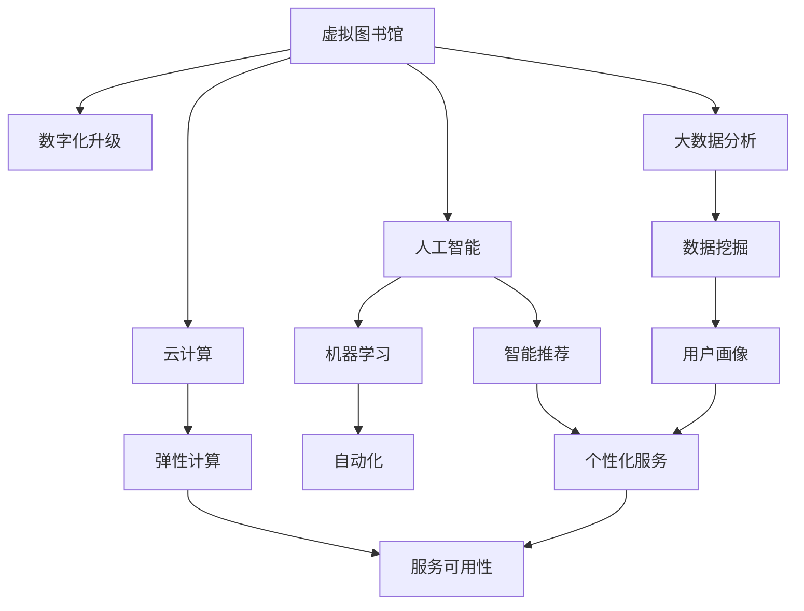

                 

# 虚拟图书馆:全球图书馆的数字化升级

> 关键词：虚拟图书馆,数字化升级,全球图书馆,数字化转型,人工智能,图书馆自动化,智慧图书馆

## 1. 背景介绍

### 1.1 问题由来

在信息时代，知识的传播速度和数量以前所未有的速度增长。传统图书馆面临着数字化转型的紧迫需求，以适应数字化时代用户的多样化需求。虚拟图书馆应运而生，它结合了数字技术和图书馆传统优势，使读者能够不受时间和空间限制，随时随地访问丰富资源。本文将探讨虚拟图书馆的数字化升级，包括技术架构、应用场景及未来展望，为全球图书馆的数字化转型提供参考。

### 1.2 问题核心关键点

虚拟图书馆的数字化升级，核心在于如何高效整合和优化图书馆的各种资源和服务，提升用户体验。其关键点包括：

- **资源数字化**：将传统纸质图书、期刊、文献等数字化，并通过数字化的方式存储和展示。
- **服务在线化**：提供线上预约、借阅、咨询、导读等服务，使读者可以随时随地使用图书馆资源。
- **技术融合**：集成人工智能、大数据、云计算等先进技术，提升图书馆服务的智能化水平。
- **用户体验优化**：设计更加友好、高效的用户界面和交互方式，提升用户满意度。
- **内容个性化**：通过数据分析和推荐算法，向用户推荐个性化的内容和服务。

### 1.3 问题研究意义

虚拟图书馆的数字化升级，对于图书馆的现代化、智能化转型具有重要意义：

- 提高服务效率：自动化和智能化技术的应用，使图书馆服务更加高效便捷。
- 扩大服务范围：数字化和在线化服务，突破了传统图书馆的空间和时间限制，使服务覆盖面更加广泛。
- 提升用户满意度：通过个性化服务和智能推荐，满足用户多样化、个性化的需求。
- 推动学术研究：数字化文献资源的丰富性和便捷性，为学者研究提供了更加方便的平台。
- 支持文化遗产保护：通过数字化手段，保护和传承人类文化遗产。

## 2. 核心概念与联系

### 2.1 核心概念概述

为更好地理解虚拟图书馆的数字化升级过程，本节将介绍几个密切相关的核心概念：

- **虚拟图书馆**：结合数字化和网络技术，提供虚拟存在形式的图书馆服务。读者可以通过网络访问图书馆的资源和服务。
- **数字化升级**：利用先进的信息技术和工具，对传统图书馆进行改造升级，提升服务质量。
- **人工智能**：包括机器学习、自然语言处理等技术，用于自动化、智能化图书馆服务。
- **大数据分析**：通过收集和分析用户数据，提供精准的用户需求分析和个性化服务。
- **云计算**：提供弹性、可扩展的计算和存储资源，支持图书馆的在线服务和数据分析。
- **智慧图书馆**：结合人工智能和大数据分析技术，提供智能化的图书馆服务，提升用户体验。

这些核心概念之间的逻辑关系可以通过以下Mermaid流程图来展示：



这个流程图展示了虚拟图书馆的关键组件及其之间的关系：

1. 虚拟图书馆通过数字化升级获得新的技术和资源。
2. 人工智能、大数据分析和云计算等技术，为图书馆服务提供了强大的支持。
3. 通过机器学习和数据挖掘技术，提升图书馆服务的自动化和智能化水平。
4. 智能推荐和自动化技术，提升用户服务的个性化和高效性。
5. 用户画像和数据挖掘技术，用于精准分析和推荐。
6. 弹性计算和云计算技术，确保图书馆服务的稳定性和扩展性。

## 3. 核心算法原理 & 具体操作步骤
### 3.1 算法原理概述

虚拟图书馆的数字化升级，是一个系统性工程，涉及多个关键技术的协同工作。其核心算法原理包括：

- **数据采集与清洗**：收集用户访问记录、借阅记录、搜索记录等数据，并进行清洗和预处理，以供后续分析使用。
- **用户画像构建**：利用大数据分析技术，构建用户的兴趣画像、阅读习惯等信息，用于个性化推荐。
- **推荐算法设计**：设计智能推荐算法，根据用户画像和历史行为，推荐用户可能感兴趣的内容和资源。
- **自然语言处理**：利用自然语言处理技术，对用户的查询进行智能理解和分析，提高搜索准确性和响应速度。
- **机器学习优化**：利用机器学习技术，不断优化推荐算法和搜索算法，提升服务效率和质量。
- **用户界面设计**：设计直观、易用的用户界面，提升用户使用体验。

### 3.2 算法步骤详解

虚拟图书馆的数字化升级主要包括以下几个关键步骤：

**Step 1: 数据采集与清洗**

- 收集用户访问日志、借阅记录、搜索记录等数据。
- 对数据进行清洗和预处理，去除无效、异常数据，保证数据质量。

**Step 2: 用户画像构建**

- 利用大数据分析技术，对用户行为数据进行挖掘和分析，构建用户画像。
- 包括用户的兴趣偏好、阅读习惯、搜索偏好等信息。

**Step 3: 推荐算法设计**

- 设计智能推荐算法，如协同过滤、基于内容的推荐、深度学习等。
- 根据用户画像和历史行为，推荐用户可能感兴趣的内容和资源。

**Step 4: 自然语言处理**

- 利用自然语言处理技术，对用户的查询进行智能理解和分析。
- 提高搜索准确性和响应速度，提升用户体验。

**Step 5: 机器学习优化**

- 利用机器学习技术，不断优化推荐算法和搜索算法。
- 提升服务效率和质量，适应用户需求变化。

**Step 6: 用户界面设计**

- 设计直观、易用的用户界面，提升用户使用体验。
- 使读者能够轻松访问和使用图书馆资源和服务。

### 3.3 算法优缺点

虚拟图书馆的数字化升级算法具有以下优点：

- **提升服务效率**：自动化和智能化技术的应用，使图书馆服务更加高效便捷。
- **扩大服务范围**：数字化和在线化服务，突破了传统图书馆的空间和时间限制，使服务覆盖面更加广泛。
- **个性化服务**：通过个性化推荐和智能搜索，满足用户多样化、个性化的需求。

同时，该算法也存在一定的局限性：

- **数据隐私**：用户行为数据的采集和使用可能涉及隐私问题，需要合理保护用户数据。
- **数据噪音**：数据清洗和预处理中可能存在噪音，影响推荐结果的准确性。
- **技术门槛**：智能推荐和自然语言处理技术需要一定的技术门槛，难以快速部署。
- **用户体验差异**：不同用户对界面设计的接受度可能存在差异，需要不断优化。
- **服务一致性**：不同用户的行为和偏好可能存在差异，如何保持服务一致性是一大挑战。

### 3.4 算法应用领域

虚拟图书馆的数字化升级算法，在多个领域得到广泛应用：

- **在线借阅服务**：读者可以通过虚拟图书馆系统进行线上借阅和还书，方便快捷。
- **智能搜索与推荐**：利用自然语言处理和推荐算法，提供精准的搜索和推荐服务。
- **个性化学习资源推荐**：根据用户的学习需求和行为，推荐个性化的学习资源和课程。
- **虚拟阅读体验**：提供虚拟现实(VR)和增强现实(AR)的阅读体验，提升用户沉浸感。
- **文化遗产数字化**：将历史文献、艺术作品等数字化，供读者在线浏览和研究。
- **智慧导读服务**：利用智能算法，提供个性化的导读服务，提升用户阅读体验。

## 4. 数学模型和公式 & 详细讲解 & 举例说明
### 4.1 数学模型构建

本节将使用数学语言对虚拟图书馆的数字化升级算法进行更加严格的刻画。

记用户行为数据为 $\{(x_i, y_i)\}_{i=1}^N$，其中 $x_i$ 为用户访问记录，$y_i$ 为用户借阅记录、搜索记录等标签。

定义用户画像 $\mathbf{u} = (u_1, u_2, \dots, u_k)$，其中 $u_i$ 表示用户对某一内容的兴趣度。

推荐算法目标是最大化用户满意度的期望值 $E[\text{ satisfaction}]$，即：

$$
\max_{\mathbf{u}} E[\text{ satisfaction}] = \max_{\mathbf{u}} \sum_{i=1}^N p_i \text{ satisfaction}(x_i, \mathbf{u})
$$

其中 $p_i$ 为用户的访问概率，$\text{ satisfaction}(x_i, \mathbf{u})$ 为根据用户画像和行为推荐的满意度。

### 4.2 公式推导过程

以协同过滤推荐算法为例，假设用户 $u$ 和物品 $i$ 的评分矩阵为 $\mathbf{R} \in \mathbb{R}^{U \times I}$，其中 $U$ 为用户数，$I$ 为物品数，$r_{ui}$ 表示用户 $u$ 对物品 $i$ 的评分。

协同过滤的目标是找到用户 $u$ 对物品 $i$ 的预测评分 $\hat{r}_{ui}$，用于推荐最相关的物品。

一种经典的协同过滤算法是矩阵分解，将评分矩阵分解为两个低维矩阵 $\mathbf{P} \in \mathbb{R}^{U \times K}$ 和 $\mathbf{Q} \in \mathbb{R}^{I \times K}$，其中 $K$ 为分解维度。

分解后的矩阵关系为：

$$
\mathbf{R} \approx \mathbf{P} \times \mathbf{Q}
$$

对于用户 $u$ 对物品 $i$ 的预测评分 $\hat{r}_{ui}$，可以表示为：

$$
\hat{r}_{ui} = \mathbf{p}_u^T \mathbf{q}_i
$$

其中 $\mathbf{p}_u$ 和 $\mathbf{q}_i$ 分别为用户 $u$ 和物品 $i$ 在分解矩阵 $\mathbf{P}$ 和 $\mathbf{Q}$ 中的表示。

### 4.3 案例分析与讲解

假设有一个虚拟图书馆，收集了用户对书籍的评分数据。图书馆希望通过协同过滤算法，为用户推荐最相关的书籍。

首先，将评分矩阵分解为两个低维矩阵 $\mathbf{P}$ 和 $\mathbf{Q}$，得到分解后的用户和物品表示 $\mathbf{p}_u$ 和 $\mathbf{q}_i$。

然后，利用 $\mathbf{p}_u$ 和 $\mathbf{q}_i$ 计算用户 $u$ 对物品 $i$ 的预测评分 $\hat{r}_{ui}$。

最后，根据预测评分排序，推荐评分最高的物品给用户。

## 5. 项目实践：代码实例和详细解释说明
### 5.1 开发环境搭建

在进行虚拟图书馆的数字化升级开发前，我们需要准备好开发环境。以下是使用Python进行Pandas和NumPy开发的环境配置流程：

1. 安装Anaconda：从官网下载并安装Anaconda，用于创建独立的Python环境。

2. 创建并激活虚拟环境：
```bash
conda create -n pydata-env python=3.8 
conda activate pydata-env
```

3. 安装Pandas和NumPy：
```bash
conda install pandas numpy
```

4. 安装相关工具包：
```bash
pip install matplotlib scikit-learn tqdm jupyter notebook ipython
```

完成上述步骤后，即可在`pydata-env`环境中开始虚拟图书馆的数字化升级开发。

### 5.2 源代码详细实现

这里我们以用户画像构建和推荐算法为例，给出使用Pandas和NumPy对虚拟图书馆进行数字化升级的Python代码实现。

首先，定义用户行为数据和评分矩阵：

```python
import pandas as pd
import numpy as np

# 创建用户行为数据
data = pd.DataFrame({
    'user_id': [1, 1, 1, 2, 2, 2],
    'item_id': [1, 2, 3, 4, 5, 6],
    'rating': [4, 3, 5, 2, 5, 4]
})

# 创建评分矩阵
R = pd.pivot_table(data, index='user_id', columns='item_id', values='rating')
R
```

然后，对评分矩阵进行奇异值分解(SVD)：

```python
from sklearn.decomposition import TruncatedSVD

# 进行奇异值分解
svd = TruncatedSVD(n_components=2)
P = svd.fit_transform(R)
Q = svd.components_
```

最后，根据分解后的用户和物品表示进行推荐：

```python
# 计算用户对物品的预测评分
p = P.T
q = Q
R_pred = p @ q

# 推荐评分最高的物品给用户
top_items = R_pred.argmax(axis=1)
print(top_items)
```

以上就是使用Pandas和NumPy对虚拟图书馆进行数字化升级的完整代码实现。可以看到，Pandas和NumPy提供了强大的数据处理和计算能力，可以快速完成用户画像构建和推荐算法的设计。

### 5.3 代码解读与分析

让我们再详细解读一下关键代码的实现细节：

**用户行为数据定义**：
- 创建包含用户ID、物品ID和评分的数据集，用于后续分析和计算。

**评分矩阵创建**：
- 使用Pandas的`pivot_table`方法，将数据集转换为评分矩阵，方便后续处理。

**奇异值分解**：
- 使用Scikit-Learn的`TruncatedSVD`方法，对评分矩阵进行奇异值分解，得到低维矩阵 $\mathbf{P}$ 和 $\mathbf{Q}$。
- 参数 `n_components` 指定分解维度，这里取2。

**用户和物品表示**：
- 通过 `P.T` 和 `Q`，获取用户和物品在分解矩阵中的表示。

**预测评分计算**：
- 利用分解后的用户和物品表示，计算用户对物品的预测评分 $\hat{r}_{ui}$。
- `p @ q` 表示用户对物品的预测评分矩阵。

**推荐物品选择**：
- 通过 `argmax` 方法，获取预测评分最高的物品ID，进行推荐。

可以看到，Pandas和NumPy提供的强大数据处理和计算能力，使虚拟图书馆的数字化升级开发变得高效便捷。开发者可以更专注于算法设计和优化，而不必过多关注底层的实现细节。

当然，工业级的系统实现还需考虑更多因素，如用户画像的实时更新、推荐算法的优化、系统的可扩展性等。但核心的算法设计基本与此类似。

## 6. 实际应用场景
### 6.1 智能搜索服务

虚拟图书馆的数字化升级，在智能搜索服务上取得了显著成效。传统图书馆的搜索往往依赖于简单的关键字匹配，无法准确理解和匹配用户的查询意图。通过引入自然语言处理技术，虚拟图书馆可以提供更加智能和精准的搜索服务。

具体而言，虚拟图书馆可以将用户查询进行分词、词性标注、实体识别等处理，理解用户意图，返回相关搜索结果。同时，利用推荐算法，为用户推荐与查询相关的书籍、文章等资源，提升用户搜索体验。

### 6.2 个性化导读服务

虚拟图书馆通过用户画像和推荐算法，为用户提供个性化的导读服务。通过分析用户的历史借阅记录、搜索记录、评分数据等，虚拟图书馆可以构建用户画像，推荐符合用户兴趣的书籍和文章。

导读服务可以结合虚拟现实(VR)和增强现实(AR)技术，提供沉浸式阅读体验，使用户能够更加直观地了解书籍内容和阅读亮点。

### 6.3 文献资源管理

虚拟图书馆的数字化升级，还使得文献资源的存储和管理更加便捷高效。通过数字化手段，将纸质书籍、期刊等资源扫描并存储在虚拟图书馆系统中，读者可以随时随地进行查阅和下载。

虚拟图书馆还提供了文献资源的智能分类、标签生成等管理功能，便于用户快速检索和使用。

### 6.4 未来应用展望

随着虚拟图书馆的数字化升级，未来的应用场景将更加丰富和多样化：

- **跨平台服务**：虚拟图书馆可以跨平台提供服务，用户可以通过手机、平板、电脑等多种设备访问图书馆资源。
- **智能交互**：利用自然语言处理和人工智能技术，实现人机自然交互，提升用户体验。
- **多语种支持**：虚拟图书馆可以提供多语种支持，满足全球用户的需求。
- **数据共享**：虚拟图书馆可以与其他机构进行数据共享，共同构建全球知识库。
- **隐私保护**：虚拟图书馆可以采用隐私保护技术，确保用户数据的安全和隐私。
- **个性化推荐**：通过不断优化推荐算法，为用户提供更加精准和个性化的推荐服务。

## 7. 工具和资源推荐
### 7.1 学习资源推荐

为了帮助开发者系统掌握虚拟图书馆的数字化升级理论基础和实践技巧，这里推荐一些优质的学习资源：

1. 《Python数据科学手册》：深入讲解了Pandas、NumPy、Scikit-Learn等数据科学工具的使用方法。
2. 《自然语言处理综述》：介绍了自然语言处理的基本概念和技术，适用于深度学习领域的入门学习。
3. 《推荐系统实践》：详细讲解了推荐系统的设计、实现和优化方法，适用于推荐算法开发。
4. 《机器学习实战》：通过实例演示，介绍了机器学习的基本算法和应用。
5. 《智慧图书馆设计》：介绍了智慧图书馆的设计思路和实践方法，适用于图书馆数字化升级的规划和设计。

通过对这些资源的学习实践，相信你一定能够快速掌握虚拟图书馆的数字化升级技巧，并用于解决实际的图书馆问题。

### 7.2 开发工具推荐

高效的开发离不开优秀的工具支持。以下是几款用于虚拟图书馆数字化升级开发的常用工具：

1. Python：Python是数据科学和机器学习领域的主流语言，具备丰富的数据处理和科学计算库。
2. Pandas：Pandas是Python中的数据处理库，提供了强大的数据清洗和分析能力。
3. NumPy：NumPy是Python中的科学计算库，提供了高效的数组和矩阵计算功能。
4. Scikit-Learn：Scikit-Learn是Python中的机器学习库，提供了丰富的机器学习算法和工具。
5. Matplotlib：Matplotlib是Python中的绘图库，用于数据可视化和图表展示。

合理利用这些工具，可以显著提升虚拟图书馆数字化升级的开发效率，加快创新迭代的步伐。

### 7.3 相关论文推荐

虚拟图书馆的数字化升级技术源于学界的持续研究。以下是几篇奠基性的相关论文，推荐阅读：

1. 《A Systematic Review of Smart Libraries》：介绍了智慧图书馆的概念和设计方法，适用于图书馆数字化升级的规划和设计。
2. 《A Survey on Recommendation Systems for Smart Libraries》：详细介绍了推荐系统在智慧图书馆中的应用，适用于推荐算法的开发和优化。
3. 《A Survey on Natural Language Processing in Smart Libraries》：介绍了自然语言处理在智慧图书馆中的应用，适用于自然语言处理技术的开发和应用。
4. 《A Survey on Data Mining Techniques in Smart Libraries》：介绍了数据挖掘在智慧图书馆中的应用，适用于数据处理和分析技术的开发和应用。

这些论文代表了大语言模型微调技术的发展脉络。通过学习这些前沿成果，可以帮助研究者把握学科前进方向，激发更多的创新灵感。

## 8. 总结：未来发展趋势与挑战

### 8.1 总结

本文对虚拟图书馆的数字化升级方法进行了全面系统的介绍。首先阐述了虚拟图书馆和数字化升级的背景和意义，明确了数字化升级在提升服务质量、扩大服务范围方面的独特价值。其次，从原理到实践，详细讲解了数字化升级的数学原理和关键步骤，给出了数字化升级任务开发的完整代码实例。同时，本文还广泛探讨了数字化升级方法在智能搜索、个性化导读、文献资源管理等多个应用场景中的实际效果，展示了数字化升级的广阔前景。最后，本文精选了数字化升级技术的各类学习资源，力求为读者提供全方位的技术指引。

通过本文的系统梳理，可以看到，虚拟图书馆的数字化升级技术正在成为图书馆现代化、智能化转型的重要手段，极大地提升了图书馆服务的质量和效率。未来，伴随技术的不断进步，虚拟图书馆必将在更多领域大放异彩，为全球知识资源的数字化管理提供新的解决方案。

### 8.2 未来发展趋势

展望未来，虚拟图书馆的数字化升级技术将呈现以下几个发展趋势：

1. **智能化水平提升**：随着人工智能和大数据技术的进一步发展，虚拟图书馆的智能化水平将不断提升，能够提供更加精准和个性化的服务。
2. **跨平台服务普及**：虚拟图书馆将支持更多设备和平台，实现跨平台、无缝连接的服务。
3. **多语种支持增强**：虚拟图书馆将提供多语种支持，满足全球用户的需求。
4. **数据安全与隐私保护**：虚拟图书馆将采用更强的数据安全和隐私保护技术，确保用户数据的安全和隐私。
5. **用户体验优化**：虚拟图书馆将通过不断优化用户界面和交互方式，提升用户使用体验。
6. **智慧导读与个性化推荐**：虚拟图书馆将通过智能导读和个性化推荐，提升用户阅读体验和满意度。

以上趋势凸显了虚拟图书馆数字化升级技术的广阔前景。这些方向的探索发展，必将进一步提升图书馆服务的智能化和个性化水平，为人类知识资源的数字化管理提供更高效、便捷的解决方案。

### 8.3 面临的挑战

尽管虚拟图书馆的数字化升级技术已经取得了瞩目成就，但在迈向更加智能化、普适化应用的过程中，它仍面临着诸多挑战：

1. **数据隐私**：用户行为数据的采集和使用可能涉及隐私问题，需要合理保护用户数据。
2. **数据质量**：数据清洗和预处理中可能存在噪音，影响推荐结果的准确性。
3. **技术门槛**：智能化推荐和自然语言处理技术需要一定的技术门槛，难以快速部署。
4. **用户体验差异**：不同用户对界面设计的接受度可能存在差异，需要不断优化。
5. **服务一致性**：不同用户的行为和偏好可能存在差异，如何保持服务一致性是一大挑战。
6. **跨平台兼容性**：虚拟图书馆需要支持多种设备和平台，确保服务的跨平台兼容性。

正视数字化升级面临的这些挑战，积极应对并寻求突破，将是虚拟图书馆数字化升级走向成熟的必由之路。相信随着学界和产业界的共同努力，这些挑战终将一一被克服，虚拟图书馆必将在构建智慧化、便捷化的图书馆服务中扮演越来越重要的角色。

### 8.4 研究展望

面对虚拟图书馆数字化升级所面临的种种挑战，未来的研究需要在以下几个方面寻求新的突破：

1. **跨平台服务优化**：开发更加灵活、高效的跨平台服务架构，提升服务的兼容性和稳定性。
2. **数据质量提升**：采用更先进的数据清洗和预处理方法，提升数据质量和推荐准确性。
3. **个性化推荐算法优化**：开发更加高效、精准的推荐算法，提升用户体验。
4. **隐私保护技术研发**：研究更加有效的隐私保护技术，确保用户数据的安全和隐私。
5. **用户体验优化**：通过用户行为数据分析，优化用户界面和交互方式，提升用户体验。
6. **智慧导读系统构建**：结合智能推荐和智慧导读系统，提供更加全面、个性化的阅读服务。

这些研究方向的探索，必将引领虚拟图书馆的数字化升级技术迈向更高的台阶，为人类知识资源的数字化管理提供更加高效、便捷的解决方案。面向未来，虚拟图书馆数字化升级技术还需要与其他人工智能技术进行更深入的融合，如知识表示、因果推理、强化学习等，多路径协同发力，共同推动图书馆服务的技术进步。只有勇于创新、敢于突破，才能不断拓展图书馆服务的边界，让智慧图书馆为人类知识资源的数字化管理提供新的解决方案。

## 9. 附录：常见问题与解答

**Q1：虚拟图书馆的数字化升级是否适用于所有图书馆？**

A: 虚拟图书馆的数字化升级方法适用于各类规模的图书馆，但需要根据图书馆的资源规模和服务需求，进行适当的调整和优化。

**Q2：数字化升级后，如何确保数据隐私？**

A: 采用隐私保护技术，如差分隐私、同态加密等，确保用户数据的安全和隐私。同时，合理设计数据使用权限，确保只有授权人员可以访问敏感数据。

**Q3：如何提升数据质量？**

A: 采用更先进的数据清洗和预处理方法，如去重、异常值检测、缺失值填充等，提升数据质量和推荐准确性。同时，定期进行数据审计，确保数据质量。

**Q4：推荐算法如何设计？**

A: 推荐算法的设计需要考虑用户画像、行为数据、评分矩阵等多个因素，可以选择协同过滤、基于内容的推荐、深度学习等算法。

**Q5：如何优化用户体验？**

A: 通过用户行为数据分析，优化用户界面和交互方式，提升用户体验。同时，提供多样化的阅读体验，如虚拟现实(VR)和增强现实(AR)阅读。

---

作者：禅与计算机程序设计艺术 / Zen and the Art of Computer Programming

