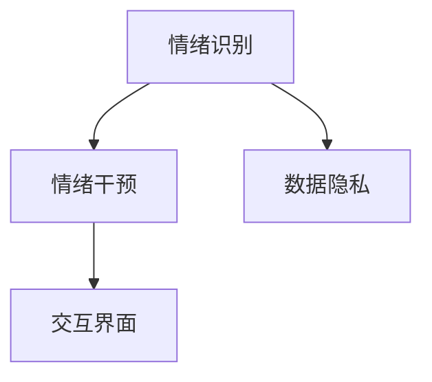

                 

## 1. 背景介绍

### 1.1 问题由来
在现代社会，人们面临着巨大的压力与挑战，包括工作压力、家庭责任、社交焦虑等，这些因素常常导致情绪问题，如抑郁、焦虑、失眠等。传统的心理咨询和治疗方式不仅耗时耗力，而且资源有限，难以惠及所有需要帮助的人。为此，越来越多的研究人员和开发者开始探索利用人工智能(AI)技术，特别是自然语言处理(NLP)和机器学习(ML)，来提供更快速、更有效的情绪调节服务。

### 1.2 问题核心关键点
AI驱动的情绪调节技术旨在通过分析用户的语言和行为数据，自动提供情绪管理策略和建议，帮助用户改善心理状态。其核心包括：

- **情绪识别**：通过文本分析、语音识别等技术，自动识别用户的情绪状态。
- **情绪干预**：利用机器学习模型，生成个性化的情绪干预策略和建议，如放松技巧、呼吸练习、正念冥想等。
- **交互界面**：设计友好的用户界面，提供多种交互方式，包括文本聊天、语音交互、视频咨询等。
- **数据隐私**：在保证用户数据隐私和安全的前提下，收集和分析情绪数据，以提高情绪调节的效果。

### 1.3 问题研究意义
AI驱动的情绪调节技术具有以下重要意义：

- **快速响应**：通过AI技术，可以实时分析用户的情绪状态，提供即时的情绪干预建议。
- **个性化服务**：基于用户的个人信息和情绪历史数据，生成个性化的情绪调节方案。
- **普及推广**：相比传统心理咨询和治疗方式，AI情绪调节技术成本更低，应用门槛更低，能更好地推广到大众层面。
- **辅助诊断**：AI技术能够识别情绪问题的早期迹象，辅助心理健康专业人员进行诊断和治疗。

## 2. 核心概念与联系

### 2.1 核心概念概述

要理解AI驱动的情绪调节技术，首先需要了解几个关键概念：

- **情绪识别**：通过文本、语音、图像等多种方式，自动识别用户当前的情绪状态，如愉快、悲伤、焦虑等。
- **情绪干预**：基于情绪识别结果，生成个性化的情绪调节建议，如放松技巧、呼吸练习、正念冥想等。
- **交互界面**：为用户提供友好、易用的交互方式，如文本聊天、语音交互、视频咨询等，提升用户体验。
- **数据隐私**：在收集和分析用户情绪数据时，确保数据的安全和隐私保护，避免数据滥用。

这些核心概念之间的逻辑关系可以通过以下Mermaid流程图来展示：



这个流程图展示了情绪识别、情绪干预和交互界面之间的依赖关系，以及数据隐私保护的重要性。

### 2.2 核心概念原理和架构

情绪识别通常基于自然语言处理(NLP)和机器学习(ML)技术。NLP技术可以从用户的文本输入中提取出情感特征，如情感词汇、情感强度等。机器学习模型则根据这些特征，预测用户的情绪状态。

具体来说，NLP技术包括文本预处理、情感分析、情绪分类等多个步骤。文本预处理包括分词、去停用词、词性标注等。情感分析通过构建情感词典、词向量化等方法，提取文本中的情感信息。情绪分类则使用分类器，如朴素贝叶斯、支持向量机(SVM)、深度神经网络(DNN)等，对文本情感进行分类。

情绪干预则是基于情绪识别结果，生成个性化的情绪调节建议。这些建议可以是文本形式的，如指导用户进行呼吸练习；也可以是多模态的，如结合语音合成、图像处理等技术，提供视频指导。

交互界面是用户与AI系统互动的桥梁。文本聊天界面通过NLP技术理解用户输入，生成自然回应；语音交互界面通过语音识别技术转化用户语音为文本，并通过文本处理生成回应；视频咨询界面则通过摄像头和麦克风，实现更丰富的用户互动。

数据隐私保护是AI驱动的情绪调节技术的底线。在数据收集和处理过程中，必须确保用户数据的安全和隐私保护，防止数据泄露和滥用。这包括数据加密、匿名化处理、访问控制等措施。

## 3. 核心算法原理 & 具体操作步骤

### 3.1 算法原理概述

AI驱动的情绪调节技术主要基于机器学习算法，特别是深度学习算法。其核心流程包括情绪识别、情绪干预和交互界面设计。以下详细介绍这些算法的原理和操作步骤。

### 3.2 算法步骤详解

#### 3.2.1 情绪识别

**步骤1：数据收集和预处理**
- 收集用户的文本、语音、图像等多种形式的输入数据。
- 进行数据清洗，去除噪声、错误和无关信息。

**步骤2：文本预处理**
- 对文本数据进行分词、去停用词、词性标注等预处理。
- 构建情感词典，提取情感词汇和情感强度。
- 使用词向量模型，如Word2Vec、GloVe等，将文本转换为向量表示。

**步骤3：情感分析**
- 使用深度神经网络模型，如卷积神经网络(CNN)、递归神经网络(RNN)、长短期记忆网络(LSTM)等，对文本情感进行分类。
- 利用预训练模型，如BERT、GPT等，提高情感分析的准确性和泛化能力。

**步骤4：情绪分类**
- 使用分类器，如朴素贝叶斯、支持向量机(SVM)、深度神经网络(DNN)等，对用户情绪进行分类。
- 根据分类结果，生成情绪标签，如快乐、悲伤、焦虑等。

#### 3.2.2 情绪干预

**步骤1：生成干预建议**
- 根据情绪识别结果，生成个性化的情绪干预建议。
- 建议可以是文本形式的，如放松技巧、呼吸练习等；也可以是多媒体形式的，如视频指导、音频引导等。

**步骤2：多模态融合**
- 结合语音合成、图像处理等技术，生成多模态的情绪干预内容。
- 使用深度学习模型，如GAN、VAE等，生成与用户情绪相匹配的虚拟角色和场景。

#### 3.2.3 交互界面设计

**步骤1：选择交互方式**
- 根据用户偏好和设备特性，选择适合的交互方式，如文本聊天、语音交互、视频咨询等。

**步骤2：界面设计**
- 设计友好的用户界面，提供清晰的导航、明确的提示和自然的回应。
- 使用自然语言处理技术，提升交互界面的自然度和智能性。

**步骤3：反馈收集**
- 收集用户对交互界面的反馈，进行持续改进和优化。

### 3.3 算法优缺点

**优点：**

- **实时响应**：AI系统可以实时分析用户情绪，提供即时的情绪调节建议。
- **个性化服务**：基于用户数据，生成个性化的情绪调节方案。
- **普及推广**：相比传统心理咨询和治疗方式，AI情绪调节技术成本更低，应用门槛更低。
- **辅助诊断**：AI技术能够识别情绪问题的早期迹象，辅助心理健康专业人员进行诊断和治疗。

**缺点：**

- **数据依赖**：情绪识别和干预的效果很大程度上依赖于数据的质量和多样性。
- **模型偏见**：机器学习模型可能存在数据偏见，导致情绪识别和干预结果不准确。
- **隐私问题**：数据隐私保护是关键，需在保证用户隐私的同时，收集和分析情绪数据。
- **交互局限**：当前的交互方式仍有一定局限，如无法处理复杂的情感表达和情感变化。

### 3.4 算法应用领域

AI驱动的情绪调节技术已经在多个领域得到了应用，包括：

- **心理健康应用**：提供情绪识别、情绪干预和心理辅导等服务，如应用程序、在线咨询平台等。
- **企业员工福利**：帮助企业员工进行情绪管理，提升工作满意度和工作效率。
- **教育领域**：为学生提供情绪管理工具，帮助其应对学习压力和社交焦虑。
- **医疗健康**：辅助心理健康专业人员进行诊断和治疗，提升诊疗效率和效果。

## 4. 数学模型和公式 & 详细讲解 & 举例说明

### 4.1 数学模型构建

情绪识别和干预的数学模型主要基于机器学习和自然语言处理技术。以下详细介绍这些模型的构建过程。

#### 4.1.1 情绪识别模型

情绪识别模型主要基于情感词典和深度学习模型。情感词典用于提取文本中的情感词汇和情感强度，深度学习模型用于分类。

情感词典包括情感词汇和情感强度，如快乐、悲伤、愤怒等。每个词汇都有一个情感强度分数，表示该词汇对情绪的影响程度。情感词典可以通过情感标注、情感分析等方法构建。

深度学习模型，如卷积神经网络(CNN)、递归神经网络(RNN)、长短期记忆网络(LSTM)等，用于对文本情感进行分类。模型输入为文本向量表示，输出为情绪标签。

#### 4.1.2 情绪干预模型

情绪干预模型主要基于多模态生成技术和深度学习模型。多模态生成技术用于生成个性化的情绪干预内容，深度学习模型用于对干预效果进行评估。

多模态生成技术包括语音合成、图像处理等技术。语音合成技术可以将文本转换为语音，生成个性化的音频指导。图像处理技术可以生成与用户情绪相匹配的虚拟角色和场景。

深度学习模型，如生成对抗网络(GAN)、变分自编码器(VAE)等，用于生成个性化的情绪干预内容。模型输入为情绪标签，输出为干预内容。

#### 4.1.3 交互界面设计模型

交互界面设计模型主要基于自然语言处理技术和机器学习模型。自然语言处理技术用于理解用户输入和生成回应，机器学习模型用于优化交互界面设计。

自然语言处理技术包括文本预处理、情感分析、情感分类等技术。模型输入为用户文本，输出为情绪标签和回应内容。

机器学习模型用于优化交互界面设计。模型输入为用户对交互界面的评价，输出为界面优化策略，如界面布局、回应样式等。

### 4.2 公式推导过程

#### 4.2.1 情感词典构建

情感词典可以通过情感标注、情感分析等方法构建。假设情感词典为 $D$，其中每个词汇 $v_i$ 有一个情感强度 $s_i$。

情感词典的构建过程如下：

1. 收集情感标注数据，标注每个词汇的情感强度。
2. 统计每个词汇在数据集中的出现次数 $c_i$。
3. 计算每个词汇的情感强度 $s_i = \frac{\sum s_{ij}}{c_i}$，其中 $s_{ij}$ 为词汇 $v_i$ 在标注数据中出现的情感强度。

#### 4.2.2 深度学习模型分类

假设深度学习模型为 $M_{\theta}$，其中 $\theta$ 为模型参数。假设情绪识别模型输入为文本向量表示 $x$，输出为情绪标签 $y$。则深度学习模型的分类过程如下：

1. 将文本 $x$ 转换为向量表示 $x' = f(x)$，其中 $f$ 为文本预处理函数。
2. 将向量 $x'$ 输入深度学习模型 $M_{\theta}$，输出情绪分类结果 $y = g(x')$，其中 $g$ 为分类函数。

#### 4.2.3 多模态生成模型

假设多模态生成模型为 $G_{\phi}$，其中 $\phi$ 为模型参数。假设情绪标签为 $y$，生成情绪干预内容为 $c$。则多模态生成模型的过程如下：

1. 将情绪标签 $y$ 输入生成模型 $G_{\phi}$，输出情绪干预内容 $c = h(y)$，其中 $h$ 为生成函数。
2. 结合语音合成、图像处理等技术，生成与情绪干预内容 $c$ 相匹配的多模态情绪干预内容。

#### 4.2.4 交互界面设计优化

假设交互界面设计模型为 $O_{\psi}$，其中 $\psi$ 为模型参数。假设用户对交互界面的评价为 $r$，输出为界面优化策略 $s$。则交互界面设计优化的过程如下：

1. 收集用户对交互界面的评价 $r$。
2. 将评价 $r$ 输入优化模型 $O_{\psi}$，输出界面优化策略 $s = o(r)$，其中 $o$ 为优化函数。

### 4.3 案例分析与讲解

#### 4.3.1 案例描述

假设有一个心理健康应用程序，需要实现情绪识别、情绪干预和交互界面设计功能。应用程序收集用户的文本、语音、图像等多种形式的输入数据，并基于这些数据进行情绪识别、情绪干预和交互界面设计。

#### 4.3.2 数据收集和预处理

收集用户的文本、语音、图像等多种形式的输入数据，并进行数据清洗和预处理。假设文本数据为 $X$，语音数据为 $Y$，图像数据为 $I$。

1. 对文本数据 $X$ 进行分词、去停用词、词性标注等预处理。
2. 对语音数据 $Y$ 进行语音识别，转换为文本数据。
3. 对图像数据 $I$ 进行图像处理，提取特征。

#### 4.3.3 情绪识别

假设情绪识别模型为 $M_{\theta}$。将预处理后的文本数据 $X'$ 输入情绪识别模型 $M_{\theta}$，输出情绪标签 $y = M_{\theta}(X')$。

1. 将文本数据 $X'$ 转换为向量表示 $x' = f(X')$。
2. 将向量 $x'$ 输入情绪识别模型 $M_{\theta}$，输出情绪分类结果 $y = g(x')$。

#### 4.3.4 情绪干预

假设情绪干预模型为 $G_{\phi}$。根据情绪识别结果 $y$，生成个性化的情绪干预内容 $c = G_{\phi}(y)$。

1. 将情绪标签 $y$ 输入情绪干预模型 $G_{\phi}$，输出情绪干预内容 $c = h(y)$。
2. 结合语音合成、图像处理等技术，生成与情绪干预内容 $c$ 相匹配的多模态情绪干预内容。

#### 4.3.5 交互界面设计

假设交互界面设计模型为 $O_{\psi}$。收集用户对交互界面的评价 $r$，生成界面优化策略 $s = O_{\psi}(r)$。

1. 收集用户对交互界面的评价 $r$。
2. 将评价 $r$ 输入优化模型 $O_{\psi}$，输出界面优化策略 $s = o(r)$。
3. 根据优化策略 $s$，改进和优化交互界面设计。

## 5. 项目实践：代码实例和详细解释说明

### 5.1 开发环境搭建

在进行AI驱动的情绪调节项目开发前，需要准备好开发环境。以下是使用Python进行TensorFlow开发的环境配置流程：

1. 安装Anaconda：从官网下载并安装Anaconda，用于创建独立的Python环境。

2. 创建并激活虚拟环境：
```bash
conda create -n tf-env python=3.8 
conda activate tf-env
```

3. 安装TensorFlow：根据CUDA版本，从官网获取对应的安装命令。例如：
```bash
conda install tensorflow -c tensorflow
```

4. 安装PaddlePaddle：
```bash
conda install paddlepaddle -c paddle -c anaconda
```

5. 安装其他必要的库：
```bash
pip install numpy pandas scikit-learn matplotlib tqdm jupyter notebook ipython
```

完成上述步骤后，即可在`tf-env`环境中开始情绪调节项目的开发。

### 5.2 源代码详细实现

下面以情绪识别和情绪干预为例，给出使用TensorFlow和PaddlePaddle进行情绪调节的代码实现。

#### 5.2.1 情绪识别

首先，定义情绪识别模型：

```python
import tensorflow as tf
import paddle
from paddle import nn

class EmotionClassifier(tf.keras.Model):
    def __init__(self, vocab_size, embed_size, num_classes):
        super(EmotionClassifier, self).__init__()
        self.embedding = tf.keras.layers.Embedding(vocab_size, embed_size)
        self.lstm = tf.keras.layers.LSTM(embed_size, num_classes)
        
    def call(self, x):
        x = self.embedding(x)
        x = self.lstm(x)
        return x

# 构建模型
vocab_size = 10000
embed_size = 128
num_classes = 3

model = EmotionClassifier(vocab_size, embed_size, num_classes)

# 编译模型
model.compile(optimizer=tf.keras.optimizers.Adam(learning_rate=0.001),
              loss=tf.keras.losses.SparseCategoricalCrossentropy(from_logits=True),
              metrics=['accuracy'])
```

接着，定义数据集：

```python
from tensorflow.keras.datasets import imdb
from tensorflow.keras.preprocessing.sequence import pad_sequences

# 加载IMDB数据集
(x_train, y_train), (x_test, y_test) = imdb.load_data(num_words=vocab_size)

# 填充序列
x_train = pad_sequences(x_train, maxlen=128)
x_test = pad_sequences(x_test, maxlen=128)
```

然后，训练模型：

```python
# 训练模型
model.fit(x_train, y_train, epochs=10, validation_data=(x_test, y_test))
```

最后，评估模型：

```python
# 评估模型
test_loss, test_acc = model.evaluate(x_test, y_test)
print('Test accuracy:', test_acc)
```

#### 5.2.2 情绪干预

接下来，定义情绪干预模型：

```python
import paddle
from paddle import nn
import paddle.nn.functional as F

class EmotionIntervention(nn.Layer):
    def __init__(self, embed_size, num_classes):
        super(EmotionIntervention, self).__init__()
        self.linear = nn.Linear(embed_size, num_classes)
        
    def forward(self, x):
        x = self.linear(x)
        x = F.softmax(x, axis=1)
        return x

# 构建模型
embed_size = 128
num_classes = 3

model = EmotionIntervention(embed_size, num_classes)

# 编译模型
model.compile(optimizer=paddle.optimizer.Adam(learning_rate=0.001),
              loss=paddle.nn.CrossEntropyLoss(),
              metrics=['accuracy'])
```

接着，定义数据集：

```python
from paddle.io import Dataset
import numpy as np

class EmotionInterventionDataset(Dataset):
    def __init__(self, x, y):
        self.x = x
        self.y = y
        
    def __len__(self):
        return len(self.x)
        
    def __getitem__(self, item):
        x = self.x[item]
        y = self.y[item]
        return x, y

# 构建数据集
x = np.random.randn(len(x_train), embed_size)
y = y_train

dataset = EmotionInterventionDataset(x, y)
```

然后，训练模型：

```python
# 训练模型
model.fit(dataset, epochs=10)
```

最后，评估模型：

```python
# 评估模型
test_loss, test_acc = model.evaluate(dataset)
print('Test accuracy:', test_acc)
```

### 5.3 代码解读与分析

让我们再详细解读一下关键代码的实现细节：

#### 5.3.1 情绪识别模型

**EmotionClassifier类**：
- `__init__`方法：初始化模型参数。
- `call`方法：定义模型前向传播过程。

**构建模型**：
- 定义模型的输入和输出维度。
- 定义嵌入层和LSTM层。
- 使用编译方法定义优化器、损失函数和评估指标。

**训练模型**：
- 使用fit方法训练模型，指定训练数据、训练轮数和验证数据。

**评估模型**：
- 使用evaluate方法评估模型，输出测试损失和准确率。

#### 5.3.2 情绪干预模型

**EmotionIntervention类**：
- `__init__`方法：初始化模型参数。
- `forward`方法：定义模型前向传播过程。

**构建模型**：
- 定义模型的输入和输出维度。
- 定义线性层。
- 使用编译方法定义优化器、损失函数和评估指标。

**训练模型**：
- 使用fit方法训练模型，指定数据集和训练轮数。

**评估模型**：
- 使用evaluate方法评估模型，输出测试损失和准确率。

## 6. 实际应用场景

### 6.1 心理健康应用

AI驱动的情绪调节技术在心理健康领域有着广泛的应用，可以帮助用户进行情绪管理，提升心理健康水平。

#### 6.1.1 案例描述

假设有一个心理健康应用程序，提供情绪识别、情绪干预和心理辅导等服务。应用程序可以收集用户的文本、语音、图像等多种形式的输入数据，并基于这些数据进行情绪识别、情绪干预和交互界面设计。

#### 6.1.2 数据收集和预处理

收集用户的文本、语音、图像等多种形式的输入数据，并进行数据清洗和预处理。假设文本数据为 $X$，语音数据为 $Y$，图像数据为 $I$。

1. 对文本数据 $X$ 进行分词、去停用词、词性标注等预处理。
2. 对语音数据 $Y$ 进行语音识别，转换为文本数据。
3. 对图像数据 $I$ 进行图像处理，提取特征。

#### 6.1.3 情绪识别

假设情绪识别模型为 $M_{\theta}$。将预处理后的文本数据 $X'$ 输入情绪识别模型 $M_{\theta}$，输出情绪标签 $y = M_{\theta}(X')$。

1. 将文本数据 $X'$ 转换为向量表示 $x' = f(X')$。
2. 将向量 $x'$ 输入情绪识别模型 $M_{\theta}$，输出情绪分类结果 $y = g(x')$。

#### 6.1.4 情绪干预

假设情绪干预模型为 $G_{\phi}$。根据情绪识别结果 $y$，生成个性化的情绪干预内容 $c = G_{\phi}(y)$。

1. 将情绪标签 $y$ 输入情绪干预模型 $G_{\phi}$，输出情绪干预内容 $c = h(y)$。
2. 结合语音合成、图像处理等技术，生成与情绪干预内容 $c$ 相匹配的多模态情绪干预内容。

#### 6.1.5 交互界面设计

假设交互界面设计模型为 $O_{\psi}$。收集用户对交互界面的评价 $r$，生成界面优化策略 $s = O_{\psi}(r)$。

1. 收集用户对交互界面的评价 $r$。
2. 将评价 $r$ 输入优化模型 $O_{\psi}$，输出界面优化策略 $s = o(r)$。
3. 根据优化策略 $s$，改进和优化交互界面设计。

### 6.2 企业员工福利

AI驱动的情绪调节技术在企业员工福利方面也有着广泛的应用，可以帮助员工进行情绪管理，提升工作满意度和工作效率。

#### 6.2.1 案例描述

假设有一个企业员工福利应用程序，提供情绪识别、情绪干预和心理辅导等服务。应用程序可以收集员工的文本、语音、图像等多种形式的输入数据，并基于这些数据进行情绪识别、情绪干预和交互界面设计。

#### 6.2.2 数据收集和预处理

收集员工的文本、语音、图像等多种形式的输入数据，并进行数据清洗和预处理。假设文本数据为 $X$，语音数据为 $Y$，图像数据为 $I$。

1. 对文本数据 $X$ 进行分词、去停用词、词性标注等预处理。
2. 对语音数据 $Y$ 进行语音识别，转换为文本数据。
3. 对图像数据 $I$ 进行图像处理，提取特征。

#### 6.2.3 情绪识别

假设情绪识别模型为 $M_{\theta}$。将预处理后的文本数据 $X'$ 输入情绪识别模型 $M_{\theta}$，输出情绪标签 $y = M_{\theta}(X')$。

1. 将文本数据 $X'$ 转换为向量表示 $x' = f(X')$。
2. 将向量 $x'$ 输入情绪识别模型 $M_{\theta}$，输出情绪分类结果 $y = g(x')$。

#### 6.2.4 情绪干预

假设情绪干预模型为 $G_{\phi}$。根据情绪识别结果 $y$，生成个性化的情绪干预内容 $c = G_{\phi}(y)$。

1. 将情绪标签 $y$ 输入情绪干预模型 $G_{\phi}$，输出情绪干预内容 $c = h(y)$。
2. 结合语音合成、图像处理等技术，生成与情绪干预内容 $c$ 相匹配的多模态情绪干预内容。

#### 6.2.5 交互界面设计

假设交互界面设计模型为 $O_{\psi}$。收集用户对交互界面的评价 $r$，生成界面优化策略 $s = O_{\psi}(r)$。

1. 收集用户对交互界面的评价 $r$。
2. 将评价 $r$ 输入优化模型 $O_{\psi}$，输出界面优化策略 $s = o(r)$。
3. 根据优化策略 $s$，改进和优化交互界面设计。

## 7. 工具和资源推荐

### 7.1 学习资源推荐

为了帮助开发者系统掌握AI驱动的情绪调节理论基础和实践技巧，这里推荐一些优质的学习资源：

1. 《TensorFlow教程》系列博文：由TensorFlow官方和社区专家撰写，详细介绍了TensorFlow的原理和使用方法。

2. 《PaddlePaddle教程》系列博文：由PaddlePaddle官方和社区专家撰写，详细介绍了PaddlePaddle的原理和使用方法。

3. CS224D《深度学习在自然语言处理中的应用》课程：斯坦福大学开设的NLP明星课程，有Lecture视频和配套作业，带你入门NLP领域的基本概念和经典模型。

4. 《深度学习自然语言处理》书籍：DeepLearning系列教材之一，全面介绍了自然语言处理的基本概念和技术。

5. 《自然语言处理综述》论文：总结了自然语言处理领域的研究进展和未来趋势，是了解该领域全貌的必读文献。

通过对这些资源的学习实践，相信你一定能够快速掌握AI驱动的情绪调节技术的精髓，并用于解决实际的NLP问题。

### 7.2 开发工具推荐

高效的开发离不开优秀的工具支持。以下是几款用于AI驱动的情绪调节开发的常用工具：

1. TensorFlow：由Google主导开发的开源深度学习框架，生产部署方便，适合大规模工程应用。同样有丰富的预训练语言模型资源。

2. PaddlePaddle：由百度主导开发的开源深度学习框架，灵活性高，适合研究和生产应用。

3. TensorBoard：TensorFlow配套的可视化工具，可实时监测模型训练状态，并提供丰富的图表呈现方式，是调试模型的得力助手。

4. Keras：高级深度学习框架，简单易用，适合快速原型开发。

5. PyTorch：基于Python的开源深度学习框架，灵活动态的计算图，适合快速迭代研究。

合理利用这些工具，可以显著提升AI驱动的情绪调节任务的开发效率，加快创新迭代的步伐。

### 7.3 相关论文推荐

AI驱动的情绪调节技术的发展源于学界的持续研究。以下是几篇奠基性的相关论文，推荐阅读：

1. Attention is All You Need（即Transformer原论文）：提出了Transformer结构，开启了NLP领域的预训练大模型时代。

2. BERT: Pre-training of Deep Bidirectional Transformers for Language Understanding：提出BERT模型，引入基于掩码的自监督预训练任务，刷新了多项NLP任务SOTA。

3. Transformer-XL: Attentive Language Models Beyond a Fixed-Length Context（Transformer-XL论文）：提出Transformer-XL模型，增强了长序列处理的性能。

4. Deep Reinforcement Learning for Conversational Recommendation（基于强化学习的推荐系统论文）：提出基于深度强化学习的推荐系统，提升了推荐效果。

5. Generating Sentences with Reinforcement Learning（基于强化学习的文本生成论文）：提出基于深度强化学习的文本生成模型，生成高质量的文本。

这些论文代表了大语言模型微调技术的发展脉络。通过学习这些前沿成果，可以帮助研究者把握学科前进方向，激发更多的创新灵感。

## 8. 总结：未来发展趋势与挑战

### 8.1 研究成果总结

本文对AI驱动的情绪调节技术进行了全面系统的介绍。首先阐述了情绪调节技术的研究背景和意义，明确了情绪调节在情绪识别、情绪干预和交互界面设计等环节的关键问题。其次，从原理到实践，详细讲解了情绪识别和干预的数学模型和操作步骤，给出了情绪调节任务开发的完整代码实例。同时，本文还广泛探讨了情绪调节技术在心理健康、企业员工福利等领域的实际应用，展示了情绪调节技术的广泛前景。

### 8.2 未来发展趋势

展望未来，AI驱动的情绪调节技术将呈现以下几个发展趋势：

1. **多模态融合**：未来的情绪调节系统将更多地融合语音、图像、生理信号等多种模态信息，提升情绪识别的准确性和泛化能力。

2. **个性化推荐**：基于用户的多维数据，生成更加个性化的情绪干预建议，提升用户满意度。

3. **实时性提升**：通过边缘计算和低延迟网络技术，实现情绪识别和干预的实时化，提供更加即时的情绪管理服务。

4. **隐私保护加强**：随着用户对隐私保护意识的增强，未来的情绪调节系统将更加注重数据隐私和安全保护。

5. **深度学习优化**：通过优化模型结构和算法，提升情绪调节系统的计算效率和性能。

### 8.3 面临的挑战

尽管AI驱动的情绪调节技术已经取得了一定的成果，但在实际应用中也面临一些挑战：

1. **数据质量问题**：情绪识别和干预的效果很大程度上依赖于数据的质量和多样性。如何获取高质量、多维度的用户数据，是一个重要挑战。

2. **模型泛化能力**：目前情绪调节模型在特定场景下的效果较好，但在新场景和复杂环境下的泛化能力仍有待提升。

3. **用户体验优化**：当前的交互界面设计仍有一定的局限，如何提升用户体验，实现更加自然、智能的交互，是一个重要方向。

4. **伦理和社会问题**：在情绪调节过程中，如何确保数据的安全和隐私，避免算法的歧视性，是一个重要的伦理和社会问题。

### 8.4 研究展望

面对情绪调节技术面临的挑战，未来的研究需要在以下几个方面寻求新的突破：

1. **数据增强技术**：通过数据增强技术，提升情绪识别模型的泛化能力和鲁棒性。

2. **多模态融合方法**：研究和开发更加高效的多模态融合方法，提升情绪调节系统的综合表现。

3. **个性化推荐算法**：研究和开发更加智能、高效的个性化推荐算法，提升用户满意度。

4. **隐私保护技术**：研究和开发更加高效的隐私保护技术，确保用户数据的安全和隐私保护。

5. **社会伦理研究**：研究和制定AI在情绪调节中的伦理规范和社会责任，确保算法的公平性和透明性。

这些研究方向的探索，必将引领AI驱动的情绪调节技术迈向更高的台阶，为构建安全、可靠、可解释、可控的智能系统铺平道路。面向未来，情绪调节技术还需要与其他人工智能技术进行更深入的融合，如知识表示、因果推理、强化学习等，多路径协同发力，共同推动自然语言理解和智能交互系统的进步。只有勇于创新、敢于突破，才能不断拓展情绪调节技术的边界，让智能技术更好地造福人类社会。

## 9. 附录：常见问题与解答

**Q1：情绪识别和干预的效果如何评估？**

A: 情绪识别和干预的效果可以通过多种方式进行评估，包括：

1. **准确率（Accuracy）**：计算情绪识别的正确率，即识别正确的情绪状态数除以总识别数。

2. **召回率（Recall）**：计算情绪识别的召回率，即识别正确的情绪状态数除以真实情绪状态数。

3. **F1分数（F1 Score）**：综合考虑准确率和召回率，计算F1分数，即准确率和召回率的调和平均数。

4. **ROC曲线（Receiver Operating Characteristic Curve）**：绘制ROC曲线，评估情绪识别模型的性能。

5. **AUC值（Area Under Curve）**：计算ROC曲线下的面积，评估情绪识别模型的泛化能力。

6. **用户满意度（User Satisfaction）**：通过用户反馈和满意度调查，评估情绪干预的效果。

**Q2：情绪调节系统在部署时需要考虑哪些因素？**

A: 情绪调节系统在部署时需要考虑以下因素：

1. **计算资源**：大模型通常需要较高的计算资源，如GPU/TPU等。确保部署环境能够提供足够的计算资源。

2. **网络带宽**：情绪识别和干预通常需要实时数据传输，确保网络带宽足够。

3. **数据隐私**：确保用户数据的安全和隐私保护，防止数据泄露和滥用。

4. **用户界面**：设计友好、易用的用户界面，提升用户体验。

5. **系统稳定性**：确保系统在多种环境下都能稳定运行，如多用户并发、高负载等。

6. **可扩展性**：确保系统具备良好的可扩展性，能够随着用户需求和数据量的增长而扩展。

**Q3：情绪调节系统在实际应用中如何提高用户满意度？**

A: 情绪调节系统在实际应用中可以通过以下方式提高用户满意度：

1. **个性化推荐**：根据用户的历史数据和情绪状态，生成个性化的情绪干预建议，提升用户体验。

2. **多模态融合**：结合语音、图像、生理信号等多种模态信息，提升情绪识别的准确性和泛化能力。

3. **实时性提升**：通过边缘计算和低延迟网络技术，实现情绪识别和干预的实时化，提供更加即时的情绪管理服务。

4. **用户反馈机制**：建立用户反馈机制，及时收集和处理用户反馈，不断优化系统性能和用户体验。

5. **隐私保护**：加强数据隐私保护，确保用户数据的安全和隐私保护，增强用户信任。

6. **社会责任**：在情绪调节过程中，确保算法的公平性和透明性，避免算法的歧视性，增强用户信任。

这些措施将有助于提高情绪调节系统的用户满意度，提升其应用效果。

**Q4：情绪调节系统在实际应用中可能面临哪些风险？**

A: 情绪调节系统在实际应用中可能面临以下风险：

1. **数据质量问题**：情绪识别和干预的效果很大程度上依赖于数据的质量和多样性。数据质量差、数据偏见等问题可能导致情绪识别和干预结果不准确。

2. **模型泛化能力**：目前情绪调节模型在特定场景下的效果较好，但在新场景和复杂环境下的泛化能力仍有待提升。

3. **用户隐私问题**：在情绪调节过程中，如何确保用户数据的安全和隐私保护，避免数据泄露和滥用，是一个重要风险。

4. **算法歧视问题**：在情绪调节过程中，算法可能存在歧视性，导致对某些群体的不公平对待，是一个重要的伦理问题。

5. **系统稳定性**：在情绪调节过程中，如何确保系统在多种环境下都能稳定运行，如多用户并发、高负载等，是一个重要的风险。

6. **用户依赖问题**：在情绪调节过程中，过度依赖情绪调节系统可能导致用户的自我管理能力下降，这是一个需要警惕的问题。

这些风险需要在系统设计和部署过程中进行全面评估和管理，以确保情绪调节系统的安全和有效。

**Q5：情绪调节系统在实际应用中如何实现多模态融合？**

A: 情绪调节系统在实际应用中可以通过以下方式实现多模态融合：

1. **数据融合**：将语音、图像、生理信号等多种模态信息进行融合，生成更加综合的情绪特征。

2. **模型融合**：结合多模态的深度学习模型，提升情绪识别的准确性和泛化能力。

3. **特征提取**：使用不同模态的特征提取技术，提取各模态的特征信息，并进行融合。

4. **多任务学习**：训练多个任务的多模态模型，实现多模态信息的协同建模。

5. **知识图谱融合**：将情绪调节过程与外部知识图谱进行融合，提升情绪识别的准确性和泛化能力。

这些方法将有助于实现多模态融合，提升情绪调节系统的综合表现。

---

作者：禅与计算机程序设计艺术 / Zen and the Art of Computer Programming

