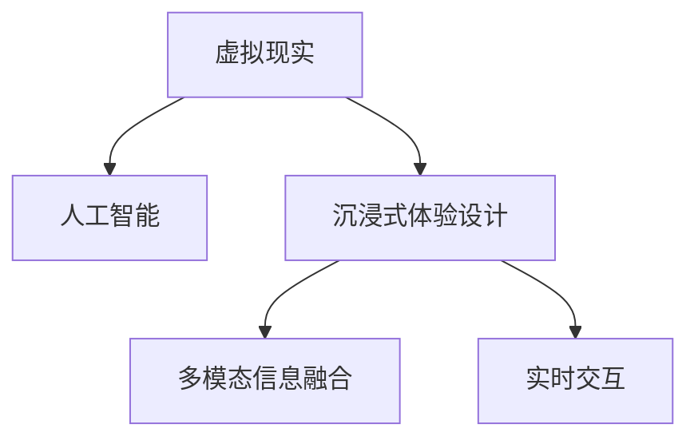

                 

# 虚拟现实叙事：AI驱动的沉浸式体验设计

## 1. 背景介绍

### 1.1 问题由来
随着技术的进步，虚拟现实（Virtual Reality, VR）技术正在逐步融入人们的日常生活，从游戏、影视到教育、医疗等多个领域均展示了其巨大的潜力。然而，当前大部分VR体验仍然依赖用户与物理世界的互动，难以提供真正沉浸式的叙事体验。人工智能（AI）作为推动技术革新的重要力量，其驱动的沉浸式体验设计正逐步成为VR领域的一大热门话题。

### 1.2 问题核心关键点
沉浸式体验设计的核心在于利用AI技术，通过多模态信息融合、实时交互等方式，使用户能够更自然地沉浸于虚拟世界之中，与虚拟对象进行互动。人工智能不仅能够预测用户行为，还可以根据用户的反馈实时调整虚拟环境，从而实现更自然、个性化的互动体验。

## 2. 核心概念与联系

### 2.1 核心概念概述

为更好地理解AI驱动的沉浸式体验设计，本节将介绍几个关键概念：

- 虚拟现实(VR)：一种通过计算机模拟真实世界的3D环境，让用户能够沉浸于其中进行交互的技术。
- 人工智能(AI)：一种使计算机系统模拟人类智能行为的技术，包括机器学习、自然语言处理、计算机视觉等。
- 沉浸式体验设计：一种通过多模态交互、环境感知等方式，使用户能够完全沉浸于虚拟世界之中的设计理念。
- 多模态信息融合：通过融合视觉、听觉、触觉等多种感官信息，实现更丰富的用户体验。
- 实时交互：通过感知用户行为和反馈，实时调整虚拟环境，提供更自然、流畅的互动体验。

这些概念之间的逻辑关系可以通过以下Mermaid流程图来展示：



这个流程图展示了这个技术生态系统的核心概念及其之间的关系：

1. 虚拟现实技术提供了沉浸式的环境，为AI驱动的沉浸式体验设计提供了基础。
2. 人工智能技术，尤其是深度学习和大规模预训练模型，为多模态信息融合和实时交互提供了可能。
3. 沉浸式体验设计理念，通过融合AI技术和多模态信息，为用户提供了更自然、流畅的虚拟互动体验。

## 3. 核心算法原理 & 具体操作步骤
### 3.1 算法原理概述

AI驱动的沉浸式体验设计，本质上是一种基于多模态信息融合和实时交互的AI应用范式。其核心思想是：利用深度学习等AI技术，通过对用户的多模态数据（如语音、手势、表情等）进行感知和理解，生成个性化的虚拟环境，并根据用户的反馈进行实时调整。

形式化地，假设VR环境中的虚拟对象为 $O=\{O_i\}_{i=1}^N$，其中 $O_i$ 表示第 $i$ 个虚拟对象。假设用户的多模态数据为 $X=\{x_i\}_{i=1}^N$，其中 $x_i$ 表示第 $i$ 个用户的当前状态。设计者希望通过AI算法 $f$ 将 $X$ 映射到 $O$ 的生成过程，即 $f: X \rightarrow O$。

为了实现个性化的沉浸式体验，AI算法需要：
1. 感知用户的多模态数据 $X$，并提取关键特征。
2. 根据用户特征 $X$，生成合适的虚拟对象 $O$。
3. 实时感知用户反馈 $Y$，并根据反馈调整 $O$。

### 3.2 算法步骤详解

AI驱动的沉浸式体验设计通常包括以下几个关键步骤：

**Step 1: 数据收集与预处理**
- 收集用户的多模态数据，如语音信号、手势动作、面部表情等，并进行预处理和归一化。
- 将多模态数据转换为模型能够处理的形式，如将语音转换为声学特征，将手势转换为关键点坐标等。

**Step 2: 多模态数据融合**
- 对不同模态的数据进行特征提取和融合，形成一个综合性的用户状态向量 $X$。
- 使用深度学习模型（如CNN、RNN等）对 $X$ 进行编码，提取高层次的用户特征。

**Step 3: 虚拟对象生成**
- 根据用户特征 $X$，使用生成对抗网络（GAN）、变分自编码器（VAE）等生成模型，生成合适的虚拟对象 $O$。
- 对生成的 $O$ 进行后处理，如纹理着色、光照调整等，提升其真实性。

**Step 4: 实时交互**
- 将生成的 $O$ 渲染到VR环境中，并在其中嵌入交互逻辑。
- 实时感知用户的行为和反馈，如按键、手势、眼动等，并根据反馈实时调整 $O$。
- 对于语音交互，可以将语音信号输入到文本生成模型，生成自然语言回答，再通过语音合成器进行输出。

**Step 5: 用户反馈与优化**
- 设计合适的用户反馈机制，如按键反馈、视觉反馈、触觉反馈等，增强用户体验。
- 根据用户反馈，调整虚拟对象的属性和行为，优化沉浸式体验。
- 使用强化学习等优化算法，根据用户反馈不断优化AI模型。

以上是AI驱动的沉浸式体验设计的一般流程。在实际应用中，还需要针对具体任务的特点，对各环节进行优化设计，如改进用户反馈机制、引入更多的交互逻辑等，以进一步提升用户体验。

### 3.3 算法优缺点

AI驱动的沉浸式体验设计具有以下优点：
1. 个性化体验：通过多模态数据的融合，能够生成高度个性化的虚拟环境，满足用户的个性化需求。
2. 实时互动：通过实时感知用户反馈，并根据反馈调整虚拟环境，提供流畅的互动体验。
3. 沉浸感强：结合虚拟现实技术，使用户能够完全沉浸于虚拟世界之中。
4. 可扩展性强：随着AI技术和VR技术的进步，沉浸式体验设计将具备更强的可扩展性。

同时，该方法也存在一定的局限性：
1. 计算资源要求高：生成虚拟对象和实时交互需要大量的计算资源。
2. 数据隐私风险：多模态数据的收集和处理可能涉及用户隐私，需要谨慎处理。
3. 模型复杂度高：融合多模态数据和生成虚拟对象的过程较为复杂，需要高效的AI算法支持。
4. 用户体验依赖多模态数据的准确性：如果多模态数据的采集和处理不准确，将直接影响用户体验。

尽管存在这些局限性，但就目前而言，AI驱动的沉浸式体验设计仍是大有潜力的技术方向。未来相关研究的重点在于如何进一步降低计算成本，提高数据隐私保护，增强AI模型的可解释性，同时兼顾用户体验和模型复杂性等因素。

### 3.4 算法应用领域

AI驱动的沉浸式体验设计已经在多个领域得到了应用，涵盖了游戏、影视、教育、医疗等多个方向，展示了其在不同场景中的潜力：

- 游戏：通过AI驱动的虚拟角色，实现更自然、个性化的游戏体验。如《星巴克VR》中的虚拟员工，可以根据用户的行为和反馈实时调整服务方式。
- 影视：通过AI技术，将虚拟角色与真实演员进行互动，创造更具沉浸感的电影。如《1917》中的AI驱动角色，可以根据观众的表情实时调整剧情走向。
- 教育：通过AI生成的虚拟教师和实验设备，为学生提供互动式学习体验。如微软的HoloLens，利用AI技术进行物理和化学实验模拟。
- 医疗：通过AI生成的虚拟医生和手术设备，辅助医生进行手术规划和治疗决策。如手术模拟器中的虚拟病人和手术工具。
- 训练模拟：通过AI生成的虚拟场景和任务，提供更加安全、经济的训练环境。如军事训练中的虚拟战场和敌情。

除了上述这些经典应用外，AI驱动的沉浸式体验设计还在虚拟旅行、虚拟办公室、虚拟博物馆等更多场景中得到了创新性应用，为各行各业带来了全新的可能。

## 4. 数学模型和公式 & 详细讲解 & 举例说明

### 4.1 数学模型构建

本节将使用数学语言对AI驱动的沉浸式体验设计过程进行更加严格的刻画。

假设用户的多模态数据 $X=\{x_i\}_{i=1}^N$ 包括语音信号 $x_{v_i}$、手势动作 $x_{h_i}$、面部表情 $x_{e_i}$ 等。设计者希望通过AI算法 $f$ 将 $X$ 映射到虚拟对象 $O=\{O_i\}_{i=1}^N$。

定义用户特征向量为 $X_{feat} = [x_{v_1}, x_{h_1}, x_{e_1}, \dots, x_{v_N}, x_{h_N}, x_{e_N}] \in \mathbb{R}^{3DN}$，其中 $N$ 表示用户数据个数。

### 4.2 公式推导过程

为了将 $X_{feat}$ 映射到 $O$，我们可以使用生成对抗网络（GAN）的架构。GAN由生成器 $G$ 和判别器 $D$ 两部分组成，其中生成器 $G$ 负责生成虚拟对象 $O$，判别器 $D$ 负责评估 $O$ 的真实性。

假设生成器的输入为 $X_{feat}$，输出为虚拟对象 $O$，即 $G: X_{feat} \rightarrow O$。判别器的输入为真实对象 $O_{real}$ 和生成对象 $O_{fake}$，输出为判别结果 $D(O_{real}, O_{fake})$，即 $D: (O_{real}, O_{fake}) \rightarrow [0,1]$。

GAN的目标是最小化生成器的损失函数 $L_G$ 和判别器的损失函数 $L_D$：

$$
L_G = \mathbb{E}_{X_{feat}} [D(G(X_{feat}))] - \mathbb{E}_{O_{real}} [D(O_{real})]
$$

$$
L_D = \mathbb{E}_{O_{real}} [D(O_{real})] + \mathbb{E}_{X_{feat}} [D(G(X_{feat}))] - 1
$$

其中 $\mathbb{E}[\cdot]$ 表示期望值，$O_{real}$ 表示真实对象。

为了优化 $G$ 和 $D$，通常使用反向传播算法和梯度下降法。通过迭代训练，生成器 $G$ 能够生成更逼真的虚拟对象 $O$，判别器 $D$ 能够更准确地评估 $O$ 的真实性。

### 4.3 案例分析与讲解

以一个简单的虚拟角色生成案例为例，分析GAN在AI驱动的沉浸式体验设计中的应用。

假设用户的多模态数据 $X_{feat}$ 包括语音信号和面部表情。设计者希望生成一个虚拟角色，使其能够根据用户的语音和表情进行互动。

1. 收集并预处理用户的多模态数据 $X_{feat}$。
2. 将 $X_{feat}$ 输入到生成器 $G$，生成虚拟角色 $O_{fake}$。
3. 将 $O_{fake}$ 渲染到VR环境中，并在其中嵌入交互逻辑。
4. 实时感知用户的语音信号和面部表情，调整虚拟角色的行为和对话。

以《星巴克VR》为例，系统通过收集用户的语音和表情数据，生成虚拟员工，使其能够根据用户的情绪和需求提供个性化的服务。用户可以与虚拟员工进行对话，订购咖啡，享受便捷的虚拟购物体验。

## 5. 项目实践：代码实例和详细解释说明
### 5.1 开发环境搭建

在进行AI驱动的沉浸式体验设计实践前，我们需要准备好开发环境。以下是使用Python进行TensorFlow开发的环境配置流程：

1. 安装Anaconda：从官网下载并安装Anaconda，用于创建独立的Python环境。

2. 创建并激活虚拟环境：
```bash
conda create -n tf-env python=3.8 
conda activate tf-env
```

3. 安装TensorFlow：根据CUDA版本，从官网获取对应的安装命令。例如：
```bash
conda install tensorflow tensorflow-gpu=2.6 -c conda-forge -c pytorch
```

4. 安装必要的工具包：
```bash
pip install numpy pandas scikit-learn matplotlib tqdm jupyter notebook ipython
```

完成上述步骤后，即可在`tf-env`环境中开始项目实践。

### 5.2 源代码详细实现

这里我们以一个简单的虚拟角色生成案例为例，给出使用TensorFlow实现GAN的代码。

首先，定义GAN的生成器和判别器：

```python
import tensorflow as tf
from tensorflow.keras.layers import Input, Dense, Flatten, Reshape
from tensorflow.keras.models import Model

# 生成器
def generator(input_shape):
    inputs = Input(shape=(input_shape[0], input_shape[1]))
    x = Dense(256)(inputs)
    x = tf.keras.layers.LeakyReLU(alpha=0.2)(x)
    x = Dense(128)(x)
    x = tf.keras.layers.LeakyReLU(alpha=0.2)(x)
    x = Dense(3, activation='tanh')(x)
    return Model(inputs, x)

# 判别器
def discriminator(input_shape):
    inputs = Input(shape=input_shape)
    x = Flatten()(inputs)
    x = Dense(128)(x)
    x = tf.keras.layers.LeakyReLU(alpha=0.2)(x)
    x = Dense(1, activation='sigmoid')(x)
    return Model(inputs, x)
```

然后，构建GAN模型：

```python
# 定义输入层
inputs = Input(shape=(3, 3))

# 生成器
generated = generator(inputs)

# 判别器
real = discriminator([3, 3])

# GAN模型
combined = discriminator(generated)
gan = Model(inputs, combined)

# 编译模型
gan.compile(loss='binary_crossentropy', optimizer='adam', metrics=['accuracy'])
```

最后，训练GAN模型：

```python
# 定义训练函数
def train_model(model, input_shape, epochs=100, batch_size=32):
    # 构建数据生成器
    def generator_func():
        while True:
            data = np.random.normal(0, 1, (batch_size, input_shape[0], input_shape[1]))
            labels = np.random.randint(2, size=(batch_size, 1))
            yield data, labels
    
    # 训练模型
    model.fit_generator(generator_func, steps_per_epoch=100, epochs=epochs)
```

通过这个简单的代码示例，我们可以实现一个基础的GAN模型，用于生成虚拟角色。

### 5.3 代码解读与分析

让我们再详细解读一下关键代码的实现细节：

**生成器和判别器的定义**：
- 生成器将输入的多模态数据 $X_{feat}$ 转换为虚拟对象 $O$，使用LeakyReLU激活函数来增强非线性表达能力。
- 判别器将真实对象 $O_{real}$ 和生成对象 $O_{fake}$ 输入，输出一个0-1之间的判别结果，使用sigmoid激活函数进行二分类。

**GAN模型的构建**：
- 将生成器 $G$ 的输出 $O_{fake}$ 输入到判别器 $D$，输出判别结果 $D(O_{fake})$。
- 使用binary_crossentropy作为损失函数，adam作为优化器，准确率作为评价指标。

**训练函数的定义**：
- 使用numpy生成随机数据和标签，模拟生成器和判别器的训练过程。
- 通过fit_generator方法进行模型训练，每次迭代生成一个batch大小的数据和标签。

## 6. 实际应用场景
### 6.1 虚拟现实游戏
AI驱动的沉浸式体验设计在游戏领域的应用，如《星巴克VR》所示，将虚拟角色与真实用户进行互动，增强游戏的趣味性和沉浸感。通过AI算法，游戏能够根据用户的情绪和行为，实时调整虚拟角色的行为和对话，提供更加个性化的游戏体验。

### 6.2 虚拟培训模拟
在虚拟培训模拟中，AI生成的虚拟场景和任务，可以提供更加安全、经济的培训环境。如医学模拟训练中的虚拟病人和手术工具，能够帮助医学生进行无风险的临床操作训练。通过AI实时感知用户的互动和反馈，调整虚拟环境的复杂度，帮助学生逐步掌握相关技能。

### 6.3 虚拟旅游
AI生成的虚拟旅游场景，能够提供更加真实、个性化的旅游体验。通过AI算法，系统能够根据用户的喜好和偏好，生成个性化的旅游路线和景点介绍。用户可以与虚拟导游进行互动，探索不同的旅游地点，享受沉浸式的旅行体验。

### 6.4 未来应用展望
随着AI技术和VR技术的进步，AI驱动的沉浸式体验设计将具备更强的可扩展性和应用前景。未来，AI将能够生成更加逼真、多样化的虚拟对象，提供更加丰富、自然的互动体验。同时，AI驱动的沉浸式体验设计还将拓展到更多的领域，如虚拟办公室、虚拟博物馆等，为各行各业带来新的可能。

## 7. 工具和资源推荐
### 7.1 学习资源推荐

为了帮助开发者系统掌握AI驱动的沉浸式体验设计的理论基础和实践技巧，这里推荐一些优质的学习资源：

1. 《生成对抗网络》系列书籍：详细介绍了GAN的基本原理和应用，适合初学者入门。
2. TensorFlow官方文档：提供了丰富的TensorFlow代码示例和文档，是进行深度学习项目开发的必备资料。
3. NVIDIA DeepLearning SDK：提供了GPU加速的深度学习框架，支持多种深度学习算法和模型。
4. Coursera《Deep Learning Specialization》课程：由深度学习领域专家Andrew Ng教授主讲，涵盖深度学习的基础和高级内容。
5. Udacity《Deep Reinforcement Learning Nanodegree》课程：介绍了强化学习的基本原理和应用，适合对AI驱动的沉浸式体验设计感兴趣的学习者。

通过对这些资源的学习实践，相信你一定能够快速掌握AI驱动的沉浸式体验设计的精髓，并用于解决实际的NLP问题。
###  7.2 开发工具推荐

高效的开发离不开优秀的工具支持。以下是几款用于AI驱动的沉浸式体验设计的常用工具：

1. TensorFlow：基于Python的开源深度学习框架，灵活动态的计算图，适合快速迭代研究。大部分深度学习模型都有TensorFlow版本的实现。
2. PyTorch：基于Python的开源深度学习框架，灵活性高，支持动态计算图。
3. NVIDIA CUDA：NVIDIA提供的GPU加速开发平台，支持高效的深度学习算法和模型。
4. Unity：流行的游戏开发引擎，支持多平台部署和VR应用开发。
5. Unreal Engine：另一款流行的游戏开发引擎，支持更加复杂的场景和物理模拟。

合理利用这些工具，可以显著提升AI驱动的沉浸式体验设计的开发效率，加快创新迭代的步伐。

### 7.3 相关论文推荐

AI驱动的沉浸式体验设计领域的研究已经取得了诸多进展，以下是几篇奠基性的相关论文，推荐阅读：

1. Generative Adversarial Nets（即GAN原论文）：提出了生成对抗网络的概念，为虚拟对象生成提供了基础。
2. Progressive Growing of GANs for Improved Quality, Stability, and Variation：提出逐步生成的方法，提高GAN的生成质量。
3. Face Editing Using Cycle-consistent Adversarial Networks：介绍GAN在人脸编辑中的应用，展示了其在图像生成领域的强大能力。
4. GAN for Motion-based Super-Resolution of Human Video：将GAN应用于视频超分辨率，实现了高清晰度的视频生成。
5. Playing Atari with Deep Reinforcement Learning：利用强化学习结合GAN，实现了AI在视频游戏中的应用。

这些论文代表了大模型微调技术的发展脉络。通过学习这些前沿成果，可以帮助研究者把握学科前进方向，激发更多的创新灵感。

## 8. 总结：未来发展趋势与挑战
### 8.1 总结

本文对AI驱动的沉浸式体验设计方法进行了全面系统的介绍。首先阐述了AI驱动的沉浸式体验设计的背景和意义，明确了其在大语言模型微调中的应用前景。其次，从原理到实践，详细讲解了AI驱动的沉浸式体验设计的数学原理和关键步骤，给出了AI驱动的沉浸式体验设计任务开发的完整代码实例。同时，本文还广泛探讨了AI驱动的沉浸式体验设计在虚拟现实游戏、虚拟培训模拟、虚拟旅游等多个领域的应用前景，展示了其广阔的应用前景。最后，本文精选了AI驱动的沉浸式体验设计的各类学习资源，力求为读者提供全方位的技术指引。

通过本文的系统梳理，可以看到，AI驱动的沉浸式体验设计正逐步成为虚拟现实技术的重要应用方向，极大地拓展了虚拟现实系统的表现力和交互性。未来的AI驱动的沉浸式体验设计将通过深度学习和多模态信息融合，提供更加丰富、自然的用户体验，推动虚拟现实技术的普及和应用。

### 8.2 未来发展趋势

展望未来，AI驱动的沉浸式体验设计将呈现以下几个发展趋势：

1. 多模态融合技术将进一步提升沉浸感：通过融合更多的传感器数据，如气味、触觉等，增强用户对虚拟世界的感知能力。
2. 实时交互技术将更加自然流畅：通过更先进的自然语言处理和视觉识别技术，实现更加自然流畅的语音和视觉交互。
3. 高分辨率虚拟对象生成将实现：随着算力提升，GAN等生成模型将能够生成更加逼真、多样的虚拟对象，提供更丰富的用户体验。
4. 智能化虚拟角色设计将普及：通过增强AI算法的智能性，使虚拟角色具备更强的自主决策能力和互动能力，提升用户体验。
5. 跨平台跨设备集成将增强便携性：将AI驱动的沉浸式体验设计集成到各类移动设备和平台，提升其在各种场景中的可用性。

这些趋势将进一步拓展AI驱动的沉浸式体验设计的应用边界，提升用户体验，推动虚拟现实技术的发展。

### 8.3 面临的挑战

尽管AI驱动的沉浸式体验设计已经取得了显著进展，但在迈向更加智能化、普适化应用的过程中，它仍面临诸多挑战：

1. 计算资源需求高：生成高质量虚拟对象和实时交互需要大量的计算资源，如何提升算力是一个重要问题。
2. 数据隐私保护：多模态数据的收集和处理涉及用户隐私，如何在保证数据安全的同时，提升用户体验。
3. 模型复杂度高：多模态数据的融合和生成虚拟对象的过程较为复杂，需要高效的AI算法支持。
4. 用户体验依赖多模态数据的准确性：如果多模态数据的采集和处理不准确，将直接影响用户体验。
5. 人工智能伦理问题：AI算法的决策过程难以解释，可能出现偏见和不公平，需要加强算法的可解释性和公平性。

这些挑战需要学界和产业界共同努力，通过不断优化AI算法和设备硬件，提升用户体验和数据安全，才能使AI驱动的沉浸式体验设计迈向成熟和普及。

### 8.4 研究展望

面对AI驱动的沉浸式体验设计所面临的挑战，未来的研究需要在以下几个方面寻求新的突破：

1. 研究多模态数据融合的新方法：如何更高效、准确地融合视觉、听觉、触觉等数据，提升用户体验。
2. 开发更加智能化的虚拟角色：通过增强AI算法的智能性，使虚拟角色具备更强的自主决策能力和互动能力，提升用户体验。
3. 探索新的虚拟对象生成方法：除了GAN，是否存在其他更加高效、可靠的生成方法，值得深入研究。
4. 提升算法的可解释性和公平性：如何使AI算法的决策过程更加透明、可解释，提升算法的公平性和可信度。
5. 探索跨平台跨设备集成的新方式：如何使AI驱动的沉浸式体验设计在各种设备和平台上兼容和运行。

这些研究方向的探索，必将引领AI驱动的沉浸式体验设计技术迈向更高的台阶，为虚拟现实技术的发展带来新的突破。

## 9. 附录：常见问题与解答

**Q1：AI驱动的沉浸式体验设计是否适用于所有VR场景？**

A: AI驱动的沉浸式体验设计主要适用于需要高度交互、实时响应的场景。对于一些静态、纯展示型的VR应用，如虚拟展览，AI驱动的沉浸式体验设计可能效果有限。

**Q2：如何保证多模态数据的准确性和一致性？**

A: 多模态数据的准确性和一致性是AI驱动的沉浸式体验设计的基础。可以通过优化数据采集设备和传感器，提升数据的准确性。同时，需要在数据预处理和融合阶段，进行去噪和归一化处理，确保数据的可靠性和一致性。

**Q3：AI驱动的沉浸式体验设计是否需要大量的标注数据？**

A: 相对于传统的机器学习任务，AI驱动的沉浸式体验设计对标注数据的需求较少。只需要收集用户的多模态数据和部分标注信息，即可进行训练和优化。

**Q4：如何提升AI驱动的沉浸式体验设计的实时性？**

A: 实时性是AI驱动的沉浸式体验设计的关键。可以通过优化模型结构和算法，提升模型的推理速度。同时，通过硬件加速（如GPU、TPU等），减少计算时间，提升实时性。

**Q5：AI驱动的沉浸式体验设计是否可以跨平台跨设备集成？**

A: 目前的AI驱动的沉浸式体验设计，在跨平台跨设备集成方面仍有一定挑战。需要解决不同平台间的兼容性问题，以及设备的硬件资源差异问题。但随着技术的进步，这些问题有望逐步得到解决。

---

作者：禅与计算机程序设计艺术 / Zen and the Art of Computer Programming

