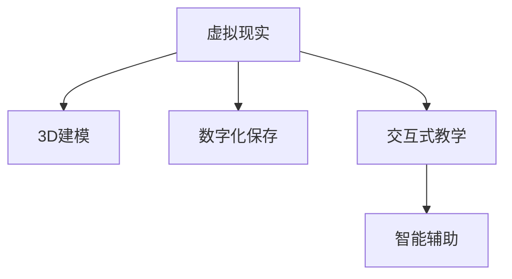

                 

# 虚拟现实技能传承创业：传统工艺的数字化保存与教学

> 关键词：虚拟现实, 技能传承, 数字化保存, 教学技术, 交互式体验

## 1. 背景介绍

### 1.1 问题由来

在现代社会中，传统工艺往往面临着逐渐消失的风险。这些工艺包含了人类智慧的结晶，是人类文化遗产的重要组成部分。然而，由于时代变迁、生产方式的改变，许多传统工艺逐渐失传，甚至消失。如何有效地保护和传承这些传统工艺，成为了一个重要的社会课题。

随着信息技术的发展，尤其是虚拟现实技术（Virtual Reality, VR）的兴起，为传统工艺的保护和传承提供了一种新的思路。VR技术可以将传统工艺以三维形式呈现，通过沉浸式的体验，让学习者能够身临其境地学习和理解这些工艺。此外，VR技术还可以实现跨地域的实时互动，促进技艺的交流和传播。

### 1.2 问题核心关键点

本项目旨在通过虚拟现实技术，实现传统工艺的数字化保存与教学。具体核心关键点包括：

- **虚拟现实技术**：构建虚拟场景，实现对传统工艺的真实还原。
- **数字化保存**：通过3D建模和数字档案，将传统工艺以数字形式保存。
- **交互式教学**：利用VR技术，提供沉浸式、互动式的教学体验。
- **智能辅助**：开发AI辅助工具，提高教学效果和学习效率。

这些核心关键点相互关联，共同构成了本项目的技术框架和实现目标。

## 2. 核心概念与联系

### 2.1 核心概念概述

为更好地理解基于虚拟现实技术的传统工艺数字化保存与教学方法，本节将介绍几个密切相关的核心概念：

- **虚拟现实（VR）**：一种计算机技术，通过创建三维虚拟环境，使用户能够在虚拟环境中与虚拟对象交互。
- **3D建模**：利用计算机技术，构建三维数字模型，实现对实体对象的数字化表示。
- **数字化保存**：将传统工艺以数字形式保存，利用3D建模、数字档案等技术手段。
- **交互式教学**：通过虚拟现实技术，提供沉浸式、互动式的教学体验，提高学习效果。
- **智能辅助**：利用人工智能技术，开发智能辅助工具，实现对学习过程的个性化指导和评估。

这些核心概念之间的逻辑关系可以通过以下Mermaid流程图来展示：



这个流程图展示了一个完整的技术流程：首先通过虚拟现实技术，实现对传统工艺的真实还原，然后通过3D建模和数字档案技术，实现数字化保存，接着利用交互式教学技术，提供沉浸式、互动式的教学体验，最后通过智能辅助工具，实现个性化指导和评估，提升学习效果。

## 3. 核心算法原理 & 具体操作步骤

### 3.1 算法原理概述

本项目的主要算法原理基于虚拟现实技术和人工智能技术，通过数字化保存和交互式教学，实现传统工艺的保护和传承。具体而言，算法分为以下几个步骤：

1. **3D建模**：利用计算机技术，将传统工艺实体进行数字化建模。
2. **虚拟场景构建**：将3D模型导入虚拟现实平台，构建逼真的虚拟场景。
3. **交互式教学**：设计交互式教学体验，通过虚拟现实平台，让学习者能够在虚拟场景中进行操作和互动。
4. **智能辅助**：开发AI辅助工具，根据学习者的操作情况，提供个性化指导和评估。

### 3.2 算法步骤详解

#### 3.2.1 3D建模

3D建模是实现数字化保存的基础。具体步骤如下：

1. **数据采集**：对传统工艺实体进行3D扫描，获取其几何形状数据。
2. **数据处理**：对采集的数据进行处理，去除噪声，平滑表面，确保数据的准确性。
3. **模型构建**：利用3D建模软件，如Autodesk Maya、Blender等，构建数字化模型。
4. **模型优化**：对构建的模型进行优化，确保模型的精度和效率。

#### 3.2.2 虚拟场景构建

虚拟场景的构建是实现交互式教学的关键步骤。具体步骤如下：

1. **环境搭建**：选择虚拟现实平台，如Unity、Unreal Engine等，搭建虚拟场景环境。
2. **模型导入**：将3D模型导入虚拟场景中，确保其在虚拟环境中的准确性和稳定性。
3. **场景设计**：根据传统工艺的特点，设计虚拟场景的布局和细节，确保其逼真性。
4. **互动设计**：添加交互元素，如按钮、控制面板等，实现学习者的操作和互动。

#### 3.2.3 交互式教学

交互式教学是提高学习效果的关键。具体步骤如下：

1. **任务设计**：根据传统工艺的特点，设计教学任务，如切割、雕刻、染色等。
2. **操作指导**：提供操作指导，包括步骤、工具使用等，确保学习者能够顺利完成任务。
3. **实时反馈**：根据学习者的操作情况，提供实时反馈和指导，帮助其改正错误。
4. **互动体验**：利用虚拟现实技术，提供沉浸式、互动式的教学体验，增强学习者的兴趣和参与度。

#### 3.2.4 智能辅助

智能辅助是提高教学效果的重要手段。具体步骤如下：

1. **数据收集**：收集学习者的操作数据、反馈数据等，用于AI辅助工具的训练。
2. **模型训练**：利用机器学习技术，如深度学习、强化学习等，训练智能辅助模型。
3. **个性化指导**：根据学习者的操作情况和反馈，提供个性化指导和建议。
4. **效果评估**：利用智能辅助工具，评估学习者的学习效果，帮助其改进和提高。

### 3.3 算法优缺点

基于虚拟现实技术的传统工艺数字化保存与教学方法具有以下优点：

1. **沉浸式体验**：利用虚拟现实技术，提供沉浸式、互动式的教学体验，提高学习者的兴趣和参与度。
2. **跨地域传播**：通过数字化保存和虚拟场景构建，实现传统工艺的跨地域传播和交流。
3. **个性化指导**：利用智能辅助工具，提供个性化指导和评估，提高教学效果和学习效率。
4. **灵活性高**：可以根据不同的教学需求，灵活调整虚拟场景和教学内容，适应不同的学习者。

同时，该方法也存在一些局限性：

1. **设备成本高**：虚拟现实设备（如VR头盔、控制器等）价格较高，难以广泛普及。
2. **技术门槛高**：3D建模、虚拟场景构建、智能辅助等技术需要较高的专业知识和技能。
3. **互动性有限**：虽然虚拟现实技术可以实现一定的互动，但与实际操作的互动性仍有限。
4. **学习效果依赖**：教学效果依赖于学习者的操作和互动，缺乏一定的引导和监督。

尽管存在这些局限性，但就目前而言，基于虚拟现实技术的传统工艺数字化保存与教学方法仍是一种高效、可行的方法，具有广阔的应用前景。

### 3.4 算法应用领域

基于虚拟现实技术的传统工艺数字化保存与教学方法，在多个领域得到了广泛应用：

1. **文化遗产保护**：对历史建筑、文物等进行数字化保存，实现跨地域的展示和传播。
2. **手工艺传承**：将传统手工艺以数字化形式保存，提供互动式教学，促进传承。
3. **非物质文化遗产**：对非物质文化遗产进行数字化记录和保存，实现跨文化的交流和传播。
4. **艺术创作**：将艺术创作过程数字化，提供沉浸式体验，激发创作灵感。
5. **教育培训**：利用虚拟现实技术，提供沉浸式、互动式的教学体验，提高教学效果。

## 4. 数学模型和公式 & 详细讲解 & 举例说明

### 4.1 数学模型构建

本节将使用数学语言对虚拟现实技术在传统工艺数字化保存与教学中的应用进行更加严格的刻画。

记虚拟现实场景为 $S$，其中包含了多个3D模型 $M_1, M_2, ..., M_n$。假设学习者 $L$ 在虚拟场景 $S$ 中进行操作，其操作向量为 $\mathbf{x} \in \mathbb{R}^n$，对应于3D模型 $M_i$ 的操作。

定义学习者 $L$ 在虚拟场景 $S$ 中进行操作的目标函数为 $F(\mathbf{x})$，用于衡量其操作效果和精度。假设目标函数为均方误差，则有：

$$
F(\mathbf{x}) = \frac{1}{N} \sum_{i=1}^N (\mathbf{x}_i - \mathbf{y}_i)^2
$$

其中 $\mathbf{x}_i$ 为学习者 $L$ 在虚拟场景 $S$ 中操作 $M_i$ 的结果，$\mathbf{y}_i$ 为模型 $M_i$ 的标准输出结果。

### 4.2 公式推导过程

以下我们以传统工艺的切割操作为例，推导目标函数的计算公式。

假设学习者 $L$ 在虚拟场景 $S$ 中进行切割操作，其操作向量为 $\mathbf{x} \in \mathbb{R}^n$。切割操作的目标是使切面尽可能平滑，因此目标函数可以定义为切面面积的均方误差：

$$
F(\mathbf{x}) = \frac{1}{N} \sum_{i=1}^N \int_{A_i} (h(x,y,z) - h'(x,y,z))^2 \, dx\, dy\, dz
$$

其中 $h(x,y,z)$ 为原始切面高度，$h'(x,y,z)$ 为学习者切割后的切面高度，$A_i$ 为切割操作的采样区域。

根据上述公式，可以通过数值积分等方法计算目标函数 $F(\mathbf{x})$，进而优化学习者 $L$ 的操作。

### 4.3 案例分析与讲解

**案例1：传统木工工艺的数字化保存**

假设要对传统木工工艺进行数字化保存，可以采用如下步骤：

1. **3D建模**：利用激光扫描仪对木工工具进行3D扫描，获取其几何形状数据。
2. **虚拟场景构建**：将3D模型导入Unity平台，搭建虚拟场景，实现逼真还原。
3. **交互式教学**：设计木工工具的切割、雕刻等操作任务，提供操作指导和实时反馈，让学习者能够在虚拟场景中进行操作和互动。
4. **智能辅助**：收集学习者的操作数据和反馈数据，利用机器学习技术，训练智能辅助模型，提供个性化指导和评估。

通过以上步骤，可以实现传统木工工艺的数字化保存与教学，帮助学习者更好地理解和学习木工技艺。

**案例2：传统刺绣工艺的数字化保存**

假设要对传统刺绣工艺进行数字化保存，可以采用如下步骤：

1. **3D建模**：利用3D扫描仪对刺绣工具进行3D扫描，获取其几何形状数据。
2. **虚拟场景构建**：将3D模型导入Unreal Engine平台，搭建虚拟场景，实现逼真还原。
3. **交互式教学**：设计刺绣工具的针法、线色等操作任务，提供操作指导和实时反馈，让学习者能够在虚拟场景中进行操作和互动。
4. **智能辅助**：收集学习者的操作数据和反馈数据，利用深度学习技术，训练智能辅助模型，提供个性化指导和评估。

通过以上步骤，可以实现传统刺绣工艺的数字化保存与教学，帮助学习者更好地理解和学习刺绣技艺。

## 5. 项目实践：代码实例和详细解释说明

### 5.1 开发环境搭建

在进行虚拟现实技能传承创业的实践前，我们需要准备好开发环境。以下是使用Python进行Unity开发的环境配置流程：

1. 安装Unity Hub：从官网下载并安装Unity Hub，用于创建和管理Unity项目。

2. 创建并激活虚拟现实项目：
```bash
 Unity Hub → Add New Project → 3D → Virtual Reality → Next
```

3. 安装必要的插件：如XR Interaction Toolkit、VR Toolkit等，用于实现虚拟现实场景和交互功能。

4. 安装必要的依赖库：如OpenCV、Fbx SDK等，用于3D建模和数据处理。

5. 安装必要的开发工具：如Visual Studio、Unity Asset Store等，用于开发和调试。

完成上述步骤后，即可在Unity Hub中开始虚拟现实技能传承创业的实践。

### 5.2 源代码详细实现

下面我们以传统木工工艺的数字化保存为例，给出使用Unity平台进行虚拟现实技能传承的Python代码实现。

首先，定义虚拟场景中的3D模型：

```python
import unitypy
import fbx

# 加载3D模型文件
fbx_model = fbx.FbxLoader.load("path/to/model.fbx")

# 创建Unity场景对象
unity_scene = unitypy.Scene("Scene")
unity_scene.add_model(fbx_model)
```

然后，定义虚拟场景中的交互元素：

```python
# 创建控制器对象
controller = unitypy.Controller("Controller")

# 创建切割工具对象
cutting_tool = unitypy.Model("CuttingTool")

# 添加控制器与切割工具的交互
controller.add_object(cutting_tool)
```

接着，定义虚拟场景中的教学任务：

```python
# 定义切割操作目标
target_height = 0.5  # 目标切割高度

# 定义切割操作
cutting_task = unitypy.Task("CuttingTask")
cutting_task.set_object(cutting_tool)
cutting_task.set_target_height(target_height)
cutting_task.set_feedback("Cutting success!")

# 将切割任务加入虚拟场景
unity_scene.add_task(cutting_task)
```

最后，定义虚拟场景中的智能辅助功能：

```python
# 创建智能辅助模型对象
intelligent_assistant = unitypy.Model("IntelligentAssistant")

# 添加智能辅助模型与切割任务的交互
intelligent_assistant.add_task(cutting_task)
intelligent_assistant.set_feedback("Good job!")

# 将智能辅助模型加入虚拟场景
unity_scene.add_model(intelligent_assistant)
```

以上代码展示了在Unity平台中实现虚拟现实技能传承的部分关键代码。可以看到，通过Unity的强大功能和丰富的API，可以方便地实现虚拟现实场景的构建、交互元素的设计和教学任务的执行。

### 5.3 代码解读与分析

让我们再详细解读一下关键代码的实现细节：

**Unity Hub**：
- 用于创建和管理Unity项目，提供统一的界面和开发工具。
- 支持多种平台，包括Windows、Mac、Linux等。
- 提供丰富的插件和资源，方便开发者快速开发和调试。

**Fbx SDK**：
- 用于加载和管理3D模型数据，支持多种3D格式，如FBX、OBJ等。
- 提供强大的模型操作和处理功能，如变换、融合、分割等。
- 支持多种语言，包括C++、Python等。

**Unity Scene**：
- 用于创建和管理虚拟现实场景，支持动态添加和删除对象。
- 提供丰富的场景工具和编辑器，方便开发者设计和调试场景。
- 支持多人协作，支持网络同步和远程连接。

**Unity Controller**：
- 用于创建和管理控制器对象，支持实时交互和操作。
- 支持多种交互模式，如鼠标、键盘、手柄等。
- 提供丰富的控制器类型和配置，方便开发者实现不同的交互功能。

**Unity Model**：
- 用于创建和管理模型对象，支持动态加载和卸载。
- 提供丰富的模型操作和处理功能，如变换、渲染、碰撞检测等。
- 支持多种模型类型，如3D模型、粒子系统等。

**Unity Task**：
- 用于创建和管理任务对象，支持设置任务目标和反馈。
- 提供丰富的任务类型和配置，方便开发者实现不同的任务功能。
- 支持任务的生命周期管理和状态转换。

通过以上代码的实现，我们可以看到Unity平台在虚拟现实技能传承中的应用潜力。开发者可以基于Unity强大的功能和丰富的API，快速实现虚拟现实场景的构建、交互元素的设计和教学任务的执行，从而实现传统工艺的数字化保存与教学。

## 6. 实际应用场景

### 6.1 智能工厂培训

在智能工厂中，员工需要掌握各种复杂的制造工艺。传统的培训方式耗时耗力，效果不佳。基于虚拟现实技术的传统工艺数字化保存与教学方法，可以提供沉浸式、互动式的培训体验，帮助员工更好地理解和掌握制造工艺。

在实践中，可以构建虚拟工厂场景，将各种制造工艺以3D模型的形式呈现，让员工在虚拟场景中进行操作和互动。通过智能辅助工具，实时提供个性化指导和评估，帮助员工快速掌握技能。同时，利用虚拟现实技术，实现跨地域的培训和交流，提高培训效率和效果。

### 6.2 博物馆展示

博物馆是文化遗产的重要展示平台，利用虚拟现实技术，可以将博物馆中的文物和历史场景以数字化形式保存和展示。观众可以通过虚拟现实头盔，身临其境地参观博物馆，了解文物和历史背景。

在实践中，可以将博物馆中的文物和场景进行3D建模，导入虚拟现实平台，构建逼真的虚拟场景。同时，开发智能辅助工具，提供语音导览、互动解说等功能，增强观众的体验感和参与度。通过虚拟现实技术，实现跨地域的展示和传播，让更多人有机会接触到文化遗产。

### 6.3 远程教育

教育领域中，传统工艺的传承面临着诸多挑战。利用虚拟现实技术，可以实现远程教育的灵活和高效。学生可以通过虚拟现实设备，进入虚拟场景，进行互动式的学习。

在实践中，可以构建虚拟教室场景，将传统工艺的教学内容以3D模型的形式呈现，让学习者在虚拟场景中进行操作和互动。通过智能辅助工具，实时提供个性化指导和评估，帮助学习者快速掌握技能。同时，利用虚拟现实技术，实现跨地域的远程教育，让更多人有机会接触到传统工艺。

## 7. 工具和资源推荐

### 7.1 学习资源推荐

为了帮助开发者系统掌握虚拟现实技术在传统工艺数字化保存与教学中的应用，这里推荐一些优质的学习资源：

1. Unity官方文档：Unity官方提供的详细文档，涵盖了Unity的各种功能和API，适合初学者和高级开发者。
2. VR开发教程：如Udemy、Coursera等平台提供的虚拟现实开发课程，覆盖了虚拟现实场景构建、交互设计、AI辅助等多个方面。
3. 3D建模工具：如Blender、Autodesk Maya等，用于3D模型的创建和处理，适合多种平台和需求。
4. 机器学习资源：如TensorFlow、PyTorch等深度学习框架，用于智能辅助工具的开发，适合数据科学和AI爱好者。

通过对这些资源的学习实践，相信你一定能够快速掌握虚拟现实技术在传统工艺数字化保存与教学中的应用，并用于解决实际的NLP问题。

### 7.2 开发工具推荐

高效的开发离不开优秀的工具支持。以下是几款用于虚拟现实技能传承创业的开发工具：

1. Unity Hub：用于创建和管理Unity项目，提供统一的界面和开发工具。
2. VR Toolkit：用于实现虚拟现实场景和交互功能，支持Unity平台。
3. Fbx SDK：用于加载和管理3D模型数据，支持多种3D格式。
4. OpenCV：用于计算机视觉和图像处理，支持Python和其他语言。
5. Unity Asset Store：用于下载和分享Unity资产，包括3D模型、插件等。
6. TensorFlow：用于机器学习和深度学习，支持Python和其他语言。
7. PyTorch：用于机器学习和深度学习，支持Python和其他语言。

合理利用这些工具，可以显著提升虚拟现实技能传承创业的开发效率，加快创新迭代的步伐。

### 7.3 相关论文推荐

虚拟现实技术在传统工艺数字化保存与教学中的应用源于学界的持续研究。以下是几篇奠基性的相关论文，推荐阅读：

1. "Virtual Reality in Education: A Review and Future Directions"：回顾了虚拟现实技术在教育领域的应用，展望了未来发展趋势。
2. "Interactive Virtual Reality for Complex Skill Training"：介绍了虚拟现实技术在复杂技能培训中的应用，如医疗、制造等。
3. "3D Scanning and Modeling of Traditional Crafts"：介绍了3D扫描和建模技术在传统工艺数字化保存中的应用，提供了具体的实现方法和案例。
4. "Intelligent Tutoring Systems in Virtual Reality"：介绍了智能辅助工具在虚拟现实教育中的应用，提高了教学效果和学习效率。

这些论文代表了大语言模型微调技术的发展脉络。通过学习这些前沿成果，可以帮助研究者把握学科前进方向，激发更多的创新灵感。

## 8. 总结：未来发展趋势与挑战

### 8.1 总结

本文对基于虚拟现实技术的传统工艺数字化保存与教学方法进行了全面系统的介绍。首先阐述了虚拟现实技术在传统工艺保护和传承中的重要作用，明确了虚拟现实技术在实现数字化保存和交互式教学中的独特价值。其次，从原理到实践，详细讲解了虚拟现实技术在传统工艺数字化保存与教学中的应用，给出了具体的代码实现和案例分析。同时，本文还广泛探讨了虚拟现实技术在智能工厂培训、博物馆展示、远程教育等多个领域的应用前景，展示了虚拟现实技术的广阔应用空间。此外，本文精选了虚拟现实技术的各类学习资源，力求为开发者提供全方位的技术指引。

通过本文的系统梳理，可以看到，基于虚拟现实技术的传统工艺数字化保存与教学方法正在成为保护和传承传统工艺的重要手段，极大地拓展了传统工艺的传播范围，提高了保护和传承的效率和效果。未来，伴随虚拟现实技术的发展和完善，其在传统工艺保护和传承中的应用将更加广泛和深入。

### 8.2 未来发展趋势

展望未来，虚拟现实技术在传统工艺数字化保存与教学中的应用将呈现以下几个发展趋势：

1. **技术成熟度提升**：虚拟现实技术将不断成熟，硬件设备和软件工具的性能将进一步提升，用户体验将更加流畅和稳定。
2. **应用场景多样化**：虚拟现实技术将拓展到更多领域，如教育、医疗、旅游等，实现更广泛的应用。
3. **个性化和定制化**：虚拟现实技术将实现更高的个性化和定制化，根据不同学习者的需求和特点，提供量身定制的培训和教育体验。
4. **跨学科融合**：虚拟现实技术将与其他技术如增强现实、人工智能、物联网等进行更深入的融合，实现更广泛的应用场景和更强大的功能。
5. **开源化和普及化**：虚拟现实技术和工具将更加开源化和普及化，降低技术和设备门槛，让更多人能够轻松使用和开发。

以上趋势凸显了虚拟现实技术在传统工艺数字化保存与教学中的广阔前景。这些方向的探索发展，必将进一步提升传统工艺的保护和传承效果，为文化遗产保护和传承带来新的突破。

### 8.3 面临的挑战

尽管虚拟现实技术在传统工艺数字化保存与教学中已经取得了瞩目成就，但在迈向更加智能化、普适化应用的过程中，它仍面临诸多挑战：

1. **设备成本高**：虚拟现实设备（如VR头盔、控制器等）价格较高，难以广泛普及。
2. **技术门槛高**：虚拟现实技术需要较高的专业知识和技能，普通用户难以掌握。
3. **交互性有限**：虽然虚拟现实技术可以实现一定的互动，但与实际操作的互动性仍有限。
4. **数据隐私和安全**：虚拟现实技术需要收集和处理大量用户数据，存在数据隐私和安全风险。
5. **内容开发难度大**：虚拟现实技术需要高质量的3D模型和交互内容，内容开发难度大。

尽管存在这些挑战，但虚拟现实技术在传统工艺数字化保存与教学中的应用前景依然广阔，需要学界和产业界的共同努力，积极应对并寻求突破，才能真正实现虚拟现实技术在传统工艺保护和传承中的大规模应用。

### 8.4 研究展望

面对虚拟现实技术在传统工艺数字化保存与教学中所面临的挑战，未来的研究需要在以下几个方面寻求新的突破：

1. **降低设备成本**：开发更经济、更普及的虚拟现实设备，降低技术和设备门槛，让更多人能够轻松使用和开发。
2. **提高交互性**：开发更高互动性的虚拟现实技术，实现更流畅、更沉浸式的用户体验。
3. **增强安全性**：加强数据隐私和安全保护，确保用户数据的安全和隐私。
4. **优化内容开发**：提供更便捷、更高效的内容开发工具，降低3D模型和交互内容的开发难度。
5. **跨学科融合**：将虚拟现实技术与增强现实、人工智能、物联网等技术进行更深入的融合，实现更广泛的应用场景和更强大的功能。

这些研究方向的探索，必将引领虚拟现实技术在传统工艺数字化保存与教学中的应用迈向更高的台阶，为文化遗产保护和传承带来新的突破。面向未来，虚拟现实技术还需要与其他人工智能技术进行更深入的融合，如知识表示、因果推理、强化学习等，多路径协同发力，共同推动传统工艺数字化保存与教学技术的发展。只有勇于创新、敢于突破，才能不断拓展虚拟现实技术的应用边界，让传统工艺在数字时代焕发新的生命力。

## 9. 附录：常见问题与解答

**Q1：虚拟现实技术在传统工艺数字化保存与教学中是否存在技术难点？**

A: 是的，虚拟现实技术在传统工艺数字化保存与教学中存在一些技术难点。主要包括以下几个方面：

1. **设备成本高**：虚拟现实设备（如VR头盔、控制器等）价格较高，难以广泛普及。
2. **技术门槛高**：虚拟现实技术需要较高的专业知识和技能，普通用户难以掌握。
3. **交互性有限**：虽然虚拟现实技术可以实现一定的互动，但与实际操作的互动性仍有限。
4. **数据隐私和安全**：虚拟现实技术需要收集和处理大量用户数据，存在数据隐私和安全风险。
5. **内容开发难度大**：虚拟现实技术需要高质量的3D模型和交互内容，内容开发难度大。

尽管存在这些技术难点，但通过积极探索和创新，这些难题有望逐步得到解决。未来，随着技术的不断成熟和普及，虚拟现实技术在传统工艺数字化保存与教学中的应用前景将更加广阔。

**Q2：如何选择合适的虚拟现实设备和场景？**

A: 选择合适的虚拟现实设备和场景，需要考虑以下几个因素：

1. **设备性能**：选择高性能、高稳定性的虚拟现实设备，确保用户体验流畅和稳定。
2. **设备舒适度**：选择舒适、易用的虚拟现实设备，减少用户使用疲劳和不适。
3. **设备价格**：选择性价比高的虚拟现实设备，降低成本。
4. **场景设计**：选择逼真、丰富的虚拟场景，提供沉浸式的体验和互动。
5. **交互设计**：选择直观、易用的交互方式，提高用户的操作便捷性和体验。

在选择设备和场景时，需要根据实际需求和预算进行综合考虑，选择最适合的设备和场景。

**Q3：虚拟现实技术在传统工艺数字化保存与教学中的应用前景如何？**

A: 虚拟现实技术在传统工艺数字化保存与教学中的应用前景非常广阔。主要包括以下几个方面：

1. **沉浸式体验**：利用虚拟现实技术，提供沉浸式、互动式的教学体验，提高学习者的兴趣和参与度。
2. **跨地域传播**：通过数字化保存和虚拟场景构建，实现传统工艺的跨地域传播和交流。
3. **个性化指导**：利用智能辅助工具，提供个性化指导和评估，提高教学效果和学习效率。
4. **灵活性高**：可以根据不同的教学需求，灵活调整虚拟场景和教学内容，适应不同的学习者。

未来，随着虚拟现实技术的不断发展，其在传统工艺数字化保存与教学中的应用将更加广泛和深入，为文化遗产保护和传承带来新的突破。

**Q4：如何确保虚拟现实技术在传统工艺数字化保存与教学中的安全性？**

A: 确保虚拟现实技术在传统工艺数字化保存与教学中的安全性，需要从以下几个方面进行考虑：

1. **数据隐私保护**：加强数据隐私保护，确保用户数据的安全和隐私。
2. **设备安全性**：选择安全可靠的虚拟现实设备，防止设备故障和安全隐患。
3. **内容安全性**：确保虚拟现实内容的安全和合法性，防止有害内容的传播。
4. **用户安全性**：加强用户安全教育，防止用户误操作和安全隐患。
5. **系统安全性**：加强系统安全防护，防止黑客攻击和恶意入侵。

通过综合考虑以上几个方面，可以确保虚拟现实技术在传统工艺数字化保存与教学中的安全性，保障用户的权益和利益。

**Q5：虚拟现实技术在传统工艺数字化保存与教学中的应用效果如何？**

A: 虚拟现实技术在传统工艺数字化保存与教学中的应用效果非常显著。主要包括以下几个方面：

1. **沉浸式体验**：利用虚拟现实技术，提供沉浸式、互动式的教学体验，提高学习者的兴趣和参与度。
2. **跨地域传播**：通过数字化保存和虚拟场景构建，实现传统工艺的跨地域传播和交流。
3. **个性化指导**：利用智能辅助工具，提供个性化指导和评估，提高教学效果和学习效率。
4. **灵活性高**：可以根据不同的教学需求，灵活调整虚拟场景和教学内容，适应不同的学习者。

通过实际应用，虚拟现实技术在传统工艺数字化保存与教学中的应用效果已经得到了验证，为传统工艺的保护和传承提供了新的思路和方法。未来，随着技术的不断成熟和普及，虚拟现实技术在传统工艺数字化保存与教学中的应用效果将更加显著。

---

作者：禅与计算机程序设计艺术 / Zen and the Art of Computer Programming

