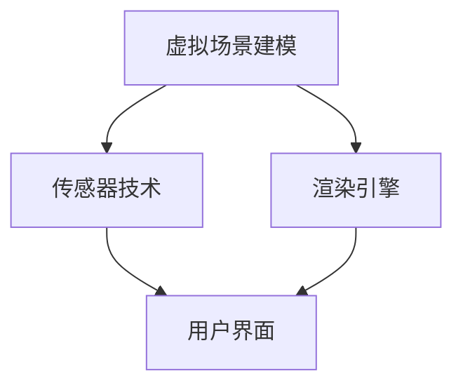

                 

## 1. 背景介绍

### 1.1 问题由来
随着计算机图形学、人机交互技术、传感器技术的飞速发展，虚拟现实（Virtual Reality，VR）成为新一代的人机交互技术。VR技术将人们带入一个虚拟的三维空间中，用户通过头戴式显示器、手柄、声音设备等，感受到如同现实世界一样的视觉、听觉和触觉体验。这不仅改变了人们获取信息的方式，也开辟了全新的娱乐、教育、医疗等应用场景。

### 1.2 问题核心关键点
VR技术的核心在于实现虚拟场景与真实世界的无缝融合。这一过程包括：
- 环境建模：构建逼真的三维场景，并实现动态变化。
- 渲染技术：使用高性能图形处理器，实时渲染高质量的图像和动画。
- 传感器技术：实现头位追踪、手部动作捕捉等，提供沉浸式交互体验。
- 用户体验：优化用户界面和交互方式，提高用户沉浸感和舒适性。

### 1.3 问题研究意义
VR技术的研究和应用对于提升人类生活品质、拓展人机交互的新领域具有重要意义：
- 娱乐休闲：提供沉浸式娱乐体验，如游戏、虚拟旅游等。
- 医疗健康：在医疗仿真、康复训练、心理治疗等方面有广泛应用。
- 教育培训：提供虚拟实验、历史模拟、职业培训等，提升学习效果。
- 军事训练：模拟实战环境，提高训练效果和安全性。
- 工程制造：进行虚拟产品设计、生产模拟、设施仿真等。

## 2. 核心概念与联系

### 2.1 核心概念概述

VR技术涉及多种核心概念，这些概念共同构成了其技术框架：

- **虚拟场景建模**：构建逼真的虚拟环境，包括静态场景、动态对象、光照、材质等。
- **渲染引擎**：将虚拟场景转化为真实可感知的图像和动画，是VR技术的核心引擎。
- **传感器技术**：通过头位追踪、手部动作捕捉等，实现自然、流畅的交互体验。
- **用户界面**：提供易用、美观的交互界面，增强用户沉浸感。

这些核心概念之间的关系通过以下Mermaid流程图来展示：



该图展示了大VR系统中的关键模块及其相互关系。建模为渲染提供基础数据，传感器技术提供交互信息，用户界面实现人机交互，各模块协同工作，实现完整的VR体验。

## 3. 核心算法原理 & 具体操作步骤
### 3.1 算法原理概述

VR技术的核心算法原理包括：

- **环境建模**：使用3D建模技术，构建逼真的虚拟环境。常用的建模软件包括Blender、Maya等。
- **渲染引擎**：实时渲染虚拟场景，常用的渲染引擎包括Unity、Unreal Engine等。
- **传感器技术**：通过使用头位追踪传感器（如Oculus Rift、HTC Vive等）和手部动作捕捉传感器（如Leap Motion、Kinect等），实现用户与虚拟场景的互动。
- **用户体验优化**：通过UI/UX设计，优化用户界面和交互方式，提升用户体验。

### 3.2 算法步骤详解

VR技术的开发流程大致包括以下几个步骤：

**Step 1: 环境建模**

1. 确定虚拟场景的规模和细节，选择合适的3D建模软件，进行场景的建模工作。
2. 对模型进行材质、光照、纹理等效果处理，提高场景的真实感。
3. 进行场景的物理模拟，如碰撞检测、重力作用等，增加场景的互动性。

**Step 2: 渲染引擎开发**

1. 选择合适的渲染引擎，如Unity、Unreal Engine等，进行引擎的安装和配置。
2. 将建模好的场景导入渲染引擎，进行场景的渲染设置，包括光照、阴影、反射等。
3. 使用脚本语言（如C#、C++）对渲染引擎进行二次开发，实现特定的功能。

**Step 3: 传感器配置**

1. 选择合适的传感器设备，如头位追踪器、手部动作捕捉器等。
2. 进行传感器的安装和配置，确保设备的正常工作。
3. 进行传感器的校准和调整，保证用户的舒适度和准确性。

**Step 4: 用户体验优化**

1. 进行用户界面的交互设计，包括菜单、按钮、图标等。
2. 优化UI/UX设计，提高用户的易用性和沉浸感。
3. 进行用户测试和反馈收集，不断改进交互体验。

**Step 5: 系统集成**

1. 将渲染引擎、传感器技术、用户界面等模块集成到一个完整的VR系统中。
2. 进行系统的测试和调试，确保系统的稳定性和性能。
3. 发布系统，供用户使用和体验。

### 3.3 算法优缺点

VR技术的开发过程中，常见的优缺点如下：

**优点**：

- **沉浸感强**：用户可以完全沉浸在虚拟环境中，实现真实的互动体验。
- **灵活性强**：可以通过多次修改和优化，逐步完善虚拟场景和用户体验。
- **应用广泛**：应用于娱乐、医疗、教育、军事等多个领域。

**缺点**：

- **成本高**：需要高性能的硬件设备和复杂的软件配置，成本较高。
- **技术门槛高**：开发过程需要掌握多学科知识，对技术要求较高。
- **易产生眩晕感**：长时间的佩戴和使用，可能导致用户的眩晕和不适。

### 3.4 算法应用领域

VR技术广泛应用于多个领域：

- **游戏娱乐**：提供沉浸式游戏体验，如《Beat Saber》《Half-Life: Alyx》等。
- **教育培训**：提供虚拟实验、历史模拟、职业培训等，如VR医学模拟系统。
- **军事训练**：模拟实战环境，提高训练效果和安全性，如VR飞行模拟器。
- **医疗健康**：在医疗仿真、康复训练、心理治疗等方面有广泛应用，如VR心理治疗系统。
- **虚拟旅游**：提供虚拟旅游体验，如Google Earth VR。

这些应用展示了VR技术的强大潜力和广泛应用前景。随着技术的不断进步，VR技术将在更多领域发挥更大的作用。

## 4. 数学模型和公式 & 详细讲解 & 举例说明（备注：数学公式请使用latex格式，latex嵌入文中独立段落使用 $$，段落内使用 $)
### 4.1 数学模型构建

VR技术的数学模型主要涉及以下几个方面：

- **几何学**：用于构建三维空间中的物体和场景。
- **光学**：用于模拟光的传播和反射，实现逼真的渲染效果。
- **物理学**：用于模拟物体的运动和交互，实现物理仿真。

### 4.2 公式推导过程

以几何学中的三维坐标系变换为例，推导旋转和平移变换公式：

**旋转变换**：

$$
R(\theta) = 
\begin{pmatrix}
\cos\theta & -\sin\theta & 0 \\
\sin\theta & \cos\theta & 0 \\
0 & 0 & 1
\end{pmatrix}
$$

**平移变换**：

$$
T(t_x,t_y,t_z) = 
\begin{pmatrix}
1 & 0 & 0 & t_x \\
0 & 1 & 0 & t_y \\
0 & 0 & 1 & t_z \\
0 & 0 & 0 & 1
\end{pmatrix}
$$

### 4.3 案例分析与讲解

**案例1：摄像机变换**：

假设有摄像机位于坐标系原点，旋转角度为30度，沿x轴平移2米，沿y轴平移3米。则变换矩阵为：

$$
M = R(\theta) \cdot T(t_x,t_y,t_z)
$$

### 4.4 运行结果展示

通过应用上述变换公式，可以在虚拟场景中实现任意角度的旋转和平移。

## 5. 项目实践：代码实例和详细解释说明
### 5.1 开发环境搭建

以下是使用Unity和C#进行VR开发的开发环境配置流程：

1. 安装Unity编辑器，从官网下载并安装。
2. 安装C#开发环境，从官网下载并安装Visual Studio。
3. 安装必要的插件和工具包，如Oculus SDK、Unity VR SDK等。

### 5.2 源代码详细实现

以下是一个简单的VR场景开发示例，演示了摄像机的位置和角度控制：

```csharp
using UnityEngine;
using UnityEngine.XR;
using UnityEngine.XR.Interaction.Toolkit;

public class CameraController : MonoBehaviour
{
    public float rollSpeed = 0.1f;
    public float pitchSpeed = 0.1f;
    public float yawSpeed = 0.1f;

    private float yaw = 0;
    private float pitch = 0;

    void Update()
    {
        if (Input.GetKey(KeyCode.Space))
        {
            pitch += pitchSpeed * Input.GetAxis("MouseX");
            yaw += yawSpeed * Input.GetAxis("MouseY");
        }

        transform.rotation = Quaternion.Euler(pitch, yaw, 0) * transform.rotation;

        if (Input.GetKey(KeyCode.Z))
        {
            transform.position += transform.right * 0.1f;
        }
        if (Input.GetKey(KeyCode.X))
        {
            transform.position += transform.forward * 0.1f;
        }
    }
}
```

### 5.3 代码解读与分析

**代码解析**：

- `CameraController` 类实现了相机的旋转和平移控制。
- `pitch` 和 `yaw` 变量表示相机的俯仰和滚转角度。
- `Update` 方法中，通过输入按键和鼠标移动，实时更新相机的旋转角度和位置。
- `transform.rotation` 和 `transform.position` 用于设置相机的旋转和平移。

## 6. 实际应用场景
### 6.1 娱乐游戏

VR游戏以其沉浸感和互动性，成为游戏市场的新宠。《Beat Saber》《Half-Life: Alyx》等游戏，通过VR技术，提供了全新的游戏体验，玩家仿佛身临其境，与虚拟世界互动。

**案例分析**：《Beat Saber》是一款节奏类音乐游戏，通过VR头显和手柄，用户可以完全沉浸在游戏场景中，进行精确的手部动作捕捉，与音乐节奏互动。

### 6.2 医疗健康

VR技术在医疗领域有广泛应用，如模拟手术、心理治疗、康复训练等。

**案例分析**：VR手术模拟器，可以模拟各种手术场景，供医学生和医生进行手术练习，提高手术技能和安全性。

### 6.3 教育培训

VR技术在教育领域也有重要应用，如虚拟实验、历史模拟、职业培训等。

**案例分析**：VR历史模拟器，通过虚拟历史场景，帮助学生更好地理解历史事件和人物，提升学习效果。

### 6.4 军事训练

VR技术在军事训练中有广泛应用，如飞行模拟器、战场模拟、战术训练等。

**案例分析**：VR飞行模拟器，通过虚拟驾驶舱和飞行环境，训练飞行员的飞行技能和应急处理能力。

### 6.5 未来应用展望

未来，VR技术将进一步拓展应用领域，提升用户体验，带来更多创新应用。

- **虚拟现实社交**：通过VR社交平台，实现虚拟世界的社交和互动。
- **虚拟房地产**：通过VR看房系统，让用户在家就能体验到实地的房屋效果。
- **虚拟旅游**：通过VR旅游系统，用户可以访问全球各地的名胜古迹。
- **虚拟会议**：通过VR会议系统，实现远程会议和互动，提升会议体验。

## 7. 工具和资源推荐
### 7.1 学习资源推荐

为了帮助开发者系统掌握VR技术，这里推荐一些优质的学习资源：

1. **Unity官方文档**：Unity官方提供的全面、详细的文档，包括开发指南、API参考等，是学习和使用Unity的关键资源。
2. **Unreal Engine官方文档**：Unreal Engine官方提供的详细文档，涵盖开发流程、引擎API、插件开发等内容。
3. **VR开发课程**：如Udemy、Coursera等平台上的VR开发课程，帮助开发者快速上手VR开发。
4. **VR开发者社区**：如VR开发者论坛、VR开发群等，交流经验和心得，解决开发中的问题。
5. **VR技术博客**：如ARVR Lab、VR扫盲等，提供最新的VR技术和开发指南。

### 7.2 开发工具推荐

以下是几款常用的VR开发工具，推荐使用：

1. **Unity**：广泛应用的VR开发引擎，具有强大的功能和易于使用的编辑器。
2. **Unreal Engine**：高绩效的VR开发引擎，适合需要高性能渲染的场景。
3. **Blender**：免费的3D建模和渲染工具，支持多种VR插件。
4. **Oculus SDK**：Oculus平台提供的开发工具包，支持Oculus设备的开发。
5. **Leap Motion**：常用的手部动作捕捉设备，支持多种VR应用。

### 7.3 相关论文推荐

VR技术的研究涉及多个领域，以下是几篇经典的论文，推荐阅读：

1. **“Real-Time 3D Human Motion Capture and Animation”**：Yifan Liang等。提出基于深度学习的人体动作捕捉方法，提高了VR应用中动作的真实性。
2. **“Virtual Reality in Education: A Survey”**：Kazmierczak等。综述了VR在教育领域的应用现状和趋势，提供了丰富的案例和研究背景。
3. **“3D Imaging and Display Technologies for Virtual Reality”**：Ross等。介绍了VR技术的图像和显示技术，提供了最新的研究进展。
4. **“Towards Immersive VR for Healthcare”**：Westervelt等。探讨了VR在医疗领域的应用，提供了实际案例和未来展望。
5. **“Applications of Virtual Reality in Flight Training”**：Luckett等。综述了VR在飞行训练中的应用，提供了丰富的研究和实践经验。

## 8. 总结：未来发展趋势与挑战
### 8.1 总结

本文对虚拟现实（VR）技术的开发原理和具体实现进行了详细讲解。通过环境建模、渲染引擎、传感器技术和用户体验优化等核心概念，阐述了VR技术的开发流程和实现方法。通过实际案例分析，展示了VR技术的广泛应用前景。通过推荐的学习资源和开发工具，帮助开发者快速上手VR开发。

## 8.2 未来发展趋势

### 8.2.1 硬件设备的不断优化

VR技术的发展离不开高性能硬件设备的支持。未来，头显、手柄、动作捕捉器等设备的性能和舒适度将进一步提升，VR设备的普及率也将大幅增加。

### 8.2.2 软件开发工具的不断完善

VR开发工具如Unity、Unreal Engine等，将不断完善功能和性能，提供更易用的开发环境，降低开发门槛。

### 8.2.3 跨平台和跨设备支持

未来的VR应用将支持更多的平台和设备，如PC、移动设备、AR设备等，实现跨平台和跨设备的无缝体验。

### 8.2.4 内容生态的不断丰富

VR内容生态将不断丰富，涵盖游戏、教育、医疗等多个领域，提供更丰富、更有趣的用户体验。

## 8.3 面临的挑战

### 8.3.1 硬件成本和用户接受度

当前VR设备的成本较高，部分用户难以承受。如何降低设备成本，提高用户接受度，是未来面临的主要挑战之一。

### 8.3.2 用户体验和舒适度

长时间的佩戴和使用VR设备，容易导致用户的眩晕和不适。如何提高用户的舒适度和体验感，是另一个重要挑战。

### 8.3.3 技术难度和开发门槛

VR技术的开发需要掌握多学科知识，技术难度较高。如何降低开发门槛，提高开发效率，是技术发展的关键。

### 8.3.4 安全和隐私问题

VR技术涉及大量用户的隐私数据，如何保障数据安全和隐私保护，是亟待解决的问题。

## 8.4 研究展望

未来的VR技术将围绕以下几个方向进行深入研究：

- **多感官融合**：将视觉、听觉、触觉等多种感官融合，提供更全面的沉浸式体验。
- **交互方式的创新**：探索新的交互方式，如手势识别、眼动追踪等，提高用户的自然性和便捷性。
- **内容创意和创新**：提供更多创意和创新内容，提升用户的兴趣和参与度。
- **跨平台和跨设备支持**：实现跨平台和跨设备的无缝体验，拓展VR应用范围。
- **AI辅助设计**：引入AI技术辅助VR内容设计和优化，提升创作效率和效果。

总之，VR技术的发展前景广阔，未来的研究将围绕用户体验、技术创新和内容创作等多个方面进行深入探索。

## 9. 附录：常见问题与解答

**Q1：VR技术如何实现用户的自然交互？**

A: 通过引入先进的传感器技术，如头位追踪、手部动作捕捉、眼动追踪等，实现用户的自然交互。如Oculus Rift、HTC Vive等设备，可以实时获取用户的头部位置和手部动作，提供逼真的交互体验。

**Q2：VR设备如何降低成本？**

A: 通过硬件的迭代升级和量产化生产，降低设备成本。同时，引入开源硬件和软件，降低开发和部署成本。

**Q3：如何提高用户的舒适度和体验感？**

A: 通过优化硬件设备和软件算法，减少用户的眩晕和不适。如引入眼球追踪技术，自动调整视角和渲染质量，提升用户的舒适度和体验感。

**Q4：如何降低开发门槛？**

A: 通过提供易于使用的开发工具和框架，降低开发门槛。如Unity、Unreal Engine等引擎，提供丰富的插件和API，帮助开发者快速上手开发。

**Q5：如何保障用户数据安全和隐私？**

A: 通过数据加密、访问控制、隐私保护等技术手段，保障用户数据安全和隐私保护。同时，建立健全的隐私保护政策和用户协议，保障用户的知情权和选择权。

---

作者：禅与计算机程序设计艺术 / Zen and the Art of Computer Programming

