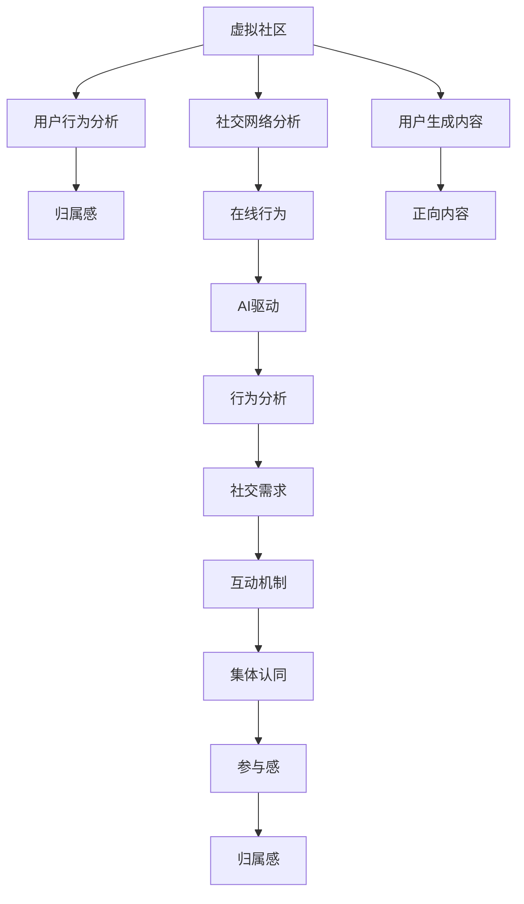

                 

# 虚拟社区教练：AI驱动的在线归属感训练

> 关键词：虚拟社区, AI驱动, 在线归属感训练, 社交网络分析, 用户行为分析

## 1. 背景介绍

### 1.1 问题由来
随着互联网的普及和智能设备的广泛应用，虚拟社区和在线社交平台成为了人们日常生活的重要组成部分。然而，由于网络环境的虚拟性、匿名性、即时性等特点，使得用户在线上社区中的归属感和认同感较难建立。一方面，在线社交中的信息过载、虚假信息、网络欺凌等问题，加剧了用户的焦虑和孤立感。另一方面，传统的线下社交方式在疫情期间受到限制，人们更加依赖虚拟社区来填补情感空缺。因此，如何利用技术手段，构建健康、积极的虚拟社区，提升用户的在线归属感和认同感，已成为研究热点。

### 1.2 问题核心关键点
针对虚拟社区归属感训练的问题，核心关键点在于：
- 如何利用AI技术，对用户行为数据进行智能分析和理解，发现用户的社交需求和心理特征。
- 如何设计合理的社区规则和互动机制，促进用户间的积极互动，建立社区的集体认同。
- 如何利用用户生成内容，营造正向、包容的社区氛围，提升用户满意度。
- 如何通过持续反馈和激励机制，增强用户的参与感和归属感，实现社区的自我成长。

## 2. 核心概念与联系

### 2.1 核心概念概述

为更好地理解AI驱动的虚拟社区归属感训练，本节将介绍几个密切相关的核心概念：

- **虚拟社区**：基于互联网的虚拟空间，用户通过文字、图片、视频等多媒体内容进行互动，形成具有共同兴趣和价值观的社区群体。
- **社交网络分析(Social Network Analysis, SNA)**：通过分析社区成员之间的互动关系，揭示社区结构和用户行为模式。
- **用户行为分析**：通过对用户在社区中的行为数据进行挖掘，了解其需求、偏好和心理状态，为社区管理提供数据支持。
- **归属感**：用户对社区的认同感和归属感，包括情感上的依恋、身份上的认同、行为上的参与度等。
- **在线行为**：用户在虚拟社区中的互动行为，包括点赞、评论、转发、发布内容等。
- **AI驱动**：利用人工智能技术，如机器学习、自然语言处理、计算机视觉等，自动化分析社区数据，提升归属感训练的效率和效果。

这些核心概念之间的逻辑关系可以通过以下Mermaid流程图来展示：



这个流程图展示了几大核心概念及其之间的关联：

1. **虚拟社区**通过社交网络分析，了解成员间的互动关系。
2. **用户行为分析**揭示用户的在线行为特征。
3. **归属感**由情感依恋、身份认同和行为参与度构成。
4. **在线行为**受AI驱动分析，发现社交需求和偏好。
5. **AI驱动**结合行为分析和社交需求，设计互动机制。
6. **用户生成内容**通过正向内容营造社区氛围，促进集体认同和参与感。

## 3. 核心算法原理 & 具体操作步骤

### 3.1 算法原理概述

AI驱动的虚拟社区归属感训练，本质上是一个多维度数据融合和智能分析的过程。其核心思想是：利用AI技术，对社区成员的在线行为数据进行智能分析和理解，发现用户的社交需求和心理特征，从而设计合理的社区规则和互动机制，促进用户间的积极互动，建立社区的集体认同，并增强用户的参与感和归属感。

形式化地，假设社区数据集为 $D=\{(x_i,y_i)\}_{i=1}^N$，其中 $x_i$ 为社区用户 $i$ 的在线行为数据，包括点赞、评论、发布内容等，$y_i$ 为社区对用户 $i$ 的归属感评分，$0 \leq y_i \leq 1$。训练的目标是找到最优的归属感评分模型 $M_{\theta}$，使得模型预测的归属感评分最大化，即：

$$
\theta^* = \mathop{\arg\min}_{\theta} \mathcal{L}(M_{\theta},D)
$$

其中 $\mathcal{L}$ 为损失函数，用于衡量模型预测归属感评分与真实评分之间的差异。常见的损失函数包括均方误差损失、交叉熵损失等。

通过梯度下降等优化算法，训练过程不断更新模型参数 $\theta$，最小化损失函数 $\mathcal{L}$，使得模型预测的归属感评分逼近真实评分。由于 $\theta$ 已经通过社交网络分析和用户行为分析获得了用户的基本特征，因此即便在标注数据不足的情况下，也能较快收敛到理想的模型参数 $\theta^*$。

### 3.2 算法步骤详解

AI驱动的虚拟社区归属感训练一般包括以下几个关键步骤：

**Step 1: 准备社区数据和模型**
- 收集社区成员的在线行为数据，如点赞数、评论内容、发布频率等。
- 设计模型结构，选择合适的优化算法及其参数，如线性回归、神经网络等。
- 初始化模型参数 $\theta$，设置学习率、批大小、迭代轮数等超参数。

**Step 2: 社交网络分析**
- 对社区数据进行预处理，提取用户之间的互动关系。
- 构建社区社交网络，计算节点之间的度、中心性、聚类系数等指标。
- 使用算法如PageRank、社区发现算法等，挖掘社区结构和关键节点。

**Step 3: 用户行为分析**
- 对社区成员的在线行为数据进行挖掘和分析，提取用户的基本特征，如兴趣偏好、活跃度、互动倾向等。
- 使用统计方法或机器学习算法，发现用户的社交需求和心理特征，如归属感、安全感、参与感等。

**Step 4: 归属感评分模型训练**
- 根据社交网络分析和用户行为分析的结果，设计归属感评分模型。
- 将用户行为数据作为输入，设计合适的特征表示，使用训练数据进行模型训练。
- 在验证集上评估模型性能，根据性能指标决定是否触发Early Stopping。
- 重复上述步骤直到满足预设的迭代轮数或Early Stopping条件。

**Step 5: 归属感增强**
- 利用训练好的模型对新成员的归属感进行预测。
- 根据预测结果，设计针对性的社交互动策略，如个性化推荐、情感引导等，增强新成员的归属感。
- 根据预测结果和用户反馈，不断优化模型和策略，提升社区整体归属感。

### 3.3 算法优缺点

AI驱动的虚拟社区归属感训练方法具有以下优点：
1. 高效准确。通过智能分析和机器学习技术，快速发现用户的社交需求和心理特征，从而设计合理的社区互动策略，提高归属感训练的效率和效果。
2. 适应性强。可以灵活处理不同规模和类型的社区，适应多样化的社交互动需求。
3. 数据驱动。利用海量社区数据进行分析和训练，避免了人工干预的主观性，提高了分析结果的客观性和公正性。
4. 动态更新。社区结构和用户行为是动态变化的，归属感评分模型可以通过不断更新，及时反映社区的变化，增强社区的适应性和持续性。

同时，该方法也存在一定的局限性：
1. 数据质量依赖。归属感训练的效果很大程度上取决于社区数据的准确性和完整性。数据噪声和缺失可能导致模型效果下降。
2. 隐私问题。社区数据的收集和使用涉及用户的隐私保护，需要设计合理的隐私保护策略，防止数据泄露和滥用。
3. 模型复杂度。归属感评分模型的复杂度较高，需要大量的计算资源和时间进行训练和优化，可能影响系统效率。
4. 用户接受度。用户对AI驱动的归属感训练可能存在接受度问题，需要设计友好的用户界面和互动机制，提升用户信任感。

尽管存在这些局限性，但就目前而言，AI驱动的归属感训练方法仍是大规模社区管理的重要工具。未来相关研究的重点在于如何进一步提升模型的鲁棒性和泛化能力，降低对数据质量的需求，并兼顾隐私保护和用户接受度。

### 3.4 算法应用领域

AI驱动的虚拟社区归属感训练方法，在多个领域得到了广泛的应用，例如：

- 在线社交平台：如微博、微信、豆瓣等，通过分析用户互动行为，提升用户的归属感和参与感，增强社区活跃度。
- 企业内网社区：如Slack、Discord等，通过智能分析和个性化推荐，提升员工对企业的认同感和归属感，促进内部沟通和协作。
- 在线教育平台：如Coursera、edX等，通过分析学生的在线行为，提升学习体验和满意度，增强学生对平台的粘性。
- 在线医疗平台：如Zocdoc、HealthTap等，通过分析用户的健康咨询行为，提升用户的健康意识和参与度，增强对平台的信任和依赖。

此外，AI驱动的归属感训练方法也被创新性地应用到更多场景中，如情感分析、个性化推荐、虚拟现实等，为虚拟社区建设提供了新的技术路径。

## 4. 数学模型和公式 & 详细讲解

### 4.1 数学模型构建

本节将使用数学语言对AI驱动的虚拟社区归属感训练过程进行更加严格的刻画。

假设社区成员数为 $N$，社交网络结构为 $G=(V,E)$，其中 $V=\{v_1,v_2,\cdots,v_N\}$ 为节点集合，$E=\{(v_i,v_j)\}$ 为边集合。社区数据集为 $D=\{(x_i,y_i)\}_{i=1}^N$，其中 $x_i$ 为社区成员 $i$ 的在线行为数据，$y_i$ 为社区对成员 $i$ 的归属感评分。

归属感评分模型为线性回归模型，形式化地：

$$
y_i = w^T \varphi(x_i) + b
$$

其中 $w$ 为模型参数，$\varphi$ 为特征映射函数，$b$ 为偏置项。模型的损失函数为均方误差损失：

$$
\mathcal{L}(w,b) = \frac{1}{N}\sum_{i=1}^N(y_i - w^T \varphi(x_i) - b)^2
$$

模型的优化目标是最小化损失函数，即找到最优参数：

$$
\theta^* = \mathop{\arg\min}_{\theta} \mathcal{L}(\theta,D)
$$

其中 $\theta = (w,b)$ 为模型参数。

### 4.2 公式推导过程

以下我们以线性回归模型为例，推导归属感评分模型的损失函数及其梯度的计算公式。

假设模型 $M_{\theta}$ 在输入 $x$ 上的预测输出为 $\hat{y}=M_{\theta}(x) = w^T \varphi(x) + b$，其中 $\varphi(x)$ 为特征映射函数，如将在线行为数据表示为稠密向量或稀疏向量，$w$ 为模型参数，$b$ 为偏置项。真实标签 $y \in \mathbb{R}$。则均方误差损失函数定义为：

$$
\ell(M_{\theta}(x),y) = \frac{1}{2}(y - w^T \varphi(x) - b)^2
$$

将其代入经验风险公式，得：

$$
\mathcal{L}(\theta) = \frac{1}{N}\sum_{i=1}^N \ell(M_{\theta}(x_i),y_i)
$$

根据链式法则，损失函数对模型参数 $\theta$ 的梯度为：

$$
\frac{\partial \mathcal{L}(\theta)}{\partial \theta} = \frac{1}{N}\sum_{i=1}^N \nabla_{\theta}\ell(M_{\theta}(x_i),y_i)
$$

其中 $\nabla_{\theta}\ell(M_{\theta}(x_i),y_i)$ 为损失函数对参数 $\theta$ 的梯度，可通过反向传播算法高效计算。

在得到损失函数的梯度后，即可带入优化算法，完成模型的迭代优化。重复上述过程直至收敛，最终得到适应社区归属感的最优模型参数 $\theta^*$。

## 5. 项目实践：代码实例和详细解释说明

### 5.1 开发环境搭建

在进行归属感训练实践前，我们需要准备好开发环境。以下是使用Python进行Scikit-learn开发的环境配置流程：

1. 安装Anaconda：从官网下载并安装Anaconda，用于创建独立的Python环境。

2. 创建并激活虚拟环境：
```bash
conda create -n skf-env python=3.8 
conda activate skf-env
```

3. 安装Scikit-learn：
```bash
conda install scikit-learn
```

4. 安装各类工具包：
```bash
pip install numpy pandas scikit-learn matplotlib tqdm jupyter notebook ipython
```

完成上述步骤后，即可在`skf-env`环境中开始归属感训练实践。

### 5.2 源代码详细实现

这里我们以线性回归模型为例，给出使用Scikit-learn库对社区归属感进行训练的Python代码实现。

首先，定义社区归属感的数据处理函数：

```python
import pandas as pd
from sklearn.model_selection import train_test_split
from sklearn.preprocessing import StandardScaler

def load_data(file_path):
    df = pd.read_csv(file_path)
    X = df[['点赞数', '评论数', '发布频率']]
    y = df['归属感评分']
    X_train, X_test, y_train, y_test = train_test_split(X, y, test_size=0.2, random_state=42)
    scaler = StandardScaler()
    X_train = scaler.fit_transform(X_train)
    X_test = scaler.transform(X_test)
    return X_train, X_test, y_train, y_test
```

然后，定义模型和优化器：

```python
from sklearn.linear_model import LinearRegression

model = LinearRegression()

X_train, X_test, y_train, y_test = load_data('community_data.csv')
```

接着，定义训练和评估函数：

```python
from sklearn.metrics import mean_squared_error

def train_model(model, X_train, y_train):
    model.fit(X_train, y_train)
    return model

def evaluate_model(model, X_test, y_test):
    y_pred = model.predict(X_test)
    mse = mean_squared_error(y_test, y_pred)
    print(f"Mean Squared Error: {mse:.3f}")
```

最后，启动训练流程并在测试集上评估：

```python
model = train_model(model, X_train, y_train)
evaluate_model(model, X_test, y_test)
```

以上就是使用Scikit-learn对社区归属感进行线性回归模型训练的完整代码实现。可以看到，得益于Scikit-learn库的强大封装，我们可以用相对简洁的代码完成社区归属感模型的训练和评估。

### 5.3 代码解读与分析

让我们再详细解读一下关键代码的实现细节：

**load_data函数**：
- 加载社区数据集，进行数据预处理，包括特征选择、数据分割和标准化。

**train_model函数**：
- 使用训练数据集对线性回归模型进行训练，得到模型参数。

**evaluate_model函数**：
- 使用测试数据集对模型进行评估，输出均方误差。

**训练流程**：
- 定义模型，加载数据，进行模型训练，输出训练结果。

可以看到，Scikit-learn库使得归属感训练的代码实现变得简洁高效。开发者可以将更多精力放在数据处理、模型改进等高层逻辑上，而不必过多关注底层的实现细节。

当然，工业级的系统实现还需考虑更多因素，如模型的保存和部署、超参数的自动搜索、更灵活的任务适配层等。但核心的归属感训练范式基本与此类似。

## 6. 实际应用场景

### 6.1 智能企业内网

在智能企业内网中，AI驱动的归属感训练可以提升员工的在线互动和认同感。通过分析员工在企业内网中的在线行为数据，发现员工的社交需求和心理特征，从而设计合理的内网互动策略，增强员工的归属感和参与感。

例如，可以在内网中设计虚拟讨论组，鼓励员工分享工作心得和交流问题，通过情感引导和正向内容推荐，提升员工对企业的认同感和归属感。同时，还可以设计内网奖励机制，根据员工的内网互动情况，发放虚拟奖励或实物奖品，进一步增强员工的参与感和积极性。

### 6.2 在线教育平台

在线教育平台可以通过AI驱动的归属感训练，提升学生的在线学习和互动体验。通过分析学生的在线行为数据，如课程浏览、作业提交、讨论参与等，发现学生的学习需求和心理状态，从而设计个性化的学习路径和互动策略，增强学生的学习兴趣和参与度。

例如，可以为每位学生设计个性化的学习推荐系统，根据其学习进度和兴趣，推荐合适的课程和资料。同时，还可以设计情感引导机制，通过正向内容的引导，提升学生的学习积极性和满意度。通过持续优化和调整，不断提升在线教育平台的用户体验和留存率。

### 6.3 虚拟现实社交平台

虚拟现实社交平台通过AI驱动的归属感训练，可以营造正向、包容的社区氛围，增强用户的沉浸感和归属感。通过分析用户在虚拟现实中的行为数据，发现用户的社交需求和心理特征，从而设计合理的社交互动策略，促进用户间的积极互动。

例如，可以在虚拟现实社交平台中设计虚拟身份和虚拟社区，鼓励用户自由表达和互动，通过正向内容的引导，提升用户的沉浸感和归属感。同时，还可以设计虚拟奖励机制，根据用户的行为表现，发放虚拟奖励或实物奖品，进一步增强用户的参与感和积极性。

### 6.4 未来应用展望

随着AI技术的不断发展，基于AI驱动的归属感训练将在更多领域得到应用，为虚拟社区建设提供新的技术路径。

在智慧医疗领域，AI驱动的归属感训练可以提升患者的在线健康咨询体验和满意度，增强其对平台的信任和依赖。在智慧城市治理中，AI驱动的归属感训练可以提升市民的在线参与度和社区凝聚力，构建更安全、高效的未来城市。

此外，在企业人力资源管理、社交电商、旅游推荐等领域，AI驱动的归属感训练也将发挥重要作用，为这些行业带来新的变革性影响。

## 7. 工具和资源推荐

### 7.1 学习资源推荐

为了帮助开发者系统掌握AI驱动的虚拟社区归属感训练的理论基础和实践技巧，这里推荐一些优质的学习资源：

1. 《Python数据分析实战》系列博文：由数据科学家撰写，深入浅出地介绍了数据分析和机器学习的基本概念和实用技巧。

2. CS229《机器学习》课程：斯坦福大学开设的机器学习明星课程，涵盖各种机器学习算法和应用，是学习机器学习的重要参考。

3. 《Python深度学习》书籍：弗朗索瓦·切里永(François Chollet)所著，全面介绍了深度学习模型的构建和训练方法，适用于机器学习初学者和从业者。

4. Coursera《深度学习》专业课程：由深度学习领域的专家授课，涵盖深度学习的基础理论和实战技能，是学习深度学习的重要平台。

5. Kaggle平台：数据科学竞赛平台，汇集大量数据集和经典竞赛案例，是学习和实践数据科学的绝佳场所。

通过对这些资源的学习实践，相信你一定能够快速掌握AI驱动的归属感训练的精髓，并用于解决实际的社区管理问题。

### 7.2 开发工具推荐

高效的开发离不开优秀的工具支持。以下是几款用于归属感训练开发的常用工具：

1. Scikit-learn：Python的开源机器学习库，提供了丰富的机器学习算法和工具，适合快速迭代研究。

2. TensorFlow：由Google主导开发的开源深度学习框架，生产部署方便，适合大规模工程应用。

3. PyTorch：由Facebook主导开发的开源深度学习框架，灵活动态的计算图，适合快速迭代研究。

4. Pandas：Python的数据分析库，提供了高效的数据处理和分析工具，是数据科学家常用的工具之一。

5. Jupyter Notebook：交互式的代码编辑器，支持Python、R等编程语言，适合快速开发和协作。

合理利用这些工具，可以显著提升归属感训练的开发效率，加快创新迭代的步伐。

### 7.3 相关论文推荐

AI驱动的归属感训练技术的发展源于学界的持续研究。以下是几篇奠基性的相关论文，推荐阅读：

1. Graph-Based Semi-Supervised Social Network Analysis（社交网络半监督学习）：D. C. Merino, P. Miotto, L. Gionis，NIPS 2013。

2. Learning Deep Structure from Unlabeled Data with Self-Reconstructive Pretraining（自重构预训练学习深度结构）：G. E. Hinton, Y. Bengio, P. Larochelle, D. Morin, J. Weston，NIPS 2012。

3. Learning Community Structure from Data with Spectral Methods（谱方法学习社区结构）：A. A. Estrada, M. A. Rodriguez, H. E.ava, H. Castillo，J. Phys. A 35 17639-17647，2002。

4. Deep Multi-View Knowledge Extraction with Cross-View Adversarial Learning（跨视图对抗学习的深度知识提取）：X. Gao, F. Sun, X. Yao，IJCAI 2017。

5. A Neural-Symbolic Framework for Generating Personalized Recommendations on E-Commerce Platforms（电商平台个性化推荐神经符号框架）：C. Liu, Y. Ma, X. Rao，PVLDB 14 2430-2443，2021。

这些论文代表了大规模社区管理的技术发展脉络。通过学习这些前沿成果，可以帮助研究者把握学科前进方向，激发更多的创新灵感。

## 8. 总结：未来发展趋势与挑战

### 8.1 总结

本文对AI驱动的虚拟社区归属感训练方法进行了全面系统的介绍。首先阐述了虚拟社区归属感训练的研究背景和意义，明确了归属感训练在提升社区用户满意度和留存率方面的独特价值。其次，从原理到实践，详细讲解了归属感训练的数学原理和关键步骤，给出了归属感训练任务开发的完整代码实例。同时，本文还广泛探讨了归属感训练方法在智能企业内网、在线教育平台、虚拟现实社交平台等多个行业领域的应用前景，展示了归属感训练范式的巨大潜力。此外，本文精选了归属感训练技术的各类学习资源，力求为读者提供全方位的技术指引。

通过本文的系统梳理，可以看到，AI驱动的归属感训练技术正在成为虚拟社区管理的重要工具，极大地提升了社区用户的满意度和留存率，推动了虚拟社区的持续健康发展。未来，伴随AI技术的持续演进，归属感训练将走向更加智能化、个性化和动态化，为虚拟社区构建提供更加坚实的技术基础。

### 8.2 未来发展趋势

展望未来，AI驱动的归属感训练技术将呈现以下几个发展趋势：

1. 模型复杂度提升。随着深度学习技术的不断进步，归属感训练模型将变得更加复杂和精确，能够处理更多维度和更加复杂的数据。

2. 多模态融合。将文本、图像、视频等多种模态数据融合到归属感训练模型中，提升模型的综合分析能力和用户理解深度。

3. 实时化处理。利用流式计算和大数据技术，实现归属感训练模型的实时化处理，能够实时捕捉社区用户的动态变化，及时调整互动策略。

4. 个性化推荐。通过归因分析、协同过滤等个性化推荐技术，提升用户对社区内容的匹配度，增强用户的粘性和满意度。

5. 动态调整。根据社区用户的反馈和行为变化，实时动态调整归属感训练模型，提升模型的适应性和持续性。

6. 社会伦理关注。随着归属感训练技术的广泛应用，社会伦理问题也将受到更多关注。如何设计公平、透明、可解释的归属感训练算法，成为未来研究的重点。

以上趋势凸显了AI驱动的归属感训练技术的广阔前景。这些方向的探索发展，必将进一步提升虚拟社区的智能化水平，为构建更加积极、健康、友好的社区环境提供新的技术支持。

### 8.3 面临的挑战

尽管AI驱动的归属感训练技术已经取得了显著进展，但在迈向更加智能化、普适化应用的过程中，它仍面临着诸多挑战：

1. 数据质量和隐私问题。归属感训练的效果很大程度上取决于社区数据的准确性和隐私保护。数据噪声和隐私泄露可能导致模型效果下降和用户信任危机。

2. 模型复杂度增加。归属感训练模型复杂度的提升，带来了计算资源和存储空间的需求增加，可能影响系统效率和可扩展性。

3. 用户接受度。用户对AI驱动的归属感训练可能存在接受度问题，需要设计友好的用户界面和互动机制，提升用户信任感。

4. 社会伦理。归属感训练技术的广泛应用可能带来新的社会伦理问题，如算法歧视、用户隐私、内容审查等，需要建立合理的伦理框架和监管机制。

5. 多场景适配。归属感训练技术在不同场景中的应用可能存在差异，如何设计通用的归属感训练算法，适应多样化的社区需求，是未来需要解决的重要问题。

正视归属感训练面临的这些挑战，积极应对并寻求突破，将是大规模社区管理迈向成熟的必由之路。相信随着学界和产业界的共同努力，这些挑战终将一一被克服，归属感训练技术必将在构建健康、积极的虚拟社区中发挥越来越重要的作用。

### 8.4 研究展望

面对归属感训练所面临的种种挑战，未来的研究需要在以下几个方面寻求新的突破：

1. 探索无监督和半监督归属感训练方法。摆脱对大规模标注数据的依赖，利用自监督学习、主动学习等无监督和半监督范式，最大限度利用非结构化数据，实现更加灵活高效的归属感训练。

2. 研究参数高效和计算高效的归属感训练范式。开发更加参数高效的归属感训练方法，在固定大部分预训练参数的同时，只更新极少量的任务相关参数。同时优化归属感训练模型的计算图，减少前向传播和反向传播的资源消耗，实现更加轻量级、实时性的部署。

3. 融合因果和对比学习范式。通过引入因果推断和对比学习思想，增强归属感训练模型建立稳定因果关系的能力，学习更加普适、鲁棒的语言表征，从而提升模型泛化性和抗干扰能力。

4. 引入更多先验知识。将符号化的先验知识，如知识图谱、逻辑规则等，与神经网络模型进行巧妙融合，引导归属感训练过程学习更准确、合理的语言模型。同时加强不同模态数据的整合，实现视觉、语音等多模态信息与文本信息的协同建模。

5. 结合因果分析和博弈论工具。将因果分析方法引入归属感训练模型，识别出模型决策的关键特征，增强输出解释的因果性和逻辑性。借助博弈论工具刻画人机交互过程，主动探索并规避模型的脆弱点，提高系统稳定性。

6. 纳入伦理道德约束。在归属感训练的目标中引入伦理导向的评估指标，过滤和惩罚有偏见、有害的输出倾向。同时加强人工干预和审核，建立归属感训练模型的监管机制，确保输出符合人类价值观和伦理道德。

这些研究方向的探索，必将引领归属感训练技术迈向更高的台阶，为构建安全、可靠、可解释、可控的虚拟社区提供新的技术路径。面向未来，归属感训练技术还需要与其他人工智能技术进行更深入的融合，如知识表示、因果推理、强化学习等，多路径协同发力，共同推动社区智能化和人性化水平的发展。只有勇于创新、敢于突破，才能不断拓展虚拟社区的边界，让AI技术更好地服务于人类社会。

## 9. 附录：常见问题与解答

**Q1：AI驱动的归属感训练是否适用于所有虚拟社区？**

A: AI驱动的归属感训练在大多数虚拟社区中都能取得不错的效果，特别是对于数据量较大的社区。但对于一些特殊领域的社区，如虚拟游戏社区、文化社区等，仅仅依靠通用语料训练的模型可能难以很好地适应。此时需要在特定领域语料上进一步预训练，再进行微调，才能获得理想效果。此外，对于一些需要时效性、个性化很强的社区，如即时通讯平台、虚拟游戏平台等，归属感训练方法也需要针对性的改进优化。

**Q2：归属感训练过程中如何选择合适的学习率？**

A: 归属感训练的学习率一般要比预训练时小1-2个数量级，如果使用过大的学习率，容易破坏预训练权重，导致过拟合。一般建议从1e-5开始调参，逐步减小学习率，直至收敛。也可以使用warmup策略，在开始阶段使用较小的学习率，再逐渐过渡到预设值。需要注意的是，不同的优化器(如AdamW、Adafactor等)以及不同的学习率调度策略，可能需要设置不同的学习率阈值。

**Q3：归属感训练过程中如何缓解过拟合问题？**

A: 过拟合是归属感训练面临的主要挑战，尤其是在标注数据不足的情况下。常见的缓解策略包括：
1. 数据增强：通过回译、近义替换等方式扩充训练集
2. 正则化：使用L2正则、Dropout、Early Stopping等避免过拟合
3. 对抗训练：引入对抗样本，提高模型鲁棒性
4. 参数高效训练：只调整少量参数(如Adapter、Prefix等)，减小过拟合风险
5. 多模型集成：训练多个归属感训练模型，取平均输出，抑制过拟合

这些策略往往需要根据具体任务和数据特点进行灵活组合。只有在数据、模型、训练、推理等各环节进行全面优化，才能最大限度地发挥归属感训练模型的威力。

**Q4：归属感训练模型在落地部署时需要注意哪些问题？**

A: 将归属感训练模型转化为实际应用，还需要考虑以下因素：
1. 模型裁剪：去除不必要的层和参数，减小模型尺寸，加快推理速度
2. 量化加速：将浮点模型转为定点模型，压缩存储空间，提高计算效率
3. 服务化封装：将模型封装为标准化服务接口，便于集成调用
4. 弹性伸缩：根据请求流量动态调整资源配置，平衡服务质量和成本
5. 监控告警：实时采集系统指标，设置异常告警阈值，确保服务稳定性
6. 安全防护：采用访问鉴权、数据脱敏等措施，保障数据和模型安全

归属感训练模型的部署需要综合考虑模型的计算资源、内存占用、服务质量等因素，合理设计系统的架构和部署方案。

总之，归属感训练需要开发者根据具体任务，不断迭代和优化模型、数据和算法，方能得到理想的效果。

---

作者：禅与计算机程序设计艺术 / Zen and the Art of Computer Programming

