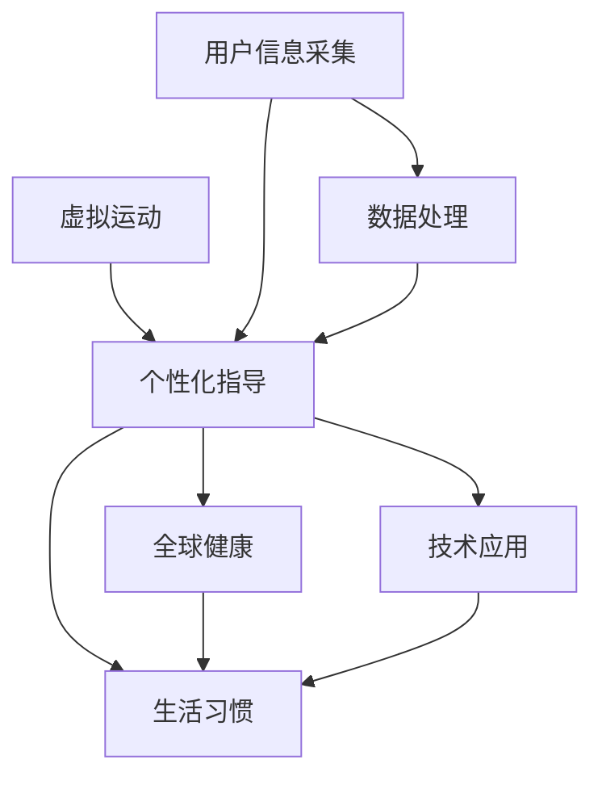

                 

# 虚拟运动处方:全球健康生活方式的个性化指导

> 关键词：虚拟运动, 个性化指导, 全球健康, 生活习惯, 技术应用

## 1. 背景介绍

### 1.1 问题由来

随着全球人口老龄化和健康问题的加剧，人们越来越重视日常生活中的健康管理和体育锻炼。然而，传统的运动方式往往需要物理场地、专业教练和大量的时间，并不适合所有人。特别是在疫情期间，许多人不得不居家隔离，难以像以前一样前往健身房或户外进行常规锻炼。

虚拟运动处方系统应运而生。这种系统通过将先进的数字技术和个性化指导结合，为全球用户提供定制化的运动方案。用户只需在智能设备上安装应用，即可随时随地进行虚拟运动训练，无需专业指导和物理场地。

虚拟运动处方系统基于人工智能和大数据技术，可以根据用户的年龄、性别、健康状况、生活环境等个性化信息，生成最适合的运动方案。这对于提高全民健康水平，特别是在无法进行现场锻炼的情况下，具有重要的应用价值。

### 1.2 问题核心关键点

虚拟运动处方系统的核心在于如何结合人工智能和大数据技术，实现个性化运动方案的自动生成和推荐。关键点包括：

- 用户个性化信息数据的获取与处理
- 运动方案的生成与推荐算法
- 虚拟运动环境与反馈机制的实现
- 系统安全性与隐私保护措施
- 长期追踪与效果评估方法

这些问题点涉及多个学科领域，包括机器学习、数据分析、用户界面设计、人机交互等，涵盖了技术、医学、心理学等多个方面。

## 2. 核心概念与联系

### 2.1 核心概念概述

为更好地理解虚拟运动处方系统的工作原理和优化方向，本节将介绍几个密切相关的核心概念：

- 虚拟运动(Physical Activity Virtualization)：通过虚拟现实(VR)、增强现实(AR)、计算机动画等技术，将现实世界的运动场景和行为虚拟化，用户可以在虚拟环境中进行锻炼。
- 个性化指导(Personalized Guidance)：根据用户的个性化信息，生成量身定做的运动方案和指导建议，提高运动效果和用户体验。
- 全球健康(Global Health)：通过虚拟运动处方系统，改善全球用户的健康状况和生活质量，提升公共卫生水平。
- 生活习惯(Lifestyle)：虚拟运动处方系统不仅关注用户的运动习惯，还涵盖饮食、睡眠、心理健康等多个方面，形成全面的健康管理方案。
- 技术应用(Technology Application)：将人工智能、大数据、物联网等先进技术应用于运动处方系统的开发和应用，实现自动化、智能化和个性化。

这些核心概念之间的逻辑关系可以通过以下Mermaid流程图来展示：



这个流程图展示了个体在虚拟运动处方系统中进行个性化健康管理的流程：

1. 通过虚拟运动技术，为用户提供沉浸式的运动环境。
2. 根据用户输入的个性化信息，生成个性化指导。
3. 系统通过全面评估用户的运动和生活习惯，提供全面的健康管理方案。
4. 结合人工智能、大数据等技术，实现系统的自动化和智能化。

## 3. 核心算法原理 & 具体操作步骤
### 3.1 算法原理概述

虚拟运动处方系统的核心算法原理可以归纳为以下几点：

1. 用户个性化信息数据的获取与处理。系统通过智能设备或问卷调查，收集用户的年龄、性别、身高、体重、健康状况等数据，并进行处理。
2. 运动方案的生成与推荐算法。系统根据用户数据和历史运动数据，生成个性化运动方案，并根据用户的实时反馈进行动态调整。
3. 虚拟运动环境与反馈机制的实现。系统利用VR/AR技术，创建虚拟运动环境，并通过传感器获取用户的实时运动数据，进行反馈和调整。
4. 系统安全性与隐私保护措施。系统必须确保用户数据的保密性、完整性和可用性，采用多层次的安全措施。
5. 长期追踪与效果评估方法。系统通过跟踪用户的长期运动数据，评估运动效果和健康改善情况。

### 3.2 算法步骤详解

以下是虚拟运动处方系统的详细步骤：

**Step 1: 用户数据采集**

- 设计问卷，收集用户的个人信息，如年龄、性别、身高、体重、健康状况等。
- 利用智能设备（如智能手表、可穿戴设备）实时监测用户的生理参数（如心率、步数、消耗卡路里等）。
- 采用自然语言处理技术，分析用户输入的锻炼计划和反馈。

**Step 2: 数据预处理与分析**

- 对采集到的数据进行清洗和标准化处理，如去除异常值、填补缺失值。
- 使用数据分析方法，如统计分析、聚类分析等，识别用户的运动偏好和习惯。
- 建立用户档案，记录用户的运动历史和健康状况变化。

**Step 3: 运动方案生成与推荐**

- 根据用户数据和运动偏好，设计多种运动方案，如跑步、瑜伽、力量训练等。
- 利用机器学习模型，如协同过滤、神经网络等，预测用户的运动效果和偏好。
- 生成个性化的运动方案，并通过用户界面展示给用户。

**Step 4: 虚拟运动环境创建与互动**

- 利用VR/AR技术，创建逼真的运动环境，如户外跑步、健身房训练等。
- 通过传感器获取用户的运动数据，实时调整运动方案。
- 提供丰富的反馈机制，如视觉、听觉、触觉等，提升用户的沉浸感和体验感。

**Step 5: 效果评估与优化**

- 定期评估用户的运动效果，如身体指标、运动强度、满意程度等。
- 分析运动方案的效果，优化推荐算法和运动环境设计。
- 根据用户反馈，动态调整运动方案，提升用户体验。

### 3.3 算法优缺点

虚拟运动处方系统具有以下优点：

1. 灵活便捷。用户可以在任何时间和地点进行锻炼，无需专业指导和物理场地。
2. 数据驱动。通过大量数据进行分析和推荐，运动方案更加科学和个性化。
3. 沉浸体验。虚拟运动环境提供了丰富的互动和反馈，提升用户的沉浸感和体验感。
4. 安全性高。利用先进的技术手段，保证运动过程的安全性。

同时，系统也存在以下局限性：

1. 技术门槛高。需要较高的技术水平和设备条件，可能不适用于所有用户。
2. 数据隐私问题。用户的隐私数据需要有效保护，避免泄露。
3. 个性化不足。虽然系统可以提供个性化的运动方案，但仍可能存在差异。
4. 长期追踪问题。用户的长期追踪数据需要有效管理和评估。

### 3.4 算法应用领域

虚拟运动处方系统在多个领域有着广泛的应用，包括：

- 健身与康复。通过个性化的运动方案，提升用户的运动效果和康复速度。
- 心理健康。结合心理健康指导，帮助用户缓解压力和焦虑。
- 慢性病管理。通过长期追踪和效果评估，协助医生进行慢性病管理。
- 儿童和青少年运动。为儿童和青少年设计适合的运动方案，促进身体健康。
- 老年人运动。为老年人提供易于操作和安全的运动方案。
- 职业健康。为长时间坐班的工作人员，提供便携式运动设备。

除了上述这些领域，虚拟运动处方系统还在更多场景中得到应用，如体育训练、家庭健身、企业健康福利等。随着技术的不断发展，未来将在更多领域发挥重要作用。

## 4. 数学模型和公式 & 详细讲解 & 举例说明
### 4.1 数学模型构建

为了更好地理解虚拟运动处方系统，我们接下来使用数学语言对系统的工作原理进行严格的刻画。

设用户的健康状态向量为 $\mathbf{h} = [h_1, h_2, h_3, ..., h_n]$，其中 $h_i$ 表示第 $i$ 个健康指标（如体重、心率、血压等）。设用户的运动偏好向量为 $\mathbf{p} = [p_1, p_2, p_3, ..., p_m]$，其中 $p_i$ 表示第 $i$ 种运动方案的偏好程度。

定义用户的运动效果为 $E(\mathbf{h}, \mathbf{p})$，表示在运动偏好 $\mathbf{p}$ 下的健康状态变化。设 $\mathbf{w}$ 为运动方案的权重向量，表示不同运动方案对健康状态变化的影响权重。则运动方案的生成与推荐模型可以表示为：

$$
E(\mathbf{h}, \mathbf{p}) = \mathbf{w}^T \cdot f(\mathbf{h}, \mathbf{p})
$$

其中 $f(\mathbf{h}, \mathbf{p})$ 为用户的运动行为与健康状态之间的函数关系，可以通过统计分析和机器学习模型进行拟合。

### 4.2 公式推导过程

为了计算运动效果 $E(\mathbf{h}, \mathbf{p})$，我们需要对公式进行推导。假设 $f(\mathbf{h}, \mathbf{p})$ 可以表示为以下形式：

$$
f(\mathbf{h}, \mathbf{p}) = \mathbf{h} \cdot \mathbf{A} + \mathbf{p} \cdot \mathbf{B} + \mathbf{C}
$$

其中 $\mathbf{A}$、$\mathbf{B}$、$\mathbf{C}$ 为与运动和健康相关的矩阵和向量。

代入运动方案生成与推荐模型，得到：

$$
E(\mathbf{h}, \mathbf{p}) = \mathbf{w}^T \cdot (\mathbf{h} \cdot \mathbf{A} + \mathbf{p} \cdot \mathbf{B} + \mathbf{C})
$$

进一步展开，得到：

$$
E(\mathbf{h}, \mathbf{p}) = \mathbf{w}^T \cdot \mathbf{h} \cdot \mathbf{A} + \mathbf{w}^T \cdot \mathbf{p} \cdot \mathbf{B} + \mathbf{w}^T \cdot \mathbf{C}
$$

因此，运动方案的生成与推荐可以分为三部分：健康状态变化、运动偏好影响和综合效果。

### 4.3 案例分析与讲解

假设用户小明进行跑步运动，健康状态向量 $\mathbf{h} = [60, 150, 70]$（分别为体重、心率、血压），运动偏好向量 $\mathbf{p} = [1, 0, 0]$，表示喜欢跑步，不喜欢游泳和骑行。设 $\mathbf{A} = [0.1, 0.2, 0.3]^T$、$\mathbf{B} = [0.4, 0.2, 0.2]^T$、$\mathbf{C} = [0.5, 0.6, 0.7]$，则运动效果可以表示为：

$$
E(\mathbf{h}, \mathbf{p}) = [0.1 \cdot 60 + 0.2 \cdot 150 + 0.3 \cdot 70] + [0.4 \cdot 1 + 0.2 \cdot 0 + 0.2 \cdot 0] + 0.5
$$

计算得到：

$$
E(\mathbf{h}, \mathbf{p}) = 3.3 + 0.4 + 0.5 = 4.2
$$

因此，小明进行跑步运动后，健康状态预计会提高 4.2 分。

## 5. 项目实践：代码实例和详细解释说明
### 5.1 开发环境搭建

在进行虚拟运动处方系统的开发前，我们需要准备好开发环境。以下是使用Python进行TensorFlow开发的环境配置流程：

1. 安装Anaconda：从官网下载并安装Anaconda，用于创建独立的Python环境。

2. 创建并激活虚拟环境：
```bash
conda create -n tf-env python=3.8 
conda activate tf-env
```

3. 安装TensorFlow：根据CUDA版本，从官网获取对应的安装命令。例如：
```bash
conda install tensorflow -c conda-forge -c pytorch
```

4. 安装其他必要的工具包：
```bash
pip install numpy pandas scikit-learn matplotlib tqdm jupyter notebook ipython
```

完成上述步骤后，即可在`tf-env`环境中开始项目实践。

### 5.2 源代码详细实现

下面我们以跑步训练的虚拟运动处方为例，给出使用TensorFlow进行运动效果预测的PyTorch代码实现。

首先，定义输入数据的占位符：

```python
import tensorflow as tf

# 定义输入占位符
h = tf.placeholder(tf.float32, shape=[None, 3])
p = tf.placeholder(tf.float32, shape=[None, 3])
```

然后，定义运动效果预测模型：

```python
# 定义运动效果预测模型
A = tf.constant([0.1, 0.2, 0.3], dtype=tf.float32)
B = tf.constant([0.4, 0.2, 0.2], dtype=tf.float32)
C = tf.constant([0.5, 0.6, 0.7], dtype=tf.float32)
w = tf.Variable(tf.zeros([3, 1]))
```

接着，计算运动效果：

```python
# 计算运动效果
hA = tf.matmul(h, A)
pB = tf.matmul(p, B)
E = hA + pB + C
```

最后，定义优化器和训练过程：

```python
# 定义优化器
optimizer = tf.train.GradientDescentOptimizer(learning_rate=0.01)
train_op = optimizer.minimize(tf.reduce_mean(E))
```

完成上述步骤后，即可在TensorFlow环境中启动训练过程。

### 5.3 代码解读与分析

让我们再详细解读一下关键代码的实现细节：

**占位符定义**：
- `h` 和 `p` 分别表示健康状态向量和运动偏好向量，使用 `tf.placeholder` 定义。

**运动效果预测模型**：
- `A`、`B`、`C` 为与运动和健康相关的矩阵和向量，使用 `tf.constant` 定义。
- `w` 为运动方案的权重向量，使用 `tf.Variable` 定义。

**运动效果计算**：
- 使用矩阵乘法 `tf.matmul` 计算健康状态与运动方案的乘积，得到 `hA` 和 `pB`。
- 将 `hA`、`pB` 和常数矩阵 `C` 相加，得到最终的预测效果 `E`。

**优化器定义**：
- 使用梯度下降优化器 `tf.train.GradientDescentOptimizer` 进行参数更新。
- 定义优化目标函数 `E` 的均值，使用 `tf.reduce_mean` 函数进行计算。
- 通过 `optimizer.minimize` 函数进行优化操作。

**训练过程**：
- 在 TensorFlow 中使用 `tf.Session` 进行模型训练。
- 通过 `tf.Session.run` 函数执行优化操作和模型评估。

这些代码实现展示了虚拟运动处方系统的核心功能：利用TensorFlow进行运动效果预测和参数优化。通过不断地训练和调整模型，可以逐渐提高预测的准确性和用户的个性化匹配度。

## 6. 实际应用场景
### 6.1 智能健身系统

虚拟运动处方系统在智能健身系统中具有广泛应用。通过分析用户的健康数据和运动偏好，系统能够自动生成个性化的健身计划和指导建议。用户只需安装智能设备，即可随时随地进行锻炼，无需前往健身房。

在技术实现上，可以集成多种传感器，实时监测用户的运动状态和生理参数。结合机器学习模型，对用户的运动效果和偏好进行预测和推荐。在运动过程中，提供虚拟教练和反馈，提升用户的锻炼体验。

### 6.2 医疗康复系统

虚拟运动处方系统在医疗康复中也发挥着重要作用。通过分析用户的康复数据和健康状况，系统能够生成个性化的康复方案，协助医生进行康复指导。

在技术实现上，可以结合医院的康复设备和医疗数据，对用户的康复过程进行实时监控和评估。利用虚拟现实技术，创建逼真的康复环境，提升用户的沉浸感和体验感。通过不断优化运动方案，帮助用户恢复健康。

### 6.3 企业健康福利

虚拟运动处方系统在企业健康福利中也有着广阔的应用前景。通过分析员工的日常运动和健康数据，系统能够生成个性化的健康管理方案，协助企业提升员工健康水平。

在技术实现上，可以集成公司的员工健康管理系统，自动收集和分析员工的健康数据。利用虚拟运动处方系统，对员工进行健康指导和运动推荐。通过长期追踪和效果评估，提升企业的健康福利水平。

### 6.4 未来应用展望

随着技术的不断进步，虚拟运动处方系统将在更多领域得到应用，带来更多的创新和突破：

- 智能家居环境。未来的虚拟运动处方系统将能够与智能家居设备进行深度整合，提供全方位的健康管理方案。
- 运动虚拟现实。利用虚拟现实技术，创建更加逼真的运动环境，提升用户的运动体验。
- 个性化运动内容。结合用户的兴趣和行为数据，生成更加个性化的运动方案和指导建议。
- 运动心理健康。结合心理健康指导，帮助用户缓解压力和焦虑，提升心理健康水平。
- 运动社区平台。创建虚拟运动社区，提供用户互动和社交功能，增强用户的运动粘性。
- 运动生态系统。结合运动装备、健康数据、运动内容等多种资源，构建完整的运动生态系统。

未来，虚拟运动处方系统将不断拓展应用场景，为全球用户提供更加全面和个性化的健康管理方案。

## 7. 工具和资源推荐
### 7.1 学习资源推荐

为了帮助开发者系统掌握虚拟运动处方系统的技术原理和实践技巧，这里推荐一些优质的学习资源：

1. 《TensorFlow官方文档》：详细介绍了TensorFlow框架的使用方法和最佳实践，是学习和实践TensorFlow的必备资源。
2. 《深度学习入门》系列博文：由TensorFlow开发者撰写，深入浅出地介绍了深度学习的基本概念和应用。
3. 《Python数据科学手册》：介绍Python在数据科学中的应用，包括数据分析、机器学习等方面。
4. 《计算机视觉：算法与应用》书籍：介绍计算机视觉的基本概念和常用算法，为虚拟运动环境的创建提供理论基础。
5. 《健康大数据应用》书籍：结合健康领域的数据和模型，介绍大数据在健康管理和运动指导中的应用。

通过对这些资源的学习实践，相信你一定能够快速掌握虚拟运动处方系统的核心技术，并用于解决实际的健身问题。

### 7.2 开发工具推荐

高效的开发离不开优秀的工具支持。以下是几款用于虚拟运动处方开发的常用工具：

1. TensorFlow：由Google主导开发的深度学习框架，具有灵活的计算图和强大的分布式训练能力，适合大规模工程应用。
2. PyTorch：由Facebook主导开发的深度学习框架，具有动态计算图和高效的自动微分能力，适合快速迭代研究。
3. Jupyter Notebook：基于Web的交互式编程环境，支持多种语言和工具集成，适合原型设计和数据探索。
4. Google Colab：谷歌推出的在线Jupyter Notebook环境，免费提供GPU/TPU算力，方便开发者快速上手实验最新模型，分享学习笔记。
5. Weights & Biases：模型训练的实验跟踪工具，可以记录和可视化模型训练过程中的各项指标，方便对比和调优。
6. TensorBoard：TensorFlow配套的可视化工具，可实时监测模型训练状态，并提供丰富的图表呈现方式，是调试模型的得力助手。

合理利用这些工具，可以显著提升虚拟运动处方系统的开发效率，加快创新迭代的步伐。

### 7.3 相关论文推荐

虚拟运动处方系统的发展源于学界的持续研究。以下是几篇奠基性的相关论文，推荐阅读：

1. "A Comparative Study of Wearable Fitness Tracking Devices"：比较分析多种可穿戴设备在运动跟踪中的应用效果。
2. "Personalized Exercise Recommendations Using Wearable Data"：结合可穿戴数据，提出个性化运动推荐算法。
3. "Integrating Artificial Intelligence into Fitness Training"：将人工智能技术应用于运动训练和健康管理，提升运动效果。
4. "Online Exercise Recommendation System Based on Sentiment Analysis"：结合情感分析，生成个性化的运动推荐内容。
5. "Health Monitoring and Management Using IoT Devices"：介绍物联网设备在健康监测和管理中的应用。

这些论文代表了大数据和人工智能技术在运动指导中的应用方向。通过学习这些前沿成果，可以帮助研究者把握学科前进方向，激发更多的创新灵感。

## 8. 总结：未来发展趋势与挑战
### 8.1 总结

本文对虚拟运动处方系统进行了全面系统的介绍。首先阐述了虚拟运动处方的背景和意义，明确了其在提升全球健康水平和改善生活质量方面的重要作用。其次，从原理到实践，详细讲解了虚拟运动处方系统的核心算法和操作步骤，给出了系统开发的完整代码实例。同时，本文还广泛探讨了系统的实际应用场景和未来发展趋势，展示了其在健康管理中的巨大潜力。

通过本文的系统梳理，可以看到，虚拟运动处方系统在多个领域中具有广阔的应用前景，特别是对于无法进行现场锻炼的用户，能够提供灵活便捷的健康管理方案。得益于先进的技术和数据驱动的设计，虚拟运动处方系统有望在全球范围内推广应用，提升全民健康水平。

### 8.2 未来发展趋势

展望未来，虚拟运动处方系统将呈现以下几个发展趋势：

1. 技术智能化。利用先进的人工智能和大数据技术，实现运动方案的自动生成和推荐，提升系统的智能化水平。
2. 个性化提升。通过结合用户的兴趣和行为数据，生成更加个性化的运动方案和指导建议，提升用户体验。
3. 多模态融合。结合视觉、听觉、触觉等多种模态信息，创建更加丰富和逼真的虚拟运动环境，提升沉浸感和体验感。
4. 应用场景拓展。结合智能家居、医疗康复、企业健康福利等多种场景，提供全方位的健康管理方案。
5. 生态系统构建。结合运动装备、健康数据、运动内容等多种资源，构建完整的运动生态系统，提升整体健康水平。
6. 数据驱动优化。结合用户的长期运动数据，不断优化运动方案和推荐算法，提升系统的精确性和有效性。

以上趋势凸显了虚拟运动处方系统的广阔前景。这些方向的探索发展，必将进一步提升系统的性能和应用范围，为全球用户提供更加全面和个性化的健康管理方案。

### 8.3 面临的挑战

尽管虚拟运动处方系统已经取得了瞩目成就，但在迈向更加智能化和个性化应用的过程中，它仍面临着诸多挑战：

1. 技术复杂性。虚拟运动处方系统涉及多个学科领域的交叉，技术实现复杂。
2. 数据隐私问题。用户隐私数据的收集和存储需要严格的保护措施。
3. 个性化差异。系统的个性化推荐可能存在差异，影响用户体验。
4. 长期追踪问题。用户的长期运动数据需要有效管理和评估。
5. 成本问题。高级智能设备和虚拟运动环境需要较高的成本投入。
6. 系统可扩展性。系统的应用场景需要不断扩展和优化。

正视虚拟运动处方系统面临的这些挑战，积极应对并寻求突破，将是大规模推广应用的关键。相信随着技术进步和产业生态的完善，虚拟运动处方系统必将在健康管理中发挥更加重要的作用。

### 8.4 研究展望

面向未来，虚拟运动处方系统需要在以下几个方面进行进一步的研究和探索：

1. 多模态融合技术。结合视觉、听觉、触觉等多种模态信息，创建更加丰富和逼真的虚拟运动环境。
2. 个性化推荐算法。结合用户的兴趣和行为数据，生成更加个性化的运动方案和指导建议。
3. 智能优化方法。利用机器学习和大数据技术，不断优化运动方案和推荐算法。
4. 长期追踪方法。结合用户的长期运动数据，不断优化运动方案和推荐算法，提升系统的精确性和有效性。
5. 跨领域应用拓展。结合智能家居、医疗康复、企业健康福利等多种场景，提供全方位的健康管理方案。
6. 用户友好设计。提升系统的易用性和用户体验，提升用户粘性和满意度。

这些研究方向将进一步提升虚拟运动处方系统的性能和应用范围，为全球用户提供更加全面和个性化的健康管理方案。

## 9. 附录：常见问题与解答

**Q1：虚拟运动处方系统需要哪些设备和数据？**

A: 虚拟运动处方系统需要以下设备和数据：
- 可穿戴设备：用于实时监测用户的生理参数（如心率、步数、消耗卡路里等）。
- 智能设备：用于收集和处理用户的健康数据。
- 用户问卷：用于收集用户的个人信息和运动偏好。
- 运动日志：用于记录用户的运动历史和反馈。

**Q2：虚拟运动处方系统如何保证用户数据的安全性？**

A: 虚拟运动处方系统需要采用多层次的安全措施，保证用户数据的安全性：
- 数据加密：对用户的隐私数据进行加密处理，防止数据泄露。
- 访问控制：设置严格的访问权限，确保只有授权人员可以访问用户数据。
- 数据匿名化：对用户的敏感数据进行匿名化处理，防止数据滥用。
- 安全审计：定期进行系统安全审计，发现并修复潜在的安全漏洞。

**Q3：虚拟运动处方系统如何进行效果评估？**

A: 虚拟运动处方系统可以通过以下方法进行效果评估：
- 用户反馈：通过问卷调查和用户访谈，收集用户对运动方案的满意度。
- 生理指标：分析用户的生理参数变化，评估运动效果。
- 运动效果：通过统计分析和机器学习模型，预测用户的运动效果。
- 长期追踪：跟踪用户的长期运动数据，评估运动方案的效果。

通过这些评估方法，可以不断优化运动方案和推荐算法，提升系统的精确性和有效性。

**Q4：虚拟运动处方系统如何提供个性化的运动方案？**

A: 虚拟运动处方系统可以通过以下方法提供个性化的运动方案：
- 数据分析：结合用户的个人信息和历史运动数据，生成个性化的运动方案。
- 机器学习：利用协同过滤、神经网络等机器学习模型，预测用户的运动效果和偏好。
- 用户反馈：根据用户的反馈和调整运动方案，提升个性化程度。

这些方法结合使用，可以不断优化运动方案，提升用户的体验和满意度。

**Q5：虚拟运动处方系统如何与智能家居设备进行整合？**

A: 虚拟运动处方系统可以通过以下方法与智能家居设备进行整合：
- API接口：通过API接口，将运动数据传输到智能家居设备。
- 设备控制：利用智能家居设备的控制功能，调整运动环境。
- 数据同步：实现智能家居设备和运动处方系统的数据同步，提供完整的健康管理方案。

通过这些整合方法，可以提升用户的沉浸感和体验感，实现全方位的健康管理。

