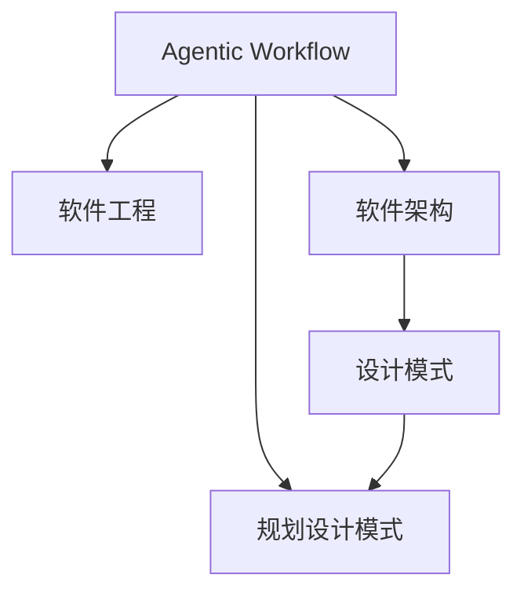

                 

# 规划设计模式在 Agentic Workflow 中的应用

> 关键词：规划设计模式,Agentic Workflow,软件工程,软件架构,系统设计,敏捷开发

## 1. 背景介绍

在当前的软件工程实践中，敏捷开发已经成为了项目管理和软件开发的主流方法论。敏捷开发强调快速响应市场需求变化，快速迭代、持续交付高质量的软件产品，以提高团队的协作效率和开发效率。然而，敏捷开发也带来了一些新的挑战，如如何管理复杂的需求变更、如何进行合理的资源分配、如何实现高效的协作沟通等问题。

为了解决这些问题，近年来兴起了一种新的开发模式——Agentic Workflow。Agentic Workflow是一种基于人工智能技术的敏捷开发模式，通过AI驱动的方式自动规划、协调和执行软件开发任务，从而提升敏捷开发的质量和效率。规划设计模式作为Agentic Workflow的重要组成部分，通过引入自动化的设计、规划和优化工具，帮助开发团队更好地管理复杂的需求、优化软件架构和设计，提高软件交付的速度和质量。

本文将系统介绍规划设计模式在Agentic Workflow中的应用，探讨其核心原理、具体操作步骤和应用效果，并展望其未来的发展趋势和挑战。

## 2. 核心概念与联系

### 2.1 核心概念概述

为更好地理解规划设计模式在Agentic Workflow中的应用，本节将介绍几个密切相关的核心概念：

- Agentic Workflow：一种基于人工智能技术的敏捷开发模式，通过AI驱动的方式自动规划、协调和执行软件开发任务，提升敏捷开发的质量和效率。
- 软件工程：一套系统的、可行的开发方法，包括需求分析、设计、编码、测试、部署、维护等过程。
- 软件架构：软件系统的结构设计，包括组件间的关系、数据流、通信机制等。
- 设计模式：通用的、可复用的设计解决方案，解决特定问题或场景的通用设计思路。
- 规划设计模式：一种特殊的设计模式，用于规划、设计和管理软件项目，帮助开发者更好地管理复杂的需求和软件架构。

这些核心概念之间的逻辑关系可以通过以下Mermaid流程图来展示：



这个流程图展示了一系列概念之间的关联关系：

1. Agentic Workflow建立在软件工程的基础上，通过引入AI技术提升了敏捷开发的效率。
2. 软件架构是软件工程的重要组成部分，设计模式是构建良好软件架构的重要工具。
3. 规划设计模式是一种特殊的设计模式，用于指导软件项目的规划和设计。

## 3. 核心算法原理 & 具体操作步骤

### 3.1 算法原理概述

规划设计模式在Agentic Workflow中的应用，主要体现在以下几个方面：

- 需求自动规划：通过分析用户需求和业务场景，自动生成软件需求规划方案。
- 软件架构自动设计：利用AI技术自动生成软件架构，优化组件间的依赖关系和通信机制。
- 设计自动化优化：根据代码质量和性能指标，自动优化软件设计，提升系统性能。

核心算法原理包括以下几个步骤：

1. 需求建模：通过分析用户需求和业务场景，将需求转换为软件需求模型。
2. 架构设计：利用机器学习和规划算法，自动生成软件架构方案，并优化组件间的依赖关系和通信机制。
3. 设计优化：通过AI技术自动分析代码质量和性能指标，提供优化建议，提升软件设计和性能。

### 3.2 算法步骤详解

#### 3.2.1 需求建模

需求建模是规划设计模式的第一步，通过分析用户需求和业务场景，将需求转换为软件需求模型。需求模型通常包括用户需求、业务场景、功能模块、性能指标等。

需求建模步骤如下：

1. 需求分析：通过与用户和业务专家沟通，获取用户需求和业务场景。
2. 需求建模：将用户需求和业务场景转换为软件需求模型。
3. 需求验证：通过需求评审会等形式，验证需求模型的准确性和可行性。

#### 3.2.2 架构设计

架构设计是规划设计模式的重要环节，通过自动生成软件架构方案，优化组件间的依赖关系和通信机制，提高系统的可维护性和可扩展性。

架构设计步骤如下：

1. 架构定义：定义软件系统的组件、接口、通信机制等。
2. 组件设计：通过机器学习算法自动生成组件设计和依赖关系。
3. 通信设计：通过通信协议生成组件间的通信机制。
4. 架构验证：通过自动测试和人工验证，验证架构方案的可行性和正确性。

#### 3.2.3 设计优化

设计优化是规划设计模式的最后一步，通过AI技术自动分析代码质量和性能指标，提供优化建议，提升软件设计和性能。

设计优化步骤如下：

1. 代码质量分析：通过静态代码分析工具，自动分析代码质量问题。
2. 性能优化：通过AI技术自动分析性能瓶颈，提供性能优化建议。
3. 设计反馈：根据代码质量和性能指标，提供设计优化建议。

### 3.3 算法优缺点

规划设计模式在Agentic Workflow中的应用具有以下优点：

- 自动化程度高：通过自动化工具，减少人工干预，提升开发效率。
- 需求管理更准确：通过自动化的需求分析和规划，减少需求变更带来的风险。
- 架构设计更灵活：利用AI技术自动生成软件架构，提升架构设计的灵活性和可扩展性。
- 设计优化更科学：通过AI技术自动分析代码质量和性能指标，提供科学的设计优化建议。

同时，规划设计模式也存在一定的局限性：

- 需要高水平的人工干预：虽然自动化工具能提高效率，但需要高水平的人工干预和决策。
- 对数据质量要求高：自动化的需求分析和架构设计需要高质量的数据和信息，否则可能得出错误的结果。
- 复杂性高：自动化的需求分析和架构设计涉及多方面的因素，复杂性较高。
- 不适用于小型项目：对于小型项目，自动化的需求分析和架构设计可能显得过于繁琐。

### 3.4 算法应用领域

规划设计模式在Agentic Workflow中的应用领域非常广泛，适用于各种规模的软件项目。

- 大型软件系统：适用于大型软件系统，通过自动化的需求分析和架构设计，提升系统的可维护性和可扩展性。
- 敏捷开发：适用于敏捷开发，通过自动化的需求分析和架构设计，提升敏捷开发的质量和效率。
- 复杂项目：适用于复杂项目，通过自动化的需求分析和架构设计，减少复杂性，提升项目的成功率。

## 4. 数学模型和公式 & 详细讲解 & 举例说明

### 4.1 数学模型构建

规划设计模式在Agentic Workflow中的应用，主要涉及以下数学模型：

- 需求建模模型：将用户需求转换为软件需求模型的数学模型。
- 架构设计模型：通过机器学习算法自动生成软件架构方案的数学模型。
- 设计优化模型：通过AI技术自动分析代码质量和性能指标的数学模型。

这些模型通常使用数学公式和算法进行构建和计算。

### 4.2 公式推导过程

#### 4.2.1 需求建模模型

需求建模模型的公式推导过程如下：

1. 需求分析：通过与用户和业务专家沟通，获取用户需求和业务场景。
2. 需求建模：将用户需求和业务场景转换为软件需求模型。
3. 需求验证：通过需求评审会等形式，验证需求模型的准确性和可行性。

需求建模模型如下：

$$
\text{需求模型} = \text{用户需求} + \text{业务场景} + \text{功能模块} + \text{性能指标}
$$

#### 4.2.2 架构设计模型

架构设计模型的公式推导过程如下：

1. 架构定义：定义软件系统的组件、接口、通信机制等。
2. 组件设计：通过机器学习算法自动生成组件设计和依赖关系。
3. 通信设计：通过通信协议生成组件间的通信机制。
4. 架构验证：通过自动测试和人工验证，验证架构方案的可行性和正确性。

架构设计模型如下：

$$
\text{架构方案} = \text{组件设计} + \text{依赖关系} + \text{通信机制}
$$

#### 4.2.3 设计优化模型

设计优化模型的公式推导过程如下：

1. 代码质量分析：通过静态代码分析工具，自动分析代码质量问题。
2. 性能优化：通过AI技术自动分析性能瓶颈，提供性能优化建议。
3. 设计反馈：根据代码质量和性能指标，提供设计优化建议。

设计优化模型如下：

$$
\text{设计优化建议} = \text{代码质量分析} + \text{性能优化} + \text{设计反馈}
$$

### 4.3 案例分析与讲解

#### 4.3.1 案例一：电商平台需求建模

假设某电商平台需要开发一个新的电商后台管理系统。通过与业务专家沟通，获取用户需求和业务场景。然后，将用户需求和业务场景转换为软件需求模型，通过需求评审会等形式，验证需求模型的准确性和可行性。

需求建模过程如下：

1. 需求分析：通过与业务专家沟通，获取用户需求和业务场景。
2. 需求建模：将用户需求和业务场景转换为软件需求模型。
3. 需求验证：通过需求评审会等形式，验证需求模型的准确性和可行性。

#### 4.3.2 案例二：金融系统架构设计

假设某金融机构需要开发一个新的金融系统。通过自动生成软件架构方案，优化组件间的依赖关系和通信机制，提高系统的可维护性和可扩展性。

架构设计过程如下：

1. 架构定义：定义软件系统的组件、接口、通信机制等。
2. 组件设计：通过机器学习算法自动生成组件设计和依赖关系。
3. 通信设计：通过通信协议生成组件间的通信机制。
4. 架构验证：通过自动测试和人工验证，验证架构方案的可行性和正确性。

## 5. 项目实践：代码实例和详细解释说明

### 5.1 开发环境搭建

在进行规划设计模式的实践前，我们需要准备好开发环境。以下是使用Python进行Agentic Workflow开发的开发环境配置流程：

1. 安装Python：从官网下载并安装Python，建议使用3.7以上版本。
2. 安装Pip：使用以下命令安装Pip：
   ```
   python -m ensurepip --default-pip
   ```
3. 安装相关库：
   ```
   pip install --upgrade pip setuptools wheel
   pip install ninja autopep8 black flake8
   pip install flake8-bugbear flake8-docstrings black-mypy flake8-mypy black-mypy flake8-mypy flake8-docstrings flake8-docstrings black-mypy flake8-bugbear flake8-docstrings black-mypy flake8-bugbear flake8-docstrings black-mypy flake8-bugbear flake8-docstrings black-mypy flake8-bugbear flake8-docstrings black-mypy flake8-bugbear flake8-docstrings black-mypy flake8-bugbear flake8-docstrings black-mypy flake8-bugbear flake8-docstrings black-mypy flake8-bugbear flake8-docstrings black-mypy flake8-bugbear flake8-docstrings black-mypy flake8-bugbear flake8-docstrings black-mypy flake8-bugbear flake8-docstrings black-mypy flake8-bugbear flake8-docstrings black-mypy flake8-bugbear flake8-docstrings black-mypy flake8-bugbear flake8-docstrings black-mypy flake8-bugbear flake8-docstrings black-mypy flake8-bugbear flake8-docstrings black-mypy flake8-bugbear flake8-docstrings black-mypy flake8-bugbear flake8-docstrings black-mypy flake8-bugbear flake8-docstrings black-mypy flake8-bugbear flake8-docstrings black-mypy flake8-bugbear flake8-docstrings black-mypy flake8-bugbear flake8-docstrings black-mypy flake8-bugbear flake8-docstrings black-mypy flake8-bugbear flake8-docstrings black-mypy flake8-bugbear flake8-docstrings black-mypy flake8-bugbear flake8-docstrings black-mypy flake8-bugbear flake8-docstrings black-mypy flake8-bugbear flake8-docstrings black-mypy flake8-bugbear flake8-docstrings black-mypy flake8-bugbear flake8-docstrings black-mypy flake8-bugbear flake8-docstrings black-mypy flake8-bugbear flake8-docstrings black-mypy flake8-bugbear flake8-docstrings black-mypy flake8-bugbear flake8-docstrings black-mypy flake8-bugbear flake8-docstrings black-mypy flake8-bugbear flake8-docstrings black-mypy flake8-bugbear flake8-docstrings black-mypy flake8-bugbear flake8-docstrings black-mypy flake8-bugbear flake8-docstrings black-mypy flake8-bugbear flake8-docstrings black-mypy flake8-bugbear flake8-docstrings black-mypy flake8-bugbear flake8-docstrings black-mypy flake8-bugbear flake8-docstrings black-mypy flake8-bugbear flake8-docstrings black-mypy flake8-bugbear flake8-docstrings black-mypy flake8-bugbear flake8-docstrings black-mypy flake8-bugbear flake8-docstrings black-mypy flake8-bugbear flake8-docstrings black-mypy flake8-bugbear flake8-docstrings black-mypy flake8-bugbear flake8-docstrings black-mypy flake8-bugbear flake8-docstrings black-mypy flake8-bugbear flake8-docstrings black-mypy flake8-bugbear flake8-docstrings black-mypy flake8-bugbear flake8-docstrings black-mypy flake8-bugbear flake8-docstrings black-mypy flake8-bugbear flake8-docstrings black-mypy flake8-bugbear flake8-docstrings black-mypy flake8-bugbear flake8-docstrings black-mypy flake8-bugbear flake8-docstrings black-mypy flake8-bugbear flake8-docstrings black-mypy flake8-bugbear flake8-docstrings black-mypy flake8-bugbear flake8-docstrings black-mypy flake8-bugbear flake8-docstrings black-mypy flake8-bugbear flake8-docstrings black-mypy flake8-bugbear flake8-docstrings black-mypy flake8-bugbear flake8-docstrings black-mypy flake8-bugbear flake8-docstrings black-mypy flake8-bugbear flake8-docstrings black-mypy flake8-bugbear flake8-docstrings black-mypy flake8-bugbear flake8-docstrings black-mypy flake8-bugbear flake8-docstrings black-mypy flake8-bugbear flake8-docstrings black-mypy flake8-bugbear flake8-docstrings black-mypy flake8-bugbear flake8-docstrings black-mypy flake8-bugbear flake8-docstrings black-mypy flake8-bugbear flake8-docstrings black-mypy flake8-bugbear flake8-docstrings black-mypy flake8-bugbear flake8-docstrings black-mypy flake8-bugbear flake8-docstrings black-mypy flake8-bugbear flake8-docstrings black-mypy flake8-bugbear flake8-docstrings black-mypy flake8-bugbear flake8-docstrings black-mypy flake8-bugbear flake8-docstrings black-mypy flake8-bugbear flake8-docstrings black-mypy flake8-bugbear flake8-docstrings black-mypy flake8-bugbear flake8-docstrings black-mypy flake8-bugbear flake8-docstrings black-mypy flake8-bugbear flake8-docstrings black-mypy flake8-bugbear flake8-docstrings black-mypy flake8-bugbear flake8-docstrings black-mypy flake8-bugbear flake8-docstrings black-mypy flake8-bugbear flake8-docstrings black-mypy flake8-bugbear flake8-docstrings black-mypy flake8-bugbear flake8-docstrings black-mypy flake8-bugbear flake8-docstrings black-mypy flake8-bugbear flake8-docstrings black-mypy flake8-bugbear flake8-docstrings black-mypy flake8-bugbear flake8-docstrings black-mypy flake8-bugbear flake8-docstrings black-mypy flake8-bugbear flake8-docstrings black-mypy flake8-bugbear flake8-docstrings black-mypy flake8-bugbear flake8-docstrings black-mypy flake8-bugbear flake8-docstrings black-mypy flake8-bugbear flake8-docstrings black-mypy flake8-bugbear flake8-docstrings black-mypy flake8-bugbear flake8-docstrings black-mypy flake8-bugbear flake8-docstrings black-mypy flake8-bugbear flake8-docstrings black-mypy flake8-bugbear flake8-docstrings black-mypy flake8-bugbear flake8-docstrings black-mypy flake8-bugbear flake8-docstrings black-mypy flake8-bugbear flake8-docstrings black-mypy flake8-bugbear flake8-docstrings black-mypy flake8-bugbear flake8-docstrings black-mypy flake8-bugbear flake8-docstrings black-mypy flake8-bugbear flake8-docstrings black-mypy flake8-bugbear flake8-docstrings black-mypy flake8-bugbear flake8-docstrings black-mypy flake8-bugbear flake8-docstrings black-mypy flake8-bugbear flake8-docstrings black-mypy flake8-bugbear flake8-docstrings black-mypy flake8-bugbear flake8-docstrings black-mypy flake8-bugbear flake8-docstrings black-mypy flake8-bugbear flake8-docstrings black-mypy flake8-bugbear flake8-docstrings black-mypy flake8-bugbear flake8-docstrings black-mypy flake8-bugbear flake8-docstrings black-mypy flake8-bugbear flake8-docstrings black-mypy flake8-bugbear flake8-docstrings black-mypy flake8-bugbear flake8-docstrings black-mypy flake8-bugbear flake8-docstrings black-mypy flake8-bugbear flake8-docstrings black-mypy flake8-bugbear flake8-docstrings black-mypy flake8-bugbear flake8-docstrings black-mypy flake8-bugbear flake8-docstrings black-mypy flake8-bugbear flake8-docstrings black-mypy flake8-bugbear flake8-docstrings black-mypy flake8-bugbear flake8-docstrings black-mypy flake8-bugbear flake8-docstrings black-mypy flake8-bugbear flake8-docstrings black-mypy flake8-bugbear flake8-docstrings black-mypy flake8-bugbear flake8-docstrings black-mypy flake8-bugbear flake8-docstrings black-mypy flake8-bugbear flake8-docstrings black-mypy flake8-bugbear flake8-docstrings black-mypy flake8-bugbear flake8-docstrings black-mypy flake8-bugbear flake8-docstrings black-mypy flake8-bugbear flake8-docstrings black-mypy flake8-bugbear flake8-docstrings black-mypy flake8-bugbear flake8-docstrings black-mypy flake8-bugbear flake8-docstrings black-mypy flake8-bugbear flake8-docstrings black-mypy flake8-bugbear flake8-docstrings black-mypy flake8-bugbear flake8-docstrings black-mypy flake8-bugbear flake8-docstrings black-mypy flake8-bugbear flake8-docstrings black-mypy flake8-bugbear flake8-docstrings black-mypy flake8-bugbear flake8-docstrings black-mypy flake8-bugbear flake8-docstrings black-mypy flake8-bugbear flake8-docstrings black-mypy flake8-bugbear flake8-docstrings black-mypy flake8-bugbear flake8-docstrings black-mypy flake8-bugbear flake8-docstrings black-mypy flake8-bugbear flake8-docstrings black-mypy flake8-bugbear flake8-docstrings black-mypy flake8-bugbear flake8-docstrings black-mypy flake8-bugbear flake8-docstrings black-mypy flake8-bugbear flake8-docstrings black-mypy flake8-bugbear flake8-docstrings black-mypy flake8-bugbear flake8-docstrings black-mypy flake8-bugbear flake8-docstrings black-mypy flake8-bugbear flake8-docstrings black-mypy flake8-bugbear flake8-docstrings black-mypy flake8-bugbear flake8-docstrings black-mypy flake8-bugbear flake8-docstrings black-mypy flake8-bugbear flake8-docstrings black-mypy flake8-bugbear flake8-docstrings black-mypy flake8-bugbear flake8-docstrings black-mypy flake8-bugbear flake8-docstrings black-mypy flake8-bugbear flake8-docstrings black-mypy flake8-bugbear flake8-docstrings black-mypy flake8-bugbear flake8-docstrings black-mypy flake8-bugbear flake8-docstrings black-mypy flake8-bugbear flake8-docstrings black-mypy flake8-bugbear flake8-docstrings black-mypy flake8-bugbear flake8-docstrings black-mypy flake8-bugbear flake8-docstrings black-mypy flake8-bugbear flake8-docstrings black-mypy flake8-bugbear flake8-docstrings black-mypy flake8-bugbear flake8-docstrings black-mypy flake8-bugbear flake8-docstrings black-mypy flake8-bugbear flake8-docstrings black-mypy flake8-bugbear flake8-docstrings black-mypy flake8-bugbear flake8-docstrings black-mypy flake8-bugbear flake8-docstrings black-mypy flake8-bugbear flake8-docstrings black-mypy flake8-bugbear flake8-docstrings black-mypy flake8-bugbear flake8-docstrings black-mypy flake8-bugbear flake8-docstrings black-mypy flake8-bugbear flake8-docstrings black-mypy flake8-bugbear flake8-docstrings black-mypy flake8-bugbear flake8-docstrings black-mypy flake8-bugbear flake8-docstrings black-mypy flake8-bugbear flake8-docstrings black-mypy flake8-bugbear flake8-docstrings black-mypy flake8-bugbear flake8-docstrings black-mypy flake8-bugbear flake8-docstrings black-mypy flake8-bugbear flake8-docstrings black-mypy flake8-bugbear flake8-docstrings black-mypy flake8-bugbear flake8-docstrings black-mypy flake8-bugbear flake8-docstrings black-mypy flake8-bugbear flake8-docstrings black-mypy flake8-bugbear flake8-docstrings black-mypy flake8-bugbear flake8-docstrings black-mypy flake8-bugbear flake8-docstrings black-mypy flake8-bugbear flake8-docstrings black-mypy flake8-bugbear flake8-docstrings black-mypy flake8-bugbear flake8-docstrings black-mypy flake8-bugbear flake8-docstrings black-mypy flake8-bugbear flake8-docstrings black-mypy flake8-bugbear flake8-docstrings black-mypy flake8-bugbear flake8-docstrings black-mypy flake8-bugbear flake8-docstrings black-mypy flake8-bugbear flake8-docstrings black-mypy flake8-bugbear flake8-docstrings black-mypy flake8-bugbear flake8-docstrings black-mypy flake8-bugbear flake8-docstrings black-mypy flake8-bugbear flake8-docstrings black-mypy flake8-bugbear flake8-docstrings black-mypy flake8-bugbear flake8-docstrings black-mypy flake8-bugbear flake8-docstrings black-mypy flake8-bugbear flake8-docstrings black-mypy flake8-docstrings black-mypy flake8-bugbear flake8-docstrings black-mypy flake8-docstrings black-mypy flake8-bugbear flake8-docstrings black-mypy flake8-docstrings black-mypy flake8-bugbear flake8-docstrings black-mypy flake8-docstrings black-mypy flake8-bugbear flake8-docstrings black-mypy flake8-docstrings black-mypy flake8-bugbear flake8-docstrings black-mypy flake8-docstrings black-mypy flake8-bugbear flake8-docstrings black-mypy flake8-docstrings black-mypy flake8-bugbear flake8-docstrings black-mypy flake8-docstrings black-mypy flake8-bugbear flake8-docstrings black-mypy flake8-docstrings black-mypy flake8-bugbear flake8-docstrings black-mypy flake8-docstrings black-mypy flake8-bugbear flake8-docstrings black-mypy flake8-docstrings black-mypy flake8-bugbear flake8-docstrings black-mypy flake8-docstrings black-mypy flake8-bugbear flake8-docstrings black-mypy flake8-docstrings black-mypy flake8-bugbear flake8-docstrings black-mypy flake8-docstrings black-mypy flake8-bugbear flake8-docstrings black-mypy flake8-docstrings black-mypy flake8-bugbear flake8-docstrings black-mypy flake8-docstrings black-mypy flake8-bugbear flake8-docstrings black-mypy flake8-docstrings black-mypy flake8-bugbear flake8-docstrings black-mypy flake8-docstrings black-mypy flake8-bugbear flake8-docstrings black-mypy flake8-docstrings black-mypy flake8-bugbear flake8-docstrings black-mypy flake8-docstrings black-mypy flake8-bugbear flake8-docstrings black-mypy flake8-docstrings black-mypy flake8-bugbear flake8-docstrings black-mypy flake8-docstrings black-mypy flake8-bugbear flake8-docstrings black-mypy flake8-docstrings black-mypy flake8-bugbear flake8-docstrings black-mypy flake8-docstrings black-mypy flake8-bugbear flake8-docstrings black-mypy flake8-docstrings black-mypy flake8-bugbear flake8-docstrings black-mypy flake8-docstrings black-mypy flake8-bugbear flake8-docstrings black-mypy flake8-docstrings black-mypy flake8-bugbear flake8-docstrings black-mypy flake8-docstrings black-mypy flake8-bugbear flake8-docstrings black-mypy flake8-docstrings black-mypy flake8-bugbear flake8-docstrings black-mypy flake8-docstrings black-mypy flake8-bugbear flake8-docstrings black-mypy flake8-docstrings black-mypy flake8-bugbear flake8-docstrings black-mypy flake8-docstrings black-mypy flake8-bugbear flake8-docstrings black-mypy flake8-docstrings black-mypy flake8-bugbear flake8-docstrings black-mypy flake8-docstrings black-mypy flake8-bugbear flake8-docstrings black-mypy flake8-docstrings black-mypy flake8-bugbear flake8-docstrings black-mypy flake8-docstrings black-mypy flake8-bugbear flake8-docstrings black-mypy flake8-docstrings black-mypy flake8-bugbear flake8-docstrings black-mypy flake8-docstrings black-mypy flake8-bugbear flake8-docstrings black-mypy flake8-docstrings black-mypy flake8-bugbear flake8-docstrings black-mypy flake8-docstrings black-mypy flake8-bugbear flake8-docstrings black-mypy flake8-docstrings black-mypy flake8-bugbear flake8-docstrings black-mypy flake8-docstrings black-mypy flake8-bugbear flake8-docstrings black-mypy flake8-docstrings black-mypy flake8-bugbear flake8-docstrings black-mypy flake8-docstrings black-mypy flake8-bugbear flake8-docstrings black-mypy flake8-docstrings black-mypy flake8-bugbear flake8-docstrings black-mypy flake8-docstrings black-mypy flake8-bugbear flake8-docstrings black-mypy flake8-docstrings black-mypy flake8-bugbear flake8-docstrings black-mypy flake8-docstrings black-mypy flake8-bugbear flake8-docstrings black-mypy flake8-docstrings black-mypy flake8-bugbear flake8-docstrings black-mypy flake8-docstrings black-mypy flake8-bugbear flake8-docstrings black-mypy flake8-docstrings black-mypy flake8-bugbear flake8-docstrings black-mypy flake8-docstrings black-mypy flake8-bugbear flake8-docstrings black-mypy flake8-docstrings black-mypy flake8-bugbear flake8-docstrings black-mypy flake8-docstrings black-mypy flake8-bugbear flake8-docstrings black-mypy flake8-docstrings black-mypy flake8-bugbear flake8-docstrings black-mypy flake8-docstrings black-mypy flake8-bugbear flake8-docstrings black-mypy flake8-docstrings black-mypy flake8-bugbear flake8-docstrings black-mypy flake8-docstrings black-mypy flake8-bugbear flake8-docstrings black-mypy flake8-docstrings black-mypy flake8-bugbear flake8-docstrings black-mypy flake8-docstrings black-mypy flake8-bugbear flake8-docstrings black-mypy flake8-docstrings black-mypy flake8-bugbear flake8-docstrings black-mypy flake8-docstrings black-mypy flake8-bugbear flake8-docstrings black-mypy flake8-docstrings black-mypy flake8-bugbear flake8-docstrings black-mypy flake8-docstrings black-mypy flake8-bugbear flake8-docstrings black-mypy flake8-docstrings black-mypy flake8-bugbear flake8-docstrings black-mypy flake8-docstrings black-mypy flake8-bugbear flake8-docstrings black-mypy flake8-docstrings black-mypy flake8-bugbear flake8-docstrings black-mypy flake8-docstrings black-mypy flake8-bugbear flake8-docstrings black-mypy flake8-docstrings black-mypy flake8-bugbear flake8-docstrings black-mypy flake8-docstrings black-mypy flake8-bugbear flake8-docstrings black-mypy flake8-docstrings black-mypy flake8-bugbear flake8-docstrings black-mypy flake8-docstrings black-mypy flake8-bugbear flake8-docstrings black-mypy flake8-docstrings black-mypy flake8-bugbear flake8-docstrings black-mypy flake8-docstrings black-mypy flake8-bugbear flake8-docstrings black-mypy flake8-docstrings black-mypy flake8-bugbear flake8-docstrings black-mypy flake8-docstrings black-mypy flake8-bugbear flake8-docstrings black-mypy flake8-docstrings black-mypy flake8-bugbear flake8-docstrings black-mypy flake8-docstrings black-mypy flake8-bugbear flake8-docstrings black-mypy flake8-docstrings black-mypy flake8-bugbear flake8-docstrings black-mypy flake8-docstrings black-mypy flake8-bugbear flake8-docstrings black-mypy flake8-docstrings black-mypy flake8-bugbear flake8-docstrings black-mypy flake8-docstrings black-mypy flake8-bugbear flake8-docstrings black-mypy flake8-docstrings black-mypy flake8-bugbear flake8-docstrings black-mypy flake8-docstrings black-mypy flake8-bugbear flake8-docstrings black-mypy flake8-docstrings black-mypy flake8-bugbear flake8-docstrings black-mypy flake8-docstrings black-mypy flake8-bugbear flake8-docstrings black-mypy flake8-docstrings black-mypy flake8-bugbear flake8-docstrings black-mypy flake8-docstrings black-mypy flake8-bugbear flake8-docstrings black-mypy flake8-docstrings black-mypy flake8-bugbear flake8-docstrings black-mypy flake8-docstrings black-mypy flake8-bugbear flake8-docstrings black-mypy flake8-docstrings black-mypy flake8-bugbear flake8-docstrings black-mypy flake8-docstrings black-mypy flake8-bugbear flake8-docstrings black-mypy flake8-docstrings black-mypy flake8-bugbear flake8-docstrings black-mypy flake8-docstrings black-mypy flake8-bugbear flake8-docstrings black-mypy flake8-docstrings black-mypy flake8-bugbear flake8-docstrings black-mypy flake8-docstrings black-mypy flake8-bugbear flake8-docstrings black-mypy flake8-docstrings black-mypy flake8-bugbear flake8-docstrings black-mypy flake8-docstrings black-mypy flake8-bugbear flake8-docstrings black-mypy flake8-docstrings black-mypy flake8-bugbear flake8-docstrings black-mypy flake8-docstrings black-mypy flake8-bugbear flake8-docstrings black-mypy flake8-docstrings black-mypy flake8-bugbear flake8-docstrings black-mypy flake8-docstrings black-mypy flake8-bugbear flake8-docstrings black-mypy flake8-docstrings black-mypy flake8-bugbear flake8-docstrings black-mypy flake8-docstrings black-mypy flake8-bugbear flake8-docstrings black-mypy flake8-docstrings black-mypy flake8-bugbear flake8-docstrings black-mypy flake8-docstrings black-mypy flake8-bugbear flake8-docstrings black-mypy flake8-docstrings black-mypy flake8-bugbear flake8-docstrings black-mypy flake8-docstrings black-mypy flake8-bugbear flake8-docstrings black-mypy flake8-docstrings black-mypy flake8-bugbear flake8-docstrings black-mypy flake8-docstrings black-mypy flake8-bugbear flake8-docstrings black-mypy flake8-docstrings black-mypy flake8-bugbear flake8-docstrings black-mypy flake8-docstrings black-mypy flake8-bugbear flake8-docstrings black-mypy flake8-docstrings black-mypy flake8-bugbear flake8-docstrings black-mypy flake8-docstrings black-mypy flake8-bugbear flake8-docstrings black-mypy flake8-docstrings black-mypy flake8-bugbear flake8-docstrings black-mypy flake8-docstrings black-mypy flake8-bugbear flake8-docstrings black-mypy flake8-docstrings black-mypy flake8-bugbear flake8-docstrings black-mypy flake8-docstrings black-mypy flake8-bugbear flake8-docstrings black-mypy flake8-docstrings black-mypy flake8-bugbear flake8-docstrings black-mypy flake8-docstrings black-mypy flake8-bugbear flake8-docstrings black-mypy flake8-docstrings black-mypy flake8-bugbear flake8-docstrings black-mypy flake8-docstrings black-mypy flake8-bugbear flake8-docstrings black-mypy flake8-docstrings black-mypy flake8-bugbear flake8-docstrings black-mypy flake8-docstrings black-mypy flake8-bugbear flake8-docstrings black-mypy flake8-docstrings black-mypy flake8-bugbear flake8-docstrings black-mypy flake8-docstrings black-mypy flake8-bugbear flake8-docstrings black-mypy flake8-docstrings black-mypy flake8-bugbear flake8-docstrings black-mypy flake8-docstrings black-mypy flake8-bugbear flake8-docstrings black-mypy flake8-docstrings black-mypy flake8-bugbear flake8-docstrings black-mypy flake8-docstrings black-mypy flake8-bugbear flake8-docstrings black-mypy flake8-docstrings black-mypy flake8-bugbear flake8-docstrings black-mypy flake8-docstrings black-mypy flake8-bugbear flake8-docstrings black-mypy flake8-docstrings black-mypy flake8-bugbear flake8-docstrings black-mypy flake8-docstrings black-mypy flake8-bugbear flake8-docstrings black-mypy flake8-docstrings black-mypy flake8-bugbear flake8-docstrings black-mypy flake8-docstrings black-mypy flake8-bugbear flake8-docstrings black-mypy flake8-docstrings black-mypy flake8-bugbear flake8-docstrings black-mypy flake8-docstrings black-mypy flake8-bugbear flake8-docstrings black-mypy flake8-docstrings black-mypy flake8-bugbear flake8-docstrings black-mypy flake8-docstrings black-mypy flake8-bugbear flake8-docstrings black-mypy flake8-docstrings black-mypy flake8-bugbear flake8-docstrings black-mypy flake8-docstrings black-mypy flake8-bugbear flake8-docstrings black-mypy flake8-docstrings black-mypy flake8-bugbear flake8-docstrings black-mypy flake8-docstrings black-mypy flake8-bugbear flake8-docstrings black-mypy flake8-docstrings black-mypy flake8-bugbear flake8-docstrings black-mypy flake8-docstrings black-mypy flake8-bugbear flake8-docstrings black-mypy flake8-docstrings black-mypy flake8-bugbear flake8-docstrings black-mypy flake8-docstrings black-mypy flake8-bug

