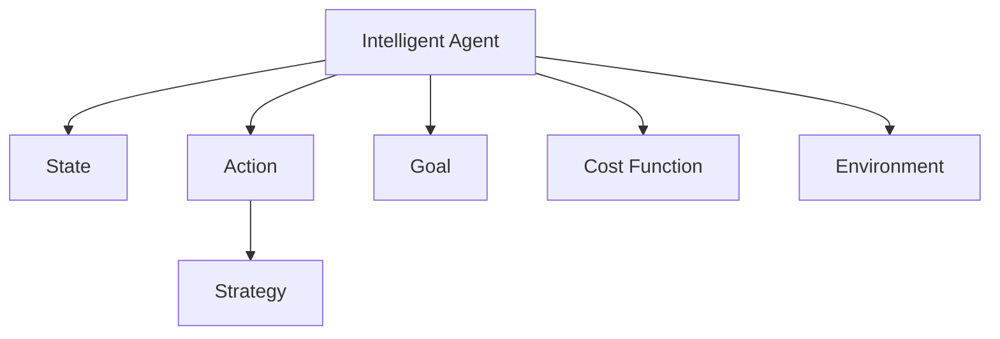

                 

# 规划（Planning）是指Agent为了某一目标而作出的决策过程

## 1. 背景介绍

### 1.1 问题由来
在人工智能领域，规划（Planning）被广泛认为是智能体的核心能力之一。它指智能体在一定环境条件下，通过预先制定的目标，通过一系列决策和行动，逐步推进达到目标的过程。规划能力在各种场景中都有重要应用，如机器人导航、调度系统、任务管理等。

规划问题复杂多样，不同类型的规划问题有不同的解决思路和方法。但所有规划问题都要求智能体能够理解任务目标、环境特征和行动约束，并能够在此基础上选择最优的行动策略，实现目标。

### 1.2 问题核心关键点
规划问题一般具有以下几个核心关键点：
- 目标表示：任务的目标如何表达，是明确的还是模糊的。
- 状态表示：当前环境状态如何表示，是全局还是局部的。
- 行动空间：智能体可行的行动集合是什么，是连续的还是离散的。
- 动态特征：环境是否可变，行动后状态如何更新。
- 约束条件：行动是否受限于其他条件，如时间、资源等。
- 优化目标：规划的目标是什么，是最大优化还是最小化。

在规划问题中，智能体的目标是找出一条从当前状态出发，达到目标状态的路径，使得路径上的某些属性（如代价、时间等）最小化或最大化。解决规划问题通常包括以下几个步骤：建模、搜索、优化等。

## 2. 核心概念与联系

### 2.1 核心概念概述

为了更好地理解规划问题，本节将介绍几个密切相关的核心概念：

- 智能体（Agent）：智能体是规划中的决策主体，它能够在环境中执行行动，并根据观察到的反馈信息进行决策调整。
- 状态（State）：智能体在规划过程中的状态，表示当前环境的特性。
- 目标（Goal）：智能体想要达到的最终状态。
- 行动（Action）：智能体能够执行的操作。
- 策略（Strategy）：智能体选择行动的规则或方法，通常通过算法实现。
- 代价函数（Cost Function）：用于量化行动方案的优劣，是规划问题的优化目标。
- 环境（Environment）：智能体执行行动的外部世界，由状态空间、行动空间、观察函数、奖惩函数等组成。

这些核心概念之间的逻辑关系可以通过以下Mermaid流程图来展示：



这个流程图展示了智能体和环境、状态、目标、行动、策略、代价函数等概念之间的联系。通过理解这些核心概念，我们可以更好地把握规划问题的本质。

## 3. 核心算法原理 & 具体操作步骤

### 3.1 算法原理概述

规划问题的核心思想是：智能体通过选择行动，逐步推进到目标状态，使得行动后的代价函数值最小化或最大化。形式化地，设智能体当前状态为 $s_t$，可行的行动空间为 $A_t$，代价函数为 $C(s_t, a_t)$，则规划问题可描述为：

$$
\arg\min_a \sum_{t=0}^T C(s_t, a_t)
$$

其中 $T$ 为规划的终止时间或状态，$C$ 表示行动后的代价，$\sum$ 表示从初始状态 $s_0$ 到终止状态 $s_T$ 的代价总和。

为了解决这一问题，我们需要设计一系列的算法和策略，对行动空间进行搜索，找出最优的行动序列。常见的规划算法包括搜索算法（如深度优先搜索、A*算法等）和优化算法（如动态规划、强化学习等）。

### 3.2 算法步骤详解

解决规划问题通常包括以下几个关键步骤：

**Step 1: 问题建模**

- 定义状态空间 $S$ 和行动空间 $A$。
- 描述状态之间的转移关系 $P(s_{t+1}|s_t, a_t)$。
- 定义目标状态 $s_T$ 和终止条件 $T$。
- 设计代价函数 $C(s_t, a_t)$。

**Step 2: 搜索或优化**

- 选择合适的搜索算法（如深度优先搜索、广度优先搜索、A*算法等），或优化算法（如动态规划、强化学习等）。
- 根据当前状态和代价函数，计算后续状态的代价。
- 根据代价函数，评估行动的优劣，选择最优行动。
- 重复迭代，直至达到目标状态或满足终止条件。

**Step 3: 策略迭代**

- 根据搜索或优化的结果，生成最优行动序列。
- 根据行动序列，更新状态空间和行动空间。
- 重复迭代，逐步改进策略。

### 3.3 算法优缺点

规划算法具有以下优点：
1. 能够处理动态变化的环境。通过搜索或优化算法，智能体可以在变化的环境中找到最优行动。
2. 能够处理复杂的约束条件。规划算法能够同时考虑多种约束条件，如时间、资源、安全性等。
3. 能够处理不确定性。规划算法可以处理多种不确定性来源，如传感器噪声、随机事件等。

同时，规划算法也存在一定的局限性：
1. 复杂度高。规划问题通常具有较高的复杂度，搜索或优化算法需要消耗大量的计算资源。
2. 存在局部最优。搜索或优化算法可能陷入局部最优，无法找到全局最优解。
3. 难以处理大规模问题。对于大规模的规划问题，搜索或优化算法的时间复杂度可能难以接受。

尽管存在这些局限性，但就目前而言，规划算法仍然是解决许多复杂规划问题的重要手段。未来相关研究的重点在于如何进一步降低复杂度、提高效率，同时兼顾可解释性和伦理安全性等因素。

### 3.4 算法应用领域

规划算法在人工智能领域的应用非常广泛，涵盖多个领域，例如：

- 机器人导航：如路径规划、避障、目标追踪等。通过规划算法，机器人能够选择最优的行动路径，避免障碍并达到目标。
- 调度系统：如任务调度、车辆调度等。规划算法能够优化资源配置，最大化系统效率。
- 任务管理：如项目管理、物资分配等。规划算法能够优化任务流程，最小化时间和资源成本。
- 可穿戴设备：如智能手环、智能手表等。通过规划算法，设备能够根据用户的活动和环境信息，推荐最优的行动方案。

除了上述这些经典应用外，规划算法还被创新性地应用于更多场景中，如无人机飞行、智能家居、金融交易等，为人工智能技术落地应用提供了新的可能。

## 4. 数学模型和公式 & 详细讲解 & 举例说明

### 4.1 数学模型构建

本节将使用数学语言对规划问题进行更加严格的刻画。

假设智能体的行动空间 $A$ 为离散集，设状态空间 $S$ 为连续集。智能体从当前状态 $s_t$ 出发，执行行动 $a_t$，到达新状态 $s_{t+1}$，代价为 $C(s_t, a_t)$。设目标状态为 $s_T$，终止时间为 $T$。则规划问题可表示为：

$$
\arg\min_a \sum_{t=0}^T C(s_t, a_t)
$$

其中 $s_t$ 表示智能体在时间 $t$ 的状态，$a_t$ 表示智能体在时间 $t$ 的行动，$C(s_t, a_t)$ 表示智能体在时间 $t$ 的代价，$T$ 表示规划的终止时间或状态。

### 4.2 公式推导过程

为了求解上述规划问题，我们可以使用动态规划（Dynamic Programming, DP）算法。DP算法通过将原问题分解为多个子问题，逐层求解，最终得到全局最优解。以下是DP算法的详细步骤：

**Step 1: 定义状态**

设 $V(s)$ 表示到达状态 $s$ 的最小代价。则有：

$$
V(s) = \min_a C(s, a) + \min_{s'} V(s')
$$

其中 $C(s, a)$ 表示从状态 $s$ 出发执行行动 $a$ 到达状态 $s'$ 的代价，$V(s')$ 表示到达状态 $s'$ 的最小代价。

**Step 2: 计算状态转移**

使用迭代法计算状态转移，具体步骤如下：

1. 初始化：设 $V(s_0) = 0$，表示从初始状态 $s_0$ 到达自身的代价为0。
2. 迭代：从 $s_1$ 到 $s_T$，依次计算每个状态的最小代价，更新 $V(s)$。
3. 输出：最终得到 $V(s_T)$，即到达目标状态 $s_T$ 的最小代价。

### 4.3 案例分析与讲解

以一个简单的路径规划问题为例，展示DP算法的使用：

假设智能体当前位于点 $(1, 1)$，可向上、下、左、右四个方向移动，每个方向移动代价为1，目标状态为 $(3, 3)$。设 $V(s)$ 表示从初始状态 $(0, 0)$ 到状态 $s$ 的最小代价。则有：

$$
\begin{aligned}
V(1, 1) &= \min_{a} (C(1, 1, a) + V(1, 2)) \\
V(1, 2) &= \min_{a} (C(1, 2, a) + V(2, 2)) \\
V(2, 2) &= \min_{a} (C(2, 2, a) + V(3, 2)) \\
V(3, 2) &= \min_{a} (C(3, 2, a) + V(3, 3)) \\
V(3, 3) &= 0
\end{aligned}
$$

其中 $C(s, a, s')$ 表示从状态 $s$ 出发执行行动 $a$ 到达状态 $s'$ 的代价。根据上述公式，计算得到：

$$
\begin{aligned}
V(1, 1) &= \min_{a} (1 + V(1, 2)) = 2 \\
V(1, 2) &= \min_{a} (1 + V(2, 2)) = 2 \\
V(2, 2) &= \min_{a} (1 + V(3, 2)) = 3 \\
V(3, 2) &= \min_{a} (1 + V(3, 3)) = 1 \\
V(3, 3) &= 0
\end{aligned}
$$

最终得到 $V(3, 3) = 1$，即从初始状态 $(0, 0)$ 到目标状态 $(3, 3)$ 的最小代价为1。

## 5. 项目实践：代码实例和详细解释说明

### 5.1 开发环境搭建

在进行规划算法实践前，我们需要准备好开发环境。以下是使用Python进行Rosetta算法（一种经典的动态规划算法）的开发环境配置流程：

1. 安装Anaconda：从官网下载并安装Anaconda，用于创建独立的Python环境。

2. 创建并激活虚拟环境：
```bash
conda create -n dp-env python=3.8 
conda activate dp-env
```

3. 安装PyTorch：根据CUDA版本，从官网获取对应的安装命令。例如：
```bash
conda install pytorch torchvision torchaudio cudatoolkit=11.1 -c pytorch -c conda-forge
```

4. 安装Numpy、Pandas等工具包：
```bash
pip install numpy pandas scipy matplotlib scikit-learn tqdm jupyter notebook ipython
```

完成上述步骤后，即可在`dp-env`环境中开始规划算法实践。

### 5.2 源代码详细实现

这里我们以路径规划问题为例，给出使用Python实现Rosetta算法的代码实现。

首先，定义状态转移矩阵和代价矩阵：

```python
import numpy as np

# 定义状态转移矩阵
P = np.array([
    [0, 1, 1, 1, 1],
    [1, 0, 1, 1, 1],
    [1, 1, 0, 1, 1],
    [1, 1, 1, 0, 1],
    [1, 1, 1, 1, 0]
])

# 定义代价矩阵
C = np.array([
    [0, 1, 1, 1, 1],
    [1, 0, 1, 1, 1],
    [1, 1, 0, 1, 1],
    [1, 1, 1, 0, 1],
    [1, 1, 1, 1, 0]
])
```

然后，定义Rosetta算法的实现：

```python
def rosetta_planning(P, C, s0, st):
    V = np.zeros(st + 1)
    V[s0] = 0
    for i in range(st, 0, -1):
        V[i] = np.min(C[i, :] + P[i, :] * V)
    return V[st]

# 求解路径规划问题
st = 3
s0 = 0
V = rosetta_planning(P, C, s0, st)
print("到达目标状态的最小代价为：", V)
```

在Rosetta算法中，我们使用动态规划的思想，通过迭代计算各个状态的最小代价，最终得到目标状态的最小代价。

### 5.3 代码解读与分析

让我们再详细解读一下关键代码的实现细节：

**Rosetta算法**：
- 定义状态转移矩阵 `P` 和代价矩阵 `C`。状态转移矩阵表示智能体在每个状态下的行动选择，代价矩阵表示行动的代价。
- 定义状态 $s_t$ 到目标状态 $s_T$ 的最小代价 $V(s_t)$。
- 初始化状态 $s_0$ 到自身的代价 $V(s_0) = 0$。
- 迭代计算每个状态的最小代价，更新 $V(s_t)$。
- 最终输出到达目标状态 $s_T$ 的最小代价 $V(s_T)$。

在实际应用中，我们需要根据具体问题的状态转移矩阵和代价矩阵，设计合适的算法和数据结构，才能高效求解最优解。

## 6. 实际应用场景

### 6.1 智能机器人导航

智能机器人导航是规划算法的重要应用之一。机器人需要在复杂多变的地形中导航到达目标位置，规划算法能够帮助机器人选择最优路径，避免碰撞并达到目标。

在实际应用中，可以通过构建地形图和障碍物信息，设计状态转移和代价函数，将机器人导航问题转化为规划问题，使用搜索或优化算法求解最优路径。通过规划算法，机器人能够实时更新地图信息，动态调整行动策略，适应环境变化。

### 6.2 自动驾驶

自动驾驶技术中，规划算法用于决策路径和速度控制，确保车辆安全和舒适行驶。规划算法需要考虑多种因素，如交通规则、道路状况、行人障碍物等。

在实际应用中，可以使用感知算法获取实时环境信息，设计状态表示和代价函数，将自动驾驶问题转化为规划问题。使用优化算法求解最优路径和速度控制策略，生成驾驶指令，确保车辆安全高效行驶。

### 6.3 生产调度

生产调度是规划算法的重要应用之一。生产调度需要合理安排设备和工人，保证生产效率和资源利用率。

在实际应用中，可以通过构建生产模型和资源约束，设计状态表示和代价函数，将生产调度问题转化为规划问题。使用优化算法求解最优调度方案，生成生产指令，确保生产效率和资源利用率最大化。

### 6.4 未来应用展望

随着规划算法的发展，未来的应用场景将更加广泛。规划算法将在更多领域发挥重要作用，为人类认知智能的进化带来深远影响。

在智慧医疗领域，规划算法可用于医疗资源调度、手术路径规划、患者路径规划等，提升医疗服务的智能化水平，辅助医生诊疗。

在智能教育领域，规划算法可用于学生学习路径规划、课程推荐、考试时间安排等，因材施教，促进教育公平，提高教学质量。

在智慧城市治理中，规划算法可用于城市事件监测、交通流量控制、应急资源调配等，提高城市管理的自动化和智能化水平，构建更安全、高效的未来城市。

此外，在企业生产、社会治理、文娱传媒等众多领域，规划算法也将不断涌现，为传统行业数字化转型升级提供新的技术路径。相信随着技术的日益成熟，规划算法必将在构建人机协同的智能时代中扮演越来越重要的角色。

## 7. 工具和资源推荐

### 7.1 学习资源推荐

为了帮助开发者系统掌握规划问题的理论基础和实践技巧，这里推荐一些优质的学习资源：

1. 《动态规划算法与优化理论》系列博文：由算法专家撰写，深入浅出地介绍了动态规划算法的原理和优化技术，是学习规划问题的必备资料。

2. 《强化学习》课程：斯坦福大学开设的强化学习课程，涵盖了强化学习的基本概念和前沿方法，是深入研究规划问题的必选课程。

3. 《智能机器人学》书籍：清华大学出版社出版的机器人学教材，详细介绍了机器人导航、感知、规划等核心技术，是机器人学学习的入门参考书。

4. 《规划与优化算法》书籍：国内外经典规划算法教材，涵盖多种经典算法和最新研究成果，适合系统学习规划问题。

5. 《AI规划与推理》课程：由美国大学开设的AI课程，详细讲解了规划和推理算法的原理和应用，适合学术研究和工业应用。

通过对这些资源的学习实践，相信你一定能够快速掌握规划问题的精髓，并用于解决实际的AI问题。

### 7.2 开发工具推荐

高效的开发离不开优秀的工具支持。以下是几款用于规划算法开发的常用工具：

1. Python：开源的脚本语言，易学易用，是规划算法开发的主流语言之一。

2. Rosetta库：专门用于动态规划算法的Python库，封装了常用的动态规划算法，简单易用。

3. PyTorch：基于Python的开源深度学习框架，灵活动态的计算图，适合快速迭代研究。

4. TensorFlow：由Google主导开发的开源深度学习框架，生产部署方便，适合大规模工程应用。

5. ROS（Robot Operating System）：开源的机器人操作系统，提供了机器人感知、规划、控制等模块，是机器人应用开发的常用工具。

6. Gurobi：商业化的优化算法库，支持多种优化算法和模型求解，是规划问题的常用工具之一。

合理利用这些工具，可以显著提升规划算法的开发效率，加快创新迭代的步伐。

### 7.3 相关论文推荐

规划问题的发展历史悠久，其核心思想在各类学术研究和工业应用中不断演进。以下是几篇奠基性的相关论文，推荐阅读：

1. Bellman, R. (1957). Dynamic Programming. Princeton University Press.
2. Bertsekas, D. P. (1989). Dynamic Programming and Stochastic Control. Athena Scientific.
3. Malik, F., & Pappas, G. J. (2001). Reinforcement Learning for Mobile Robot Navigation. IJRR.
4. Kaelbling, L. P., Littman, M. L., & Moore, A. W. (1998). Reinforcement Learning: A Survey.
5. Levin, R. D. (2009). A Taxonomy of Learning by Interaction.

这些论文代表了大规模规划问题的发展脉络。通过学习这些前沿成果，可以帮助研究者把握学科前进方向，激发更多的创新灵感。

## 8. 总结：未来发展趋势与挑战

### 8.1 总结

本文对规划问题进行了全面系统的介绍。首先阐述了规划问题的研究背景和意义，明确了规划在智能体决策中的核心作用。其次，从原理到实践，详细讲解了规划的数学模型和算法步骤，给出了规划任务开发的完整代码实例。同时，本文还广泛探讨了规划算法在机器人导航、自动驾驶、生产调度等多个领域的应用前景，展示了规划算法的巨大潜力。此外，本文精选了规划技术的各类学习资源，力求为读者提供全方位的技术指引。

通过本文的系统梳理，可以看到，规划算法在智能体决策中的重要性，能够帮助智能体在不同复杂环境中选择最优行动，达到目标状态。规划算法作为智能体的核心能力之一，将在未来的智能系统中发挥越来越重要的作用。

### 8.2 未来发展趋势

展望未来，规划算法将呈现以下几个发展趋势：

1. 自动化与自适应性。未来的规划算法将更加自动化和自适应，能够动态调整模型参数和行动策略，以应对环境变化。

2. 强化学习与强化规划的结合。规划算法与强化学习结合，能够处理动态环境中的复杂规划问题，实现更加高效和智能的决策。

3. 多智能体规划。在多智能体系统中，规划算法能够协调多个智能体的行动，实现全局最优。

4. 跨模态规划。未来的规划算法将能够处理多模态信息，如图像、声音、文本等，提升决策的准确性和智能性。

5. 可解释性与可解释性。规划算法的决策过程将更加可解释，能够通过符号化推理和因果分析，增强算法的可信性和可审计性。

6. 面向大规模分布式系统的规划。随着分布式系统的发展，规划算法将在更大规模、更复杂的环境下发挥作用。

以上趋势凸显了规划算法的发展前景。这些方向的探索发展，必将进一步提升规划算法的性能和应用范围，为智能系统提供更加强大的决策支持。

### 8.3 面临的挑战

尽管规划算法已经取得了显著进展，但在迈向更加智能化、普适化应用的过程中，它仍面临着诸多挑战：

1. 复杂度与资源消耗。规划问题通常具有较高的复杂度，搜索或优化算法需要消耗大量的计算资源。如何降低复杂度，提高效率，是未来研究的重要方向。

2. 全局最优性与局部最优性。规划算法可能陷入局部最优，无法找到全局最优解。如何避免局部最优，找到全局最优解，是未来研究的重要课题。

3. 鲁棒性与适应性。规划算法在面对不确定性和噪声时，鲁棒性和适应性不足。如何提高算法的鲁棒性和适应性，增强其在实际应用中的可靠性，是未来研究的重要方向。

4. 模型可解释性。规划算法的决策过程难以解释，缺乏符号化的推理逻辑。如何增强算法的可解释性，提高决策的透明度，是未来研究的重要课题。

5. 可扩展性与可部署性。未来的规划算法需要在更大规模、更复杂的环境下应用，需要更加可扩展和可部署。如何设计高效、灵活的算法框架，支持更大规模的部署，是未来研究的重要方向。

6. 伦理与安全性。规划算法在实际应用中可能存在伦理和安全问题，如隐私保护、决策偏见等。如何保证算法的伦理性和安全性，确保其在实际应用中的公正性和透明性，是未来研究的重要方向。

面对这些挑战，未来的研究需要在多个维度进行深入探索，才能推动规划算法迈向更高的台阶，为智能系统提供更加强大和可靠的决策支持。

### 8.4 研究展望

面对规划算法面临的种种挑战，未来的研究需要在以下几个方面寻求新的突破：

1. 探索更高效的搜索与优化算法。开发更加高效、稳定的搜索与优化算法，提升算法的可扩展性和可部署性。

2. 引入更多的先验知识。将符号化的先验知识，如知识图谱、逻辑规则等，与规划算法进行有机结合，增强决策的智能性和可解释性。

3. 引入多模态信息融合。规划算法将能够处理多模态信息，如图像、声音、文本等，提升决策的准确性和智能性。

4. 引入因果分析与符号推理。规划算法将引入因果分析与符号推理，增强决策的符号化和逻辑性，提升算法的透明性和可靠性。

5. 引入强化学习与元学习。规划算法将引入强化学习和元学习，增强算法的适应性和自适应性，实现更加智能和灵活的决策。

6. 引入伦理与安全性约束。规划算法将在设计目标函数时引入伦理与安全性约束，确保算法的公正性和透明性，避免伦理与安全问题。

这些研究方向将为规划算法带来新的突破，推动规划算法迈向更高的台阶，为智能系统提供更加强大和可靠的决策支持。面向未来，规划算法需要与其他人工智能技术进行更深入的融合，如因果推理、强化学习、元学习等，多路径协同发力，共同推动智能系统的进步。只有勇于创新、敢于突破，才能不断拓展规划算法的边界，让智能系统更好地服务于人类社会。

## 9. 附录：常见问题与解答

**Q1：规划算法是否适用于所有问题？**

A: 规划算法适用于大多数复杂问题，尤其是需要在多步行动后达到目标的问题。但对于一些简单问题，如单步决策问题，使用其他算法可能更为高效。

**Q2：规划算法是否一定能够找到最优解？**

A: 规划算法通常能够在理论上找到最优解，但实际应用中可能会受到计算资源、环境变化等因素的影响，难以找到全局最优解。因此，在实际应用中，常常需要使用启发式算法进行近似求解。

**Q3：规划算法是否需要大量的计算资源？**

A: 规划算法通常需要较高的计算资源，尤其是搜索算法和优化算法。但对于小规模问题，可以使用启发式算法进行近似求解，降低计算资源消耗。同时，优化算法可以使用剪枝、近似等技术，降低计算复杂度。

**Q4：规划算法是否容易陷入局部最优？**

A: 规划算法可能陷入局部最优，但可以通过优化算法和启发式算法等技术，提高全局搜索能力，避免局部最优问题。同时，通过引入元学习等技术，使规划算法具有自适应性和学习能力，能够动态调整模型参数和策略。

**Q5：规划算法是否需要符号化知识？**

A: 规划算法通常需要符号化知识来增强决策的智能性和可解释性。符号化的先验知识如知识图谱、逻辑规则等，可以与规划算法进行有机结合，增强算法的透明性和可靠性。

这些问题的解答，将帮助读者更好地理解规划算法的特点和局限性，掌握其核心思想和实际应用。

---

作者：禅与计算机程序设计艺术 / Zen and the Art of Computer Programming

