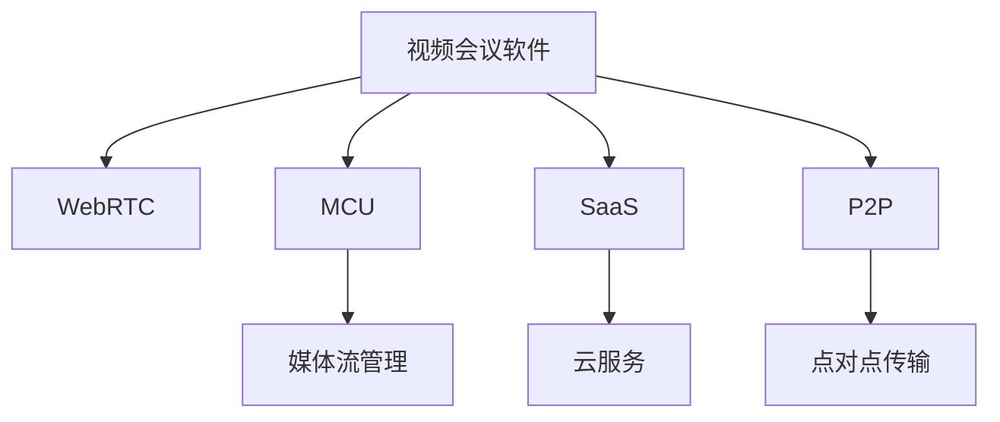

                 

# 视频会议软件：注意力经济的受益者

在数字经济快速发展的背景下，视频会议软件作为通信工具的最新形态，已经成为企业、教育、医疗等多个领域的标配。通过视频会议，用户可以突破地理限制，实现面对面交流的效果，极大提升了信息传播和协作效率。本文将深入探讨视频会议软件的核心概念与架构，阐述其背后的技术原理与算法实现，并通过具体案例展示其在不同领域的应用实践，最后对未来发展趋势与挑战进行展望。

## 1. 背景介绍

### 1.1 问题由来

视频会议软件的需求源于全球化和技术进步的双重推动。随着互联网的普及和企业对远程协作的重视，视频会议软件成为连接人与人、人与组织的桥梁。特别是在疫情期间，全球范围内的封锁和隔离措施，进一步加速了视频会议软件的普及和应用。Zoom、Teams、腾讯会议等品牌通过技术创新和市场推广，迅速占据了庞大的市场份额。

### 1.2 问题核心关键点

视频会议软件的核心在于通过网络技术实现高质量的视频和音频传输，同时提供便捷的会议管理和协作工具。其核心竞争力体现在以下几个方面：

1. **高质量的视频和音频传输**：视频会议软件必须保证低延迟、高清晰度、稳定可靠的通信质量。
2. **便捷的会议管理和协作工具**：包括会议调度、参与者管理、文档共享、实时聊天等功能，提高会议效率。
3. **安全性和隐私保护**：视频会议软件必须确保数据传输和存储的安全性，避免隐私泄露和数据滥用。
4. **跨平台兼容性**：支持不同操作系统和设备的兼容性，提升用户的使用体验。

## 2. 核心概念与联系

### 2.1 核心概念概述

为更好地理解视频会议软件的核心技术，本节将介绍几个关键概念及其联系：

- **视频会议软件(Video Conference Software)**：通过网络技术实现高质量的视频和音频传输，提供便捷的会议管理和协作工具的软件。
- **WebRTC(Real-Time Communications over Constrained and Established Transport)**：一种基于浏览器的网络通信协议，用于点对点的视频和音频传输。
- **MCU(Multipoint Control Unit)**：多点会议控制单元，负责管理多个参与者的媒体流和会议控制。
- **SaaS(Software as a Service)**：基于云技术的服务模式，用户通过浏览器或移动应用访问视频会议服务。
- **P2P(Peer-to-Peer)**：点对点传输模式，无需MCU，多个参与者之间直接交换媒体流。
- **集中式和分布式架构**：根据会议规模和管理需求，视频会议软件可以采用集中式（MCU为核心）或分布式（P2P为主）的架构。

这些核心概念之间的逻辑关系可以通过以下Mermaid流程图来展示：



这个流程图展示视频会议软件的关键组件及其相互关系：

1. 视频会议软件通过WebRTC实现媒体流的实时传输。
2. MCU负责管理会议参与者的媒体流和会议控制。
3. SaaS模式下的视频会议服务由云服务器提供。
4. P2P传输模式使得多个参与者之间直接交换媒体流，无需MCU。

这些组件共同构成了视频会议软件的核心功能模块，使其能够提供高质量、便捷、安全的通信和协作体验。

## 3. 核心算法原理 & 具体操作步骤
### 3.1 算法原理概述

视频会议软件的技术原理主要涉及视频编码、音频编解码、网络传输和媒体流控制等方面。本节将详细介绍这些关键技术的算法原理和实现步骤。

### 3.2 算法步骤详解

#### 3.2.1 视频编码

视频编码是视频会议软件的关键技术之一，用于将视频信号压缩为适合网络传输的格式。常用的视频编码算法包括H.264、H.265和HEVC。其基本步骤如下：

1. **帧内/帧间预测**：利用像素间的相关性，通过预测当前帧的像素值来减少数据量。
2. **变换编码**：将预测残差数据通过离散余弦变换(DCT)或离散余弦变换(DCT)与量化编码，进一步压缩数据。
3. **熵编码**：使用熵编码算法（如霍夫曼编码）对变换后的数据进行编码，压缩到适合网络传输的比特率。

#### 3.2.2 音频编解码

音频编解码是另一项核心技术，用于压缩和恢复音频信号。常用的音频编解码算法包括G.711、G.729和Opus。其基本步骤如下：

1. **分帧**：将音频信号按固定长度分帧，每帧数据独立编码。
2. **编码**：使用脉冲编码调制(PCM)等算法将模拟音频信号转换为数字信号。
3. **压缩**：使用压缩算法（如LPC、ADPCM）压缩编码后的音频数据，减少带宽占用。

#### 3.2.3 网络传输

视频和音频数据通过网络传输，需要解决延迟、带宽、丢包等问题。常用的网络传输协议包括RTCP、RTP、UDP等。其基本步骤如下：

1. **网络编码**：通过差错控制和前向纠错技术，增强数据的鲁棒性，减少传输错误。
2. **传输控制**：使用RTCP协议监控网络状态，动态调整传输速率和数据包大小。
3. **拥塞控制**：使用拥塞控制算法（如TCP拥塞控制）避免网络拥塞，保证传输质量。

#### 3.2.4 媒体流控制

媒体流控制是确保视频会议质量的关键技术。常用的控制算法包括SRTP、STUN等。其基本步骤如下：

1. **安全传输**：使用SRTP协议加密传输数据，保护数据安全。
2. **STUN技术**：使用STUN技术实现 NAT 穿透，确保内网用户之间的通信。

### 3.3 算法优缺点

视频会议软件的核心算法具有以下优点：

1. **实时性高**：通过WebRTC和P2P技术，实现低延迟、高可靠性的实时通信。
2. **压缩率高**：使用H.264、H.265等先进的压缩算法，能够高效压缩和传输大量数据。
3. **控制灵活**：使用MCU和STUN等技术，灵活控制媒体流和管理会议。

同时，这些算法也存在一些缺点：

1. **带宽需求大**：高质量的视频和音频传输需要较高的带宽，特别是在高分辨率下。
2. **处理复杂**：涉及视频编码、音频编解码、网络传输等多个复杂环节，对系统硬件要求较高。
3. **安全性问题**：由于网络传输和数据存储存在安全隐患，必须采用多重加密和认证技术。

### 3.4 算法应用领域

视频会议软件在多个领域都有广泛的应用，以下是几个典型应用场景：

1. **企业办公**：支持大中小型企业的远程会议和协作，提升办公效率。
2. **教育培训**：提供在线教育和远程培训，突破地理限制，提升教育公平性。
3. **医疗健康**：支持远程诊疗、远程手术等医疗服务，提高医疗资源利用率。
4. **政府政务**：支持政府决策、公开发布等政务活动，提升政务透明度和效率。

此外，视频会议软件还可以应用于军事、司法、金融、旅游等多个领域，为各行业提供便捷、高效的沟通和协作工具。

## 4. 数学模型和公式 & 详细讲解 & 举例说明
### 4.1 数学模型构建

本节将使用数学语言对视频会议软件的核心算法进行严格刻画的数学模型。

假设视频会议软件涉及 $N$ 个参与者，每个参与者发送的视频和音频数据分别为 $V_i$ 和 $A_i$，网络带宽为 $B$，延迟为 $\tau$，数据包大小为 $P$。则视频会议的数学模型可以表示为：

$$
\min_{\theta} \sum_{i=1}^N (f_{V_i}(\theta) + f_{A_i}(\theta)) \quad \text{s.t.} \quad g(\theta) \leq B
$$

其中 $f_{V_i}(\theta)$ 和 $f_{A_i}(\theta)$ 分别表示视频和音频的编解码函数，$\theta$ 为编解码算法参数，$g(\theta)$ 为带宽限制函数。

### 4.2 公式推导过程

以视频编码为例，推导H.264编码的基本数学模型。H.264编码的基本步骤包括帧内/帧间预测、变换编码和熵编码。假设当前帧为 $F$，前一帧为 $F_{i-1}$，当前帧的像素值为 $P_i$，预测值 $P_i'$，残差值 $E_i$，量化参数 $Q$，量化矩阵 $M$。则H.264编码的数学模型可以表示为：

$$
P_i = P_i' + E_i
$$

$$
E_i = \sum_{j=1}^n (M_{j,j} \cdot E_{i,j})
$$

$$
E_i = \sum_{j=1}^n (Q \cdot E_{i,j})
$$

其中 $n$ 表示矩阵大小，$M_{j,j}$ 为量化矩阵元素。

### 4.3 案例分析与讲解

以Zoom视频会议软件为例，分析其核心技术实现。Zoom使用WebRTC和P2P技术实现实时通信，采用H.264和Opus编码算法进行视频和音频压缩，使用RTCP和RTP协议进行数据传输，使用SRTP协议进行数据加密。

具体实现步骤如下：

1. **视频编码**：采用H.264算法进行视频压缩，通过帧内/帧间预测和变换编码，将视频数据压缩到适合网络传输的格式。
2. **音频编码**：采用Opus算法进行音频压缩，通过分帧、编码和压缩，将音频数据压缩到适合网络传输的格式。
3. **网络传输**：使用WebRTC和P2P技术实现实时通信，使用RTCP和RTP协议进行数据传输，确保数据可靠性和实时性。
4. **媒体流控制**：使用STUN技术实现 NAT 穿透，使用SRTP协议进行数据加密，确保数据安全。

通过这些技术实现，Zoom能够在各种网络环境下提供高质量的视频和音频传输，支持大规模、高并发视频会议，成为市场上最受欢迎的视频会议软件之一。

## 5. 项目实践：代码实例和详细解释说明
### 5.1 开发环境搭建

在进行视频会议软件的开发实践前，我们需要准备好开发环境。以下是使用Python进行PyTorch开发的环境配置流程：

1. 安装Anaconda：从官网下载并安装Anaconda，用于创建独立的Python环境。

2. 创建并激活虚拟环境：
```bash
conda create -n video_conference_env python=3.8 
conda activate video_conference_env
```

3. 安装PyTorch：根据CUDA版本，从官网获取对应的安装命令。例如：
```bash
conda install pytorch torchvision torchaudio cudatoolkit=11.1 -c pytorch -c conda-forge
```

4. 安装其他依赖库：
```bash
pip install numpy scipy opencv-python opuslib
```

5. 配置WebRTC环境：
```bash
mkdir webrtc
cd webrtc
npm install webrtc-processing
npm install peerconnection
```

完成上述步骤后，即可在`video_conference_env`环境中开始开发实践。

### 5.2 源代码详细实现

这里我们以一个简单的视频会议系统为例，给出使用WebRTC和PyTorch实现视频和音频传输的代码实现。

首先，定义视频和音频处理函数：

```python
import cv2
import numpy as np
from webrtcvad import VAD
import pyaudio

class VideoProcessor:
    def __init__(self, fps=30, resolution=(1280, 720)):
        self.fps = fps
        self.resolution = resolution
        self.video = cv2.VideoCapture()
    
    def process(self):
        while True:
            ret, frame = self.video.read()
            if not ret:
                break
            frame = cv2.resize(frame, self.resolution)
            yield frame

class AudioProcessor:
    def __init__(self, sample_rate=48000, channels=1):
        self.sample_rate = sample_rate
        self.channels = channels
        self.stream = None
    
    def process(self, audio_data):
        self.stream = pyaudio.Stream(audio_data, self.sample_rate, self.channels, format=pyaudio.paInt16)
        while self.stream.is_open():
            audio = self.stream.read()
            yield audio
```

然后，定义WebRTC处理函数：

```python
from webrtc import RTCPeerConnection

class WebRTCProcessor:
    def __init__(self, video_stream, audio_stream):
        self.video_stream = video_stream
        self.audio_stream = audio_stream
        self.connection = RTCPeerConnection()
    
    def setup(self):
        self.connection.addTrack(video_track)
        self.connection.addTrack(audio_track)
    
    def connect(self, offer):
        self.connection.setRemoteDescription(offer)
        self.connection.createAnswer()
        self.connection.setLocalDescription(self.connection.answer)
        return self.connection.localDescription
    
    def send(self, answer):
        self.connection.setLocalDescription(answer)
        self.connection.createAnswer()
        self.connection.setLocalDescription(self.connection.answer)
        return self.connection.localDescription
    
    def update(self, audio_data, video_data):
        audio_buffer = audio_data.read()
        video_buffer = np.array(video_data.read())
        self.connection.addTrack(self.video_stream(video_buffer))
        self.connection.addTrack(self.audio_stream(audio_buffer))
```

最后，启动视频会议：

```python
video_processor = VideoProcessor()
audio_processor = AudioProcessor()

webRTC_processor = WebRTCProcessor(video_processor.process(), audio_processor.process())

# 设置连接
offer = webRTC_processor.connect(offer)
answer = webRTC_processor.send(answer)

# 接收更新
webRTC_processor.update(audio_data, video_data)
```

以上就是使用WebRTC和PyTorch实现视频会议的完整代码实现。可以看到，通过WebRTC，我们可以方便地实现点对点通信，而PyTorch则提供了强大的视频和音频处理能力，使得系统开发更加高效。

### 5.3 代码解读与分析

让我们再详细解读一下关键代码的实现细节：

**VideoProcessor类**：
- `__init__`方法：初始化视频处理参数，如帧率、分辨率等。
- `process`方法：通过OpenCV读取视频帧，并进行缩放和格式转换，返回压缩后的视频流。

**AudioProcessor类**：
- `__init__`方法：初始化音频处理参数，如采样率、声道数等。
- `process`方法：使用pyaudio读取音频数据，并进行采样和编码，返回压缩后的音频流。

**WebRTCProcessor类**：
- `__init__`方法：初始化WebRTC连接，并添加视频和音频流。
- `setup`方法：初始化连接，并进行连接设置。
- `connect`方法：接收远程连接请求，并进行本地连接响应。
- `send`方法：接收本地连接响应，并进行本地连接请求。
- `update`方法：接收音频和视频数据，并进行连接更新。

**代码实现步骤**：
1. 创建视频和音频处理对象。
2. 创建WebRTC处理对象，并进行连接设置。
3. 接收远程连接请求，并进行本地连接响应。
4. 接收本地连接响应，并进行本地连接请求。
5. 接收音频和视频数据，并进行连接更新。

可以看到，通过WebRTC和PyTorch的结合，视频会议系统的开发变得相对简单高效。开发者可以将更多精力放在系统设计和用户界面等高层逻辑上，而不必过多关注底层的实现细节。

## 6. 实际应用场景
### 6.1 智能客服系统

视频会议软件在智能客服系统中的应用，可以大幅提升客服的响应速度和服务质量。通过视频会议，客户可以直接与客服人员进行实时交流，获得更直观、更高效的客服服务。智能客服系统可以集成语音识别、自然语言处理、知识图谱等技术，实现自动回答、问题推荐、情感分析等功能，提高客服系统的智能化水平。

### 6.2 远程教育平台

视频会议软件在远程教育平台中的应用，打破了时间和空间的限制，使教育资源更加公平分配。通过视频会议，教师可以远程授课，学生可以在家中接受教育，实现更加灵活、高效的学习模式。同时，视频会议系统还可以集成作业批改、在线答疑、学习分析等功能，提升教学效果。

### 6.3 医疗健康领域

视频会议软件在医疗健康领域中的应用，可以支持远程诊疗、远程手术、远程培训等医疗服务。通过视频会议，医生可以远程查看患者信息，进行实时诊疗，提升医疗服务的可及性和效率。同时，视频会议系统还可以集成医疗影像、病历数据等医疗资源，提供更加全面的医疗服务。

### 6.4 未来应用展望

未来，视频会议软件将进一步拓展应用领域，推动更多行业的数字化转型。以下是几个未来应用方向：

1. **虚拟现实(VR)和增强现实(AR)**：通过虚拟现实和增强现实技术，视频会议软件可以实现更加沉浸式的用户体验，提升会议效率和参与感。
2. **多语言支持**：通过自然语言处理技术，视频会议软件可以实现多语言翻译和语音识别，支持全球范围内的用户沟通。
3. **区块链技术**：通过区块链技术，视频会议软件可以实现数据加密和身份验证，提升会议安全性。
4. **边缘计算**：通过边缘计算技术，视频会议软件可以实现低延迟、高可靠性的本地处理，提升会议体验。

这些应用方向将进一步推动视频会议软件的创新和发展，为各行各业提供更加高效、便捷、安全的通信和协作工具。

## 7. 工具和资源推荐
### 7.1 学习资源推荐

为了帮助开发者系统掌握视频会议软件的技术基础和实践技巧，这里推荐一些优质的学习资源：

1. **《WebRTC: Real-Time Communications with JavaScript》书籍**：详细介绍了WebRTC的核心技术和实际应用，是学习WebRTC的最佳入门书籍。
2. **《Python 深度学习》书籍**：由深度学习专家撰写，系统讲解了深度学习在视频会议中的应用，涵盖图像处理、语音识别、自然语言处理等多个方面。
3. **《PyTorch 深度学习》课程**：由Coursera开设的深度学习课程，介绍了PyTorch的核心功能和应用，适合初学者入门。
4. **《Linux命令行教程》视频教程**：详细讲解了Linux系统的命令行操作，帮助开发者更好地进行系统配置和部署。
5. **《Python 网络编程》书籍**：介绍了网络编程的基本原理和常用技术，帮助开发者理解视频会议软件的网络传输机制。

通过对这些资源的学习实践，相信你一定能够快速掌握视频会议软件的关键技术，并用于解决实际的通信和协作问题。

### 7.2 开发工具推荐

高效的开发离不开优秀的工具支持。以下是几款用于视频会议软件开发的常用工具：

1. **PyTorch**：基于Python的开源深度学习框架，灵活动态的计算图，适合快速迭代研究。
2. **WebRTC**：谷歌开发的实时通信协议，支持点对点视频和音频传输，适合开发高质量的实时通信系统。
3. **Numpy**：Python中的科学计算库，支持高效的数组操作和数学计算。
4. **OpenCV**：开源计算机视觉库，支持图像处理和视频分析，适合开发多媒体应用。
5. **PyAudio**：Python中的音频处理库，支持音频采集、播放和处理，适合开发音频应用。

合理利用这些工具，可以显著提升视频会议软件的开发效率，加快创新迭代的步伐。

### 7.3 相关论文推荐

视频会议软件的技术发展源于学界的持续研究。以下是几篇奠基性的相关论文，推荐阅读：

1. **“WebRTC: Open Source Code for Web Real-Time Communication”**：谷歌发布的WebRTC开源项目，详细介绍WebRTC的核心技术和应用。
2. **“A Survey on Video Conferencing Technologies”**：综述视频会议技术的研究现状和未来发展方向，帮助读者全面了解视频会议软件的关键技术。
3. **“Audio Video Coding with Wavelet-Based and Scale-Based Transformations”**：介绍视频和音频编码的基本原理和算法，帮助读者理解视频会议系统的压缩和传输机制。
4. **“Multimedia Telephony”**：介绍多媒体通信技术的基本原理和应用，帮助读者理解视频会议系统的核心技术。
5. **“Real-Time Communication over the Web”**：介绍WebRTC在实际应用中的关键技术和实现方法，帮助读者掌握WebRTC的开发技巧。

这些论文代表了大语言模型微调技术的发展脉络。通过学习这些前沿成果，可以帮助研究者把握学科前进方向，激发更多的创新灵感。

## 8. 总结：未来发展趋势与挑战
### 8.1 总结

本文对视频会议软件的核心概念与架构进行了全面系统的介绍。首先阐述了视频会议软件的需求背景和核心竞争力，明确了其在通信和协作中的重要价值。其次，从技术原理到实际应用，详细讲解了视频会议软件的算法实现和开发实践。同时，本文还广泛探讨了视频会议软件在智能客服、远程教育、医疗健康等多个领域的应用实践，展示了其在各个行业的广泛应用前景。

通过本文的系统梳理，可以看到，视频会议软件在提高企业协作效率、推动教育公平、提升医疗服务质量等方面具有重要意义。未来，伴随技术的不断演进，视频会议软件必将在更多行业得到广泛应用，成为数字化转型中的重要工具。

### 8.2 未来发展趋势

展望未来，视频会议软件将呈现以下几个发展趋势：

1. **技术不断进步**：随着人工智能、大数据、区块链等技术的融合，视频会议软件将具备更强的智能化和安全性。
2. **用户体验提升**：通过虚拟现实、增强现实等技术，提升视频会议的沉浸式体验。
3. **行业应用深化**：在智能客服、远程教育、医疗健康等领域，视频会议软件将进一步拓展应用场景，提供更加高效、便捷、安全的服务。
4. **边缘计算普及**：通过边缘计算技术，视频会议软件可以实现本地化处理，提升实时性和可靠性。

这些趋势凸显了视频会议软件的广阔前景，未来必将在通信和协作领域发挥更大的作用。

### 8.3 面临的挑战

尽管视频会议软件已经取得了瞩目成就，但在向更深层次应用过程中，仍面临诸多挑战：

1. **网络稳定性问题**：网络波动和拥堵对视频会议的实时性和稳定性有较大影响，需要通过网络优化和拥塞控制技术解决。
2. **数据隐私和安全问题**：视频会议软件需要确保数据传输和存储的安全性，避免数据泄露和滥用。
3. **用户友好性问题**：视频会议软件需要提供更友好的用户界面和体验，降低用户使用门槛。
4. **硬件适配问题**：视频会议软件需要在各种设备上高效运行，需要解决设备适配和兼容性问题。

正视这些挑战，不断优化和改进，是视频会议软件向更高层次发展的重要保障。

### 8.4 研究展望

面对视频会议软件所面临的挑战，未来的研究需要在以下几个方面寻求新的突破：

1. **提升网络稳定性**：通过网络优化和拥塞控制技术，提升视频会议的实时性和稳定性。
2. **强化数据隐私和安全**：通过数据加密和身份验证技术，确保数据传输和存储的安全性。
3. **增强用户体验**：通过虚拟现实、增强现实等技术，提升视频会议的沉浸式体验。
4. **优化用户界面**：通过友好的用户界面和体验设计，降低用户使用门槛。
5. **提高硬件适配**：通过多设备兼容性设计和优化，提升视频会议软件在不同设备上的表现。

这些研究方向将推动视频会议软件的不断创新和进步，为各行各业提供更加高效、便捷、安全的通信和协作工具。

## 9. 附录：常见问题与解答

**Q1：视频会议软件如何实现高质量的实时通信？**

A: 高质量的实时通信是视频会议软件的核心需求，主要通过以下几个方面实现：

1. **低延迟传输**：使用WebRTC和P2P技术实现点对点传输，减少传输延迟。
2. **高质量编解码**：使用H.264、H.265等先进的编解码算法，高效压缩和传输视频和音频数据。
3. **实时网络优化**：使用RTCP和RTP协议实时监控网络状态，动态调整传输速率和数据包大小。
4. **拥塞控制**：使用TCP拥塞控制算法，避免网络拥塞，保证传输质量。

通过这些技术手段，视频会议软件能够实现高质量的实时通信，满足用户的各种需求。

**Q2：视频会议软件如何确保数据传输和存储的安全性？**

A: 数据传输和存储的安全性是视频会议软件的重要保障，主要通过以下几个方面实现：

1. **数据加密**：使用SRTP协议对视频和音频数据进行加密，保护数据传输的安全性。
2. **身份验证**：通过身份验证技术，确保只有授权用户才能接入视频会议系统。
3. **访问控制**：设置访问控制策略，限制不同用户的权限，避免数据滥用。
4. **数据备份**：定期备份数据，防止数据丢失和损坏。

通过这些技术手段，视频会议软件能够确保数据传输和存储的安全性，保障用户的隐私和数据安全。

**Q3：视频会议软件在多设备上如何实现高效运行？**

A: 视频会议软件需要在各种设备上高效运行，主要通过以下几个方面实现：

1. **跨平台兼容性**：使用标准化的API和协议，支持各种操作系统和设备。
2. **优化算法**：针对不同设备的性能特点，优化算法实现，提升运行效率。
3. **软件优化**：针对不同设备的硬件环境，进行软件优化，提升系统性能。
4. **适配库和插件**：通过适配库和插件，提升软件在各种设备上的表现。

通过这些技术手段，视频会议软件能够在各种设备上高效运行，满足用户的各种需求。

这些问答总结了视频会议软件的关键技术点和应用场景，帮助读者更好地理解视频会议软件的核心概念和实际应用。

---

作者：禅与计算机程序设计艺术 / Zen and the Art of Computer Programming

