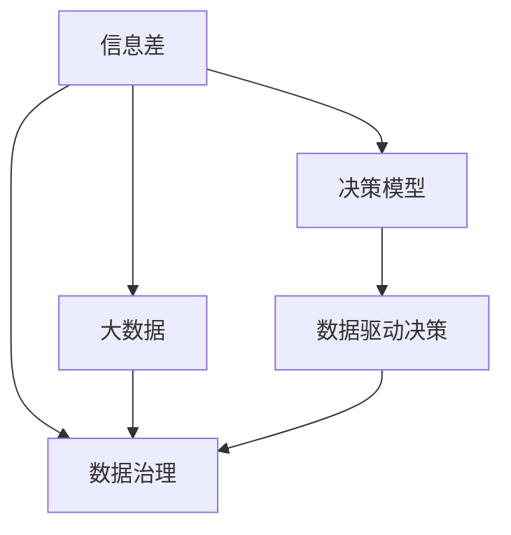

                 

# 解码信息差：大数据时代的竞争力源泉

在大数据时代，信息差是影响企业竞争力的关键因素。本文将深入探讨信息差的概念、影响及其在大数据时代下的演变，提出基于大数据的决策框架，并通过具体案例展示如何利用数据驱动决策，提升企业竞争力。

## 1. 背景介绍

### 1.1 问题由来

随着互联网技术的发展，信息传递的速度和规模已经发生了翻天覆地的变化。在这个过程中，信息差的概念应运而生。信息差指的是信息的获取、处理、传输和应用过程中，由于各种因素（如信息不对称、数据质量、技术能力等）引起的差距。信息差的存在，导致企业难以全面、及时、准确地获取市场信息，影响企业的决策速度和准确性，进而影响企业的竞争力。

### 1.2 问题核心关键点

信息差的核心关键点包括：
- **信息不对称**：企业内部、企业与市场之间、企业与供应商之间、企业与消费者之间存在的信息不对称。
- **数据质量**：数据缺失、数据噪音、数据偏见等数据质量问题。
- **技术能力**：数据处理、分析、应用的技术能力不足。
- **市场动态**：市场的快速变化、竞争的加剧、技术的创新等。

## 2. 核心概念与联系

### 2.1 核心概念概述

为更好地理解信息差及其在大数据时代的应用，本节将介绍几个密切相关的核心概念：

- **信息差**：指信息的获取、处理、传输和应用过程中，由于各种因素引起的差距。
- **大数据**：指无法在合理时间内用传统数据处理应用软件采集、管理、处理的数据集合。
- **决策模型**：通过数据输入、模型计算输出决策结果的过程。
- **数据驱动决策**：基于大数据和决策模型的决策方式，强调数据的价值和重要性。
- **数据治理**：管理和维护数据的质量、安全、合规等，保障数据驱动决策的有效性。

这些核心概念之间的逻辑关系可以通过以下Mermaid流程图来展示：



这个流程图展示了大数据时代下信息差与大数据、决策模型、数据驱动决策、数据治理之间的联系：

1. 信息差是企业面临的核心挑战。
2. 大数据提供了海量、多元、实时数据，有助于缩小信息差。
3. 决策模型通过数据输入和模型计算，输出决策结果。
4. 数据驱动决策强调利用大数据和决策模型进行决策，提升决策效率和准确性。
5. 数据治理保障数据质量、安全、合规，为数据驱动决策提供支持。

这些概念共同构成了企业在大数据时代下解决信息差问题，提升竞争力的理论基础。

## 3. 核心算法原理 & 具体操作步骤

### 3.1 算法原理概述

基于大数据的信息差解决方案，核心在于构建一个数据驱动的决策框架。该框架通过以下步骤实现：
1. **数据采集**：从企业内外获取各类数据，包括市场数据、用户数据、财务数据等。
2. **数据清洗**：对数据进行去重、去噪、处理缺失值等预处理操作。
3. **数据建模**：构建统计模型、机器学习模型、深度学习模型等决策模型。
4. **模型训练**：利用历史数据训练模型，优化模型参数。
5. **模型应用**：将训练好的模型应用于实际决策中，输出决策结果。
6. **结果评估**：对决策结果进行评估，不断调整模型和数据。

### 3.2 算法步骤详解

以下是构建数据驱动决策框架的具体步骤：

**Step 1: 数据采集**
- 定义数据采集策略，确定需要采集的数据类型和来源。
- 使用ETL工具（如Apache Nifi、Talend等）自动采集数据，确保数据源的稳定性和准确性。
- 配置数据采集接口，实现数据的实时采集和异构数据的统一管理。

**Step 2: 数据清洗**
- 设计数据清洗流程，包括去重、去噪、处理缺失值等步骤。
- 使用数据清洗工具（如OpenRefine、Trifacta等）进行数据清洗，确保数据的完整性和一致性。
- 设定数据清洗的自动化规则，减少人工干预，提高效率。

**Step 3: 数据建模**
- 根据决策需求选择合适的模型类型，如回归模型、分类模型、聚类模型、深度学习模型等。
- 使用数据建模工具（如Python、R、TensorFlow、PyTorch等）构建模型。
- 利用历史数据对模型进行训练，通过交叉验证等方法优化模型参数。

**Step 4: 模型应用**
- 部署训练好的模型，使用API接口或内置函数实现模型的应用。
- 通过数据驱动的方式进行决策，确保决策的及时性和准确性。
- 监控模型的运行状态，记录决策结果，便于后续的分析和优化。

**Step 5: 结果评估**
- 定义评估指标，如准确率、召回率、F1值等，对决策结果进行评估。
- 使用可视化工具（如Tableau、PowerBI等）展示评估结果，帮助管理者进行决策。
- 根据评估结果调整模型和数据，不断提升决策效果。

### 3.3 算法优缺点

基于大数据的信息差解决方案有以下优点：
1. **全面性**：能够全面采集和利用企业内外数据，缩小信息差。
2. **实时性**：数据采集和处理实时进行，能够快速响应市场变化。
3. **准确性**：通过机器学习和深度学习模型，提升决策的准确性。
4. **灵活性**：根据决策需求，灵活调整数据采集、处理和建模策略。

同时，该方法也存在以下局限性：
1. **数据质量**：依赖数据采集和清洗的准确性，如果数据质量差，将影响决策效果。
2. **模型复杂性**：模型复杂度较高，需要较高的技术能力和资源投入。
3. **成本投入**：数据采集、清洗、建模和应用等环节，需要投入大量的时间和资源。
4. **安全风险**：数据安全和隐私保护是重要问题，需要加强安全措施。

尽管存在这些局限性，但就目前而言，基于大数据的信息差解决方案仍是大数据时代下解决信息差问题的主要手段。未来相关研究的重点在于如何进一步降低数据采集和清洗的成本，提高模型的泛化能力和安全性，同时兼顾实时性和准确性。

### 3.4 算法应用领域

基于大数据的信息差解决方案，在企业决策、市场营销、供应链管理、人力资源等多个领域都有广泛的应用：

- **企业决策**：通过大数据分析和决策模型，提升决策的科学性和效率。
- **市场营销**：利用市场数据和用户行为数据，制定精准的市场营销策略。
- **供应链管理**：通过供应商数据和市场数据，优化供应链管理，降低成本。
- **人力资源**：通过员工数据和市场数据，优化招聘和人力资源管理。

除了上述这些领域外，大数据信息差解决方案还被创新性地应用于更多场景中，如智能客服、智慧物流、智能制造等，为企业的数字化转型提供了新的动力。

## 4. 数学模型和公式 & 详细讲解 & 举例说明

### 4.1 数学模型构建

为更好地理解基于大数据的信息差解决方案，本节将介绍几个关键数学模型：

- **线性回归模型**：用于预测数值型目标变量的模型。
- **逻辑回归模型**：用于预测分类目标变量的模型。
- **决策树模型**：通过树形结构进行决策的模型。
- **随机森林模型**：多个决策树的集成模型。
- **深度学习模型**：如卷积神经网络（CNN）、循环神经网络（RNN）、长短期记忆网络（LSTM）等。

以下是这些模型的基本数学表达式：

**线性回归模型**：
$$
y = \beta_0 + \beta_1x_1 + \beta_2x_2 + \cdots + \beta_nx_n + \epsilon
$$

**逻辑回归模型**：
$$
P(y=1|x) = \frac{1}{1+\exp(-\beta_0 - \beta_1x_1 - \beta_2x_2 - \cdots - \beta_nx_n)}
$$

**决策树模型**：
$$
T_i(x) = 
\begin{cases}
1 & \text{if } x_i \leq T_i \\
0 & \text{otherwise}
\end{cases}
$$

**随机森林模型**：
$$
\begin{aligned}
\hat{y} &= \sum_{k=1}^K T_k(x) \\
&= \sum_{k=1}^K \frac{1}{N}\sum_{i=1}^N T_k(x_i)
\end{aligned}
$$

**深度学习模型**：
- **卷积神经网络**：
$$
f(x) = \sum_{i=1}^{n} w_i h_i(x)
$$
其中 $h_i(x)$ 为卷积核，$w_i$ 为权重。
- **循环神经网络**：
$$
h_t = \tanh(W_{hh} h_{t-1} + W_{hX} x_t)
$$
其中 $W_{hh}$ 和 $W_{hX}$ 为权重矩阵。
- **长短期记忆网络**：
$$
\begin{aligned}
i_t &= \sigma(W_i x_t + U_i h_{t-1} + b_i) \\
f_t &= \sigma(W_f x_t + U_f h_{t-1} + b_f) \\
o_t &= \tanh(W_o x_t + U_o h_{t-1} + b_o) \\
c_t &= f_t \odot c_{t-1} + i_t \odot \tanh(W_c x_t + U_c h_{t-1} + b_c) \\
h_t &= o_t \odot \tanh(c_t)
\end{aligned}
$$

### 4.2 公式推导过程

以下我们以线性回归模型为例，推导其最小二乘法训练过程。

假设我们有 $N$ 个样本 $(x_i, y_i)$，其中 $x_i = [x_{i1}, x_{i2}, \cdots, x_{in}]$ 为自变量，$y_i$ 为目标变量。线性回归模型的目标是找到最优的参数 $\beta = (\beta_0, \beta_1, \cdots, \beta_n)$，使得模型的预测值与真实值尽可能接近。

最小二乘法的目标是最小化预测值与真实值之间的平方误差：
$$
\min_{\beta} \sum_{i=1}^N (y_i - (\beta_0 + \beta_1x_{i1} + \cdots + \beta_nx_{in}))^2
$$

使用梯度下降算法求最小值，对每个参数的梯度为：
$$
\frac{\partial}{\partial \beta_k} \sum_{i=1}^N (y_i - \sum_{j=1}^n \beta_j x_{ij})^2 = 2\sum_{i=1}^N (y_i - \sum_{j=1}^n \beta_j x_{ij})x_{ik}
$$

因此，更新参数的公式为：
$$
\beta_k \leftarrow \beta_k - \eta \frac{\partial}{\partial \beta_k} \sum_{i=1}^N (y_i - \sum_{j=1}^n \beta_j x_{ij})^2
$$

其中 $\eta$ 为学习率。

通过不断迭代更新参数，最终得到最优参数 $\hat{\beta}$，使得预测值与真实值误差最小。

### 4.3 案例分析与讲解

**案例分析**：某电商平台希望通过大数据分析和机器学习模型，提升销售额。

1. **数据采集**：从电商平台获取历史交易数据、用户行为数据、市场数据等。
2. **数据清洗**：清洗数据中的缺失值、异常值，对数据进行归一化处理。
3. **数据建模**：构建线性回归模型，预测用户下单概率。
4. **模型训练**：使用历史交易数据训练模型，优化模型参数。
5. **模型应用**：利用训练好的模型预测新用户的下单概率，进行精准营销。
6. **结果评估**：评估模型预测效果，根据结果调整模型和数据。

**讲解**：
- 数据采集是基础，需要覆盖尽可能多的数据类型和来源。
- 数据清洗是关键，确保数据的质量和一致性，减少噪声干扰。
- 数据建模是核心，选择合适的模型和算法，构建决策模型。
- 模型训练是保障，通过历史数据训练模型，优化参数。
- 模型应用是目的，利用模型进行决策，提升决策效果。
- 结果评估是反馈，根据评估结果不断优化模型和数据，提升决策准确性。

## 5. 项目实践：代码实例和详细解释说明

### 5.1 开发环境搭建

在进行信息差解决方案的开发前，我们需要准备好开发环境。以下是使用Python进行Python和R语言开发的环境配置流程：

1. 安装Anaconda：从官网下载并安装Anaconda，用于创建独立的Python或R语言环境。

2. 创建并激活虚拟环境：
```bash
conda create -n py-env python=3.8 
conda activate py-env
```

3. 安装Python依赖包：
```bash
conda install pandas numpy matplotlib jupyter notebook scikit-learn
```

4. 安装R语言：
```bash
sudo apt-get install r
```

5. 安装R依赖包：
```bash
install.packages(c("dplyr", "ggplot2", "caret"))
```

完成上述步骤后，即可在`py-env`或R环境中开始信息差解决方案的开发。

### 5.2 源代码详细实现

这里我们以Python和R语言分别实现线性回归和决策树模型的代码实现。

**Python实现**：

```python
import pandas as pd
from sklearn.linear_model import LinearRegression

# 加载数据
data = pd.read_csv('data.csv')

# 数据清洗
data.dropna(inplace=True)

# 数据分割
X = data.drop('y', axis=1)
y = data['y']

# 训练模型
model = LinearRegression()
model.fit(X, y)

# 预测结果
predictions = model.predict(X)

# 结果评估
from sklearn.metrics import r2_score
r2_score(y, predictions)
```

**R语言实现**：

```R
# 加载数据
data <- read.csv('data.csv')

# 数据清洗
data <- na.omit(data)

# 数据分割
X <- data[,-1]
y <- data[,1]

# 训练模型
model <- lm(y ~ ., data=data)
summary(model)

# 预测结果
predictions <- predict(model, newdata=X)

# 结果评估
r2 <- summary(model)$r.squared
```

### 5.3 代码解读与分析

让我们再详细解读一下关键代码的实现细节：

**数据加载和清洗**：
- Python使用pandas库，通过`pd.read_csv`读取CSV文件，使用`dropna`方法清洗缺失值。
- R使用`read.csv`读取CSV文件，使用`na.omit`方法清洗缺失值。

**模型训练**：
- Python使用sklearn库中的`LinearRegression`类，调用`fit`方法训练线性回归模型。
- R使用lm函数，指定目标变量y和自变量X，训练线性回归模型。

**预测和评估**：
- Python使用训练好的模型对测试集进行预测，使用`predict`方法。
- R使用`predict`函数进行预测，使用`summary`函数获取模型评估结果，计算R方值。

**结果输出**：
- Python使用`r2_score`函数计算预测结果与真实结果之间的R方值，评估模型效果。
- R输出模型摘要，手动计算R方值。

## 6. 实际应用场景

### 6.1 企业决策

在企业决策中，信息差是影响决策质量的关键因素。通过大数据分析和机器学习模型，企业可以实时获取市场动态、客户需求、竞争对手信息等，帮助管理者进行科学决策。

**案例**：某公司希望优化其市场推广策略。通过分析历史销售数据和市场数据，构建预测模型，预测未来销量，进而调整市场推广预算和渠道。

**实现步骤**：
1. 收集历史销售数据、市场数据、竞争对手数据等。
2. 清洗数据，确保数据的质量和一致性。
3. 构建预测模型，如线性回归模型、决策树模型等。
4. 训练模型，使用历史数据优化模型参数。
5. 预测未来销量，制定市场推广策略。
6. 评估模型效果，根据结果调整市场推广预算和渠道。

**效果**：通过大数据分析和机器学习模型，公司能够及时响应市场变化，优化市场推广策略，提升销售额。

### 6.2 市场营销

市场营销中，信息差主要体现在对客户需求和市场趋势的把握上。通过大数据分析和机器学习模型，企业可以精准定位客户需求，优化营销策略。

**案例**：某电商平台希望提升其广告投放效果。通过分析用户行为数据和市场数据，构建用户画像，优化广告投放策略。

**实现步骤**：
1. 收集用户行为数据、市场数据等。
2. 清洗数据，确保数据的质量和一致性。
3. 构建用户画像模型，如聚类模型、决策树模型等。
4. 训练模型，使用历史数据优化模型参数。
5. 预测用户行为，制定广告投放策略。
6. 评估模型效果，根据结果调整广告投放预算和策略。

**效果**：通过大数据分析和机器学习模型，电商平台能够精准定位用户需求，优化广告投放策略，提升广告投放效果，降低投放成本。

### 6.3 供应链管理

供应链管理中，信息差主要体现在对供应商表现、物流状态的把握上。通过大数据分析和机器学习模型，企业可以实时监控供应链状态，优化供应链管理。

**案例**：某制造企业希望优化其供应链管理。通过分析供应商数据和物流数据，构建预测模型，优化供应链管理。

**实现步骤**：
1. 收集供应商数据、物流数据等。
2. 清洗数据，确保数据的质量和一致性。
3. 构建预测模型，如时间序列模型、随机森林模型等。
4. 训练模型，使用历史数据优化模型参数。
5. 预测供应商表现、物流状态等，优化供应链管理。
6. 评估模型效果，根据结果调整供应链管理策略。

**效果**：通过大数据分析和机器学习模型，制造企业能够实时监控供应链状态，优化供应链管理，降低供应链成本，提高供应链效率。

### 6.4 未来应用展望

随着大数据技术和机器学习技术的不断发展，信息差解决方案将会在更多领域得到应用，为企业的数字化转型提供新的动力。

- **智能客服**：通过大数据分析和机器学习模型，智能客服系统可以实时响应客户咨询，提供个性化服务。
- **智慧物流**：通过大数据分析和机器学习模型，物流公司可以实时监控物流状态，优化物流路径，提高物流效率。
- **智能制造**：通过大数据分析和机器学习模型，制造企业可以实时监控生产状态，优化生产计划，提高生产效率。
- **金融风控**：通过大数据分析和机器学习模型，金融机构可以实时监控客户行为，评估信用风险，优化风控策略。

## 7. 工具和资源推荐

### 7.1 学习资源推荐

为了帮助开发者系统掌握信息差的概念和实践技巧，这里推荐一些优质的学习资源：

1. **《大数据技术与应用》**：讲解大数据技术基础、数据处理、数据分析等内容，适合初学者入门。
2. **《机器学习实战》**：讲解机器学习基础、模型选择、模型调参等内容，提供大量代码实现示例，适合实战练习。
3. **《Python数据分析基础》**：讲解Python数据分析基础，提供大量数据分析示例，适合数据分析实战。
4. **《R语言实战》**：讲解R语言基础、数据处理、数据可视化等内容，提供大量代码实现示例，适合R语言实战。
5. **Kaggle数据科学竞赛平台**：提供丰富的数据集和竞赛题目，适合实践练习和经验积累。

通过对这些资源的学习实践，相信你一定能够快速掌握信息差解决方案的理论基础和实践技巧，并用于解决实际的决策问题。

### 7.2 开发工具推荐

高效的开发离不开优秀的工具支持。以下是几款用于信息差解决方案开发的常用工具：

1. **Python**：开源的编程语言，支持丰富的数据处理、机器学习、可视化库，如pandas、numpy、scikit-learn、TensorFlow等。
2. **R语言**：开源的统计分析语言，支持丰富的数据处理、统计分析、可视化库，如dplyr、ggplot2、caret等。
3. **ETL工具**：如Apache Nifi、Talend等，支持数据采集、清洗、转换、加载，确保数据的质量和一致性。
4. **可视化工具**：如Tableau、PowerBI等，支持数据的可视化展示，帮助管理者进行决策。
5. **版本控制工具**：如Git、SVN等，支持版本管理、代码协作，确保代码的稳定性和可追溯性。

合理利用这些工具，可以显著提升信息差解决方案的开发效率，加快创新迭代的步伐。

### 7.3 相关论文推荐

信息差解决方案的发展源于学界的持续研究。以下是几篇奠基性的相关论文，推荐阅读：

1. **《大规模并行机器学习》**：提出分布式机器学习算法，解决大规模数据处理和计算问题。
2. **《深度学习》**：讲解深度学习基础、模型选择、模型调参等内容，提供大量代码实现示例。
3. **《大数据与商业智能》**：讲解大数据技术基础、商业智能应用等内容，适合实战练习。
4. **《数据驱动的决策分析》**：讲解数据驱动决策的基础、方法和案例，提供大量数据分析示例。
5. **《机器学习实战》**：讲解机器学习基础、模型选择、模型调参等内容，提供大量代码实现示例，适合实战练习。

这些论文代表了大数据信息差解决方案的发展脉络。通过学习这些前沿成果，可以帮助研究者把握学科前进方向，激发更多的创新灵感。

## 8. 总结：未来发展趋势与挑战

### 8.1 总结

本文对基于大数据的信息差解决方案进行了全面系统的介绍。首先阐述了信息差的概念、影响及其在大数据时代下的演变，明确了信息差在企业决策、市场营销、供应链管理等多个领域的应用。其次，从原理到实践，详细讲解了信息差解决方案的数学模型和关键步骤，给出了信息差解决方案的代码实现和详细解读。同时，本文还探讨了信息差解决方案在智能客服、智慧物流、智能制造等更多领域的潜在应用，展示了信息差解决方案的广阔前景。

通过本文的系统梳理，可以看到，基于大数据的信息差解决方案已经在大数据时代下成为企业解决信息差问题的核心手段，极大地提升了企业的决策效率和准确性，为企业的数字化转型提供了新的动力。未来，伴随大数据技术和机器学习技术的进一步发展，信息差解决方案必将在更多领域得到应用，为企业的创新和发展提供更加坚实的技术支撑。

### 8.2 未来发展趋势

展望未来，信息差解决方案将呈现以下几个发展趋势：

1. **实时化**：随着数据采集和处理技术的提升，信息差解决方案将更加实时化，能够及时响应市场变化，提供及时决策支持。
2. **智能化**：利用深度学习和增强学习等技术，信息差解决方案将变得更加智能化，能够自动优化决策模型，提升决策效果。
3. **全流程化**：信息差解决方案将贯穿数据采集、处理、建模、应用、评估的全流程，提供完整的决策支持。
4. **多模态化**：结合语音、图像、视频等多模态数据，信息差解决方案将具备更全面的数据感知能力，提升决策的全面性和准确性。
5. **平台化**：信息差解决方案将逐渐平台化，形成完整的决策支持生态系统，为各行业提供统一的数据驱动决策服务。

以上趋势凸显了信息差解决方案在大数据时代的广阔前景。这些方向的探索发展，必将进一步提升企业决策的科学性和效率，推动企业数字化转型的深入发展。

### 8.3 面临的挑战

尽管信息差解决方案已经取得了瞩目成就，但在迈向更加智能化、全流程化应用的过程中，它仍面临着诸多挑战：

1. **数据质量**：依赖数据采集和清洗的准确性，如果数据质量差，将影响决策效果。
2. **模型复杂性**：模型复杂度较高，需要较高的技术能力和资源投入。
3. **计算成本**：数据处理和模型训练需要大量的计算资源，成本较高。
4. **安全风险**：数据安全和隐私保护是重要问题，需要加强安全措施。
5. **技术更新**：机器学习模型和算法需要不断更新，保持技术的先进性。

尽管存在这些挑战，但通过不断优化数据采集、处理、建模等环节，加强安全保护，提升技术能力，相信信息差解决方案必将在未来克服各种困难，发挥更大的作用。

### 8.4 研究展望

面对信息差解决方案所面临的种种挑战，未来的研究需要在以下几个方面寻求新的突破：

1. **数据治理**：加强数据质量管理，提高数据采集、处理、存储、应用的安全性和合规性。
2. **模型优化**：开发更加参数高效、计算高效的机器学习模型，减少计算资源消耗。
3. **实时计算**：开发实时计算框架，支持大规模数据的实时处理和分析。
4. **多模态融合**：结合语音、图像、视频等多模态数据，提升数据感知能力。
5. **智能优化**：结合增强学习和进化计算等技术，提升模型的智能优化能力。

这些研究方向的探索，必将引领信息差解决方案技术迈向更高的台阶，为构建数据驱动的智能决策系统提供更加坚实的技术支撑。面向未来，信息差解决方案需要在数据治理、模型优化、实时计算、多模态融合、智能优化等方面进行全面创新，以实现更加全面、实时、智能的决策支持。

## 9. 附录：常见问题与解答

**Q1：如何处理大数据中的噪声数据？**

A: 处理大数据中的噪声数据通常包括以下步骤：
1. 数据清洗：通过去重、去噪、处理缺失值等预处理操作，减少噪声干扰。
2. 数据平滑：使用平滑技术，如均值滤波、中值滤波等，平滑数据。
3. 异常检测：使用异常检测算法，如孤立森林、DBSCAN等，识别并剔除异常数据。
4. 数据聚合：对数据进行聚合操作，减少噪声影响。
5. 数据变换：使用数据变换技术，如PCA、SVD等，减少数据噪声。

这些方法可以结合使用，根据数据特点选择合适的处理方式。

**Q2：如何评估信息差解决方案的性能？**

A: 评估信息差解决方案的性能通常需要考虑以下几个方面：
1. 准确率：模型预测结果与真实结果的匹配程度。
2. 召回率：模型预测出的正例中，真实正例的比例。
3. F1值：准确率和召回率的调和平均数。
4. R方值：模型预测结果与真实结果的拟合程度。
5. 均方误差：模型预测结果与真实结果的误差程度。

通过这些指标，可以全面评估信息差解决方案的性能，并进行优化。

**Q3：如何优化信息差解决方案的模型参数？**

A: 优化信息差解决方案的模型参数通常需要考虑以下几个方面：
1. 交叉验证：使用交叉验证方法，如k折交叉验证，评估模型性能，优化参数。
2. 网格搜索：使用网格搜索方法，遍历参数空间，找到最优参数组合。
3. 贝叶斯优化：使用贝叶斯优化方法，通过小样本快速找到最优参数。
4. 随机搜索：使用随机搜索方法，随机搜索参数空间，找到最优参数组合。
5. 参数正则化：使用正则化技术，如L2正则、Dropout等，避免模型过拟合。

这些方法可以结合使用，根据模型特点选择合适的优化方式。

**Q4：如何保证信息差解决方案的安全性？**

A: 保证信息差解决方案的安全性通常需要考虑以下几个方面：
1. 数据加密：对数据进行加密处理，防止数据泄露。
2. 访问控制：对数据进行访问控制，限制数据访问权限。
3. 数据审计：对数据使用情况进行审计，记录和追踪数据访问和使用。
4. 安全协议：使用安全协议，如SSL/TLS等，保护数据传输安全。
5. 模型保护：对模型进行保护，防止模型被篡改和攻击。

通过这些措施，可以有效地保障信息差解决方案的安全性。

**Q5：如何提高信息差解决方案的实时性？**

A: 提高信息差解决方案的实时性通常需要考虑以下几个方面：
1. 实时数据采集：采用实时数据采集技术，如流处理、事件驱动等，保证数据实时性。
2. 实时数据处理：采用实时数据处理技术，如流计算、Spark Streaming等，保证数据实时性。
3. 实时数据存储：采用实时数据存储技术，如Hadoop、Kafka等，保证数据实时性。
4. 实时模型部署：采用实时模型部署技术，如Spark MLlib、Flink等，保证模型实时性。
5. 实时模型优化：采用实时模型优化技术，如模型压缩、分布式训练等，提高模型计算效率。

通过这些措施，可以有效地提高信息差解决方案的实时性。

---

作者：禅与计算机程序设计艺术 / Zen and the Art of Computer Programming

