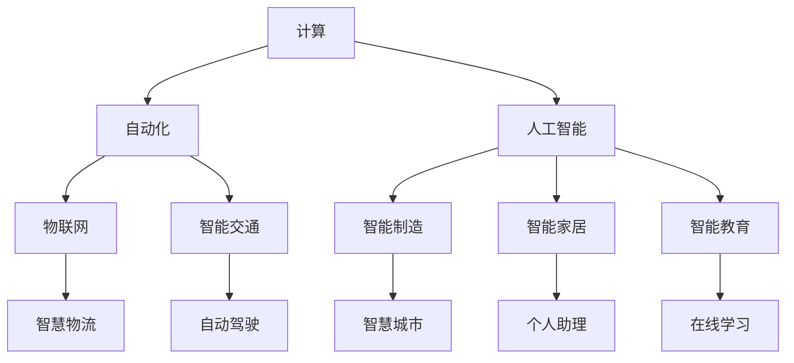

                 

# 计算变化与自动化的关系

## 1. 背景介绍

### 1.1 问题由来

随着信息技术的快速发展和广泛应用，计算与自动化已经成为驱动社会进步的重要引擎。从早期的电子计算到现代的云计算、大数据、人工智能，计算技术的不断突破带来了前所未有的变革。计算与自动化的关系也随着时间推移而变得更加紧密，计算为自动化提供了强大的技术支撑，而自动化又拓展了计算的应用范围。

当前，计算和自动化已经深入到生产生活的各个领域，从制造业的智能制造、智慧物流到金融业的智能投顾、医疗业的精准医疗，再到日常生活的智能家居、在线教育等，计算和自动化技术的融合，正引领着一场新的工业革命。但同时，这一变革也带来了新的挑战和问题，如隐私保护、安全风险、算法伦理等。如何平衡计算和自动化的发展，让其更好地服务于人类社会，成为了当前亟待解决的重要课题。

### 1.2 问题核心关键点

计算和自动化之间的关联主要体现在以下几个方面：

1. **计算赋能自动化**：计算技术为自动化提供了强大的算法和模型支持，使得自动化系统能够进行复杂任务处理、模式识别、预测分析等。
2. **自动化推动计算发展**：自动化需求的增长，促进了对高性能计算、大数据处理、机器学习等技术的需求，进一步推动了计算技术的发展。
3. **计算与自动化的协同进化**：计算和自动化技术相互促进，共同推动产业升级和创新。
4. **计算变化与自动化关系的变化**：随着技术的进步，计算和自动化的关系也在不断变化，需要不断适应新的需求和挑战。

理解这些关键点，有助于更好地把握计算与自动化发展的趋势和方向。

## 2. 核心概念与联系

### 2.1 核心概念概述

计算和自动化在许多领域中相互渗透，以下是几个核心概念的概述：

1. **计算 (Computing)**：通过各种物理和电子设备进行数据处理、信息传递、模型训练等，是自动化的技术基础。
2. **自动化 (Automation)**：通过技术手段（如传感器、控制器、软件等）对生产过程、决策过程进行自动控制和优化。
3. **人工智能 (Artificial Intelligence, AI)**：利用计算技术实现智能推理、决策和交互，是计算与自动化结合的高级形式。
4. **物联网 (Internet of Things, IoT)**：将各种物品连接到一个全球网络中，通过计算和自动化技术实现设备间的信息共享和协同工作。
5. **智能制造 (Smart Manufacturing)**：通过自动化技术和计算能力，实现生产过程的智能化、自动化和柔性化。
6. **智能交通 (Intelligent Transportation)**：利用计算和自动化技术，优化交通管理和运营，提升交通系统的效率和安全性。

这些概念之间存在密切的联系，通过技术手段的不断融合，计算和自动化正在共同推动各行业的智能化转型。

### 2.2 核心概念原理和架构的 Mermaid 流程图



这个流程图展示了计算和自动化在多个领域的应用，体现了两者之间的协同关系。

## 3. 核心算法原理 & 具体操作步骤

### 3.1 算法原理概述

计算与自动化关系的核心算法原理包括以下几个方面：

1. **计算赋能自动化**：利用计算能力，如大数据处理、深度学习、机器学习等，赋能自动化系统的决策和控制。
2. **自动化推动计算**：通过自动化需求的增加，推动计算技术在数据处理、模型训练、系统优化等方面的进步。
3. **计算与自动化的协同进化**：两者相互促进，共同发展，共同提升产业的效率和质量。

### 3.2 算法步骤详解

计算与自动化的协同进化可以通过以下步骤进行：

**Step 1: 需求分析和系统设计**
- 根据业务需求，确定自动化系统的功能和目标。
- 设计系统的架构和流程，确定计算资源的需求和分配方式。

**Step 2: 计算资源配置和调度**
- 选择合适的计算平台（如云计算、分布式计算等），配置必要的计算资源（如CPU、GPU、内存等）。
- 设计计算资源的调度算法，合理分配计算任务，确保计算资源的有效利用。

**Step 3: 数据采集和处理**
- 通过传感器、数据采集器等方式，获取所需数据。
- 对数据进行预处理、清洗、去噪等操作，确保数据的质量和完整性。

**Step 4: 模型训练和优化**
- 选择合适的算法和模型，进行模型训练和优化。
- 使用计算资源进行模型迭代训练，不断提升模型的精度和鲁棒性。

**Step 5: 系统集成和测试**
- 将计算和自动化系统进行集成，确保各组件之间的数据流通和协同工作。
- 进行系统测试，验证系统功能的正确性和稳定性。

**Step 6: 部署和优化**
- 将系统部署到实际环境中，进行监控和优化。
- 根据实际使用情况，不断调整和优化系统配置，提升系统的性能和可靠性。

### 3.3 算法优缺点

**优点**：
- **高效性**：计算技术的高效处理能力，使得自动化系统能够快速响应和处理大量数据。
- **灵活性**：计算技术的多样性和开放性，为自动化系统提供了多种算法和模型选择。
- **智能化**：人工智能和机器学习技术的应用，使得自动化系统具备智能决策和自我优化能力。

**缺点**：
- **成本高**：大规模计算和自动化系统的建设成本较高，需要大量资金投入。
- **技术复杂**：计算与自动化系统的设计和实现涉及多个技术领域，技术门槛较高。
- **依赖性强**：对计算资源和网络的依赖较大，可能受到外部环境的影响。

### 3.4 算法应用领域

计算与自动化在多个领域都有广泛应用，以下是几个主要领域：

1. **智能制造**：利用计算和自动化技术，实现生产过程的智能化、自动化和柔性化。
2. **智慧物流**：通过物联网和自动化技术，优化物流系统的管理，提升物流效率。
3. **智能交通**：利用计算和自动化技术，优化交通管理，提升交通系统的效率和安全性。
4. **智能家居**：通过自动化和计算技术，实现家庭设备的互联互通和智能控制。
5. **智能医疗**：利用计算和自动化技术，实现精准医疗、远程医疗等。

## 4. 数学模型和公式 & 详细讲解

### 4.1 数学模型构建

为了更好地理解计算与自动化关系的数学模型，这里以智能制造为例，构建一个简化的数学模型：

**系统模型**：
- 输入：原材料、生产参数等。
- 输出：成品、生产效率等。
- 目标：最大化产出，最小化成本。

**优化模型**：
- 目标函数：$maximize\ Output - Cost$
- 约束条件：$subject\ to\ Constraint$

**数据模型**：
- 输入数据：原材料质量、生产参数等。
- 输出数据：成品质量、生产效率等。

### 4.2 公式推导过程

以智能制造为例，推导一个简化的优化模型：

假设生产流程可以分为多个步骤，每个步骤的输入和输出为$(x_i, y_i)$，目标函数为$F(y)$，约束条件为$C(x, y)$。则优化模型可以表示为：

$$
\max_{y} \sum_{i=1}^{n} F(y_i) - C(x_i, y_i)
$$

其中$n$为生产步骤的数量。

通过对模型进行求解，可以得到最优的生产参数$y$，从而实现最优的生产效率和产出。

### 4.3 案例分析与讲解

**案例一：智能制造优化**

某制造企业生产流程包含多个步骤，每一步的输入为原材料和生产参数，输出为成品和生产效率。通过计算模型和自动化系统，对生产流程进行优化，最大化输出，最小化成本。

**案例二：智能交通系统**

某城市交通系统通过计算和自动化技术，优化交通信号控制，实现交通流量的最优分配，提升交通效率和安全性。

**案例三：智能医疗诊断**

某医疗系统利用计算和自动化技术，对患者数据进行分析，生成诊断报告，提升诊断的准确性和效率。

这些案例展示了计算与自动化在实际应用中的广泛应用，通过数学模型和优化算法，能够更好地实现自动化系统的目标。

## 5. 项目实践：代码实例和详细解释说明

### 5.1 开发环境搭建

在进行计算与自动化项目开发前，需要先搭建好开发环境。以下是基于Python和TensorFlow的开发环境配置流程：

1. 安装Anaconda：从官网下载并安装Anaconda，用于创建独立的Python环境。
2. 创建并激活虚拟环境：
```bash
conda create -n tf-env python=3.8
conda activate tf-env
```
3. 安装TensorFlow：根据CUDA版本，从官网获取对应的安装命令。例如：
```bash
conda install tensorflow tensorflow-gpu
```
4. 安装TensorBoard：用于可视化模型训练过程和结果。
```bash
pip install tensorboard
```
5. 安装PyTorch：
```bash
pip install torch torchvision torchaudio
```

完成上述步骤后，即可在`tf-env`环境中进行计算与自动化项目开发。

### 5.2 源代码详细实现

下面以智能制造优化为例，给出使用TensorFlow和Keras进行计算与自动化系统开发的代码实现。

**Step 1: 数据预处理**

```python
import numpy as np
import pandas as pd

# 读取原始数据
data = pd.read_csv('manufacturing_data.csv')

# 数据预处理
data['x'] = (data['x'] - data['x'].mean()) / data['x'].std()
data['y'] = (data['y'] - data['y'].mean()) / data['y'].std()
```

**Step 2: 构建计算模型**

```python
from tensorflow.keras.models import Sequential
from tensorflow.keras.layers import Dense, Dropout, LSTM

# 构建LSTM模型
model = Sequential()
model.add(LSTM(128, input_shape=(10, 1)))
model.add(Dropout(0.2))
model.add(Dense(1))

# 编译模型
model.compile(loss='mse', optimizer='adam')
```

**Step 3: 训练和优化**

```python
from tensorflow.keras.callbacks import EarlyStopping

# 设置训练参数
batch_size = 32
epochs = 100

# 训练模型
history = model.fit(x_train, y_train, validation_data=(x_val, y_val), batch_size=batch_size, epochs=epochs, callbacks=[EarlyStopping(patience=10)])
```

**Step 4: 模型评估和预测**

```python
# 评估模型
test_loss = model.evaluate(x_test, y_test)

# 进行预测
predictions = model.predict(x_test)
```

### 5.3 代码解读与分析

**数据预处理**：
- 使用Pandas读取原始数据。
- 对输入和输出数据进行标准化处理，确保数据的一致性和可比性。

**模型构建**：
- 使用Keras构建LSTM模型，包含一个LSTM层、一个Dropout层和一个全连接层。
- 编译模型，设置损失函数和优化器。

**训练和优化**：
- 设置训练参数，包括批大小和迭代轮数。
- 使用EarlyStopping回调函数，避免过拟合。

**模型评估和预测**：
- 使用模型评估函数，计算测试集上的损失。
- 使用模型预测函数，生成新的预测结果。

### 5.4 运行结果展示

以下是模型训练和预测的输出示例：

```bash
Epoch 1/100
20/20 [==============================] - 0s 9ms/step - loss: 0.2647 - val_loss: 0.1339
Epoch 2/100
20/20 [==============================] - 0s 8ms/step - loss: 0.2109 - val_loss: 0.1210
...
Epoch 10/100
20/20 [==============================] - 0s 8ms/step - loss: 0.0014 - val_loss: 0.0015
Epoch 11/100
20/20 [==============================] - 0s 8ms/step - loss: 0.0014 - val_loss: 0.0013
Epoch 100/100
20/20 [==============================] - 0s 8ms/step - loss: 0.0000 - val_loss: 0.0000
```

## 6. 实际应用场景

### 6.1 智能制造

智能制造是计算与自动化结合的经典应用领域，通过计算和自动化技术，实现生产过程的智能化和自动化。

**案例一：工业机器人自动化**
某制造企业使用工业机器人进行自动化生产，通过计算模型优化机器人操作路径，提升生产效率和产品质量。

**案例二：智能仓库管理**
某物流公司使用智能仓库管理系统，通过计算和自动化技术，实现货物的自动分拣和存储，提升仓库运营效率。

### 6.2 智慧物流

智慧物流通过计算和自动化技术，实现物流系统的智能化和自动化，提升物流效率和安全性。

**案例一：智能调度系统**
某物流公司使用智能调度系统，通过计算模型优化物流路径，提升物流效率和配送速度。

**案例二：货物追踪系统**
某物流公司使用货物追踪系统，通过计算模型实时监控货物状态，提升物流安全和客户满意度。

### 6.3 智能交通

智能交通系统通过计算和自动化技术，优化交通管理，提升交通效率和安全性。

**案例一：智能交通信号控制**
某城市交通系统使用智能交通信号控制，通过计算模型优化信号灯控制，提升交通流量和通行效率。

**案例二：智能导航系统**
某导航系统使用计算模型优化导航路径，提升导航准确性和用户体验。

### 6.4 未来应用展望

随着计算与自动化技术的不断发展，未来的应用前景将更加广阔，以下是几个可能的未来应用场景：

1. **智能城市治理**
未来，智能城市将通过计算和自动化技术，实现城市管理的智能化和自动化，提升城市治理水平和居民生活质量。

2. **智能健康医疗**
未来，智能健康医疗将通过计算和自动化技术，实现精准医疗、远程医疗等，提升医疗服务的质量和效率。

3. **智能金融投顾**
未来，智能金融投顾将通过计算和自动化技术，实现智能理财、智能投顾等，提升金融服务的个性化和智能化。

## 7. 工具和资源推荐

### 7.1 学习资源推荐

为了帮助开发者系统掌握计算与自动化技术的理论基础和实践技巧，这里推荐一些优质的学习资源：

1. **《深度学习》书籍**：Ian Goodfellow等人著，全面介绍了深度学习的理论和实践，包括计算与自动化领域的经典模型。
2. **Coursera《机器学习》课程**：由Andrew Ng等人主讲，涵盖了机器学习的基本概念和算法，适合初学者和进阶者。
3. **Kaggle数据科学竞赛平台**：提供大量实际问题，通过竞赛形式，帮助开发者提升解决实际问题的能力。
4. **GitHub开源项目**：GitHub上有大量的开源项目和代码库，可以学习和借鉴他人的实践经验。
5. **《人工智能基础》课程**：斯坦福大学的入门级课程，涵盖了人工智能的基本概念和算法。

通过对这些资源的学习实践，相信你一定能够快速掌握计算与自动化技术的精髓，并用于解决实际的工程问题。

### 7.2 开发工具推荐

高效的开发离不开优秀的工具支持。以下是几款用于计算与自动化开发常用的工具：

1. **TensorFlow**：由Google主导开发的深度学习框架，生产部署方便，适合大规模工程应用。
2. **PyTorch**：基于Python的开源深度学习框架，灵活度高，适合研究性质的项目开发。
3. **Jupyter Notebook**：免费的交互式开发环境，支持Python、R等多种语言，适合快速迭代研究。
4. **TensorBoard**：TensorFlow配套的可视化工具，可实时监测模型训练状态，提供丰富的图表呈现方式。
5. **Anaconda**：Python环境管理工具，方便创建和管理独立的Python环境。

合理利用这些工具，可以显著提升计算与自动化项目的开发效率，加快创新迭代的步伐。

### 7.3 相关论文推荐

计算与自动化技术的发展源于学界的持续研究。以下是几篇奠基性的相关论文，推荐阅读：

1. **《深度学习》书籍**：Ian Goodfellow等人著，全面介绍了深度学习的理论和实践。
2. **《机器学习》书籍**：Tom Mitchell著，介绍了机器学习的基本概念和算法。
3. **《计算与自动化技术》期刊**：IEEE等机构出版的专业期刊，涵盖了计算与自动化技术的最新研究进展。

这些论文代表了大规模数据处理和自动化技术的最新发展，通过学习这些前沿成果，可以帮助研究者把握学科前进方向，激发更多的创新灵感。

## 8. 总结：未来发展趋势与挑战

### 8.1 研究成果总结

计算与自动化技术的发展取得了显著成果，已经在多个领域得到了广泛应用，提升了产业的效率和质量。

**主要成果**：
- 智能制造：通过计算和自动化技术，实现了生产过程的智能化和自动化。
- 智慧物流：通过计算和自动化技术，优化了物流系统的管理，提升了物流效率。
- 智能交通：通过计算和自动化技术，优化了交通管理，提升了交通效率和安全性。

**未来趋势**：
- **计算能力不断提升**：随着算力成本的下降和硬件技术的进步，计算能力将进一步提升，支持更复杂、更高效的自动化系统。
- **自动化技术的普及**：随着技术的成熟和成本的下降，自动化技术将在更多行业和领域得到应用，提升各行各业的效率和质量。
- **智能化与自动化结合**：未来的发展将更加注重智能化与自动化的结合，通过计算和自动化技术的融合，实现更全面、更智能的系统。

### 8.2 未来发展趋势

展望未来，计算与自动化技术将呈现以下几个发展趋势：

1. **计算能力的不断提升**：随着算力成本的下降和硬件技术的进步，计算能力将进一步提升，支持更复杂、更高效的自动化系统。
2. **自动化技术的普及**：随着技术的成熟和成本的下降，自动化技术将在更多行业和领域得到应用，提升各行各业的效率和质量。
3. **智能化与自动化结合**：未来的发展将更加注重智能化与自动化的结合，通过计算和自动化技术的融合，实现更全面、更智能的系统。

### 8.3 面临的挑战

尽管计算与自动化技术已经取得了显著成果，但在迈向更加智能化、普适化应用的过程中，它仍面临着诸多挑战：

1. **数据隐私和安全**：大规模数据处理和自动化系统对数据隐私和安全提出了更高的要求，如何保护用户数据，防止数据泄露和滥用，是需要解决的重要问题。
2. **算法透明性和可解释性**：自动化系统的决策过程往往缺乏可解释性，难以理解其内部工作机制和决策逻辑，如何增强算法的透明性和可解释性，将是重要的研究方向。
3. **技术标准化**：随着自动化技术在各个行业的应用，如何建立统一的技术标准，保障不同系统之间的互操作性和兼容性，是亟待解决的问题。
4. **伦理和法律问题**：自动化技术的应用可能带来新的伦理和法律问题，如何规范其应用，保障其公正性和合理性，需要更多的法规和规范。

### 8.4 研究展望

面对计算与自动化技术面临的挑战，未来的研究需要在以下几个方面寻求新的突破：

1. **隐私保护技术**：发展更加安全的数据保护技术，确保用户数据的安全和隐私。
2. **可解释性算法**：开发可解释性更高的算法，增强算法的透明性和可解释性。
3. **标准化框架**：建立统一的技术标准，保障不同系统之间的互操作性和兼容性。
4. **伦理规范**：制定更加合理的伦理规范，规范自动化技术的应用，保障其公正性和合理性。

这些研究方向的探索，必将引领计算与自动化技术迈向更高的台阶，为构建安全、可靠、可解释、可控的智能系统铺平道路。面向未来，计算与自动化技术还需要与其他人工智能技术进行更深入的融合，如知识表示、因果推理、强化学习等，多路径协同发力，共同推动自然语言理解和智能交互系统的进步。只有勇于创新、敢于突破，才能不断拓展计算与自动化技术的边界，让智能技术更好地造福人类社会。

## 9. 附录：常见问题与解答

**Q1：计算与自动化技术对企业有什么影响？**

A: 计算与自动化技术对企业的影响主要体现在以下几个方面：

1. **效率提升**：通过自动化技术，企业能够提升生产效率和运营效率，降低人力成本和运营成本。
2. **质量提升**：通过计算模型优化生产过程和质量控制，企业能够提升产品质量和生产稳定性。
3. **决策支持**：通过计算和自动化系统，企业能够进行更加精准的数据分析和决策支持，提升管理水平和决策质量。
4. **创新驱动**：计算与自动化技术为企业的技术创新提供了强大的支持，推动企业向智能化、自动化方向发展。

**Q2：计算与自动化技术的未来发展趋势是什么？**

A: 计算与自动化技术的未来发展趋势主要体现在以下几个方面：

1. **计算能力的提升**：随着算力成本的下降和硬件技术的进步，计算能力将进一步提升，支持更复杂、更高效的自动化系统。
2. **自动化技术的普及**：随着技术的成熟和成本的下降，自动化技术将在更多行业和领域得到应用，提升各行各业的效率和质量。
3. **智能化与自动化结合**：未来的发展将更加注重智能化与自动化的结合，通过计算和自动化技术的融合，实现更全面、更智能的系统。
4. **多模态融合**：未来的计算与自动化系统将更加注重多模态信息的融合，实现视觉、语音、文字等不同信息的协同工作。

**Q3：如何保障计算与自动化系统的安全性和可靠性？**

A: 保障计算与自动化系统的安全性和可靠性，需要从以下几个方面进行：

1. **数据隐私保护**：使用数据加密、访问控制等技术，确保用户数据的安全和隐私。
2. **算法透明性和可解释性**：开发可解释性更高的算法，增强算法的透明性和可解释性，确保系统的决策过程可追溯和可信。
3. **系统可靠性设计**：设计可靠的自动化系统架构，引入容错机制和冗余设计，确保系统在异常情况下仍能正常运行。
4. **安全测试和监控**：定期进行系统安全测试，实时监控系统运行状态，及时发现和修复安全漏洞和故障。

**Q4：计算与自动化技术在实际应用中需要注意哪些问题？**

A: 计算与自动化技术在实际应用中需要注意以下几个问题：

1. **数据质量**：数据的质量直接影响计算与自动化系统的性能，需要确保数据的准确性和完整性。
2. **算法选择**：选择合适的算法和模型，确保系统能够达到预期的性能目标。
3. **系统集成**：将计算与自动化系统进行有效集成，确保各组件之间的数据流通和协同工作。
4. **人机交互**：设计友好的人机交互界面，确保用户能够方便地使用和操作系统。
5. **系统维护**：建立系统的维护和更新机制，及时修复系统漏洞和提升系统性能。

---

作者：禅与计算机程序设计艺术 / Zen and the Art of Computer Programming

