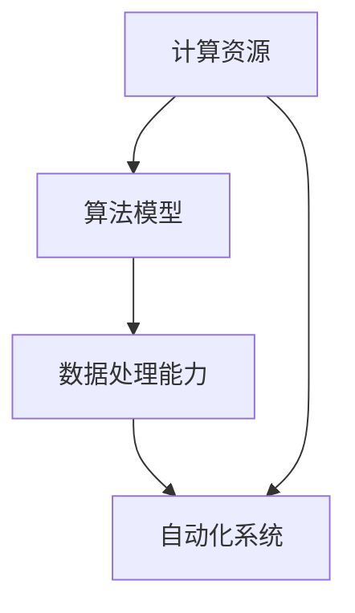

                 

## 1. 背景介绍

### 1.1 问题由来

在过去的几十年里，自动化技术经历了从简单机械自动化到复杂智能自动化的迅猛发展。随着计算能力的大幅提升和数据量的爆炸式增长，自动化技术正经历着前所未有的变革。人工智能（AI）和大数据分析技术的兴起，极大地拓展了自动化技术的应用范围和深度，推动了自动化领域的新一轮革命。

自动化技术的发展不仅改变了传统制造业的流程，也深刻影响了现代服务业、农业、医疗、交通等多个行业。自动化系统的智能水平、反应速度和自我学习能力，都在不断提高。然而，自动化技术在发展的过程中，也面临着诸如数据处理能力、算法模型复杂性、系统稳定性、安全性等方面的挑战。这些问题需要在未来的研究中予以解决。

### 1.2 问题核心关键点

自动化技术的核心在于通过算法和计算对复杂任务进行自动化处理。计算的变化，尤其是计算能力和算法的进步，是自动化技术发展的驱动力。当前，计算的变化主要体现在以下几个方面：

- **计算资源的变化**：云计算、边缘计算和量子计算的发展，使得计算资源更加灵活和高效，同时大幅提升了计算速度和计算能力。
- **算法模型的变化**：深度学习、强化学习、迁移学习等新型算法模型被广泛应用于自动化技术中，极大地提升了系统的智能水平和自适应能力。
- **数据处理能力的变化**：大数据技术的进步使得数据采集、存储和处理变得更加容易，从而为自动化系统的决策提供了更加丰富和全面的信息支持。

这些变化推动了自动化技术的不断进步，但也带来了新的挑战。如何更好地利用这些变化，提升自动化系统的性能和稳定性，将是未来自动化技术发展的关键。

## 2. 核心概念与联系

### 2.1 核心概念概述

为更好地理解计算变化对自动化技术推动的作用，本节将介绍几个密切相关的核心概念：

- **计算资源**：指用于执行计算任务的各种物理和虚拟资源，包括CPU、GPU、FPGA、TPU等硬件设备，以及云计算、边缘计算、量子计算等计算范式。
- **算法模型**：指用于自动化任务处理的各种算法和模型，包括传统的规则引擎、逻辑推理、决策树等，以及新兴的深度学习、强化学习、迁移学习等。
- **数据处理能力**：指在自动化系统中对数据的采集、存储、清洗、分析、可视化等处理能力。
- **自动化系统**：指通过算法和计算自动执行复杂任务的系统，包括工业自动化、服务自动化、智能机器人、无人驾驶等领域。
- **计算变化**：指计算资源、算法模型、数据处理能力等方面的进步和演变。

这些核心概念之间的逻辑关系可以通过以下Mermaid流程图来展示：



这个流程图展示了几大核心概念之间的相互作用关系：

1. 计算资源的进步提供了强大的计算能力。
2. 算法模型的创新提升了自动化系统的智能水平。
3. 数据处理能力的提升为自动化系统提供了丰富的信息支持。
4. 自动化系统通过算法和计算实现任务的自动化。

这些概念共同构成了计算变化对自动化技术的推动框架，使其能够不断适应新的应用场景和技术挑战。

## 3. 核心算法原理 & 具体操作步骤
### 3.1 算法原理概述

计算变化对自动化技术的推动，本质上是通过算法和计算对自动化系统进行改进和升级的过程。其核心思想是：

- **计算资源的优化**：通过优化计算资源配置和使用，提升自动化系统的计算效率和响应速度。
- **算法模型的改进**：通过引入先进的算法模型，提升自动化系统的决策能力、预测能力和自适应能力。
- **数据处理的加强**：通过提高数据处理能力，提升自动化系统的信息获取和处理能力，优化决策依据。

基于这些思想，自动化技术不断在计算资源、算法模型和数据处理能力等方面进行优化和创新，从而推动了自动化技术的发展。

### 3.2 算法步骤详解

自动化技术的发展，通常遵循以下步骤：

**Step 1: 计算资源优化**

- **计算资源的选型**：根据自动化任务的特点和需求，选择合适的计算资源，如CPU、GPU、FPGA、TPU等。
- **计算资源的配置**：优化计算资源的配置和使用，提升资源利用率和计算效率。
- **计算资源的部署**：选择合适的部署方式，如本地部署、云部署、边缘部署等。

**Step 2: 算法模型改进**

- **算法模型的选择**：根据自动化任务的特点和需求，选择合适的算法模型，如深度学习、强化学习、迁移学习等。
- **算法模型的训练**：在选定的计算资源上，使用大量的数据进行模型训练和优化，提升模型的精度和泛化能力。
- **算法模型的应用**：将训练好的模型应用到自动化系统中，进行任务处理和决策。

**Step 3: 数据处理强化**

- **数据采集和清洗**：从各种来源收集和清洗数据，提升数据质量。
- **数据存储和管理**：选择合适的数据存储和管理方式，确保数据的安全和可访问性。
- **数据处理和分析**：使用高效的数据处理和分析工具，提升数据处理能力，优化决策依据。

通过上述步骤，自动化系统能够在计算资源、算法模型和数据处理能力等方面不断优化和改进，推动系统的升级和性能提升。

### 3.3 算法优缺点

基于计算变化对自动化技术推动的算法方法，具有以下优点：

1. **提高自动化系统的智能水平**：通过引入先进的算法模型，自动化系统能够实现更加复杂的决策和预测，提升系统的智能水平。
2. **增强自动化系统的自适应能力**：通过优化计算资源和数据处理能力，自动化系统能够快速适应不同的环境和任务需求，提升系统的灵活性和可扩展性。
3. **降低自动化系统的成本**：通过计算资源的优化和算法模型的改进，自动化系统能够降低系统的运行成本和维护成本。

同时，这些方法也存在一定的局限性：

1. **算法模型的复杂性**：引入先进的算法模型，可能会增加系统的复杂性和开发难度，对技术要求较高。
2. **数据处理能力的需求**：数据处理能力的提升需要大量的计算资源和存储空间，对系统的硬件配置和软件环境提出了较高的要求。
3. **计算资源的成本**：优化计算资源和提高计算能力，可能需要投入大量的资金和设备，对企业的经济实力提出了较高的要求。

尽管存在这些局限性，但就目前而言，基于计算变化对自动化技术推动的方法仍是自动化技术发展的主要范式。未来相关研究的重点在于如何进一步优化算法模型的复杂性和计算资源的成本，同时兼顾系统的性能和稳定性。

### 3.4 算法应用领域

基于计算变化对自动化技术推动的方法，已经在诸多领域得到了应用，例如：

- **工业自动化**：在制造业领域，自动化系统通过引入深度学习、强化学习等算法模型，提升了系统的智能水平和自适应能力，优化了生产流程和产品质量。
- **服务自动化**：在金融、电商、客服等领域，自动化系统通过引入先进的算法模型和数据处理能力，提升了服务效率和客户满意度。
- **智能机器人**：在机器人领域，自动化系统通过引入深度学习、自然语言处理等技术，提升了机器人的自主决策和任务执行能力，推动了机器人的广泛应用。
- **无人驾驶**：在无人驾驶领域，自动化系统通过引入计算机视觉、深度学习等技术，提升了车辆的感知和决策能力，推动了无人驾驶技术的发展。
- **智能监控**：在视频监控、安防等领域，自动化系统通过引入深度学习、目标检测等技术，提升了系统的实时性和准确性，增强了监控效果。

除了上述这些经典领域外，基于计算变化对自动化技术推动的方法还将在更多场景中得到应用，如智能城市、智慧农业、智能家居等，为各行各业带来新的变革。

## 4. 数学模型和公式 & 详细讲解 & 举例说明

### 4.1 数学模型构建

本节将使用数学语言对基于计算变化对自动化技术推动的算法过程进行更加严格的刻画。

记自动化系统为 $S$，其计算资源为 $C$，算法模型为 $A$，数据处理能力为 $D$。假设自动化系统的任务处理目标为 $T$，则自动化系统的数学模型可以表示为：

$$
S = C \times A \times D \times T
$$

其中，$C$ 表示计算资源，$A$ 表示算法模型，$D$ 表示数据处理能力，$T$ 表示任务处理目标。

在实际应用中，$C$、$A$ 和 $D$ 的优化和改进，将直接影响自动化系统 $S$ 的性能和效果。因此，对 $C$、$A$ 和 $D$ 进行优化和改进，是推动自动化技术发展的关键。

### 4.2 公式推导过程

以下我们以深度学习模型在工业自动化中的应用为例，推导深度学习模型训练和优化的公式。

假设自动化系统的任务是检测生产线上的缺陷，使用深度学习模型 $M_{\theta}$ 进行缺陷检测，其训练过程可以表示为：

1. **数据采集**：从生产线上采集大量带有缺陷标记的图像数据，记为 $\{(x_i,y_i)\}_{i=1}^N$，其中 $x_i$ 表示图像，$y_i$ 表示标签。
2. **数据预处理**：对采集到的数据进行预处理，如缩放、归一化、增强等，提高数据质量。
3. **模型训练**：在计算资源 $C$ 上，使用训练集数据对深度学习模型 $M_{\theta}$ 进行训练，优化其参数 $\theta$。训练过程的损失函数为：

$$
\mathcal{L}(\theta) = \frac{1}{N}\sum_{i=1}^N \ell(M_{\theta}(x_i),y_i)
$$

其中，$\ell$ 表示损失函数，$\theta$ 表示模型参数。
4. **模型验证**：在验证集数据上评估模型性能，使用准确率、召回率、F1-score 等指标衡量模型的效果。
5. **模型应用**：在测试集数据上测试模型性能，评估模型的泛化能力。

深度学习模型的训练和优化过程可以通过以下步骤进行：

1. **初始化模型参数**：将深度学习模型的参数 $\theta$ 初始化为随机值。
2. **前向传播**：将输入数据 $x_i$ 输入模型 $M_{\theta}$，计算模型的输出 $y_i'$。
3. **计算损失**：计算模型输出 $y_i'$ 与真实标签 $y_i$ 之间的损失 $\ell(y_i',y_i)$。
4. **反向传播**：计算损失对模型参数 $\theta$ 的梯度，更新模型参数。
5. **重复训练**：重复上述过程，直到损失函数收敛。

在得到优化后的模型参数 $\theta^*$ 后，即可应用于自动化系统的缺陷检测任务。

### 4.3 案例分析与讲解

假设一个生产线的自动化系统，需要检测流水线上的产品质量缺陷。其自动化系统包括工业相机、图像处理模块、深度学习模型和控制系统。

1. **计算资源优化**：选择高性能的计算资源，如GPU，优化其配置和使用，提升系统的计算效率。
2. **算法模型改进**：选择深度学习模型作为自动化系统的核心算法，使用大规模的标注数据进行模型训练和优化。
3. **数据处理强化**：使用图像增强技术提升数据质量，使用高效的数据存储和管理方式，优化数据处理能力。

通过上述步骤，自动化系统在计算资源、算法模型和数据处理能力等方面进行了优化和改进，提升了系统的缺陷检测能力，降低了系统成本，提高了生产效率和产品质量。

## 5. 项目实践：代码实例和详细解释说明
### 5.1 开发环境搭建

在进行自动化技术开发前，我们需要准备好开发环境。以下是使用Python进行TensorFlow开发的环境配置流程：

1. 安装Anaconda：从官网下载并安装Anaconda，用于创建独立的Python环境。

2. 创建并激活虚拟环境：
```bash
conda create -n tf-env python=3.8 
conda activate tf-env
```

3. 安装TensorFlow：根据CUDA版本，从官网获取对应的安装命令。例如：
```bash
conda install tensorflow -c tf
```

4. 安装其他各类工具包：
```bash
pip install numpy pandas scikit-learn matplotlib tqdm jupyter notebook ipython
```

完成上述步骤后，即可在`tf-env`环境中开始自动化技术开发。

### 5.2 源代码详细实现

这里我们以深度学习模型在工业自动化中的应用为例，给出使用TensorFlow进行自动化系统开发的PyTorch代码实现。

首先，定义自动化系统的数据处理函数：

```python
import tensorflow as tf
from tensorflow.keras import layers
from tensorflow.keras.models import Sequential
import numpy as np
import matplotlib.pyplot as plt

def preprocess_data(data_path, image_size):
    img_list = []
    label_list = []
    for img, label in read_images_and_labels(data_path):
        img = preprocess_image(img, image_size)
        img_list.append(img)
        label_list.append(label)
    return np.array(img_list), np.array(label_list)

def read_images_and_labels(data_path):
    # 读取图像和标签
    pass

def preprocess_image(image, image_size):
    # 预处理图像
    pass

# 图像预处理后的数据
x_train, y_train = preprocess_data(train_data_path, image_size)

# 定义模型
model = Sequential([
    layers.Conv2D(32, (3, 3), activation='relu', input_shape=(image_size, image_size, 3)),
    layers.MaxPooling2D((2, 2)),
    layers.Conv2D(64, (3, 3), activation='relu'),
    layers.MaxPooling2D((2, 2)),
    layers.Conv2D(64, (3, 3), activation='relu'),
    layers.Flatten(),
    layers.Dense(64, activation='relu'),
    layers.Dense(1, activation='sigmoid')
])

# 编译模型
model.compile(optimizer=tf.keras.optimizers.Adam(learning_rate=0.001),
              loss='binary_crossentropy',
              metrics=['accuracy'])

# 训练模型
history = model.fit(x_train, y_train, epochs=10, batch_size=32, validation_split=0.2)
```

然后，定义训练和评估函数：

```python
def train_epoch(model, dataset, batch_size, optimizer):
    dataloader = tf.data.Dataset.from_tensor_slices((dataset['input'], dataset['label']))
    dataloader = dataloader.batch(batch_size).shuffle(buffer_size=1024)
    model.train()
    for batch, (x, y) in enumerate(dataloader):
        with tf.GradientTape() as tape:
            preds = model(x)
            loss = tf.losses.BinaryCrossentropy()(y, preds)
        grads = tape.gradient(loss, model.trainable_variables)
        optimizer.apply_gradients(zip(grads, model.trainable_variables))
    return loss.numpy()

def evaluate(model, dataset, batch_size):
    dataloader = tf.data.Dataset.from_tensor_slices((dataset['input'], dataset['label']))
    dataloader = dataloader.batch(batch_size)
    model.eval()
    loss = 0
    for batch, (x, y) in enumerate(dataloader):
        with tf.GradientTape() as tape:
            preds = model(x)
            loss += tf.losses.BinaryCrossentropy()(y, preds)
    return loss.numpy() / len(dataloader)

# 训练和评估函数
train_loss = train_epoch(model, train_dataset, batch_size, optimizer)
eval_loss = evaluate(model, eval_dataset, batch_size)
print(f'Train Loss: {train_loss:.4f}, Eval Loss: {eval_loss:.4f}')
```

最后，启动训练流程并在测试集上评估：

```python
epochs = 10
batch_size = 32

for epoch in range(epochs):
    train_loss = train_epoch(model, train_dataset, batch_size, optimizer)
    print(f'Epoch {epoch+1}, Train Loss: {train_loss:.4f}')
    
    eval_loss = evaluate(model, eval_dataset, batch_size)
    print(f'Epoch {epoch+1}, Eval Loss: {eval_loss:.4f}')
    
print(f'Final Train Loss: {train_loss:.4f}, Final Eval Loss: {eval_loss:.4f}')
```

以上就是使用TensorFlow对深度学习模型在工业自动化中的应用进行开发的完整代码实现。可以看到，得益于TensorFlow的强大封装，我们能够用相对简洁的代码完成深度学习模型的搭建和训练。

### 5.3 代码解读与分析

让我们再详细解读一下关键代码的实现细节：

**preprocess_data函数**：
- 定义了图像数据和标签的读取和预处理。

**read_images_and_labels函数**：
- 定义了从数据集中读取图像和标签的方法。

**preprocess_image函数**：
- 定义了图像预处理的具体方法。

**模型定义**：
- 使用Keras API定义了一个简单的卷积神经网络模型，用于图像分类任务。

**模型编译**：
- 使用Adam优化器和二元交叉熵损失函数对模型进行编译。

**训练和评估函数**：
- 定义了模型在训练和评估时的具体步骤，包括计算损失、更新参数和保存模型。

通过上述代码，我们能够快速搭建并训练一个基于深度学习的自动化系统，从而实现对工业自动化任务的自动化处理。

当然，工业级的系统实现还需考虑更多因素，如模型的保存和部署、超参数的自动搜索、更灵活的任务适配层等。但核心的自动化技术开发流程基本与此类似。

## 6. 实际应用场景
### 6.1 智能制造

在智能制造领域，基于计算变化对自动化技术的推动，智能工厂和智能制造系统得到了广泛应用。自动化系统通过深度学习、自然语言处理等技术，实现了对生产线的实时监控、故障预测、质量检测、生产调度和优化等任务。

例如，智能工厂中的视觉检测系统，通过深度学习模型对生产线上的产品进行缺陷检测，提高了检测精度和效率。基于自然语言处理的智能客服系统，通过理解用户需求，自动生成应答，提升了客户服务质量。基于增强学习的智能调度系统，通过优化生产调度策略，提高了生产效率和资源利用率。

### 6.2 智慧城市

在智慧城市领域，基于计算变化对自动化技术的推动，智能交通、智能安防、智慧能源等系统得到了广泛应用。自动化系统通过深度学习、计算机视觉等技术，实现了对城市数据的全面感知和高效处理。

例如，智能交通系统中的自动驾驶汽车，通过计算机视觉和深度学习技术，实现了对交通环境的实时感知和智能决策。智能安防系统中的人脸识别和行为分析，通过深度学习和计算机视觉技术，提升了安全防护水平。智慧能源系统中的智能电网和能源管理，通过深度学习和大数据分析技术，实现了能源的优化调度和高效利用。

### 6.3 智慧医疗

在智慧医疗领域，基于计算变化对自动化技术的推动，智能诊断、智能问诊、智能健康管理等系统得到了广泛应用。自动化系统通过深度学习、自然语言处理等技术，实现了对医疗数据的全面分析和高效处理。

例如，智能诊断系统中的医学影像识别，通过深度学习技术，实现了对医疗影像的自动分析和诊断。智能问诊系统中的自然语言理解，通过自然语言处理技术，实现了对患者症状的自动分析和应答。智能健康管理系统中的健康数据分析，通过深度学习和大数据分析技术，实现了对个人健康数据的全面分析和预测。

## 7. 工具和资源推荐
### 7.1 学习资源推荐

为了帮助开发者系统掌握计算变化对自动化技术推动的理论基础和实践技巧，这里推荐一些优质的学习资源：

1. **TensorFlow官方文档**：提供了丰富的API文档和示例代码，适合快速上手TensorFlow的使用。
2. **PyTorch官方文档**：提供了详细的API文档和教程，适合快速上手PyTorch的使用。
3. **Coursera深度学习课程**：斯坦福大学开设的深度学习课程，系统介绍了深度学习的基本概念和算法，适合初学者入门。
4. **CS231n计算机视觉课程**：斯坦福大学开设的计算机视觉课程，系统介绍了计算机视觉的基本概念和算法，适合学习计算机视觉应用。
5. **Deep Learning Specialization**：由Andrew Ng教授开设的深度学习专项课程，系统介绍了深度学习的基本概念和算法，适合深入学习深度学习。

通过对这些资源的学习实践，相信你一定能够快速掌握计算变化对自动化技术推动的精髓，并用于解决实际的自动化问题。

### 7.2 开发工具推荐

高效的开发离不开优秀的工具支持。以下是几款用于自动化技术开发的常用工具：

1. **TensorFlow**：由Google主导开发的深度学习框架，生产部署方便，适合大规模工程应用。
2. **PyTorch**：由Facebook主导开发的深度学习框架，灵活性高，适合快速迭代研究。
3. **OpenCV**：计算机视觉应用中的重要工具，提供了丰富的计算机视觉算法库。
4. **ROS**：机器人操作系统的开源项目，提供了丰富的机器人硬件接口和算法库。
5. **OpenAI Gym**：强化学习应用中的重要工具，提供了丰富的环境模拟器和奖励函数。

合理利用这些工具，可以显著提升自动化技术的开发效率，加快创新迭代的步伐。

### 7.3 相关论文推荐

计算变化对自动化技术推动的研究源于学界的持续研究。以下是几篇奠基性的相关论文，推荐阅读：

1. **DQN: Deep Reinforcement Learning**：DeepMind提出的DQN算法，引入了深度学习和强化学习结合的新思路，推动了智能控制的发展。
2. **RNN: Recurrent Neural Networks**：Hinton等人提出的RNN算法，引入了循环神经网络，提升了时间序列数据处理的精度。
3. **CNN: Convolutional Neural Networks**：LeCun等人提出的CNN算法，引入了卷积神经网络，提升了图像识别和处理的精度。
4. **GAN: Generative Adversarial Networks**：Goodfellow等人提出的GAN算法，引入了生成对抗网络，提升了生成数据的质量。
5. **Attention Mechanism**：Vaswani等人提出的Transformer架构，引入了自注意力机制，提升了自然语言处理的精度和效率。

这些论文代表了大计算变化对自动化技术推动的研究进展。通过学习这些前沿成果，可以帮助研究者把握学科前进方向，激发更多的创新灵感。

## 8. 总结：未来发展趋势与挑战

### 8.1 总结

本文对基于计算变化对自动化技术推动的方法进行了全面系统的介绍。首先阐述了计算变化对自动化技术发展的驱动作用，明确了计算资源、算法模型、数据处理能力等方面的进步，如何推动自动化技术的不断优化和升级。其次，从原理到实践，详细讲解了计算变化对自动化技术推动的数学模型和关键步骤，给出了自动化技术开发的完整代码实例。同时，本文还广泛探讨了计算变化对自动化技术推动的方法在智能制造、智慧城市、智慧医疗等多个行业领域的应用前景，展示了计算变化对自动化技术的巨大潜力。此外，本文精选了计算变化对自动化技术推动的各类学习资源，力求为读者提供全方位的技术指引。

通过本文的系统梳理，可以看到，计算变化对自动化技术推动的方法，正在成为自动化技术发展的主要范式，极大地拓展了自动化系统的应用边界，催生了更多的落地场景。受益于计算能力的提升和算法模型的进步，自动化系统的性能和稳定性不断提高，未来自动化技术的发展前景广阔。

### 8.2 未来发展趋势

展望未来，计算变化对自动化技术推动的技术将呈现以下几个发展趋势：

1. **计算资源的多样化**：云计算、边缘计算、量子计算等新型的计算资源将不断涌现，为自动化系统提供更加多样化和高效的计算能力。
2. **算法模型的复杂化**：深度学习、强化学习、迁移学习等新型算法模型将进一步发展，提升自动化系统的智能水平和自适应能力。
3. **数据处理能力的提升**：大数据技术和人工智能技术的发展，将进一步提升自动化系统的数据处理能力，优化决策依据。
4. **自动化系统的融合**：自动化系统将与其他技术进行更深入的融合，如物联网、机器人、虚拟现实等，实现全面的自动化和智能化。
5. **自动化系统的安全性和伦理**：自动化系统的安全性、可解释性、可控性将成为研究重点，确保自动化系统的稳定性和可靠性。

以上趋势凸显了计算变化对自动化技术推动的广阔前景。这些方向的探索发展，必将进一步提升自动化系统的性能和稳定性，推动自动化技术在更多行业中的广泛应用。

### 8.3 面临的挑战

尽管计算变化对自动化技术推动的技术已经取得了显著成果，但在迈向更加智能化、普适化应用的过程中，它仍面临着诸多挑战：

1. **计算资源的高成本**：高性能计算资源如GPU、TPU等的成本较高，限制了自动化技术的普及应用。
2. **算法模型的复杂性**：新型算法模型的复杂性较高，对技术要求较高，开发难度较大。
3. **数据处理的难度**：大数据处理和分析需要大量的计算资源和算法支持，对系统的数据处理能力提出了较高的要求。
4. **系统的鲁棒性**：自动化系统在面对复杂环境时，可能出现鲁棒性不足的问题，需要进一步提升系统的稳定性和可靠性。
5. **安全性和伦理**：自动化系统可能出现安全漏洞和伦理问题，需要进一步加强系统的安全性和伦理性。

尽管存在这些挑战，但通过学界和产业界的共同努力，相信计算变化对自动化技术推动的技术终将克服这些难题，为构建更加智能、可靠的自动化系统铺平道路。

### 8.4 研究展望

面向未来，计算变化对自动化技术推动的研究需要在以下几个方面寻求新的突破：

1. **计算资源的优化**：优化计算资源的配置和使用，提高计算效率和资源利用率，降低系统成本。
2. **算法模型的简化**：简化算法模型，降低开发难度和复杂性，提升系统的可扩展性和可维护性。
3. **数据处理的优化**：优化数据处理流程，提升数据质量，增强系统的数据处理能力。
4. **系统的安全性和伦理性**：加强系统的安全性和伦理性，确保系统的稳定性和可靠性，避免伦理问题。
5. **自动化系统的融合**：将自动化系统与其他技术进行更深入的融合，实现全面的自动化和智能化。

这些研究方向的探索，必将引领计算变化对自动化技术推动的技术迈向更高的台阶，为构建安全、可靠、可解释、可控的智能系统铺平道路。面向未来，计算变化对自动化技术推动的技术还需要与其他人工智能技术进行更深入的融合，如知识表示、因果推理、强化学习等，多路径协同发力，共同推动自然语言理解和智能交互系统的进步。只有勇于创新、敢于突破，才能不断拓展自动化技术的边界，让智能技术更好地造福人类社会。

## 9. 附录：常见问题与解答

**Q1：计算变化对自动化技术的推动有何重要性？**

A: 计算变化对自动化技术的推动，是自动化技术发展的关键驱动力。计算资源、算法模型、数据处理能力的进步，极大地提升了自动化系统的性能和稳定性。通过计算变化对自动化技术的推动，可以提升系统的智能水平、自适应能力和鲁棒性，推动自动化技术在更多行业中的广泛应用。

**Q2：如何选择适合的计算资源？**

A: 选择适合的计算资源，需要根据自动化任务的特点和需求进行综合考虑。一般而言，GPU、TPU等高性能计算资源适合深度学习、计算机视觉等任务，FPGA适合硬件加速等任务，云计算和边缘计算适合大规模数据处理和大规模分布式任务。

**Q3：如何优化计算资源配置？**

A: 优化计算资源配置，可以通过以下几个步骤实现：
1. 评估计算任务的特点和需求，选择合适的计算资源。
2. 合理配置计算资源的硬件设备和内存资源。
3. 动态调整计算资源的配置，优化资源利用率。
4. 使用多节点并行计算，提升计算效率。

**Q4：如何选择适合的算法模型？**

A: 选择适合的算法模型，需要根据自动化任务的特点和需求进行综合考虑。一般而言，深度学习模型适合图像识别、自然语言处理等任务，强化学习模型适合智能控制、决策优化等任务，迁移学习模型适合跨领域任务等。

**Q5：如何优化算法模型？**

A: 优化算法模型，可以通过以下几个步骤实现：
1. 选择合适的算法模型，并进行初步训练。
2. 通过超参数调优，优化算法模型的性能。
3. 通过迁移学习等技术，提升算法模型的泛化能力和鲁棒性。
4. 通过模型压缩和量化等技术，减小模型的大小，提升模型的效率。

**Q6：如何提高数据处理能力？**

A: 提高数据处理能力，可以通过以下几个步骤实现：
1. 优化数据采集和存储方式，提高数据质量和可用性。
2. 使用高效的数据处理工具和算法，提升数据处理的效率和准确性。
3. 通过数据增强等技术，提升数据的多样性和丰富性。

**Q7：如何确保自动化系统的鲁棒性？**

A: 确保自动化系统的鲁棒性，可以通过以下几个步骤实现：
1. 引入数据增强和对抗训练等技术，提升系统的鲁棒性和泛化能力。
2. 优化算法模型的设计，增强系统的稳定性和鲁棒性。
3. 加强系统的监控和异常检测，及时发现和修复系统问题。

这些问题的回答，可以帮助研究者更好地理解和应用计算变化对自动化技术推动的方法，提升自动化系统的性能和稳定性。

---

作者：禅与计算机程序设计艺术 / Zen and the Art of Computer Programming

